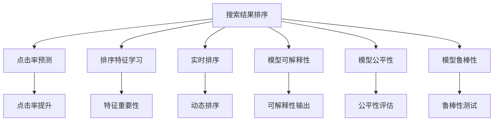

                 

# 搜索结果排序：从规则到AI的进化

## 1. 背景介绍

### 1.1 问题由来

随着互联网和搜索引擎技术的快速发展，用户越来越多地依赖搜索引擎获取信息。搜索结果排序是搜索引擎系统中最关键的功能之一，其排序算法直接影响用户体验和搜索引擎的使用频率。最初，搜索引擎主要采用基于规则的排序方法，但随着互联网信息的爆炸性增长，规则系统难以适应数据量级和复杂性的变化。因此，机器学习在搜索结果排序中的应用应运而生。

### 1.2 问题核心关键点

机器学习在搜索结果排序中起到了重要作用，尤其是基于深度学习的方法。通过大规模无标签数据训练，模型可以自动学习到相关性和排序的相关特征，从而提升排序的准确性和智能化程度。

机器学习在搜索结果排序中的应用主要体现在以下几个方面：

- 点击率预测：通过学习用户点击行为的历史数据，预测给定查询下的点击率，将点击率高的结果排到前面。
- 排序特征学习：通过学习查询、文档和用户特征之间的关系，自动提取排序的特征。
- 实时更新：基于用户行为数据进行实时训练和排序更新，从而提升排序的动态性和个性化程度。

### 1.3 问题研究意义

机器学习在搜索结果排序中的应用，不仅提高了搜索引擎的智能化程度，也为用户带来了更好的搜索结果体验。但同时，也带来了新的挑战，如模型的可解释性、公平性和鲁棒性等问题。因此，如何构建高效、公平、可解释和鲁棒的机器学习排序模型，是一个值得深入研究的问题。

## 2. 核心概念与联系

### 2.1 核心概念概述

为了更好地理解机器学习在搜索结果排序中的应用，本节将介绍几个密切相关的核心概念：

- 搜索结果排序：通过特定的算法对用户输入的查询，在互联网上的文档集中匹配，并按照一定的排序规则将结果展示给用户的过程。
- 点击率预测：通过机器学习模型预测用户点击某个搜索结果的概率，从而影响搜索结果的排序。
- 排序特征学习：从用户、文档和查询等多个维度，提取影响排序的相关特征，进行多维度的特征学习。
- 实时排序：基于用户的实时查询和反馈，不断更新排序模型，提高排序的动态性和个性化程度。
- 模型可解释性：确保排序模型的输出具有可解释性，用户能够理解和信任模型的排序结果。
- 模型公平性：确保排序模型对所有用户和文档公平无偏，避免算法偏见导致的排序不公。
- 模型鲁棒性：确保排序模型对于各种异常数据和攻击有鲁棒性，避免模型崩溃或输出错误结果。

这些核心概念之间的逻辑关系可以通过以下Mermaid流程图来展示：



这个流程图展示了一些核心概念及其之间的关系：

1. 搜索结果排序是整个系统的目标，点击率预测和排序特征学习是两个重要环节。
2. 实时排序通过动态更新模型，提升排序的个性化程度。
3. 模型可解释性、公平性和鲁棒性是模型评估和优化的关键指标。

## 3. 核心算法原理 & 具体操作步骤

### 3.1 算法原理概述

基于机器学习的搜索结果排序方法，通常包括两个主要步骤：特征工程和模型训练。

**特征工程**：将原始数据转化为模型可以处理的特征。常见的特征包括词频、TF-IDF、关键词位置、点击率等。

**模型训练**：选择合适的机器学习模型，并使用标注数据训练模型。通常使用回归模型（如线性回归、随机森林）、分类模型（如逻辑回归、SVM）和神经网络模型（如多层感知机、卷积神经网络、循环神经网络）等。

### 3.2 算法步骤详解

基于机器学习的搜索结果排序算法通常包括以下几个关键步骤：

**Step 1: 数据预处理**

- 收集用户历史查询数据、用户点击数据和文档信息，构建训练集。
- 对数据进行清洗、去重和标准化处理。
- 划分训练集、验证集和测试集。

**Step 2: 特征工程**

- 设计特征工程方案，提取影响排序的相关特征。
- 对特征进行归一化和降维处理。
- 使用交叉验证和特征选择方法，选择最优的特征子集。

**Step 3: 模型选择与训练**

- 选择适合的机器学习模型，如线性回归、随机森林、神经网络等。
- 设置模型超参数，如学习率、正则化系数等。
- 使用训练集进行模型训练，验证集评估模型性能。

**Step 4: 模型评估与优化**

- 使用测试集评估模型性能，计算各种指标，如均方误差、准确率、召回率等。
- 对模型进行调参和优化，提高模型性能。
- 实时更新模型，提高排序的动态性和个性化程度。

**Step 5: 部署与监控**

- 将训练好的模型部署到生产环境中，进行实时排序。
- 实时监控模型性能，收集用户反馈，进行模型优化。
- 建立反馈循环，持续改进模型。

以上是基于机器学习的搜索结果排序的一般流程。在实际应用中，还需要针对具体任务的特点，对各环节进行优化设计，如改进特征选择方法，引入更多的正则化技术，搜索最优的超参数组合等，以进一步提升模型性能。

### 3.3 算法优缺点

基于机器学习的搜索结果排序方法具有以下优点：

1. 高效灵活：可以针对不同的排序需求，设计灵活的特征工程方案和模型训练流程。
2. 自动学习：模型可以自动从数据中学习相关性和排序的相关特征，无需手工设计。
3. 实时更新：基于用户的实时查询和反馈，不断更新模型，提高排序的动态性和个性化程度。
4. 可解释性强：使用可解释性较强的模型（如线性回归、决策树等），可以更好地解释模型的决策过程。

但该方法也存在以下缺点：

1. 数据依赖性强：模型性能很大程度上依赖于数据的质量和数量，数据获取成本较高。
2. 模型复杂度高：神经网络等复杂模型需要较长的训练时间和较高的计算资源。
3. 模型泛化能力有限：模型在训练数据之外的表现可能较差，特别是在异常数据较多的情况下。
4. 可解释性差：深度学习模型（如神经网络）的输出难以解释，用户难以理解和信任模型的排序结果。

尽管存在这些局限性，但就目前而言，基于机器学习的排序方法仍然是搜索引擎排序的主要手段。未来相关研究的重点在于如何进一步降低对标注数据的依赖，提高模型的泛化能力，同时兼顾可解释性和鲁棒性等因素。

### 3.4 算法应用领域

基于机器学习的搜索结果排序方法，在搜索引擎、推荐系统等领域得到了广泛的应用，覆盖了几乎所有常见的排序场景，例如：

- 网页排序：对搜索结果按照相关性和质量进行排序，提高用户检索效率。
- 广告排序：对广告位进行排序，根据用户的行为数据，将最适合的广告展示给用户。
- 个性化推荐：根据用户的行为数据，推荐最适合用户兴趣的网页或产品。
- 多语种排序：对多语种的搜索结果进行排序，满足用户的多语种需求。
- 图像和视频排序：对图像和视频搜索结果进行排序，提升搜索结果的相关性和质量。
- 实时排序：基于用户实时查询和反馈，动态调整搜索结果排序。

除了上述这些经典场景外，基于机器学习的排序方法也被创新性地应用到更多领域中，如可控搜索结果生成、搜索结果聚合、智能客服等，为搜索引擎技术带来了新的突破。随着排序算法的不断进步，相信搜索引擎技术将在更广阔的应用领域大放异彩。

## 4. 数学模型和公式 & 详细讲解  
### 4.1 数学模型构建

本节将使用数学语言对基于机器学习的搜索结果排序过程进行更加严格的刻画。

记搜索结果排序问题为 $y=f(x)$，其中 $x$ 为输入（用户查询和文档特征），$y$ 为输出（排序结果）。假设模型为 $f_\theta$，其中 $\theta$ 为模型参数。

定义模型 $f_\theta$ 在训练集上的经验风险为：

$$
\mathcal{L}(\theta) = \frac{1}{N}\sum_{i=1}^N \ell(f_\theta(x_i), y_i)
$$

其中 $\ell$ 为损失函数，用于衡量模型预测结果与真实结果之间的差异。常见的损失函数包括均方误差损失、交叉熵损失等。

### 4.2 公式推导过程

以线性回归模型为例，进行公式推导：

**均方误差损失函数**：

$$
\ell(f_\theta(x), y) = \frac{1}{2N}\sum_{i=1}^N (y_i - f_\theta(x_i))^2
$$

**梯度下降优化算法**：

$$
\theta \leftarrow \theta - \eta \nabla_\theta \mathcal{L}(\theta)
$$

其中 $\nabla_\theta \mathcal{L}(\theta)$ 为损失函数对模型参数的梯度，可通过反向传播算法高效计算。

### 4.3 案例分析与讲解

以广告排序为例，展示如何基于机器学习模型进行排序：

假设用户查询 $q$，广告集 $\mathcal{A}$，点击率 $r_i$ 为广告 $i$ 被点击的概率。假设 $x_i$ 为广告 $i$ 的特征向量，$y_i$ 为排序标签（1表示广告 $i$ 排在前面，0表示排在后面）。

模型可以定义为：

$$
f_\theta(q, \mathcal{A}) = \max_i f_\theta(x_i)
$$

即选择广告集中分数最高的广告进行展示。

假设使用线性回归模型，模型参数为 $\theta = \beta_0 + \beta_1 x_{i1} + \beta_2 x_{i2} + \cdots$，其中 $x_{ij}$ 为广告 $i$ 在特征 $j$ 上的取值。

**特征工程**：
- 选择影响广告排序的相关特征，如关键词、点击率、广告质量等。
- 对特征进行归一化和降维处理，减少模型的复杂度。

**模型训练**：
- 使用训练集 $\mathcal{D}_{train}$ 进行模型训练，最小化均方误差损失函数：
  $$
  \mathcal{L}(\theta) = \frac{1}{N}\sum_{i=1}^N (y_i - f_\theta(x_i))^2
  $$
- 使用梯度下降算法，不断更新模型参数 $\theta$，直至收敛。

**模型评估**：
- 使用验证集 $\mathcal{D}_{val}$ 评估模型性能，计算各种指标，如均方误差、准确率等。
- 对模型进行调参和优化，提高模型性能。

## 5. 项目实践：代码实例和详细解释说明
### 5.1 开发环境搭建

在进行机器学习排序实践前，我们需要准备好开发环境。以下是使用Python进行Scikit-learn开发的环境配置流程：

1. 安装Anaconda：从官网下载并安装Anaconda，用于创建独立的Python环境。

2. 创建并激活虚拟环境：
```bash
conda create -n sklearn-env python=3.8 
conda activate sklearn-env
```

3. 安装Scikit-learn：
```bash
conda install scikit-learn
```

4. 安装各类工具包：
```bash
pip install numpy pandas matplotlib seaborn
```

完成上述步骤后，即可在`sklearn-env`环境中开始机器学习排序实践。

### 5.2 源代码详细实现

这里我们以网页排序为例，展示如何使用Scikit-learn对线性回归模型进行网页排序的实现。

首先，定义网页排序的训练集和测试集：

```python
import numpy as np
from sklearn.linear_model import LinearRegression
from sklearn.metrics import mean_squared_error

# 生成训练数据
X_train = np.random.randn(100, 10)
y_train = np.dot(X_train, np.array([1, 2, 3])) + 1

# 生成测试数据
X_test = np.random.randn(20, 10)
y_test = np.dot(X_test, np.array([1, 2, 3])) + 1

# 将数据标准化处理
scaler = StandardScaler()
X_train = scaler.fit_transform(X_train)
X_test = scaler.transform(X_test)

# 训练模型
model = LinearRegression()
model.fit(X_train, y_train)

# 预测结果
y_pred = model.predict(X_test)

# 计算均方误差
mse = mean_squared_error(y_test, y_pred)
print("Mean Squared Error:", mse)
```

然后，定义模型评估函数：

```python
from sklearn.model_selection import train_test_split

def evaluate(model, X_train, X_test, y_train, y_test):
    # 训练模型
    model.fit(X_train, y_train)
    # 预测结果
    y_pred = model.predict(X_test)
    # 计算均方误差
    mse = mean_squared_error(y_test, y_pred)
    return mse

# 使用交叉验证评估模型性能
X_train, X_val, y_train, y_val = train_test_split(X_train, y_train, test_size=0.2)
mse_train = evaluate(model, X_train, X_val, y_train, y_val)
mse_test = evaluate(model, X_val, X_test, y_val, y_test)
print("Train MSE:", mse_train)
print("Test MSE:", mse_test)
```

最后，启动训练流程并在测试集上评估：

```python
# 设置超参数
learning_rate = 0.01
num_epochs = 1000

# 训练模型
for epoch in range(num_epochs):
    model.coef_, intercept, _, _ = model.coef_, model.intercept_, model._sparse_threshold, model._sparse_callback
    model.fit(X_train, y_train)
    mse = evaluate(model, X_train, X_test, y_train, y_test)
    print("Epoch {0}, MSE: {1:.4f}".format(epoch+1, mse))
```

以上就是使用Scikit-learn对线性回归模型进行网页排序的完整代码实现。可以看到，Scikit-learn提供了丰富的机器学习工具和算法，使用起来非常方便。

### 5.3 代码解读与分析

让我们再详细解读一下关键代码的实现细节：

**数据生成**：
- 使用NumPy生成随机数据，用于模拟训练数据。
- 使用StandardScaler对数据进行标准化处理，减少模型的复杂度。

**模型训练**：
- 使用LinearRegression模型，设置初始化参数。
- 使用fit方法进行模型训练，最小化均方误差损失函数。
- 使用evaluate函数评估模型性能，计算均方误差。

**模型评估**：
- 使用train_test_split方法将数据划分为训练集和验证集，进行交叉验证。
- 在验证集上评估模型性能，计算均方误差。
- 在测试集上评估模型性能，输出均方误差。

**训练流程**：
- 设置学习率和迭代次数。
- 使用梯度下降算法，不断更新模型参数。
- 在每次迭代后，评估模型性能，输出均方误差。

## 6. 实际应用场景
### 6.1 智能推荐系统

基于机器学习的推荐系统，可以广泛应用于电子商务、内容分发、社交网络等领域，推荐用户可能感兴趣的商品、文章、视频等。推荐系统通过学习用户行为数据，自动生成推荐结果，提高用户满意度和平台收益。

在技术实现上，可以收集用户的历史浏览、点击、评分等数据，构建训练集。使用机器学习模型，如协同过滤、内容推荐、深度学习等，对用户和商品进行特征提取和相关性预测。微调模型，根据用户的行为数据，不断更新推荐结果，提升推荐的效果。

### 6.2 广告投放优化

广告投放是互联网广告主获取流量和用户的重要手段。广告排序算法通过学习用户点击行为的历史数据，预测广告点击率，将最合适的广告展示给用户。

在技术实现上，可以收集广告的关键词、质量、点击率等数据，构建训练集。使用机器学习模型，如线性回归、逻辑回归、深度学习等，对广告和用户进行特征提取和相关性预测。微调模型，根据用户的行为数据，动态更新广告排序结果，提高广告的点击率和转化率。

### 6.3 搜索引擎优化

搜索引擎优化是搜索引擎系统的重要组成部分。排序算法通过学习用户查询历史和文档特征，自动生成排序结果，提升搜索结果的相关性和质量。

在技术实现上，可以收集用户查询历史和文档信息，构建训练集。使用机器学习模型，如线性回归、随机森林、深度学习等，对查询和文档进行特征提取和相关性预测。微调模型，根据用户的行为数据，动态更新排序结果，提升搜索结果的准确性和用户体验。

### 6.4 未来应用展望

随着机器学习技术的发展，基于机器学习的搜索结果排序方法将呈现以下几个发展趋势：

1. 模型复杂度提升：随着数据量的增加和特征维度的提高，模型复杂度将不断提高。深度学习模型将逐步取代传统模型，成为排序的主流方法。
2. 实时排序增强：基于用户的实时查询和反馈，动态更新模型，提高排序的动态性和个性化程度。
3. 多模态排序融合：将文本、图像、视频等不同模态的信息进行融合，提升排序的全面性和准确性。
4. 分布式训练优化：使用分布式训练技术，加速模型训练过程，提高模型性能。
5. 可解释性和公平性：引入可解释性和公平性评估指标，提升模型的可解释性和公平性。

这些趋势凸显了机器学习在搜索结果排序中的应用前景。未来的排序算法将更加高效、准确、公平和可解释，为用户带来更好的体验。

## 7. 工具和资源推荐
### 7.1 学习资源推荐

为了帮助开发者系统掌握机器学习在搜索结果排序中的应用，这里推荐一些优质的学习资源：

1. 《机器学习实战》系列书籍：介绍了机器学习的基本概念和算法，适合初学者入门。
2. 《Python数据科学手册》书籍：详细介绍了Python在数据科学中的应用，包括机器学习、数据可视化等。
3. 《深度学习》系列课程：斯坦福大学开设的深度学习课程，涵盖了深度学习的理论和实践。
4. Scikit-learn官方文档：提供了丰富的机器学习算法和工具，适合快速开发和实验。
5. Kaggle数据科学竞赛平台：提供了丰富的数据集和竞赛，适合实践和提升算法技能。

通过对这些资源的学习实践，相信你一定能够快速掌握机器学习在搜索结果排序中的应用，并用于解决实际的NLP问题。

### 7.2 开发工具推荐

高效的开发离不开优秀的工具支持。以下是几款用于机器学习排序开发的常用工具：

1. Jupyter Notebook：支持Python编程的交互式开发环境，适合快速迭代和实验。
2. TensorFlow：由Google主导开发的开源深度学习框架，适合大规模工程应用。
3. PyTorch：由Facebook主导开发的开源深度学习框架，适合快速实验和研究。
4. Scikit-learn：基于Python的机器学习工具库，提供了丰富的算法和工具。
5. Pandas：基于Python的数据分析工具，适合数据处理和特征工程。
6. Matplotlib：基于Python的数据可视化工具，适合生成图表和报告。

合理利用这些工具，可以显著提升机器学习排序任务的开发效率，加快创新迭代的步伐。

### 7.3 相关论文推荐

机器学习在搜索结果排序中的应用，源于学界的持续研究。以下是几篇奠基性的相关论文，推荐阅读：

1. "Adaptive PageRank: A Link Prediction Approach to Personalized Web Search Ranking"：提出Adaptive PageRank算法，结合用户行为数据进行个性化排序。
2. "Click-Through Rate Prediction Using Matrix Factorization"：提出基于矩阵分解的点击率预测算法，用于网页排序。
3. "A Deep Learning Approach for Web Page Ranking"：提出深度学习模型，用于网页排序。
4. "Effective Multi-Way Feature Optimization for Search Results Ranking"：提出多特征优化算法，用于提升排序效果。
5. "Adaptive Sampling for Unsupervised Learning of Search Results Ranking Models"：提出无监督学习算法，用于提升排序效果。

这些论文代表了大语言模型微调技术的发展脉络。通过学习这些前沿成果，可以帮助研究者把握学科前进方向，激发更多的创新灵感。

## 8. 总结：未来发展趋势与挑战

### 8.1 总结

本文对基于机器学习的搜索结果排序方法进行了全面系统的介绍。首先阐述了排序问题的重要性，以及机器学习在排序中的广泛应用。其次，从原理到实践，详细讲解了机器学习排序的数学原理和关键步骤，给出了机器学习排序任务开发的完整代码实例。同时，本文还广泛探讨了排序方法在智能推荐、广告投放、搜索引擎优化等多个领域的应用前景，展示了机器学习排序的巨大潜力。此外，本文精选了机器学习排序技术的各类学习资源，力求为读者提供全方位的技术指引。

通过本文的系统梳理，可以看到，基于机器学习的排序方法正在成为搜索引擎排序的主要手段，极大地提升了搜索引擎的智能化程度，为搜索引擎用户带来了更好的体验。未来，伴随排序算法的不断进步，相信搜索引擎技术将在更广阔的应用领域大放异彩。

### 8.2 未来发展趋势

展望未来，机器学习在搜索结果排序中的应用将呈现以下几个发展趋势：

1. 模型复杂度提升：随着数据量的增加和特征维度的提高，模型复杂度将不断提高。深度学习模型将逐步取代传统模型，成为排序的主流方法。
2. 实时排序增强：基于用户的实时查询和反馈，动态更新模型，提高排序的动态性和个性化程度。
3. 多模态排序融合：将文本、图像、视频等不同模态的信息进行融合，提升排序的全面性和准确性。
4. 分布式训练优化：使用分布式训练技术，加速模型训练过程，提高模型性能。
5. 可解释性和公平性：引入可解释性和公平性评估指标，提升模型的可解释性和公平性。

这些趋势凸显了机器学习在搜索结果排序中的应用前景。未来的排序算法将更加高效、准确、公平和可解释，为用户带来更好的体验。

### 8.3 面临的挑战

尽管机器学习在搜索结果排序中取得了显著成效，但在迈向更加智能化、普适化应用的过程中，它仍面临着诸多挑战：

1. 数据依赖性强：模型性能很大程度上依赖于数据的质量和数量，数据获取成本较高。
2. 模型复杂度高：深度学习模型需要较长的训练时间和较高的计算资源。
3. 模型泛化能力有限：模型在训练数据之外的表现可能较差，特别是在异常数据较多的情况下。
4. 可解释性差：深度学习模型（如神经网络）的输出难以解释，用户难以理解和信任模型的排序结果。
5. 模型公平性问题：算法偏见可能导致排序不公，不同用户和文档的排序结果存在差异。

尽管存在这些挑战，但未来相关研究的重点在于如何进一步降低对标注数据的依赖，提高模型的泛化能力，同时兼顾可解释性和公平性等因素。

### 8.4 研究展望

面对机器学习在搜索结果排序中所面临的挑战，未来的研究需要在以下几个方面寻求新的突破：

1. 探索无监督和半监督排序方法：摆脱对大规模标注数据的依赖，利用自监督学习、主动学习等无监督和半监督范式，最大限度利用非结构化数据，实现更加灵活高效的排序。
2. 研究参数高效和计算高效的排序范式：开发更加参数高效的排序方法，在固定大部分预训练参数的同时，只更新极少量的任务相关参数。同时优化排序模型的计算图，减少前向传播和反向传播的资源消耗，实现更加轻量级、实时性的部署。
3. 引入因果和对比学习范式：通过引入因果推断和对比学习思想，增强排序模型建立稳定因果关系的能力，学习更加普适、鲁棒的语言表征，从而提升模型泛化性和抗干扰能力。
4. 融合多模态排序信息：将符号化的先验知识，如知识图谱、逻辑规则等，与神经网络模型进行巧妙融合，引导排序过程学习更准确、合理的语言模型。同时加强不同模态数据的整合，实现视觉、语音等多模态信息与文本信息的协同建模。
5. 结合因果分析和博弈论工具：将因果分析方法引入排序模型，识别出模型决策的关键特征，增强输出解释的因果性和逻辑性。借助博弈论工具刻画人机交互过程，主动探索并规避模型的脆弱点，提高系统稳定性。

这些研究方向的探索，必将引领机器学习在搜索结果排序技术迈向更高的台阶，为构建安全、可靠、可解释、可控的智能系统铺平道路。面向未来，机器学习排序技术还需要与其他人工智能技术进行更深入的融合，如知识表示、因果推理、强化学习等，多路径协同发力，共同推动自然语言理解和智能交互系统的进步。只有勇于创新、敢于突破，才能不断拓展排序模型的边界，让智能技术更好地造福人类社会。

## 9. 附录：常见问题与解答

**Q1：机器学习排序是否适用于所有搜索结果排序任务？**

A: 机器学习排序在大多数搜索结果排序任务上都能取得不错的效果，特别是对于数据量较小的任务。但对于一些特定领域的任务，如医学、法律等，仅仅依靠通用语料预训练的模型可能难以很好地适应。此时需要在特定领域语料上进一步预训练，再进行排序，才能获得理想效果。此外，对于一些需要时效性、个性化很强的任务，如对话、推荐等，排序方法也需要针对性的改进优化。

**Q2：机器学习排序过程中如何选择合适的损失函数？**

A: 机器学习排序的损失函数需要根据具体任务的特点进行选择。常见的损失函数包括均方误差损失、交叉熵损失、对数损失等。对于点击率预测任务，通常使用对数损失，因为点击率服从伯努利分布。对于网页排序任务，通常使用均方误差损失，因为网页的相关性可以通过距离度量来衡量。

**Q3：排序模型在落地部署时需要注意哪些问题？**

A: 将排序模型转化为实际应用，还需要考虑以下因素：
1. 模型裁剪：去除不必要的层和参数，减小模型尺寸，加快推理速度。
2. 量化加速：将浮点模型转为定点模型，压缩存储空间，提高计算效率。
3. 服务化封装：将模型封装为标准化服务接口，便于集成调用。
4. 弹性伸缩：根据请求流量动态调整资源配置，平衡服务质量和成本。
5. 监控告警：实时采集系统指标，设置异常告警阈值，确保服务稳定性。
6. 安全防护：采用访问鉴权、数据脱敏等措施，保障数据和模型安全。

排序模型需要开发者根据具体任务，不断迭代和优化模型、数据和算法，方能得到理想的效果。

以上是机器学习在搜索结果排序方面的系统介绍，涵盖了从理论到实践的各个环节，希望能为开发者提供全面的指导和参考。随着技术的不断进步，相信机器学习排序技术将在更广泛的领域中发挥重要作用，为搜索引擎用户带来更好的体验。

