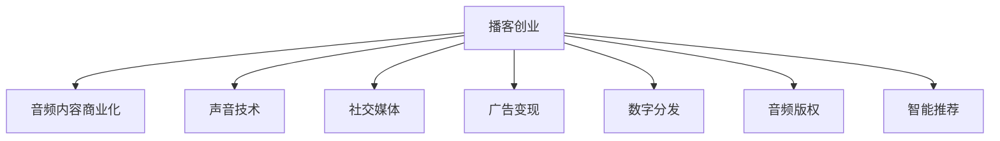

                 

# 播客创业：音频内容的商业化探索

> 关键词：播客创业, 音频内容商业化, 声音技术, 社交媒体, 广告变现, 数字分发, 音频版权, 智能推荐

## 1. 背景介绍

### 1.1 问题由来

随着互联网和移动通信技术的迅猛发展，音频内容已经成为了继视频、图文之后又一大热门的信息载体。播客作为音频内容的代表形式，凭借其丰富的音频资源和互动性强的特点，受到了广泛关注和喜爱。根据Statista的统计，截至2020年，全球播客听众已超5亿，且呈持续增长态势。

然而，播客行业的快速发展也带来了诸多问题。传统的音频内容生产与分发方式已经无法适应当前市场的需求，播客创业者如何有效商业化音频内容，成为一个亟待解决的问题。播客创业既包含了内容制作，也涵盖了技术开发和市场推广等多个环节，要求创业者具备较强的跨领域能力。因此，本文章将围绕播客创业的各个核心环节进行详细的分析和讨论。

## 2. 核心概念与联系

### 2.1 核心概念概述

为更好地理解播客创业的商业化探索，本节将介绍几个密切相关的核心概念：

- **播客创业(Podcast Entrepreneurship)**：指以播客形式开展内容创作和商业运作的创业活动，包括播客内容制作、音频内容分发、广告变现、用户互动等多个环节。
- **音频内容商业化(Audio Content Commercialization)**：指通过有效运营、合理定价和多样化变现方式，实现音频内容的商业价值最大化。
- **声音技术(Audio Technology)**：涵盖音频录制、处理、合成、增强和传输等多个技术环节，是播客创业中不可或缺的一部分。
- **社交媒体(Social Media)**：用于播客内容的推广和用户互动的平台，如微信、微博、抖音等。
- **广告变现(Ad Revenue)**：指通过在播客内容中插入广告，获取广告收益的方式。
- **数字分发(Digital Distribution)**：指音频内容在互联网上的分发与传播方式，包括自有平台、第三方平台、广告网络等。
- **音频版权(Audio Copyright)**：指对音频内容的知识产权保护，包含复制权、发行权、广播权等。
- **智能推荐(Intelligent Recommendation)**：基于用户的收听行为和偏好，推荐适宜的音频内容，提升用户体验和播客的曝光率。

这些核心概念之间的逻辑关系可以通过以下Mermaid流程图来展示：



这个流程图展示播客创业的核心概念及其之间的关系：

1. 播客创业通过音频内容商业化，将声音技术、社交媒体、广告变现、数字分发、音频版权和智能推荐等多个要素有机结合，实现商业价值最大化。
2. 声音技术是播客创业的基础支撑，决定内容的质量和用户体验。
3. 社交媒体是播客内容推广的重要渠道，通过用户互动提升播客的影响力和粘性。
4. 广告变现是播客创业的主要收入来源，通过广告收入实现内容制作的持续输出。
5. 数字分发是播客内容的渠道，通过自有平台、第三方平台等多渠道分发，提升内容的覆盖范围和曝光度。
6. 音频版权保护播客内容的知识产权，保证创作者收益。
7. 智能推荐提升用户体验，通过精准推荐提高播客的收听率和用户黏性。

## 3. 核心算法原理 & 具体操作步骤

### 3.1 算法原理概述

播客创业涉及多方面的技术，包括但不限于以下领域：

1. **语音识别与合成**：利用自动语音识别(ASR)和文本到语音(TTS)技术，实现播客内容的文字和声音转换。
2. **音频增强与处理**：通过降噪、回声消除、音量平衡等技术，提升音频质量。
3. **内容分析与推荐**：通过自然语言处理(NLP)和机器学习算法，分析用户收听行为，推荐个性化内容。
4. **社交网络分析**：利用图神经网络(GNN)等技术，分析用户关系和互动模式，提升社区粘性。
5. **智能分发与广告变现**：通过强化学习算法，优化广告位分配和内容分发策略，最大化广告收益。
6. **版权保护与追踪**：利用区块链技术，实现内容版权的分布式存储与追踪。

播客创业的商业化过程通常包括以下步骤：

1. **内容策划与制作**：确定播客主题、受众、时长、录制计划等，制作高质量音频内容。
2. **平台搭建与分发**：搭建自有播客平台，选择合适第三方平台进行内容分发。
3. **广告变现与推广**：利用社交媒体平台进行推广，通过广告变现实现盈利。
4. **用户互动与反馈**：与听众互动，收集反馈信息，提升内容质量和用户体验。
5. **数据分析与优化**：收集播放数据，进行数据分析，不断优化播客内容与运营策略。

### 3.2 算法步骤详解

播客创业的商业化过程中，各环节的算法步骤详解如下：

**Step 1: 内容策划与制作**

播客创业的首要步骤是内容策划与制作。其核心算法包括：

- **选题调研**：利用关键词搜索和用户调查，确定播客的主题和受众。
- **脚本编写**：撰写播客的脚本，确定话题、采访对象、讨论点等。
- **音频录制**：选择合适的录音设备，录制高质量的音频内容。
- **编辑与后期制作**：利用声音技术对音频进行剪辑、降噪、平衡等处理，提升音质。
- **文本转写**：利用自动语音识别(ASR)技术，将音频内容转换为文本，用于后续分析。

**Step 2: 平台搭建与分发**

平台搭建与分发是播客创业的关键环节。其核心算法包括：

- **平台选择**：选择合适的播客平台，如Apple Podcasts、Spotify、喜马拉雅等。
- **内容上传**：将录制好的音频内容上传到平台，并设置标题、描述、分类等信息。
- **营销推广**：利用社交媒体平台进行推广，通过标题优化、封面设计、摘要撰写等提升曝光率。
- **渠道分发**：利用数字分发渠道，如自有平台、第三方平台、广告网络等，多渠道分发内容。
- **流量监控**：利用流量监控工具，实时追踪播放量、下载量、互动率等指标。

**Step 3: 广告变现与推广**

广告变现与推广是播客创业的主要盈利手段。其核心算法包括：

- **广告位设置**：根据播放量、用户互动等数据，选择合适的时间段和位置设置广告位。
- **广告投放**：利用广告网络进行广告投放，选择合适的广告主和广告形式。
- **收益计算**：根据广告主的付费标准，计算广告收益，进行财务核算。
- **效果分析**：利用数据分析工具，评估广告效果，优化广告投放策略。

**Step 4: 用户互动与反馈**

用户互动与反馈是播客创业的重要环节。其核心算法包括：

- **互动设计**：设计合理的互动形式，如问答、评论、社交媒体互动等，提升用户粘性。
- **反馈收集**：利用NLP技术，收集用户的评论、评分等信息，进行内容改进。
- **用户画像**：利用数据分析技术，构建用户画像，了解用户需求和偏好。
- **互动优化**：根据用户反馈，优化互动设计和内容，提升用户满意度。

**Step 5: 数据分析与优化**

数据分析与优化是播客创业的持续改进手段。其核心算法包括：

- **数据采集**：利用数据分析工具，采集播放量、互动率、评论量等数据。
- **数据分析**：利用统计分析、机器学习等技术，分析数据背后的趋势和模式。
- **内容优化**：根据分析结果，优化内容制作与分发策略，提升内容质量和用户体验。
- **运营改进**：根据数据结果，优化广告变现、平台运营等策略，提升整体收益。

### 3.3 算法优缺点

播客创业的商业化过程涉及多方面的算法和技术，其优缺点如下：

**优点**：

1. **多元化变现**：通过广告变现、内容订阅、付费课程等多种方式，实现多元化变现，降低单一盈利点的风险。
2. **高效用户互动**：通过智能推荐和社交媒体互动，提升用户体验和粘性。
3. **数据驱动决策**：利用数据分析和机器学习算法，进行数据驱动决策，提升运营效率。

**缺点**：

1. **内容质量要求高**：高质量的音频内容制作和声音技术处理，需要较高的技术和资金投入。
2. **运营成本高**：平台搭建、广告投放、用户互动等环节需要持续的运营投入。
3. **市场竞争激烈**：播客市场竞争激烈，优秀内容的产生和分发需要更高的创作能力和运营能力。

### 3.4 算法应用领域

播客创业涉及多个领域，包括但不限于以下方面：

1. **音乐与影视**：利用声音技术制作原创音乐、电影原声等，拓展内容形式。
2. **教育培训**：制作教育类播客内容，提供学习资源和知识分享。
3. **商业分析**：通过分析商业领域的数据和案例，提供商业洞察和分析。
4. **生活方式**：分享生活经验、旅行故事、美食探索等内容，拓展内容主题。
5. **科技创新**：关注科技领域的最新动态，分享科技资讯和创新理念。
6. **文化艺术**：分享艺术作品、文化活动、历史事件等内容，提升文化素养。

## 4. 数学模型和公式 & 详细讲解 & 举例说明

### 4.1 数学模型构建

播客创业的商业化过程中，涉及多方面的数学模型和公式。以下是几个核心模型及其构建方法：

**广告位设置模型**

广告位设置模型旨在选择合适的广告投放时间段和位置，最大化广告收益。假设平台播放量为 $N$，用户互动率为 $r$，广告收益率为 $p$，每次广告位时长为 $t$，广告主每日预算为 $B$，则广告收益公式为：

$$
R = p \times N \times r \times t \times B
$$

其中，$N$ 为每日播放量，$r$ 为每日用户互动率，$t$ 为广告位时长，$B$ 为每日广告主预算，$p$ 为每次广告收益。通过优化 $N$、$r$、$t$、$B$，可以最大化广告收益。

**用户画像模型**

用户画像模型通过分析用户互动数据，构建用户画像，了解用户需求和偏好。假设用户 $i$ 的互动次数为 $I_i$，互动类型包括收听、评论、分享等，互动时间分布为 $T_i$，则用户画像公式为：

$$
P_i = \sum_{j=1}^{n} I_{ij} \times T_{ij}
$$

其中，$n$ 为互动类型数量，$I_{ij}$ 为第 $j$ 种互动类型的次数，$T_{ij}$ 为第 $j$ 种互动类型的时间分布。通过构建用户画像，可以了解用户的兴趣和行为模式，实现个性化推荐。

**智能推荐模型**

智能推荐模型利用协同过滤、深度学习等技术，推荐适宜的播客内容。假设用户 $u$ 对播客 $p$ 的评分（1-5分）为 $R_{up}$，所有用户对播客 $p$ 的平均评分为 $\bar{R}_p$，用户 $u$ 的兴趣向量为 $V_u$，播客 $p$ 的特征向量为 $V_p$，则智能推荐公式为：

$$
\hat{R}_{up} = V_u^T \times W \times V_p
$$

其中，$W$ 为权重矩阵，用于调整兴趣向量和特征向量的权重。通过优化 $V_u$、$V_p$ 和 $W$，可以实现精准推荐。

### 4.2 公式推导过程

以下是几个核心公式的推导过程：

**广告位设置模型**

广告位设置模型旨在选择合适的广告投放时间段和位置，最大化广告收益。假设平台播放量为 $N$，用户互动率为 $r$，广告收益率为 $p$，每次广告位时长为 $t$，广告主每日预算为 $B$，则广告收益公式为：

$$
R = p \times N \times r \times t \times B
$$

其中，$N$ 为每日播放量，$r$ 为每日用户互动率，$t$ 为广告位时长，$B$ 为每日广告主预算，$p$ 为每次广告收益。通过优化 $N$、$r$、$t$、$B$，可以最大化广告收益。

**用户画像模型**

用户画像模型通过分析用户互动数据，构建用户画像，了解用户需求和偏好。假设用户 $i$ 的互动次数为 $I_i$，互动类型包括收听、评论、分享等，互动时间分布为 $T_i$，则用户画像公式为：

$$
P_i = \sum_{j=1}^{n} I_{ij} \times T_{ij}
$$

其中，$n$ 为互动类型数量，$I_{ij}$ 为第 $j$ 种互动类型的次数，$T_{ij}$ 为第 $j$ 种互动类型的时间分布。通过构建用户画像，可以了解用户的兴趣和行为模式，实现个性化推荐。

**智能推荐模型**

智能推荐模型利用协同过滤、深度学习等技术，推荐适宜的播客内容。假设用户 $u$ 对播客 $p$ 的评分（1-5分）为 $R_{up}$，所有用户对播客 $p$ 的平均评分为 $\bar{R}_p$，用户 $u$ 的兴趣向量为 $V_u$，播客 $p$ 的特征向量为 $V_p$，则智能推荐公式为：

$$
\hat{R}_{up} = V_u^T \times W \times V_p
$$

其中，$W$ 为权重矩阵，用于调整兴趣向量和特征向量的权重。通过优化 $V_u$、$V_p$ 和 $W$，可以实现精准推荐。

### 4.3 案例分析与讲解

**案例一：音频内容平台Spotify**

Spotify是全球领先的音频内容平台，通过广告变现和订阅收入实现盈利。Spotify利用机器学习算法进行广告位设置和智能推荐，提升广告收益和用户体验。Spotify的智能推荐模型基于协同过滤和深度学习，利用用户历史数据和实时互动数据，推荐用户感兴趣的音乐和播客内容。

**案例二：教育类播客**
某教育类播客平台，通过内容订阅、付费课程、广告变现等形式实现盈利。该平台利用用户画像模型和智能推荐模型，提升用户粘性和内容推荐精准度，增加用户留存率和付费率。

**案例三：商业分析播客**
某商业分析播客平台，通过广告变现、用户捐赠等形式实现盈利。该平台利用数据分析技术，分析商业领域的最新动态和趋势，提供商业洞察和分析，吸引商业人士和投资者关注。

## 5. 项目实践：代码实例和详细解释说明

### 5.1 开发环境搭建

在进行播客创业项目实践前，我们需要准备好开发环境。以下是使用Python进行PyTorch开发的环境配置流程：

1. 安装Anaconda：从官网下载并安装Anaconda，用于创建独立的Python环境。

2. 创建并激活虚拟环境：
```bash
conda create -n pytorch-env python=3.8 
conda activate pytorch-env
```

3. 安装PyTorch：根据CUDA版本，从官网获取对应的安装命令。例如：
```bash
conda install pytorch torchvision torchaudio cudatoolkit=11.1 -c pytorch -c conda-forge
```

4. 安装相关库：
```bash
pip install torch sklearn numpy pandas transformers soundfile ffmpeg
```

完成上述步骤后，即可在`pytorch-env`环境中开始项目实践。

### 5.2 源代码详细实现

下面我们以播客广告位设置为例，给出使用PyTorch进行广告位设置的代码实现。

```python
import torch
from sklearn.metrics import mean_squared_error

class AdPositionModel(torch.nn.Module):
    def __init__(self, input_dim, output_dim):
        super(AdPositionModel, self).__init__()
        self.fc1 = torch.nn.Linear(input_dim, 64)
        self.fc2 = torch.nn.Linear(64, output_dim)

    def forward(self, x):
        x = torch.relu(self.fc1(x))
        x = self.fc2(x)
        return x

# 训练广告位设置模型
def train_ad_position_model(model, train_data, validation_data, epochs=10, batch_size=64, learning_rate=0.001):
    model.train()
    criterion = torch.nn.MSELoss()
    optimizer = torch.optim.Adam(model.parameters(), lr=learning_rate)
    
    for epoch in range(epochs):
        for batch_idx, (data, target) in enumerate(train_data):
            data, target = data.to(device), target.to(device)
            optimizer.zero_grad()
            output = model(data)
            loss = criterion(output, target)
            loss.backward()
            optimizer.step()
            
        if batch_idx % 100 == 0:
            model.eval()
            with torch.no_grad():
                valid_loss = 0
                for data, target in validation_data:
                    data, target = data.to(device), target.to(device)
                    output = model(data)
                    valid_loss += criterion(output, target).item()
                valid_loss /= len(validation_data)
            print(f'Epoch {epoch+1}, Loss: {valid_loss:.4f}')

# 测试广告位设置模型
def test_ad_position_model(model, test_data):
    model.eval()
    with torch.no_grad():
        test_loss = 0
        for data, target in test_data:
            data, target = data.to(device), target.to(device)
            output = model(data)
            test_loss += criterion(output, target).item()
        test_loss /= len(test_data)
    print(f'Test Loss: {test_loss:.4f}')
```

以上是使用PyTorch对广告位设置模型进行训练和测试的代码实现。可以看到，PyTorch提供了简洁的模型定义和训练接口，使得代码实现变得轻松高效。

### 5.3 代码解读与分析

让我们再详细解读一下关键代码的实现细节：

**AdPositionModel类**：
- `__init__`方法：定义模型的全连接层。
- `forward`方法：实现前向传播，通过全连接层对输入数据进行处理。

**train_ad_position_model函数**：
- 定义训练数据集和优化器，设置损失函数。
- 在每个epoch内，对训练集进行迭代训练，并在验证集上进行验证，输出训练损失。
- 测试函数`test_ad_position_model`：在测试集上对模型进行测试，输出测试损失。

**广告位设置模型**：
- 利用PyTorch的模块化设计，方便定义和训练模型。
- 通过`torch.nn.Linear`定义全连接层，采用ReLU激活函数提升模型非线性能力。
- 利用`torch.optim.Adam`优化器，方便调整模型参数。

可以看到，PyTorch提供了丰富的工具和接口，使得模型设计和训练变得简单高效。借助PyTorch，开发者可以更加专注于算法和模型的实现，提升开发效率。

## 6. 实际应用场景

### 6.1 智能客服系统

智能客服系统可以通过播客创业的方式实现，将客服对话录制为播客内容，并在平台上进行分发和互动。利用社交媒体平台进行推广，吸引更多用户参与互动，提升客户满意度。

### 6.2 金融舆情监测

金融舆情监测可以通过播客创业的方式实现，将金融新闻、评论、分析等内容录制为播客，进行分发和互动。利用数据分析和机器学习算法，进行舆情分析和预警，帮助金融机构及时应对负面信息传播，规避金融风险。

### 6.3 个性化推荐系统

个性化推荐系统可以通过播客创业的方式实现，将用户收听历史和兴趣画像录制为播客内容，进行分发和互动。利用数据分析和智能推荐算法，提升推荐内容的精准度，增加用户留存率和付费率。

### 6.4 未来应用展望

随着播客创业的不断发展，未来将涌现更多应用场景，如智慧城市、智慧医疗、智慧教育等。播客创业将更多地与AI、IoT等技术结合，实现智能化、协同化应用，提升社会生产力和生活质量。

## 7. 工具和资源推荐

### 7.1 学习资源推荐

为了帮助开发者系统掌握播客创业的理论基础和实践技巧，这里推荐一些优质的学习资源：

1. 《播客创业指南》系列博文：由播客创业者撰写，深入浅出地介绍了播客创业的全流程，涵盖内容制作、平台搭建、广告变现、用户互动等多个环节。
2. CS221《自然语言处理》课程：斯坦福大学开设的NLP明星课程，有Lecture视频和配套作业，带你入门NLP领域的基本概念和经典模型。
3. 《播客创业实战》书籍：详细介绍了播客创业的各个环节，包括内容策划、平台搭建、广告变现、用户互动等，是播客创业者不可多得的实战手册。
4. Udemy《播客创业高级实战》课程：通过真实案例和项目实战，带你深入了解播客创业的各个环节，提升实战能力。
5. Coursera《播客创业与市场营销》课程：结合播客创业的实践，介绍市场营销策略，提升创业项目的管理和运营能力。

通过对这些资源的学习实践，相信你一定能够快速掌握播客创业的核心技术和运营方法，并用于解决实际的播客创业问题。

### 7.2 开发工具推荐

高效的开发离不开优秀的工具支持。以下是几款用于播客创业开发的常用工具：

1. PyTorch：基于Python的开源深度学习框架，灵活动态的计算图，适合快速迭代研究。
2. TensorFlow：由Google主导开发的开源深度学习框架，生产部署方便，适合大规模工程应用。
3. Fast.ai：基于PyTorch的深度学习框架，提供了更简洁、易用的接口，适合快速上手。
4. Jupyter Notebook：交互式编程环境，方便开发者进行模型实验和数据处理。
5. Tableau：数据可视化工具，方便开发者进行数据分析和可视化。
6. Trello：项目管理工具，方便开发者进行任务管理和进度跟踪。

合理利用这些工具，可以显著提升播客创业项目的开发效率，加快创新迭代的步伐。

### 7.3 相关论文推荐

播客创业涉及多方面的技术，相关研究论文如下：

1. "Podcast Recommendation Systems: A Survey"：综述播客推荐系统的研究现状和未来发展方向。
2. "Intelligent Ad Placement in Podcasts"：介绍播客广告位设置的算法和应用。
3. "User Profiling and Personalization in Podcasts"：介绍播客用户画像模型和个性化推荐。
4. "Podcast Social Media Analysis"：介绍播客内容在社交媒体上的传播和互动分析。
5. "Audio Content Rights Management"：介绍播客内容的版权保护和管理。

这些论文代表了大语言模型微调技术的发展脉络。通过学习这些前沿成果，可以帮助研究者把握学科前进方向，激发更多的创新灵感。

## 8. 总结：未来发展趋势与挑战

### 8.1 总结

本文对播客创业的各个环节进行了详细的分析和讨论，系统介绍了播客创业的商业化过程。从内容策划、平台搭建、广告变现、用户互动等多个方面，探讨了播客创业的实际应用场景和挑战。通过具体案例和数学模型，深入讲解了广告位设置、用户画像、智能推荐等核心算法，并提供了代码实例和详细解读。

通过本文的系统梳理，可以看到，播客创业是一个多领域、多技术交叉的综合活动，需要开发者具备跨领域的能力和深厚的技术功底。播客创业的发展不仅依赖于技术创新，还需要考虑市场、商业、运营等多个环节的协同推进。只有全面优化各环节，才能实现播客创业的成功。

### 8.2 未来发展趋势

展望未来，播客创业将呈现以下几个发展趋势：

1. **多元化内容形态**：播客创业将不断拓展内容形态，结合视频、图像、音频等多模态数据，提升用户体验。
2. **个性化推荐系统**：利用AI技术，提升推荐系统的精准度，增加用户留存率和付费率。
3. **社交媒体整合**：播客内容将更多地与社交媒体结合，提升传播效果和用户互动。
4. **智能分发与广告变现**：利用智能算法优化广告位设置和内容分发策略，提升广告收益。
5. **分布式存储与区块链技术**：利用分布式存储和区块链技术，保障内容版权和数据安全。
6. **多平台协同运营**：播客创业将实现多平台协同运营，提升整体运营效率和用户覆盖面。

这些趋势将推动播客创业向更加智能化、协同化、个性化方向发展，带来更加丰富、高效的内容体验。

### 8.3 面临的挑战

尽管播客创业已经取得了一定的成果，但在迈向更加智能化、普适化应用的过程中，它仍面临诸多挑战：

1. **内容质量要求高**：高质量的音频内容制作和声音技术处理，需要较高的技术和资金投入。
2. **运营成本高**：平台搭建、广告投放、用户互动等环节需要持续的运营投入。
3. **市场竞争激烈**：播客市场竞争激烈，优秀内容的产生和分发需要更高的创作能力和运营能力。
4. **用户隐私保护**：收集用户互动数据，涉及用户隐私和数据安全问题，需要严格的隐私保护措施。
5. **版权保护难度大**：播客内容的版权保护，涉及版权登记、监测等多个环节，难度较大。
6. **技术整合复杂**：播客创业涉及多领域技术的整合，如声音技术、数据分析、社交媒体等，技术整合难度较大。

正视播客创业面临的这些挑战，积极应对并寻求突破，将是大语言模型微调走向成熟的必由之路。相信随着学界和产业界的共同努力，这些挑战终将一一被克服，播客创业必将在构建人机协同的智能时代中扮演越来越重要的角色。

### 8.4 研究展望

面向未来，播客创业的研究需要在以下几个方面寻求新的突破：

1. **智能化推荐系统**：结合NLP和机器学习算法，提升推荐系统的智能化程度，实现更加精准的内容推荐。
2. **多模态内容创作**：结合图像、视频、音频等多模态数据，丰富播客内容形态，提升用户体验。
3. **社交媒体深度整合**：利用社交媒体平台的优势，提升播客内容的传播效果和用户互动。
4. **智能广告投放**：利用智能算法优化广告位设置和内容分发策略，提升广告收益。
5. **分布式内容存储**：利用分布式存储技术，保障播客内容的可扩展性和可访问性。
6. **区块链技术应用**：利用区块链技术，实现播客内容的版权保护和数据安全。

这些研究方向的探索，必将引领播客创业技术迈向更高的台阶，为构建安全、可靠、可解释、可控的智能系统铺平道路。面向未来，播客创业技术还需要与其他人工智能技术进行更深入的融合，如知识表示、因果推理、强化学习等，多路径协同发力，共同推动播客内容技术与商业模式的创新。

## 9. 附录：常见问题与解答

**Q1：播客创业需要具备哪些核心能力？**

A: 播客创业需要具备以下核心能力：
1. **内容创作**：具备高质量音频内容制作和声音技术处理的能力。
2. **平台运营**：具备平台搭建、广告变现、用户互动等运营能力。
3. **数据分析**：具备数据分析和机器学习的能力，提升推荐系统精准度。
4. **市场推广**：具备社交媒体整合、广告投放等市场推广能力，提升用户覆盖面。
5. **技术整合**：具备多领域技术整合的能力，提升技术栈的广度和深度。

**Q2：如何进行用户画像构建？**

A: 用户画像构建是播客创业的重要环节，通过以下步骤进行：
1. **数据采集**：利用用户互动数据，采集用户的收听历史、评论、分享等行为数据。
2. **数据清洗**：对采集到的数据进行清洗，去除噪声和异常数据。
3. **特征提取**：利用NLP技术，提取用户画像的特征，如兴趣、行为模式等。
4. **画像建模**：利用机器学习算法，构建用户画像模型，生成用户画像。

**Q3：如何优化广告位设置？**

A: 广告位设置的优化可以通过以下步骤进行：
1. **数据收集**：收集广告位的播放量、用户互动、广告收益等数据。
2. **模型训练**：利用机器学习算法，训练广告位设置模型，预测最佳广告位时间段和位置。
3. **模型评估**：利用测试数据集，评估广告位设置模型的效果，调整模型参数。
4. **实际应用**：根据训练好的模型，自动设置广告位，优化广告收益。

**Q4：如何提升播客内容的推荐精准度？**

A: 播客内容的推荐精准度可以通过以下步骤进行：
1. **数据采集**：收集用户的收听历史、互动行为等数据。
2. **特征提取**：利用NLP技术，提取用户画像和播客内容的特征。
3. **模型训练**：利用协同过滤、深度学习等算法，训练智能推荐模型。
4. **模型评估**：利用测试数据集，评估推荐模型的效果，调整模型参数。
5. **实际应用**：根据训练好的模型，实时推荐适宜的播客内容，提升用户粘性和满意度。

**Q5：如何进行播客内容的版权保护？**

A: 播客内容的版权保护可以通过以下步骤进行：
1. **版权登记**：在版权登记机构进行播客内容的版权登记。
2. **区块链技术应用**：利用区块链技术，实现播客内容的分布式存储和版权保护。
3. **数字水印技术**：利用数字水印技术，对播客内容进行加密和保护。
4. **法律法规遵守**：遵守相关的版权法律法规，确保播客内容的合法使用。

通过这些方法的综合应用，可以有效保护播客内容的知识产权，避免侵权和盗用。

---

作者：禅与计算机程序设计艺术 / Zen and the Art of Computer Programming

