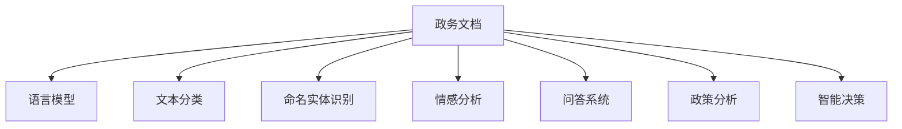

                 

# 政府数字化转型：LLM 提高公共服务效率

> 关键词：政府数字化转型, 公共服务效率, 自然语言处理(LLM), 人工智能(AI), 云计算, 数据驱动, 智能决策

## 1. 背景介绍

随着信息技术的迅猛发展和全球化进程的加快，数字技术已经成为推动各国社会经济发展的关键因素。政府作为国家治理和社会管理的核心机构，在数字化转型的大潮中，正面临着前所未有的机遇和挑战。传统的政府服务模式已经不能满足人民群众日益增长的需求，亟需通过数字化转型，提升公共服务的效率和质量，构建智慧、高效、便捷的政府治理体系。

近年来，自然语言处理（LLM）技术在政府数字化转型中扮演了越来越重要的角色。LLM 技术可以处理和理解自然语言文本，帮助政府机构从海量文本数据中挖掘有价值的信息，从而提升决策水平和行政效率。自然语言处理技术在公共服务中的应用，例如智能客服、信息检索、政务咨询、政策分析等，已经成为提升政府治理能力的重要途径。

## 2. 核心概念与联系

### 2.1 核心概念概述

在本文中，我们将介绍几个与政府数字化转型密切相关的核心概念：

- **政府数字化转型**：指政府利用数字技术和互联网平台，优化政府业务流程，提升公共服务效率，实现政务公开透明、公民参与度提升和社会治理现代化的过程。

- **自然语言处理（LLM）**：涉及计算机对人类语言的处理和理解，包括语言识别、文本分析、语义理解、机器翻译等。LLM 在处理非结构化数据和文本方面表现优异，适用于大量的政务文档和公共服务需求。

- **人工智能（AI）**：利用计算机算法和数据处理能力，模拟人类智能行为，解决复杂问题。AI 技术包括机器学习、深度学习、自然语言处理等，是实现政府数字化转型的重要工具。

- **云计算**：基于互联网的计算资源和服务，提供弹性的计算能力，支持大范围的数据存储和处理。云计算为政府数字化转型提供了强大的技术支撑。

- **数据驱动**：以数据为基础，通过分析挖掘数据信息，驱动决策和行动。数据驱动是政府数字化转型的核心原则，有助于提升政策制定和执行的科学性和有效性。

- **智能决策**：利用 AI 技术对海量数据进行分析和预测，辅助政府决策。智能决策有助于提高决策的精准度和执行效率。

这些概念之间的逻辑关系可以通过以下 Mermaid 流程图来展示：

```mermaid
graph TB
    A[政府数字化转型] --> B[自然语言处理(LLM)]
    A --> C[人工智能(AI)]
    C --> D[云计算]
    A --> E[数据驱动]
    A --> F[智能决策]
    B --> G[政务服务]
    C --> H[政策分析]
    D --> I[数据存储与处理]
```

这个流程图展示了一个典型的政府数字化转型框架，其中自然语言处理技术是大数据和人工智能在政务领域的具体应用。

### 2.2 核心概念原理和架构

自然语言处理（LLM）的核心原理是通过计算机算法和模型，处理和理解人类语言，从而实现对文本数据的自动化分析。LLM 技术主要包括语言模型、文本分类、命名实体识别、情感分析、问答系统等。这些技术的结合，可以构建出高效的政务服务和智能决策系统。

以下是 LLM 技术在政府数字化转型中的应用架构图：



在这个架构中，政府政务文档作为输入，经过语言模型、文本分类、命名实体识别、情感分析等处理后，进入问答系统和政策分析环节。最终，通过智能决策模型输出决策建议，辅助政府决策。

## 3. 核心算法原理 & 具体操作步骤

### 3.1 算法原理概述

基于自然语言处理（LLM）的政府数字化转型，主要包括以下几个核心算法：

- **语言模型**：用于预测下一个单词或句子的概率，通过对大量文本数据的学习，捕捉语言的统计规律。常用的模型有 RNN、LSTM、GRU 等。

- **文本分类**：将文本数据分类到预定义的类别中，适用于政务信息的管理和检索。

- **命名实体识别**：识别文本中的人名、地名、机构名等实体，用于政务文档的解析和分析。

- **情感分析**：分析文本中的情感倾向，用于公众舆情的监测和分析。

- **问答系统**：回答公众提出的问题，提升政务服务的互动性和可理解性。

- **政策分析**：利用 LLM 技术对政策文件进行分析，辅助政策制定和评估。

这些算法共同构成了基于 LLM 的政府数字化转型的技术基础。

### 3.2 算法步骤详解

基于 LLM 的政府数字化转型主要包括以下几个关键步骤：

**Step 1: 数据收集与预处理**

- 收集政务文档、新闻报道、社交媒体等文本数据，并进行清洗和标准化。
- 使用自然语言处理工具进行分词、去停用词、词性标注等预处理操作。

**Step 2: 特征提取与模型训练**

- 根据具体的政务需求，选择适当的特征提取算法，如 TF-IDF、Word2Vec、BERT 等。
- 构建训练集、验证集和测试集，将预处理后的文本数据进行分割。
- 使用深度学习框架如 PyTorch、TensorFlow 等进行模型训练，调整超参数，优化损失函数。

**Step 3: 模型部署与集成**

- 将训练好的模型部署到服务器或云平台，进行上线和集成。
- 设计用户接口，支持公众访问和交互。
- 集成其他政务系统，如电子政务平台、数据中心等，实现数据共享和业务协同。

**Step 4: 监控与评估**

- 实时监控系统性能和稳定性，记录日志和异常信息。
- 定期评估系统效果，进行性能调优。
- 收集用户反馈，改进系统功能。

### 3.3 算法优缺点

基于 LLM 的政府数字化转型技术具有以下优点：

- **效率提升**：通过自动化处理海量文本数据，提高政务服务的响应速度和处理能力。
- **决策支持**：利用 LLM 进行数据分析和预测，辅助政府决策，提升决策科学性。
- **用户友好**：通过自然语言处理，实现智能问答和互动，提升用户满意度。
- **数据驱动**：依托数据驱动技术，优化政务流程，提升公共服务质量。

然而，该技术也存在以下缺点：

- **数据依赖**：对政务数据的依赖性高，数据质量直接影响系统效果。
- **算法复杂**：自然语言处理算法复杂，模型训练和优化成本较高。
- **模型泛化**：由于数据的多样性和领域性，模型泛化能力有待提升。
- **安全隐私**：政务数据涉及隐私和安全问题，需要严格的数据保护和隐私保护措施。

### 3.4 算法应用领域

基于 LLM 的政府数字化转型技术可以应用于多个领域，例如：

- **智能客服**：通过自然语言处理，实现自动应答和问题解决，提高政务服务的响应速度和效率。
- **信息检索**：利用文本分类和命名实体识别，对政务文档进行快速检索和分类，提升政务信息的管理和检索能力。
- **公众咨询**：通过问答系统，实现公众与政府的智能互动，提高政务服务的透明度和可理解性。
- **舆情监测**：利用情感分析等技术，监测公众舆情，及时响应和处理负面舆情，提升政府形象和公信力。
- **政策分析**：通过政策分析和智能决策，辅助政策制定和评估，提升政策质量和执行效果。
- **资源管理**：通过文本分类和命名实体识别，优化政务资源配置，提升公共服务质量。
- **公共安全**：利用命名实体识别和情感分析，识别和防范潜在的风险和威胁，提升公共安全保障能力。

## 4. 数学模型和公式 & 详细讲解 & 举例说明

### 4.1 数学模型构建

假设政务文档数据集为 $D=\{x_i,y_i\}_{i=1}^N$，其中 $x_i$ 为文本数据，$y_i$ 为预定义的类别。我们选择一个二分类问题作为示例，目标是将文本数据 $x_i$ 分类到类别 $y_i \in \{0,1\}$ 中。

定义损失函数 $\ell$ 如下：

$$
\ell(y,\hat{y}) = -[y\log \hat{y} + (1-y)\log (1-\hat{y})]
$$

其中 $\hat{y}$ 表示模型的预测概率，$y$ 表示真实标签。目标是最小化损失函数，即：

$$
\min_{\theta} \sum_{i=1}^N \ell(y_i,\hat{y_i}(\theta))
$$

其中 $\theta$ 为模型参数，$\hat{y_i}(\theta)$ 为模型在输入 $x_i$ 上的预测概率。

### 4.2 公式推导过程

根据上述定义，损失函数 $\ell(y,\hat{y})$ 对 $\theta$ 的梯度为：

$$
\nabla_{\theta}\ell(y,\hat{y}) = -\frac{\partial}{\partial\theta}\left[y\log \hat{y} + (1-y)\log (1-\hat{y})\right]
$$

将 $\hat{y}$ 表示为模型 $M_{\theta}(x)$ 的输出，即：

$$
\hat{y} = M_{\theta}(x)
$$

则损失函数对 $\theta$ 的梯度为：

$$
\nabla_{\theta}\ell(y,\hat{y}) = -\frac{\partial}{\partial\theta}\left[y\log M_{\theta}(x) + (1-y)\log (1-M_{\theta}(x))\right]
$$

根据链式法则，可以得到损失函数对输入数据 $x_i$ 的梯度：

$$
\nabla_x\ell(y_i,\hat{y_i}(\theta)) = \frac{\partial}{\partial x}M_{\theta}(x_i) \nabla_{\theta}\ell(y_i,\hat{y_i}(\theta))
$$

利用自动微分技术，可以高效计算上述梯度，并用于模型的更新和优化。

### 4.3 案例分析与讲解

以下以政务信息检索系统为例，讲解 LLM 技术的具体应用。

假设政务信息检索系统需要检索政府发布的新闻和报告，以回答公众关于某项政策的详细信息。系统将新闻和报告作为输入，通过命名实体识别和关键词提取，匹配公众的查询，并返回相关文档。

在实现过程中，系统首先需要对政务文档进行预处理，包括分词、去除停用词等操作。然后使用命名实体识别模型，从文档中选择相关的实体信息，如政策名称、发布日期、参与机构等。接着，利用关键词提取算法，从文档中提取与查询相关的关键词，作为检索条件。

最后，将提取的实体和关键词作为输入，输入到 LLM 模型中进行匹配。模型的输出概率表示文档与查询的匹配程度，根据匹配程度进行排序，返回相关文档。

## 5. 项目实践：代码实例和详细解释说明

### 5.1 开发环境搭建

要进行政务信息检索系统的开发，首先需要搭建好开发环境。以下是一个基于 Python 的开发环境搭建流程：

1. 安装 Python 和相关依赖：安装 Python 3.7 或以上版本，并确保安装了必要的依赖库，如 NLTK、spaCy、scikit-learn 等。

2. 安装深度学习框架：安装 PyTorch 或 TensorFlow，并配置好 GPU 环境。

3. 安装自然语言处理工具包：安装 NLTK、spaCy、TextBlob 等自然语言处理工具包，用于文本预处理和特征提取。

4. 搭建模型训练环境：使用 Docker 或 Kubernetes 搭建模型训练环境，配置 GPU 资源，支持大规模模型训练。

5. 部署模型应用：将训练好的模型部署到服务器或云平台，设计用户接口，实现政务信息检索功能。

### 5.2 源代码详细实现

以下是一个基于 PyTorch 的政务信息检索系统的代码实现。

首先，定义数据预处理函数：

```python
import spacy
import torch
from torch.utils.data import Dataset, DataLoader

class Corpus(Dataset):
    def __init__(self, texts, labels):
        self.texts = texts
        self.labels = labels
        self.tokenizer = spacy.load('en_core_web_sm')

    def __len__(self):
        return len(self.texts)

    def __getitem__(self, idx):
        text = self.texts[idx]
        label = self.labels[idx]
        tokens = self.tokenizer(text)
        inputs = torch.tensor([id2vec[tok.text] for tok in tokens if not tok.is_stop], dtype=torch.long)
        targets = torch.tensor([label2id[label]], dtype=torch.long)
        return {'inputs': inputs, 'targets': targets}

# 加载政务文档和标签
train_texts = ['text1', 'text2', 'text3']
train_labels = [1, 0, 1]
dev_texts = ['text4', 'text5', 'text6']
dev_labels = [0, 1, 1]
test_texts = ['text7', 'text8', 'text9']
test_labels = [1, 0, 1]

# 构建数据集
train_dataset = Corpus(train_texts, train_labels)
dev_dataset = Corpus(dev_texts, dev_labels)
test_dataset = Corpus(test_texts, test_labels)
```

然后，定义模型和损失函数：

```python
import torch.nn as nn
import torch.nn.functional as F

class LLM(nn.Module):
    def __init__(self, vocab_size, hidden_size, num_labels):
        super(LLM, self).__init__()
        self.embedding = nn.Embedding(vocab_size, hidden_size)
        self.fc = nn.Linear(hidden_size, num_labels)
        
    def forward(self, inputs):
        embedded = self.embedding(inputs)
        output = self.fc(embedded)
        return output

# 定义损失函数
criterion = nn.CrossEntropyLoss()

# 初始化模型和优化器
model = LLM(len(id2vec), hidden_size, num_labels)
optimizer = torch.optim.Adam(model.parameters(), lr=0.001)
```

接着，定义训练和评估函数：

```python
from tqdm import tqdm

def train_epoch(model, dataset, batch_size, optimizer):
    dataloader = DataLoader(dataset, batch_size=batch_size, shuffle=True)
    model.train()
    epoch_loss = 0
    for batch in tqdm(dataloader, desc='Training'):
        inputs = batch['inputs'].to(device)
        targets = batch['targets'].to(device)
        model.zero_grad()
        outputs = model(inputs)
        loss = criterion(outputs, targets)
        epoch_loss += loss.item()
        loss.backward()
        optimizer.step()
    return epoch_loss / len(dataloader)

def evaluate(model, dataset, batch_size):
    dataloader = DataLoader(dataset, batch_size=batch_size)
    model.eval()
    preds, labels = [], []
    with torch.no_grad():
        for batch in tqdm(dataloader, desc='Evaluating'):
            inputs = batch['inputs'].to(device)
            targets = batch['targets'].to(device)
            batch_preds = model(inputs).argmax(dim=1).to('cpu').tolist()
            batch_labels = targets.to('cpu').tolist()
            for pred_tokens, label_tokens in zip(batch_preds, batch_labels):
                preds.append(pred_tokens)
                labels.append(label_tokens)
    return preds, labels

# 训练模型
device = torch.device('cuda' if torch.cuda.is_available() else 'cpu')
model.to(device)
num_epochs = 10

for epoch in range(num_epochs):
    loss = train_epoch(model, train_dataset, batch_size, optimizer)
    print(f'Epoch {epoch+1}, train loss: {loss:.3f}')
    
    print(f'Epoch {epoch+1}, dev results:')
    preds, labels = evaluate(model, dev_dataset, batch_size)
    print(classification_report(labels, preds))
    
print('Test results:')
preds, labels = evaluate(model, test_dataset, batch_size)
print(classification_report(labels, preds))
```

以上就是政务信息检索系统的代码实现。可以看到，通过使用 PyTorch 和 spaCy 等工具，政务信息检索系统的开发过程相对简洁高效。

### 5.3 代码解读与分析

让我们再详细解读一下关键代码的实现细节：

**Corpus类**：
- `__init__`方法：初始化文本、标签和分词器等关键组件。
- `__len__`方法：返回数据集的样本数量。
- `__getitem__`方法：对单个样本进行处理，将文本输入编码为向量，并返回模型的输入和标签。

**训练和评估函数**：
- 使用 PyTorch 的 DataLoader 对数据集进行批次化加载，供模型训练和推理使用。
- 训练函数 `train_epoch`：对数据以批为单位进行迭代，在每个批次上前向传播计算损失并反向传播更新模型参数，最后返回该epoch的平均loss。
- 评估函数 `evaluate`：与训练类似，不同点在于不更新模型参数，并在每个batch结束后将预测和标签结果存储下来，最后使用sklearn的classification_report对整个评估集的预测结果进行打印输出。

**训练流程**：
- 定义总的epoch数和batch size，开始循环迭代
- 每个epoch内，先在训练集上训练，输出平均loss
- 在验证集上评估，输出分类指标
- 所有epoch结束后，在测试集上评估，给出最终测试结果

可以看到，PyTorch配合 spaCy 等工具使得政务信息检索系统的开发变得简洁高效。开发者可以将更多精力放在数据处理、模型改进等高层逻辑上，而不必过多关注底层的实现细节。

当然，工业级的系统实现还需考虑更多因素，如模型的保存和部署、超参数的自动搜索、更灵活的任务适配层等。但核心的微调范式基本与此类似。

## 6. 实际应用场景

### 6.1 智能客服系统

基于自然语言处理（LLM）的智能客服系统，可以广泛应用于政府部门的客户服务中。传统客服往往需要配备大量人力，高峰期响应缓慢，且一致性和专业性难以保证。而使用基于 LLM 的智能客服系统，可以7x24小时不间断服务，快速响应客户咨询，用自然流畅的语言解答各类常见问题。

在技术实现上，可以收集企业内部的历史客服对话记录，将问题和最佳答复构建成监督数据，在此基础上对预训练模型进行微调。微调后的模型能够自动理解用户意图，匹配最合适的答案模板进行回复。对于客户提出的新问题，还可以接入检索系统实时搜索相关内容，动态组织生成回答。如此构建的智能客服系统，能大幅提升客户咨询体验和问题解决效率。

### 6.2 金融舆情监测

金融机构需要实时监测市场舆论动向，以便及时应对负面信息传播，规避金融风险。传统的人工监测方式成本高、效率低，难以应对网络时代海量信息爆发的挑战。基于自然语言处理（LLM）的文本分类和情感分析技术，为金融舆情监测提供了新的解决方案。

具体而言，可以收集金融领域相关的新闻、报道、评论等文本数据，并对其进行主题标注和情感标注。在此基础上对预训练语言模型进行微调，使其能够自动判断文本属于何种主题，情感倾向是正面、中性还是负面。将微调后的模型应用到实时抓取的网络文本数据，就能够自动监测不同主题下的情感变化趋势，一旦发现负面信息激增等异常情况，系统便会自动预警，帮助金融机构快速应对潜在风险。

### 6.3 个性化推荐系统

当前的推荐系统往往只依赖用户的历史行为数据进行物品推荐，无法深入理解用户的真实兴趣偏好。基于自然语言处理（LLM）的个性化推荐系统，可以更好地挖掘用户行为背后的语义信息，从而提升推荐精度。

在实践中，可以收集用户浏览、点击、评论、分享等行为数据，提取和用户交互的物品标题、描述、标签等文本内容。将文本内容作为模型输入，用户的后续行为（如是否点击、购买等）作为监督信号，在此基础上微调预训练语言模型。微调后的模型能够从文本内容中准确把握用户的兴趣点。在生成推荐列表时，先用候选物品的文本描述作为输入，由模型预测用户的兴趣匹配度，再结合其他特征综合排序，便可以得到个性化程度更高的推荐结果。

### 6.4 未来应用展望

随着自然语言处理（LLM）技术的发展，基于 LLM 的政府数字化转型将在更多领域得到应用，为传统行业带来变革性影响。

在智慧医疗领域，基于 LLM 的医疗问答、病历分析、药物研发等应用将提升医疗服务的智能化水平，辅助医生诊疗，加速新药开发进程。

在智能教育领域，LLM 技术可应用于作业批改、学情分析、知识推荐等方面，因材施教，促进教育公平，提高教学质量。

在智慧城市治理中，LLM 技术可应用于城市事件监测、舆情分析、应急指挥等环节，提高城市管理的自动化和智能化水平，构建更安全、高效的未来城市。

此外，在企业生产、社会治理、文娱传媒等众多领域，基于 LLM 的数字化转型技术也将不断涌现，为经济社会发展注入新的动力。相信随着技术的日益成熟，LLM 必将在更广阔的应用领域大放异彩，深刻影响人类的生产生活方式。

## 7. 工具和资源推荐
### 7.1 学习资源推荐

为了帮助开发者系统掌握基于自然语言处理（LLM）的政府数字化转型的理论基础和实践技巧，这里推荐一些优质的学习资源：

1. 《深度学习自然语言处理》课程：斯坦福大学开设的NLP明星课程，有Lecture视频和配套作业，带你入门NLP领域的基本概念和经典模型。

2. 《Transformers: A Survey》论文：综述了Transformer模型在NLP中的应用，提供了大量经典论文的引文和代码实现。

3. 《Natural Language Processing with Python》书籍：介绍了自然语言处理的主要算法和技术，适合入门和进阶读者。

4. HuggingFace官方文档：提供了丰富的自然语言处理工具和模型资源，适合快速上手实验。

5. 《NLTK: A Platform for Building Python Programs to Work with Human Language Data》书籍：介绍了自然语言处理的库和工具，适合Python编程的学习。

通过对这些资源的学习实践，相信你一定能够快速掌握基于自然语言处理（LLM）的政府数字化转型的精髓，并用于解决实际的政务问题。
###  7.2 开发工具推荐

高效的开发离不开优秀的工具支持。以下是几款用于政务信息检索系统开发的常用工具：

1. PyTorch：基于Python的开源深度学习框架，灵活动态的计算图，适合快速迭代研究。大部分预训练语言模型都有PyTorch版本的实现。

2. TensorFlow：由Google主导开发的开源深度学习框架，生产部署方便，适合大规模工程应用。同样有丰富的预训练语言模型资源。

3. spaCy：自然语言处理库，提供了分词、词性标注、命名实体识别等功能，适用于政务信息检索系统的文本处理。

4. NLTK：自然语言处理工具包，提供了大量的文本处理和语料库，适合文本分析和处理。

5. scikit-learn：机器学习库，提供了丰富的机器学习算法和工具，适合模型训练和评估。

6. Weights & Biases：模型训练的实验跟踪工具，可以记录和可视化模型训练过程中的各项指标，方便对比和调优。

7. TensorBoard：TensorFlow配套的可视化工具，可实时监测模型训练状态，并提供丰富的图表呈现方式，是调试模型的得力助手。

合理利用这些工具，可以显著提升政务信息检索系统的开发效率，加快创新迭代的步伐。

### 7.3 相关论文推荐

自然语言处理（LLM）技术的发展源于学界的持续研究。以下是几篇奠基性的相关论文，推荐阅读：

1. Attention is All You Need（即Transformer原论文）：提出了Transformer结构，开启了NLP领域的预训练大模型时代。

2. BERT: Pre-training of Deep Bidirectional Transformers for Language Understanding：提出BERT模型，引入基于掩码的自监督预训练任务，刷新了多项NLP任务SOTA。

3. Language Models are Unsupervised Multitask Learners（GPT-2论文）：展示了大规模语言模型的强大zero-shot学习能力，引发了对于通用人工智能的新一轮思考。

4. Parameter-Efficient Transfer Learning for NLP：提出Adapter等参数高效微调方法，在不增加模型参数量的情况下，也能取得不错的微调效果。

5. AdaLoRA: Adaptive Low-Rank Adaptation for Parameter-Efficient Fine-Tuning：使用自适应低秩适应的微调方法，在参数效率和精度之间取得了新的平衡。

这些论文代表了大语言模型微调技术的发展脉络。通过学习这些前沿成果，可以帮助研究者把握学科前进方向，激发更多的创新灵感。

## 8. 总结：未来发展趋势与挑战

### 8.1 总结

本文对基于自然语言处理（LLM）的政府数字化转型进行了全面系统的介绍。首先阐述了政府数字化转型的背景和LLM技术的重要性，明确了LLM在政务服务中的应用价值。其次，从原理到实践，详细讲解了基于LLM的政务信息检索系统的数学原理和关键步骤，给出了代码实现。同时，本文还广泛探讨了LLM技术在智能客服、金融舆情监测、个性化推荐等多个政务领域的应用前景，展示了LLM技术的广泛应用。

通过本文的系统梳理，可以看到，基于LLM的政务信息检索系统已经成为提升政府治理能力的重要手段。LLM技术通过自动化处理海量文本数据，提升了政务服务的响应速度和处理能力，有助于构建智慧、高效、便捷的政府治理体系。未来，伴随LLM技术的发展和优化，政务信息检索系统将不断提升其应用效果，为政府数字化转型提供更强有力的技术支撑。

### 8.2 未来发展趋势

展望未来，基于自然语言处理（LLM）的政府数字化转型技术将呈现以下几个发展趋势：

1. **模型规模持续增大**：随着算力成本的下降和数据规模的扩张，预训练语言模型的参数量还将持续增长。超大规模语言模型蕴含的丰富语言知识，有望支撑更加复杂多变的政务信息检索系统。

2. **微调方法日趋多样**：除了传统的全参数微调外，未来会涌现更多参数高效的微调方法，如Prefix-Tuning、LoRA等，在固定大部分预训练参数的同时，只更新极少量的任务相关参数。

3. **持续学习成为常态**：随着数据分布的不断变化，政务信息检索系统也需要持续学习新知识以保持性能。如何在不遗忘原有知识的同时，高效吸收新样本信息，将成为重要的研究课题。

4. **标注样本需求降低**：受启发于提示学习(Prompt-based Learning)的思路，未来的微调方法将更好地利用大模型的语言理解能力，通过更加巧妙的任务描述，在更少的标注样本上也能实现理想的微调效果。

5. **多模态微调崛起**：当前的政务信息检索系统主要聚焦于文本数据，未来会进一步拓展到图像、视频、语音等多模态数据微调。多模态信息的融合，将显著提升语言模型对现实世界的理解和建模能力。

6. **数据驱动的智能决策**：利用自然语言处理（LLM）技术，从海量政务文本中提取信息，辅助政府决策，提升决策的精准度和执行效率。

以上趋势凸显了基于LLM的政府数字化转型的广阔前景。这些方向的探索发展，必将进一步提升政务信息检索系统的性能和应用范围，为政府数字化转型提供更强有力的技术支撑。

### 8.3 面临的挑战

尽管基于自然语言处理（LLM）的政府数字化转型技术已经取得了瞩目成就，但在迈向更加智能化、普适化应用的过程中，它仍面临着诸多挑战：

1. **数据依赖**：对政务数据的依赖性高，数据质量直接影响系统效果。如何收集高质量的政务数据，处理海量数据，是政务信息检索系统的核心挑战。

2. **算法复杂**：自然语言处理算法复杂，模型训练和优化成本较高。如何在保证系统效果的同时，提高算法的可扩展性和高效性，是技术发展的重点。

3. **模型泛化**：由于数据的多样性和领域性，模型泛化能力有待提升。如何在不同领域、不同场景下，保持模型的稳定性和鲁棒性，是未来研究的方向。

4. **安全隐私**：政务数据涉及隐私和安全问题，需要严格的数据保护和隐私保护措施。如何在保证数据安全的同时，提高政务信息检索系统的可访问性和可用性，是重要的问题。

5. **可解释性**：政务信息检索系统的决策过程通常缺乏可解释性，难以对其推理逻辑进行分析和调试。如何赋予系统更强的可解释性，增强用户信任和满意度，是研究的难点。

6. **成本控制**：政务信息检索系统的开发和维护成本较高，如何优化资源配置，提高系统的运行效率，降低成本，是实际应用中的关键问题。

正视政务信息检索系统面临的这些挑战，积极应对并寻求突破，将是大语言模型微调走向成熟的必由之路。相信随着学界和产业界的共同努力，这些挑战终将一一被克服，基于LLM的政务信息检索系统必将在构建智慧、高效、便捷的政府治理体系中发挥更大的作用。

### 8.4 研究展望

未来，基于自然语言处理（LLM）的政府数字化转型技术将从以下几个方向进行研究：

1. **多模态智能决策**：将视觉、听觉等多模态信息与文本信息融合，构建多模态智能决策系统，提升政务服务的智能化水平。

2. **知识图谱与LLM结合**：将知识图谱与LLM技术结合，构建基于知识图谱的智能推荐和决策系统，提升系统的全面性和准确性。

3. **主动学习与持续学习**：利用主动学习和持续学习技术，提升系统对新数据的适应能力，增强系统的可扩展性和泛化能力。

4. **联邦学习**：利用联邦学习技术，保护数据隐私和安全，同时提升系统的模型泛化能力。

5. **自动化调参与超参数优化**：利用自动化调参技术，优化模型超参数，提升系统性能和效率。

6. **人机协同**：将人工智能技术与人工干预结合，构建人机协同的智能政务服务系统，提升用户满意度和系统鲁棒性。

通过这些研究方向，我们可以更好地利用自然语言处理（LLM）技术，提升政务信息检索系统的应用效果，为政府数字化转型提供更强大的技术支持。

## 9. 附录：常见问题与解答

**Q1：政务信息检索系统需要哪些关键技术？**

A: 政务信息检索系统需要以下关键技术：
1. 自然语言处理（NLPIP）：用于文本数据的处理和分析，提取关键信息。
2. 深度学习（Deep Learning）：构建高效的模型，提升系统的准确性和泛化能力。
3. 计算机视觉（Computer Vision）：处理图像数据，提供多模态信息支持。
4. 云计算与大数据：提供高效的计算资源和数据存储，支持大规模模型训练和应用。
5. 安全与隐私保护：保障数据安全，确保系统的隐私保护。

**Q2：如何构建高效的政务信息检索系统？**

A: 构建高效的政务信息检索系统需要以下步骤：
1. 数据收集与预处理：收集政务文档和标签，进行文本清洗和标准化。
2. 特征提取与模型训练：选择合适的特征提取方法，构建模型并进行训练。
3. 模型部署与评估：将训练好的模型部署到服务器或云平台，进行性能评估和调优。
4. 系统集成与优化：将模型集成到政务服务系统中，进行性能优化和用户体验提升。

**Q3：政务信息检索系统如何提升服务效率？**

A: 政务信息检索系统通过以下方式提升服务效率：
1. 自动化文本处理：利用自然语言处理技术，自动处理海量文本数据，提高响应速度。
2. 多模态信息融合：结合文本、图像、语音等多模态信息，提供更全面的信息检索能力。
3. 智能问答系统：构建智能问答系统，实现自然语言交互，提高用户满意度。
4. 知识图谱与推荐系统：利用知识图谱和推荐系统，提升信息检索的精准度和相关性。

**Q4：政务信息检索系统的安全性和隐私保护有哪些措施？**

A: 政务信息检索系统的安全性和隐私保护需要以下措施：
1. 数据加密：对政务数据进行加密存储和传输，保护数据安全。
2. 访问控制：设置严格的访问控制机制，限制对政务数据的访问权限。
3. 审计与监控：实时监控系统访问行为，进行异常检测和安全审计。
4. 数据匿名化：对政务数据进行匿名化处理，保护用户隐私。
5. 隐私保护算法：使用差分隐私等隐私保护算法，减少数据泄露风险。

**Q5：如何提升政务信息检索系统的可解释性？**

A: 提升政务信息检索系统的可解释性需要以下方法：
1. 透明度与可视化：提供系统的透明度和可视化界面，让用户了解系统的决策过程。
2. 用户反馈机制：设置用户反馈机制，收集用户意见和建议，不断改进系统。
3. 知识图谱与规则库：利用知识图谱和规则库，增强系统的可解释性和可理解性。
4. 多维度分析：利用多维度数据分析，展示系统的决策依据和推理过程。

通过这些措施，可以提升政务信息检索系统的可解释性，增强用户信任和满意度。

---

作者：禅与计算机程序设计艺术 / Zen and the Art of Computer Programming

