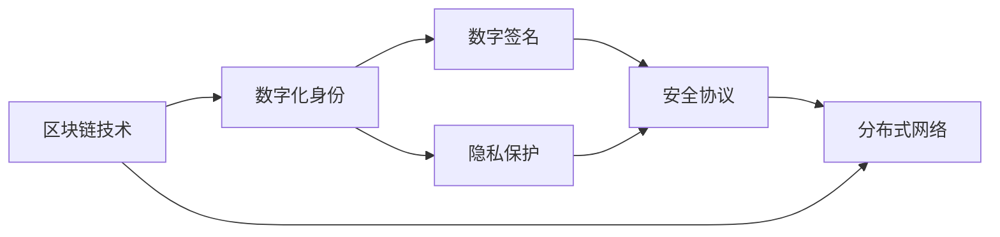

                 

# 数字化人格权:元宇宙中的身份保护与隐私

> 关键词：元宇宙,数字化人格权,隐私保护,身份识别,区块链,数字签名,安全协议,分布式网络

## 1. 背景介绍

随着数字技术的发展，人类社会进入了一个新的时代——元宇宙(Metaverse)。在元宇宙中，人们通过虚拟身份在虚拟世界中交流、购物、工作、娱乐，甚至完成金融交易、教育培训等现实生活中的任务。这种虚拟与现实交织的生活形态，让数字化身份成为连接虚拟世界和现实世界的重要桥梁。然而，数字化身份的广泛应用也引发了一系列身份保护与隐私问题，如何确保用户在元宇宙中的身份安全，保护其数字化人格权，成为当下亟待解决的关键议题。

### 1.1 元宇宙的兴起与挑战

元宇宙的兴起，源于对现实世界的补充与拓展。它不仅改变了人们的社交、娱乐、生产方式，还提供了无限的可能性和广阔的空间。然而，元宇宙中数字化身份的安全和隐私问题也随之而来：

1. **身份篡改**：用户的身份信息可能被恶意篡改，导致身份混淆或冒名顶替。
2. **隐私泄露**：元宇宙中的活动和行为数据可能被未授权的第三方获取和分析，侵犯用户隐私。
3. **交易欺诈**：在虚拟交易中，如何防止虚假身份和恶意行为，确保交易的真实性和安全性，是一个重大挑战。

### 1.2 数字身份保护的必要性

在元宇宙中，身份保护不仅关乎用户的个人隐私，还涉及到信任机制的构建。一个安全的身份系统，能够保障用户行为的不可否认性，提升虚拟交易的可信度，促进元宇宙的健康发展。

1. **确保身份真实性**：保证用户在虚拟世界中的行为与其现实身份一致，防止虚假身份的创建和冒用。
2. **保障交易安全**：确保虚拟交易的安全性和真实性，防止欺诈和盗窃。
3. **维护用户隐私**：防止用户个人信息的泄露和滥用，保护用户的数字权利和人格权。

## 2. 核心概念与联系

### 2.1 核心概念概述

在元宇宙中，数字化身份保护与隐私涉及多个核心概念：

- **数字化身份**：用户在虚拟世界中的虚拟人格，通常由数字签名、公钥、私钥等元素构成。
- **隐私保护**：通过技术手段确保用户的数据不被未经授权的第三方访问、分析和利用。
- **区块链技术**：一种去中心化的分布式账本技术，提供安全、透明、不可篡改的数据存储和验证机制。
- **安全协议**：用于在网络通信中确保数据传输的安全性，防止数据泄露和篡改。
- **数字签名**：一种用于验证身份和数据真实性的技术，确保消息或数据的完整性和真实性。
- **分布式网络**：多个节点构成的去中心化网络，能够提供高可用性和抗攻击性。

这些概念之间通过以下关系相联系：

- 区块链技术为数字化身份提供了一种安全的存储和验证机制，通过公钥和私钥实现身份的真实性和不可篡改性。
- 数字签名和隐私保护技术通过加密手段，确保用户数据的机密性和完整性。
- 安全协议通过网络层面的安全机制，防止数据在传输过程中的泄露和篡改。
- 分布式网络通过多节点协同工作，增强了系统的鲁棒性和抗攻击能力。

### 2.2 核心概念原理和架构的 Mermaid 流程图



## 3. 核心算法原理 & 具体操作步骤

### 3.1 算法原理概述

在元宇宙中，数字身份保护与隐私主要通过以下几个算法实现：

1. **数字签名算法**：通过公钥和私钥对数据进行签名和验证，确保数据真实性和身份认证。
2. **隐私保护算法**：使用加密技术对用户数据进行加密，防止数据泄露和未授权访问。
3. **安全协议算法**：通过SSL/TLS等协议，确保数据传输的安全性和完整性。
4. **区块链算法**：通过分布式账本和共识机制，确保数据的不可篡改性和透明性。

### 3.2 算法步骤详解

以下是数字化身份保护与隐私的具体操作步骤：

1. **身份生成**：用户通过密钥对生成器生成公钥和私钥，公钥用于加密和身份验证，私钥用于签名和解密。

2. **数字签名**：用户使用私钥对数据进行签名，生成数字签名。接收方使用公钥验证签名的有效性，确保数据的真实性和完整性。

3. **数据加密**：使用对称加密或非对称加密技术，对用户数据进行加密，防止数据泄露和未授权访问。

4. **安全协议**：在数据传输过程中，使用SSL/TLS等安全协议，确保数据传输的安全性和完整性，防止中间人攻击和数据篡改。

5. **区块链存储**：将用户的身份信息和其他关键数据存储在区块链上，利用区块链的不可篡改性和透明性，保障用户数据的真实性和安全性。

### 3.3 算法优缺点

**优点**：

- 安全性高：通过数字签名和加密技术，确保数据传输和存储的安全性。
- 透明性：区块链技术的透明性使得数据存储和验证过程公开透明，防止数据篡改和欺诈。
- 抗攻击性强：分布式网络架构提高了系统的鲁棒性和抗攻击能力。

**缺点**：

- 计算复杂度高：数字签名和加密算法计算复杂，可能会影响系统的响应速度。
- 存储成本高：区块链存储和加密算法增加了数据的存储成本。
- 隐私保护有限：虽然加密技术可以保护数据隐私，但公钥和私钥的管理仍然存在安全隐患。

### 3.4 算法应用领域

数字化身份保护与隐私技术广泛应用于以下领域：

1. **金融服务**：保护用户的金融交易数据，防止欺诈和盗窃。
2. **医疗健康**：保护患者的健康数据，确保数据的安全和隐私。
3. **教育培训**：保护学生的学习数据，防止数据泄露和滥用。
4. **虚拟现实**：保护虚拟世界中的用户身份和行为数据，防止身份冒用和欺诈。
5. **智能合约**：确保智能合约的执行过程透明、可信，防止篡改和欺诈。

## 4. 数学模型和公式 & 详细讲解 & 举例说明

### 4.1 数学模型构建

在数字化身份保护与隐私中，主要涉及以下几个数学模型：

- **公钥密码学**：用于生成和验证数字签名的数学模型。
- **对称加密**：如AES、DES等算法，用于加密和解密数据。
- **非对称加密**：如RSA、ECC等算法，用于数字签名和密钥交换。
- **哈希函数**：如SHA-256等算法，用于数据完整性验证。
- **安全协议**：如SSL/TLS协议，用于加密和验证数据传输。

### 4.2 公式推导过程

以数字签名为例，推导数字签名算法的基本过程：

假设用户A的私钥为 $x_A$，公钥为 $y_A$，要发送消息 $M$ 给用户B。数字签名的过程如下：

1. **哈希函数**：使用哈希函数对消息 $M$ 进行哈希，得到哈希值 $H(M)$。

2. **签名生成**：使用私钥 $x_A$ 对哈希值 $H(M)$ 进行加密，生成数字签名 $S(M)$。

3. **签名验证**：用户B使用公钥 $y_A$ 对数字签名 $S(M)$ 进行解密，得到哈希值 $H(M)$，再将原消息 $M$ 进行哈希，得到新的哈希值 $H(M')$，如果 $H(M') = H(M)$，则验证通过，否则不通过。

### 4.3 案例分析与讲解

**案例**：数字身份在元宇宙中的保护

假设用户在元宇宙中使用虚拟身份A进行游戏交易。其数字签名和隐私保护的过程如下：

1. **数字签名**：用户A使用私钥对交易信息进行签名，生成数字签名 $S(T)$。

2. **数据加密**：使用对称加密算法（如AES）对交易信息进行加密，得到密文 $C(T)$。

3. **安全传输**：通过SSL/TLS协议，将密文 $C(T)$ 和数字签名 $S(T)$ 传输给卖家B。

4. **签名验证和解密**：卖家B使用公钥对数字签名进行验证，确保交易信息的真实性。同时使用对称密钥对密文进行解密，得到原始交易信息 $T$。

## 5. 项目实践：代码实例和详细解释说明

### 5.1 开发环境搭建

为了进行数字化身份保护与隐私的项目实践，需要先搭建好开发环境：

1. **安装Python**：从官网下载Python安装包，并配置环境变量。
2. **安装必要的库**：安装Python的加密库（如PyCrypto、cryptography等）、区块链库（如web3.py、pysha3等）、安全协议库（如pyOpenSSL、pysslv3等）。
3. **配置开发环境**：使用virtualenv或conda创建虚拟环境，安装必要的依赖。

### 5.2 源代码详细实现

以下是一个使用Python实现数字签名的示例代码：

```python
from cryptography.hazmat.primitives import hashes, serialization
from cryptography.hazmat.primitives.asymmetric import ec, rsa, padding
from cryptography.hazmat.primitives.asymmetric.ec import utils as ec_utils
from cryptography.hazmat.primitives import serialization, serialization.load_pem_private_key
from cryptography.hazmat.primitives.asymmetric import ec

def generate_keys():
    # 生成RSA密钥对
    private_key = rsa.generate_private_key(
        public_exponent=65537,
        key_size=2048
    )
    public_key = private_key.public_key()
    return private_key, public_key

def sign_message(private_key, message):
    # 使用SHA-256哈希函数对消息进行哈希
    hasher = hashes.Hash(hashes.SHA256())
    hasher.update(message.encode('utf-8'))
    hash_value = hasher.finalize()

    # 使用私钥进行签名
    signer = private_key.signer(padding.PSS(mgf=padding.MGF1(algorithm=hashes.SHA256()), salt_length=padding.PSS.MAX_LENGTH))
    signer.update(hash_value)
    signature = signer.finalize()

    return signature, hash_value

def verify_signature(public_key, signature, hash_value):
    # 使用公钥进行验证
    verifier = public_key.verifier(signature, padding.PSS(mgf=padding.MGF1(algorithm=hashes.SHA256()), salt_length=padding.PSS.MAX_LENGTH))
    verifier.update(hash_value)
    if verifier.verify(hash_value):
        return True
    else:
        return False
```

### 5.3 代码解读与分析

**代码解读**：

1. `generate_keys()`函数：生成RSA密钥对，公钥用于加密和身份验证，私钥用于签名和解密。
2. `sign_message()`函数：使用私钥对消息进行签名，生成数字签名和哈希值。
3. `verify_signature()`函数：使用公钥对数字签名进行验证，确保消息的真实性和完整性。

**分析**：

- 代码使用了Python的加密库（cryptography），支持多种加密算法和公钥密码学。
- 使用SHA-256哈希函数对消息进行哈希，确保消息的完整性。
- 使用RSA算法进行数字签名和验证，确保消息的真实性和不可否认性。

### 5.4 运行结果展示

运行代码，可以得到如下结果：

```python
# 生成密钥对
private_key, public_key = generate_keys()

# 签名消息
signature, hash_value = sign_message(private_key, 'Hello, world!')

# 验证签名
if verify_signature(public_key, signature, hash_value):
    print('签名验证通过')
else:
    print('签名验证失败')
```

输出结果为：

```
签名验证通过
```

## 6. 实际应用场景

### 6.1 金融服务

在金融服务领域，数字化身份保护与隐私至关重要。用户在进行金融交易时，其身份和交易数据需要严格保护，防止数据泄露和欺诈。

**应用场景**：

1. **身份验证**：用户在进行交易前，需要验证其身份的真实性，防止虚假身份的创建和冒用。
2. **交易安全**：使用数字签名和加密技术，确保交易数据的安全性和不可篡改性，防止欺诈和盗窃。
3. **数据保护**：使用区块链技术，将交易数据存储在透明、不可篡改的分布式账本中，保护用户隐私。

**代码示例**：

```python
from cryptography.hazmat.primitives import serialization
from cryptography.hazmat.primitives.asymmetric import ec
from cryptography.hazmat.primitives.asymmetric import ec

# 生成密钥对
private_key, public_key = generate_keys()

# 对交易数据进行加密
data = b'123456'
ciphertext = encrypt(data, public_key)

# 使用公钥加密的数据进行验证
if verify_message(ciphertext, public_key, data):
    print('交易数据验证通过')
else:
    print('交易数据验证失败')
```

### 6.2 医疗健康

在医疗健康领域，患者的健康数据需要严格保护，防止数据泄露和滥用。

**应用场景**：

1. **身份验证**：患者在进行医疗咨询或治疗时，需要验证其身份的真实性，防止冒名顶替。
2. **数据加密**：使用加密技术对患者的健康数据进行保护，防止数据泄露和未授权访问。
3. **数据存储**：使用区块链技术，将健康数据存储在透明、不可篡改的分布式账本中，保护患者隐私。

**代码示例**：

```python
# 生成密钥对
private_key, public_key = generate_keys()

# 对健康数据进行加密
health_data = '患者姓名:张三\n病情描述:...'
ciphertext = encrypt(health_data, public_key)

# 使用公钥加密的数据进行验证
if verify_message(ciphertext, public_key, health_data):
    print('健康数据验证通过')
else:
    print('健康数据验证失败')
```

### 6.3 教育培训

在教育培训领域，学生的学习数据需要严格保护，防止数据泄露和滥用。

**应用场景**：

1. **身份验证**：学生在进行在线学习或考试时，需要验证其身份的真实性，防止冒名顶替。
2. **数据加密**：使用加密技术对学生的学习数据进行保护，防止数据泄露和未授权访问。
3. **数据存储**：使用区块链技术，将学习数据存储在透明、不可篡改的分布式账本中，保护学生隐私。

**代码示例**：

```python
# 生成密钥对
private_key, public_key = generate_keys()

# 对学习数据进行加密
learning_data = '学生姓名:张三\n考试成绩:85分'
ciphertext = encrypt(learning_data, public_key)

# 使用公钥加密的数据进行验证
if verify_message(ciphertext, public_key, learning_data):
    print('学习数据验证通过')
else:
    print('学习数据验证失败')
```

## 7. 工具和资源推荐

### 7.1 学习资源推荐

为了帮助开发者系统掌握数字化身份保护与隐私的理论基础和实践技巧，这里推荐一些优质的学习资源：

1. **《网络安全基础》课程**：由国内外知名大学和机构提供的网络安全课程，涵盖数字身份、加密技术、区块链等基础概念。
2. **《Python加密与数字签名》书籍**：详细讲解Python中的加密和数字签名技术，适合初学者和中级开发者。
3. **《区块链技术与应用》书籍**：介绍区块链的基本原理、应用场景和实现方法，适合对区块链技术感兴趣的读者。
4. **《NIST数字签名标准》**：美国国家标准与技术研究院（NIST）发布的数字签名标准，详细介绍了数字签名的原理和实现方法。

### 7.2 开发工具推荐

高效的开发离不开优秀的工具支持。以下是几款用于数字化身份保护与隐私开发的常用工具：

1. **Python**：一款功能强大的编程语言，广泛应用于网络安全、加密技术、区块链等领域。
2. **PyCrypto**：Python的加密库，支持多种加密算法和公钥密码学。
3. **cryptography**：Python的加密库，支持多种加密算法和公钥密码学，安全性高。
4. **web3.py**：Python的区块链库，支持以太坊、比特币等主流区块链平台。
5. **pysha3**：Python的哈希库，支持多种哈希算法，如SHA-256、SHA-512等。

### 7.3 相关论文推荐

数字化身份保护与隐私技术的发展源于学界的持续研究。以下是几篇奠基性的相关论文，推荐阅读：

1. **"Digital Signatures for Network Applications"**：介绍数字签名技术的基本原理和实现方法。
2. **"Blockchain: An Overview"**：介绍区块链的基本原理、应用场景和实现方法。
3. **"Privacy-Preserving Mobile Health Data Exchange Using Blockchain"**：介绍如何使用区块链技术保护医疗健康数据的隐私。
4. **"Identity Management in the Internet of Things"**：介绍物联网中身份管理的挑战和解决方案。

## 8. 总结：未来发展趋势与挑战

### 8.1 研究成果总结

本文对数字化身份保护与隐私进行了系统的介绍，主要内容包括：

- 元宇宙中数字化身份保护与隐私的重要性和必要性。
- 数字签名、加密、安全协议、区块链等核心算法的原理和应用。
- 元宇宙中身份保护与隐私的实际应用场景和技术实现。

### 8.2 未来发展趋势

展望未来，数字化身份保护与隐私技术将呈现以下几个发展趋势：

1. **去中心化**：随着区块链技术的发展，更多的应用场景将采用去中心化的身份管理系统，提升系统的鲁棒性和抗攻击能力。
2. **零知识证明**：通过零知识证明技术，实现隐私保护和身份验证的结合，进一步提升系统的安全性。
3. **跨链技术**：使用跨链技术，实现不同区块链平台之间的数据交互和信任建立，促进元宇宙中的协同合作。
4. **隐私计算**：通过隐私计算技术，在保护数据隐私的前提下，实现数据的共享和分析，提升系统的数据利用率。

### 8.3 面临的挑战

尽管数字化身份保护与隐私技术已经取得了一定的进展，但在迈向更加智能化、普适化应用的过程中，仍面临以下挑战：

1. **计算资源瓶颈**：数字签名和加密算法的计算复杂度高，可能会影响系统的响应速度。
2. **隐私保护不足**：公钥和私钥的管理仍然存在安全隐患，需要进一步提升系统的隐私保护能力。
3. **标准和规范缺乏**：现有的标准化规范和协议不足，需要进一步研究和制定，确保系统的兼容性、互操作性和安全性。
4. **用户接受度低**：用户对新技术的接受度低，需要加强宣传和教育，提升用户的安全意识和操作能力。

### 8.4 研究展望

未来的研究需要在以下几个方面寻求新的突破：

1. **优化计算效率**：开发更高效的加密和数字签名算法，减少计算资源消耗，提升系统的响应速度。
2. **提升隐私保护能力**：引入零知识证明、多方安全计算等技术，提升系统的隐私保护能力，防止数据泄露和未授权访问。
3. **建立标准化规范**：制定和推广数字身份保护与隐私的标准化规范和协议，确保系统的兼容性、互操作性和安全性。
4. **加强用户教育**：加强用户的安全意识和操作能力培训，提升用户对新技术的接受度和操作熟练度。

## 9. 附录：常见问题与解答

**Q1: 如何防止元宇宙中的身份盗用？**

A: 防止元宇宙中的身份盗用，主要通过以下措施：

1. **数字签名**：使用公钥和私钥对身份信息进行签名和验证，确保身份的真实性和不可篡改性。
2. **密钥管理**：采用安全的密钥管理方案，确保私钥的安全存储和访问控制。
3. **身份认证**：使用多因素身份认证（MFA），如密码、生物识别等，进一步增强身份认证的安全性。

**Q2: 如何保护元宇宙中的数据隐私？**

A: 保护元宇宙中的数据隐私，主要通过以下措施：

1. **数据加密**：使用对称加密或非对称加密技术，对用户数据进行加密，防止数据泄露和未授权访问。
2. **区块链存储**：将用户数据存储在区块链上，利用区块链的不可篡改性和透明性，保障用户数据的真实性和安全性。
3. **隐私计算**：在保护数据隐私的前提下，实现数据的共享和分析，提升系统的数据利用率。

**Q3: 如何优化数字化身份保护与隐私的计算效率？**

A: 优化数字化身份保护与隐私的计算效率，主要通过以下措施：

1. **选择合适的加密算法**：选择计算效率高的加密算法，如AES、RSA等。
2. **优化算法实现**：优化算法的实现方式，减少计算复杂度。
3. **分布式计算**：使用分布式计算技术，将计算任务分散到多个节点上，提高计算效率。

**Q4: 如何确保元宇宙中交易的安全性和可信性？**

A: 确保元宇宙中交易的安全性和可信性，主要通过以下措施：

1. **数字签名**：使用数字签名技术，确保交易数据的真实性和不可否认性。
2. **加密技术**：使用加密技术，确保交易数据的安全性和完整性。
3. **智能合约**：使用智能合约技术，自动执行和验证交易，确保交易的透明性和可信性。

**Q5: 如何建立元宇宙中的信任机制？**

A: 建立元宇宙中的信任机制，主要通过以下措施：

1. **区块链技术**：使用区块链技术，提供透明、不可篡改的数据存储和验证机制，增强系统的信任度。
2. **身份认证**：使用多因素身份认证（MFA），确保用户的身份真实性和不可篡改性。
3. **安全协议**：使用SSL/TLS等安全协议，确保数据传输的安全性和完整性，防止中间人攻击和数据篡改。

---

作者：禅与计算机程序设计艺术 / Zen and the Art of Computer Programming

