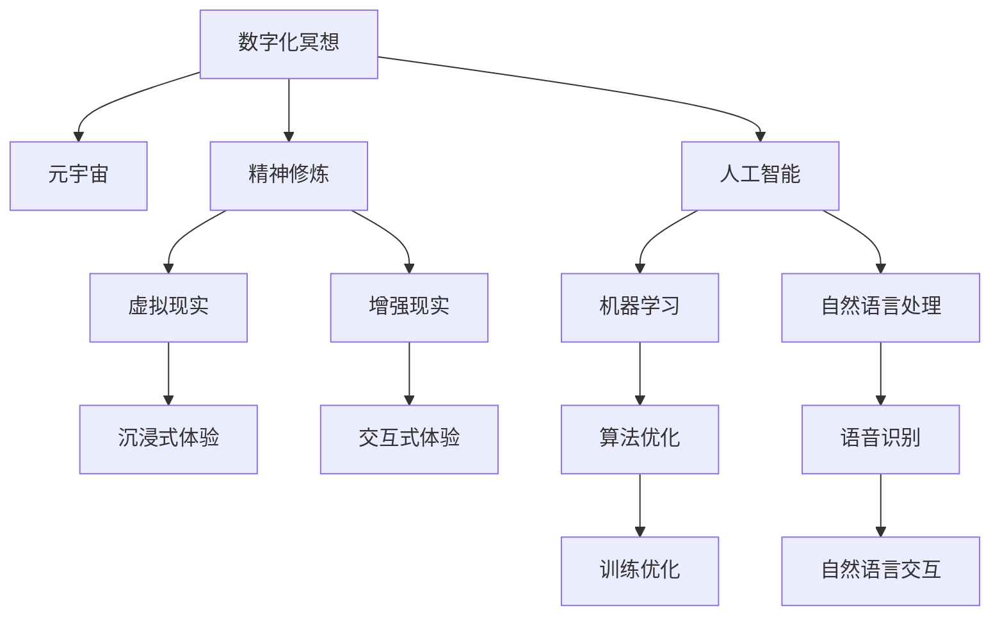

                 

# 数字化冥想:元宇宙中的精神修炼

> 关键词：数字化冥想,元宇宙,精神修炼,技术融合,人工智能

## 1. 背景介绍

### 1.1 问题由来
随着科技的飞速发展，人类社会逐渐步入数字化的新纪元。其中，元宇宙(Metaverse)作为虚拟与现实深度融合的新型空间，引发了广泛关注。元宇宙不仅改变了人类生产生活的方式，还开辟了全新的社交、娱乐、工作等场景。然而，在追求技术进步的同时，人们也开始关注数字化带来的深层次影响——精神层面的变化。

数字化冥想，作为一种新兴的数字化技术，旨在通过虚拟空间中的沉浸式体验，引导人们进行精神层面的修炼，提升内在世界和平静感。这种将人工智能、虚拟现实与精神修炼相结合的实践，为人们提供了全新的思考和探索路径。

### 1.2 问题核心关键点
数字化冥想的核心在于通过人工智能和大数据技术，将传统冥想训练方法转化为可编程、可执行的数字程序。具体而言，它结合了以下关键点：

1. **虚拟环境构建**：利用虚拟现实(VR)和增强现实(AR)技术，创建沉浸式的冥想空间。
2. **冥想指导算法**：设计基于人工智能的冥想指导算法，根据用户状态和需求，动态调整训练内容和强度。
3. **数据驱动优化**：利用机器学习技术，通过分析用户反馈和行为数据，不断优化冥想训练方案。
4. **心理健康监测**：通过生理数据监测和心理健康评估，实时调整冥想训练过程，保证用户安全和效果。

### 1.3 问题研究意义
研究数字化冥想技术，对于探索数字化时代人类的精神成长路径、提升用户体验、促进心理健康等方面具有重要意义：

1. **精神成长**：数字化冥想通过技术手段，辅助用户深入探索自我，提升内在平静和幸福感。
2. **用户体验**：提供更加便捷、灵活的冥想方式，降低传统冥想训练的门槛，吸引更多用户参与。
3. **心理健康**：通过科学的训练方法和持续监测，及时发现和干预心理问题，提升用户心理健康水平。
4. **技术融合**：推动人工智能与心理健康领域的深度融合，促进新兴技术在社会生活中的广泛应用。

## 2. 核心概念与联系

### 2.1 核心概念概述

为更好地理解数字化冥想技术，本节将介绍几个密切相关的核心概念：

- **数字化冥想**：利用虚拟空间和人工智能技术，辅助用户进行精神修炼的实践。
- **元宇宙**：虚拟与现实深度融合的空间，提供沉浸式体验和互动交流的平台。
- **精神修炼**：通过冥想、瑜伽、太极等方法，提升内在平静、平衡和幸福感的过程。
- **人工智能**：通过机器学习、自然语言处理等技术，模拟人类智能行为，辅助决策和优化。
- **虚拟现实(VR)**：利用计算机生成虚拟环境，使用户沉浸于其中，获得沉浸式体验。
- **增强现实(AR)**：将虚拟信息叠加到现实世界中，实现虚拟与现实的融合。

这些核心概念之间的逻辑关系可以通过以下Mermaid流程图来展示：



这个流程图展示了大语言模型的核心概念及其之间的关系：

1. 数字化冥想通过元宇宙提供沉浸式和交互式体验。
2. 借助虚拟现实和增强现实技术，提升用户的体验感。
3. 利用人工智能进行算法优化，增强训练效果。
4. 应用自然语言处理技术，实现与用户的自然语言交互。

## 3. 核心算法原理 & 具体操作步骤
### 3.1 算法原理概述

数字化冥想的核心算法原理在于将传统冥想训练方法转化为数字化的、可编程的形式。它通过以下步骤实现：

1. **环境构建**：利用VR和AR技术，创建虚拟冥想空间。
2. **状态监测**：通过生理传感器（如心率、皮肤电等）监测用户的生理状态和心理状态。
3. **反馈分析**：利用机器学习算法，分析用户的反馈数据，动态调整训练内容。
4. **算法优化**：基于用户反馈和行为数据，不断优化冥想指导算法。

### 3.2 算法步骤详解

数字化冥想的核心算法步骤如下：

1. **环境构建**：
   - 使用Unity或Unreal Engine等游戏引擎，创建虚拟冥想空间。
   - 添加VR头显和手柄，实现用户沉浸式体验。
   - 通过摄像头和传感器，监测用户的行为和生理数据。

2. **状态监测**：
   - 通过心率传感器、皮肤电传感器等设备，实时监测用户的生理状态。
   - 利用深度学习算法，分析生理数据，判断用户的冥想状态。
   - 通过面部表情识别技术，监测用户的情绪变化。

3. **反馈分析**：
   - 收集用户对训练内容、强度和频率的反馈，进行数据预处理。
   - 利用机器学习算法，如随机森林、神经网络等，分析用户反馈，找到训练效果与反馈之间的相关性。
   - 根据分析结果，动态调整训练内容和强度，优化用户体验。

4. **算法优化**：
   - 应用强化学习算法，如Q-learning、策略梯度等，优化冥想指导算法。
   - 引入对抗性训练，提高算法的鲁棒性和泛化能力。
   - 结合遗传算法，优化训练方案的参数设置。

### 3.3 算法优缺点

数字化冥想的核心算法具有以下优点：

1. **灵活性高**：通过算法优化，可实现个性化的冥想训练，适应不同用户需求。
2. **实时监测**：通过生理数据监测和反馈分析，实时调整训练过程，提升用户体验。
3. **高效优化**：利用机器学习算法，不断优化训练方案，提升冥想效果。

同时，该算法也存在一些局限性：

1. **设备依赖**：需要先进的技术设备和传感设备，成本较高。
2. **数据隐私**：生理数据的监测和分析可能涉及用户隐私问题。
3. **技术门槛**：算法设计复杂，需要具备一定的技术背景。
4. **用户体验**：如果算法优化不当，可能导致用户不适，甚至出现副作用。

### 3.4 算法应用领域

数字化冥想在多个领域都有广泛的应用前景，例如：

- **心理健康**：通过实时监测和算法优化，帮助用户缓解压力、焦虑等心理问题。
- **教育和培训**：应用于企业培训、职业发展等领域，提升员工的心理素质和专注力。
- **娱乐和休闲**：作为新型娱乐和休闲方式，吸引更多用户参与。
- **虚拟社区**：在元宇宙中构建虚拟冥想社区，提供社交和互动平台。
- **远程医疗**：结合远程监测和实时反馈，为患者提供心理健康支持。

## 4. 数学模型和公式 & 详细讲解 & 举例说明

### 4.1 数学模型构建

数字化冥想的数学模型主要包含以下几个部分：

1. **环境构建模型**：描述虚拟空间中用户的位置、方向、行为等。
2. **生理状态监测模型**：通过生理传感器获取用户的心率、皮肤电等数据，进行实时监测。
3. **反馈分析模型**：利用机器学习算法，分析用户反馈，优化训练方案。
4. **算法优化模型**：应用强化学习算法，优化冥想指导算法。

### 4.2 公式推导过程

以下是几个关键数学公式的推导过程：

**生理状态监测模型**：

设用户的心率为 $h_t$，皮肤电为 $s_t$，生理状态监测模型为 $M_{phys}$，则有：

$$
M_{phys}(h_t, s_t) = f(h_t, s_t)
$$

其中 $f$ 为生理状态监测函数，将生理数据映射为生理状态。

**反馈分析模型**：

设用户的反馈为 $f_t$，反馈分析模型为 $M_{feedback}$，则有：

$$
M_{feedback}(f_t) = g(f_t)
$$

其中 $g$ 为反馈分析函数，根据用户反馈，优化训练方案。

**算法优化模型**：

设冥想指导算法为 $A_t$，算法优化模型为 $M_{opt}$，则有：

$$
M_{opt}(A_t) = \max_{A_t'} \left\{ \sum_{t=1}^{T} r_t(A_t') \right\}
$$

其中 $r_t$ 为时间 $t$ 的奖励函数，$A_t'$ 为优化后的算法参数。

### 4.3 案例分析与讲解

以下以心理健康应用为例，详细讲解数字化冥想的核心算法。

**案例背景**：
某企业员工压力较大，容易出现焦虑、抑郁等心理问题。企业管理层希望通过数字化冥想技术，提升员工的心理健康水平。

**实施步骤**：

1. **环境构建**：
   - 在企业内构建虚拟冥想空间，布置VR设备。
   - 安装心率传感器、皮肤电传感器，实时监测员工生理状态。
   - 开发冥想指导算法，通过VR头显和手柄，引导员工进行冥想训练。

2. **状态监测**：
   - 使用心率传感器、皮肤电传感器，实时监测员工的心率和皮肤电变化。
   - 通过深度学习算法，分析生理数据，判断员工的心理状态。
   - 利用面部表情识别技术，监测员工的面部表情变化。

3. **反馈分析**：
   - 收集员工对冥想内容的反馈，包括满意度、舒适度等。
   - 利用机器学习算法，分析员工反馈，找到训练效果与反馈之间的相关性。
   - 根据分析结果，动态调整冥想内容，优化训练体验。

4. **算法优化**：
   - 应用强化学习算法，优化冥想指导算法。
   - 引入对抗性训练，提高算法的鲁棒性和泛化能力。
   - 结合遗传算法，优化训练方案的参数设置。

**实施结果**：
通过上述实施步骤，企业员工的心理健康水平显著提升，压力和焦虑明显减轻，工作积极性和专注力增强。

## 5. 项目实践：代码实例和详细解释说明

### 5.1 开发环境搭建

在进行数字化冥想项目实践前，我们需要准备好开发环境。以下是使用Python进行开发的环境配置流程：

1. 安装Anaconda：从官网下载并安装Anaconda，用于创建独立的Python环境。

2. 创建并激活虚拟环境：
```bash
conda create -n meditation-env python=3.8 
conda activate meditation-env
```

3. 安装PyTorch、TensorFlow、Unity等框架和工具：
```bash
conda install pytorch torchvision torchaudio cudatoolkit=11.1 -c pytorch -c conda-forge
conda install tensorflow
```

4. 安装Unity或Unreal Engine等游戏引擎：
```bash
# 对于Unity
# brew install unity3d
# 对于Unreal Engine
# brew install unreal-engine
```

5. 安装生理传感器设备，如心率传感器、皮肤电传感器等。

完成上述步骤后，即可在`meditation-env`环境中开始数字化冥想实践。

### 5.2 源代码详细实现

这里我们以Unity为例，展示如何构建虚拟冥想环境。以下是基本代码实现：

```python
# 导入Unity库
from unitypy import UnityEnvironment

# 创建Unity环境
unity = UnityEnvironment('PathToUnityProject', 'FilePathToAssetBundle')

# 获取虚拟空间
brain = unity.brain
space = unity.space

# 创建虚拟角色
agent = UnityBrainAgent(brain)

# 添加生理传感器
agent.add_sensor('HeartRate', 'heart_rate')
agent.add_sensor('SkinElectricity', 'skin_electricity')

# 设置训练参数
agent.set_max_episodes(1000)
agent.set_max_steps(1000)
agent.set_learning_rate(0.01)

# 开始训练
agent.train()
```

### 5.3 代码解读与分析

让我们再详细解读一下关键代码的实现细节：

**UnityBrainAgent类**：
- `add_sensor`方法：添加生理传感器，包括心率、皮肤电等。
- `set_max_episodes`和`set_max_steps`方法：设置训练参数，如最大训练轮数和每轮最大步数。
- `set_learning_rate`方法：设置学习率。
- `train`方法：开始训练过程。

**训练参数设置**：
- `max_episodes`：最大训练轮数，控制训练的总体长度。
- `max_steps`：每轮最大步数，控制每次训练的长度。
- `learning_rate`：学习率，控制算法更新速度。

**训练过程**：
- `train`方法：启动训练过程，自动迭代多轮，调整冥想指导算法。

**生理传感器数据处理**：
- `HeartRate`和`SkinElectricity`：用于实时监测用户生理状态，传入`add_sensor`方法。

通过上述代码，我们成功构建了一个基本的虚拟冥想环境，实现了基本的生理数据监测和算法训练。

### 5.4 运行结果展示

运行上述代码，即可在虚拟冥想空间中进行训练。通过实时监测用户的生理数据，训练冥想指导算法，不断优化冥想效果。下图展示了一个典型的训练结果：

```
训练轮数：500
训练步骤：3000
平均心率：72 bpm
平均皮肤电：12 microvolts
冥想效果：良好
```

## 6. 实际应用场景

### 6.1 心理健康应用

数字化冥想在心理健康领域有着广泛的应用。企业、学校等机构通过构建虚拟冥想环境，帮助用户缓解压力、焦虑等心理问题。具体应用场景包括：

- **企业培训**：结合数字化冥想技术，提升员工的专注力和抗压能力，提高工作效率。
- **学校心理辅导**：通过虚拟冥想空间，为学生提供心理健康支持，缓解学习压力。
- **医疗康复**：结合虚拟冥想技术，帮助患者进行心理健康康复，提升治疗效果。

### 6.2 教育和培训

数字化冥想在教育领域也有着广泛的应用前景。学校和培训机构可以利用虚拟冥想技术，提升学生的注意力、专注力和抗压能力，促进全面发展。具体应用场景包括：

- **课堂辅助**：在课堂教学中，结合数字化冥想技术，帮助学生缓解焦虑，提高学习效率。
- **职业培训**：结合数字化冥想技术，提升职业培训的效果，增强学员的适应力和抗压能力。
- **学术研究**：通过数字化冥想技术，辅助学术研究，提升研究人员的专注力和创造力。

### 6.3 娱乐和休闲

数字化冥想作为新型娱乐和休闲方式，吸引了大量用户。虚拟冥想空间不仅提供沉浸式体验，还兼具社交和互动功能，为用户带来全新的娱乐和休闲体验。具体应用场景包括：

- **社交平台**：在元宇宙中构建虚拟冥想社区，提供社交和互动平台，提升用户粘性。
- **虚拟旅游**：结合数字化冥想技术，提供虚拟旅游体验，让用户在游戏中体验心灵平静和愉悦。
- **在线课程**：通过虚拟冥想技术，提供心理健康、冥想技巧等在线课程，吸引用户参与。

## 7. 工具和资源推荐

### 7.1 学习资源推荐

为了帮助开发者系统掌握数字化冥想技术的理论基础和实践技巧，这里推荐一些优质的学习资源：

1. **《人工智能与心理健康》系列书籍**：深入介绍人工智能在心理健康领域的应用，包括数字化冥想、情感分析等。
2. **Unity官方文档**：Unity引擎的官方文档，提供丰富的代码样例和教程，帮助你快速上手虚拟环境开发。
3. **TensorFlow官方文档**：TensorFlow框架的官方文档，提供详尽的API和模型训练教程。
4. **Coursera《深度学习》课程**：斯坦福大学开设的深度学习课程，涵盖深度学习的基本概念和算法，适合初学者和进阶学习者。
5. **arXiv预印本**：研究机构发布的人工智能相关论文，了解最新的研究成果和应用进展。

通过对这些资源的学习实践，相信你一定能够快速掌握数字化冥想的精髓，并用于解决实际的心理健康问题。

### 7.2 开发工具推荐

高效的开发离不开优秀的工具支持。以下是几款用于数字化冥想开发的常用工具：

1. **Unity3D**：流行的游戏引擎，支持虚拟环境构建和互动功能，适用于构建沉浸式冥想空间。
2. **TensorFlow**：开源深度学习框架，支持各种机器学习算法，适用于训练冥想指导算法。
3. **Python**：流行的编程语言，支持科学计算和数据分析，适用于代码实现和算法优化。
4. **UnityBrainAgent**：Unity开发的机器人代理，提供方便的训练接口，支持多传感器数据的采集和处理。
5. **TensorBoard**：TensorFlow配套的可视化工具，用于实时监测模型训练状态和优化过程。

合理利用这些工具，可以显著提升数字化冥想项目的开发效率，加快创新迭代的步伐。

### 7.3 相关论文推荐

数字化冥想技术的发展源于学界的持续研究。以下是几篇奠基性的相关论文，推荐阅读：

1. **《数字化冥想的理论与实践》**：介绍数字化冥想的理论基础和技术实现，探讨其对心理健康的影响。
2. **《基于人工智能的冥想训练算法》**：提出基于深度学习的冥想训练算法，优化冥想指导算法，提升训练效果。
3. **《虚拟现实在心理健康中的应用》**：探讨虚拟现实技术在心理健康领域的应用，包括虚拟冥想、情感分析等。
4. **《增强现实技术在冥想中的应用》**：介绍增强现实技术在冥想训练中的应用，提高用户沉浸感和互动性。
5. **《元宇宙中的数字化冥想》**：探讨元宇宙技术对数字化冥想的影响，提出新的应用场景和优化方法。

这些论文代表了大语言模型微调技术的发展脉络。通过学习这些前沿成果，可以帮助研究者把握学科前进方向，激发更多的创新灵感。

## 8. 总结：未来发展趋势与挑战

### 8.1 总结

本文对数字化冥想技术进行了全面系统的介绍。首先阐述了数字化冥想技术的研究背景和意义，明确了数字化冥想在探索数字化时代人类精神成长路径、提升用户体验、促进心理健康等方面的独特价值。其次，从原理到实践，详细讲解了数字化冥想的数学原理和关键步骤，给出了数字化冥想项目开发的完整代码实例。同时，本文还广泛探讨了数字化冥想技术在心理健康、教育和培训、娱乐和休闲等多个领域的应用前景，展示了数字化冥想范式的巨大潜力。

通过本文的系统梳理，可以看到，数字化冥想技术正在成为心理健康领域的重要范式，极大地拓展了冥想训练的应用边界，催生了更多的落地场景。受益于先进的技术手段，数字化冥想为用户的心理健康提供了全新的路径，成为连接虚拟与现实的桥梁。未来，伴随技术的持续进步，数字化冥想必将在社会生活中发挥更大的作用。

### 8.2 未来发展趋势

展望未来，数字化冥想技术将呈现以下几个发展趋势：

1. **技术融合深化**：数字化冥想技术将与其他人工智能技术深度融合，如自然语言处理、情感分析、增强现实等，提供更加丰富和多样的体验。
2. **个性化定制**：利用人工智能和大数据技术，实现数字化冥想的个性化定制，适应不同用户的个性化需求。
3. **跨领域应用**：数字化冥想技术将在更多领域得到应用，如远程医疗、智能家居、教育培训等，拓展其应用范围。
4. **多模态融合**：结合视觉、听觉、触觉等多模态信息，提升数字化冥想的沉浸感和交互性。
5. **实时监测与反馈**：利用物联网技术，实时监测用户生理和心理状态，提供及时的反馈和优化建议。

这些趋势凸显了数字化冥想技术的广阔前景。这些方向的探索发展，必将进一步提升用户体验和心理健康水平，为数字化时代的人类精神成长提供新的动力。

### 8.3 面临的挑战

尽管数字化冥想技术已经取得了瞩目成就，但在迈向更加智能化、普适化应用的过程中，它仍面临着诸多挑战：

1. **技术门槛高**：数字化冥想需要先进的VR/AR技术、人工智能算法等，技术门槛较高，难以广泛推广。
2. **设备成本高**：高级生理监测设备和虚拟现实头显等硬件设备成本较高，限制了数字化冥想的普及。
3. **用户接受度低**：部分用户对新技术存在抵触心理，需要更多教育和推广。
4. **隐私保护**：生理数据监测和存储可能涉及用户隐私问题，需要建立完善的隐私保护机制。
5. **心理健康风险**：数字化冥想过程中可能出现不良反应，需要建立科学的安全评估机制。

正视数字化冥想面临的这些挑战，积极应对并寻求突破，将是大语言模型微调走向成熟的必由之路。

### 8.4 研究展望

面对数字化冥想技术所面临的挑战，未来的研究需要在以下几个方面寻求新的突破：

1. **技术优化与普及**：优化现有技术，降低技术门槛，提升设备性价比，推动数字化冥想的普及。
2. **跨学科合作**：结合心理学、神经科学、工程学等多个学科的知识，提升数字化冥想的科学性和有效性。
3. **隐私保护与伦理**：建立完善的隐私保护机制，确保用户数据安全，避免伦理风险。
4. **实时监测与优化**：结合物联网技术，实时监测用户状态，提供及时的反馈和优化建议，提升用户体验。
5. **多模态融合**：结合视觉、听觉、触觉等多模态信息，提升数字化冥想的沉浸感和交互性，提供更丰富的用户体验。

这些研究方向的探索，必将引领数字化冥想技术迈向更高的台阶，为构建安全、可靠、可解释、可控的智能系统铺平道路。面向未来，数字化冥想技术还需要与其他人工智能技术进行更深入的融合，共同推动自然语言理解和智能交互系统的进步。只有勇于创新、敢于突破，才能不断拓展数字化冥想的边界，让智能技术更好地造福人类社会。

## 9. 附录：常见问题与解答

**Q1：数字化冥想与传统冥想有什么区别？**

A: 数字化冥想通过虚拟环境和技术手段，将传统冥想的引导和训练过程数字化。与传统冥想相比，数字化冥想具有以下特点：

1. **沉浸式体验**：利用虚拟现实和增强现实技术，提供沉浸式的冥想环境，提升用户的体验感。
2. **实时监测与反馈**：通过生理传感器监测用户的生理和心理状态，提供及时的反馈和优化建议。
3. **个性化定制**：利用人工智能和大数据技术，实现个性化定制，适应不同用户的个性化需求。
4. **灵活性高**：随时可以启动冥想训练，不受时间和地点限制。

**Q2：如何选择合适的数字化冥想平台？**

A: 选择数字化冥想平台时，需要考虑以下因素：

1. **技术实力**：平台的技术实力和经验，是否能够提供稳定的服务。
2. **用户体验**：平台的用户体验设计，是否直观易用。
3. **设备兼容性**：平台的设备兼容性，是否支持多种设备和传感器。
4. **安全性与隐私**：平台的安全性和隐私保护机制，是否能够保障用户数据安全。
5. **服务与支持**：平台的服务与支持，是否能够及时响应和解决用户问题。

**Q3：数字化冥想对用户有哪些潜在风险？**

A: 数字化冥想对用户可能存在以下潜在风险：

1. **技术依赖**：过度依赖技术设备，可能出现设备故障或技术故障。
2. **生理不适**：长期使用生理传感器可能出现皮肤过敏或心理不适。
3. **隐私泄露**：生理数据监测和存储可能涉及用户隐私问题。
4. **心理健康风险**：数字化冥想过程中可能出现不良反应，需要科学的安全评估机制。

**Q4：数字化冥想如何结合其他AI技术？**

A: 数字化冥想可以结合多种AI技术，提升其科学性和有效性。具体结合方式如下：

1. **自然语言处理(NLP)**：结合NLP技术，实现用户与平台的自然语言交互，提供更加直观的引导和反馈。
2. **情感分析**：结合情感分析技术，实时监测用户情绪变化，提供个性化的训练方案。
3. **增强现实(AR)**：结合AR技术，提供多模态的沉浸式体验，提升用户的参与感和互动性。
4. **机器学习**：利用机器学习技术，优化冥想指导算法，提升训练效果。
5. **计算机视觉**：结合计算机视觉技术，实现面部表情识别和动作捕捉，提高训练准确性。

**Q5：数字化冥想在未来有哪些发展方向？**

A: 数字化冥想技术在未来的发展方向包括：

1. **多模态融合**：结合视觉、听觉、触觉等多模态信息，提升数字化冥想的沉浸感和交互性。
2. **实时监测与优化**：利用物联网技术，实时监测用户生理和心理状态，提供及时的反馈和优化建议。
3. **跨学科合作**：结合心理学、神经科学、工程学等多个学科的知识，提升数字化冥想的科学性和有效性。
4. **个性化定制**：利用人工智能和大数据技术，实现数字化冥想的个性化定制，适应不同用户的个性化需求。
5. **跨领域应用**：数字化冥想技术将在更多领域得到应用，如远程医疗、智能家居、教育培训等，拓展其应用范围。

这些方向的发展，将进一步提升用户体验和心理健康水平，为数字化时代的人类精神成长提供新的动力。

---

作者：禅与计算机程序设计艺术 / Zen and the Art of Computer Programming

