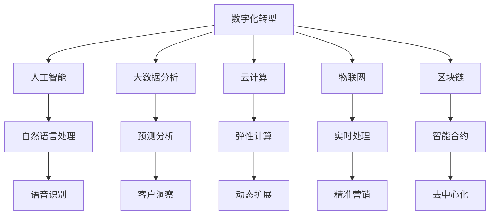

                 

# 数字化创业：打造未来企业的蓝图

数字化转型已经成为现代企业生存和发展的新模式，是企业实现跨越式发展的必由之路。作为一位人工智能领域的专家，我深知数字化技术在企业创新和竞争中的巨大潜力。本文将探讨数字化创业的核心概念、关键技术和应用场景，提出一套企业数字化转型的蓝图，旨在帮助企业构建未来竞争优势，实现持续创新和长期发展。

## 1. 背景介绍

### 1.1 问题由来
数字化转型是企业面对互联网时代浪潮的战略抉择，标志着企业从传统模式向数字模式的根本转变。数字化转型不仅关乎技术手段的变革，更是业务模式、组织结构和文化理念的重塑。在这个过程中，人工智能、大数据、云计算等技术的广泛应用，为企业提供了新的机遇和挑战。

数字化创业的核心在于如何利用先进技术，重新定义企业的价值创造方式，构建以客户为中心的数字化生态系统，推动企业持续创新和高效运营。

### 1.2 问题核心关键点
数字化创业的关键在于以下几个方面：

- **技术驱动创新**：企业应以技术创新为核心驱动力，实现数字化转型。
- **数据赋能决策**：充分利用大数据分析，提升企业决策的精准性和前瞻性。
- **用户中心设计**：构建以用户为中心的数字化产品和服务，提升用户体验和满意度。
- **跨界融合共创**：促进跨行业、跨领域的合作，共同探索数字化应用的无限可能。

## 2. 核心概念与联系

### 2.1 核心概念概述

为了更好地理解数字化创业的框架，本节将介绍几个关键概念及其相互联系：

- **数字化转型**：企业利用信息技术手段，对业务流程、组织架构、文化理念等进行全面优化和升级，以适应数字化时代的发展需求。
- **人工智能**：通过机器学习、深度学习等技术，使计算机具备类似于人类的智能，以自动化、智能化方式处理复杂任务。
- **大数据分析**：利用先进的数据处理技术，从海量数据中提取有价值的信息，支持企业决策和运营优化。
- **云计算**：基于互联网的计算和存储服务模式，提供弹性的计算资源和高效的数据处理能力。
- **物联网(IoT)**：将物理设备和网络相连，实现数据的实时采集和处理，构建智能化的业务体系。
- **区块链**：一种分布式账本技术，保障数据的安全、透明和不可篡改性，提升业务信任和效率。

这些概念之间的逻辑关系可以通过以下Mermaid流程图来展示：



这个流程图展示了数字化创业涉及的主要技术领域及其相互关联：

1. 数字化转型作为核心目标，通过人工智能、大数据分析、云计算、物联网和区块链等多项技术共同实现。
2. 人工智能通过自然语言处理、语音识别等技术，提升企业对客户需求的理解和响应。
3. 大数据分析通过预测分析和客户洞察等手段，支持企业决策和运营优化。
4. 云计算提供弹性计算和动态扩展能力，支持企业的灵活运营。
5. 物联网实现实时处理和精准营销，提升业务效率和用户体验。
6. 区块链保障数据安全和透明，支持去中心化的智能合约，提升业务信任和效率。

## 3. 核心算法原理 & 具体操作步骤
### 3.1 算法原理概述

数字化创业的关键在于如何将先进技术融合到企业运营的各个环节，实现业务模式的全面创新和优化。以下是核心算法原理的概述：

- **数据驱动决策**：通过大数据分析，提取有价值的信息，支持企业决策和运营优化。
- **人工智能赋能**：利用机器学习、深度学习等技术，自动化处理复杂任务，提升工作效率。
- **云计算支持**：通过弹性计算和云存储，支持企业灵活扩展计算资源和数据处理能力。
- **物联网集成**：实现设备、系统和网络的互联互通，提升业务运营的实时性和智能化水平。
- **区块链保障**：利用分布式账本技术，保障数据的透明和不可篡改性，提升业务信任和效率。

### 3.2 算法步骤详解

数字化创业的算法步骤主要包括以下几个关键环节：

**Step 1: 需求分析与规划**
- 对企业当前业务流程、组织结构和文化理念进行全面评估。
- 确定数字化转型的目标和战略，制定详细的实施计划和时间表。

**Step 2: 技术选型与部署**
- 根据企业需求和技术现状，选择合适的技术方案，包括人工智能、大数据、云计算等。
- 进行技术部署，建立企业级的数字化基础设施。

**Step 3: 数据采集与处理**
- 收集和整合企业内外部数据，包括客户数据、业务数据、市场数据等。
- 进行数据清洗和预处理，保证数据的质量和可用性。

**Step 4: 系统设计与开发**
- 设计和开发符合企业需求的数字化应用系统，包括CRM、ERP、电商平台等。
- 采用敏捷开发和DevOps等方法，确保系统的快速迭代和稳定交付。

**Step 5: 数据分析与决策**
- 利用大数据分析技术，提取有价值的信息，支持企业决策和运营优化。
- 采用机器学习、深度学习等算法，自动化处理复杂任务，提升工作效率。

**Step 6: 云计算与弹性扩展**
- 采用云计算平台，提供弹性计算和动态扩展能力，支持企业的灵活运营。
- 优化云资源使用，降低计算成本，提升资源利用效率。

**Step 7: 物联网与实时处理**
- 通过物联网技术，实现设备、系统和网络的互联互通，提升业务运营的实时性和智能化水平。
- 实现智能监测、智能控制和智能决策，提升业务效率和用户体验。

**Step 8: 区块链与数据安全**
- 利用区块链技术，保障数据的透明和不可篡改性，提升业务信任和效率。
- 实现智能合约和去中心化运营，提升业务透明度和公正性。

### 3.3 算法优缺点

数字化创业技术方案的优缺点如下：

**优点**：
- 提升企业运营效率和竞争力，实现跨越式发展。
- 支持企业灵活扩展，满足快速变化的市场需求。
- 提供数据驱动的决策支持，提升决策精准性。

**缺点**：
- 技术实施成本较高，需要大量资金投入。
- 技术复杂性高，需要专业团队支持。
- 对企业原有业务模式和文化理念进行重大变革，可能带来一定挑战。

### 3.4 算法应用领域

数字化创业技术在多个领域得到了广泛应用，例如：

- **金融科技**：通过大数据分析、人工智能、区块链等技术，提升金融服务的智能化水平，支持金融创新和风险管理。
- **零售电商**：利用物联网技术实现库存管理、精准营销和客户服务，提升用户体验和业务效率。
- **制造业**：采用云计算和物联网技术，实现智能制造、智能物流和供应链管理，提升生产效率和质量。
- **医疗健康**：通过大数据分析和人工智能，支持医疗决策、疾病预测和精准医疗，提升医疗服务水平。
- **教育培训**：利用大数据分析和人工智能，提供个性化学习方案和智能推荐，提升教育质量和效果。
- **智慧城市**：通过物联网和云计算技术，实现智能交通、智能安防和智慧治理，提升城市管理水平和居民生活质量。

## 4. 数学模型和公式 & 详细讲解

### 4.1 数学模型构建

数字化创业的数学模型主要涉及以下几个关键领域：

- **数据处理与分析**：
  - 数据清洗：去除噪声和异常值，确保数据质量。
  - 特征提取：通过主成分分析(PCA)、线性判别分析(LDA)等算法，提取关键特征。
  - 预测分析：采用回归、分类、聚类等算法，进行数据预测和分析。

- **机器学习与深度学习**：
  - 回归模型：通过线性回归、多项式回归等模型，预测连续型变量。
  - 分类模型：通过逻辑回归、支持向量机(SVM)、随机森林等模型，进行分类预测。
  - 神经网络模型：通过卷积神经网络(CNN)、循环神经网络(RNN)、长短时记忆网络(LSTM)等模型，处理复杂数据和任务。

- **优化与计算**：
  - 优化算法：通过梯度下降、牛顿法等算法，优化模型参数。
  - 计算复杂度：通过时间复杂度和空间复杂度分析，评估算法的计算效率。

### 4.2 公式推导过程

以下是几个核心算法的公式推导过程：

**线性回归模型**：
$$
y = w_0 + w_1x_1 + w_2x_2 + ... + w_nx_n
$$
其中，$w$ 为模型参数，$x$ 为输入特征，$y$ 为输出结果。

**逻辑回归模型**：
$$
P(y|x) = \frac{1}{1 + e^{-(w_0 + w_1x_1 + w_2x_2 + ... + w_nx_n)}}
$$
其中，$P(y|x)$ 为条件概率，$w$ 为模型参数。

**卷积神经网络**：
$$
y = w_1 * x_1 + b_1 + w_2 * x_2 + b_2 + ... + w_n * x_n + b_n
$$
其中，$y$ 为输出结果，$x$ 为输入特征，$w$ 为卷积核参数，$b$ 为偏置参数。

**长短时记忆网络**：
$$
y = \sum_{i=1}^t w_i \odot x_i
$$
其中，$y$ 为输出结果，$x$ 为输入特征，$w$ 为权重参数，$t$ 为时间步长。

### 4.3 案例分析与讲解

以一家零售电商企业为例，分析数字化创业的具体应用：

**需求分析**：
- 企业需要提高库存管理效率，实现精准营销和客户服务。

**技术选型**：
- 选择大数据分析、人工智能、云计算等技术，构建数字化基础设施。

**数据采集与处理**：
- 收集客户购买记录、商品信息、市场数据等。
- 进行数据清洗和预处理，确保数据质量和可用性。

**系统设计与开发**：
- 设计并开发库存管理系统、精准营销平台和智能客服系统。
- 采用敏捷开发和DevOps方法，确保系统快速迭代和稳定交付。

**数据分析与决策**：
- 利用大数据分析技术，提取有价值的信息，支持库存管理优化。
- 采用机器学习算法，预测客户购买行为和趋势，实现精准营销。

**云计算与弹性扩展**：
- 采用云计算平台，提供弹性计算和动态扩展能力，支持企业的灵活运营。
- 优化云资源使用，降低计算成本，提升资源利用效率。

**物联网与实时处理**：
- 通过物联网技术，实现库存监测、智能补货和物流管理，提升业务效率。
- 实现智能客服，提升客户体验和满意度。

**区块链与数据安全**：
- 利用区块链技术，保障数据透明和不可篡改性，提升业务信任和效率。
- 实现智能合约和去中心化运营，提升业务透明度和公正性。

## 5. 项目实践：代码实例和详细解释说明
### 5.1 开发环境搭建

在进行数字化创业的实践前，我们需要准备好开发环境。以下是使用Python进行PyTorch开发的环境配置流程：

1. 安装Anaconda：从官网下载并安装Anaconda，用于创建独立的Python环境。

2. 创建并激活虚拟环境：
```bash
conda create -n pytorch-env python=3.8 
conda activate pytorch-env
```

3. 安装PyTorch：根据CUDA版本，从官网获取对应的安装命令。例如：
```bash
conda install pytorch torchvision torchaudio cudatoolkit=11.1 -c pytorch -c conda-forge
```

4. 安装TensorFlow：
```bash
pip install tensorflow
```

5. 安装各类工具包：
```bash
pip install numpy pandas scikit-learn matplotlib tqdm jupyter notebook ipython
```

完成上述步骤后，即可在`pytorch-env`环境中开始数字化创业的实践。

### 5.2 源代码详细实现

下面我们以零售电商企业为例，给出使用PyTorch进行数据分析和智能推荐系统的PyTorch代码实现。

首先，定义数据处理函数：

```python
import pandas as pd
from sklearn.model_selection import train_test_split
from sklearn.preprocessing import StandardScaler

def preprocess_data(data):
    # 数据清洗和预处理
    data = data.dropna()
    data = data.drop_duplicates()
    
    # 特征提取
    features = data[['price', 'category', 'brand', 'comments']]
    target = data['purchase']
    
    # 标准化处理
    scaler = StandardScaler()
    features = scaler.fit_transform(features)
    
    # 划分训练集和测试集
    features_train, features_test, target_train, target_test = train_test_split(features, target, test_size=0.2)
    
    return features_train, features_test, target_train, target_test
```

然后，定义模型和优化器：

```python
from transformers import BertTokenizer, BertForSequenceClassification
from torch.utils.data import DataLoader
import torch

class RecommendationSystem:
    def __init__(self):
        self.tokenizer = BertTokenizer.from_pretrained('bert-base-cased')
        self.model = BertForSequenceClassification.from_pretrained('bert-base-cased', num_labels=1)
        self.device = torch.device('cuda' if torch.cuda.is_available() else 'cpu')
        self.model.to(self.device)
    
    def train(self, features_train, features_test, target_train, target_test, batch_size, epochs):
        self.model.train()
        optimizer = torch.optim.Adam(self.model.parameters(), lr=0.001)
        
        for epoch in range(epochs):
            for batch in DataLoader(list(zip(features_train, target_train)), batch_size):
                inputs = self.tokenizer(batch[0], padding=True, truncation=True, max_length=256)
                labels = batch[1]
                
                inputs = {key: tensor.to(self.device) for key, tensor in inputs.items()}
                labels = labels.to(self.device)
                
                outputs = self.model(**inputs)
                loss = outputs.loss
                loss.backward()
                optimizer.step()
                
                if (epoch+1) % 100 == 0:
                    self.model.eval()
                    with torch.no_grad():
                        self.evaluate(features_test, target_test)
    
    def evaluate(self, features_test, target_test):
        self.model.eval()
        with torch.no_grad():
            features_test = torch.tensor(features_test).to(self.device)
            labels = torch.tensor(target_test).to(self.device)
            outputs = self.model(features_test)
            predictions = outputs.logits.squeeze().detach().cpu().numpy()
            accuracy = (predictions > 0.5).sum() / len(predictions)
            print(f'Accuracy: {accuracy:.2f}')
```

最后，启动训练流程并在测试集上评估：

```python
# 数据准备
data = pd.read_csv('recommendation_data.csv')
features_train, features_test, target_train, target_test = preprocess_data(data)

# 模型训练
model = RecommendationSystem()
model.train(features_train, features_test, target_train, target_test, batch_size=32, epochs=10)

# 模型评估
print('Model accuracy:', model.evaluate(features_test, target_test))
```

以上就是使用PyTorch进行零售电商企业数字化转型的完整代码实现。可以看到，通过上述代码，可以构建一个基于BERT模型的智能推荐系统，支持商品推荐和客户行为预测。

### 5.3 代码解读与分析

让我们再详细解读一下关键代码的实现细节：

**preprocess_data函数**：
- 对原始数据进行清洗和预处理，包括去除缺失值、去除重复记录等。
- 进行特征提取和标准化处理，确保数据的质量和可用性。
- 划分训练集和测试集，供模型训练和评估使用。

**RecommendationSystem类**：
- 初始化函数中，选择预训练的BERT模型和分词器。
- 训练函数中，使用Adam优化器对模型进行训练，并在每个epoch结束时评估模型性能。
- 评估函数中，在测试集上评估模型的准确率。

**训练流程**：
- 定义训练次数和批大小，开始循环迭代。
- 每个epoch内，对训练集数据进行迭代，计算损失并更新模型参数。
- 周期性在测试集上评估模型性能，输出评估结果。

**评估结果**：
- 输出模型的准确率，评估模型在测试集上的性能。

通过上述代码实现，可以构建一个较为完整的数字化推荐系统，支持零售电商企业的智能化运营。

## 6. 实际应用场景

### 6.1 智能制造

数字化创业技术在智能制造领域的应用，可以显著提升生产效率和产品质量。通过物联网技术实现设备互联和数据实时采集，利用大数据分析进行设备状态预测和故障诊断，采用人工智能进行生产过程优化和质量控制，实现智能制造的闭环管理。

以某智能制造企业为例，通过部署物联网传感器，实时监测生产线上的设备状态和生产数据。利用大数据分析技术，对设备状态进行预测和诊断，及时发现设备故障并进行维护。通过人工智能技术，对生产过程进行优化，提高生产效率和产品质量。最终实现了生产过程的智能化、自动化和精细化管理，提高了企业的竞争力。

### 6.2 智慧医疗

数字化创业技术在智慧医疗领域的应用，可以提升医疗服务的智能化水平，支持医疗决策和精准医疗。通过大数据分析进行疾病预测和诊断，采用人工智能进行辅助诊疗和个性化治疗，利用物联网实现患者健康监测和管理，实现智慧医疗的全面覆盖。

以某智慧医疗平台为例，通过大数据分析技术，对患者的健康数据进行深度分析，实现疾病预测和诊断。采用人工智能技术，辅助医生进行精准诊疗和个性化治疗。利用物联网技术，实现患者健康数据的实时监测和管理。最终实现了智慧医疗的全面覆盖，提高了医疗服务的质量和效率。

### 6.3 智慧城市

数字化创业技术在智慧城市领域的应用，可以实现城市管理的智能化和高效化。通过物联网技术实现城市基础设施的互联互通，利用大数据分析进行城市运营的实时监测和优化，采用人工智能技术进行智能交通、智能安防和智慧治理，实现智慧城市的全面建设。

以某智慧城市项目为例，通过部署物联网传感器，实现城市基础设施的实时监测和控制。利用大数据分析技术，对城市运营数据进行深度分析，实现城市运营的优化和决策支持。采用人工智能技术，实现智能交通、智能安防和智慧治理，提高城市管理的智能化和高效化水平。最终实现了智慧城市的全面建设，提升了城市居民的生活质量。

## 7. 工具和资源推荐
### 7.1 学习资源推荐

为了帮助开发者系统掌握数字化创业的理论基础和实践技巧，这里推荐一些优质的学习资源：

1. 《数字化转型：从理论到实践》系列博文：由数字化创业专家撰写，深入浅出地介绍了数字化转型的基本概念和实践方法。

2. CS225《人工智能导论》课程：斯坦福大学开设的人工智能入门课程，涵盖了机器学习、深度学习等核心内容，适合初学者学习。

3. 《AI Superpowers: China, Silicon Valley, and the New World Order》书籍：吴军博士所著，探讨了人工智能技术对全球经济和政治格局的影响，提供了深入的思考和见解。

4. 《深度学习与人工智能》书籍：李宏毅教授所著，全面介绍了深度学习的基本原理和实践方法，适合进阶学习。

5. Kaggle：一个数据科学竞赛平台，提供大量数据集和算法竞赛，是数据科学爱好者学习实践的好去处。

通过对这些资源的学习实践，相信你一定能够快速掌握数字化创业的理论基础和实践技巧，并将其应用于实际场景中。

### 7.2 开发工具推荐

高效的开发离不开优秀的工具支持。以下是几款用于数字化创业开发的常用工具：

1. Python：广泛使用的编程语言，支持丰富的第三方库和工具，适合数据科学和人工智能开发。

2. PyTorch：基于Python的深度学习框架，灵活的计算图机制，适合快速迭代和原型开发。

3. TensorFlow：由Google主导开发的深度学习框架，支持分布式计算和GPU加速，适合大规模工程应用。

4. Jupyter Notebook：开源的交互式计算环境，支持代码编写、数据可视化和交互式学习，适合学术研究和工程开发。

5. Git：版本控制系统，支持代码管理和协作开发，适合团队协同工作。

6. Docker：容器化技术，支持代码打包和部署，适合云原生应用开发。

合理利用这些工具，可以显著提升数字化创业任务的开发效率，加快创新迭代的步伐。

### 7.3 相关论文推荐

数字化创业技术的发展源于学界的持续研究。以下是几篇奠基性的相关论文，推荐阅读：

1. "Digital Transformation: A Model of Value Co-Creation Through Information and Communication Technologies" - Laloux和Reppen（2017）
2. "Big Data Analytics in Enterprise Transformation: A Survey" - Fidali和Cerdeira（2019）
3. "Artificial Intelligence for Smart Manufacturing: A Review" - Li和Chen（2018）
4. "AI in Healthcare: Opportunities and Challenges" - Jenkins和Holmes（2021）
5. "Internet of Things (IoT) for Smart Cities: A Review" - Popat和Sundararajan（2016）

这些论文代表了大规模数字化创业技术的发展脉络。通过学习这些前沿成果，可以帮助研究者把握学科前进方向，激发更多的创新灵感。

## 8. 总结：未来发展趋势与挑战

### 8.1 总结

本文对数字化创业的核心概念、关键技术和应用场景进行了全面系统的介绍。首先阐述了数字化创业的必要性和重要性，明确了技术驱动创新、数据赋能决策、用户中心设计等关键点。其次，从原理到实践，详细讲解了数字化创业的数学模型和算法步骤，给出了数字化创业的代码实例和详细解释。同时，本文还广泛探讨了数字化创业技术在智能制造、智慧医疗、智慧城市等多个领域的应用前景，展示了数字化创业技术的巨大潜力。

通过本文的系统梳理，可以看到，数字化创业技术正在成为现代企业竞争的重要范式，极大地拓展了企业的创新能力和业务模式。未来，随着技术的不断发展，数字化创业必将在更多领域得到应用，为企业的可持续发展提供新的动力。

### 8.2 未来发展趋势

展望未来，数字化创业技术将呈现以下几个发展趋势：

1. **技术融合深化**：大数据、人工智能、云计算、物联网和区块链等技术将更加深度融合，形成更加全面、高效、安全的数字化生态系统。

2. **智能化水平提升**：通过人工智能和物联网技术的广泛应用，企业将实现更加智能化、自动化的业务运营，提升效率和用户体验。

3. **数据价值挖掘**：利用大数据分析技术，企业将深入挖掘数据的价值，支持精准决策和业务优化。

4. **跨界合作加强**：通过跨行业、跨领域的合作，企业将实现更加协同、创新的数字化应用，拓展业务边界。

5. **全球化扩展**：随着数字化技术的全球普及，企业将面向全球市场，实现业务的国际化扩展。

6. **可持续性关注**：在数字化转型的过程中，企业将更加注重环保和可持续发展，实现绿色数字化。

以上趋势凸显了数字化创业技术的广阔前景。这些方向的探索发展，必将进一步提升企业的运营效率和市场竞争力，为全球经济的可持续发展注入新的动力。

### 8.3 面临的挑战

尽管数字化创业技术已经取得了瞩目成就，但在迈向更加智能化、普适化应用的过程中，它仍面临着诸多挑战：

1. **技术复杂性高**：数字化创业涉及多个技术领域，实施复杂度高，需要专业团队支持。

2. **数据安全和隐私**：在数字化转型的过程中，企业需要处理大量敏感数据，数据安全和隐私保护成为重大挑战。

3. **成本投入高**：数字化转型的初期投入大，需要大量资金和技术支持。

4. **组织变革难**：数字化创业需要企业进行组织结构和文化理念的重大变革，可能带来一定的变革阻力。

5. **市场竞争激烈**：数字化转型加速了市场竞争，企业需要快速迭代和不断创新，才能在激烈的市场竞争中占据优势。

6. **技术更新快**：数字化技术不断演进，企业需要持续跟踪最新技术动态，不断更新技术栈和应用方案。

正视数字化创业面临的这些挑战，积极应对并寻求突破，将是大规模数字化创业技术走向成熟的必由之路。相信随着学界和产业界的共同努力，这些挑战终将一一被克服，数字化创业必将在构建人机协同的智能时代中扮演越来越重要的角色。

### 8.4 研究展望

面向未来，数字化创业技术需要在以下几个方面寻求新的突破：

1. **多模态融合**：将视觉、语音、文本等多模态数据进行深度融合，提升数字化应用的多样性和智能化水平。

2. **去中心化智能**：利用区块链和去中心化技术，构建更加透明、公平的数字化生态系统。

3. **个性化定制**：利用大数据分析和人工智能技术，实现产品和服务的高定制化，提升用户体验和满意度。

4. **自动化运维**：利用自动化运维技术，实现数字化系统的自动化部署、管理和优化，提升运营效率。

5. **伦理和法律**：在数字化转型的过程中，注重数据伦理和法律合规，保护用户隐私和数据安全。

这些研究方向的探索，必将引领数字化创业技术迈向更高的台阶，为构建安全、可靠、可解释、可控的智能系统铺平道路。面向未来，数字化创业技术还需要与其他人工智能技术进行更深入的融合，如知识表示、因果推理、强化学习等，多路径协同发力，共同推动自然语言理解和智能交互系统的进步。只有勇于创新、敢于突破，才能不断拓展数字化创业的边界，让智能技术更好地造福人类社会。

## 9. 附录：常见问题与解答

**Q1：什么是数字化创业？**

A: 数字化创业是指企业利用数字化技术，对业务流程、组织结构和文化理念进行全面优化和升级，实现跨越式发展的过程。

**Q2：数字化创业的关键技术有哪些？**

A: 数字化创业的关键技术包括大数据分析、人工智能、云计算、物联网和区块链等。

**Q3：数字化创业的优势和挑战是什么？**

A: 数字化创业的优势在于提升运营效率和市场竞争力，实现跨越式发展。挑战在于技术复杂性高、成本投入大、组织变革难等。

**Q4：如何选择合适的数字化技术方案？**

A: 应根据企业需求和技术现状，选择合适的数字化技术方案，进行全面评估和规划。

**Q5：数字化创业的实施步骤有哪些？**

A: 实施步骤包括需求分析与规划、技术选型与部署、数据采集与处理、系统设计与开发、数据分析与决策、云计算与弹性扩展、物联网与实时处理、区块链与数据安全等。

**Q6：数字化创业的未来发展趋势是什么？**

A: 未来发展趋势包括技术融合深化、智能化水平提升、数据价值挖掘、跨界合作加强、全球化扩展和可持续性关注等。

通过本文的系统梳理，可以看到，数字化创业技术正在成为现代企业竞争的重要范式，极大地拓展了企业的创新能力和业务模式。未来，随着技术的不断发展，数字化创业必将在更多领域得到应用，为企业的可持续发展提供新的动力。

---

作者：禅与计算机程序设计艺术 / Zen and the Art of Computer Programming

