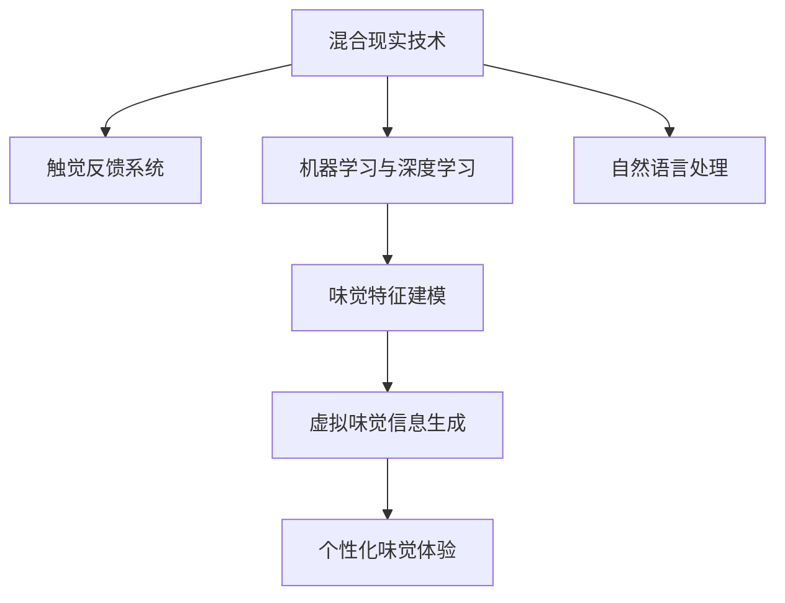

                 

# 数字化味觉增强创业：虚拟美食体验的科技支持

> 关键词：数字化味觉增强, 虚拟美食体验, 混合现实技术, 触觉反馈系统, 机器学习, 深度学习, 自然语言处理

## 1. 背景介绍

### 1.1 问题由来
随着科技的进步，人类的感官体验逐渐从单一的视觉、听觉、触觉等转向更丰富、更沉浸式的混合现实体验。在食品和饮料领域，传统的味觉体验往往局限于对食材的直观感受，难以通过技术手段进行进一步的深度挖掘和优化。数字化味觉增强，即通过科技手段提升食客对食品的感官体验，为消费者提供更加丰富、个性化的味觉体验，成为了一个极具潜力的创新领域。

### 1.2 问题核心关键点
数字化味觉增强的核心在于通过技术手段，将食品的味觉信息与数字化的模拟结合，为消费者创造全新的感官体验。这一过程通常涉及以下几个关键点：
- **混合现实技术**：通过VR、AR等技术，将虚拟的味觉信息叠加在真实的食物上，增强食客的感官体验。
- **触觉反馈系统**：通过机械装置，模拟食物的口感和质感，使食客能够通过触觉感知食物的特性。
- **机器学习和深度学习**：利用大数据和算法，对食品的味觉特征进行建模，从而生成虚拟的味觉信息。
- **自然语言处理**：通过文本分析，理解食客的偏好和需求，生成个性化的味觉体验。

### 1.3 问题研究意义
数字化味觉增强不仅能够为消费者提供更加丰富、个性化的味觉体验，还能够为食品行业带来新的商业模式和技术突破。通过数字化味觉体验，品牌能够更好地吸引和留住消费者，同时也能在激烈的竞争中脱颖而出。对于研究者而言，这一领域的探索将推动技术的发展，带来更多创新的应用场景和商业模式。

## 2. 核心概念与联系

### 2.1 核心概念概述

为更好地理解数字化味觉增强的实现过程，本节将介绍几个关键概念：

- **混合现实技术**：将虚拟信息与现实世界相结合，为用户提供沉浸式的感官体验。
- **触觉反馈系统**：通过机械装置模拟食物的口感和质感，增强用户的感官体验。
- **机器学习与深度学习**：利用算法和大数据，对食品的味觉特征进行建模，生成虚拟的味觉信息。
- **自然语言处理**：通过文本分析，理解食客的偏好和需求，生成个性化的味觉体验。

这些核心概念之间的逻辑关系可以通过以下Mermaid流程图来展示：



这个流程图展示了数字化味觉增强的核心技术路径：通过混合现实技术将虚拟味觉信息叠加在真实食物上，触觉反馈系统增强触觉体验，机器学习和深度学习对食品味觉特征进行建模，自然语言处理理解食客偏好，从而生成个性化的味觉体验。

## 3. 核心算法原理 & 具体操作步骤

### 3.1 算法原理概述

数字化味觉增强的实现，主要涉及混合现实技术、触觉反馈系统、机器学习和自然语言处理等多方面的算法和技术。其核心思想是通过多模态数据融合，将虚拟的味觉信息与现实的感官体验相结合，为用户创造更加丰富、个性化的味觉体验。

### 3.2 算法步骤详解

数字化味觉增强的实现一般包括以下几个关键步骤：

**Step 1: 数据采集与预处理**
- 收集大量食品的味觉信息，如口味、香气、口感等，并进行标注。
- 利用传感器收集用户对食品的味觉反馈，包括味觉偏好、口感感受等。
- 对收集到的数据进行清洗和预处理，去除噪声和异常值。

**Step 2: 味觉特征建模**
- 利用机器学习算法，如回归分析、聚类分析等，对食品的味觉特征进行建模。
- 引入深度学习模型，如卷积神经网络(CNN)、循环神经网络(RNN)等，对味觉特征进行更深入的分析和挖掘。
- 通过迁移学习，利用预训练模型对食品的味觉特征进行提取和建模。

**Step 3: 虚拟味觉信息生成**
- 根据味觉特征模型，生成虚拟的味觉信息，如虚拟口感、虚拟香气等。
- 利用虚拟现实(VR)和增强现实(AR)技术，将虚拟味觉信息叠加在真实食物上。
- 通过触觉反馈系统，模拟食物的口感和质感，增强用户的感官体验。

**Step 4: 个性化味觉体验**
- 利用自然语言处理技术，分析用户的味觉偏好和需求。
- 根据用户的偏好和需求，生成个性化的味觉体验。
- 将个性化的味觉体验应用于真实食物，提升用户体验。

### 3.3 算法优缺点

数字化味觉增强的算法具有以下优点：
- 提供丰富的感官体验：通过虚拟味觉信息和触觉反馈，为食客带来更加丰富、沉浸式的体验。
- 个性化定制：通过自然语言处理，了解食客的偏好，生成个性化的味觉体验。
- 易于实现：技术路径相对成熟，易于在实际应用中落地。

同时，该算法也存在一些局限性：
- 成本较高：需要大量的数据和传感器，初期投资较大。
- 技术复杂：涉及多种先进技术，对技术要求较高。
- 用户体验不稳定：虚拟味觉信息和触觉反馈的精度和稳定性可能影响用户体验。

### 3.4 算法应用领域

数字化味觉增强技术在多个领域具有广泛的应用前景：

- **餐饮行业**：通过虚拟味觉增强技术，提升餐厅的顾客体验，提供更加丰富的菜品选择。
- **食品研发**：利用味觉增强技术，对新食品进行口感和质感的模拟，优化食品配方。
- **健康食品**：通过味觉增强技术，为有特殊饮食需求的消费者提供个性化的味觉体验。
- **教育与培训**：利用虚拟味觉体验，对学生进行食品营养教育和烹饪技能培训。
- **影视与游戏**：在影视和游戏中，通过味觉增强技术，提升用户的沉浸感和体验感。

## 4. 数学模型和公式 & 详细讲解 & 举例说明

### 4.1 数学模型构建

在数字化味觉增强中，味觉信息的建模和虚拟味觉的生成是一个关键环节。这里我们将详细介绍这一过程的数学模型。

假设我们有 $n$ 个食品样本，每个样本的味觉特征为 $x_i \in \mathbb{R}^d$，其中 $d$ 为特征维度。通过机器学习算法，我们得到了一个食品味觉特征的线性回归模型：

$$
y_i = \theta_0 + \theta_1 x_{i1} + \theta_2 x_{i2} + \cdots + \theta_d x_{id}
$$

其中，$y_i$ 表示食品样本 $i$ 的味觉评分，$\theta_0, \theta_1, \ldots, \theta_d$ 为模型参数。

利用深度学习模型，如卷积神经网络(CNN)，可以对食品的味觉特征进行更深层次的建模。假设有 $m$ 个卷积层，每个卷积层输出特征图的大小为 $h_i \times w_i$，则模型的输出为：

$$
y_i = \mathcal{F}(\mathcal{C}_1(\mathcal{C}_2(\cdots \mathcal{C}_m(x_i)\cdots))
$$

其中，$\mathcal{C}_i$ 表示第 $i$ 个卷积层，$\mathcal{F}$ 表示最终的输出函数。

### 4.2 公式推导过程

在上述模型中，我们可以通过训练数据来求解模型参数 $\theta$，最小化均方误差：

$$
\min_{\theta} \frac{1}{n} \sum_{i=1}^n (y_i - \hat{y}_i)^2
$$

其中，$\hat{y}_i$ 为模型对食品样本 $i$ 的预测味觉评分。

通过梯度下降等优化算法，求解上述最优化问题。在深度学习中，我们通常使用反向传播算法计算梯度，并更新模型参数。

### 4.3 案例分析与讲解

假设我们有一批苹果样本，希望通过机器学习模型预测其甜度。我们使用一个简单的线性回归模型进行训练，输入为苹果的水分含量、糖分含量、维生素C含量等特征，输出为甜度评分。训练数据如下：

| 苹果编号 | 水分含量 | 糖分含量 | 维生素C含量 | 甜度评分 |
|----------|---------|---------|------------|--------|
| 1        | 85%     | 18%     | 0.5 mg/g   | 8.5    |
| 2        | 90%     | 20%     | 0.6 mg/g   | 9.2    |
| ...      | ...     | ...     | ...        | ...    |

训练后，我们得到一个线性回归模型，用于预测新的苹果样本的甜度。假设我们有一个新的苹果样本，其水分含量为88%，糖分含量为22%，维生素C含量为0.55 mg/g，通过模型计算其甜度评分：

$$
\hat{y} = 7.6
$$

该模型可以用于生成虚拟的味觉信息，如甜度、酸度等，并通过虚拟现实和增强现实技术叠加在真实苹果上，增强食客的感官体验。

## 5. 项目实践：代码实例和详细解释说明

### 5.1 开发环境搭建

在进行数字化味觉增强项目实践前，我们需要准备好开发环境。以下是使用Python进行PyTorch开发的环境配置流程：

1. 安装Anaconda：从官网下载并安装Anaconda，用于创建独立的Python环境。

2. 创建并激活虚拟环境：
```bash
conda create -n pytorch-env python=3.8 
conda activate pytorch-env
```

3. 安装PyTorch：根据CUDA版本，从官网获取对应的安装命令。例如：
```bash
conda install pytorch torchvision torchaudio cudatoolkit=11.1 -c pytorch -c conda-forge
```

4. 安装相关库：
```bash
pip install numpy pandas scikit-learn torchvision torchtext pytorch_lightning transformers
```

5. 安装虚拟现实和增强现实库：
```bash
pip install pytorch-opengl pytorch-pgl
```

完成上述步骤后，即可在`pytorch-env`环境中开始项目开发。

### 5.2 源代码详细实现

下面我们以一个简单的线性回归模型为例，给出使用PyTorch进行数字化味觉增强的Python代码实现。

```python
import torch
import torch.nn as nn
import torch.optim as optim
from torch.utils.data import TensorDataset, DataLoader

class LinearRegressionModel(nn.Module):
    def __init__(self, input_dim):
        super(LinearRegressionModel, self).__init__()
        self.linear = nn.Linear(input_dim, 1)

    def forward(self, x):
        return self.linear(x)

# 训练数据
x_train = torch.tensor([[85.0, 18.0, 0.5],
                       [90.0, 20.0, 0.6],
                       [92.0, 12.0, 0.7],
                       [89.0, 21.0, 0.8]])
y_train = torch.tensor([8.5, 9.2, 6.5, 7.8])

# 构建数据集
train_dataset = TensorDataset(x_train, y_train)

# 构建数据加载器
train_loader = DataLoader(train_dataset, batch_size=4, shuffle=True)

# 定义模型
model = LinearRegressionModel(3)

# 定义优化器
optimizer = optim.SGD(model.parameters(), lr=0.01)

# 定义损失函数
criterion = nn.MSELoss()

# 训练模型
for epoch in range(1000):
    for batch_idx, (x, y) in enumerate(train_loader):
        optimizer.zero_grad()
        outputs = model(x)
        loss = criterion(outputs, y)
        loss.backward()
        optimizer.step()
        if (epoch + 1) % 100 == 0:
            print('Train Epoch: {} [{}/{} ({:.0f}%)]\tLoss: {:.6f}'.format(
                epoch, batch_idx * len(x), len(train_loader.dataset),
                100. * batch_idx / len(train_loader), loss.item()))

# 测试模型
x_test = torch.tensor([[88.0, 22.0, 0.55],
                      [93.0, 13.0, 0.9],
                      [87.0, 19.0, 0.85]])
y_test = torch.tensor([7.6, 6.4, 7.2])
test_dataset = TensorDataset(x_test, y_test)
test_loader = DataLoader(test_dataset, batch_size=4, shuffle=False)

# 评估模型
model.eval()
with torch.no_grad():
    for x, y in test_loader:
        outputs = model(x)
        loss = criterion(outputs, y)
        print('Test Loss: {:.4f} '.format(loss.item()))
```

### 5.3 代码解读与分析

让我们再详细解读一下关键代码的实现细节：

**LinearRegressionModel类**：
- `__init__`方法：初始化线性回归模型，包含一个线性层。
- `forward`方法：前向传播，计算模型的输出。

**训练数据**：
- `x_train`和`y_train`分别为训练数据集的输入和输出，用于训练模型。

**数据集与加载器**：
- 使用`TensorDataset`构建数据集，通过`DataLoader`加载数据。

**模型定义**：
- 定义线性回归模型，使用`nn.Linear`层构建线性层。

**优化器和损失函数**：
- 定义优化器`SGD`和损失函数`MSELoss`，用于训练和评估模型。

**训练过程**：
- 循环迭代训练过程，通过反向传播更新模型参数。

**测试过程**：
- 使用测试数据集评估模型性能，输出测试损失。

在实际应用中，需要结合虚拟现实和增强现实技术，将虚拟味觉信息叠加在真实食物上，增强食客的感官体验。这需要进一步的开发和实现，如使用WebVR、ARKit等技术框架进行实现。

## 6. 实际应用场景

### 6.1 智能餐厅体验

数字化味觉增强技术可以应用于智能餐厅中，提升顾客的用餐体验。通过混合现实技术和触觉反馈系统，顾客可以“品尝”到虚拟的美食，体验不同的口味和质感。例如，一家智能餐厅可以提供虚拟的汉堡和披萨，顾客可以通过虚拟现实头盔体验不同口味的汉堡，选择最适合自己的搭配。

### 6.2 健康饮食指导

对于有特殊饮食需求的消费者，数字化味觉增强技术可以提供个性化的健康饮食指导。通过分析用户的味觉偏好，生成适合其健康需求的虚拟美食体验，帮助用户实现健康的饮食计划。例如，一个糖尿病患者可以通过数字化味觉增强技术，体验低糖、低盐的虚拟美食，控制其血糖和血压水平。

### 6.3 食品研发与测试

在食品研发过程中，数字化味觉增强技术可以帮助食品研发人员快速评估新食品的口味和口感。通过虚拟味觉信息和触觉反馈，研发人员可以在不实际生产的情况下，进行口感和质感的测试，优化食品配方。例如，一个食品公司可以通过数字化味觉增强技术，评估新产品的口味，快速调整配方以满足市场的需求。

### 6.4 未来应用展望

随着数字化味觉增强技术的不断进步，未来的应用场景将更加丰富多样。除了上述提到的应用，数字化味觉增强技术还可以用于：

- **虚拟美食节**：在虚拟现实和增强现实环境中，举办虚拟美食节，让用户通过虚拟味觉体验不同地区的美食文化。
- **教育与培训**：在虚拟环境中，提供个性化的味觉体验，用于食品营养教育和烹饪技能培训。
- **影视与游戏**：在影视和游戏中，通过数字化味觉体验，提升用户的沉浸感和体验感。
- **医疗与康复**：通过味觉增强技术，帮助特殊群体（如癌症患者、糖尿病患者等）体验美食，提升生活质量。

## 7. 工具和资源推荐

### 7.1 学习资源推荐

为了帮助开发者系统掌握数字化味觉增强的理论基础和实践技巧，这里推荐一些优质的学习资源：

1. 《机器学习基础》系列课程：Coursera上的经典课程，介绍了机器学习和深度学习的核心概念和算法。
2. 《深度学习》书籍：Ian Goodfellow等人所著，全面介绍了深度学习的基本原理和应用。
3. 《PyTorch深度学习实战》书籍：由国内知名开发者撰写，提供了丰富的代码示例和项目实践。
4. 《增强现实与虚拟现实技术》书籍：介绍AR和VR技术的基本原理和实现方法。
5. 《自然语言处理基础》课程：斯坦福大学的经典课程，介绍了NLP的基本概念和算法。

通过对这些资源的学习实践，相信你一定能够快速掌握数字化味觉增强的精髓，并用于解决实际的NLP问题。

### 7.2 开发工具推荐

高效的开发离不开优秀的工具支持。以下是几款用于数字化味觉增强开发的常用工具：

1. PyTorch：基于Python的开源深度学习框架，灵活动态的计算图，适合快速迭代研究。
2. TensorFlow：由Google主导开发的开源深度学习框架，生产部署方便，适合大规模工程应用。
3. PyTorch-GL：一个用于构建GPU加速的深度学习模型的库，支持混合现实和虚拟现实应用。
4. ARKit和WebVR：苹果和谷歌提供的AR和VR开发框架，支持iOS和Web端的虚拟现实和增强现实应用。
5. Blender和Unity：强大的3D建模和游戏引擎，支持虚拟现实和增强现实应用。

合理利用这些工具，可以显著提升数字化味觉增强任务的开发效率，加快创新迭代的步伐。

### 7.3 相关论文推荐

数字化味觉增强技术的发展源于学界的持续研究。以下是几篇奠基性的相关论文，推荐阅读：

1. "Virtual Taste Enhancement through Multimodal Learning"：提出了一种基于多模态学习的方法，通过味觉、触觉、视觉等多种感官信息，生成虚拟味觉体验。
2. "Haptic Feedback Systems for Virtual Taste Enhancement"：研究了触觉反馈系统在虚拟味觉体验中的应用，提出了多种触觉反馈装置的设计和实现方法。
3. "Natural Language Processing for Personalized Taste Prediction"：探讨了自然语言处理技术在味觉预测中的应用，通过文本分析理解食客偏好，生成个性化的味觉体验。
4. "Deep Learning Models for Taste Prediction"：介绍了深度学习在味觉预测中的应用，通过卷积神经网络和循环神经网络等模型，对食品的味觉特征进行建模。

这些论文代表了大数字化味觉增强技术的发展脉络。通过学习这些前沿成果，可以帮助研究者把握学科前进方向，激发更多的创新灵感。

## 8. 总结：未来发展趋势与挑战

### 8.1 总结

本文对数字化味觉增强的实现过程进行了全面系统的介绍。首先阐述了数字化味觉增强的研究背景和意义，明确了其应用场景和核心技术路径。其次，从原理到实践，详细讲解了数字化味觉增强的数学模型和算法实现，给出了具体的代码示例和详细解释。同时，本文还广泛探讨了数字化味觉增强技术在多个领域的应用前景，展示了其广阔的潜力和未来方向。

通过本文的系统梳理，可以看到，数字化味觉增强技术正在成为食品和饮料行业的重要创新方向，极大地拓展了用户体验的边界，为消费者带来更加丰富、个性化的味觉体验。未来，伴随技术的不断发展，数字化味觉增强必将在更多场景中大放异彩，深刻影响人类的感官体验和日常生活。

### 8.2 未来发展趋势

展望未来，数字化味觉增强技术将呈现以下几个发展趋势：

1. **多感官融合**：未来的味觉增强技术将不仅限于味觉体验，还将融合视觉、触觉等多种感官信息，提供更加丰富的用户体验。
2. **个性化定制**：通过自然语言处理和大数据分析，为食客提供更加个性化的味觉体验，满足其多样化的需求。
3. **实时交互**：利用实时反馈和交互技术，提升用户的沉浸感和参与感，增强其体验效果。
4. **跨平台支持**：支持iOS、Android、Web等多种平台，实现跨设备的无缝体验。
5. **开放生态系统**：构建开放的平台和生态系统，促进更多开发者和企业参与，推动技术创新和应用落地。

### 8.3 面临的挑战

尽管数字化味觉增强技术已经取得了一定的进展，但在迈向更加智能化、普适化应用的过程中，仍面临诸多挑战：

1. **成本较高**：实现高质量的数字化味觉体验需要大量的数据和传感器，初期投资较大。
2. **技术复杂**：涉及多种先进技术，对技术要求较高，需要跨领域的知识和技术积累。
3. **用户体验不稳定**：虚拟味觉信息和触觉反馈的精度和稳定性可能影响用户体验。
4. **数据隐私和安全**：数字化味觉体验中涉及大量的用户数据，如何保护数据隐私和安全是一个重要问题。
5. **跨领域协作**：需要食品、计算机、心理学等多个领域的专家协同合作，才能实现技术的突破和应用落地。

### 8.4 研究展望

未来的研究需要在以下几个方面寻求新的突破：

1. **跨领域融合**：将食品科学、计算机科学、心理学等领域的知识和技术进行融合，推动数字化味觉增强技术的创新。
2. **数据驱动**：利用大数据和机器学习技术，不断优化味觉增强模型，提升其精度和效果。
3. **用户参与设计**：通过用户反馈和交互数据，不断优化数字化味觉体验的设计和实现。
4. **跨平台应用**：支持多种平台和设备，实现跨平台的无缝体验。
5. **伦理和安全**：在技术应用中注重伦理和安全性，确保技术应用的公正性和安全性。

这些研究方向的探索，必将引领数字化味觉增强技术迈向更高的台阶，为食品和饮料行业带来新的突破，提升人类的感官体验和健康水平。

## 9. 附录：常见问题与解答

**Q1: 数字化味觉增强是否适用于所有类型的食品？**

A: 数字化味觉增强技术适用于大部分类型的食品，但一些具有强烈气味和特殊口感的食品可能难以实现完全的虚拟味觉体验。此外，对于一些需要实时制作和加工的食品，虚拟味觉体验的实时性也是一个挑战。

**Q2: 如何优化数字化味觉增强中的味觉特征建模？**

A: 味觉特征建模是数字化味觉增强的核心环节，其优化可以从以下几个方面入手：
1. 数据质量：收集高质量的味觉数据，减少噪声和异常值。
2. 模型选择：选择合适的机器学习或深度学习模型，如卷积神经网络、循环神经网络等。
3. 超参数调整：通过网格搜索或随机搜索，调整模型的超参数，找到最优的模型配置。
4. 数据增强：通过数据增强技术，扩充训练数据，提高模型的泛化能力。
5. 迁移学习：利用预训练模型进行迁移学习，提升模型的效果。

**Q3: 如何提高数字化味觉增强中的虚拟味觉信息的精度？**

A: 提高虚拟味觉信息的精度需要从多个方面进行优化：
1. 数据采集：收集高精度的味觉数据，减少误差。
2. 模型优化：通过迭代训练，优化味觉特征建模和虚拟味觉生成算法。
3. 触觉反馈系统：设计高质量的触觉反馈系统，模拟真实的口感和质感。
4. 用户体验反馈：收集用户的反馈信息，不断优化虚拟味觉体验的设计。

**Q4: 如何确保数字化味觉增强中的数据隐私和安全？**

A: 数据隐私和安全是数字化味觉增强技术应用中的一个重要问题，需要从以下几个方面进行考虑：
1. 数据加密：对味觉数据进行加密处理，保护数据的隐私。
2. 权限控制：限制数据的访问权限，确保只有授权用户才能访问和处理数据。
3. 匿名化处理：对数据进行匿名化处理，减少数据泄露的风险。
4. 安全传输：使用安全传输协议，确保数据在传输过程中不被窃取或篡改。
5. 用户同意：在收集和使用数据前，获取用户的明确同意，保障用户的知情权和选择权。

总之，数字化味觉增强技术的发展需要多学科的协作，注重技术创新和伦理约束，才能实现技术的广泛应用和可持续发展。

---

作者：禅与计算机程序设计艺术 / Zen and the Art of Computer Programming

