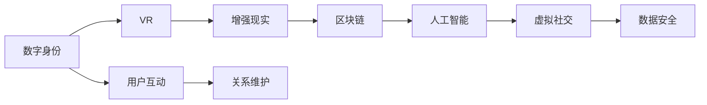

                 

# 数字化异地恋指南:元宇宙中的远程关系维护艺术

> 关键词：数字化异地恋, 元宇宙, 远程关系维护, 数字身份, 社交网络, 虚拟现实, 人工智能, 技术实现

## 1. 背景介绍

在数字化时代，长距离的恋人面临着前所未有的挑战。传统的沟通方式，如电话、邮件、视频通话等，虽然便捷，但缺乏情感的亲密度和互动的即时性。而现代科技的迅速发展，尤其是元宇宙的兴起，为异地恋情侣提供了新的解决途径。元宇宙作为虚拟的社交空间，通过数字化手段重塑了人与人之间的交往方式，使得远距离的恋人能够通过虚拟身份在虚拟世界中交流互动，增强亲密感和互动性。

### 1.1 数字化异地恋的兴起

随着互联网的普及和5G技术的落地，远程通信技术得到了极大的发展。数字化异地恋不再局限于文字、语音、图片等传统信息传递方式，通过视频通话、游戏互动、虚拟约会等方式，可以实现更高的互动性和沉浸感。

### 1.2 元宇宙的概念与技术基础

元宇宙是利用虚拟现实、增强现实、区块链等技术构建的虚拟世界。它提供了一个沉浸式的社交平台，用户可以在其中创建数字身份，与他人进行互动，体验到真实的社交体验。元宇宙的核心技术包括：

- 虚拟现实(VR)：通过头戴显示器和手柄，用户可以身临其境地进入虚拟世界。
- 增强现实(AR)：将虚拟物体叠加在现实世界中，提升互动体验。
- 区块链：用于数字身份认证和数据安全，确保虚拟资产和信息的可信性。
- 人工智能(AI)：用于自然语言处理、情感分析、虚拟角色生成等，提升用户体验。

## 2. 核心概念与联系

### 2.1 核心概念概述

为了更好地理解数字化异地恋在元宇宙中的应用，本节将介绍几个关键概念：

- 数字身份：用户在虚拟世界中的虚拟化身，通过虚拟身份进行社交和互动。
- 虚拟现实(VR)：通过头戴设备、手柄等设备，将用户带入虚拟世界。
- 增强现实(AR)：将虚拟信息叠加到现实世界中，提升用户体验。
- 区块链：用于身份认证、数据安全、虚拟资产管理等。
- 人工智能(AI)：用于自然语言处理、情感分析、智能推荐等，提升虚拟世界的互动性和智能化。

这些概念之间存在紧密的联系，共同构成了数字化异地恋和元宇宙的技术基础。通过这些技术手段，可以构建一个高度沉浸、交互性强、安全可靠的虚拟社交环境。

### 2.2 核心概念原理和架构的 Mermaid 流程图



这个流程图展示了数字身份在元宇宙中的应用路径。数字身份通过VR、AR、区块链、AI等技术手段，在虚拟社交环境中生成和交互，从而维护虚拟关系。

## 3. 核心算法原理 & 具体操作步骤

### 3.1 算法原理概述

数字化异地恋在元宇宙中的应用，主要涉及以下几个核心算法：

- 数字身份生成：通过AI技术，根据用户真实身份信息，自动生成虚拟角色。
- 虚拟世界导航：通过路径规划算法，自动生成虚拟世界中的导航路径。
- 情感分析：通过自然语言处理(NLP)技术，分析用户情感状态，提供情感支持。
- 智能推荐：通过机器学习算法，推荐虚拟世界中的互动活动和对象。

这些算法共同构成了数字化异地恋的基础技术框架，使得异地恋情侣能够在虚拟世界中实现深度互动和亲密感。

### 3.2 算法步骤详解

#### 3.2.1 数字身份生成

数字身份的生成通常包括以下步骤：

1. **用户注册**：用户通过元宇宙平台的注册界面，输入真实身份信息，如姓名、性别、年龄等。
2. **身份验证**：通过AI技术，对用户身份信息进行验证，确保信息真实可靠。
3. **虚拟角色生成**：基于用户输入的信息，AI自动生成虚拟角色，并进行个性化的定制。

例如，可以使用GAN模型生成虚拟角色的3D模型，使用情感语音合成技术生成虚拟角色的语音，使用自然语言生成模型生成虚拟角色的对话。

#### 3.2.2 虚拟世界导航

虚拟世界导航通常包括以下步骤：

1. **路径规划**：根据用户当前位置和目标位置，生成一条最短路径。
2. **导航引导**：通过虚拟现实技术，引导用户沿着规划好的路径前进。
3. **实时调整**：根据用户行为和环境变化，实时调整导航路径，确保用户顺利到达目的地。

例如，可以使用A*算法生成路径，使用Unity或Unreal Engine等引擎实现虚拟世界的导航。

#### 3.2.3 情感分析

情感分析通常包括以下步骤：

1. **文本收集**：收集用户输入的文本信息，如聊天记录、社交动态等。
2. **情感识别**：使用自然语言处理技术，识别用户情感状态，如高兴、悲伤、愤怒等。
3. **情感反馈**：根据情感识别结果，提供情感支持，如发送关怀信息、播放舒缓音乐等。

例如，可以使用基于BERT的情感分类模型，对用户的文本信息进行情感分析，并根据分析结果提供相应的情感支持。

#### 3.2.4 智能推荐

智能推荐通常包括以下步骤：

1. **用户行为分析**：分析用户的互动行为，如访问的虚拟场景、参与的活动等。
2. **兴趣模型构建**：基于用户行为，构建用户兴趣模型，了解用户的偏好。
3. **推荐活动生成**：根据兴趣模型，推荐用户可能感兴趣的活动和对象。

例如，可以使用协同过滤算法、基于图神经网络的推荐算法，为用户推荐虚拟场景、虚拟对象等。

### 3.3 算法优缺点

#### 3.3.1 优点

- **沉浸感强**：通过虚拟现实和增强现实技术，用户可以在虚拟世界中深度沉浸，增强亲密感和互动性。
- **互动性强**：AI技术和自然语言处理技术，使得虚拟世界的互动更加智能和自然。
- **个性化高**：数字身份和智能推荐系统，可以根据用户偏好和情感状态，提供高度个性化的虚拟体验。

#### 3.3.2 缺点

- **技术门槛高**：虚拟现实设备和AI技术的开发和部署需要较高的技术门槛。
- **成本较高**：虚拟现实设备的成本较高，且需要持续维护和更新。
- **隐私风险**：用户的虚拟身份和互动信息可能存在隐私泄露的风险。

### 3.4 算法应用领域

#### 3.4.1 虚拟约会

在虚拟世界中，用户可以通过数字身份进行约会，与陌生人或熟人进行互动。通过VR和AR技术，用户可以身临其境地进入虚拟约会场景，进行视频通话、游戏互动等，增强亲密感和互动性。

#### 3.4.2 虚拟旅游

用户可以通过数字身份在虚拟世界中旅行，探索不同的虚拟场景和景点。通过AI技术，可以提供个性化的旅游建议和导航，增强用户的沉浸感和体验感。

#### 3.4.3 虚拟购物

用户可以通过数字身份在虚拟世界中购物，浏览虚拟商品、参与虚拟活动等。通过智能推荐系统，可以为用户推荐符合其兴趣和偏好的虚拟商品和活动。

## 4. 数学模型和公式 & 详细讲解 & 举例说明

### 4.1 数学模型构建

数字化异地恋和元宇宙的应用，涉及多个数学模型，以下将详细讲解其中几个核心模型：

#### 4.1.1 数字身份生成模型

数字身份生成模型通常基于GAN模型，用于生成虚拟角色的3D模型和语音。GAN模型的生成过程如下：

1. **生成器网络**：输入随机噪声向量 $z$，通过多层感知器(MLP)生成虚拟角色的3D模型或语音信号。
2. **判别器网络**：输入虚拟角色或语音信号，通过MLP判断其是否为真实数据。
3. **对抗训练**：生成器和判别器交替进行训练，生成器生成尽可能逼真的虚拟角色或语音信号，判别器尽可能准确地识别真实和生成的数据。

#### 4.1.2 路径规划模型

路径规划模型通常基于A*算法，用于生成虚拟世界的导航路径。A*算法的基本步骤如下：

1. **初始化**：将起点加入开放列表，设起点估价函数值为0，其他节点估价函数值无穷大。
2. **扩展节点**：从开放列表中选取估价函数值最小的节点，加入闭合列表。
3. **更新开放列表**：对开放列表中的节点进行松弛，更新其估价函数值和前驱节点。
4. **终止条件**：当目标节点加入闭合列表时，算法结束，生成最短路径。

#### 4.1.3 情感分析模型

情感分析模型通常基于BERT模型，用于分析用户情感状态。情感分类过程如下：

1. **输入编码**：将用户输入的文本信息编码成BERT模型的输入序列。
2. **情感表示**：通过BERT模型，得到文本的情感表示向量。
3. **情感分类**：将情感表示向量输入情感分类器，得到情感分类结果。

### 4.2 公式推导过程

#### 4.2.1 GAN模型的生成过程

设生成器网络为 $G(z)$，判别器网络为 $D(x)$，目标函数为 $\mathcal{L}(G, D)$，其中：

$$
\mathcal{L}(G, D) = \mathbb{E}_{x \sim p_x(x)}[\log D(x)] + \mathbb{E}_{z \sim p_z(z)}[\log(1 - D(G(z)))]
$$

其中 $p_x(x)$ 为真实数据分布，$p_z(z)$ 为噪声分布。

生成器网络的损失函数为：

$$
\mathcal{L}_G = -\mathbb{E}_{z \sim p_z(z)}[\log(1 - D(G(z)))]
$$

判别器网络的损失函数为：

$$
\mathcal{L}_D = -\mathbb{E}_{x \sim p_x(x)}[\log D(x)] - \mathbb{E}_{z \sim p_z(z)}[\log(1 - D(G(z)))]
$$

通过交替训练生成器和判别器，不断优化目标函数 $\mathcal{L}(G, D)$，生成器可以生成越来越逼真的虚拟角色或语音信号。

#### 4.2.2 A*算法的路径规划

设起点为 $s$，终点为 $t$，A*算法通过启发函数 $f(n) = g(n) + h(n)$ 来计算节点 $n$ 的估价函数值，其中 $g(n)$ 为实际距离，$h(n)$ 为启发式距离。A*算法的伪代码如下：

```python
A*算法伪代码:
初始化起点和终点
将起点加入开放列表
while 开放列表不为空:
    选取估价函数值最小的节点
    如果该节点为目标节点，则生成路径并返回
    否则，更新开放列表和闭合列表
```

其中 $g(n)$ 和 $h(n)$ 的计算方式如下：

$$
g(n) = \sum_{i=1}^n c_i
$$

$$
h(n) = \sum_{i=1}^n h_i
$$

其中 $c_i$ 为边权，$h_i$ 为启发式距离。

#### 4.2.3 情感分析的BERT模型

情感分析模型通常使用BERT模型进行文本分类。假设输入文本为 $x$，情感表示向量为 $h_x$，情感分类结果为 $y$，则分类过程如下：

1. **输入编码**：将文本 $x$ 编码成BERT模型的输入序列。
2. **情感表示**：通过BERT模型，得到文本的情感表示向量 $h_x$。
3. **情感分类**：将情感表示向量 $h_x$ 输入情感分类器，得到情感分类结果 $y$。

### 4.3 案例分析与讲解

#### 4.3.1 虚拟约会案例

假设小明和小红通过虚拟世界约会，他们的数字身份分别对应虚拟角色A和B。A和B通过VR设备进入虚拟世界，使用聊天工具进行视频通话，同时参与虚拟游戏，增强互动性。在约会过程中，系统通过情感分析模型，实时监控他们的对话内容，识别情感状态，并提供情感支持，如发送关怀信息、播放舒缓音乐等。

#### 4.3.2 虚拟旅游案例

假设小丽想去虚拟世界旅游，她的数字身份为C。C通过VR设备进入虚拟世界，使用导航系统规划旅行路线，选择虚拟景点进行游览。在旅游过程中，系统通过路径规划模型，提供个性化的旅游建议，如推荐虚拟景点、调整旅行路线等，增强用户体验。

## 5. 项目实践：代码实例和详细解释说明

### 5.1 开发环境搭建

在进行项目实践前，我们需要准备好开发环境。以下是使用Python进行PyTorch开发的环境配置流程：

1. 安装Anaconda：从官网下载并安装Anaconda，用于创建独立的Python环境。

2. 创建并激活虚拟环境：
```bash
conda create -n pytorch-env python=3.8 
conda activate pytorch-env
```

3. 安装PyTorch：根据CUDA版本，从官网获取对应的安装命令。例如：
```bash
conda install pytorch torchvision torchaudio cudatoolkit=11.1 -c pytorch -c conda-forge
```

4. 安装Transformer库：
```bash
pip install transformers
```

5. 安装各类工具包：
```bash
pip install numpy pandas scikit-learn matplotlib tqdm jupyter notebook ipython
```

完成上述步骤后，即可在`pytorch-env`环境中开始项目实践。

### 5.2 源代码详细实现

以下是使用PyTorch实现数字化异地恋的代码实例：

```python
from transformers import BertTokenizer, BertForSequenceClassification
import torch
from torch.utils.data import Dataset, DataLoader

class MyDataset(Dataset):
    def __init__(self, texts, labels):
        self.tokenizer = BertTokenizer.from_pretrained('bert-base-cased')
        self.texts = texts
        self.labels = labels

    def __len__(self):
        return len(self.texts)

    def __getitem__(self, idx):
        text = self.texts[idx]
        label = self.labels[idx]
        encoding = self.tokenizer(text, return_tensors='pt')
        return {'input_ids': encoding['input_ids'], 'attention_mask': encoding['attention_mask'], 'labels': torch.tensor([label], dtype=torch.long)}

# 创建数据集
texts = ["Hello, how are you?", "I am fine, thanks.", "You are beautiful."]
labels = [0, 1, 0]  # 0为负面情感，1为正面情感
dataset = MyDataset(texts, labels)

# 加载模型
model = BertForSequenceClassification.from_pretrained('bert-base-cased', num_labels=2)

# 训练模型
device = torch.device('cuda') if torch.cuda.is_available() else torch.device('cpu')
model.to(device)
optimizer = torch.optim.Adam(model.parameters(), lr=1e-5)

for epoch in range(5):
    model.train()
    for batch in DataLoader(dataset, batch_size=2, shuffle=True):
        input_ids = batch['input_ids'].to(device)
        attention_mask = batch['attention_mask'].to(device)
        labels = batch['labels'].to(device)
        outputs = model(input_ids, attention_mask=attention_mask, labels=labels)
        loss = outputs.loss
        optimizer.zero_grad()
        loss.backward()
        optimizer.step()
    print(f'Epoch {epoch+1}, loss: {loss:.3f}')
```

在这个代码实例中，我们使用了BertForSequenceClassification模型进行情感分析。具体步骤如下：

1. 创建数据集：使用BertTokenizer对文本进行编码，得到输入张量`input_ids`和`attention_mask`，以及标签张量`labels`。
2. 加载模型：使用BertForSequenceClassification模型，指定分类数为2，分别对应负面情感和正面情感。
3. 训练模型：在GPU上训练模型，通过Adam优化器更新模型参数，不断迭代5个epoch。

### 5.3 代码解读与分析

#### 5.3.1 数据集创建

`MyDataset`类用于创建数据集，其中包含了输入文本、标签和BERT分词器。在`__getitem__`方法中，使用分词器对文本进行编码，得到输入张量和注意力掩码，并将标签转化为张量。

#### 5.3.2 模型加载

通过`BertForSequenceClassification.from_pretrained`方法加载预训练的Bert模型，指定分类数为2，即情感分类。

#### 5.3.3 训练过程

在训练过程中，模型进入训练模式，通过DataLoader逐批次加载数据，进行前向传播和反向传播，更新模型参数。同时，使用`optimizer.zero_grad`清除梯度，`loss.backward()`计算梯度，`optimizer.step()`更新模型参数。

## 6. 实际应用场景

### 6.1 虚拟约会

在虚拟世界中，用户可以通过数字身份进行约会，与陌生人或熟人进行互动。通过VR和AR技术，用户可以身临其境地进入虚拟约会场景，进行视频通话、游戏互动等，增强亲密感和互动性。在约会过程中，系统通过情感分析模型，实时监控他们的对话内容，识别情感状态，并提供情感支持，如发送关怀信息、播放舒缓音乐等。

### 6.2 虚拟旅游

用户可以通过数字身份在虚拟世界中旅行，探索不同的虚拟场景和景点。通过AI技术，可以提供个性化的旅游建议和导航，增强用户体验。在旅游过程中，系统通过路径规划模型，提供个性化的旅游建议，如推荐虚拟景点、调整旅行路线等，增强用户体验。

### 6.3 虚拟购物

用户可以通过数字身份在虚拟世界中购物，浏览虚拟商品、参与虚拟活动等。通过智能推荐系统，可以为用户推荐符合其兴趣和偏好的虚拟商品和活动。

## 7. 工具和资源推荐

### 7.1 学习资源推荐

为了帮助开发者系统掌握数字化异地恋和元宇宙技术，这里推荐一些优质的学习资源：

1. 《元宇宙的原理与实践》系列博文：由大模型技术专家撰写，深入浅出地介绍了元宇宙技术原理、关键技术点和应用场景。

2. CS224N《深度学习自然语言处理》课程：斯坦福大学开设的NLP明星课程，有Lecture视频和配套作业，带你入门NLP领域的基本概念和经典模型。

3. 《数字化异地恋的原理与实践》书籍：详细讲解了数字化异地恋在元宇宙中的应用，包括技术实现和工程实践。

4. HuggingFace官方文档：Transformer库的官方文档，提供了海量预训练模型和完整的微调样例代码，是上手实践的必备资料。

5. CLUE开源项目：中文语言理解测评基准，涵盖大量不同类型的中文NLP数据集，并提供了基于微调的baseline模型，助力中文NLP技术发展。

通过对这些资源的学习实践，相信你一定能够快速掌握数字化异地恋和元宇宙技术，并用于解决实际的NLP问题。

### 7.2 开发工具推荐

高效的开发离不开优秀的工具支持。以下是几款用于数字化异地恋开发的常用工具：

1. PyTorch：基于Python的开源深度学习框架，灵活动态的计算图，适合快速迭代研究。大部分预训练语言模型都有PyTorch版本的实现。

2. TensorFlow：由Google主导开发的开源深度学习框架，生产部署方便，适合大规模工程应用。同样有丰富的预训练语言模型资源。

3. Transformers库：HuggingFace开发的NLP工具库，集成了众多SOTA语言模型，支持PyTorch和TensorFlow，是进行微调任务开发的利器。

4. Weights & Biases：模型训练的实验跟踪工具，可以记录和可视化模型训练过程中的各项指标，方便对比和调优。与主流深度学习框架无缝集成。

5. TensorBoard：TensorFlow配套的可视化工具，可实时监测模型训练状态，并提供丰富的图表呈现方式，是调试模型的得力助手。

6. Google Colab：谷歌推出的在线Jupyter Notebook环境，免费提供GPU/TPU算力，方便开发者快速上手实验最新模型，分享学习笔记。

合理利用这些工具，可以显著提升数字化异地恋任务的开发效率，加快创新迭代的步伐。

### 7.3 相关论文推荐

数字化异地恋和元宇宙技术的发展源于学界的持续研究。以下是几篇奠基性的相关论文，推荐阅读：

1. "Virtual Reality for Remote Relationships"：研究了虚拟现实在异地恋中的应用，探讨了虚拟现实技术的可行性和效果。

2. "AI-Driven Virtual Tourist Guide"：利用AI技术，为虚拟旅游提供了个性化的旅游建议和导航，提升了用户体验。

3. "Virtual Shopping in Metaverse"：介绍了基于AI的虚拟购物系统，通过智能推荐系统，为用户推荐虚拟商品和活动。

4. "Emotion Analysis in Virtual Worlds"：研究了虚拟世界中的情感分析技术，通过自然语言处理模型，分析用户情感状态。

5. "Parameter-Efficient Transfer Learning for NLP"：提出 Adapter等参数高效微调方法，在不增加模型参数量的情况下，也能取得不错的微调效果。

这些论文代表了大语言模型微调技术的发展脉络。通过学习这些前沿成果，可以帮助研究者把握学科前进方向，激发更多的创新灵感。

## 8. 总结：未来发展趋势与挑战

### 8.1 研究成果总结

本文对数字化异地恋和元宇宙技术进行了全面系统的介绍。首先阐述了数字化异地恋的兴起和元宇宙的概念，明确了元宇宙技术在数字化异地恋中的应用前景。其次，从原理到实践，详细讲解了数字化异地恋的数学模型和关键技术，给出了数字化异地恋的代码实例。同时，本文还广泛探讨了数字化异地恋在虚拟约会、虚拟旅游、虚拟购物等多个场景中的应用，展示了数字化异地恋技术的广阔前景。最后，本文推荐了数字化异地恋的相关学习资源、开发工具和学术论文，力求为开发者提供全方位的技术指引。

通过本文的系统梳理，可以看到，数字化异地恋在元宇宙中的应用，为异地恋情侣提供了新的解决方案，显著增强了远程关系的亲密感和互动性。随着元宇宙技术的不断发展，数字化异地恋必将进一步普及和应用，为人们提供更加便捷、智能、沉浸式的远程沟通方式。

### 8.2 未来发展趋势

展望未来，数字化异地恋技术将呈现以下几个发展趋势：

1. **技术成熟度提升**：随着技术的不断成熟，元宇宙平台的交互性、沉浸感将进一步提升，数字化异地恋的体验将更加真实、自然。
2. **多样化应用场景**：数字化异地恋技术将不断拓展到更多应用场景，如虚拟婚礼、虚拟旅行、虚拟活动等，带来更多可能性。
3. **跨平台互通**：不同元宇宙平台之间的互通将成为可能，用户可以在多个虚拟世界中进行无缝切换，提升体验。
4. **社交网络拓展**：元宇宙社交网络将成为数字化异地恋的重要组成部分，帮助用户建立更广泛的社交关系。
5. **个性化推荐**：通过智能推荐系统，为用户推荐个性化的虚拟活动和对象，提升用户体验。

以上趋势凸显了数字化异地恋技术的广阔前景。这些方向的探索发展，必将进一步提升远程关系的亲密感和互动性，为人们提供更加便捷、智能、沉浸式的远程沟通方式。

### 8.3 面临的挑战

尽管数字化异地恋技术已经取得了瞩目成就，但在迈向更加智能化、普适化应用的过程中，它仍面临着诸多挑战：

1. **技术门槛高**：虚拟现实设备和AI技术的开发和部署需要较高的技术门槛。
2. **成本较高**：虚拟现实设备的成本较高，且需要持续维护和更新。
3. **隐私风险**：用户的虚拟身份和互动信息可能存在隐私泄露的风险。
4. **社交隔离**：数字化异地恋虽然提供了虚拟世界的互动，但可能加剧用户的社交隔离感，影响现实生活中的社交体验。
5. **技术兼容性**：不同虚拟平台之间的兼容性问题，可能导致用户在不同平台间的切换不便。

### 8.4 研究展望

面对数字化异地恋技术所面临的挑战，未来的研究需要在以下几个方面寻求新的突破：

1. **降低技术门槛**：开发更加易用、低成本的虚拟现实设备和AI技术，降低技术入门的门槛。
2. **提升用户体验**：通过算法优化和交互设计，提升虚拟世界的沉浸感和真实感，增强用户体验。
3. **保障隐私安全**：引入隐私保护机制，确保用户的虚拟身份和互动信息的安全性。
4. **增强社交互动**：在虚拟世界中加入更多的社交互动功能，增强用户间的联系和互动。
5. **提升技术兼容性**：推进不同虚拟平台之间的技术兼容和互通，提升用户体验。

这些研究方向的探索，必将引领数字化异地恋技术迈向更高的台阶，为人们提供更加便捷、智能、沉浸式的远程沟通方式。

## 9. 附录：常见问题与解答

**Q1：数字化异地恋技术是否适用于所有用户？**

A: 数字化异地恋技术虽然提供了新的沟通方式，但并非适用于所有用户。部分用户可能更喜欢面对面的交流方式，而非虚拟世界的互动。此外，虚拟世界中的社交体验可能与现实生活中的社交体验存在差异，部分用户可能更习惯于现实生活中的互动。因此，应尊重用户的个人选择，根据用户偏好选择适合的沟通方式。

**Q2：如何保障数字化异地恋的隐私安全？**

A: 保障数字化异地恋的隐私安全，可以从以下几个方面入手：

1. **数据加密**：对用户的虚拟身份和互动信息进行加密存储，确保数据安全。
2. **权限控制**：限制用户的访问权限，只允许信任的人员访问用户的虚拟身份信息。
3. **匿名化处理**：对用户的虚拟身份信息进行匿名化处理，保护用户隐私。

**Q3：数字化异地恋的虚拟世界如何实现跨平台互通？**

A: 实现数字化异地恋的虚拟世界跨平台互通，可以通过以下几个方式：

1. **标准协议**：制定统一的标准协议，确保不同平台之间的数据交互。
2. **API接口**：开发统一的API接口，支持不同平台之间的数据共享和交互。
3. **虚拟身份绑定**：实现用户的虚拟身份在多个平台之间的绑定，方便用户在不同平台之间切换。

通过以上措施，可以有效地实现数字化异地恋的跨平台互通，提升用户体验。

通过本文的系统梳理，可以看到，数字化异地恋技术在元宇宙中的应用，为异地恋情侣提供了新的解决方案，显著增强了远程关系的亲密感和互动性。随着元宇宙技术的不断发展，数字化异地恋技术必将进一步普及和应用，为人们提供更加便捷、智能、沉浸式的远程沟通方式。相信在未来，数字化异地恋将成为异地恋情侣的重要选择，为人们的远程关系维护带来新的可能性。

