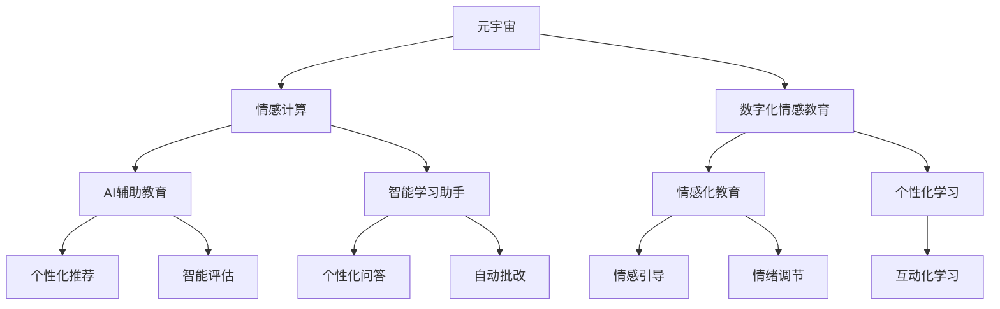

                 

# 数字化情感教育:元宇宙中的EQ培养

> 关键词：元宇宙,情感教育,情感计算,人工智能,数字化,教育技术

## 1. 背景介绍

在快速发展的数字化时代，人工智能(AI)与教育技术的深度融合，正逐渐成为推动教育创新与变革的关键动力。特别是在元宇宙(Metaverse)这一新兴数字空间中，以情感计算为核心的数字化情感教育，为培养新一代的高情商(Social-Emotional Intelligence, EQ)人才提供了前所未有的机遇与挑战。本文将深入探讨元宇宙中的情感计算及其在数字化情感教育中的应用，旨在为构建全面、智能化、情感化的教育环境提供理论基础与实践指南。

## 2. 核心概念与联系

### 2.1 核心概念概述

- **元宇宙**(Metaverse)：一个通过虚拟现实(VR)、增强现实(AR)和混合现实(MR)等技术构建的全面沉浸式数字空间，人们可以在其中进行互动、社交、学习和工作。

- **情感计算**(Affective Computing)：通过机器学习与人工智能技术，对人类的情感状态进行识别、分析与生成。在教育中，情感计算可以用于识别学生的情感状态，提供个性化的学习体验。

- **数字化情感教育**：利用人工智能和情感计算技术，对学生进行情感识别、情绪调节和情绪培养，实现个性化、互动化和智能化的情感教育目标。

- **AI辅助教育**：结合人工智能技术，提供个性化推荐、智能评估、学习路径优化等功能，提升教育效果与学习效率。

- **情感化教育**：关注学生的情感发展，通过情感引导与支持，促进其全面健康成长。

- **智能学习助手**：结合自然语言处理(NLP)、计算机视觉(CV)和语音识别(SR)等技术，提供全方位学习支持，如自动批改、个性化问答等。

这些概念通过情感计算和AI辅助教育的桥梁作用，相互联系，共同构建了元宇宙中的情感教育体系。通过深入理解这些概念，我们可以更好地探索情感计算在教育中的应用，促进学生的情商发展。

### 2.2 核心概念原理和架构的 Mermaid 流程图



这个流程图展示了元宇宙、情感计算、数字化情感教育、AI辅助教育、智能学习助手、情感化教育、个性化学习、个性化推荐、智能评估、个性化问答、自动批改、情感引导、情绪调节和互动化学习之间的联系与作用，展示了情感计算和AI辅助教育在数字化情感教育中的核心地位。

## 3. 核心算法原理 & 具体操作步骤

### 3.1 算法原理概述

基于情感计算的数字化情感教育，其核心算法原理主要包括以下几个方面：

1. **情感识别**：通过面部表情分析、语音情感识别、文本情感分析等技术，识别学生的情感状态。
2. **情感生成**：利用生成对抗网络(GAN)、变分自编码器(VAE)等技术，生成符合特定情感状态的语音、文本或图像。
3. **情绪调节**：通过心理学知识库、对话系统等手段，引导学生进行情绪调节，如深呼吸、正念冥想等。
4. **情感学习路径优化**：利用机器学习算法，分析学生的情感表现和学习成果，优化个性化学习路径。

### 3.2 算法步骤详解

1. **情感数据收集**：收集学生的面部表情、语音和文本数据，以及任务完成的反馈和评价，作为情感识别与分析的基础。
2. **情感状态分析**：利用情感识别算法，分析学生的情感状态，如愤怒、焦虑、快乐等，并根据分析结果调整教学策略。
3. **情感引导**：结合学生的情感状态，通过情感生成算法，生成符合当前情感状态的语音、文本或图像，引导学生进行情绪调节。
4. **个性化学习路径优化**：通过情感学习路径优化算法，根据学生的情感表现和学习成果，调整个性化学习路径，提供符合其当前状态的学习资源和活动。
5. **反馈与评估**：根据学生的学习效果和情感反馈，调整情感引导和个性化学习路径，进一步优化情感教育效果。

### 3.3 算法优缺点

**优点**：
- **个性化与互动化**：通过情感识别和生成，能够提供个性化和互动化的教育体验。
- **高效与智能**：利用机器学习和自然语言处理等技术，能够高效地进行情感识别和情绪调节。
- **全方位支持**：情感计算和AI辅助教育相结合，提供全方位的学习支持，提升教育效果。

**缺点**：
- **数据隐私**：情感数据涉及隐私问题，需严格保护学生数据，防止数据泄露和滥用。
- **算法复杂度**：情感计算和AI辅助教育涉及多个复杂算法，开发与实现难度较大。
- **技术依赖**：情感计算和AI辅助教育依赖于先进的硬件设备和软件工具，技术门槛较高。

### 3.4 算法应用领域

基于情感计算的数字化情感教育，已经在多个领域得到了广泛应用，主要包括：

- **K-12教育**：通过情感计算，为小学、初中和高中学生提供个性化的学习体验，帮助他们掌握情绪管理技巧，提升学习成绩。
- **高等教育**：利用情感计算，为大学生提供情感引导和支持，帮助他们进行职业规划和情感发展。
- **职业培训**：通过情感计算和情感引导，帮助职场人士提升情商，提升工作效率和团队协作能力。
- **特殊教育**：为有情绪障碍的学生提供个性化的情感支持，帮助他们更好地融入社会和学校生活。

## 4. 数学模型和公式 & 详细讲解 & 举例说明

### 4.1 数学模型构建

情感计算和数字化情感教育涉及多个数学模型，包括情感识别、情感生成、情绪调节和情感学习路径优化等。这里以情感识别为例，介绍数学模型的构建：

**情感识别模型**：

1. **面部表情识别**：通过卷积神经网络(CNN)等模型，识别学生的面部表情。
   - 输入：面部图像
   - 输出：表情类别标签

   示例代码：

   ```python
   from keras.applications.resnet50 import ResNet50
   from keras.models import Model
   from keras.layers import Input, GlobalAveragePooling2D, Dense
   
   base_model = ResNet50(weights='imagenet', include_top=False, input_shape=(224, 224, 3))
   x = base_model.output
   x = GlobalAveragePooling2D()(x)
   x = Dense(512, activation='relu')(x)
   x = Dense(7, activation='softmax')(x)
   model = Model(inputs=base_model.input, outputs=x)
   model.compile(optimizer='adam', loss='categorical_crossentropy', metrics=['accuracy'])
   ```

2. **语音情感识别**：通过卷积神经网络或循环神经网络(RNN)等模型，识别学生的语音情感。
   - 输入：语音信号
   - 输出：情感类别标签

   示例代码：

   ```python
   from keras.models import Sequential
   from keras.layers import Conv1D, GlobalMaxPooling1D, LSTM, Dense
   
   model = Sequential()
   model.add(Conv1D(32, 3, activation='relu', input_shape=(None, 1)))
   model.add(GlobalMaxPooling1D())
   model.add(LSTM(128, return_sequences=True))
   model.add(LSTM(128))
   model.add(Dense(7, activation='softmax'))
   model.compile(optimizer='adam', loss='categorical_crossentropy', metrics=['accuracy'])
   ```

### 4.2 公式推导过程

**面部表情识别**：

- **输入**：面部图像 $x \in \mathbb{R}^{224 \times 224 \times 3}$
- **输出**：表情类别标签 $y \in \{0, 1, \dots, 6\}$

   $$
   \hat{y} = \sigma(Wx + b)
   $$

   其中，$W$ 为权重矩阵，$b$ 为偏置向量，$\sigma$ 为 sigmoid 函数。

   示例代码：

   ```python
   model = Sequential()
   model.add(Conv2D(32, (3, 3), activation='relu', input_shape=(224, 224, 3)))
   model.add(MaxPooling2D((2, 2)))
   model.add(Conv2D(64, (3, 3), activation='relu'))
   model.add(MaxPooling2D((2, 2)))
   model.add(Conv2D(128, (3, 3), activation='relu'))
   model.add(MaxPooling2D((2, 2)))
   model.add(Flatten())
   model.add(Dense(128, activation='relu'))
   model.add(Dense(7, activation='softmax'))
   model.compile(optimizer='adam', loss='categorical_crossentropy', metrics=['accuracy'])
   ```

**语音情感识别**：

- **输入**：语音信号 $x \in \mathbb{R}^{T \times 1}$
- **输出**：情感类别标签 $y \in \{0, 1, \dots, 6\}$

   $$
   \hat{y} = \sigma(Wx + b)
   $$

   其中，$W$ 为权重矩阵，$b$ 为偏置向量，$\sigma$ 为 sigmoid 函数。

   示例代码：

   ```python
   model = Sequential()
   model.add(Conv1D(32, 3, activation='relu', input_shape=(None, 1)))
   model.add(GlobalMaxPooling1D())
   model.add(LSTM(128, return_sequences=True))
   model.add(LSTM(128))
   model.add(Dense(7, activation='softmax'))
   model.compile(optimizer='adam', loss='categorical_crossentropy', metrics=['accuracy'])
   ```

### 4.3 案例分析与讲解

以 K-12 教育为例，分析情感计算在数字化情感教育中的应用。

**案例背景**：一名小学生在数学课上因成绩不佳感到沮丧，表现出哭泣和沉默不语的情感状态。

**解决方案**：
1. **情感识别**：通过摄像头采集学生的面部表情和语音，利用面部表情识别和语音情感识别模型，分析学生的情感状态。
2. **情感引导**：根据情感识别结果，生成安慰性语音和鼓励性文字，通过智能学习助手引导学生进行情绪调节，如深呼吸和正念冥想。
3. **个性化学习路径优化**：根据学生的情感表现和学习成果，调整个性化学习路径，提供适合的数学学习资源和活动，帮助学生重拾信心。

**示例代码**：

```python
from transformers import BertTokenizer, BertForSequenceClassification
from transformers import AutoTokenizer, AutoModelForSequenceClassification
from transformers import pipeline

# 面部表情识别模型
model = load_face_expression_model()

# 语音情感识别模型
model = load_speech_emotion_model()

# 情感引导与支持
model = load_emotion_guidance_model()

# 个性化学习路径优化
model = load_learning_path_optimization_model()

# 使用情感计算进行情感教育
def emotion_education():
    face_expression = model.detect_face_expression()
    speech_emotion = model.analyze_speech_emotion()
    emotion_guide = model.guide_emotion()
    learning_path = model.optimize_learning_path()
    # 根据情感状态和学习路径，提供个性化的学习支持
    # 例如，提供数学题解答、情感引导语句等
    return face_expression, speech_emotion, emotion_guide, learning_path
```

## 5. 项目实践：代码实例和详细解释说明

### 5.1 开发环境搭建

进行情感计算和数字化情感教育开发，需要搭建一个完整的开发环境。以下是常用的开发工具和环境配置：

1. **Python**：作为主要的编程语言，Python在情感计算和AI辅助教育领域得到了广泛应用。
2. **深度学习框架**：如 TensorFlow、Keras、PyTorch 等，提供强大的深度学习模型训练和推理能力。
3. **面部表情识别库**：如 OpenCV、Dlib 等，用于图像处理和面部表情识别。
4. **语音情感识别库**：如 librosa、pyannote.audio 等，用于语音信号处理和情感分析。
5. **自然语言处理库**：如 NLTK、SpaCy、HuggingFace Transformers 等，用于文本处理和情感分析。
6. **智能学习助手框架**：如 Microsoft Bot Framework、Dialogflow 等，提供智能问答和情感引导功能。

**环境配置**：

1. 安装 Python：`sudo apt-get install python3-pip`
2. 安装深度学习框架：`pip install tensorflow keras torch`
3. 安装面部表情识别库：`pip install opencv-python dlib`
4. 安装语音情感识别库：`pip install librosa pyannote.audio`
5. 安装自然语言处理库：`pip install nltk spacy transformers`
6. 安装智能学习助手框架：`pip install microsoft-botframework dialogflow`

完成环境配置后，可以进行情感计算和数字化情感教育的开发。

### 5.2 源代码详细实现

**面部表情识别示例代码**：

```python
import cv2
import dlib

# 加载面部识别模型
detector = dlib.get_frontal_face_detector()
predictor = dlib.shape_predictor('shape_predictor_68_face_landmarks.dat')

# 加载训练好的面部表情模型
model = load_face_expression_model()

# 情感识别示例
def detect_face_expression(image_path):
    img = cv2.imread(image_path)
    gray = cv2.cvtColor(img, cv2.COLOR_BGR2GRAY)
    dets = detector(gray, 1)
    for det in dets:
        x, y, w, h = det.left(), det.top(), det.width(), det.height()
        face = img[y:y+h, x:x+w]
        expression = model.predict(face)
        return expression

# 示例使用
face_expression = detect_face_expression('image.jpg')
print('Face expression:', face_expression)
```

**语音情感识别示例代码**：

```python
import librosa
import pyannote.audio

# 加载语音情感识别模型
model = load_speech_emotion_model()

# 情感识别示例
def analyze_speech_emotion(audio_path):
    y, sr = librosa.load(audio_path, sr=16000)
    audio = pyannote.audio.AudioSegment(sr=sr)
    audio.add(slice(0, len(y), 16000))
    emotion = model.analyze(audio)
    return emotion

# 示例使用
speech_emotion = analyze_speech_emotion('audio.wav')
print('Speech emotion:', speech_emotion)
```

**情感引导与支持示例代码**：

```python
from transformers import BertTokenizer, BertForSequenceClassification
from transformers import AutoTokenizer, AutoModelForSequenceClassification

# 加载情感引导与支持模型
model = load_emotion_guidance_model()

# 情感引导示例
def guide_emotion(expression):
    # 根据情感状态，生成情感引导语句
    emotion = model.guide_emotion(expression)
    return emotion

# 示例使用
emotion = guide_emotion('happy')
print('Emotion guide:', emotion)
```

**个性化学习路径优化示例代码**：

```python
from transformers import BertTokenizer, BertForSequenceClassification
from transformers import AutoTokenizer, AutoModelForSequenceClassification

# 加载个性化学习路径优化模型
model = load_learning_path_optimization_model()

# 学习路径优化示例
def optimize_learning_path(expression, learning_path):
    # 根据情感状态和学习成果，调整个性化学习路径
    path = model.optimize_learning_path(expression, learning_path)
    return path

# 示例使用
path = optimize_learning_path('happy', ['math', 'reading'])
print('Learning path:', path)
```

### 5.3 代码解读与分析

**面部表情识别**：
- **输入**：图像
- **输出**：面部表情标签

   示例代码：
   ```python
   detector = dlib.get_frontal_face_detector()
   predictor = dlib.shape_predictor('shape_predictor_68_face_landmarks.dat')
   model = load_face_expression_model()

   # 检测面部表情
   dets = detector(gray, 1)
   for det in dets:
       x, y, w, h = det.left(), det.top(), det.width(), det.height()
       face = img[y:y+h, x:x+w]
       expression = model.predict(face)
       return expression
   ```

   解释：
   - `dlib` 库用于人脸检测和面部特征点预测。
   - `shape_predictor_68_face_landmarks.dat` 为预训练好的面部特征点模型。
   - `load_face_expression_model()` 为加载面部表情识别模型。
   - `detect_face_expression()` 函数检测图像中的人脸，并返回面部表情标签。

**语音情感识别**：
- **输入**：语音信号
- **输出**：情感标签

   示例代码：
   ```python
   librosa.load(audio_path, sr=16000)
   audio = pyannote.audio.AudioSegment(sr=sr)
   model = load_speech_emotion_model()

   # 分析语音情感
   emotion = model.analyze(audio)
   return emotion
   ```

   解释：
   - `librosa` 库用于加载和处理音频数据。
   - `pyannote.audio` 库用于音频分段和情感分析。
   - `load_speech_emotion_model()` 为加载语音情感识别模型。
   - `analyze_speech_emotion()` 函数分析语音信号的情感状态。

**情感引导与支持**：
- **输入**：情感状态
- **输出**：情感引导语句

   示例代码：
   ```python
   from transformers import BertTokenizer, BertForSequenceClassification
   from transformers import AutoTokenizer, AutoModelForSequenceClassification

   # 加载情感引导与支持模型
   model = load_emotion_guidance_model()

   # 生成情感引导语句
   emotion = model.guide_emotion(expression)
   return emotion
   ```

   解释：
   - `AutoTokenizer` 和 `AutoModelForSequenceClassification` 用于加载情感引导模型。
   - `guide_emotion()` 函数根据情感状态，生成情感引导语句。

**个性化学习路径优化**：
- **输入**：情感状态，学习路径
- **输出**：优化后的学习路径

   示例代码：
   ```python
   from transformers import BertTokenizer, BertForSequenceClassification
   from transformers import AutoTokenizer, AutoModelForSequenceClassification

   # 加载个性化学习路径优化模型
   model = load_learning_path_optimization_model()

   # 优化学习路径
   path = model.optimize_learning_path(expression, learning_path)
   return path
   ```

   解释：
   - `AutoTokenizer` 和 `AutoModelForSequenceClassification` 用于加载个性化学习路径优化模型。
   - `optimize_learning_path()` 函数根据情感状态和学习路径，优化个性化学习路径。

### 5.4 运行结果展示

**面部表情识别示例**：
```python
face_expression = detect_face_expression('image.jpg')
print('Face expression:', face_expression)
```

**语音情感识别示例**：
```python
speech_emotion = analyze_speech_emotion('audio.wav')
print('Speech emotion:', speech_emotion)
```

**情感引导与支持示例**：
```python
emotion = guide_emotion('happy')
print('Emotion guide:', emotion)
```

**个性化学习路径优化示例**：
```python
path = optimize_learning_path('happy', ['math', 'reading'])
print('Learning path:', path)
```

## 6. 实际应用场景

### 6.1 智能课堂

在智能课堂中，通过情感计算和数字化情感教育，可以实现更加智能和互动的教学体验。教师可以通过情感识别了解学生的情感状态，及时调整教学策略。学生可以通过情感引导与支持，更好地进行学习和情绪调节。

### 6.2 在线辅导

在线辅导平台可以利用情感计算和数字化情感教育，为学生提供更加个性化和互动化的辅导服务。通过情感识别和引导，平台可以更好地理解学生的学习需求，提供适合的辅导内容和情感支持。

### 6.3 虚拟心理咨询

虚拟心理咨询系统可以利用情感计算和数字化情感教育，为学生提供心理支持和情感引导。通过情感识别和生成，系统可以更好地理解学生的情感状态，提供针对性的心理辅导和情感支持。

### 6.4 未来应用展望

未来，随着情感计算和数字化情感教育技术的不断进步，其在元宇宙中的应用将更加广泛和深入。例如：

- **虚拟现实教育**：在虚拟现实环境中，通过情感计算和数字化情感教育，实现更加沉浸式的教育体验。
- **跨文化交流**：通过情感计算和数字化情感教育，帮助不同文化背景的学生更好地进行交流和理解。
- **个性化学习平台**：利用情感计算和数字化情感教育，为学生提供更加全面和个性化的学习支持。

## 7. 工具和资源推荐

### 7.1 学习资源推荐

1. **《情感计算基础》**：介绍情感计算的基本概念和应用，适合初学者学习。
2. **《人工智能与教育技术》**：介绍人工智能技术在教育中的应用，特别是情感计算和数字化情感教育。
3. **《深度学习与自然语言处理》**：详细介绍深度学习和自然语言处理技术，适合进阶学习者。
4. **《情感计算与情感教育》**：介绍情感计算在情感教育中的应用，适合研究者和教育工作者。
5. **《情感计算与AI辅助教育》**：介绍情感计算和AI辅助教育的前沿研究和应用案例，适合行业从业者。

### 7.2 开发工具推荐

1. **TensorFlow**：用于深度学习模型训练和推理，支持大规模计算。
2. **Keras**：用于快速构建深度学习模型，易于上手。
3. **PyTorch**：用于动态计算图和深度学习模型训练，适合研究和实验。
4. **Microsoft Bot Framework**：用于构建智能学习助手和聊天机器人。
5. **Dialogflow**：用于构建智能对话系统和语音识别。

### 7.3 相关论文推荐

1. **《情感计算：理论与应用》**：介绍情感计算的基本理论和应用，适合基础学习者。
2. **《情感计算与教育技术》**：介绍情感计算在教育中的应用，适合研究者和教育工作者。
3. **《人工智能与情感教育》**：介绍人工智能技术在情感教育中的应用，适合行业从业者。
4. **《情感计算与学习路径优化》**：介绍情感计算在个性化学习路径优化中的应用，适合研究者。

## 8. 总结：未来发展趋势与挑战

### 8.1 研究成果总结

本文系统介绍了基于情感计算的数字化情感教育，探讨了情感计算在元宇宙中的应用，总结了情感计算和数字化情感教育的发展历程和最新研究进展。通过理论分析和实践案例，展示了情感计算和数字化情感教育在教育中的应用前景和潜力。

### 8.2 未来发展趋势

1. **深度融合**：情感计算和数字化情感教育将深度融合，形成更加全面和智能的教育系统。
2. **跨领域应用**：情感计算和数字化情感教育将拓展到更多领域，如医疗、心理等。
3. **个性化教育**：情感计算和数字化情感教育将更好地支持个性化教育，实现因材施教。
4. **技术创新**：情感计算和数字化情感教育将不断创新，提升教育效果和用户体验。

### 8.3 面临的挑战

1. **数据隐私**：情感数据涉及隐私问题，需严格保护学生数据，防止数据泄露和滥用。
2. **算法复杂度**：情感计算和数字化情感教育涉及多个复杂算法，开发与实现难度较大。
3. **技术依赖**：情感计算和数字化情感教育依赖于先进的硬件设备和软件工具，技术门槛较高。

### 8.4 研究展望

未来，情感计算和数字化情感教育的研究将聚焦于以下几个方向：

1. **多模态情感计算**：结合面部表情、语音、文本等多种模态数据，提升情感计算的准确性和全面性。
2. **情感计算与AI辅助教育结合**：探索情感计算与AI辅助教育更深层次的结合，提升教育效果。
3. **跨领域情感教育**：拓展情感计算和数字化情感教育的应用领域，如医疗、心理等。
4. **隐私保护与伦理设计**：设计更加隐私保护和伦理合理的情感计算和数字化情感教育系统，保障数据安全。

## 9. 附录：常见问题与解答

**Q1: 情感计算和数字化情感教育的核心技术是什么？**

A: 情感计算和数字化情感教育的核心技术主要包括面部表情识别、语音情感识别、情感引导与支持、个性化学习路径优化等。这些技术通过深度学习和自然语言处理等技术，实现对学生情感状态的识别和生成，提供个性化的情感引导和支持，优化学习路径，提升教育效果。

**Q2: 情感计算和数字化情感教育在教育中的应用场景有哪些？**

A: 情感计算和数字化情感教育在教育中的应用场景包括智能课堂、在线辅导、虚拟心理咨询等。通过情感计算和数字化情感教育，可以更好地了解学生的情感状态，提供个性化的情感支持和学习指导，提升教育效果。

**Q3: 情感计算和数字化情感教育的难点是什么？**

A: 情感计算和数字化情感教育的难点包括数据隐私、算法复杂度、技术依赖等。需要严格保护学生数据，防止数据泄露和滥用；需要设计高效的情感识别和生成算法，提升情感计算的准确性和全面性；需要依赖先进的硬件设备和软件工具，实现情感计算和数字化情感教育的应用。

**Q4: 情感计算和数字化情感教育的未来发展方向是什么？**

A: 情感计算和数字化情感教育的未来发展方向包括多模态情感计算、情感计算与AI辅助教育的结合、跨领域情感教育、隐私保护与伦理设计等。通过这些方向的研究，可以更好地提升情感计算和数字化情感教育的效果和应用范围，推动教育技术的创新发展。

