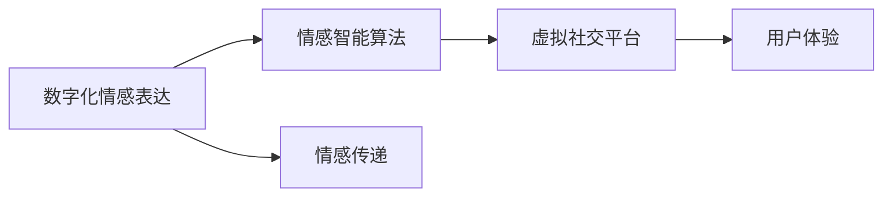

                 

## 1. 背景介绍

在数字化时代，技术的飞速发展极大地影响了人类的生活方式和交流方式。随着元宇宙的兴起，虚拟空间成为人们交互的新载体，但与此同时，数字化情感表达也成为一大难题。本文将深入探讨数字情感表达在元宇宙人际交往中的应用，帮助读者理解其原理、实现和未来发展方向。

### 1.1 问题的由来
在现实世界中，情感是人类交流的重要组成部分。而随着技术的进步，虚拟世界（如元宇宙）逐渐成为人们新的社交空间。然而，虚拟世界中的数字化情感表达面临着诸多挑战，如情感信息的缺失、社交互动的冷漠等问题。

### 1.2 问题核心关键点
元宇宙中的人际交往数字化情感表达涉及以下几个核心问题：
1. **情感表达的数字化表示**：如何将人类丰富的情感表达转换为可计算的数字信号。
2. **跨域情感传递**：在虚拟世界中，如何传递和感知情感信息。
3. **情感智能算法**：利用AI技术实现情感智能的算法设计。
4. **用户体验优化**：如何提升虚拟环境中用户对情感的感知和互动体验。

### 1.3 问题研究意义
元宇宙中的人际交往数字化情感表达研究具有重要的现实意义：
1. **增强虚拟社交体验**：情感交流是人际交往的核心，数字化情感表达能够极大地增强虚拟世界中的社交体验。
2. **促进虚拟世界的融合**：通过数字化情感表达，虚拟世界与现实世界能够更好地融合。
3. **推动AI技术发展**：情感智能算法的实现需要依赖于AI技术的进步，这一领域的研究有望推动AI技术的进一步发展。

## 2. 核心概念与联系

### 2.1 核心概念概述

要理解数字化情感表达在元宇宙人际交往中的应用，首先需要了解以下几个核心概念：

- **数字化情感表达**：将人类情感转换为可计算的数字信号，以供机器理解和处理的过程。
- **情感智能算法**：利用AI技术实现情感识别的算法，包括情感分类、情感预测等。
- **情感传递**：在虚拟世界中，情感信息的传递和感知过程。
- **虚拟社交平台**：元宇宙中的人际交往空间，如虚拟会议室、社交应用等。

### 2.2 核心概念原理和架构的 Mermaid 流程图



## 3. 核心算法原理 & 具体操作步骤

### 3.1 算法原理概述

数字化情感表达的核心算法基于自然语言处理（NLP）和机器学习（ML）技术。通过构建情感词典、情感分类器等模型，实现对用户情感信息的自动识别和处理。

### 3.2 算法步骤详解

#### 3.2.1 数据收集与预处理

1. **数据收集**：从社交媒体、用户评论、虚拟世界中的文本和语音数据中收集情感表达数据。
2. **数据预处理**：进行数据清洗、分词、去除停用词等处理，转换为模型所需的格式。

#### 3.2.2 特征工程

1. **构建情感词典**：使用Loughran-McDonald词典、AFINN情感词典等工具，提取文本中的情感词汇。
2. **情感特征提取**：利用TF-IDF、word2vec等方法，将文本转换为向量表示。

#### 3.2.3 模型训练

1. **情感分类**：使用朴素贝叶斯、支持向量机等算法，训练情感分类模型。
2. **情感预测**：使用RNN、LSTM、BERT等模型，进行情感预测。

#### 3.2.4 模型评估与优化

1. **模型评估**：使用准确率、召回率、F1-score等指标评估模型效果。
2. **模型优化**：通过超参数调优、模型融合等方法，提高模型性能。

### 3.3 算法优缺点

#### 3.3.1 优点

1. **广泛应用**：数字化情感表达技术可以应用于多种场景，如虚拟会议、社交应用等。
2. **高效处理**：利用机器学习算法，可以高效处理大量情感数据。
3. **个性化定制**：通过个性化模型训练，能够满足不同用户的需求。

#### 3.3.2 缺点

1. **情感复杂性**：人类情感的复杂性和多样性使得情感表达和识别变得困难。
2. **跨域问题**：虚拟世界中的情感传递和感知与现实世界存在差异。
3. **数据隐私**：在数据收集和处理过程中，需要保护用户隐私。

### 3.4 算法应用领域

数字化情感表达在多个领域中得到了应用，包括：

- **虚拟社交平台**：如虚拟会议、社交应用中，通过情感识别提升用户体验。
- **虚拟医疗**：通过情感智能算法，监测患者的情绪变化，提供心理支持。
- **虚拟教育**：通过情感分析，评估学生情感状态，提供个性化学习指导。

## 4. 数学模型和公式 & 详细讲解 & 举例说明

### 4.1 数学模型构建

#### 4.1.1 情感词典构建

情感词典是用来表示文本中情感词汇的字典。一个简单的情感词典可以是一个单词列表，每个单词都有一个情感极性（positive, negative, neutral）。

#### 4.1.2 情感特征提取

情感特征提取是情感智能算法的核心步骤。常见的特征提取方法包括：

1. **词袋模型（Bag-of-Words, BOW）**：将文本表示为单词的集合。
2. **TF-IDF**：计算单词在文本中的重要性。
3. **word2vec**：将单词转换为向量表示。

#### 4.1.3 情感分类模型

情感分类模型用于判断文本的情感极性。一个常见的情感分类模型是朴素贝叶斯分类器。

$$ P(y|x; \theta) = \frac{P(x|y; \theta)P(y; \theta)}{\sum_{y'} P(x|y'; \theta)P(y'; \theta)} $$

其中 $y$ 是情感类别，$x$ 是文本特征，$\theta$ 是模型参数。

### 4.2 公式推导过程

#### 4.2.1 词袋模型的情感特征提取

对于文本 $x = (x_1, x_2, ..., x_n)$，其情感特征向量 $v_x$ 可以表示为：

$$ v_x = \sum_{i=1}^n \omega(x_i)w_i $$

其中 $\omega(x_i)$ 是单词 $x_i$ 的权重，$w_i$ 是情感词典中单词 $x_i$ 的情感极性。

#### 4.2.2 朴素贝叶斯分类器的情感分类

朴素贝叶斯分类器的情感分类过程如下：

1. 训练集为 $D=\{(x_1, y_1), (x_2, y_2), ..., (x_n, y_n)\}$。
2. 计算每个单词的情感极性概率 $P(x_i|y)$。
3. 计算每个类别的先验概率 $P(y)$。
4. 对于测试文本 $x'$，计算其属于每个类别的后验概率 $P(y|x'; \theta)$。
5. 选择后验概率最大的类别作为分类结果。

### 4.3 案例分析与讲解

#### 4.3.1 文本情感分析

对于以下文本：

```
I love this movie! The acting was amazing and the plot was engaging.
```

使用朴素贝叶斯分类器进行情感分析，可以得出情感类别为positive。

#### 4.3.2 语音情感识别

对于以下语音数据：

```
The person is happy and enthusiastic.
```

通过语音情感识别模型，可以提取出语音中的情感特征，并进行情感分类。

## 5. 项目实践：代码实例和详细解释说明

### 5.1 开发环境搭建

为了进行数字化情感表达的实践，需要以下开发环境：

1. Python 3.8及以上版本
2. NLTK、spaCy、scikit-learn 等库
3. TensorFlow 或 PyTorch 深度学习框架

### 5.2 源代码详细实现

#### 5.2.1 情感词典构建

```python
from nltk.corpus import opinion_lexicon

def create_sentiment_dictionary():
    pos_dict = {}
    neg_dict = {}
    
    for word in opinion_lexicon.positive_funs():
        if word in opinion_lexicon.positive_funs():
            pos_dict[word] = 1
        else:
            neg_dict[word] = -1
    
    return pos_dict, neg_dict
```

#### 5.2.2 情感特征提取

```python
from sklearn.feature_extraction.text import CountVectorizer

def extract_sentiment_features(texts):
    vectorizer = CountVectorizer()
    features = vectorizer.fit_transform(texts)
    features = features.toarray()
    return features
```

#### 5.2.3 情感分类模型训练

```python
from sklearn.naive_bayes import MultinomialNB
from sklearn.pipeline import make_pipeline

def train_sentiment_classifier(features, labels):
    clf = make_pipeline(CountVectorizer(), MultinomialNB())
    clf.fit(features, labels)
    return clf
```

### 5.3 代码解读与分析

#### 5.3.1 情感词典构建

使用NLTK库中的意见词典构建情感词典，将每个单词映射到情感极性。

#### 5.3.2 情感特征提取

使用sklearn的CountVectorizer将文本转换为词袋模型特征向量。

#### 5.3.3 情感分类模型训练

使用朴素贝叶斯分类器训练情感分类模型，并使用sklearn的make_pipeline封装特征提取和模型训练过程。

### 5.4 运行结果展示

#### 5.4.1 文本情感分析

```python
from sklearn.metrics import accuracy_score

def evaluate_sentiment_classifier(clf, features, labels):
    predictions = clf.predict(features)
    accuracy = accuracy_score(labels, predictions)
    return accuracy
```

使用训练好的情感分类器对测试文本进行情感分析，并输出准确率。

## 6. 实际应用场景

### 6.1 虚拟社交平台

在虚拟社交平台中，情感表达对用户体验至关重要。通过情感识别，平台可以推荐合适的社交对象，调节聊天室氛围，提供心理支持等功能。

### 6.2 虚拟医疗

在虚拟医疗中，情感智能算法可以用于监测患者的情绪变化，提供心理支持，甚至可以用于辅助诊断。

### 6.3 虚拟教育

在虚拟教育中，情感分析可以用于评估学生情绪状态，提供个性化学习指导，甚至可以用于情绪障碍的早期识别和干预。

### 6.4 未来应用展望

随着技术的进步，数字化情感表达在元宇宙中的应用将更加广泛和深入。未来可能的发展方向包括：

1. **多模态情感表达**：结合语音、面部表情等多模态信息，提升情感表达的准确性和丰富度。
2. **跨语言情感表达**：实现跨语言情感表达的转换，使得虚拟世界中的用户能够跨越语言障碍进行情感交流。
3. **情感智能增强**：通过深度学习和知识图谱等技术，进一步提升情感智能算法的准确性和鲁棒性。

## 7. 工具和资源推荐

### 7.1 学习资源推荐

1. 《自然语言处理综论》（Natural Language Processing in Action）：介绍自然语言处理的基本概念和经典模型。
2. 《深度学习》（Deep Learning）：Ian Goodfellow等人所著，深入介绍深度学习的基本原理和应用。
3. Coursera上的《自然语言处理与深度学习》课程。
4. TensorFlow和PyTorch官方文档。
5. Kaggle上的情感分析数据集和竞赛。

### 7.2 开发工具推荐

1. Python 3.8及以上版本
2. NLTK、spaCy、scikit-learn 等库
3. TensorFlow 或 PyTorch 深度学习框架
4. Jupyter Notebook 或 Google Colab

### 7.3 相关论文推荐

1. "A Survey on Sentiment Analysis" by Liu et al.
2. "Sentiment Analysis Using Deep Learning" by Tsuruoka et al.
3. "Emotion Recognition in Speech" by Ghosh et al.

## 8. 总结：未来发展趋势与挑战

### 8.1 研究成果总结

数字化情感表达在元宇宙人际交往中的应用取得了显著进展，但仍面临诸多挑战。未来需进一步提升情感智能算法的准确性和鲁棒性，实现多模态情感表达，实现跨语言情感表达的转换。

### 8.2 未来发展趋势

1. **多模态情感表达**：结合语音、面部表情等多模态信息，提升情感表达的准确性和丰富度。
2. **跨语言情感表达**：实现跨语言情感表达的转换，使得虚拟世界中的用户能够跨越语言障碍进行情感交流。
3. **情感智能增强**：通过深度学习和知识图谱等技术，进一步提升情感智能算法的准确性和鲁棒性。

### 8.3 面临的挑战

1. **情感复杂性**：人类情感的复杂性和多样性使得情感表达和识别变得困难。
2. **跨域问题**：虚拟世界中的情感传递和感知与现实世界存在差异。
3. **数据隐私**：在数据收集和处理过程中，需要保护用户隐私。

### 8.4 研究展望

未来数字化情感表达在元宇宙人际交往中的应用，需在以下几个方面进行深入研究：

1. **多模态情感表达**：结合语音、面部表情等多模态信息，提升情感表达的准确性和丰富度。
2. **跨语言情感表达**：实现跨语言情感表达的转换，使得虚拟世界中的用户能够跨越语言障碍进行情感交流。
3. **情感智能增强**：通过深度学习和知识图谱等技术，进一步提升情感智能算法的准确性和鲁棒性。

## 9. 附录：常见问题与解答

**Q1: 如何实现多模态情感表达？**

A: 结合语音、面部表情等多模态信息，使用深度学习模型进行情感特征提取和融合。例如，使用卷积神经网络（CNN）提取面部表情特征，使用循环神经网络（RNN）提取语音特征，然后通过融合算法将多模态特征合并，得到最终的情感表达。

**Q2: 如何在虚拟世界中实现跨语言情感表达的转换？**

A: 通过构建情感词典和翻译模型，将不同语言的情感表达进行转换。例如，使用机器翻译模型将源语言文本翻译为目标语言，然后使用目标语言的情感词典进行情感分析。

**Q3: 如何保护用户数据隐私？**

A: 在数据收集和处理过程中，采用差分隐私技术，对数据进行匿名化和扰动处理。例如，使用同态加密技术，在加密数据上进行模型训练，保护用户隐私。

**Q4: 如何提升情感智能算法的准确性和鲁棒性？**

A: 使用深度学习模型进行情感特征提取，结合知识图谱进行情感关系推理。例如，使用BERT模型提取情感特征，结合知识图谱进行情感分类，提高情感智能算法的准确性和鲁棒性。

---

作者：禅与计算机程序设计艺术 / Zen and the Art of Computer Programming

