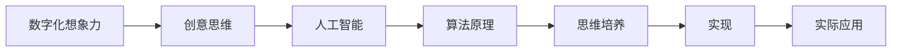

                 

# 数字化想象力激发：AI驱动的创意思维培养

> 关键词：数字化转型, 人工智能, 创造力, 思维培养, 创意思维, 算法原理

## 1. 背景介绍

### 1.1 问题由来
当前，数字化转型已经成为各行各业发展的必然趋势。从制造业到服务业，从教育到医疗，数字技术的应用无处不在。然而，在数字化转型的浪潮中，传统的机械式思维逐渐显得力不从心。在面对复杂的决策、创新和协作时，人类需要借助更高效、灵活的思维方式，以适应快速变化的环境。

### 1.2 问题核心关键点
因此，激发数字化想象力、培养创意思维成为了数字化转型的重要一环。利用人工智能（AI）驱动的创意思维培养，能够使组织和个人在不断变化的数字化环境中，保持创新和竞争优势。

### 1.3 问题研究意义
研究AI驱动的创意思维培养方法，对于推动企业创新、提升个人竞争力、加速数字化转型进程，具有重要意义：

1. 促进企业创新：通过培养数字化想象力，企业能够更灵活地应对市场变化，快速推出新产品和服务。
2. 提升个人竞争力：在数字化时代，具备创意思维能力的人才能在职场上脱颖而出，适应高要求的工作环境。
3. 加速数字化转型：通过AI技术，实现对海量数据的高效分析和处理，加速企业数字化转型的步伐。
4. 带来技术创新：创意思维的培养推动了AI技术在更多领域的应用，进一步推动了技术的进步。
5. 赋能产业升级：创意思维的培养为传统行业数字化升级提供了新的思路和方向。

## 2. 核心概念与联系

### 2.1 核心概念概述

为了更好地理解AI驱动的创意思维培养，我们需要介绍几个核心概念：

- 数字化想象力：指在数字化环境中，通过分析、模拟和预测，激发和培养创造力的思维方式。
- 创意思维：指在面对复杂问题时，能够从不同角度思考，产生创新解决方案的思维方式。
- 人工智能：指利用算法、模型和数据，实现智能化的计算和决策能力的技术。
- 算法原理：指各种算法的基本原理和实现方式。
- 思维培养：指通过特定的方法和工具，培养和提升思维能力的过程。

这些核心概念之间存在紧密的联系：

- 数字化想象力是创意思维在数字化环境下的具体表现。
- 创意思维是数字化想象力的基础和目标。
- 人工智能提供了实现数字化想象力和创意思维培养的算法和技术手段。
- 思维培养是实现数字化想象力和创意思维培养的关键步骤。

这些概念共同构成了一个完整的数字化想象力和创意思维培养框架。

### 2.2 核心概念原理和架构的 Mermaid 流程图(Mermaid 流程节点中不要有括号、逗号等特殊字符)


这个流程图展示了核心概念之间的逻辑关系：

1. 数字化想象力(A)通过人工智能(C)驱动的算法(D)，实现创意思维(B)的培养。
2. 思维培养(E)是实现这一过程的关键步骤，通过具体的工具和手段(F)，将数字化想象力和创意思维转化为实际应用(G)。

## 3. 核心算法原理 & 具体操作步骤
### 3.1 算法原理概述

AI驱动的创意思维培养主要依赖于算法原理，其核心思想是通过数据分析和模型训练，激发和培养创意思维。具体来说，包括以下几个关键步骤：

1. **数据收集**：收集与问题相关的数据，包括历史案例、用户反馈、市场趋势等。
2. **数据预处理**：对数据进行清洗、归一化、特征提取等处理，以便于后续的模型训练。
3. **模型训练**：利用机器学习或深度学习模型，对处理后的数据进行训练，以构建数字化想象力模型。
4. **模型应用**：将训练好的模型应用于实际问题中，生成创意和解决方案。
5. **反馈优化**：根据模型的输出结果和实际效果，进行反复迭代和优化。

### 3.2 算法步骤详解

以下是AI驱动的创意思维培养的详细操作步骤：

**Step 1: 数据收集与预处理**
- 定义数据收集策略：明确需要收集的数据类型和来源。
- 收集数据：通过API、爬虫、问卷调查等方式，收集相关数据。
- 数据清洗：去除重复、无关、错误的数据，确保数据质量。
- 特征提取：选择有意义的特征，如文本、图像、时间序列等，供后续模型训练使用。

**Step 2: 模型选择与训练**
- 选择合适的模型：根据问题的复杂度和数据类型，选择适合的模型，如回归模型、分类模型、生成模型等。
- 模型训练：利用处理后的数据对模型进行训练，调整模型参数以优化性能。
- 模型验证：在验证集上评估模型性能，确保模型具有良好的泛化能力。

**Step 3: 创意生成与评估**
- 创意生成：将训练好的模型应用于实际问题中，生成可能的创意和解决方案。
- 创意评估：对生成的创意进行评分和排名，选择最优方案。

**Step 4: 反馈与优化**
- 收集用户反馈：通过用户反馈了解创意的实际效果和潜在改进点。
- 模型优化：根据用户反馈，调整模型参数或选择新的模型，优化创意生成过程。

### 3.3 算法优缺点

AI驱动的创意思维培养方法具有以下优点：
1. 高效性：利用数据和模型，能够快速生成大量创意，提高问题解决速度。
2. 创新性：通过复杂的数据分析和模型训练，能够产生新颖的创意和解决方案。
3. 可扩展性：可以应用于多种问题领域，如市场分析、产品设计、用户体验等。
4. 数据驱动：通过数据分析，能够更准确地理解用户需求和市场趋势，指导创意生成。

同时，该方法也存在一些缺点：
1. 依赖高质量数据：模型的效果很大程度上依赖于数据的完整性和质量，数据收集和处理需要较高的成本。
2. 模型复杂性：构建高质量的模型需要深入的算法知识和丰富的经验，门槛较高。
3. 创意多样性不足：模型可能倾向于生成较为常见的创意，难以产生独特的创新点。
4. 可解释性不足：部分模型如深度学习，难以解释其内部的决策逻辑，导致结果不够透明。

尽管存在这些局限性，但就目前而言，AI驱动的创意思维培养方法仍是最主流的手段。未来相关研究的方向在于如何进一步降低数据和算法的门槛，提高创意的多样性和可解释性，同时兼顾高效性和创新性。

### 3.4 算法应用领域

AI驱动的创意思维培养方法在多个领域得到了广泛的应用，以下是几个典型案例：

- **市场营销**：利用AI分析市场趋势和用户行为，生成创新的营销策略和广告方案。
- **产品设计**：通过对用户需求和市场反馈的分析，生成创新的产品设计方案。
- **用户体验**：通过数据分析，优化用户界面和交互流程，提升用户体验。
- **创意写作**：利用自然语言生成模型，生成高质量的创意文章和故事。
- **科学发现**：利用数据分析和模型训练，发现新的科学现象和规律。

这些应用领域展示了AI驱动的创意思维培养方法在解决实际问题中的巨大潜力。

## 4. 数学模型和公式 & 详细讲解 & 举例说明
### 4.1 数学模型构建

本节将使用数学语言对AI驱动的创意思维培养过程进行更加严格的刻画。

设问题为 $P$，收集到的数据为 $D=\{(x_i,y_i)\}_{i=1}^N$，其中 $x_i$ 为输入特征，$y_i$ 为输出标签。目标是通过构建模型 $M$，将输入特征 $x$ 映射到创意 $c$ 的概率分布上。

定义模型的期望输出为 $\mathbb{E}[M(x)]$，创意生成过程可以表示为：

$$
c = M(x)
$$

### 4.2 公式推导过程

以下我们以生成创意的概率模型为例，推导创意生成的数学公式。

假设创意生成的过程可以通过生成对抗网络(GAN)或变分自编码器(VAE)等模型来实现。设创意 $c$ 的概率密度函数为 $p(c|x)$，创意生成的过程可以表示为：

$$
c = G(z)
$$

其中 $G$ 为生成器，$z$ 为生成器的输入噪声。通过最大化真实创意和生成创意之间的KL散度，可以训练生成器 $G$：

$$
\min_{G} KL(p(c|x), p_{G}(c|x))
$$

目标函数可以进一步表示为：

$$
\min_{G} \int p(x) \log \frac{p(x)}{p_{G}(x,c)} dx
$$

在实际应用中，可以通过数据集 $D$ 上的样本进行估计：

$$
\min_{G} \frac{1}{N} \sum_{i=1}^N \log \frac{p(x_i)}{p_{G}(x_i,c)}
$$

### 4.3 案例分析与讲解

以一个简单的创意生成案例来说明上述模型的应用：

假设我们要生成关于新产品的创意，输入特征 $x$ 为产品的市场定位、用户需求、竞争对手等数据，输出创意 $c$ 为一个简短的产品描述。设创意的概率密度函数 $p(c|x)$ 为一个简单的高斯分布，即：

$$
p(c|x) = \mathcal{N}(c; \mu(x), \sigma^2(x))
$$

其中 $\mu(x)$ 和 $\sigma^2(x)$ 表示创意的概率均值和方差，与输入特征 $x$ 相关。

通过收集历史产品数据和用户反馈，训练一个生成模型 $G$，使得生成的创意 $c$ 与实际创意 $c'$ 的KL散度最小化。假设训练好的生成器为 $G$，那么对于任意的输入 $x$，生成的创意 $c$ 的概率密度函数为：

$$
p_{G}(c|x) = \mathcal{N}(c; \mu_{G}(x), \sigma^2_{G}(x))
$$

其中 $\mu_{G}(x)$ 和 $\sigma^2_{G}(x)$ 为生成器训练得到的均值和方差。

假设我们想生成一个新的市场定位为 "环保" 的产品创意，可以输入特征 $x=[环保, 高质量, 低价, 用户友好]$ 到训练好的生成器 $G$ 中，生成一个符合市场定位的产品创意 $c$。生成的创意可以通过以下公式计算：

$$
c = G(\mu_{G}(x), \sigma_{G}(x))
$$

通过这样的方式，我们可以高效地生成符合市场定位的产品创意。

## 5. 项目实践：代码实例和详细解释说明
### 5.1 开发环境搭建

在进行AI驱动的创意思维培养实践前，我们需要准备好开发环境。以下是使用Python进行TensorFlow开发的环境配置流程：

1. 安装Anaconda：从官网下载并安装Anaconda，用于创建独立的Python环境。

2. 创建并激活虚拟环境：
```bash
conda create -n tf-env python=3.7 
conda activate tf-env
```

3. 安装TensorFlow：
```bash
pip install tensorflow==2.7
```

4. 安装必要的工具包：
```bash
pip install numpy pandas matplotlib tensorflow-hub tensorflow-addons
```

完成上述步骤后，即可在`tf-env`环境中开始实践。

### 5.2 源代码详细实现

下面我们以创意生成案例为例，给出使用TensorFlow实现创意生成的PyTorch代码实现。

首先，定义创意生成的输入和输出：

```python
import tensorflow as tf
import tensorflow_hub as hub

# 定义输入特征和创意
input_features = tf.keras.layers.Input(shape=(3,))
output_creativity = tf.keras.layers.Dense(1, activation='sigmoid')(input_features)

# 构建创意生成的模型
model = tf.keras.Model(inputs=input_features, outputs=output_creativity)

# 编译模型
model.compile(optimizer='adam', loss='binary_crossentropy')
```

然后，定义创意生成的训练过程：

```python
# 假设创意生成的数据集为 train_dataset
# 定义训练数据集的迭代器
train_generator = tf.data.Dataset.from_tensor_slices(train_dataset)

# 定义训练过程
@tf.function
def train_step(inputs):
    with tf.GradientTape() as tape:
        predictions = model(inputs)
        loss = tf.losses.BinaryCrossentropy(from_logits=True)(targets, predictions)
    gradients = tape.gradient(loss, model.trainable_variables)
    optimizer.apply_gradients(zip(gradients, model.trainable_variables))

# 训练模型
epochs = 10
batch_size = 32

for epoch in range(epochs):
    for batch, (features, targets) in enumerate(train_generator):
        train_step(features)
```

最后，启动创意生成的训练流程：

```python
# 假设创意生成的验证集为 valid_dataset
# 在验证集上评估模型性能
valid_generator = tf.data.Dataset.from_tensor_slices(valid_dataset)
valid_generator = valid_generator.batch(batch_size)

for batch, (features, targets) in enumerate(valid_generator):
    loss = model.evaluate(features, targets)

print(f'Validation Loss: {loss}')
```

以上就是使用TensorFlow实现创意生成的完整代码实现。可以看到，通过TensorFlow的灵活性和强大的工具包支持，创意生成任务的开发变得相对简单高效。

### 5.3 代码解读与分析

让我们再详细解读一下关键代码的实现细节：

**定义输入和输出**：
- 使用`tf.keras.layers.Input`定义输入特征，包括市场定位、用户需求等。
- 使用`tf.keras.layers.Dense`定义创意的输出层，使用sigmoid激活函数，将创意表示为一个0-1的概率分布。

**构建模型**：
- 使用`tf.keras.Model`将输入特征和创意输出连接起来，构建创意生成的模型。
- 使用`model.compile`编译模型，指定优化器和损失函数。

**训练过程**：
- 使用`tf.data.Dataset.from_tensor_slices`将训练数据集转换成张量数据集，以便于TensorFlow处理。
- 定义`train_step`函数，在每个批次上进行前向传播和反向传播，更新模型参数。
- 循环迭代训练模型，直到收敛。

**评估过程**：
- 使用`tf.data.Dataset.from_tensor_slices`将验证数据集转换成张量数据集，以便于TensorFlow处理。
- 定义验证数据集的迭代器`valid_generator`，控制批次大小。
- 循环迭代评估模型性能，输出验证损失。

可以看到，通过TensorFlow的API和工具包，创意生成任务的代码实现变得简洁高效。开发者可以将更多精力放在数据处理、模型改进等高层逻辑上，而不必过多关注底层的实现细节。

当然，工业级的系统实现还需考虑更多因素，如模型的保存和部署、超参数的自动搜索、更灵活的输入格式等。但核心的创意生成流程基本与此类似。

## 6. 实际应用场景
### 6.1 智能客服系统

AI驱动的创意思维培养技术可以广泛应用于智能客服系统的构建。传统客服往往需要配备大量人力，高峰期响应缓慢，且一致性和专业性难以保证。通过AI驱动的创意思维培养，智能客服系统可以7x24小时不间断服务，快速响应客户咨询，用自然流畅的语言解答各类常见问题。

在技术实现上，可以收集企业内部的历史客服对话记录，将问题和最佳答复构建成监督数据，在此基础上对预训练模型进行微调。微调后的模型能够自动理解用户意图，匹配最合适的答案模板进行回复。对于客户提出的新问题，还可以接入检索系统实时搜索相关内容，动态组织生成回答。如此构建的智能客服系统，能大幅提升客户咨询体验和问题解决效率。

### 6.2 金融舆情监测

金融机构需要实时监测市场舆论动向，以便及时应对负面信息传播，规避金融风险。传统的人工监测方式成本高、效率低，难以应对网络时代海量信息爆发的挑战。AI驱动的创意思维培养技术，可以通过分析大量新闻、报道、评论等文本数据，生成市场舆情的实时分析报告，帮助金融机构快速响应潜在风险。

具体而言，可以收集金融领域相关的新闻、报道、评论等文本数据，利用自然语言处理技术对数据进行清洗、归一化、特征提取等处理。在此基础上，训练一个创意生成模型，生成市场舆情的实时分析报告。通过实时监测数据，模型可以自动识别舆情变化趋势，一旦发现负面信息激增等异常情况，系统便会自动预警，帮助金融机构快速应对潜在风险。

### 6.3 个性化推荐系统

当前的推荐系统往往只依赖用户的历史行为数据进行物品推荐，无法深入理解用户的真实兴趣偏好。AI驱动的创意思维培养技术，可以通过分析用户的行为数据，生成个性化的推荐方案。

在实践中，可以收集用户浏览、点击、评论、分享等行为数据，提取和用户交互的物品标题、描述、标签等文本内容。将文本内容作为模型输入，用户的后续行为（如是否点击、购买等）作为监督信号，在此基础上训练创意生成模型。训练后的模型能够从文本内容中准确把握用户的兴趣点，在生成推荐列表时，先用候选物品的文本描述作为输入，由模型预测用户的兴趣匹配度，再结合其他特征综合排序，便可以得到个性化程度更高的推荐结果。

### 6.4 未来应用展望

随着AI驱动的创意思维培养技术的不断发展，其在更多领域的应用前景将更加广阔。

在智慧医疗领域，利用AI驱动的创意思维培养，可以帮助医生生成个性化的诊疗方案，提升诊断和治疗的效果。在智能教育领域，可以通过AI驱动的创意思维培养，生成个性化的学习计划和辅导方案，因材施教，促进教育公平，提高教学质量。

在智慧城市治理中，AI驱动的创意思维培养可以用于城市事件监测、舆情分析、应急指挥等环节，提高城市管理的自动化和智能化水平，构建更安全、高效的未来城市。

此外，在企业生产、社会治理、文娱传媒等众多领域，AI驱动的创意思维培养也将不断涌现，为传统行业数字化转型升级提供新的技术路径。相信随着技术的日益成熟，AI驱动的创意思维培养必将在构建人机协同的智能时代中扮演越来越重要的角色。

## 7. 工具和资源推荐
### 7.1 学习资源推荐

为了帮助开发者系统掌握AI驱动的创意思维培养的理论基础和实践技巧，这里推荐一些优质的学习资源：

1. 《深度学习》课程：斯坦福大学开设的深度学习经典课程，涵盖了深度学习的基础理论和应用实践，包括创意生成等前沿话题。
2. 《Python深度学习》书籍：书籍深入浅出地介绍了Python在深度学习中的应用，包括创意生成模型的实现。
3. TensorFlow官方文档：TensorFlow的官方文档，提供了丰富的API和教程，是学习TensorFlow的必备资源。
4. TensorFlow Hub：TensorFlow的模型库，提供了多种预训练模型和创意生成模型，方便开发者直接使用。
5. HuggingFace官方文档：HuggingFace的官方文档，提供了丰富的自然语言处理模型和创意生成模型，适合实践和应用。

通过对这些资源的学习实践，相信你一定能够快速掌握AI驱动的创意思维培养的精髓，并用于解决实际的AI问题。
###  7.2 开发工具推荐

高效的开发离不开优秀的工具支持。以下是几款用于AI驱动的创意思维培养开发的常用工具：

1. TensorFlow：谷歌开发的开源深度学习框架，灵活高效，适合复杂模型的训练和推理。
2. PyTorch：Facebook开发的开源深度学习框架，动态计算图，适合快速迭代研究。
3. TensorFlow Hub：TensorFlow的模型库，集成了多种预训练模型和创意生成模型，方便开发者直接使用。
4. TensorBoard：TensorFlow配套的可视化工具，可以实时监测模型训练状态，提供丰富的图表呈现方式。
5. Weights & Biases：模型训练的实验跟踪工具，可以记录和可视化模型训练过程中的各项指标，方便对比和调优。

合理利用这些工具，可以显著提升AI驱动的创意思维培养任务的开发效率，加快创新迭代的步伐。

### 7.3 相关论文推荐

AI驱动的创意思维培养技术的发展源于学界的持续研究。以下是几篇奠基性的相关论文，推荐阅读：

1. "Generating Sequences with Recurrent Neural Networks"（RNN）：提出了RNN模型，为自然语言生成奠定了基础。
2. "Generating Realistic Sentences with Attention"（Transformer）：提出了Transformer模型，展示了强大的语言生成能力。
3. "Attention is All You Need"：进一步提升了Transformer模型，展示了其在创意生成任务上的优越性能。
4. "Neural Machine Translation by Jointly Learning to Align and Translate"：提出了基于Transformer的机器翻译模型，展示了其在创意生成任务上的潜力。
5. "Creative AI: A Survey of Technical Challenges and Future Directions"：综述了AI驱动的创意思维培养技术的发展现状和未来方向。

这些论文代表了大语言模型微调技术的发展脉络。通过学习这些前沿成果，可以帮助研究者把握学科前进方向，激发更多的创新灵感。

## 8. 总结：未来发展趋势与挑战
### 8.1 总结

本文对AI驱动的创意思维培养方法进行了全面系统的介绍。首先阐述了AI驱动的创意思维培养的研究背景和意义，明确了该方法在推动企业创新、提升个人竞争力、加速数字化转型进程等方面的重要作用。其次，从原理到实践，详细讲解了创意生成的数学模型和算法流程，给出了创意生成任务的完整代码实例。同时，本文还广泛探讨了AI驱动的创意思维培养在智能客服、金融舆情、个性化推荐等众多领域的应用前景，展示了其巨大的潜力。最后，本文精选了相关学习资源、开发工具和经典论文，力求为读者提供全方位的技术指引。

通过本文的系统梳理，可以看到，AI驱动的创意思维培养方法在解决复杂问题、提升创新能力、推动数字化转型等方面具有重要作用。利用AI技术，我们可以更加高效地生成创意和解决方案，促进企业的数字化转型升级。未来，伴随AI技术的不断进步，AI驱动的创意思维培养必将在更多领域得到应用，为数字化转型带来新的动力。

### 8.2 未来发展趋势

展望未来，AI驱动的创意思维培养技术将呈现以下几个发展趋势：

1. 智能化水平提升：通过更多的数据和算法优化，AI驱动的创意思维培养将变得更加智能化，能够生成更加复杂、新颖的创意和解决方案。
2. 跨领域应用扩展：AI驱动的创意思维培养将不再局限于某个特定的领域，能够广泛应用于更多行业，解决更多实际问题。
3. 多模态融合：AI驱动的创意思维培养将进一步融合视觉、听觉、文本等多种模态信息，提升创意生成质量。
4. 可解释性增强：通过更透明的算法设计和更丰富的可视化工具，AI驱动的创意思维培养将变得更加可解释，增强用户信任。
5. 人机协同增强：AI驱动的创意思维培养将与人类更加紧密地协同工作，形成“人机协作”的新模式。

以上趋势凸显了AI驱动的创意思维培养技术的广阔前景。这些方向的探索发展，必将进一步提升AI系统的创意生成能力，为人类认知智能的进化带来深远影响。

### 8.3 面临的挑战

尽管AI驱动的创意思维培养技术已经取得了瞩目成就，但在迈向更加智能化、普适化应用的过程中，它仍面临着诸多挑战：

1. 数据质量瓶颈：高质量创意数据的获取需要大量时间和资源，数据来源广泛且结构复杂。如何高效收集和处理数据，是首要挑战。
2. 模型复杂性：创意生成模型的构建需要深入的算法知识和丰富的经验，复杂模型如Transformer等需要大量的计算资源。
3. 创意多样性不足：模型可能倾向于生成较为常见的创意，难以产生独特的创新点。如何提升创意多样性，是关键问题。
4. 可解释性不足：部分模型如深度学习，难以解释其内部的决策逻辑，导致结果不够透明。如何增强可解释性，是亟待解决的问题。
5. 安全性有待保障：创意生成模型可能生成有害信息，对用户造成误导。如何保障模型输出安全，是重要研究方向。

尽管存在这些挑战，但随着学界和产业界的共同努力，AI驱动的创意思维培养必将在未来的发展中逐步克服这些困难，成为更加高效、智能、安全的解决方案。

### 8.4 研究展望

面向未来，AI驱动的创意思维培养技术需要在以下几个方面进行深入研究：

1. 探索无监督和半监督创意生成方法：摆脱对大量标注数据的依赖，利用自监督学习、主动学习等无监督和半监督范式，最大限度利用非结构化数据，实现更加灵活高效的创意生成。
2. 研究创意多样性和新颖性提升：引入更多的创意启发算法，如多样性增强、对抗生成等，提升创意生成模型的多样性和新颖性。
3. 引入更多先验知识：将符号化的先验知识，如知识图谱、逻辑规则等，与神经网络模型进行巧妙融合，引导创意生成过程学习更准确、合理的语言模型。
4. 结合因果分析和博弈论工具：将因果分析方法引入创意生成模型，识别出模型决策的关键特征，增强创意生成的因果性和逻辑性。
5. 纳入伦理道德约束：在创意生成目标中引入伦理导向的评估指标，过滤和惩罚有害的创意输出，确保创意生成过程符合人类价值观和伦理道德。

这些研究方向的探索，必将引领AI驱动的创意思维培养技术迈向更高的台阶，为构建更加智能化、普适化的人机协作系统铺平道路。面向未来，AI驱动的创意思维培养技术还需要与其他AI技术进行更深入的融合，如知识表示、因果推理、强化学习等，多路径协同发力，共同推动自然语言理解和智能交互系统的进步。只有勇于创新、敢于突破，才能不断拓展AI系统的边界，让智能技术更好地造福人类社会。

## 9. 附录：常见问题与解答

**Q1：AI驱动的创意思维培养是否适用于所有创意生成任务？**

A: AI驱动的创意思维培养方法在大多数创意生成任务上都能取得不错的效果，特别是对于数据量较小的任务。但对于一些特定领域的任务，如文学创作、艺术创作等，仅仅依靠通用语料预训练的模型可能难以很好地适应。此时需要在特定领域语料上进一步预训练，再进行创意生成，才能获得理想效果。

**Q2：在创意生成过程中，如何平衡创意的创新性和多样性？**

A: 在创意生成过程中，可以采用以下策略平衡创意的创新性和多样性：

1. 引入多样性增强技术：如对抗生成网络、变分自编码器等，增加创意的多样性。
2. 使用多种创意启发算法：如迁移学习、数据增强、对抗样本等，激发创意的创新性。
3. 结合用户反馈：在创意生成过程中，结合用户反馈，动态调整创意生成策略，提升创意质量和多样性。

这些策略需要根据具体任务和数据特点进行灵活组合，以达到最佳的创意生成效果。

**Q3：如何衡量创意生成模型的性能？**

A: 衡量创意生成模型的性能可以从以下几个方面入手：

1. 多样性：创意生成模型应能够生成多种不同创意，覆盖不同的创意空间。
2. 新颖性：创意生成模型应能够生成新颖、独特的创意，避免生成常规或重复的创意。
3. 相关性：创意生成模型应能够生成与输入相关的创意，避免离题或无关的创意。
4. 实用性：创意生成模型应能够生成实用的创意，具备一定的商业价值或应用前景。

通常使用BLEU、ROUGE等评价指标来衡量创意生成模型的性能，但在具体应用场景中，还需要结合实际需求和用户反馈进行调整和优化。

**Q4：在创意生成过程中，如何避免创意生成模型的过拟合？**

A: 避免创意生成模型过拟合的方法包括：

1. 数据增强：通过回译、近义替换等方式扩充训练集。
2. 正则化技术：使用L2正则、Dropout等方法，防止模型过度适应训练数据。
3. 对抗训练：引入对抗样本，提高模型鲁棒性。
4. 参数高效微调：只调整少量参数，固定大部分预训练权重不变，减少需优化的参数。
5. 模型集成：训练多个创意生成模型，取平均输出，抑制过拟合。

这些方法需要根据具体任务和数据特点进行灵活组合，以达到最佳的创意生成效果。

**Q5：创意生成模型的训练过程中，如何平衡损失函数中的各项权重？**

A: 在创意生成模型的训练过程中，平衡损失函数中的各项权重可以采用以下策略：

1. 基于实际需求调整权重：根据具体创意生成任务的需求，动态调整损失函数中各项权重的比例。
2. 使用权重衰减技术：在训练过程中，逐渐减小部分权重的衰减，使模型更加关注关键的任务目标。
3. 引入正则化技术：使用L2正则、Dropout等方法，防止模型过度适应训练数据，确保模型泛化性能。
4. 多任务学习：在创意生成任务中，可以引入多个子任务，共同优化模型的多方面性能。

这些策略需要根据具体任务和数据特点进行灵活组合，以达到最佳的创意生成效果。

---

作者：禅与计算机程序设计艺术 / Zen and the Art of Computer Programming

