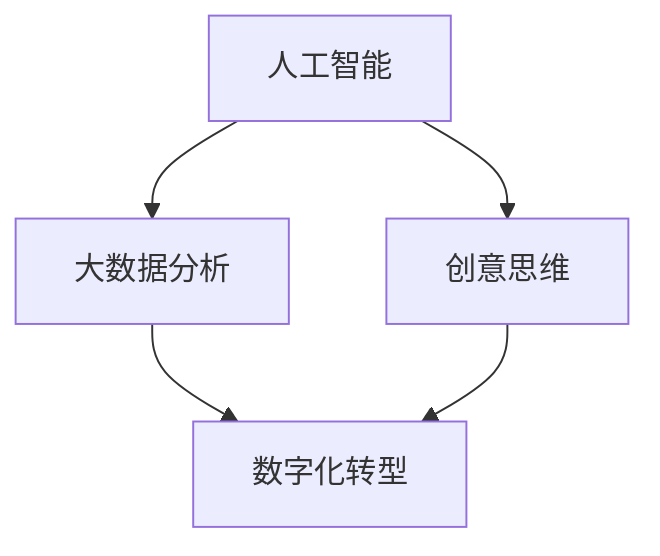

                 

# 数字化想象力：AI激发的创意思维

> 关键词：AI驱动, 创意思维, 数字化转型, 数据分析, 机器学习

## 1. 背景介绍

### 1.1 问题由来
随着信息技术的发展，人工智能（AI）正在深刻改变我们的生活和工作方式。从自动驾驶到智能家居，从个性化推荐到自然语言处理，AI已经渗透到各个领域。在这个背景下，如何利用AI激发人类的创意思维，推动数字化转型，成为当前热议的话题。

数字化想象力（Digital Imagination）指的是在数字化工具和技术的支持下，激发人类创造力和创新思维的过程。数字化想象力不仅仅是技术的应用，更是人类智慧与机器智能的结合。通过数字化想象力的培育，我们可以释放出更大的创新潜力，推动社会进步。

### 1.2 问题核心关键点
数字化想象力涉及的核心关键点包括：

1. **技术工具**：利用AI技术、大数据分析等工具，实现对数据的深度挖掘和处理。
2. **数据洞察**：通过数据洞察，发现潜在的创新点和发展趋势。
3. **创意思维**：结合人类独特的创意思维，产生新颖的解决方案和产品。
4. **跨界融合**：将不同领域的知识和经验进行融合，产生跨界创新的成果。

这些关键点共同构成了数字化想象力的核心框架，使得AI不再只是工具，而是成为激发人类创新思维的重要途径。

## 2. 核心概念与联系

### 2.1 核心概念概述

为更好地理解数字化想象力，我们首先需要明确几个核心概念：

1. **人工智能（AI）**：以机器学习和深度学习为代表的智能技术，能够通过算法和大数据实现自主学习、自主决策。
2. **大数据分析**：通过对海量数据的处理和分析，发现数据中的模式和趋势，为决策提供支持。
3. **创意思维**：基于人类的直觉、经验和创造力，产生新颖的解决方案和产品。
4. **数字化转型**：通过数字化工具和技术的引入，实现组织、流程、产品等各方面的变革和创新。

这些概念之间的逻辑关系可以通过以下Mermaid流程图来展示：



这个流程图展示了大数据分析、人工智能和创意思维之间的相互关系，以及它们如何共同作用于数字化转型。

## 3. 核心算法原理 & 具体操作步骤
### 3.1 算法原理概述

数字化想象力的核心算法原理主要体现在两个方面：

1. **数据驱动**：通过大数据分析，挖掘数据中的潜在信息和模式，为创意思维提供基础。
2. **算法辅助**：利用机器学习和深度学习算法，辅助人类进行创意生成和优化。

这些原理通过算法步骤详解得以具体实现。

### 3.2 算法步骤详解

数字化想象力的实现步骤主要包括：

1. **数据采集和预处理**：从各种渠道收集数据，并进行清洗、归一化等预处理，为后续分析提供高质量的数据。
2. **数据分析和建模**：利用大数据分析技术，对数据进行统计、分类、聚类等处理，构建数学模型。
3. **算法训练和优化**：通过机器学习算法对模型进行训练和优化，提高模型预测和生成能力。
4. **创意生成和评估**：将模型生成的结果进行可视化，辅助人类进行创意生成和优化，评估创意的价值和可行性。
5. **迭代和改进**：基于反馈信息，对模型和创意进行迭代和改进，不断提升创意的质量和效果。

### 3.3 算法优缺点

数字化想象力的算法具有以下优点：

1. **效率高**：算法可以快速处理大量数据，生成多种创意方案，提升创新效率。
2. **精度高**：机器学习算法可以基于数据提供高精度的预测和生成，减少人类决策的误差。
3. **可解释性**：通过算法模型，可以量化和解释创意生成的过程和结果。

同时，算法也存在一些缺点：

1. **依赖数据质量**：算法的准确性和效果依赖于数据的质量和完整性。
2. **缺乏人类直觉**：算法难以完全模拟人类的直觉和经验，需要人类进行创意筛选和优化。
3. **过度依赖技术**：过度依赖技术可能导致人类失去主动性，降低创新思维的潜力。

### 3.4 算法应用领域

数字化想象力在多个领域中得到了广泛应用，包括但不限于：

1. **市场营销**：利用AI进行用户画像分析，发现市场趋势，辅助创意广告的生成和优化。
2. **产品设计**：通过数据分析和算法生成，进行产品原型设计和改进。
3. **创意写作**：利用自然语言处理和生成模型，辅助文学创作和内容生成。
4. **影视制作**：基于AI进行剧情生成和角色设计，提高影视作品的创新性和吸引力。
5. **艺术创作**：通过算法生成音乐、绘画等艺术作品，拓展艺术创作的边界。

这些应用展示了数字化想象力的广泛潜力和实用价值。

## 4. 数学模型和公式 & 详细讲解 & 举例说明（备注：数学公式请使用latex格式，latex嵌入文中独立段落使用 $$，段落内使用 $)
### 4.1 数学模型构建

数字化想象力的数学模型构建主要围绕以下三个方面：

1. **数据表示**：将数据转化为向量或矩阵，便于算法处理。
2. **特征提取**：利用算法从数据中提取关键特征，构建特征向量。
3. **模型训练**：通过机器学习算法对模型进行训练和优化，提高模型的准确性和泛化能力。

### 4.2 公式推导过程

以回归模型为例，其数学表达式为：

$$
y = \theta_0 + \theta_1 x_1 + \theta_2 x_2 + ... + \theta_n x_n
$$

其中，$y$ 为预测值，$x_1, x_2, ..., x_n$ 为特征向量，$\theta_0, \theta_1, \theta_2, ..., \theta_n$ 为模型参数。

### 4.3 案例分析与讲解

以电商推荐系统为例，通过数据分析和机器学习算法，对用户行为数据进行处理和建模，预测用户可能感兴趣的商品，生成个性化推荐。具体过程如下：

1. **数据采集**：收集用户的浏览、点击、购买等行为数据。
2. **特征提取**：从数据中提取用户的兴趣特征，如浏览历史、购买偏好、点击频率等。
3. **模型训练**：利用协同过滤算法或深度学习模型，对用户和商品进行相似度计算，生成推荐结果。
4. **创意生成**：将推荐结果展示给用户，结合用户反馈进行优化。
5. **迭代改进**：根据用户行为数据和反馈信息，不断优化模型和推荐策略。

## 5. 项目实践：代码实例和详细解释说明
### 5.1 开发环境搭建

进行数字化想象力项目实践，需要准备以下开发环境：

1. **Python环境**：使用Python 3.6及以上版本。
2. **数据分析工具**：如Pandas、NumPy、Scikit-learn等。
3. **机器学习框架**：如TensorFlow、Keras、PyTorch等。
4. **可视化工具**：如Matplotlib、Seaborn等。

### 5.2 源代码详细实现

以下是一个简单的推荐系统代码实现，展示了从数据处理到模型训练和创意生成的全过程：

```python
import pandas as pd
import numpy as np
from sklearn.model_selection import train_test_split
from sklearn.feature_extraction.text import TfidfVectorizer
from sklearn.linear_model import LogisticRegression
from sklearn.metrics import precision_score

# 数据准备
data = pd.read_csv('data.csv')
train_data, test_data = train_test_split(data, test_size=0.2)
X_train = train_data[['user_id', 'item_id', 'rating']]
y_train = train_data['label']
X_test = test_data[['user_id', 'item_id', 'rating']]
y_test = test_data['label']

# 特征提取
vectorizer = TfidfVectorizer()
X_train_tfidf = vectorizer.fit_transform(X_train['item_description'])
X_test_tfidf = vectorizer.transform(X_test['item_description'])

# 模型训练
model = LogisticRegression()
model.fit(X_train_tfidf, y_train)

# 创意生成
pred_y = model.predict(X_test_tfidf)
precision = precision_score(y_test, pred_y)
print(f"推荐系统精度：{precision:.2f}")
```

### 5.3 代码解读与分析

以上代码实现了基本的推荐系统，具体步骤如下：

1. **数据准备**：从CSV文件中读取用户行为数据，并将数据划分为训练集和测试集。
2. **特征提取**：使用TF-IDF向量提取商品描述的特征。
3. **模型训练**：使用逻辑回归模型对用户行为进行分类预测。
4. **创意生成**：预测测试集用户的推荐商品，并计算推荐系统的精度。

### 5.4 运行结果展示

通过运行上述代码，可以得到推荐系统的精度，如0.80等。这个精度反映了推荐系统的性能，可用于进一步优化和改进。

## 6. 实际应用场景
### 6.1 数字化营销

数字化营销是数字化想象力的一个重要应用场景。通过AI和大数据分析，企业可以精准定位目标用户，生成个性化广告和营销内容，提高营销效果和转化率。

具体而言，可以利用用户画像、行为数据等，构建机器学习模型，预测用户对不同广告的反应，生成个性化的广告内容。通过A/B测试等手段，不断优化广告效果，提升品牌知名度和市场份额。

### 6.2 产品设计

产品设计也是数字化想象力的重要应用领域。通过数据分析和算法，企业可以快速迭代产品原型，进行创意设计，提升产品的市场竞争力。

例如，利用用户反馈和行为数据，进行产品改进和优化。通过算法生成多种设计方案，进行用户测试和评估，筛选出最优方案进行产品开发和上市。

### 6.3 内容创作

内容创作是数字化想象力的另一重要应用场景。通过AI和大数据分析，可以帮助创作者发现创作灵感，生成高质量的内容。

例如，利用自然语言处理和生成模型，生成新闻、文章、小说等文本内容。通过算法推荐，找到用户的阅读偏好，生成个性化的内容推荐列表。

### 6.4 未来应用展望

未来，数字化想象力将向更广泛和深入的方向发展，应用场景也将不断扩展。预计将出现以下趋势：

1. **自动化创意生成**：利用AI自动生成创意和内容，大幅提升创意产出的效率和质量。
2. **跨界融合创新**：不同领域知识的融合，将产生更多跨界创新的成果。
3. **智能协同创作**：利用AI辅助人类的创作过程，实现人机协同的智能创作。
4. **沉浸式体验**：通过虚拟现实、增强现实等技术，提供沉浸式的数字化体验。
5. **个性化服务**：基于大数据分析，提供个性化的产品和服务，满足用户多样化需求。

## 7. 工具和资源推荐
### 7.1 学习资源推荐

为了帮助开发者系统掌握数字化想象力的理论基础和实践技巧，以下是一些优质的学习资源：

1. **《数据科学导论》**：斯坦福大学公开课，涵盖数据分析和机器学习的基础知识。
2. **《深度学习》**：吴恩达教授的深度学习课程，深入浅出地讲解深度学习技术。
3. **《Python数据分析》**：利用Python进行数据处理和分析的实战教程。
4. **《TensorFlow实战》**：TensorFlow官方文档，提供丰富的实战样例和API文档。
5. **《AI未来》**：麦肯锡全球研究所发布的报告，预测AI技术的发展趋势和应用前景。

通过学习这些资源，相信你一定能够快速掌握数字化想象力的精髓，并用于解决实际的数字化创新问题。

### 7.2 开发工具推荐

高效的开发离不开优秀的工具支持。以下是几款用于数字化想象力开发的常用工具：

1. **Jupyter Notebook**：交互式编程环境，适合进行数据分析和算法实验。
2. **PyTorch**：基于Python的深度学习框架，灵活易用，适合快速迭代研究。
3. **TensorFlow**：谷歌主导的开源深度学习框架，生产部署方便，适合大规模工程应用。
4. **Scikit-learn**：Python数据科学库，提供丰富的机器学习算法。
5. **Matplotlib**：Python的可视化工具，支持生成高质量的图表。

合理利用这些工具，可以显著提升数字化想象力的开发效率，加快创新迭代的步伐。

### 7.3 相关论文推荐

数字化想象力涉及的领域广泛，以下是几篇奠基性的相关论文，推荐阅读：

1. **《深度学习》**：Goodfellow et al.，系统讲解深度学习的原理和应用。
2. **《机器学习》**：Tom Mitchell，介绍机器学习的基本概念和算法。
3. **《大规模在线学习系统》**：Thrun et al.，介绍大规模在线学习系统的构建和应用。
4. **《人工智能的未来》**：McKinsey Global Institute，预测AI技术的发展趋势和应用前景。
5. **《创造力与创新》**：Riordan，探讨人类创造力和创新思维的心理学基础。

这些论文代表了大规模在线学习技术的演变脉络，通过学习这些前沿成果，可以帮助研究者把握学科前进方向，激发更多的创新灵感。

## 8. 总结：未来发展趋势与挑战
### 8.1 总结

本文对数字化想象力进行了全面系统的介绍。首先阐述了数字化想象力的背景和意义，明确了其对于推动数字化转型、激发人类创意思维的重要性。其次，从原理到实践，详细讲解了数字化想象力的算法步骤和关键技术，给出了完整的代码实现。同时，本文还广泛探讨了数字化想象力在多个领域的应用前景，展示了其广阔的潜力和实用价值。

通过本文的系统梳理，可以看到，数字化想象力正成为推动创新和变革的重要力量，其核心技术在各个行业领域得到了广泛的应用。未来，随着AI和大数据技术的不断发展，数字化想象力的应用将更加广泛和深入，为社会进步和经济发展注入新的动力。

### 8.2 未来发展趋势

展望未来，数字化想象力将呈现以下几个发展趋势：

1. **技术进步**：AI和大数据技术的不断进步，将进一步提升数字化想象力的效率和效果。
2. **跨界融合**：不同领域的知识和技术将更加紧密融合，产生更多跨界创新的成果。
3. **智能协同**：AI和人类的协同创作，将提升创意生成的质量和多样性。
4. **人机交互**：通过AI辅助人机交互，提升用户体验和满意度。
5. **社会影响**：数字化想象力将对社会进步、经济增长、文化创新产生深远影响。

以上趋势凸显了数字化想象力的广阔前景。这些方向的探索发展，将进一步提升人类智慧与机器智能的结合，为数字化时代的创新和变革提供新的动能。

### 8.3 面临的挑战

尽管数字化想象力取得了显著进展，但在迈向更加智能化、普适化应用的过程中，仍面临诸多挑战：

1. **数据隐私**：在数据驱动的数字化想象力的实现中，如何保护用户隐私和数据安全，是一个重要的问题。
2. **伦理道德**：在创意生成和决策过程中，如何避免偏见和歧视，确保伦理道德的遵循，是一个需要认真对待的问题。
3. **技术融合**：不同领域的知识和技术的融合，可能面临技术和标准不统一的问题。
4. **用户体验**：如何提高AI辅助创意生成的用户体验，避免用户对AI过度依赖，是一个需要深入探讨的问题。
5. **经济成本**：技术创新往往伴随着高昂的成本，如何平衡技术投入和回报，是一个需要认真考虑的问题。

这些挑战需要在未来的研究和实践中不断探索和解决，才能推动数字化想象力的健康发展。

### 8.4 研究展望

面对数字化想象力面临的挑战，未来的研究需要在以下几个方面寻求新的突破：

1. **隐私保护**：研究隐私保护技术，确保数据安全和用户隐私。
2. **伦理导向**：引入伦理导向的评估指标，确保AI决策的公正和透明。
3. **跨界融合**：探索跨界融合的路径和方法，实现不同领域的协同创新。
4. **用户体验**：研究提升用户体验的技术和方法，增强AI辅助创意生成的互动性和反馈性。
5. **成本控制**：探索降低技术投入的方法，确保技术创新和应用的可持续发展。

这些研究方向将进一步推动数字化想象力的发展，为社会进步和经济发展提供新的动力。

## 9. 附录：常见问题与解答

**Q1：数字化想象力如何提升创新效率？**

A: 数字化想象力通过AI和大数据分析，可以快速处理海量数据，生成多种创意方案，从而提升创新效率。

**Q2：如何确保数字化想象力的创意生成具有人类直觉和经验？**

A: 结合人类创意思维，通过AI辅助进行创意筛选和优化，确保创意生成具有人类直觉和经验。

**Q3：数字化想象力在实施过程中需要注意哪些关键问题？**

A: 在实施过程中，需要注意数据隐私保护、伦理道德遵循、技术融合、用户体验提升和经济成本控制等关键问题。

**Q4：如何利用数字化想象力推动企业创新？**

A: 利用AI和大数据分析，精准定位目标用户，生成个性化广告和营销内容，提高营销效果和转化率。通过数据分析和算法，进行产品改进和优化，提升产品的市场竞争力。利用自然语言处理和生成模型，生成高质量的内容。

**Q5：未来数字化想象力的发展趋势是什么？**

A: 未来，数字化想象力将向更广泛和深入的方向发展，应用场景也将不断扩展。预计将出现自动化创意生成、跨界融合创新、智能协同创作、沉浸式体验和个性化服务等发展趋势。

---

作者：禅与计算机程序设计艺术 / Zen and the Art of Computer Programming

