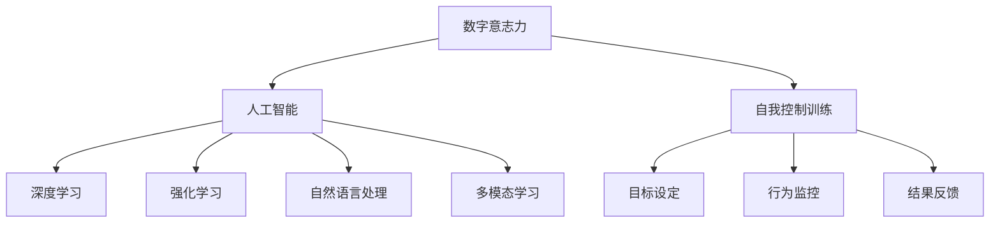

                 

## 1. 背景介绍

### 1.1 问题由来

在数字化时代，人们的生活节奏加快，信息过载，注意力分散等问题日益突出。如何在海量信息中保持专注，提升自我控制力，成为现代社会的一项重要能力。人工智能技术的兴起，为提升数字化时代的自我控制提供了新的可能性。

传统的自我控制训练方法，如冥想、认知行为疗法等，往往效果因人而异，难以量化评估。而借助人工智能，特别是深度学习和自然语言处理技术，我们可以更系统、科学地训练和提升数字化时代的自我控制能力。

### 1.2 问题核心关键点

AI增强的自我控制训练主要聚焦于以下几个关键点：
- **数据驱动**：利用大数据和AI技术，分析用户行为模式，提供个性化的训练方案。
- **智能反馈**：通过AI模型，实时监测用户行为，提供即时反馈和调整策略。
- **自动化训练**：自动化地生成训练任务和目标，减少人工干预。
- **多模态输入**：结合视觉、语音、文本等多种信息源，进行综合训练。
- **动态调整**：根据用户反馈和行为数据，动态调整训练难度和策略。

## 2. 核心概念与联系

### 2.1 核心概念概述

为更好地理解AI增强的自我控制训练方法，本节将介绍几个密切相关的核心概念：

- **数字意志力**：指在数字化环境下，个体通过自我管理和控制，实现目标的能力。
- **人工智能(AI)**：涉及机器学习、深度学习、自然语言处理、计算机视觉等多个领域，用于处理、分析和优化数据。
- **自我控制训练**：通过各种技术和方法，提升个体的自我控制能力，包括目标设定、行为监控、结果反馈等环节。
- **深度学习(DL)**：一类基于神经网络的机器学习方法，通过多层次特征学习，提升模型的泛化能力。
- **强化学习(RL)**：通过与环境交互，不断优化策略，最大化长期奖励的机器学习方法。
- **自然语言处理(NLP)**：涉及文本分析、语义理解、对话系统等技术，用于处理和理解人类语言。
- **多模态学习**：结合多种信息源（如视觉、语音、文本等），进行协同学习和推理，提升模型的性能。

这些核心概念之间的逻辑关系可以通过以下Mermaid流程图来展示：



这个流程图展示了大语言模型的核心概念及其之间的关系：

1. 数字意志力通过人工智能技术实现提升。
2. 人工智能技术包括深度学习、强化学习、自然语言处理和多模态学习。
3. 自我控制训练通过目标设定、行为监控、结果反馈等环节进行。

这些概念共同构成了数字化自我控制训练的框架，使其能够在各种场景下发挥作用。

## 3. 核心算法原理 & 具体操作步骤

### 3.1 算法原理概述

AI增强的自我控制训练，本质上是一个以用户行为数据为输入，通过机器学习模型不断优化训练策略的过程。其核心思想是：利用深度学习等技术，分析用户的数字化行为数据，预测其未来的行为趋势，并根据预测结果调整训练策略，帮助用户提升自我控制能力。

形式化地，假设用户的行为数据集为 $D=\{(x_i,y_i)\}_{i=1}^N$，其中 $x_i$ 为行为特征向量，$y_i$ 为行为结果标签（如是否达到目标）。我们希望找到最优的训练策略 $\pi$，使得模型在给定行为特征 $x$ 下，最大化行为结果的概率 $P(y|x;\pi)$。

AI模型的训练目标是最小化预测结果与真实结果之间的误差，即：

$$
\min_{\pi} \mathcal{L}(\pi) = \frac{1}{N} \sum_{i=1}^N \ell(P(y_i|x_i;\pi),y_i)
$$

其中 $\ell$ 为损失函数，通常采用交叉熵损失。

### 3.2 算法步骤详解

AI增强的自我控制训练一般包括以下几个关键步骤：

**Step 1: 数据准备与预处理**
- 收集用户的行为数据，包括上网时间、应用程序使用、社交媒体互动等。
- 对数据进行清洗和归一化处理，去除异常值，避免过拟合。
- 将数据划分为训练集、验证集和测试集。

**Step 2: 特征工程**
- 选择合适的特征，如每日使用时间、访问频率、情感倾向等。
- 使用降维技术，如PCA，提取重要的特征信息，减少维度。
- 对特征进行编码，如将时间转换为时间戳，进行归一化处理。

**Step 3: 选择模型与训练**
- 选择合适的深度学习模型，如循环神经网络(RNN)、卷积神经网络(CNN)等。
- 设置模型的超参数，如隐藏层数、学习率、批大小等。
- 使用随机梯度下降(SGD)或Adam优化算法，训练模型。

**Step 4: 行为预测与反馈**
- 利用训练好的模型对用户行为进行预测，判断是否达到设定的目标。
- 根据预测结果，及时向用户提供反馈和建议。
- 根据用户反馈调整训练策略，进行动态优化。

**Step 5: 效果评估与优化**
- 在测试集上评估模型的预测准确率，评估其提升效果。
- 根据评估结果，调整训练策略，优化模型。
- 重复上述步骤，直至达到满意的预测效果。

### 3.3 算法优缺点

AI增强的自我控制训练方法具有以下优点：
1. 数据驱动：通过数据分析，提供个性化的训练方案，提升效果。
2. 实时反馈：通过即时反馈，帮助用户及时调整行为，提升自我控制能力。
3. 自动化训练：自动化生成训练任务和目标，减少人工干预。
4. 多模态输入：结合多种信息源，进行综合训练，提升模型的性能。
5. 动态调整：根据用户反馈和行为数据，动态调整训练难度和策略，适应不同用户需求。

同时，该方法也存在一定的局限性：
1. 数据隐私：用户行为数据涉及隐私，数据收集和处理需要严格遵守法律法规。
2. 模型泛化：模型对新场景和新用户的泛化能力有限，需要不断调整和优化。
3. 用户依从性：用户对AI反馈的依从性影响训练效果，需要增强用户接受度和信任感。
4. 模型复杂性：深度学习模型参数多、结构复杂，需要更多的计算资源和专业知识。

尽管存在这些局限性，但就目前而言，AI增强的自我控制训练方法仍然是大规模推广和应用的重要范式。未来相关研究的重点在于如何进一步提高模型的鲁棒性和泛化能力，提升用户对AI的信任和依从性。

### 3.4 算法应用领域

AI增强的自我控制训练方法在多个领域具有广泛的应用前景，例如：

- 健康管理：帮助用户养成良好的健康习惯，如定时运动、规律作息、健康饮食等。
- 学习辅导：通过分析学生的学习行为，提供个性化的学习计划和辅导建议，提高学习效果。
- 财务管理：监控用户的消费行为，提供预算控制和消费建议，帮助用户理财。
- 时间管理：分析用户的工作和娱乐时间分布，提供时间管理建议，提升工作效率和生活质量。
- 心理健康：通过分析用户的社交和心理状态，提供心理支持和干预措施，改善心理健康。

除了上述这些经典应用外，AI增强的自我控制训练方法还可以创新性地应用于更多场景中，如智能家居、智能办公、智能教育等，为数字化生活带来新的突破。

## 4. 数学模型和公式 & 详细讲解  
### 4.1 数学模型构建

本节将使用数学语言对AI增强的自我控制训练过程进行更加严格的刻画。

假设用户的行为数据集为 $D=\{(x_i,y_i)\}_{i=1}^N, x_i \in \mathbb{R}^d, y_i \in \{0,1\}$，其中 $x_i$ 为行为特征向量，$y_i$ 为行为结果标签。

定义模型 $M_{\theta}$ 在输入 $x$ 上的输出为 $y$，其中 $y \in [0,1]$。则模型的训练目标是最小化交叉熵损失，即：

$$
\mathcal{L}(\theta) = -\frac{1}{N}\sum_{i=1}^N [y_i\log \hat{y}_i + (1-y_i)\log (1-\hat{y}_i)]
$$

其中 $\hat{y}_i = M_{\theta}(x_i)$ 为模型的预测结果。

### 4.2 公式推导过程

以下我们以二分类任务为例，推导交叉熵损失函数及其梯度的计算公式。

假设模型 $M_{\theta}$ 在输入 $x$ 上的输出为 $\hat{y}=M_{\theta}(x) \in [0,1]$，表示样本属于正类的概率。真实标签 $y \in \{0,1\}$。则二分类交叉熵损失函数定义为：

$$
\ell(M_{\theta}(x),y) = -[y\log \hat{y} + (1-y)\log (1-\hat{y})]
$$

将其代入经验风险公式，得：

$$
\mathcal{L}(\theta) = -\frac{1}{N}\sum_{i=1}^N [y_i\log M_{\theta}(x_i)+(1-y_i)\log(1-M_{\theta}(x_i))]
$$

根据链式法则，损失函数对参数 $\theta_k$ 的梯度为：

$$
\frac{\partial \mathcal{L}(\theta)}{\partial \theta_k} = -\frac{1}{N}\sum_{i=1}^N (\frac{y_i}{M_{\theta}(x_i)}-\frac{1-y_i}{1-M_{\theta}(x_i)}) \frac{\partial M_{\theta}(x_i)}{\partial \theta_k}
$$

其中 $\frac{\partial M_{\theta}(x_i)}{\partial \theta_k}$ 可进一步递归展开，利用自动微分技术完成计算。

在得到损失函数的梯度后，即可带入参数更新公式，完成模型的迭代优化。重复上述过程直至收敛，最终得到适应数字化自我控制训练的最优模型参数 $\theta^*$。

## 5. 项目实践：代码实例和详细解释说明
### 5.1 开发环境搭建

在进行自我控制训练实践前，我们需要准备好开发环境。以下是使用Python进行TensorFlow开发的环境配置流程：

1. 安装Anaconda：从官网下载并安装Anaconda，用于创建独立的Python环境。

2. 创建并激活虚拟环境：
```bash
conda create -n tf-env python=3.8 
conda activate tf-env
```

3. 安装TensorFlow：根据CUDA版本，从官网获取对应的安装命令。例如：
```bash
conda install tensorflow -c pytorch -c conda-forge
```

4. 安装Keras：
```bash
pip install keras
```

5. 安装TensorBoard：
```bash
pip install tensorboard
```

6. 安装PyTorch：
```bash
pip install torch torchvision torchaudio
```

7. 安装Flask：
```bash
pip install flask
```

完成上述步骤后，即可在`tf-env`环境中开始自我控制训练实践。

### 5.2 源代码详细实现

下面我们以二分类任务为例，给出使用TensorFlow对AI模型进行自我控制训练的代码实现。

首先，定义模型结构：

```python
import tensorflow as tf
from tensorflow.keras.models import Sequential
from tensorflow.keras.layers import Dense

model = Sequential([
    Dense(64, input_shape=(d,), activation='relu'),
    Dense(1, activation='sigmoid')
])
```

然后，定义损失函数和优化器：

```python
from tensorflow.keras.losses import BinaryCrossentropy
from tensorflow.keras.optimizers import Adam

loss_fn = BinaryCrossentropy()
optimizer = Adam(learning_rate=0.001)
```

接着，定义训练和评估函数：

```python
def train_step(model, data, labels):
    with tf.GradientTape() as tape:
        y_pred = model(data)
        loss = loss_fn(y_pred, labels)
    gradients = tape.gradient(loss, model.trainable_variables)
    optimizer.apply_gradients(zip(gradients, model.trainable_variables))
    return loss

def evaluate(model, data, labels):
    y_pred = model(data)
    loss = loss_fn(y_pred, labels)
    return loss
```

最后，启动训练流程并在测试集上评估：

```python
epochs = 100
batch_size = 32

for epoch in range(epochs):
    train_loss = train_step(model, train_data, train_labels)
    dev_loss = evaluate(model, dev_data, dev_labels)
    print(f"Epoch {epoch+1}, train loss: {train_loss:.4f}, dev loss: {dev_loss:.4f}")
    
print("Final model loss:", evaluate(model, test_data, test_labels))
```

以上就是使用TensorFlow对AI模型进行自我控制训练的完整代码实现。可以看到，TensorFlow提供了便捷的API，使得模型的训练和评估变得非常简单。

### 5.3 代码解读与分析

让我们再详细解读一下关键代码的实现细节：

**模型定义**：
- 使用Keras的Sequential模型定义神经网络结构，包含两个全连接层，输出一个sigmoid函数。
- 输入维度为d，表示用户行为特征的维度。

**损失函数和优化器**：
- 使用二分类交叉熵作为损失函数，适用于二分类任务。
- 使用Adam优化器，具有较好的收敛性和训练效果。

**训练和评估函数**：
- `train_step`函数：对输入数据进行前向传播，计算损失，反向传播计算梯度，并使用Adam优化器更新模型参数。
- `evaluate`函数：对输入数据进行前向传播，计算损失，用于评估模型性能。

**训练流程**：
- 定义总训练轮数和批大小。
- 在每个epoch中，先计算训练集上的损失，并在验证集上进行评估。
- 打印每个epoch的训练和验证损失，以监控训练过程。
- 最后，在测试集上评估最终模型的性能。

可以看到，TensorFlow提供了丰富的API，使得模型训练和评估变得非常简单。开发者可以专注于模型结构和训练策略的优化，而不必过多关注底层实现细节。

当然，工业级的系统实现还需考虑更多因素，如模型的保存和部署、超参数的自动搜索、更灵活的任务适配层等。但核心的训练范式基本与此类似。

## 6. 实际应用场景
### 6.1 健康管理

基于AI增强的自我控制训练方法，健康管理领域可以进一步提升健康行为的管理效果，帮助用户养成健康的生活习惯。例如，智能手表可以实时监测用户的运动和睡眠数据，AI模型根据这些数据生成个性化的运动建议和睡眠指导，帮助用户改善生活习惯。

在技术实现上，可以通过API接口获取用户的健康数据，利用深度学习模型分析数据，生成个性化的训练方案，并通过移动应用实时推送给用户。用户可以根据训练方案进行调整和反馈，AI模型不断优化训练策略，提升健康管理效果。

### 6.2 学习辅导

学习辅导领域可以利用AI增强的自我控制训练方法，提供个性化的学习计划和辅导建议。例如，智能学习系统可以分析学生的学习行为数据，如课程成绩、作业完成情况、阅读时间等，生成个性化的学习建议，帮助学生提升学习效果。

在技术实现上，可以利用机器学习模型分析学生的行为数据，生成学习计划和辅导建议，并通过移动应用实时推送给学生。学生可以根据建议进行调整和反馈，AI模型不断优化训练策略，提升学习效果。

### 6.3 财务管理

财务管理领域可以利用AI增强的自我控制训练方法，监控用户的消费行为，提供预算控制和消费建议。例如，智能理财应用可以分析用户的消费数据，生成个性化的预算建议，帮助用户管理财务。

在技术实现上，可以利用机器学习模型分析用户的消费数据，生成预算建议和消费建议，并通过移动应用实时推送给用户。用户可以根据建议进行调整和反馈，AI模型不断优化训练策略，提升财务管理效果。

### 6.4 未来应用展望

随着AI增强的自我控制训练方法的不断发展，其在更多领域得到应用，为数字化生活带来新的突破。

在智能家居领域，智能助手可以通过分析用户的居家行为数据，生成个性化的居家建议，提升居家生活质量。

在智能办公领域，AI模型可以分析员工的工作行为数据，生成个性化的工作建议，提升工作效率。

在智能教育领域，AI模型可以分析学生的学习行为数据，生成个性化的学习建议，提升学习效果。

此外，在智能交通、智能医疗、智能娱乐等更多领域，AI增强的自我控制训练方法也将不断涌现，为数字化生活带来新的可能性。

## 7. 工具和资源推荐
### 7.1 学习资源推荐

为了帮助开发者系统掌握AI增强的自我控制训练的理论基础和实践技巧，这里推荐一些优质的学习资源：

1. TensorFlow官方文档：提供了全面的API文档和教程，是上手实践的必备资料。
2. Keras官方文档：提供了丰富的示例和案例，适合初学者入门。
3. Coursera《深度学习专项课程》：斯坦福大学开设的深度学习系列课程，涵盖了深度学习的基本原理和实践技巧。
4. Udacity《深度学习纳米学位》：提供了深度学习的实际应用案例，帮助开发者深入理解。
5. PyTorch官方文档：提供了丰富的API文档和教程，是PyTorch用户的必备资源。
6. 《Deep Learning》书籍：深度学习领域的经典著作，介绍了深度学习的理论基础和实践方法。
7. 《Hands-On Machine Learning with Scikit-Learn, Keras, and TensorFlow》书籍：介绍了机器学习的基本原理和实践技巧，适合初学者入门。

通过对这些资源的学习实践，相信你一定能够快速掌握AI增强的自我控制训练的精髓，并用于解决实际的数字化自我控制问题。

### 7.2 开发工具推荐

高效的开发离不开优秀的工具支持。以下是几款用于AI增强的自我控制训练开发的常用工具：

1. TensorFlow：基于Python的开源深度学习框架，灵活动态的计算图，适合快速迭代研究。
2. Keras：高层次的神经网络API，适合快速搭建和训练模型。
3. PyTorch：灵活的深度学习框架，提供了丰富的API和工具，适合深度学习研究。
4. TensorBoard：TensorFlow配套的可视化工具，实时监测模型训练状态，提供丰富的图表呈现方式。
5. Weights & Biases：模型训练的实验跟踪工具，记录和可视化模型训练过程中的各项指标。
6. Jupyter Notebook：交互式的编程环境，适合快速迭代和实验。
7. Git和GitHub：版本控制工具，方便代码管理和团队协作。

合理利用这些工具，可以显著提升AI增强的自我控制训练的开发效率，加快创新迭代的步伐。

### 7.3 相关论文推荐

AI增强的自我控制训练技术的发展源于学界的持续研究。以下是几篇奠基性的相关论文，推荐阅读：

1. Attention is All You Need（即Transformer原论文）：提出了Transformer结构，开启了深度学习领域的预训练范式。
2. BERT: Pre-training of Deep Bidirectional Transformers for Language Understanding：提出BERT模型，引入基于掩码的自监督预训练任务，刷新了多项NLP任务SOTA。
3. Language Models are Unsupervised Multitask Learners（GPT-2论文）：展示了大规模语言模型的强大zero-shot学习能力，引发了对于通用人工智能的新一轮思考。
4. Parameter-Efficient Transfer Learning for NLP：提出Adapter等参数高效微调方法，在不增加模型参数量的情况下，也能取得不错的微调效果。
5. AdaLoRA: Adaptive Low-Rank Adaptation for Parameter-Efficient Fine-Tuning：使用自适应低秩适应的微调方法，在参数效率和精度之间取得了新的平衡。
6. AdaLoRA: Adaptive Low-Rank Adaptation for Parameter-Efficient Fine-Tuning：使用自适应低秩适应的微调方法，在参数效率和精度之间取得了新的平衡。

这些论文代表了大语言模型微调技术的发展脉络。通过学习这些前沿成果，可以帮助研究者把握学科前进方向，激发更多的创新灵感。

## 8. 总结：未来发展趋势与挑战

### 8.1 总结

本文对AI增强的自我控制训练方法进行了全面系统的介绍。首先阐述了数字化时代提升自我控制能力的重要性，明确了AI增强的自我控制训练在提升数字化意愿力方面的独特价值。其次，从原理到实践，详细讲解了AI增强的自我控制训练的数学原理和关键步骤，给出了AI模型训练的完整代码实例。同时，本文还广泛探讨了AI增强的自我控制训练方法在多个行业领域的应用前景，展示了其巨大的潜力。此外，本文精选了AI增强的自我控制训练技术的各类学习资源，力求为读者提供全方位的技术指引。

通过本文的系统梳理，可以看到，AI增强的自我控制训练技术正在成为数字化时代提升自我控制能力的重要范式，极大地拓展了数字化生活的可能性，为个体和社会带来了新的发展机遇。未来，伴随AI技术的不断进步，AI增强的自我控制训练必将在更多领域得到应用，为数字化生活带来新的变革。

### 8.2 未来发展趋势

展望未来，AI增强的自我控制训练技术将呈现以下几个发展趋势：

1. 多模态融合：结合视觉、语音、文本等多种信息源，进行综合训练，提升模型的性能。
2. 自监督学习：通过无监督学习，最大化利用数据，提高模型的泛化能力。
3. 强化学习：结合强化学习，最大化长期奖励，提升模型的决策能力。
4. 模型压缩：通过模型压缩技术，减少模型参数量，提高推理效率。
5. 可解释性：提高模型的可解释性，增强用户接受度和信任感。
6. 隐私保护：通过差分隐私等技术，保护用户数据隐私。

以上趋势凸显了AI增强的自我控制训练技术的广阔前景。这些方向的探索发展，必将进一步提升AI增强的自我控制训练的效果，为数字化生活带来新的可能性。

### 8.3 面临的挑战

尽管AI增强的自我控制训练技术已经取得了瞩目成就，但在迈向更加智能化、普适化应用的过程中，它仍面临着诸多挑战：

1. 数据隐私：用户行为数据涉及隐私，数据收集和处理需要严格遵守法律法规。
2. 模型泛化：模型对新场景和新用户的泛化能力有限，需要不断调整和优化。
3. 用户依从性：用户对AI反馈的依从性影响训练效果，需要增强用户接受度和信任感。
4. 模型复杂性：深度学习模型参数多、结构复杂，需要更多的计算资源和专业知识。
5. 伦理和安全性：AI增强的自我控制训练需要考虑伦理和安全问题，避免模型偏见和有害输出。

尽管存在这些挑战，但就目前而言，AI增强的自我控制训练方法仍然是大规模推广和应用的重要范式。未来相关研究的重点在于如何进一步提高模型的鲁棒性和泛化能力，提升用户对AI的信任和依从性，同时保障伦理和安全性。

### 8.4 研究展望

面对AI增强的自我控制训练所面临的种种挑战，未来的研究需要在以下几个方面寻求新的突破：

1. 探索无监督和半监督训练方法：摆脱对大规模标注数据的依赖，利用自监督学习、主动学习等无监督和半监督范式，最大化利用非结构化数据，实现更加灵活高效的训练。
2. 研究参数高效和计算高效的训练范式：开发更加参数高效的训练方法，在固定大部分预训练参数的同时，只更新极少量的任务相关参数。同时优化训练模型的计算图，减少前向传播和反向传播的资源消耗，实现更加轻量级、实时性的部署。
3. 引入因果推断和对比学习：通过引入因果推断和对比学习思想，增强模型建立稳定因果关系的能力，学习更加普适、鲁棒的语言表征，从而提升模型的泛化性和抗干扰能力。
4. 融合多模态信息：结合视觉、语音、文本等多种信息源，进行协同学习和推理，提升模型的性能。
5. 纳入伦理道德约束：在模型训练目标中引入伦理导向的评估指标，过滤和惩罚有偏见、有害的输出倾向，保障输出的安全性。

这些研究方向的探索，必将引领AI增强的自我控制训练技术迈向更高的台阶，为构建安全、可靠、可解释、可控的智能系统铺平道路。面向未来，AI增强的自我控制训练技术还需要与其他AI技术进行更深入的融合，如知识表示、因果推理、强化学习等，多路径协同发力，共同推动数字化生活的进步。只有勇于创新、敢于突破，才能不断拓展数字化生活的边界，让智能技术更好地造福人类社会。

## 9. 附录：常见问题与解答

**Q1：AI增强的自我控制训练是否适用于所有数字化场景？**

A: AI增强的自我控制训练在大多数数字化场景上都能取得不错的效果，特别是对于数据量较小的任务。但对于一些特定领域的任务，如医学、法律等，仅仅依靠通用语料预训练的模型可能难以很好地适应。此时需要在特定领域语料上进一步预训练，再进行微调，才能获得理想效果。

**Q2：AI增强的自我控制训练方法对计算资源有较高要求吗？**

A: 是的，深度学习模型参数多、结构复杂，对计算资源和存储空间有较高要求。一般需要高性能的GPU/TPU设备，以及相应的软件支持（如TensorFlow、PyTorch等）。但随着硬件技术的发展和优化算法的进步，训练和推理效率正在不断提升，未来的应用前景更加广阔。

**Q3：如何保障AI增强的自我控制训练的伦理和安全性？**

A: 在AI增强的自我控制训练中，保障伦理和安全性至关重要。需要从数据采集、模型训练、应用部署等多个环节进行综合考虑，主要措施包括：
1. 数据隐私保护：通过差分隐私、联邦学习等技术，保护用户数据隐私。
2. 模型透明性：提高模型的可解释性和透明性，确保模型的决策过程可追溯、可解释。
3. 公平性：避免模型偏见和有害输出，通过公平性检测和干预措施，确保模型的公平性。
4. 安全性：对模型进行安全性检测和防护，防止模型被恶意攻击或利用。
5. 伦理约束：在模型训练目标中引入伦理导向的评估指标，确保模型的输出符合社会价值观和伦理道德。

这些措施需要在模型设计和训练过程中进行综合考虑，确保AI增强的自我控制训练能够安全、可靠、公平地应用于实际场景。

