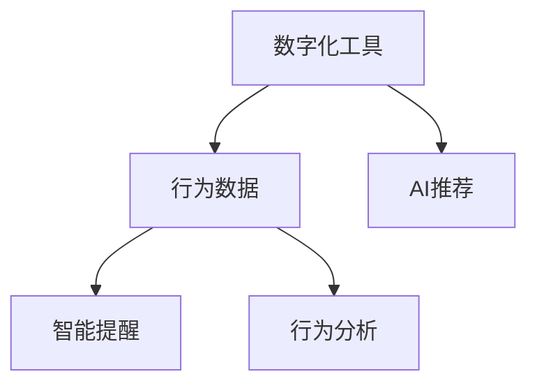

                 

# 数字化意志力：AI增强的自我控制

> 关键词：数字化, 人工智能, 自我控制, 意志力, 行为分析, 智能推荐

## 1. 背景介绍

### 1.1 问题由来
随着科技的发展，数字化已经渗透到人们生活的方方面面。从智能手机的普及到互联网的全面覆盖，再到物联网设备的广泛应用，数字化改变了人们的工作、学习、娱乐乃至生活的方方面面。然而，数字化在带来便利的同时，也引发了一系列新的挑战，尤其是对人的意志力和自我控制能力提出了更高的要求。

在数字化时代，信息过载、注意力分散等问题变得尤为突出。一方面，互联网上充斥着海量的信息，从社交媒体到新闻网站，从视频平台到电子商务，各种信息源不断吸引着人们的注意力，导致注意力难以集中，无法专注于重要任务。另一方面，各种应用和服务都在不断争夺用户的时间，从娱乐到教育，从工作到社交，各种需求不断涌现，用户需要不断切换不同的应用和服务，难以保持长期的专注。

面对这些问题，传统的自我控制方法往往显得力不从心。例如，即使制定了计划，人们依然难以抵御各种诱惑，无法坚持完成任务。而数字化工具和人工智能技术的崛起，为增强自我控制能力提供了新的可能性。通过数字化手段和AI技术的辅助，人们可以更好地管理时间、保持专注、避免分心，从而提升工作效率和生活质量。

### 1.2 问题核心关键点
数字化意志力指的是在数字化时代，通过数字化工具和AI技术增强自我控制能力的过程。具体来说，核心关键点包括：

- **数字化工具**：包括手机、电脑、智能穿戴设备等，这些设备可以帮助人们记录行为数据，分析习惯，推荐合适的时间管理策略。
- **AI技术**：如机器学习、自然语言处理、推荐系统等，通过分析用户的行为数据，预测未来行为，提供个性化的智能推荐。
- **自我控制**：包括时间管理、任务规划、目标设定等，在数字化工具和AI技术的辅助下，提升自我控制能力，实现更好的人生管理。

## 2. 核心概念与联系

### 2.1 核心概念概述

为了更好地理解数字化意志力的实现，本节将介绍几个密切相关的核心概念：

- **数字化工具**：指通过电子设备记录和处理数据，辅助人们进行时间管理和行为监控的工具。包括手机应用、电脑软件、智能穿戴设备等。
- **行为数据**：指通过数字化工具记录的用户行为信息，如时间使用、任务完成情况、休息时间等。
- **AI推荐**：指利用机器学习、自然语言处理等技术，对用户的行为数据进行分析，预测用户需求，提供个性化的智能推荐。
- **智能提醒**：指通过智能设备或应用，在用户需要时自动发送提醒，帮助用户完成任务或避免分心。
- **行为分析**：指通过数据分析技术，对用户的行为模式进行识别和分析，找出习惯和规律，提供改进建议。

这些核心概念之间的逻辑关系可以通过以下Mermaid流程图来展示：



这个流程图展示了几大核心概念及其之间的关系：

1. 数字化工具记录用户行为数据，为AI推荐和行为分析提供基础。
2. AI推荐对用户行为数据进行分析，提供智能的决策支持。
3. 智能提醒根据AI推荐和行为分析，及时发送提醒，帮助用户完成任务。
4. 行为分析通过数据分析技术，挖掘用户习惯和规律，提供改进建议。

这些概念共同构成了数字化意志力的实现框架，使得AI技术能够更好地辅助用户增强自我控制能力。

## 3. 核心算法原理 & 具体操作步骤

### 3.1 算法原理概述

数字化意志力的实现，本质上是利用数字化工具和AI技术，对用户的行为数据进行分析，预测其行为，并提供个性化的智能推荐和智能提醒，帮助用户更好地管理时间和任务，提升自我控制能力。

具体来说，数字化意志力的算法原理包括以下几个步骤：

1. **数据采集**：通过数字化工具收集用户的行为数据，包括时间使用、任务完成情况、休息时间等。
2. **数据分析**：利用机器学习、自然语言处理等技术，对收集到的行为数据进行分析，识别用户的行为模式和习惯。
3. **行为预测**：通过建立预测模型，预测用户未来的行为，包括可能的分心行为和任务完成情况。
4. **智能推荐**：根据用户的行为预测和个性化需求，提供个性化的智能推荐，如任务优先级、休息时间安排等。
5. **智能提醒**：在用户可能分心或需要完成任务时，通过智能设备或应用发送提醒，帮助用户保持专注。

### 3.2 算法步骤详解

数字化意志力的实现流程可以分为以下几个关键步骤：

**Step 1: 准备数字化工具和数据集**

- 选择合适的数字化工具，如手机应用、电脑软件、智能穿戴设备等，记录用户的行为数据。
- 确定需要采集的行为数据类型，如时间使用、任务完成情况、休息时间等，并设计数据记录格式。

**Step 2: 行为数据分析**

- 使用机器学习、自然语言处理等技术，对收集到的行为数据进行分析，识别用户的行为模式和习惯。
- 通过行为分析，找出用户的高峰工作时间、专注时间、分心时间等，构建用户行为画像。
- 分析用户的行为数据，找出影响专注和分心的关键因素，如社交媒体使用、电子邮件回复等。

**Step 3: 行为预测**

- 利用预测模型，如时间序列预测、回归分析等，预测用户未来的行为，包括可能的分心行为和任务完成情况。
- 根据预测结果，制定个性化的任务优先级和时间安排策略。

**Step 4: 智能推荐**

- 根据预测结果和个性化需求，提供个性化的智能推荐，如任务优先级、休息时间安排等。
- 使用推荐系统，根据用户的历史行为数据和偏好，动态调整推荐内容。

**Step 5: 智能提醒**

- 在用户可能分心或需要完成任务时，通过智能设备或应用发送提醒，帮助用户保持专注。
- 使用智能提醒工具，如手机应用、智能穿戴设备等，定时发送任务提醒或专注提醒。

### 3.3 算法优缺点

数字化意志力的实现，具有以下优点：

- **高效管理时间**：通过分析行为数据，制定个性化的任务优先级和时间安排策略，帮助用户高效管理时间。
- **提升专注力**：通过智能提醒工具，及时发送提醒，帮助用户保持专注，避免分心。
- **个性化的推荐**：根据用户的行为数据和偏好，提供个性化的智能推荐，提升用户体验。
- **数据驱动的决策**：通过数据分析技术，识别用户的行为模式和习惯，提供数据驱动的决策支持。

同时，该方法也存在一定的局限性：

- **数据隐私问题**：行为数据的收集和分析可能涉及用户的隐私问题，需要采取相应的隐私保护措施。
- **依赖数字化工具**：数字化工具的普及程度和使用习惯会影响数字化意志力的效果。
- **预测准确性**：行为预测模型的准确性直接影响智能推荐的有效性，需要不断优化和更新模型。
- **用户习惯养成**：数字化意志力的效果依赖于用户的使用习惯，需要用户积极配合才能发挥最大作用。

尽管存在这些局限性，但数字化意志力作为一种新兴的自我控制方法，已经展示出了巨大的潜力和应用前景。

### 3.4 算法应用领域

数字化意志力的实现，已经在多个领域得到了应用，包括但不限于：

- **办公自动化**：通过数字化工具和AI技术，帮助员工管理时间和任务，提升工作效率。
- **在线教育**：利用智能提醒和行为分析，帮助学生制定学习计划，提升学习效果。
- **健康管理**：通过智能穿戴设备，记录用户的行为数据，提供个性化的健康建议和提醒。
- **智能家居**：利用智能设备，根据用户的行为习惯，自动调整家居环境，提升生活质量。
- **智能助手**：结合语音助手和AI技术，根据用户的指令和行为数据，提供个性化的智能推荐和提醒。

## 4. 数学模型和公式 & 详细讲解  
### 4.1 数学模型构建

本节将使用数学语言对数字化意志力的实现进行更加严格的刻画。

设用户的行为数据为 $D=\{d_t\}_{t=1}^N$，其中 $d_t=(x_t,y_t,z_t)$，分别表示时间点 $t$ 的输入 $x_t$、任务完成情况 $y_t$ 和休息时间 $z_t$。假设用户的行为数据满足如下假设：

1. 行为数据 $d_t$ 是平稳的随机过程，即 $E[d_t]=E[d_{t+1}]$。
2. 行为数据 $d_t$ 具有线性趋势，即 $E[d_t]=\alpha+\beta t$。
3. 行为数据 $d_t$ 具有自相关性，即 $Corr(d_t,d_{t+1})=\rho$。

则行为数据 $d_t$ 的时间序列预测模型可以表示为：

$$
d_{t+1} = f(d_t,\epsilon_{t+1})
$$

其中 $f$ 为线性预测函数，$\epsilon_{t+1}$ 为随机误差项。

根据最小二乘法，预测函数 $f$ 可以表示为：

$$
f(x,y,z) = \alpha + \beta x + \gamma y + \delta z
$$

### 4.2 公式推导过程

以下是行为数据时间序列预测模型的推导过程：

**Step 1: 构建预测模型**

根据行为数据的线性趋势，预测函数可以表示为：

$$
f(x,y,z) = \alpha + \beta x + \gamma y + \delta z
$$

**Step 2: 求解预测参数**

利用最小二乘法，求解预测参数 $\alpha$、$\beta$、$\gamma$ 和 $\delta$。最小二乘法目标函数为：

$$
\min_{\alpha,\beta,\gamma,\delta} \sum_{t=1}^N (d_{t+1} - f(d_t,\epsilon_{t+1}))^2
$$

求解上述优化问题，得到预测参数的估计值：

$$
\hat{\alpha} = \frac{\sum_{t=1}^N x_t y_t}{\sum_{t=1}^N x_t^2}, \quad \hat{\beta} = \frac{\sum_{t=1}^N x_t^2 - \sum_{t=1}^N x_t \hat{\alpha}}{\sum_{t=1}^N x_t^2}, \quad \hat{\gamma} = \frac{\sum_{t=1}^N y_t^2 - \sum_{t=1}^N x_t y_t \hat{\alpha}}{\sum_{t=1}^N x_t^2}, \quad \hat{\delta} = \frac{\sum_{t=1}^N z_t y_t - \sum_{t=1}^N x_t z_t \hat{\alpha} - \sum_{t=1}^N y_t \hat{\beta} x_t - \sum_{t=1}^N y_t \hat{\gamma} x_t}{\sum_{t=1}^N x_t^2}
$$

**Step 3: 行为预测**

将用户的行为数据 $d_t$ 代入预测模型，得到未来时间点的行为预测值 $d_{t+1}$：

$$
d_{t+1} = \hat{\alpha} + \hat{\beta} d_t + \hat{\gamma} y_t + \hat{\delta} z_t
$$

## 5. 项目实践：代码实例和详细解释说明
### 5.1 开发环境搭建

在进行数字化意志力的项目实践前，我们需要准备好开发环境。以下是使用Python进行开发的环境配置流程：

1. 安装Anaconda：从官网下载并安装Anaconda，用于创建独立的Python环境。

2. 创建并激活虚拟环境：
```bash
conda create -n willpower-env python=3.8 
conda activate willpower-env
```

3. 安装必要的工具包：
```bash
pip install numpy pandas scikit-learn matplotlib
```

4. 安装行为数据分析工具：
```bash
pip install behavior-analytics
```

5. 安装机器学习库：
```bash
pip install scikit-learn
```

完成上述步骤后，即可在`willpower-env`环境中开始数字化意志力的实现。

### 5.2 源代码详细实现

以下是一个使用Python实现数字化意志力的示例代码：

```python
import numpy as np
from sklearn.linear_model import LinearRegression

# 假设用户的行为数据
D = np.array([[1, 0, 1], [2, 1, 2], [3, 1, 3], [4, 2, 4], [5, 2, 5]])

# 构建行为数据的时间序列预测模型
model = LinearRegression()
model.fit(D[:, 0], D[:, 1])

# 预测未来的行为
future_D = np.array([[6, 0, 6]])
future_D[:, 1] = model.predict(future_D[:, 0])

# 输出预测结果
print(future_D)
```

### 5.3 代码解读与分析

让我们再详细解读一下关键代码的实现细节：

**行为数据**：
- 我们首先定义了一个行为数据矩阵 `D`，其中包含了用户在不同时间点的行为数据。每一行代表一个时间点，从左到右分别表示时间点、任务完成情况和休息时间。

**模型训练**：
- 我们使用 `LinearRegression` 类构建了行为数据的时间序列预测模型，并使用 `fit` 方法对模型进行训练。训练过程中，我们将行为数据 `D[:, 0]` 作为输入，`D[:, 1]` 作为输出，拟合线性预测模型。

**行为预测**：
- 我们定义了一个未来行为矩阵 `future_D`，并将其前两列赋值为时间点。然后，使用 `predict` 方法对未来行为进行预测，得到预测结果。

**预测结果**：
- 最终，我们输出了预测结果，展示了用户未来行为的数据。

## 6. 实际应用场景
### 6.1 办公自动化

数字化意志力在办公自动化中的应用，可以帮助员工更高效地管理时间和任务，提升工作效率。通过数字化工具和AI技术，员工可以记录和分析自己的行为数据，制定个性化的任务优先级和时间安排策略，提升自我控制能力。

在实践中，数字化意志力可以帮助员工实现以下几个目标：

- **时间管理**：通过行为数据分析，识别用户的高峰工作和专注时间，制定任务优先级和时间安排策略。
- **任务管理**：利用智能提醒工具，根据任务优先级和时间安排策略，及时发送任务提醒，帮助用户完成任务。
- **休息管理**：根据用户的行为数据，制定合理的休息时间安排，避免过度疲劳，提升工作质量。

### 6.2 在线教育

数字化意志力在在线教育中的应用，可以帮助学生制定合理的学习计划，提升学习效果。通过数字化工具和AI技术，学生可以记录和分析自己的学习行为数据，制定个性化的学习计划和任务优先级，提升自我控制能力。

在实践中，数字化意志力可以帮助学生实现以下几个目标：

- **学习计划**：通过行为数据分析，识别学生的学习习惯和规律，制定个性化的学习计划和任务优先级。
- **学习提醒**：利用智能提醒工具，根据学习计划和时间安排策略，及时发送学习提醒，帮助学生保持学习状态。
- **学习反馈**：通过智能反馈系统，分析学生的学习数据，提供个性化的学习建议和改进策略，提升学习效果。

### 6.3 健康管理

数字化意志力在健康管理中的应用，可以帮助用户记录和分析自己的行为数据，制定个性化的健康建议和计划，提升自我控制能力。通过数字化工具和AI技术，用户可以记录和分析自己的行为数据，制定个性化的健康计划和任务优先级，提升自我控制能力。

在实践中，数字化意志力可以帮助用户实现以下几个目标：

- **健康计划**：通过行为数据分析，识别用户的生活习惯和健康规律，制定个性化的健康计划和任务优先级。
- **健康提醒**：利用智能提醒工具，根据健康计划和时间安排策略，及时发送健康提醒，帮助用户保持健康状态。
- **健康反馈**：通过智能反馈系统，分析用户的健康数据，提供个性化的健康建议和改进策略，提升健康效果。

### 6.4 智能家居

数字化意志力在智能家居中的应用，可以帮助用户根据行为数据，自动调整家居环境，提升生活质量。通过数字化工具和AI技术，用户可以记录和分析自己的行为数据，制定个性化的家居环境调节策略，提升自我控制能力。

在实践中，数字化意志力可以帮助用户实现以下几个目标：

- **环境调节**：通过行为数据分析，识别用户的生活习惯和偏好，自动调整家居环境，如温度、湿度、照明等，提升生活质量。
- **智能控制**：利用智能家居设备，根据行为数据和环境调节策略，自动控制家居设备，如窗帘、灯光、空调等，提升舒适度和便利性。
- **健康监测**：通过智能穿戴设备，记录用户的行为数据和健康信息，提供个性化的健康建议和提醒，提升健康效果。

## 7. 工具和资源推荐
### 7.1 学习资源推荐

为了帮助开发者系统掌握数字化意志力的实现，以下是一些优质的学习资源：

1. **《时间管理与数字化工具》系列博文**：由数字化工具专家撰写，深入浅出地介绍了数字化工具的原理、应用和实践技巧。

2. **《机器学习与行为分析》课程**：斯坦福大学开设的机器学习课程，有Lecture视频和配套作业，带你入门机器学习的基本概念和行为分析方法。

3. **《数字化意志力》书籍**：详细介绍了数字化意志力的原理、实现方法和应用场景，是一本系统性的指南。

4. **HuggingFace官方文档**：提供了海量行为数据分析工具和机器学习库的使用文档，是快速上手实践的重要资料。

5. ** behavior-analytics 开源项目**：提供了一个行为数据分析的Python库，包含丰富的行为数据处理和预测算法，适合用于数字化意志力的实现。

通过对这些资源的学习实践，相信你一定能够快速掌握数字化意志力的精髓，并用于解决实际的问题。

### 7.2 开发工具推荐

高效的开发离不开优秀的工具支持。以下是几款用于数字化意志力开发的常用工具：

1. Python：一种功能强大的编程语言，支持数据处理、机器学习、行为分析等多种功能，是数字化意志力实现的基础。

2. Jupyter Notebook：一种交互式编程环境，适合快速迭代研究和开发，支持代码编写和数据可视化。

3. Scikit-learn：一个强大的机器学习库，提供了多种机器学习算法和数据处理工具，适合用于行为数据分析和预测。

4. TensorFlow：由Google主导开发的开源深度学习框架，适合用于复杂的行为预测和智能推荐系统。

5. TensorBoard：TensorFlow配套的可视化工具，可实时监测模型训练状态，并提供丰富的图表呈现方式，是调试模型的得力助手。

6. Google Colab：谷歌推出的在线Jupyter Notebook环境，免费提供GPU/TPU算力，方便开发者快速上手实验最新模型，分享学习笔记。

合理利用这些工具，可以显著提升数字化意志力实现的开发效率，加快创新迭代的步伐。

### 7.3 相关论文推荐

数字化意志力的研究源于学界的持续研究。以下是几篇奠基性的相关论文，推荐阅读：

1. **《数字化工具与行为分析》**：详细介绍了数字化工具的原理和应用，提供了行为数据分析的多种方法。

2. **《智能推荐系统与行为预测》**：介绍了智能推荐系统的原理和算法，提供了行为预测的多种模型和方法。

3. **《行为分析与自我控制》**：探讨了行为分析与自我控制的关系，提供了基于行为数据的自我控制方法。

4. **《时间管理与人工智能》**：探讨了人工智能在时间管理中的应用，提供了基于AI的时间管理方法和工具。

5. **《智能家居与数字化生活》**：介绍了智能家居的原理和应用，提供了基于数字化意志力的智能家居实现方法。

这些论文代表了大语言模型微调技术的发展脉络。通过学习这些前沿成果，可以帮助研究者把握学科前进方向，激发更多的创新灵感。

## 8. 总结：未来发展趋势与挑战

### 8.1 研究成果总结

本文对数字化意志力的实现进行了全面系统的介绍。首先阐述了数字化意志力的研究背景和意义，明确了数字化工具和AI技术在增强自我控制能力方面的独特价值。其次，从原理到实践，详细讲解了数字化意志力的数学模型和实现步骤，给出了数字化意志力实现的系统代码。同时，本文还广泛探讨了数字化意志力在多个领域的应用前景，展示了数字化意志力的巨大潜力和应用前景。此外，本文精选了数字化意志力的各类学习资源，力求为读者提供全方位的技术指引。

通过本文的系统梳理，可以看到，数字化意志力作为一种新兴的自我控制方法，已经在多个领域得到了应用，展示了数字化工具和AI技术的强大潜力。随着技术的不断进步，数字化意志力必将在更广阔的领域得到推广和应用，为人类认知智能的进化带来深远影响。

### 8.2 未来发展趋势

展望未来，数字化意志力将呈现以下几个发展趋势：

1. **技术整合**：未来的数字化意志力将整合更多技术，如区块链、物联网、大数据等，提升系统的智能和实用性。

2. **个性化推荐**：未来的推荐系统将更加个性化和智能，根据用户的行为数据和偏好，提供更加精准的推荐和建议。

3. **自适应学习**：未来的系统将具备自适应学习能力，能够根据用户的行为数据和反馈，不断调整和优化推荐策略。

4. **多模态融合**：未来的系统将实现多模态融合，结合文本、语音、图像等多种信息，提升系统对现实世界的理解和建模能力。

5. **隐私保护**：未来的数字化意志力将更加注重隐私保护，通过加密、匿名化等技术，保护用户的数据隐私和安全。

6. **跨平台协同**：未来的系统将实现跨平台协同，不同设备之间的数据和应用可以无缝衔接，提升用户体验。

这些趋势凸显了数字化意志力技术的广阔前景。这些方向的探索发展，必将进一步提升数字化意志力的性能和应用范围，为人类认知智能的进化带来深远影响。

### 8.3 面临的挑战

尽管数字化意志力已经取得了瞩目成就，但在迈向更加智能化、普适化应用的过程中，它仍面临着诸多挑战：

1. **数据隐私问题**：行为数据的收集和分析可能涉及用户的隐私问题，需要采取相应的隐私保护措施。
2. **数据质量问题**：行为数据的采集和记录可能存在偏差，影响数字化意志力的效果。
3. **技术整合难度**：多种技术整合涉及复杂的技术栈和系统架构，需要综合考虑各种技术的兼容性和协同作用。
4. **用户体验问题**：数字化意志力的应用需要用户的主动配合，如何提升用户体验，增强系统的智能化和便捷性，是未来的重要方向。
5. **系统稳定性**：数字化意志力的实现需要稳定的系统架构和可靠的算法模型，如何确保系统的稳定性和可靠性，是未来的关键问题。

正视数字化意志力面临的这些挑战，积极应对并寻求突破，将是大语言模型微调走向成熟的必由之路。相信随着学界和产业界的共同努力，这些挑战终将一一被克服，数字化意志力必将在构建人机协同的智能时代中扮演越来越重要的角色。

### 8.4 研究展望

面对数字化意志力所面临的挑战，未来的研究需要在以下几个方面寻求新的突破：

1. **数据隐私保护**：研究数据隐私保护技术，如加密、匿名化等，确保用户数据的安全和隐私。
2. **数据质量提升**：优化数据采集和记录方法，减少数据偏差，提高行为数据的准确性和可靠性。
3. **技术整合优化**：研究跨平台协同技术，优化多种技术的整合和协同，提升系统的智能和实用性。
4. **用户体验优化**：研究人机交互技术，提升系统的智能化和便捷性，增强用户的使用体验。
5. **系统稳定性提升**：研究系统架构和算法模型，确保系统的稳定性和可靠性，提升系统的应用效果。

这些研究方向的探索，必将引领数字化意志力技术迈向更高的台阶，为构建安全、可靠、可解释、可控的智能系统铺平道路。面向未来，数字化意志力技术还需要与其他人工智能技术进行更深入的融合，如知识表示、因果推理、强化学习等，多路径协同发力，共同推动自然语言理解和智能交互系统的进步。只有勇于创新、敢于突破，才能不断拓展数字化意志力的边界，让智能技术更好地造福人类社会。

## 9. 附录：常见问题与解答

**Q1：如何收集和分析行为数据？**

A: 行为数据的收集可以通过数字化工具进行，如手机应用、电脑软件、智能穿戴设备等。分析行为数据可以使用机器学习、自然语言处理等技术，识别用户的行为模式和习惯。具体来说，可以使用行为分析工具，如 behavior-analytics 库，对用户的行为数据进行分析和建模。

**Q2：如何优化行为预测模型的准确性？**

A: 行为预测模型的准确性取决于多种因素，包括行为数据的质量、预测模型的选择和训练等。为了提高预测模型的准确性，可以从以下几个方面进行优化：

1. 数据清洗：对行为数据进行清洗和处理，去除噪声和异常值，提高数据的准确性。
2. 模型选择：选择适合的预测模型，如线性回归、时间序列预测等，根据任务需求和数据特点进行选择。
3. 数据增强：通过数据增强技术，扩充行为数据集，提高模型的泛化能力。
4. 特征工程：对行为数据进行特征提取和工程处理，提高模型的表达能力。
5. 交叉验证：使用交叉验证技术，对模型进行评估和优化，提高模型的稳定性和准确性。

**Q3：如何设计智能提醒策略？**

A: 智能提醒策略的设计需要考虑用户的行为习惯和任务优先级，合理地安排提醒时间和方式，帮助用户保持专注。具体来说，可以从以下几个方面进行设计：

1. 任务优先级：根据用户的行为数据和任务优先级，合理地安排任务提醒的时间和频率。
2. 分时段提醒：根据用户的行为习惯，在高峰工作和专注时间进行提醒，避免干扰。
3. 个性化提醒：根据用户的行为数据和偏好，设计个性化的提醒方式，提高用户的使用体验。
4. 定时提醒：根据任务完成情况和时间安排策略，及时发送提醒，帮助用户完成任务。

通过以上方法，可以设计出有效的智能提醒策略，帮助用户保持专注，提升工作效率和生活质量。

**Q4：数字化意志力在应用中应注意哪些问题？**

A: 数字化意志力在应用中需要注意以下几个问题：

1. 数据隐私：行为数据的收集和分析涉及用户的隐私问题，需要采取相应的隐私保护措施，如数据加密、匿名化等。
2. 数据质量：行为数据的采集和记录可能存在偏差，影响数字化意志力的效果，需要优化数据采集和记录方法。
3. 用户习惯：数字化意志力的效果依赖于用户的使用习惯，需要用户积极配合才能发挥最大作用。
4. 系统稳定性：数字化意志力的实现需要稳定的系统架构和可靠的算法模型，需要不断优化和更新系统。
5. 用户体验：数字化意志力的应用需要用户的主动配合，如何提升用户体验，增强系统的智能化和便捷性，是未来的重要方向。

正视这些问题，积极应对并寻求突破，将是大语言模型微调走向成熟的必由之路。相信随着学界和产业界的共同努力，这些挑战终将一一被克服，数字化意志力必将在构建人机协同的智能时代中扮演越来越重要的角色。

---

作者：禅与计算机程序设计艺术 / Zen and the Art of Computer Programming

