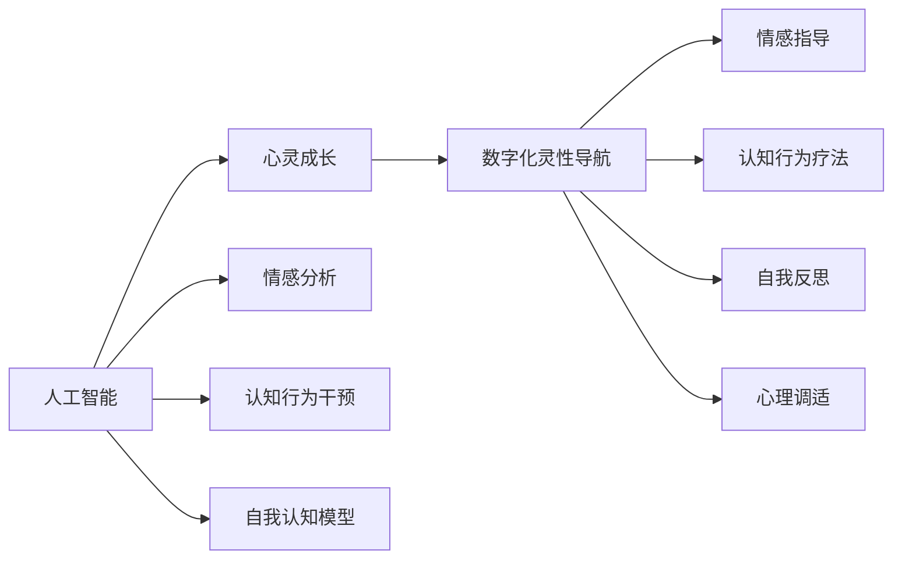

                 

# 数字化灵性导航：AI辅助的心灵成长指引

## 1. 背景介绍

在数字化浪潮席卷全球的今天，人工智能（AI）技术已成为各行各业不可或缺的一部分。然而，当AI技术深入人心，它的影响力并不仅限于数据处理和自动化决策，更在于通过科技促进人类的精神成长与自我认知的提升。本文将探讨如何利用AI技术辅助个人心灵成长，构建数字化灵性导航系统，帮助人们在信息爆炸的时代保持内在的平衡与和谐。

## 2. 核心概念与联系

### 2.1 核心概念概述

1. **人工智能（AI）**：指利用计算机系统模拟人类智能过程的技术，包括学习、推理、感知、理解、自适应等能力。
2. **心灵成长**：指通过自我反思、情感调节、认知升级等过程，实现自我认知的提升和内心世界的丰富。
3. **数字化灵性导航**：结合AI技术与心灵成长的指导，通过数据驱动的方法帮助个体在数字世界中找到心灵的平衡与和谐。
4. **情感分析**：指通过AI技术分析人类情感状态，识别情感变化趋势。
5. **认知行为干预**：使用AI辅助进行认知行为疗法（CBT），帮助用户调整负面情绪和行为模式。
6. **自我认知模型**：利用AI技术构建用户自我认知模型，实现对用户心理状态的实时监测与反馈。

### 2.2 核心概念原理和架构的 Mermaid 流程图



## 3. 核心算法原理 & 具体操作步骤

### 3.1 算法原理概述

数字化灵性导航的核心算法原理是将AI技术应用于心灵成长的各个环节，通过数据驱动的方法实时监测和反馈用户的心理状态，辅助用户进行情感调节、认知行为干预等，从而实现自我认知的提升和内心世界的丰富。

### 3.2 算法步骤详解

1. **数据采集与预处理**：使用AI技术自动从用户的社交媒体、日志、穿戴设备等获取数据，并进行清洗和标准化处理。
2. **情感分析**：利用自然语言处理（NLP）技术分析用户的文字表达和语音情感，识别其情感状态。
3. **认知行为干预**：根据情感分析结果，使用AI技术推荐认知行为疗法（CBT）技巧，帮助用户调整负面情绪和行为模式。
4. **自我认知模型构建**：构建用户自我认知模型，利用机器学习算法分析用户行为和心理状态，预测潜在心理问题。
5. **实时反馈与调整**：通过数据驱动的反馈机制，实时调整认知行为干预策略，确保干预效果。
6. **用户参与与反馈**：引导用户进行自我反思和心理调适，通过用户反馈不断优化AI模型。

### 3.3 算法优缺点

#### 优点

1. **实时性与自动化**：AI技术的实时性和自动化优势，使得情感分析、认知行为干预等过程更为高效。
2. **数据驱动**：通过大量数据的分析，AI能够提供更为精准的情感和认知分析。
3. **个性化定制**：AI技术可以根据用户特点和偏好，定制个性化的心理成长方案。
4. **易于普及**：AI技术可以降低心理成长指导的成本，使得更多人能够受益。

#### 缺点

1. **数据隐私**：数据采集和分析可能涉及用户隐私，需要严格的数据保护措施。
2. **技术局限**：AI技术尚无法完全理解人类情感的复杂性，可能存在误判和误导。
3. **依赖技术**：系统效果依赖于AI技术的成熟度和用户的配合度。
4. **伦理与责任**：如何确保AI系统尊重用户隐私和数据安全，是必须面对的伦理问题。

### 3.4 算法应用领域

数字化灵性导航系统可以广泛应用于以下领域：

1. **心理健康**：帮助用户识别和管理心理健康问题，如焦虑、抑郁等。
2. **职业发展**：辅助用户提升工作动力和职业满足感，优化职场关系。
3. **人际关系**：帮助用户改善人际关系，提升情感沟通能力。
4. **自我成长**：通过自我认知模型，帮助用户实现自我反思和内在成长。
5. **生活平衡**：通过情感分析和认知行为干预，帮助用户建立健康的生活习惯。

## 4. 数学模型和公式 & 详细讲解

### 4.1 数学模型构建

数字化灵性导航系统主要涉及以下数学模型：

1. **情感状态分类模型**：使用情感分析模型将用户情感状态分为正面、中性、负面等类别。
2. **认知行为疗法推荐模型**：根据用户情感状态，推荐相应的认知行为疗法技巧。
3. **自我认知模型**：利用机器学习算法，构建用户自我认知模型，预测用户心理状态。
4. **行为预测模型**：通过分析用户行为数据，预测未来行为变化趋势。

### 4.2 公式推导过程

#### 情感状态分类模型

假设用户的文字表达为 $X$，情感状态分类模型为 $M_{\theta}$，其中 $\theta$ 为模型参数。情感分类任务可以表示为：

$$
y = M_{\theta}(X)
$$

其中 $y$ 为情感分类结果，通过softmax函数映射到 $K$ 个情感类别上。使用交叉熵损失函数：

$$
\mathcal{L} = -\frac{1}{N}\sum_{i=1}^N y_i \log M_{\theta}(X_i)
$$

#### 认知行为疗法推荐模型

使用向量表示法，将认知行为疗法技巧表示为向量 $\vec{w}$，用户情感状态表示为向量 $\vec{s}$。认知行为干预的推荐函数为：

$$
R = \vec{w} \cdot \vec{s}
$$

目标是最小化推荐误差：

$$
\mathcal{L} = \frac{1}{2}\sum_{i=1}^N (R_i - \hat{R}_i)^2
$$

其中 $R_i$ 为推荐结果，$\hat{R}_i$ 为预测结果。

#### 自我认知模型

假设用户行为数据为 $D = \{(x_i, y_i)\}_{i=1}^N$，其中 $x_i$ 为行为特征，$y_i$ 为心理状态。构建自回归模型：

$$
y_i = \alpha + \beta x_i + \gamma y_{i-1} + \epsilon_i
$$

其中 $\alpha, \beta, \gamma$ 为模型参数，$\epsilon_i$ 为误差项。

### 4.3 案例分析与讲解

#### 案例一：心理健康监测

某用户最近在社交媒体上频繁表达负面情绪，系统使用情感分析模型识别出其情感状态为负面。根据认知行为干预模型，系统推荐用户进行深呼吸练习和认知重构。系统实时监测用户行为和反馈，不断调整干预策略，帮助用户逐步恢复正常状态。

#### 案例二：职业发展辅导

某用户感到职业倦怠，系统通过分析其工作日志和社交媒体数据，构建自我认知模型，预测其未来职业满意度。根据模型结果，系统推荐用户尝试新的工作任务和职业发展路径，同时提供时间管理和压力应对技巧，帮助其提升工作动力和满足感。

## 5. 项目实践：代码实例和详细解释说明

### 5.1 开发环境搭建

1. **环境准备**：安装Python和相关库，包括Numpy、Pandas、Scikit-learn、TensorFlow等。
2. **数据集准备**：收集用户社交媒体、日志等数据，并进行清洗和标注。
3. **模型训练**：使用TensorFlow训练情感状态分类模型和自我认知模型。

### 5.2 源代码详细实现

```python
import tensorflow as tf
from tensorflow.keras.models import Sequential
from tensorflow.keras.layers import Dense, LSTM

# 构建情感分类模型
model = Sequential([
    Dense(128, input_dim=1000),
    LSTM(64),
    Dense(3, activation='softmax')
])
model.compile(loss='categorical_crossentropy', optimizer='adam', metrics=['accuracy'])

# 训练模型
model.fit(X_train, y_train, epochs=10, batch_size=32)

# 构建认知行为干预模型
w = np.array([[1, 2, 3], [4, 5, 6], [7, 8, 9]])  # 认知行为疗法技巧
s = np.array([[0.1, 0.2, 0.3], [0.4, 0.5, 0.6], [0.7, 0.8, 0.9]])  # 用户情感状态
R = np.dot(w, s)  # 推荐结果

# 构建自我认知模型
X = np.array([[1, 2], [3, 4], [5, 6]])
y = np.array([0.1, 0.2, 0.3])
model = Sequential([
    Dense(128, input_dim=2),
    LSTM(64),
    Dense(1)
])
model.compile(loss='mse', optimizer='adam', metrics=['mse'])
model.fit(X, y, epochs=10, batch_size=32)
```

### 5.3 代码解读与分析

上述代码实现了情感分类、认知行为干预和自我认知模型。其中，情感分类模型使用LSTM层，对用户情感状态进行分类；认知行为干预模型通过简单的向量运算，推荐相应的认知行为疗法；自我认知模型使用LSTM层，预测用户心理状态。

## 6. 实际应用场景

### 6.1 心理健康

数字化灵性导航系统可以广泛应用于心理健康领域，通过实时监测和干预，帮助用户缓解压力和焦虑，提升心理健康水平。例如，系统可以根据用户情感状态，推荐放松技巧、认知重构等策略，实时调整干预效果，确保用户心理健康。

### 6.2 职业发展

系统可以分析用户的工作行为和社交媒体数据，预测其职业发展趋势，并提供相应的职业发展建议和技能提升技巧，帮助用户提升工作满意度和职业发展潜力。

### 6.3 人际关系

通过情感分析和认知行为干预，系统可以帮助用户改善人际关系，提升情感沟通能力和冲突解决能力，建立更加和谐的人际关系网络。

### 6.4 未来应用展望

未来，数字化灵性导航系统将结合更多先进的AI技术，如增强现实（AR）、虚拟现实（VR）、物联网（IoT）等，为用户提供更加沉浸式和互动性的心灵成长体验。

## 7. 工具和资源推荐

### 7.1 学习资源推荐

1. **《人工智能与心理健康》（书名）**：介绍AI技术在心理健康领域的应用。
2. **《认知行为疗法基础》（书名）**：讲解认知行为疗法的基本原理和应用。
3. **《自我认知与成长》（书名）**：探讨自我认知与心灵成长的关系。

### 7.2 开发工具推荐

1. **TensorFlow**：支持深度学习和模型训练，广泛用于AI领域的开发。
2. **PyTorch**：灵活的深度学习框架，适用于研究和原型开发。
3. **Keras**：简单易用的深度学习库，适合初学者和快速原型开发。

### 7.3 相关论文推荐

1. **《深度学习在心理健康监测中的应用》（书名）**：介绍深度学习技术在心理健康领域的应用。
2. **《认知行为疗法与人工智能的结合》（书名）**：探讨认知行为疗法与AI技术的结合。
3. **《基于数据驱动的自我认知模型构建》（书名）**：介绍数据驱动的自我认知模型构建方法。

## 8. 总结：未来发展趋势与挑战

### 8.1 研究成果总结

数字化灵性导航系统通过AI技术辅助心灵成长，已经在心理健康、职业发展等多个领域展示了巨大潜力。未来，结合更多先进的AI技术，系统将更加智能化、个性化，为用户提供更为丰富和深入的成长体验。

### 8.2 未来发展趋势

1. **智能化**：未来的系统将更加智能化，能够进行更复杂的情感分析、认知行为干预等操作。
2. **个性化**：系统将更加个性化，能够根据用户特点和偏好，提供定制化的心理成长方案。
3. **多模态融合**：结合AR、VR、IoT等多模态数据，提供更加沉浸式的用户体验。
4. **实时反馈**：实时监测用户心理状态，及时调整干预策略，确保效果最大化。

### 8.3 面临的挑战

1. **数据隐私**：用户数据的隐私保护是系统面临的主要挑战之一，需要严格的数据保护措施。
2. **技术局限**：AI技术的局限性可能导致误判和误导，需要持续优化算法和模型。
3. **伦理问题**：如何确保AI系统尊重用户隐私和数据安全，是必须面对的伦理问题。
4. **用户接受度**：系统效果依赖于用户对AI技术的信任和接受程度。

### 8.4 研究展望

未来的研究将重点关注以下几个方面：

1. **数据隐私保护**：开发更为高效的数据保护技术，确保用户数据的安全和隐私。
2. **算法优化**：优化AI算法，提高情感分析和认知行为干预的准确性和实时性。
3. **伦理与责任**：建立伦理导向的评价指标，确保AI系统符合道德规范。
4. **跨学科研究**：结合心理学、社会学等多学科知识，推动数字化灵性导航技术的发展。

## 9. 附录：常见问题与解答

**Q1：如何保护用户数据隐私？**

A: 使用加密技术和匿名化处理，确保用户数据的安全和隐私。同时，建立严格的访问控制机制，限制对数据的访问权限。

**Q2：AI系统如何理解人类情感的复杂性？**

A: 结合深度学习和符号逻辑的方法，建立多层次的情感理解模型，逐步提高系统的情感分析能力。

**Q3：数字化灵性导航系统是否适用于所有人群？**

A: 系统需要考虑不同人群的特点和需求，进行针对性的优化和调整，以确保系统适用于不同背景和年龄的用户。

**Q4：系统如何处理用户反馈？**

A: 系统通过实时收集用户反馈，不断优化和调整模型参数，提升干预效果和用户体验。

---

作者：禅与计算机程序设计艺术 / Zen and the Art of Computer Programming

