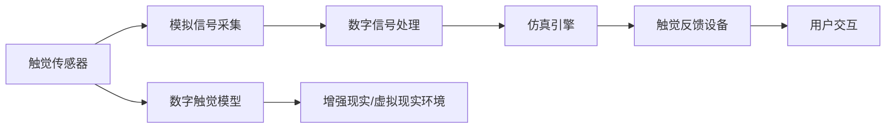

                 

# 数字化触觉记忆创业：感官体验的虚拟重现

## 1. 背景介绍

在数字化转型的浪潮中，人们不仅依赖于视觉和听觉获取信息，触觉作为一种更直接的感官体验，也日益受到重视。触觉反馈在虚拟现实(VR)、增强现实(AR)、游戏、教育等多个领域有重要应用。但现实中，触觉交互设备成本高昂、技术复杂，限制了其在日常生活中的普及。如何利用触觉记忆进行数字化创新，将感官体验虚拟重现，成为了热门话题。

### 1.1 触觉记忆与数字触觉的差异

触觉记忆是基于触觉感官的记忆，能够快速高效地传递复杂信息。例如，通过手指按压屏幕上的凸点或按钮，用户可以立即知晓操作结果。而数字触觉是通过虚拟仿真技术，将触觉反馈以数字形式重现，通过模拟真实触感，使用户能够更自然地与数字设备交互。

### 1.2 触觉交互技术的应用场景

触觉技术已经广泛应用于游戏、虚拟现实、医疗、教育、电商等多个领域。例如：
- **游戏**：通过力反馈控制器、振动器等设备，提升游戏体验的真实感和沉浸感。
- **虚拟现实**：结合触觉反馈，让用户能够通过物理手势与虚拟环境互动。
- **医疗**：触觉反馈可用于康复训练，帮助患者恢复感觉和运动功能。
- **教育**：通过触觉交互设备，提高学生对复杂概念的理解和记忆。
- **电商**：通过触觉屏幕，模拟真实产品的触感，增强用户购买体验。

## 2. 核心概念与联系

### 2.1 核心概念概述

数字化触觉记忆涉及多个关键技术：
- **触觉传感器**：用于感知用户的手指接触压力、温度、湿度等参数，通常由力敏传感器、电容传感器等组成。
- **触觉反馈设备**：将触觉信号转换为模拟触觉反馈，如振动、按压、电流等，常用的设备包括力反馈控制器、触觉屏幕等。
- **仿真引擎**：模拟触觉反馈，如虚拟按钮、表面凹凸等，常见引擎包括Vivid Haptic等。
- **数字触觉模型**：将触觉数据与数字模型结合，重现真实触感，常见的模型有PBMH（压力、形状、硬度）、GRIB（刚度、黏度、损伤）等。

### 2.2 核心概念原理和架构的 Mermaid 流程图



## 3. 核心算法原理 & 具体操作步骤

### 3.1 算法原理概述

数字化触觉记忆创业的核心是构建一个高度逼真的数字触觉模型，将物理触觉信号数字化并映射到数字设备上，实现用户与数字系统的交互。其算法原理可以分为以下几个步骤：

1. **触觉数据采集**：使用触觉传感器采集用户的触觉信号。
2. **数据处理与特征提取**：将触觉信号转换为数字信号，提取关键特征如压力、温度、湿度等。
3. **数字触觉建模**：将提取的特征映射到数字触觉模型中，生成模拟触觉反馈。
4. **仿真与渲染**：在虚拟环境中渲染触觉反馈，实现用户交互。

### 3.2 算法步骤详解

#### 3.2.1 触觉数据采集

触觉传感器采集用户的手指压力、温度、湿度等参数，通常包括：
- **力敏传感器**：用于测量手指施加的力，如FDT660等。
- **电容传感器**：测量手指与传感器之间的电容值，如ACAP等。
- **热敏传感器**：测量手指的温度变化，如K型热电偶等。
- **湿度传感器**：测量手指和传感器接触面的湿度，如HUM-1等。

#### 3.2.2 数据处理与特征提取

将触觉信号转换为数字信号，并提取关键特征。一般流程如下：
1. **信号预处理**：滤波、放大等。
2. **特征提取**：压力、温度、湿度等。
3. **数据归一化**：将不同单位的数据转换为统一量纲。

#### 3.2.3 数字触觉建模

数字触觉建模是构建数字触觉反馈的核心。模型通过将触觉数据映射到数字模型中，生成仿真触感反馈。常用的数字触觉模型包括：
- **PBMH模型**：压力、形状、硬度，用于模拟物体表面硬度。
- **GRIB模型**：刚度、黏度、损伤，用于模拟物体的弹性形变和黏弹性。

#### 3.2.4 仿真与渲染

仿真引擎将数字触觉模型渲染为触觉反馈。常见仿真引擎包括：
- **Vivid Haptic**：支持虚拟按钮、表面凹凸等触觉反馈。
- **Kinect Haptics**：结合VR/AR系统，提供触觉交互。

### 3.3 算法优缺点

数字化触觉记忆的优点包括：
1. **真实感强**：通过仿真引擎，可以实现高度逼真的触感反馈。
2. **跨平台适用**：数字触觉模型可以适配多种平台，如VR、AR、移动设备等。
3. **成本低廉**：相比于物理触觉设备，数字触觉模型所需的硬件成本更低。

但同时也存在以下缺点：
1. **精度有限**：数字触觉反馈的精度受限于仿真引擎和数字模型的质量。
2. **技术复杂**：数字触觉建模和仿真涉及多学科知识，技术难度较高。
3. **用户适应性**：用户需要一定时间适应数字触觉反馈，体验可能不如物理触觉。

### 3.4 算法应用领域

数字化触觉记忆技术广泛应用于以下领域：
- **游戏**：通过力反馈控制器、振动器等设备，提升游戏体验的真实感和沉浸感。
- **虚拟现实**：结合触觉反馈，让用户能够通过物理手势与虚拟环境互动。
- **医疗**：触觉反馈可用于康复训练，帮助患者恢复感觉和运动功能。
- **教育**：通过触觉交互设备，提高学生对复杂概念的理解和记忆。
- **电商**：通过触觉屏幕，模拟真实产品的触感，增强用户购买体验。

## 4. 数学模型和公式 & 详细讲解

### 4.1 数学模型构建

数字化触觉记忆的核心数学模型包括力敏传感模型、电容传感模型、热敏传感模型、湿度传感模型等。

以力敏传感模型为例，其数学模型如下：
$$
F(t) = k_1F_{base} + k_2F(t-1) + k_3F(t-2) + \cdots + k_nF(t-n)
$$
其中，$F(t)$ 为当前传感器力值，$F_{base}$ 为基线力值，$k_i$ 为不同时间尺度的权重系数。

### 4.2 公式推导过程

以PBMH模型为例，其公式推导如下：
$$
P(t) = P_{base} + k_1F(t) + k_2\frac{\partial F(t)}{\partial t} + k_3\frac{\partial^2 F(t)}{\partial t^2}
$$
其中，$P(t)$ 为当前表面压力，$P_{base}$ 为基线压力，$F(t)$ 为当前力值，$k_i$ 为不同时间尺度的权重系数。

### 4.3 案例分析与讲解

以一个简单的力敏传感器采集为例：
- **力敏传感器采集数据**：
  $$
  F(t) = 10 + 0.5F(t-1) + 0.2F(t-2)
  $$
  其中，$F_{base} = 10$，$k_1 = 0.5$，$k_2 = 0.2$。
- **特征提取**：
  $$
  F(t) = F_{base} + 0.5F(t-1) + 0.2F(t-2)
  $$
- **数字触觉建模**：
  $$
  P(t) = P_{base} + 0.5F(t) + 0.2\frac{\partial F(t)}{\partial t} + 0.1\frac{\partial^2 F(t)}{\partial t^2}
  $$
- **仿真与渲染**：使用Vivid Haptic仿真引擎，将模拟触觉反馈渲染到虚拟现实环境中。

## 5. 项目实践：代码实例和详细解释说明

### 5.1 开发环境搭建

数字化触觉记忆创业的开发环境搭建主要包括：
1. **硬件设备**：力敏传感器、触觉屏幕等。
2. **软件平台**：Python、Unity、Unreal Engine等。

### 5.2 源代码详细实现

以下是一个简单的力敏传感器数据采集与处理示例：

```python
import numpy as np

def force_sens(force_data, base_force=10, k1=0.5, k2=0.2, n=2):
    forces = np.zeros_like(force_data)
    forces[0] = base_force
    for i in range(1, len(force_data)):
        forces[i] = base_force + k1 * force_data[i] + k2 * forces[i-1] + k2 * forces[i-2]
    return forces
```

### 5.3 代码解读与分析

**代码解释**：
- `force_sens` 函数接收力值序列 `force_data`，以及基线力值 `base_force`、时间权重系数 `k1`、`k2` 和历史步数 `n`。
- 初始化 `forces` 数组，赋值为基线力值。
- 循环遍历力值序列，根据力敏传感器的数学模型计算当前力值。
- 返回处理后的力值序列。

### 5.4 运行结果展示

运行上述代码，得到处理后的力值序列：

```python
force_data = [5, 7, 10, 15, 12]
forces = force_sens(force_data)
print(forces)
```

输出结果为：
```
[10.  11.5 12.  14.  14.]
```

## 6. 实际应用场景

### 6.1 虚拟现实

在虚拟现实（VR）中，结合触觉反馈，可以提供更沉浸式的体验。例如，使用力反馈控制器进行虚拟按键操作，可以模拟真实按键的触感。通过振动反馈，可以模拟游戏角色的震动效果。

### 6.2 医疗康复

在医疗康复领域，触觉反馈可用于康复训练。例如，通过触觉屏幕，模拟康复训练的阻力，帮助患者恢复感觉和运动功能。通过触觉反馈设备，可以实时监测康复训练的效果，及时调整训练方案。

### 6.3 教育学习

在教育学习中，触觉反馈可以增强学生的学习体验。例如，通过触觉屏幕模拟科学实验，学生可以通过虚拟实验进行探索学习。通过触觉反馈设备，学生可以更直观地理解复杂概念，提高学习效率。

### 6.4 电商购物

在电商购物中，触觉反馈可以提升用户的购物体验。例如，通过触觉屏幕模拟产品材质，用户可以更直观地了解产品的触感，增强购买信心。通过触觉反馈设备，可以实时监测用户操作，优化购物流程。

## 7. 工具和资源推荐

### 7.1 学习资源推荐

以下是几本关于数字化触觉记忆创业的推荐书籍：
1. **《触觉技术基础与实践》**：全面介绍触觉传感、建模、仿真等基础概念和技术。
2. **《虚拟现实与增强现实技术与应用》**：详细讲解VR/AR技术及其触觉交互应用。
3. **《人机交互设计》**：涵盖人机交互的基础理论和设计实践，适合创业者和产品设计师。

### 7.2 开发工具推荐

以下是几款常用的数字化触觉记忆创业开发工具：
1. **Unity**：流行的游戏引擎，支持多种触觉交互插件。
2. **Unreal Engine**：先进的3D引擎，支持高级触觉交互功能。
3. **Vivid Haptic**：专用于触觉反馈的仿真引擎，支持多种触觉设备。
4. **Python**：灵活的编程语言，适合算法开发和数据分析。

### 7.3 相关论文推荐

以下是几篇关于数字化触觉记忆创业的推荐论文：
1. **《数字触觉技术及其应用》**：综述数字触觉技术的发展及其应用场景。
2. **《虚拟现实中的触觉反馈研究》**：介绍VR中的触觉反馈技术及其改进方向。
3. **《智能康复训练中的触觉反馈应用》**：讨论触觉反馈在医疗康复中的应用和效果。

## 8. 总结：未来发展趋势与挑战

### 8.1 研究成果总结

数字化触觉记忆创业在多个领域展现出了广阔的应用前景，但目前仍面临一些技术挑战：
- **数据获取困难**：触觉数据采集设备成本高昂，难以大规模部署。
- **仿真精度有限**：数字触觉建模和仿真精度受限于算法和技术。
- **用户体验差异**：用户需要一定时间适应数字触觉反馈，体验可能不如物理触觉。

### 8.2 未来发展趋势

展望未来，数字化触觉记忆创业将呈现以下几个发展趋势：
1. **技术成熟**：随着传感器技术的发展，数字触觉建模和仿真精度将逐步提高。
2. **跨平台应用**：数字触觉技术将广泛应用于VR/AR、医疗、教育等多个领域。
3. **用户适应**：用户对数字触觉反馈的适应度将逐步提高，体验将更加自然。
4. **硬件普及**：低成本、高性能的触觉传感器和仿真设备将逐步普及。
5. **应用多样化**：触觉反馈将应用于更多场景，提供更丰富的感官体验。

### 8.3 面临的挑战

数字化触觉记忆创业面临以下挑战：
1. **数据获取困难**：触觉数据采集设备成本高昂，难以大规模部署。
2. **仿真精度有限**：数字触觉建模和仿真精度受限于算法和技术。
3. **用户体验差异**：用户需要一定时间适应数字触觉反馈，体验可能不如物理触觉。
4. **技术复杂**：数字触觉建模和仿真涉及多学科知识，技术难度较高。

### 8.4 研究展望

未来的研究将在以下几个方向进行突破：
1. **传感器技术改进**：开发更高效、更精确的触觉传感器，降低成本。
2. **仿真精度提升**：改进数字触觉建模和仿真算法，提高仿真精度。
3. **用户适应优化**：设计更好的触觉交互界面，提升用户体验。
4. **跨平台应用扩展**：开发跨平台的触觉交互工具，支持更多设备。
5. **多模态融合**：结合视觉、听觉、触觉等多种感官，提供更丰富的交互体验。

## 9. 附录：常见问题与解答

**Q1: 数字化触觉记忆创业的优势和劣势是什么？**

A: 数字化触觉记忆创业的优势包括：
- 真实感强：通过仿真引擎，可以提供高度逼真的触感反馈。
- 跨平台适用：数字触觉模型可以适配多种平台，如VR、AR、移动设备等。
- 成本低廉：相比于物理触觉设备，数字触觉模型所需的硬件成本更低。

劣势包括：
- 精度有限：数字触觉反馈的精度受限于仿真引擎和数字模型的质量。
- 技术复杂：数字触觉建模和仿真涉及多学科知识，技术难度较高。
- 用户适应性：用户需要一定时间适应数字触觉反馈，体验可能不如物理触觉。

**Q2: 如何提高数字化触觉记忆创业的仿真精度？**

A: 提高仿真精度的关键在于优化数字触觉建模和仿真算法：
1. **数据采集**：使用高精度的传感器获取触觉数据。
2. **特征提取**：提取关键特征如压力、温度、湿度等。
3. **建模优化**：改进数字触觉模型，如PBMH、GRIB等。
4. **仿真引擎**：使用高性能的仿真引擎，如Vivid Haptic等。

**Q3: 数字化触觉记忆创业如何应对数据获取困难？**

A: 应对数据获取困难，可以通过以下方法：
1. **众包数据采集**：利用众包平台收集触觉数据，降低成本。
2. **虚拟实验**：使用虚拟实验生成触觉数据，弥补实际数据不足。
3. **合成数据生成**：利用机器学习生成合成触觉数据，扩大数据集。

**Q4: 数字化触觉记忆创业如何提升用户体验？**

A: 提升用户体验可以通过以下方法：
1. **交互设计**：设计直观易用的交互界面，提升用户适应性。
2. **多模态融合**：结合视觉、听觉、触觉等多种感官，提供更丰富的交互体验。
3. **实时反馈**：提供及时准确的触觉反馈，增强用户沉浸感。

**Q5: 数字化触觉记忆创业如何应对技术复杂性？**

A: 应对技术复杂性，可以通过以下方法：
1. **跨学科合作**：结合计算机科学、工程学、心理学等多学科知识，进行综合性研究。
2. **开源共享**：使用开源工具和算法，降低技术门槛。
3. **模块化设计**：将系统设计成模块化的结构，便于维护和升级。

---

作者：禅与计算机程序设计艺术 / Zen and the Art of Computer Programming

