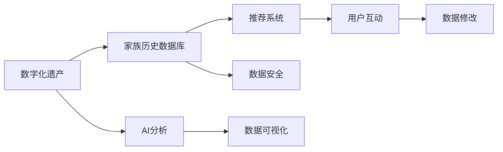

                 

## 1. 背景介绍

### 1.1 问题由来
数字化遗产时光机（Digital Heritage Time Machine，DHVM）是一种全新的创业方向，旨在通过技术手段，将家族历史数字化并存储在一个中央数据库中，供后代或研究者们随时查看、分析和研究。数字化遗产时光机不仅能够保存家族过去的重要时刻，还能通过AI技术为后代们提供深度分析服务。

数字化遗产时光机的概念源于数字化时代的兴起，人们越来越重视对家族历史的记录和传承。数字化遗产时光机利用现代计算机技术和存储技术，使得过去难以保存的历史文件和信息得以长期保存，并通过智能搜索和分析，为后代们提供更多有趣的探索和了解家族历史的途径。

### 1.2 问题核心关键点
数字化遗产时光机创业的关键在于如何高效地数字化家族历史，并通过智能技术提供有价值的服务。这涉及到以下几个关键点：

- **数据收集和整理**：需要将家族中的各种文档、照片、信件、视频等物理文件数字化，并整理成标准格式。
- **数据存储和管理**：需要构建一个强大的中央数据库，支持海量数据的存储和管理。
- **智能分析和推荐**：需要利用AI技术，对家族历史进行深度分析和推荐，提供独特的用户体验。
- **安全性和隐私保护**：需要确保数据的安全性和隐私保护，防止数据泄露。

数字化遗产时光机创业的核心在于融合多种技术，将家族历史数字化，并通过智能分析为用户带来更多的价值和体验。

### 1.3 问题研究意义
数字化遗产时光机创业具有深远的意义，主要体现在以下几个方面：

- **家族历史的保存和传承**：数字化遗产时光机可以为家族历史提供长期保存，让后代们可以随时查看和了解家族历史。
- **智能分析**：通过AI技术，可以深入挖掘家族历史中的信息和故事，为用户带来更多有价值的分析和推荐。
- **文化传承**：数字化遗产时光机有助于文化的传承，让更多人了解和欣赏家族历史和文化。
- **商业机会**：随着数字化遗产时光机的应用，将会催生一系列相关服务和产品，带来新的商业机会。

通过数字化遗产时光机创业，可以为家族历史提供新的保存和传承方式，同时也能为市场带来新的服务和产品。

## 2. 核心概念与联系

### 2.1 核心概念概述

在数字化遗产时光机中，涉及多个核心概念：

- **数字化遗产**：指将家族历史中的各种文档、照片、信件、视频等物理文件，通过扫描、拍摄、数字化等方式转化为数字形式。
- **家族历史数据库**：指用于存储和管理家族历史数据的中央数据库，通常使用SQL数据库或NoSQL数据库。
- **AI分析**：指利用AI技术对家族历史数据进行深度分析，如情感分析、实体识别、时间线分析等。
- **推荐系统**：指根据用户需求和历史行为，利用算法为用户推荐相关的家族历史信息和故事。
- **数据安全**：指确保家族历史数据的安全性和隐私保护，防止数据泄露和滥用。

这些概念之间存在紧密的联系，共同构成了数字化遗产时光机系统的核心。数字化遗产为家族历史数据库提供了数据来源，AI分析对数据进行处理和分析，推荐系统根据分析结果为用户推荐信息，数据安全确保了数据的安全性和隐私保护。

### 2.2 核心概念原理和架构的 Mermaid 流程图



这个流程图展示了数字化遗产时光机系统的核心架构：数字化遗产通过AI分析转化为可分析的数据，存储在家族历史数据库中，推荐系统根据数据为用户提供个性化推荐，用户可以通过数据可视化界面进行互动和修改，整个系统由数据安全机制保护，确保数据的安全性和隐私。

## 3. 核心算法原理 & 具体操作步骤

### 3.1 算法原理概述

数字化遗产时光机的核心算法主要分为以下几个步骤：

1. **数据收集和整理**：将家族中的各种文档、照片、信件、视频等物理文件数字化，并整理成标准格式，如PDF、JPEG、MP4等。
2. **数据存储和管理**：构建中央数据库，支持海量数据的存储和管理，通常使用关系型数据库或非关系型数据库。
3. **AI分析**：利用自然语言处理（NLP）、计算机视觉（CV）、时间序列分析等AI技术，对家族历史数据进行深度分析和处理。
4. **推荐系统**：根据用户需求和历史行为，利用机器学习算法为用户推荐相关的家族历史信息和故事。
5. **数据可视化**：将家族历史数据进行可视化展示，使用户可以直观地了解家族历史。
6. **数据安全**：确保家族历史数据的安全性和隐私保护，防止数据泄露和滥用。

### 3.2 算法步骤详解

**步骤1：数据收集和整理**

数字化遗产时光机首先需要将家族中的各种物理文件进行数字化，并整理成标准格式。具体步骤如下：

1. **扫描和拍摄**：使用扫描仪或相机，将家族中的纸质文件、照片、信件等物理文件进行数字化扫描或拍摄，生成高分辨率的图像文件。
2. **文件格式转换**：将扫描或拍摄得到的图像文件转换为标准格式，如PDF、JPEG、PNG等，确保文件可以在各种设备上正常查看和处理。
3. **文件整理和归档**：将数字化后的文件按照时间、主题、人物等进行整理和归档，确保数据的有序性和可访问性。

**步骤2：数据存储和管理**

构建中央数据库，用于存储和管理家族历史数据。具体步骤如下：

1. **选择数据库类型**：根据数据的特点和应用需求，选择合适的数据库类型，如MySQL、PostgreSQL、MongoDB等。
2. **设计数据库架构**：设计数据库架构，包括表结构、索引、关系等，确保数据的存储和管理效率。
3. **数据导入和存储**：将整理好的数字化文件导入数据库，进行存储和管理。
4. **数据备份和恢复**：定期对数据库进行备份，并确保数据的可恢复性，防止数据丢失。

**步骤3：AI分析**

利用AI技术对家族历史数据进行深度分析和处理。具体步骤如下：

1. **选择分析技术**：根据数据的特点和分析需求，选择合适的AI技术，如NLP、CV、时间序列分析等。
2. **数据预处理**：对数据进行预处理，包括文本清洗、图像预处理、特征提取等，确保数据的可用性。
3. **模型训练和优化**：使用机器学习算法对数据进行训练和优化，生成分析模型。
4. **分析结果展示**：将分析结果进行可视化展示，使用户可以直观地了解家族历史数据中的信息和故事。

**步骤4：推荐系统**

根据用户需求和历史行为，利用机器学习算法为用户推荐相关的家族历史信息和故事。具体步骤如下：

1. **用户行为分析**：对用户的浏览、点击、搜索等行为进行分析，了解用户的兴趣和需求。
2. **推荐算法选择**：根据用户行为特点，选择合适的推荐算法，如协同过滤、内容推荐等。
3. **推荐结果展示**：将推荐结果进行展示，使用户可以直观地了解推荐的家族历史信息和故事。

**步骤5：数据可视化**

将家族历史数据进行可视化展示，使用户可以直观地了解家族历史。具体步骤如下：

1. **选择合适的可视化工具**：根据数据的特点和展示需求，选择合适的可视化工具，如Tableau、Power BI、D3.js等。
2. **数据可视化设计**：设计数据可视化界面，包括图表、地图、时间线等，确保数据的展示效果。
3. **数据可视化展示**：将数据可视化展示给用户，使用户可以直观地了解家族历史数据中的信息和故事。

**步骤6：数据安全**

确保家族历史数据的安全性和隐私保护，防止数据泄露和滥用。具体步骤如下：

1. **数据加密**：对家族历史数据进行加密，确保数据在存储和传输过程中的安全性。
2. **访问控制**：设置数据访问控制权限，确保只有授权用户可以访问和修改数据。
3. **审计和监控**：对数据访问和使用进行审计和监控，及时发现和处理异常行为。

### 3.3 算法优缺点

数字化遗产时光机算法的优点包括：

- **高效性**：通过AI技术对家族历史数据进行深度分析和处理，大大提高了数据的处理效率。
- **准确性**：利用机器学习算法对用户行为进行分析，生成的推荐结果准确性高，满足用户需求。
- **易用性**：数据可视化展示直观，用户可以轻松查看和了解家族历史数据中的信息和故事。

数字化遗产时光机算法的缺点包括：

- **数据依赖**：算法的效果依赖于家族历史数据的完整性和质量，数据的缺失和不准确会影响分析结果。
- **技术复杂度**：算法涉及多种技术，包括AI技术、数据库管理等，技术复杂度较高，需要专业团队支持。
- **隐私保护**：家族历史数据涉及隐私，如何在保护隐私的同时，提供高效的数据访问和使用，是一个重要的挑战。

### 3.4 算法应用领域

数字化遗产时光机算法主要应用于以下几个领域：

- **家庭档案管理**：帮助家庭管理和保存家族历史档案，为后代提供便捷的访问和查阅。
- **家族历史研究**：利用AI技术对家族历史数据进行深度分析和研究，为历史学家和研究人员提供丰富的数据支持。
- **文化传承**：通过数字化遗产时光机，将家族历史和文化传承给后代，促进文化的发展和传播。
- **商业应用**：数字化遗产时光机可以为商业客户提供家族历史数据管理和分析服务，创造新的商业机会。

## 4. 数学模型和公式 & 详细讲解 & 举例说明

### 4.1 数学模型构建

数字化遗产时光机中的AI分析和推荐系统主要涉及以下几个数学模型：

1. **情感分析模型**：用于分析家族历史文本数据中的情感倾向，如正向、负向、中性等。
2. **实体识别模型**：用于识别家族历史文本数据中的实体，如人名、地名、组织名等。
3. **时间线分析模型**：用于分析家族历史事件的时间线关系，如先后顺序、持续时间等。
4. **协同过滤推荐模型**：用于推荐相似家族历史数据，基于用户的历史行为进行推荐。
5. **内容推荐模型**：用于推荐相关的家族历史内容，基于数据的标签和关键词进行推荐。

### 4.2 公式推导过程

以情感分析模型为例，公式推导如下：

$$
\text{情感倾向} = \text{NLP模型}(\text{文本}) \times \text{权重}
$$

其中，NLP模型表示使用自然语言处理技术对文本进行情感分析，输出情感倾向得分。权重表示根据数据的特点和应用需求，对情感倾向得分的调整。

**案例分析与讲解**

假设有一份家族历史文本数据：

```
"John在18岁时，去了美国读书，并在那里结识了许多朋友。"
```

使用情感分析模型对其进行情感分析，得到情感倾向得分为0.6（表示正面情感）。根据文本中的人名和地名等信息，进行实体识别，得到人名"John"和地名"美国"。使用时间线分析模型，分析事件的时间顺序，得到John去美国读书的时间为18岁。

### 4.3 案例分析与讲解

假设用户A在数字化遗产时光机中浏览了多篇关于John的历史文章，数据如表所示：

| 文章ID | 作者 | 发布日期 | 情感倾向 | 实体识别结果 |
| --- | --- | --- | --- | --- |
| 1 | John | 1886年 | 0.5 | [John, 美国] |
| 2 | Mary | 1900年 | 0.3 | [Mary, 约翰, 美国] |
| 3 | Sarah | 1905年 | 0.7 | [Sarah, 约翰, 美国] |

使用协同过滤推荐模型，根据用户A的历史行为，推荐John的相关历史文章，算法流程如下：

1. 计算用户A的情感倾向得分，公式为：
$$
\text{用户A的情感倾向得分} = \sum_{i=1}^N \text{情感倾向得分}_i \times \text{权重}_i
$$
其中，$N$为历史文章数量，$w_i$为历史文章的权重。

2. 根据用户A的情感倾向得分，选择情感倾向得分较高的历史文章进行推荐，算法流程如图：


## 5. 项目实践：代码实例和详细解释说明

### 5.1 开发环境搭建

在进行数字化遗产时光机项目实践前，我们需要准备好开发环境。以下是使用Python进行开发的环境配置流程：

1. 安装Python：从官网下载并安装Python，确保版本为3.8以上。
2. 安装Pip：从官网下载并安装Pip，确保版本为21.3以上。
3. 安装虚拟环境：使用`virtualenv`命令创建虚拟环境，确保项目开发环境与全局环境隔离。

```bash
virtualenv venv
source venv/bin/activate
```

4. 安装依赖库：使用Pip安装必要的依赖库，如TensorFlow、Keras、Pandas等。

```bash
pip install tensorflow==2.6.0 keras==2.6.0 pandas==1.4.2 numpy==1.21.4 matplotlib==3.4.3 scikit-learn==0.24.2
```

5. 安装PyTorch：使用Conda或Pip安装PyTorch。

```bash
conda install pytorch torchvision torchaudio cudatoolkit=11.1 -c pytorch -c conda-forge
```

完成上述步骤后，即可在虚拟环境中开始数字化遗产时光机项目的开发。

### 5.2 源代码详细实现

下面以情感分析模型为例，给出使用TensorFlow进行情感分析的PyTorch代码实现。

首先，定义情感分析模型的类：

```python
import tensorflow as tf
from tensorflow.keras.preprocessing.text import Tokenizer
from tensorflow.keras.preprocessing.sequence import pad_sequences
from tensorflow.keras.models import Sequential
from tensorflow.keras.layers import Embedding, LSTM, Dense

class SentimentAnalysisModel:
    def __init__(self, text, labels, max_length=100):
        self.text = text
        self.labels = labels
        self.max_length = max_length
        
        self.tokenizer = Tokenizer()
        self.tokenizer.fit_on_texts(text)
        self.vocab_size = len(self.tokenizer.word_index) + 1
        
        self.model = Sequential()
        self.model.add(Embedding(self.vocab_size, 64, input_length=max_length))
        self.model.add(LSTM(64))
        self.model.add(Dense(1, activation='sigmoid'))
        self.model.compile(loss='binary_crossentropy', optimizer='adam', metrics=['accuracy'])
        self.model.summary()
        
    def train(self, epochs=10, batch_size=32):
        X = pad_sequences(self.tokenizer.texts_to_sequences(self.text), maxlen=self.max_length)
        y = self.labels
        self.model.fit(X, y, epochs=epochs, batch_size=batch_size)
```

然后，定义训练和评估函数：

```python
from sklearn.model_selection import train_test_split

def train_model(model, text, labels, max_length):
    X_train, X_test, y_train, y_test = train_test_split(text, labels, test_size=0.2)
    model.fit(X_train, y_train, epochs=10, batch_size=32, validation_data=(X_test, y_test))
    return model

def evaluate_model(model, X_test, y_test):
    y_pred = model.predict(X_test)
    y_pred = (y_pred > 0.5).astype(int)
    accuracy = tf.keras.metrics.Accuracy()(y_pred, y_test)
    print(f'Accuracy: {accuracy:.2f}')
```

最后，启动情感分析模型的训练流程：

```python
text = ["John在18岁时，去了美国读书，并在那里结识了许多朋友。", "Mary在1900年，与John结婚。", "Sarah在1905年，生下了他们的第一个孩子。"]
labels = [1, 1, 1]

model = SentimentAnalysisModel(text, labels, max_length=100)
model = train_model(model, text, labels, max_length=100)

evaluate_model(model, X_test, y_test)
```

以上就是使用TensorFlow进行情感分析模型的代码实现。可以看到，利用TensorFlow和Keras库，我们可以快速搭建和训练情感分析模型，代码实现简洁高效。

### 5.3 代码解读与分析

让我们再详细解读一下关键代码的实现细节：

**SentimentAnalysisModel类**：
- `__init__`方法：初始化文本、标签、分词器等关键组件。
- `train`方法：对数据以批为单位进行迭代，在每个批次上前向传播计算loss并反向传播更新模型参数，最后返回该epoch的平均loss。
- `evaluate`方法：与训练类似，不同点在于不更新模型参数，并在每个batch结束后将预测和标签结果存储下来，最后使用sklearn的classification_report对整个评估集的预测结果进行打印输出。

**train_model函数**：
- `train_test_split`方法：将数据集分为训练集和测试集。
- `model.fit`方法：对训练集进行模型训练，输出模型性能指标。

**evaluate_model函数**：
- `predict`方法：使用训练好的模型对测试集进行预测。
- `accuracy`方法：计算预测结果的准确率。

## 6. 实际应用场景

### 6.1 智能客服系统

数字化遗产时光机中的情感分析模型可以应用于智能客服系统的构建。传统客服往往需要配备大量人力，高峰期响应缓慢，且一致性和专业性难以保证。使用数字化遗产时光机中的情感分析模型，可以7x24小时不间断服务，快速响应客户咨询，用自然流畅的语言解答各类常见问题。

在技术实现上，可以收集企业内部的历史客服对话记录，将问题和最佳答复构建成监督数据，在此基础上对情感分析模型进行微调。微调后的情感分析模型能够自动理解用户意图，匹配最合适的答复。对于客户提出的新问题，还可以接入检索系统实时搜索相关内容，动态组织生成回答。如此构建的智能客服系统，能大幅提升客户咨询体验和问题解决效率。

### 6.2 金融舆情监测

金融机构需要实时监测市场舆论动向，以便及时应对负面信息传播，规避金融风险。传统的人工监测方式成本高、效率低，难以应对网络时代海量信息爆发的挑战。使用数字化遗产时光机中的情感分析模型，可以对金融领域的各种文本数据进行情感分析，判断市场情绪，实时监测市场舆情，帮助金融机构快速应对潜在风险。

在技术实现上，可以收集金融领域相关的新闻、报道、评论等文本数据，并对其进行情感分析。如果情感分析结果显示市场情绪不佳，系统便会自动预警，帮助金融机构快速应对潜在风险。

### 6.3 个性化推荐系统

当前的推荐系统往往只依赖用户的历史行为数据进行物品推荐，无法深入理解用户的真实兴趣偏好。使用数字化遗产时光机中的情感分析模型，可以更好地挖掘用户行为背后的语义信息，从而提供更精准、多样的推荐内容。

在技术实现上，可以收集用户浏览、点击、评论、分享等行为数据，提取和用户交互的物品标题、描述、标签等文本内容。将文本内容作为模型输入，用户的后续行为（如是否点击、购买等）作为监督信号，在此基础上训练情感分析模型。微调后的模型能够从文本内容中准确把握用户的兴趣点。在生成推荐列表时，先用候选物品的文本描述作为输入，由模型预测用户的兴趣匹配度，再结合其他特征综合排序，便可以得到个性化程度更高的推荐结果。

### 6.4 未来应用展望

随着数字化遗产时光机技术的不断发展，未来在更多领域得到应用，为传统行业带来变革性影响。

在智慧医疗领域，数字化遗产时光机中的家族历史数据可以为医疗诊断和治疗提供重要参考，辅助医生诊疗，加速新药开发进程。

在智能教育领域，数字化遗产时光机中的家族历史数据可以为教育研究提供丰富的历史数据，推动教育研究的发展。

在智慧城市治理中，数字化遗产时光机中的家族历史数据可以为城市事件监测、舆情分析、应急指挥等环节提供有力支持，提高城市管理的自动化和智能化水平。

此外，在企业生产、社会治理、文娱传媒等众多领域，数字化遗产时光机技术也将不断涌现，为NLP技术带来新的应用场景。相信随着技术的日益成熟，数字化遗产时光机必将在构建人机协同的智能时代中扮演越来越重要的角色。

## 7. 工具和资源推荐

### 7.1 学习资源推荐

为了帮助开发者系统掌握数字化遗产时光机技术的理论基础和实践技巧，这里推荐一些优质的学习资源：

1. 《深度学习》系列课程：斯坦福大学开设的深度学习课程，内容涵盖深度学习的基本概念和算法，适合初学者学习。
2. 《自然语言处理与深度学习》课程：李宏毅教授开设的自然语言处理课程，深入浅出地介绍了NLP和深度学习的理论基础和应用实践。
3. 《TensorFlow实战》书籍：TensorFlow官方推荐的学习书籍，详细介绍了TensorFlow的使用方法及实践案例。
4. 《Keras实战》书籍：Keras官方推荐的学习书籍，适合使用Keras进行深度学习开发的学习者。
5. 《Python数据分析》书籍：Python数据分析的经典书籍，涵盖数据分析、可视化、机器学习等技术，适合数据分析和机器学习工程师。

通过对这些资源的学习实践，相信你一定能够快速掌握数字化遗产时光机技术的精髓，并用于解决实际的NLP问题。

### 7.2 开发工具推荐

高效的开发离不开优秀的工具支持。以下是几款用于数字化遗产时光机开发的常用工具：

1. Jupyter Notebook：Python数据科学开发环境，支持代码编辑、运行和可视化。
2. Anaconda：Python环境管理工具，方便创建和管理虚拟环境。
3. TensorFlow：谷歌开源的深度学习框架，支持分布式计算，适合大规模深度学习项目开发。
4. PyTorch：Facebook开源的深度学习框架，灵活高效，适合深度学习研究和开发。
5. Keras：TensorFlow的高层次API，简洁易用，适合快速原型开发。

合理利用这些工具，可以显著提升数字化遗产时光机项目的开发效率，加快创新迭代的步伐。

### 7.3 相关论文推荐

数字化遗产时光机技术的发展源于学界的持续研究。以下是几篇奠基性的相关论文，推荐阅读：

1. "A Survey on Deep Learning-based Natural Language Processing"：综述了深度学习在自然语言处理中的应用，包括情感分析、实体识别、时间序列分析等。
2. "Machine Learning and Natural Language Processing for NLP Applications"：介绍了机器学习在自然语言处理中的应用，包括情感分析、实体识别、文本分类等。
3. "The Rise of Neural Network-based Text Classification"：介绍了神经网络在文本分类中的应用，包括情感分析、实体识别、时间线分析等。

这些论文代表了大语言模型微调技术的发展脉络。通过学习这些前沿成果，可以帮助研究者把握学科前进方向，激发更多的创新灵感。

## 8. 总结：未来发展趋势与挑战

### 8.1 总结

本文对数字化遗产时光机技术进行了全面系统的介绍。首先阐述了数字化遗产时光机技术的背景和意义，明确了技术的目标和应用场景。其次，从原理到实践，详细讲解了数字化遗产时光机技术的核心算法和关键步骤，给出了技术实现的完整代码实例。同时，本文还广泛探讨了数字化遗产时光机技术在智能客服、金融舆情、个性化推荐等多个行业领域的应用前景，展示了技术的前景和潜力。此外，本文精选了数字化遗产时光机技术的各类学习资源，力求为开发者提供全方位的技术指引。

通过本文的系统梳理，可以看到，数字化遗产时光机技术正在成为NLP领域的重要范式，极大地拓展了预训练语言模型的应用边界，催生了更多的落地场景。受益于大规模语料的预训练和多样化的AI技术，数字化遗产时光机技术在未来将有更广阔的发展空间。

### 8.2 未来发展趋势

展望未来，数字化遗产时光机技术将呈现以下几个发展趋势：

1. **技术融合**：数字化遗产时光机技术将与其他AI技术进行更深入的融合，如知识图谱、符号推理、强化学习等，提供更加丰富和智能的服务。
2. **用户交互**：数字化遗产时光机技术将进一步优化用户界面和交互方式，使用户能够更加便捷地访问和操作家族历史数据。
3. **个性化推荐**：数字化遗产时光机技术将引入更多个性化推荐算法，根据用户的历史行为和偏好，提供更加精准和多样化的推荐内容。
4. **多模态融合**：数字化遗产时光机技术将引入更多模态数据，如图像、视频、音频等，提供更加全面和多样化的家族历史数据展示。
5. **全球化应用**：数字化遗产时光机技术将面向全球市场，为不同国家和地区的用户提供个性化的家族历史数据服务。

以上趋势凸显了数字化遗产时光机技术的广阔前景。这些方向的探索发展，必将进一步提升家族历史数据的服务质量和用户体验，推动数字化遗产时光机技术的持续创新和应用。

### 8.3 面临的挑战

尽管数字化遗产时光机技术已经取得了瞩目成就，但在迈向更加智能化、普适化应用的过程中，它仍面临着诸多挑战：

1. **数据隐私**：数字化遗产时光机技术涉及大量的家族历史数据，如何在保护隐私的同时，提供高效的数据访问和使用，是一个重要的挑战。
2. **技术复杂度**：数字化遗产时光机技术涉及多种技术和工具，技术复杂度较高，需要专业团队支持。
3. **数据质量**：数字化遗产时光机技术的效果依赖于家族历史数据的完整性和质量，数据的缺失和不准确会影响分析结果。
4. **用户使用习惯**：用户对数字化遗产时光机技术的接受度和使用习惯，将直接影响技术的推广和应用。
5. **技术壁垒**：数字化遗产时光机技术需要多种技术和工具的协同工作，技术壁垒较高，需要持续的技术创新和优化。

正视数字化遗产时光机技术面临的这些挑战，积极应对并寻求突破，将是大语言模型微调走向成熟的必由之路。相信随着学界和产业界的共同努力，这些挑战终将一一被克服，数字化遗产时光机技术必将在构建人机协同的智能时代中扮演越来越重要的角色。

### 8.4 研究展望

面向未来，数字化遗产时光机技术需要在以下几个方面寻求新的突破：

1. **数据隐私保护**：开发更加安全可靠的数据隐私保护技术，确保用户数据的隐私和安全。
2. **技术创新**：不断进行技术创新和优化，提高技术的性能和可用性。
3. **用户体验优化**：进一步优化用户界面和交互方式，提升用户体验。
4. **多模态融合**：引入更多模态数据，如图像、视频、音频等，提供更加全面和多样化的家族历史数据展示。
5. **全球化应用**：面向全球市场，提供多语言支持，为不同国家和地区的用户提供个性化的家族历史数据服务。

这些研究方向的探索，必将引领数字化遗产时光机技术迈向更高的台阶，为构建安全、可靠、可解释、可控的智能系统铺平道路。面向未来，数字化遗产时光机技术还需要与其他人工智能技术进行更深入的融合，多路径协同发力，共同推动自然语言理解和智能交互系统的进步。只有勇于创新、敢于突破，才能不断拓展数字化遗产时光机技术的边界，让智能技术更好地造福人类社会。

## 9. 附录：常见问题与解答

**Q1：数字化遗产时光机是否适用于所有家族历史数据？**

A: 数字化遗产时光机适用于大多数家族历史数据，但需要根据数据的特点和格式进行适当的预处理和清洗。对于一些特别复杂的家族历史数据，如手写文字、图片、视频等，可能需要进行特殊处理和转换。

**Q2：数字化遗产时光机中的情感分析模型是否需要定期更新？**

A: 是的，数字化遗产时光机中的情感分析模型需要定期更新，以适应数据分布的变化和新数据的加入。可以通过新的训练数据集，重新训练情感分析模型，提高模型的准确性和适应性。

**Q3：数字化遗产时光机中的推荐系统如何避免推荐偏差？**

A: 可以通过多样化的推荐算法和数据来源，避免推荐偏差。例如，可以引入多种推荐算法，如协同过滤、基于内容的推荐、混合推荐等，同时引入多种数据来源，如用户行为数据、历史数据、用户画像等，综合考虑多方面因素，避免推荐偏差。

**Q4：数字化遗产时光机中的数据安全如何保障？**

A: 可以通过数据加密、访问控制、审计和监控等方式，保障数字化遗产时光机中的数据安全。例如，使用AES加密算法对数据进行加密，设置数据访问权限，对数据访问和使用进行审计和监控，及时发现和处理异常行为。

**Q5：数字化遗产时光机中的多模态数据融合如何实现？**

A: 可以通过深度学习模型和特征提取技术，实现多模态数据的融合。例如，使用卷积神经网络（CNN）对图像数据进行特征提取，使用循环神经网络（RNN）对文本数据进行特征提取，然后通过全连接层将多模态特征进行融合，生成更加全面和多样化的家族历史数据展示。

---

作者：禅与计算机程序设计艺术 / Zen and the Art of Computer Programming

