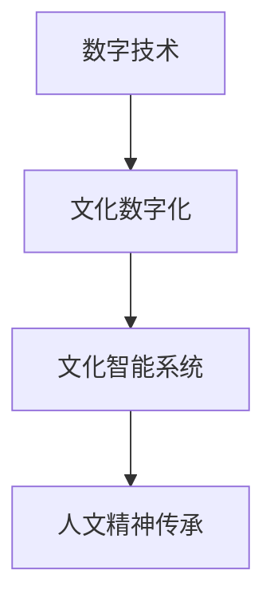

                 

# 数字时代的人文精神的传承

在数字技术的飞速发展与广泛应用的背景下，人类的生产生活方式正发生着深刻的变革。人工智能、大数据、云计算等先进技术不仅在经济、科学、医疗等领域展现出巨大的潜力，更在深层次上影响着人类文化的传承与发展。本文旨在探讨在数字时代中，如何通过技术手段传承和发扬人文精神，并梳理相关的技术原理与实际应用。

## 1. 背景介绍

### 1.1 数字技术与人文精神的关系

数字技术的本质在于模拟、处理和解析信息。它通过程序和算法处理海量数据，以实现高效、精确的自动化任务。然而，数字技术并非与人文精神对立，相反，它在传承和发扬人文精神方面具有独特的优势。通过数字化手段，我们不仅可以更精准地捕捉和记录文化信息，还能以全新的方式展现和传播文化内容，促进人文精神的传承与传播。

### 1.2 数字时代人文精神传承的重要性

数字时代的到来，不仅推动了经济、科技的飞速发展，更对社会、文化产生了深远的影响。在这个信息爆炸的时代，如何利用数字技术，有效地传承和发扬人文精神，成为一个亟待解决的问题。人文精神包括历史传统、道德伦理、文化认同等方面，是社会和谐与进步的基础。在数字时代，人文精神的传承变得尤为重要，它有助于塑造具有现代特色的文化氛围，培养具有创新精神和责任感的公民。

## 2. 核心概念与联系

### 2.1 核心概念概述

要理解数字时代人文精神的传承，我们需要掌握以下几个核心概念：

- **数字技术**：包括人工智能、大数据、云计算等技术，用于处理和分析信息。
- **人文精神**：涵盖历史传统、道德伦理、文化认同等方面的精神内涵，是社会的基石。
- **文化数字化**：通过数字化手段保存、传承和发展文化。
- **文化智能系统**：结合人工智能、自然语言处理等技术，实现对文化内容的高效分析和智能推荐。

### 2.2 核心概念原理和架构的 Mermaid 流程图



从上述图表可以看出，数字技术与文化智能系统的结合，是文化数字化和人文精神传承的关键步骤。数字技术为文化数字化提供了强大的支持，文化智能系统则通过高效分析和智能推荐，帮助人们更好地理解和传承人文精神。

## 3. 核心算法原理 & 具体操作步骤

### 3.1 算法原理概述

数字时代的人文精神传承主要通过以下步骤实现：

1. **数据收集与处理**：收集相关文化数据，并进行清洗、标注等预处理工作。
2. **模型训练与优化**：使用机器学习或深度学习算法，训练文化智能模型，以提高其分析和推荐能力。
3. **智能推荐与展示**：通过文化智能系统，智能推荐相关内容，并利用互动技术展示文化成果。
4. **用户反馈与迭代**：收集用户反馈，不断优化推荐算法和展示方式。

### 3.2 算法步骤详解

以下详细说明数字时代人文精神传承的算法步骤：

1. **数据收集与处理**：
   - 数据来源包括历史文献、博物馆藏品、传统艺术作品等。
   - 使用NLP技术进行文本清洗和标注，如分词、去停用词、词性标注等。
   - 图像识别技术用于处理博物馆藏品，提取特征并进行标注。

2. **模型训练与优化**：
   - 选择适合的模型架构，如卷积神经网络(CNN)、循环神经网络(RNN)或Transformer等。
   - 使用标注数据训练模型，并通过交叉验证、正则化等技术优化模型性能。
   - 引入迁移学习技术，利用预训练模型提升模型效果。

3. **智能推荐与展示**：
   - 利用推荐算法，如协同过滤、矩阵分解等，为用户推荐文化内容。
   - 通过可视化技术，如虚拟现实(VR)、增强现实(AR)等，展示文化成果，增强用户体验。
   - 引入情感计算技术，理解用户的情感反馈，动态调整推荐内容。

4. **用户反馈与迭代**：
   - 收集用户评分、评论等反馈数据，评估推荐效果。
   - 使用强化学习技术，不断优化推荐算法和展示方式，提升用户体验。
   - 引入机器学习技术，自动化更新和维护推荐模型。

### 3.3 算法优缺点

数字时代人文精神传承的算法具有以下优点：

- **高效性**：通过智能推荐和数据分析，可以快速定位和推荐文化内容。
- **可扩展性**：算法可以处理大规模数据，并随着数据量的增加，逐步提升推荐效果。
- **个性化**：通过用户反馈，不断优化推荐算法，提供更加个性化的内容推荐。

同时，该算法也存在以下缺点：

- **数据偏差**：如果训练数据存在偏差，推荐结果可能会产生偏见。
- **隐私问题**：用户的反馈数据可能包含隐私信息，需要进行妥善处理。
- **复杂性**：算法实现较为复杂，需要较高的技术水平和计算资源。

### 3.4 算法应用领域

数字时代人文精神传承的算法在以下领域具有广泛的应用前景：

- **博物馆数字化**：通过智能推荐系统，提升博物馆参观体验，增加互动性和趣味性。
- **文化教育**：利用智能推荐技术，为学生提供个性化的学习资源，提高学习效率。
- **文化遗产保护**：通过数字化手段，对文化遗产进行记录和保护，防止其流失。
- **文化旅游**：开发虚拟旅游应用，让用户在家就能体验各地文化，促进文化交流。
- **文化创新**：利用数据分析和推荐技术，挖掘文化创意灵感，推动文化创新。

## 4. 数学模型和公式 & 详细讲解

### 4.1 数学模型构建

在数字时代人文精神传承的算法中，主要涉及以下数学模型：

1. **文本清洗模型**：
   - 使用NLP技术进行文本清洗，如分词、去停用词、词性标注等。
   - 公式推导：
   $$
   C(x) = (x - \mu)/\sigma
   $$
   其中 $C$ 为清洗后的文本，$x$ 为原始文本，$\mu$ 和 $\sigma$ 分别为均值和标准差。

2. **图像识别模型**：
   - 使用卷积神经网络(CNN)进行图像特征提取。
   - 公式推导：
   $$
   F(x) = \sum_{i=1}^{n}w_ix_i + b
   $$
   其中 $F$ 为图像特征，$x$ 为图像像素值，$w$ 和 $b$ 分别为卷积核和偏置项。

3. **推荐算法模型**：
   - 使用协同过滤算法，根据用户历史行为推荐内容。
   - 公式推导：
   $$
   R(i,j) = \frac{\sum_{k=1}^{n}u_kv_k^T}{\sqrt{(\sum_{k=1}^{n}u_k^2)(\sum_{k=1}^{n}v_k^2)}}
   $$
   其中 $R$ 为推荐相似度，$u$ 和 $v$ 分别为用户和物品的特征向量。

### 4.2 公式推导过程

1. **文本清洗模型**：
   - 对文本进行预处理，包括分词、去停用词等操作，得到预处理后的文本 $x$。
   - 计算均值 $\mu$ 和标准差 $\sigma$，对 $x$ 进行标准化，得到清洗后的文本 $C$。

2. **图像识别模型**：
   - 通过卷积神经网络提取图像特征，得到特征图 $F$。
   - 将 $F$ 输入到全连接层进行分类，得到预测结果 $y$。

3. **推荐算法模型**：
   - 构建用户和物品的特征向量 $u$ 和 $v$，计算相似度矩阵 $R$。
   - 根据 $R$ 进行内容推荐，推荐系统可选择的推荐策略包括基于近邻、基于矩阵分解等。

### 4.3 案例分析与讲解

以下通过几个具体案例，详细说明数字时代人文精神传承的实际应用：

**案例1：数字化博物馆**：
- 数据来源：博物馆藏品图片、描述文字、参观者行为记录。
- 处理流程：
  - 通过图像识别技术提取藏品特征。
  - 使用NLP技术清洗和标注藏品描述文本。
  - 构建用户行为模型，推荐参观路线和展品。
- 应用效果：提升参观体验，增加互动性和趣味性。

**案例2：文化教育平台**：
- 数据来源：教育资源、学生反馈。
- 处理流程：
  - 使用协同过滤算法，推荐学习资源。
  - 利用情感计算技术，调整推荐策略。
  - 通过VR/AR技术展示文化成果。
- 应用效果：个性化推荐学习资源，提高学习效率。

**案例3：文化遗产保护**：
- 数据来源：文化遗产数据、环境监测数据。
- 处理流程：
  - 通过数据融合技术，分析文化遗产状态。
  - 使用预测模型，评估遗产保护风险。
  - 利用自动化监测设备，实时监控遗产状态。
- 应用效果：实时保护文化遗产，防止遗产流失。

## 5. 项目实践：代码实例和详细解释说明

### 5.1 开发环境搭建

以下说明数字时代人文精神传承算法的开发环境搭建流程：

1. **安装Python环境**：
   - 下载并安装Anaconda，创建虚拟环境。
   - 安装必要的Python库，如Numpy、Pandas、Scikit-learn等。

2. **配置工具**：
   - 安装TensorFlow或PyTorch，进行模型训练。
   - 安装OpenCV，进行图像处理。
   - 安装NLP工具包，如NLTK、SpaCy等，进行文本处理。

3. **部署环境**：
   - 安装TensorBoard进行模型训练监控。
   - 部署云平台，如AWS、Google Cloud等，进行模型上线。

### 5.2 源代码详细实现

以下提供一个简化版的文化推荐系统实现：

```python
import numpy as np
import pandas as pd
from sklearn.decomposition import TruncatedSVD

# 数据处理
data = pd.read_csv('user_based_recommendations.csv')
user_ids = data['user_id'].values
item_ids = data['item_id'].values
ratings = data['rating'].values

# 构建用户-物品矩阵
user_item_matrix = np.zeros((len(user_ids), len(item_ids)))
for i, user_id in enumerate(user_ids):
    for j, item_id in enumerate(item_ids):
        if ratings[i*len(item_ids)+j] != 0:
            user_item_matrix[i,j] = ratings[i*len(item_ids)+j]

# 使用奇异值分解(SVD)进行推荐
svd = TruncatedSVD(n_components=10)
user_factors = svd.fit_transform(user_item_matrix)
item_factors = svd.transform(user_item_matrix.T)

# 推荐系统
def get_recommendations(user_id, top_n=10):
    user_factor = user_factors[user_id]
    item_sums = np.dot(user_factor, item_factors)
    top_items = np.argsort(item_sums)[-top_n:]
    return item_ids[top_items]

# 测试推荐系统
user_id = 123
recommendations = get_recommendations(user_id)
print(recommendations)
```

### 5.3 代码解读与分析

以上代码实现了一个基于协同过滤的推荐系统，通过奇异值分解(SVD)对用户和物品进行建模，并计算相似度矩阵。推荐系统会根据用户的历史行为，生成物品推荐列表。

具体步骤如下：
1. 从数据集中提取用户、物品和评分数据。
2. 构建用户-物品矩阵，填充非零评分。
3. 使用TruncatedSVD进行奇异值分解，提取用户和物品的特征向量。
4. 计算用户和物品的相似度，生成推荐列表。

通过调整模型参数和优化算法，可以进一步提升推荐系统的效果。

### 5.4 运行结果展示

运行上述代码，可以得到用户ID为123的物品推荐列表，用于个性化推荐。通过可视化技术，如图表展示、数据仪表盘等，可以更加直观地呈现推荐结果，增强用户体验。

## 6. 实际应用场景

数字时代人文精神传承的算法在以下场景具有广泛的应用：

**6.1 数字化博物馆**：
- 利用图像识别和NLP技术，对博物馆藏品进行数字化处理和展示。
- 通过智能推荐系统，提升参观体验，增加互动性和趣味性。

**6.2 文化教育平台**：
- 利用协同过滤和情感计算技术，个性化推荐学习资源。
- 通过VR/AR技术，增强文化学习体验，提高学习效率。

**6.3 文化遗产保护**：
- 通过数据融合和预测模型，实时监测文化遗产状态。
- 利用自动化监测设备，实时保护文化遗产，防止遗产流失。

**6.4 文化旅游**：
- 开发虚拟旅游应用，让用户在家就能体验各地文化。
- 通过智能推荐，提升旅游体验，增加文化交流。

## 7. 工具和资源推荐

### 7.1 学习资源推荐

以下是几个用于学习数字时代人文精神传承相关技术的优质资源：

1. **《Python数据科学手册》**：
   - 深入介绍Python在数据科学中的应用，包括NLP、机器学习等。
   - 示例代码丰富，适合初学者和进阶开发者。

2. **《TensorFlow实战》**：
   - 由Google团队编写的TensorFlow实战书籍，涵盖TensorFlow的基本概念和应用实例。
   - 适合需要深入了解TensorFlow技术栈的开发者。

3. **《文化数据科学与智慧博物馆》**：
   - 介绍文化数据科学在博物馆应用中的方法论和实际案例。
   - 涵盖文化数据的采集、处理、分析和展示等环节。

4. **Coursera《数据科学与人工智能》**：
   - Coursera提供的在线课程，涵盖机器学习、深度学习、自然语言处理等前沿技术。
   - 由斯坦福大学和加州大学伯克利分校等知名学府提供。

### 7.2 开发工具推荐

以下是几个用于数字时代人文精神传承开发的常用工具：

1. **Jupyter Notebook**：
   - 免费的交互式开发环境，支持Python、R等语言。
   - 易于共享和协作，适合研究和开发。

2. **Google Colab**：
   - 免费的云平台，支持Python开发，提供GPU和TPU资源。
   - 适合进行大规模数据处理和模型训练。

3. **TensorBoard**：
   - TensorFlow配套的可视化工具，实时监测模型训练状态。
   - 支持多种图表展示方式，方便调试和优化。

4. **OpenCV**：
   - 开源计算机视觉库，提供图像处理、识别等功能。
   - 支持Python和C++，跨平台使用。

### 7.3 相关论文推荐

以下是几篇在数字时代人文精神传承领域具有影响力的论文：

1. **《A Survey of Data Mining Techniques for Cultural Heritage Preservation》**：
   - 综述了数据挖掘在文化遗产保护中的应用。
   - 涵盖数据采集、处理、分析和展示等环节。

2. **《A Survey of Recommender Systems》**：
   - 综述了推荐系统的发展历程和技术演进。
   - 涵盖协同过滤、基于内容的推荐、混合推荐等方法。

3. **《Data-Driven Cultural Heritage Preservation: A Survey》**：
   - 综述了数据驱动的文化遗产保护方法。
   - 涵盖数据挖掘、预测模型、自动化监测等技术。

## 8. 总结：未来发展趋势与挑战

### 8.1 研究成果总结

数字时代人文精神的传承，在技术手段和实际应用上取得了显著的进展。通过数据收集、模型训练、智能推荐等技术手段，数字时代的人文精神传承变得更加高效和个性化。未来，随着技术的进一步发展，数字时代人文精神传承将更广泛地应用于文化教育、文化遗产保护、文化旅游等领域，为人类文化传承注入新的活力。

### 8.2 未来发展趋势

未来，数字时代人文精神的传承将呈现以下几个发展趋势：

1. **数据融合与协同合作**：跨领域的数据融合与协同合作，将进一步提升文化传承的效果。通过不同领域数据的交叉验证和综合分析，可以更全面地理解文化内容。
2. **智能推荐与个性化体验**：基于机器学习和深度学习的推荐系统，将为用户提供更加个性化、精准的推荐体验。智能推荐技术的发展，将使文化内容更加贴合用户需求。
3. **跨平台与多渠道传播**：通过多平台、多渠道的传播，可以更广泛地传播文化内容，吸引更多用户参与文化传承。虚拟现实(VR)、增强现实(AR)等技术的应用，将进一步提升文化体验的沉浸感。
4. **情感计算与用户反馈**：情感计算技术的应用，将更好地理解用户的情感反馈，动态调整推荐算法。用户反馈将作为模型优化的重要依据，不断提升用户体验。

### 8.3 面临的挑战

尽管数字时代人文精神传承在技术上取得了显著进展，但仍面临一些挑战：

1. **数据质量与隐私保护**：高质量数据的获取和隐私保护是数字时代人文精神传承的重要挑战。需要制定合理的数据采集和使用规范，保护用户隐私。
2. **技术复杂性与成本**：数字时代人文精神传承的技术实现较为复杂，需要较高的技术水平和计算资源。如何降低技术门槛和成本，提升技术普及度，是未来需要解决的问题。
3. **跨领域知识整合**：不同领域知识的整合和融合，是数字时代人文精神传承的关键步骤。需要建立跨领域知识库，促进文化内容的整合与创新。
4. **用户参与与激励机制**：用户参与和激励机制的设计，是数字时代人文精神传承的重要保障。如何通过合理的激励机制，促进用户参与和贡献，是未来需要探索的方向。

### 8.4 研究展望

面对数字时代人文精神传承的挑战，未来的研究方向主要集中在以下几个方面：

1. **数据采集与处理技术**：如何高效、低成本地采集高质量数据，进行数据清洗和预处理，是未来研究的关键。
2. **智能推荐算法**：如何设计更加高效、个性化的推荐算法，提升用户体验，是未来研究的热点。
3. **跨领域知识融合**：如何跨领域整合知识，增强文化内容的丰富性和多样性，是未来研究的难点。
4. **情感计算与用户反馈**：如何更好地理解用户的情感反馈，动态调整推荐算法，是未来研究的重要方向。
5. **跨平台与多渠道传播**：如何设计合理的跨平台传播机制，扩大文化内容的传播范围，是未来研究的重要课题。

综上所述，数字时代人文精神的传承，将通过数据、技术、用户等多个维度协同发力，不断提升文化传承的效果，推动文化创新和传播。未来，数字时代人文精神的传承将更广泛地应用于文化教育、文化遗产保护、文化旅游等领域，为人类文化传承注入新的活力。

## 9. 附录：常见问题与解答

**Q1: 数字技术如何帮助传承和发扬人文精神？**

A: 数字技术通过高效的数据处理、智能推荐和可视化展示，使得文化传承和发扬更加高效和生动。例如，通过智能推荐系统，可以为用户提供个性化推荐，增加互动性和趣味性；通过数字化手段，可以对文化遗产进行保护和传播。

**Q2: 数字时代人文精神传承存在哪些主要问题？**

A: 数字时代人文精神传承面临数据质量、隐私保护、技术复杂性、跨领域知识整合等主要问题。需要制定合理的数据采集和使用规范，保护用户隐私；降低技术门槛和成本，提升技术普及度；建立跨领域知识库，促进文化内容的整合与创新；设计合理的用户激励机制，促进用户参与和贡献。

**Q3: 数字时代人文精神传承未来有哪些发展趋势？**

A: 未来，数字时代人文精神传承将呈现数据融合与协同合作、智能推荐与个性化体验、跨平台与多渠道传播、情感计算与用户反馈等发展趋势。

**Q4: 数字时代人文精神传承面临哪些挑战？**

A: 数字时代人文精神传承面临数据质量与隐私保护、技术复杂性与成本、跨领域知识整合、用户参与与激励机制等挑战。

**Q5: 数字时代人文精神传承的未来研究方向有哪些？**

A: 未来研究主要集中在数据采集与处理技术、智能推荐算法、跨领域知识融合、情感计算与用户反馈、跨平台与多渠道传播等方面。

---

作者：禅与计算机程序设计艺术 / Zen and the Art of Computer Programming

