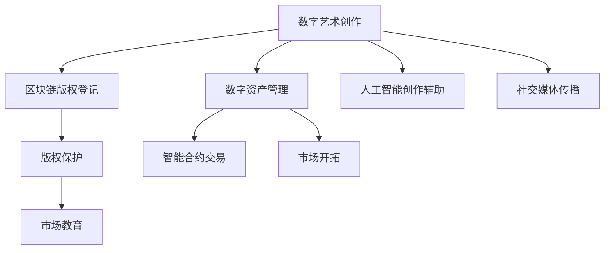

                 

## 1. 背景介绍

数字艺术创业是一个前沿而充满潜力的领域。随着科技的不断进步和数字化转型的深入，数字艺术正在逐渐成为主流文化的一部分。它不仅打破了传统艺术创作的限制，还开辟了新的商业机会和创新路径。在信息技术、人工智能和区块链等技术的加持下，数字艺术创业者能够以全新的方式创造、展示和销售艺术作品，为艺术界和商业界带来革命性的变化。

### 1.1 问题由来

数字艺术创业的兴起，源于以下几个关键因素：

1. **技术的进步**：随着计算机图形处理技术的发展，数字艺术作品的制作门槛大幅降低。艺术家可以利用软件和硬件工具，轻松创作出传统艺术形式难以实现的复杂作品。
   
2. **市场的需求**：现代消费者对个性化、定制化的产品需求日益增长，数字艺术作品因其独特性和易复制性，成为满足这种需求的理想选择。
   
3. **区块链技术的崛起**：区块链技术提供了去中心化的版权保护和智能合约机制，为数字艺术品的销售和交易提供了安全可靠的平台。
   
4. **互联网和社交媒体的普及**：互联网和社交媒体的广泛应用，为数字艺术作品提供了更广阔的展示和传播渠道，增加了作品的曝光度和市场影响力。

### 1.2 问题核心关键点

数字艺术创业的核心关键点在于：

- **创意与技术的结合**：如何将艺术创意与技术手段完美融合，创造出既具艺术价值又具备市场潜力的作品。

- **版权保护**：如何在数字化时代有效保护艺术家的版权，确保其作品不被侵犯或盗用。

- **市场开拓**：如何通过创新的商业模式和营销策略，开拓数字艺术的市场，吸引更多的消费者和投资者。

- **技术与艺术教育**：如何通过技术培训和艺术教育，培养新一代的数字艺术创作者和欣赏者。

## 2. 核心概念与联系

### 2.1 核心概念概述

数字艺术创业涉及多个核心概念，包括：

- **数字艺术**：利用数字技术创作和展示的艺术形式，包括但不限于数字绘画、数字雕塑、数字动画等。

- **数字资产管理**：对数字艺术品的创作、存储、交易和展示进行管理的系统和技术。

- **区块链技术**：一种去中心化的分布式账本技术，用于确保数字艺术品的版权、所有权和交易的透明性和安全性。

- **智能合约**：一种基于区块链技术的自动化合约，用于自动执行合同条款和条件，保障数字艺术品交易的公平和透明。

- **人工智能**：利用机器学习和深度学习技术，提升数字艺术创作、展示和销售的效率和智能化水平。

这些概念之间存在紧密联系，共同构成了数字艺术创业的技术框架。

### 2.2 核心概念原理和架构的 Mermaid 流程图

## 3. 核心算法原理 & 具体操作步骤

### 3.1 算法原理概述

数字艺术创业的核心算法原理主要包括：

- **数字艺术创作算法**：利用计算机图形学、深度学习等技术，辅助艺术家创作数字艺术品。

- **区块链算法**：确保数字艺术品的版权、所有权和交易信息的安全透明。

- **智能合约算法**：基于区块链技术，自动执行和监管数字艺术品的交易流程。

- **市场分析算法**：通过大数据和机器学习技术，分析市场需求和消费者行为，制定营销策略。

### 3.2 算法步骤详解

#### 3.2.1 数字艺术创作算法

1. **数据收集**：收集艺术家创作所需的素材和参考资料。
   
2. **创意设计**：艺术家利用数字工具，创作出初稿和概念设计。

3. **技术辅助**：使用深度学习技术，如GAN（生成对抗网络）或风格迁移等算法，优化和增强艺术作品。

4. **版权登记**：将创作的作品上传至区块链平台，进行版权登记和存储。

#### 3.2.2 区块链算法

1. **智能合约编写**：基于区块链平台，编写智能合约，定义数字艺术品的交易规则和条件。

2. **作品上传**：将创作的作品上传到区块链平台，进行版权登记和交易。

3. **交易执行**：买家和卖家通过智能合约，完成数字艺术品的交易，系统自动执行合同条款。

#### 3.2.3 智能合约算法

1. **合约编写**：定义数字艺术品的所有权、版权和使用规则，确保交易的透明和公平。

2. **合约执行**：当交易条件满足时，智能合约自动执行，确保交易的安全和效率。

#### 3.2.4 市场分析算法

1. **数据收集**：收集市场数据，包括消费者行为、交易记录等。

2. **数据分析**：利用机器学习算法，分析市场需求和趋势。

3. **策略制定**：基于分析结果，制定营销和推广策略。

### 3.3 算法优缺点

#### 3.3.1 数字艺术创作算法的优缺点

**优点**：

- **高效创作**：利用技术辅助，艺术家可以快速创作出高质量的作品。

- **作品多样性**：数字技术使得作品形式多样，突破了传统艺术的限制。

**缺点**：

- **技术依赖**：对技术和工具的依赖，可能导致创作灵感受限。

- **版权保护**：数字作品容易被复制和盗用，版权保护难度较大。

#### 3.3.2 区块链算法的优缺点

**优点**：

- **透明性**：所有交易记录公开透明，便于监管和审计。

- **安全性**：去中心化的分布式账本，防止单点故障和数据篡改。

**缺点**：

- **成本高**：区块链交易费用较高，增加了艺术品的交易成本。

- **技术门槛**：需要一定的区块链技术知识和操作经验。

#### 3.3.3 智能合约算法的优缺点

**优点**：

- **自动化**：自动执行和监管交易流程，减少了人为干预和纠纷。

- **公平性**：确保交易的透明和公平，保护买卖双方的权益。

**缺点**：

- **技术复杂**：智能合约的编写和执行需要较高的技术水平。

- **更新难度**：一旦智能合约部署，修改和更新较为困难。

#### 3.3.4 市场分析算法的优缺点

**优点**：

- **数据驱动**：基于大量市场数据，制定科学的营销策略。

- **精准推广**：能够精准定位目标消费者，提高推广效果。

**缺点**：

- **数据隐私**：收集和分析消费者数据，可能涉及隐私问题。

- **技术门槛**：需要一定的数据分析和机器学习技术。

### 3.4 算法应用领域

数字艺术创业的算法应用领域广泛，包括：

- **数字艺术品创作**：利用技术辅助，创作各种形式的数字艺术品。

- **数字艺术品交易**：利用智能合约和区块链技术，实现数字艺术品的交易和版权保护。

- **数字艺术品展示和传播**：利用社交媒体和互联网平台，展示和传播数字艺术品。

- **数字艺术品教育和培训**：通过技术培训和艺术教育，培养新一代数字艺术创作者和欣赏者。

## 4. 数学模型和公式 & 详细讲解 & 举例说明

### 4.1 数学模型构建

数字艺术创业的数学模型主要包括以下几个方面：

- **数字艺术品创作模型**：通过计算机图形学和深度学习技术，构建数字艺术创作模型。

- **区块链交易模型**：基于区块链技术，构建数字艺术品交易模型。

- **市场分析模型**：利用大数据和机器学习技术，构建市场分析模型。

### 4.2 公式推导过程

#### 4.2.1 数字艺术品创作模型

1. **图像生成模型**：使用GAN模型，生成高质量的数字艺术品。

2. **风格迁移模型**：使用神经网络技术，将艺术风格迁移到数字艺术品中。

3. **颜色调整模型**：使用图像处理技术，调整数字艺术品的颜色和光线效果。

#### 4.2.2 区块链交易模型

1. **交易智能合约**：定义数字艺术品的所有权、版权和使用规则。

2. **版权登记智能合约**：确保数字艺术品的版权登记和保护。

#### 4.2.3 市场分析模型

1. **消费者行为分析模型**：利用大数据分析，理解消费者的需求和偏好。

2. **市场趋势预测模型**：利用机器学习技术，预测市场需求和趋势。

### 4.3 案例分析与讲解

#### 4.3.1 数字艺术品创作案例

1. **案例背景**：某数字艺术家使用GAN技术，创作了一幅抽象画作。

2. **创作过程**：利用预训练的GAN模型，生成画作的初步版本，并通过风格迁移技术，将其转化为现代抽象风格。

3. **效果分析**：画作在社交媒体上获得了高曝光和好评，促进了艺术品的销售。

#### 4.3.2 区块链交易案例

1. **案例背景**：某数字艺术品在拍卖平台上进行交易。

2. **交易过程**：买家和卖家通过智能合约，完成数字艺术品的交易，系统自动执行合同条款。

3. **效果分析**：交易过程透明公开，保障了买卖双方的权益。

#### 4.3.3 市场分析案例

1. **案例背景**：某数字艺术创业公司，希望推广其数字艺术品。

2. **市场分析**：通过大数据分析，公司确定了目标受众，制定了精准的营销策略。

3. **效果分析**：推广活动效果显著，数字艺术品的销售量大幅提升。

## 5. 项目实践：代码实例和详细解释说明

### 5.1 开发环境搭建

1. **环境准备**：安装Python和相关开发工具，如Anaconda、PyTorch等。

2. **工具配置**：配置开发环境，包括安装必要的第三方库和框架。

3. **项目启动**：搭建开发环境，开始数字艺术创业项目的开发。

### 5.2 源代码详细实现

#### 5.2.1 数字艺术品创作

1. **数据准备**：收集素材和参考资料，准备好创作所需的原始数据。

2. **模型训练**：使用GAN或风格迁移模型，训练生成数字艺术品。

3. **版权登记**：将创作的作品上传到区块链平台，进行版权登记和存储。

#### 5.2.2 区块链交易

1. **合约编写**：编写智能合约，定义数字艺术品的交易规则和条件。

2. **作品上传**：将创作的作品上传到区块链平台，进行版权登记和交易。

3. **交易执行**：买家和卖家通过智能合约，完成数字艺术品的交易，系统自动执行合同条款。

#### 5.2.3 市场分析

1. **数据收集**：收集市场数据，包括消费者行为、交易记录等。

2. **数据分析**：利用机器学习算法，分析市场需求和趋势。

3. **策略制定**：基于分析结果，制定营销和推广策略。

### 5.3 代码解读与分析

#### 5.3.1 数字艺术品创作代码

1. **GAN模型实现**：使用PyTorch和TorchVision库，实现GAN模型。

2. **风格迁移代码**：利用深度学习技术，实现风格迁移算法。

3. **版权登记代码**：将创作的作品上传到区块链平台，进行版权登记和存储。

#### 5.3.2 区块链交易代码

1. **智能合约编写**：使用Solidity语言，编写智能合约，定义数字艺术品的交易规则和条件。

2. **作品上传代码**：将创作的作品上传到区块链平台，进行版权登记和交易。

3. **交易执行代码**：买家和卖家通过智能合约，完成数字艺术品的交易，系统自动执行合同条款。

#### 5.3.3 市场分析代码

1. **数据收集代码**：使用Pandas和NumPy库，收集市场数据。

2. **数据分析代码**：利用Scikit-Learn库，分析市场需求和趋势。

3. **策略制定代码**：使用Pyspark和Dask库，制定营销和推广策略。

### 5.4 运行结果展示

#### 5.4.1 数字艺术品创作结果

1. **生成的数字艺术品**：展示使用GAN模型和风格迁移技术生成的数字艺术品。

2. **版权登记结果**：展示作品在区块链平台上的版权登记和存储结果。

#### 5.4.2 区块链交易结果

1. **交易智能合约**：展示智能合约的编写和执行结果。

2. **作品上传结果**：展示作品上传和版权登记的结果。

3. **交易执行结果**：展示数字艺术品交易的执行结果。

#### 5.4.3 市场分析结果

1. **消费者行为分析结果**：展示消费者行为分析的统计结果。

2. **市场趋势预测结果**：展示市场趋势预测的模型输出。

3. **推广策略制定结果**：展示推广策略制定的效果和分析结果。

## 6. 实际应用场景

### 6.1 数字艺术品创作

数字艺术品创作是数字艺术创业的核心领域之一。艺术家可以利用数字技术，创作出各种形式的数字艺术品，如数字绘画、数字雕塑、数字动画等。

#### 6.1.1 数字绘画

1. **创作过程**：利用数字绘画软件，艺术家可以在屏幕上绘制数字画作。

2. **技术辅助**：使用深度学习技术，如GAN和风格迁移，生成高质量的数字画作。

3. **版权登记**：将数字画作上传到区块链平台，进行版权登记和存储。

#### 6.1.2 数字雕塑

1. **创作过程**：利用三维建模软件，艺术家可以创作出数字雕塑作品。

2. **技术辅助**：使用深度学习技术，如生成对抗网络，生成数字雕塑的初步版本。

3. **版权登记**：将数字雕塑作品上传到区块链平台，进行版权登记和存储。

#### 6.1.3 数字动画

1. **创作过程**：利用动画制作软件，艺术家可以创作出数字动画作品。

2. **技术辅助**：使用深度学习技术，如神经网络，生成数字动画的特效和过渡效果。

3. **版权登记**：将数字动画作品上传到区块链平台，进行版权登记和存储。

### 6.2 数字艺术品交易

数字艺术品交易是数字艺术创业的重要应用场景之一。通过区块链技术，数字艺术品的交易变得更加透明和安全。

#### 6.2.1 数字艺术品拍卖

1. **拍卖过程**：数字艺术品在区块链平台上进行拍卖。

2. **智能合约执行**：买家和卖家通过智能合约，完成数字艺术品的交易。

3. **版权登记**：作品上传至区块链平台，进行版权登记和存储。

#### 6.2.2 数字艺术品销售

1. **销售过程**：数字艺术品在区块链平台上进行销售。

2. **智能合约执行**：买家和卖家通过智能合约，完成数字艺术品的交易。

3. **版权登记**：作品上传至区块链平台，进行版权登记和存储。

#### 6.2.3 数字艺术品租赁

1. **租赁过程**：数字艺术品在区块链平台上进行租赁。

2. **智能合约执行**：租赁双方通过智能合约，完成数字艺术品的交易。

3. **版权登记**：作品上传至区块链平台，进行版权登记和存储。

### 6.3 数字艺术品展示和传播

数字艺术品的展示和传播是数字艺术创业的重要环节之一。通过互联网和社交媒体，数字艺术品能够获得更广泛的传播和曝光。

#### 6.3.1 数字艺术品展览

1. **展览平台**：数字艺术品在在线平台或虚拟现实空间中进行展示。

2. **社交媒体传播**：通过社交媒体，数字艺术品获得更广泛的传播和曝光。

3. **艺术交流**：艺术家和其他创作者可以在平台上进行交流和互动。

#### 6.3.2 数字艺术品直播

1. **直播平台**：数字艺术品在直播平台上进行展示和互动。

2. **观众互动**：观众可以通过直播平台，与艺术家和其他创作者进行互动和交流。

3. **实时反馈**：直播过程中，观众的反馈和评论能够实时影响艺术品的展示效果。

#### 6.3.3 数字艺术品在线商店

1. **在线商店**：数字艺术品在在线商店中进行销售和展示。

2. **用户评价**：用户可以对数字艺术品进行评价和评论，帮助其他消费者做出决策。

3. **个性化推荐**：基于用户的浏览和购买历史，推荐类似数字艺术品。

### 6.4 未来应用展望

数字艺术创业的未来发展前景广阔，以下几个方向值得期待：

#### 6.4.1 数字艺术教育

1. **在线教育**：利用数字技术和互联网平台，开展数字艺术教育。

2. **虚拟教室**：通过虚拟现实技术，创建虚拟艺术教室，进行远程教学和互动。

3. **个性化学习**：利用人工智能技术，为每个学生提供个性化的学习计划和资源。

#### 6.4.2 数字艺术市场

1. **去中心化市场**：利用区块链技术，构建去中心化的数字艺术品市场。

2. **智能合约市场**：通过智能合约，实现数字艺术品的自动交易和管理。

3. **透明市场**：所有交易记录公开透明，保障买卖双方的权益。

#### 6.4.3 数字艺术创作工具

1. **创作平台**：开发基于数字技术的创作平台，支持各种数字艺术形式的创作。

2. **技术支持**：提供各种技术支持和服务，帮助艺术家创作出高质量的数字艺术品。

3. **社区建设**：建立数字艺术社区，促进艺术家和创作者之间的交流和合作。

## 7. 工具和资源推荐

### 7.1 学习资源推荐

#### 7.1.1 数字艺术创作工具

1. **Adobe Creative Suite**：全面的数字艺术创作工具，支持数字绘画、数字雕塑、数字动画等多种形式。

2. **Blender**：开源的三维建模和动画软件，支持各种数字艺术形式的创作。

3. **Unity**：一款全面的游戏和虚拟现实开发工具，支持数字艺术的展示和互动。

#### 7.1.2 区块链学习资源

1. **Blockchain Basics**：一本介绍区块链技术的入门书籍，适合初学者阅读。

2. **Smart Contracts in Action**：一本介绍智能合约的实战书籍，通过案例讲解智能合约的编写和执行。

3. **Ethereum Developer Resources**：以太坊官方提供的开发者资源，包括文档、教程和工具。

#### 7.1.3 数字艺术市场工具

1. **Mint**：一款数字艺术品托管和交易平台，支持多种数字艺术形式的创作和交易。

2. **Opensea**：一款去中心化的数字艺术品市场，支持数字艺术品的创作、交易和展示。

3. **Rarible**：一款基于以太坊的数字艺术品市场，支持智能合约和去中心化交易。

## 7.2 开发工具推荐

#### 7.2.1 数字艺术创作工具

1. **PyTorch**：基于Python的深度学习框架，支持数字艺术品的生成和创作。

2. **TensorFlow**：谷歌开发的深度学习框架，支持各种深度学习算法的实现。

3. **Unity**：一款全面的游戏和虚拟现实开发工具，支持数字艺术品的展示和互动。

#### 7.2.2 区块链开发工具

1. **Truffle**：一款以太坊开发框架，支持智能合约的编写和测试。

2. **Remix IDE**：一款基于Web的智能合约开发环境，支持以太坊智能合约的编写和调试。

3. **Hyperledger**：一款去中心化开发框架，支持区块链和智能合约的开发。

## 7.3 相关论文推荐

#### 7.3.1 数字艺术创作论文

1. **DeepArt with GANs**：一篇介绍使用GAN技术生成数字艺术品的论文，展示了GAN在数字艺术创作中的潜力。

2. **Style Transfer for Images and Style Transfer for Videos**：两篇介绍风格迁移技术的论文，展示了风格迁移在数字艺术品创作中的应用。

3. **Deep Dream and dreaming with convolutional networks**：一篇介绍深度学习生成图像的论文，展示了深度学习在数字艺术创作中的应用。

#### 7.3.2 区块链技术论文

1. **Blockchain Revolution**：一本介绍区块链技术的书籍，涵盖区块链技术和应用的各个方面。

2. **Smart Contracts**：一本介绍智能合约的书籍，通过案例讲解智能合约的编写和执行。

3. **Blockchain: Blueprint for a New Economy**：一本介绍区块链技术的书籍，涵盖了区块链技术在各个领域的应用。

#### 7.3.3 数字艺术市场论文

1. **The Economics of Blockchain**：一篇介绍区块链经济学的论文，探讨了区块链技术在数字艺术市场中的应用。

2. **Decentralizing Art Through Blockchain**：一篇介绍区块链在数字艺术市场中的应用的论文，展示了区块链在数字艺术市场中的潜力。

3. **Smart Contracts and Decentralized Applications**：一篇介绍智能合约和去中心化应用的论文，展示了智能合约在数字艺术品交易中的应用。

## 8. 总结：未来发展趋势与挑战

### 8.1 研究成果总结

数字艺术创业是一个充满潜力的领域，通过技术创新和跨领域融合，数字艺术创业正在不断突破传统艺术创作的限制，带来革命性的变化。

1. **技术创新**：数字技术在数字艺术创作中的应用，极大地降低了创作门槛，丰富了艺术形式，提升了艺术品的质量和创意性。

2. **市场扩展**：数字艺术品的交易和展示方式不断创新，去中心化市场和智能合约技术的应用，使得数字艺术品交易更加透明和公平。

3. **跨领域融合**：数字艺术与科技、互联网、区块链等领域的深度融合，带来了更多的商业机会和创新路径。

### 8.2 未来发展趋势

#### 8.2.1 技术创新

1. **深度学习与艺术创作结合**：深度学习技术在数字艺术品创作中的应用将更加广泛，生成对抗网络、风格迁移等算法将带来更多创新和可能性。

2. **虚拟现实与数字艺术结合**：虚拟现实技术将为数字艺术品的展示和互动带来新的体验，增强艺术品的吸引力。

3. **区块链与数字艺术品结合**：区块链技术将为数字艺术品的版权保护和交易带来新的解决方案，提高数字艺术品市场的透明度和安全性。

#### 8.2.2 市场扩展

1. **数字艺术品市场的去中心化**：区块链技术和智能合约将进一步推动数字艺术品市场的去中心化，降低交易成本，提高交易效率。

2. **数字艺术品的全球化传播**：互联网和社交媒体的普及，使得数字艺术品能够在全球范围内传播和展示，扩大艺术品的市场影响力。

3. **数字艺术品的个性化定制**：利用大数据和人工智能技术，为消费者提供个性化的数字艺术品创作和定制服务。

#### 8.2.3 跨领域融合

1. **数字艺术与互联网的融合**：数字艺术品的展示和传播将更多地依赖互联网平台和社交媒体，拓展艺术品的传播渠道。

2. **数字艺术与虚拟现实的融合**：虚拟现实技术将为数字艺术品的展示和互动带来新的体验，增强艺术品的吸引力。

3. **数字艺术与区块链的融合**：区块链技术将为数字艺术品的版权保护和交易带来新的解决方案，提高数字艺术品市场的透明度和安全性。

### 8.3 面临的挑战

#### 8.3.1 技术挑战

1. **技术门槛高**：数字艺术创作和区块链技术的应用需要较高的技术门槛，需要艺术家和技术人员具备相关知识。

2. **版权保护难**：数字艺术品容易被复制和盗用，版权保护难度较大。

3. **智能合约的复杂性**：智能合约的编写和执行需要较高的技术水平，且修改和更新较为困难。

#### 8.3.2 市场挑战

1. **市场接受度低**：数字艺术品市场相对较新，消费者对数字艺术品的接受度不高，需要时间和教育来改变这种现状。

2. **市场竞争激烈**：数字艺术品市场吸引了大量参与者，市场竞争激烈，需要不断创新和优化才能获得竞争优势。

3. **技术生态不成熟**：数字艺术创业的生态系统尚不成熟，需要更多标准化和规范化。

### 8.4 研究展望

数字艺术创业的未来发展前景广阔，需要从以下几个方面进行深入研究：

1. **技术创新研究**：继续探索深度学习技术在数字艺术品创作中的应用，研究虚拟现实、增强现实等新技术在数字艺术品展示中的应用。

2. **市场拓展研究**：研究数字艺术品市场的去中心化、全球化和个性化定制等方向，推动数字艺术品市场的健康发展。

3. **生态系统建设**：完善数字艺术创业的生态系统，建立标准化和规范化的技术标准和市场规则。

## 9. 附录：常见问题与解答

### 9.1 数字艺术创业是否容易入门？

**Q1：数字艺术创业是否容易入门？**

A: 数字艺术创业的入门门槛相对较高，需要具备一定的技术背景和艺术创意。但随着相关技术的成熟和普及，入门难度正在逐步降低。通过在线课程和社区学习，可以逐步掌握数字艺术创作和区块链技术的基本知识。

### 9.2 数字艺术品创作的版权如何保护？

**Q2：数字艺术品创作的版权如何保护？**

A: 数字艺术品创作的版权保护需要采用多种手段，包括但不限于区块链技术、智能合约和版权登记。通过将这些技术结合起来，可以实现数字艺术品的版权保护和交易透明化。

### 9.3 数字艺术品交易平台如何构建？

**Q3：数字艺术品交易平台如何构建？**

A: 数字艺术品交易平台的构建需要综合考虑技术、市场和用户需求。可以利用区块链技术和智能合约，实现数字艺术品的去中心化交易和版权保护。同时，平台还需要具备良好的用户体验和安全性保障。

### 9.4 数字艺术创业的市场前景如何？

**Q4：数字艺术创业的市场前景如何？**

A: 数字艺术创业的市场前景广阔，随着数字技术和区块链技术的普及，数字艺术品市场正在迅速扩张。数字艺术创业不仅有艺术价值，还具有商业潜力，成为未来发展的趋势。

### 9.5 数字艺术创业的挑战和机遇并存

**Q5：数字艺术创业的挑战和机遇并存**

A: 数字艺术创业的挑战和机遇并存。挑战包括技术门槛高、版权保护难、市场竞争激烈等，但机遇在于数字艺术市场的巨大潜力和创新空间的广阔。只有不断创新和优化，才能在数字艺术创业中取得成功。

---

作者：禅与计算机程序设计艺术 / Zen and the Art of Computer Programming

