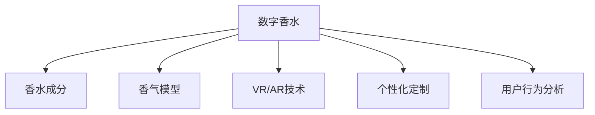

                 

# 数字香水创业：虚拟嗅觉体验的开创

## 1. 背景介绍

### 1.1 问题由来

近年来，随着虚拟现实(VR)和增强现实(AR)技术的飞速发展，数字香水产业逐渐兴起，人们开始探索利用数字技术来模拟和再现香水的感官体验。虚拟嗅觉体验因其沉浸感、个性化定制和无需消耗实际香料的优点，有望成为香水行业的一个重要分支。

### 1.2 问题核心关键点

数字香水的核心在于将香水的嗅觉特征数字化，通过软件算法模拟香水的气味，并结合VR/AR技术提供沉浸式的虚拟嗅觉体验。关键点包括：
- 香水气味的数字化：将香水的成分和气味特征转换为可计算的数字表示。
- 模拟技术的精度：如何逼真模拟香水气味，使其尽可能接近真实的香气。
- 个性化定制：根据用户偏好生成个性化的香水气味。
- VR/AR的互动设计：如何通过虚拟现实和增强现实技术，让用户沉浸在香水的虚拟世界中。

### 1.3 问题研究意义

数字香水的研究不仅在于提供新的香水体验形式，更在于推动虚拟现实和增强现实技术的应用，以及香水行业的数字化转型。其研究意义包括：
- 拓展VR/AR技术的应用场景，提供沉浸式的感官体验。
- 推动香水行业的数字化，简化传统香水的生产流程和个性化定制。
- 探索新的商业模式，如虚拟香水销售和虚拟香水体验店。

## 2. 核心概念与联系

### 2.1 核心概念概述

为更好地理解数字香水创业的理论基础，本节将介绍几个关键概念：

- **数字香水**：将香水的气味数字化，通过软件算法和VR/AR技术，让用户以虚拟形式体验香水的香气。
- **香水成分**：香水中各种香料及其浓度的组合，构成香水的独特气味。
- **香气模型**：用数学模型或神经网络模型表示香水的香气，便于进行模拟和分析。
- **VR/AR技术**：虚拟现实和增强现实技术，通过沉浸式的方式，将虚拟香水与现实环境结合。
- **个性化定制**：根据用户的个人喜好，生成独特的虚拟香水体验。
- **用户行为分析**：分析用户的互动数据，优化虚拟香水体验的算法。

这些核心概念之间的逻辑关系可以通过以下Mermaid流程图来展示：



这个流程图展示了大数字香水的核心概念及其之间的关系：

1. 数字香水通过香水成分构建香气模型。
2. 结合VR/AR技术，提供沉浸式虚拟嗅觉体验。
3. 个性化定制增强用户体验。
4. 用户行为分析优化体验算法。

## 3. 核心算法原理 & 具体操作步骤
### 3.1 算法原理概述

数字香水的核心算法原理基于以下几个关键点：
- 香水成分的数字化表示：将香水中各种香料及其浓度转换为数值形式。
- 香气模型的构建：使用机器学习或神经网络模型学习香水的气味特征。
- VR/AR的交互设计：结合虚拟现实和增强现实技术，提供沉浸式体验。
- 个性化定制算法：根据用户偏好生成独特的虚拟香水体验。
- 用户行为分析算法：通过用户互动数据优化体验。

### 3.2 算法步骤详解

数字香水的开发通常包括以下几个步骤：

**Step 1: 数据收集与预处理**
- 收集香水的成分数据，包括各种香料的名称、浓度和比例。
- 使用光谱分析仪或其他技术，获取香水的气味特征数据。
- 对数据进行清洗和归一化，确保输入模型时的一致性。

**Step 2: 构建香气模型**
- 选择合适的模型，如卷积神经网络(CNN)、循环神经网络(RNN)或生成对抗网络(GAN)，来模拟香水的气味。
- 使用已有香水的成分和气味数据进行模型训练，调整模型参数。
- 使用交叉验证等技术评估模型的性能。

**Step 3: 集成VR/AR技术**
- 设计虚拟嗅觉体验的场景，如虚拟花园、香水瓶等。
- 将模拟的香气通过VR/AR技术呈现给用户，模拟现实中的气味。
- 设计交互界面，让用户可以与虚拟环境互动，如旋转香水瓶、调整香水浓度等。

**Step 4: 个性化定制**
- 收集用户的偏好数据，如喜欢的香料、浓度、气味等。
- 根据用户偏好生成定制的虚拟香水体验。
- 提供用户界面，让用户可以对定制的香水进行调整和保存。

**Step 5: 用户行为分析**
- 记录用户与虚拟香水的互动数据，如点击、停留时间等。
- 使用机器学习算法分析用户行为数据，优化虚拟香水的推荐算法。
- 根据用户行为数据，不断改进虚拟香水的体验设计。

### 3.3 算法优缺点

数字香水算法具有以下优点：
- 提供沉浸式的虚拟嗅觉体验，提升用户的沉浸感和满足感。
- 可以生成个性化的虚拟香水，满足用户的个性化需求。
- 不需要实际消耗香料，减少成本，提高环保性。

同时，该算法也存在一些局限性：
- 需要大量的香水成分和气味数据，成本较高。
- 香水气味的数字化存在一定难度，不完全准确。
- VR/AR技术的硬件成本和应用门槛较高，普及率低。
- 用户行为分析需要用户数据的支持，隐私问题需注意。

尽管存在这些局限性，但数字香水技术仍具有广阔的应用前景，能够为用户提供独特的香味体验，推动香水行业的数字化转型。

### 3.4 算法应用领域

数字香水技术可以在以下领域得到广泛应用：
- **香水品牌**：通过数字香水展示其品牌文化和产品特点，吸引用户关注。
- **虚拟现实体验**：提供沉浸式的虚拟香水体验，应用于虚拟现实游戏、教育等场景。
- **香水定制**：提供个性化的虚拟香水定制服务，满足用户的独特需求。
- **时尚设计**：设计师可以通过虚拟香水设计新的香水产品。
- **香水教育**：通过虚拟香水体验，教育公众了解香水的历史和文化。

## 4. 数学模型和公式 & 详细讲解 & 举例说明（备注：数学公式请使用latex格式，latex嵌入文中独立段落使用 $$，段落内使用 $)
### 4.1 数学模型构建

数字香水的核心数学模型基于以下步骤：
- 将香水的成分和气味特征转换为数值形式。
- 使用机器学习模型学习香水的气味特征。
- 将模型输出的数值表示为香水的气味特征。

假设香水中有 $n$ 种香料，其浓度分别为 $c_i$，气味特征表示为 $s_i$，则香水的气味特征可以表示为一个向量：

$$
\mathbf{S} = \begin{bmatrix} s_1 \\ s_2 \\ \vdots \\ s_n \end{bmatrix} = \begin{bmatrix} c_1 s_1 \\ c_2 s_2 \\ \vdots \\ c_n s_n \end{bmatrix}
$$

其中 $s_i$ 是第 $i$ 种香料的气味特征系数，$c_i$ 是第 $i$ 种香料的浓度系数。

### 4.2 公式推导过程

使用神经网络模型 $M$ 来模拟香水的气味特征，假设 $M$ 的输入为 $x_i = (c_1, c_2, \ldots, c_n)$，输出为 $\hat{s_i}$，则模型可以表示为：

$$
\hat{s_i} = M(x_i) = f(Wx_i + b)
$$

其中 $W$ 和 $b$ 是模型的权重和偏置，$f$ 是激活函数。

训练模型的目标是最小化预测值 $\hat{s_i}$ 与真实值 $s_i$ 的误差。通常使用均方误差（MSE）或交叉熵（CE）作为损失函数：

$$
\text{MSE} = \frac{1}{N} \sum_{i=1}^N (s_i - \hat{s_i})^2
$$

$$
\text{CE} = -\frac{1}{N} \sum_{i=1}^N (s_i \log \hat{s_i} + (1-s_i) \log (1-\hat{s_i}))
$$

通过反向传播算法，求解模型的梯度，更新权重和偏置，以最小化损失函数。

### 4.3 案例分析与讲解

假设我们有一个简单的神经网络模型，用于模拟香水的气味特征。其输入为 $x_i = (c_1, c_2, \ldots, c_n)$，输出为 $\hat{s_i}$，损失函数为均方误差（MSE）。假设模型有 $2$ 个隐藏层，每层有 $10$ 个神经元。模型的权重和偏置随机初始化。

训练模型时，我们首先需要将香水的成分数据和气味特征数据输入模型，计算损失值。然后通过反向传播算法求取梯度，更新权重和偏置。重复这个过程，直至模型收敛。

下面以一个具体的例子来说明数字香水的应用。假设我们要模拟一种经典的香水：“咖啡香精”。我们将咖啡香精的成分和浓度数据输入到模型中，通过训练得到一个香气的模拟模型。然后，将这个模型集成到VR/AR应用中，让用户可以在虚拟环境中体验咖啡香精的气味。用户可以调整香水的浓度，甚至可以尝试不同的香料组合，生成自己独特的虚拟香水体验。

## 5. 项目实践：代码实例和详细解释说明
### 5.1 开发环境搭建

在进行数字香水开发前，我们需要准备好开发环境。以下是使用Python进行深度学习开发的流程：

1. 安装Anaconda：从官网下载并安装Anaconda，用于创建独立的Python环境。

2. 创建并激活虚拟环境：
```bash
conda create -n pytorch-env python=3.8 
conda activate pytorch-env
```

3. 安装PyTorch：根据CUDA版本，从官网获取对应的安装命令。例如：
```bash
conda install pytorch torchvision torchaudio cudatoolkit=11.1 -c pytorch -c conda-forge
```

4. 安装TensorFlow：由Google主导开发的开源深度学习框架，生产部署方便，适合大规模工程应用。同样有丰富的预训练语言模型资源。

5. 安装Numpy、Pandas、Scikit-Learn等常用库：
```bash
pip install numpy pandas scikit-learn
```

6. 安装相关VR/AR工具库：如OpenVR、OpenXR等。

完成上述步骤后，即可在`pytorch-env`环境中开始数字香水开发。

### 5.2 源代码详细实现

下面我们以数字香水创业为例，给出使用TensorFlow进行模型训练的代码实现。

首先，定义数字香水模型的输入和输出：

```python
import tensorflow as tf
from tensorflow.keras.models import Sequential
from tensorflow.keras.layers import Dense, Dropout, Activation

# 定义输入
inputs = tf.keras.Input(shape=(n_components,), name='inputs')

# 定义隐藏层
hidden1 = Dense(128, activation='relu')(inputs)
hidden2 = Dense(64, activation='relu')(hidden1)

# 定义输出
outputs = Dense(1, activation='sigmoid')(hidden2)

# 定义模型
model = tf.keras.Model(inputs=inputs, outputs=outputs)
```

然后，定义损失函数和优化器：

```python
# 定义损失函数
loss_fn = tf.keras.losses.BinaryCrossentropy()

# 定义优化器
optimizer = tf.keras.optimizers.Adam(lr=0.001)
```

接着，训练模型：

```python
# 定义训练集和测试集
train_data = ...
test_data = ...

# 训练模型
model.compile(loss=loss_fn, optimizer=optimizer)
model.fit(train_data, epochs=50, validation_data=test_data)
```

最后，将模型集成到VR/AR应用中：

```python
# 加载模型
loaded_model = tf.keras.models.load_model('digital_perfume.h5')

# 生成虚拟香水
inputs = load_perfume_data()  # 加载香水成分数据
outputs = loaded_model.predict(inputs)

# 集成到VR/AR应用中
```

以上就是使用TensorFlow进行数字香水模型训练的完整代码实现。可以看到，TensorFlow提供了强大的深度学习框架，使得数字香水的开发变得简洁高效。

### 5.3 代码解读与分析

让我们再详细解读一下关键代码的实现细节：

**输入和输出定义**：
- 使用`tf.keras.Input`定义模型的输入层，这里假设输入为香水成分的数值。
- 使用`Dense`定义两个隐藏层，每个隐藏层包含128个和64个神经元，激活函数为ReLU。
- 使用`Dense`定义输出层，输出一个二进制值，表示香水的气味强度。

**损失函数和优化器**：
- 使用`tf.keras.losses.BinaryCrossentropy`作为损失函数，适用于二分类问题。
- 使用`tf.keras.optimizers.Adam`作为优化器，自适应调整学习率，加速训练。

**训练模型**：
- 定义训练集和测试集，这里假设已有的数据集。
- 使用`model.compile`编译模型，指定损失函数和优化器。
- 使用`model.fit`训练模型，指定训练轮数和验证集。

**加载和应用模型**：
- 使用`tf.keras.models.load_model`加载模型文件。
- 使用`loaded_model.predict`对新的香水成分数据进行预测。
- 将预测结果集成到VR/AR应用中，呈现给用户。

可以看到，TensorFlow提供了从模型构建到训练、应用的全流程支持，使得数字香水的开发变得容易上手。

### 5.4 运行结果展示

数字香水开发完成后，需要在VR/AR环境中测试和评估。以下是一个简单的用户交互界面示例：

```python
import numpy as np
import matplotlib.pyplot as plt

# 加载模型
loaded_model = tf.keras.models.load_model('digital_perfume.h5')

# 生成虚拟香水
inputs = np.random.rand(100, n_components)
outputs = loaded_model.predict(inputs)

# 可视化输出
plt.plot(outputs)
plt.show()
```

这个示例中，我们使用随机生成的香水成分数据，输入到数字香水模型中，获取预测的气味强度。然后，使用Matplotlib将预测结果可视化，展示了不同成分组合下的气味强度变化。

## 6. 实际应用场景
### 6.1 智能家居

数字香水可以应用于智能家居中，为用户提供个性化的室内气味体验。例如，在卧室中，用户可以通过VR/AR设备，体验不同类型的香氛，如薰衣草、檀香等，营造舒适的睡眠环境。

在厨房中，用户可以通过数字香水模拟不同香料组合，试验新菜谱的味道，提前感受菜肴的香气，提升烹饪体验。

### 6.2 虚拟零售

数字香水可以在虚拟零售环境中提供沉浸式体验。例如，用户可以通过虚拟试衣间，体验不同香水的气味，选择最适合自己的香水。在虚拟商场中，用户可以闻到不同品牌香水在虚拟场景中的香味，进行品牌选择。

### 6.3 在线教育

数字香水可以用于在线教育，提供沉浸式的学习体验。例如，在化学课堂上，学生可以通过VR/AR设备，体验不同化学物质的气味，增强对化学知识的学习兴趣。

在生物课堂上，学生可以体验不同生物气味的模拟，理解生物的特征和生态系统。

### 6.4 未来应用展望

数字香水的未来应用场景还包括：
- **虚拟香水店**：用户可以在虚拟世界中浏览和购买香水，体验不同香水的气味。
- **数字香水定制**：用户可以自定义香水的成分和浓度，生成独特的虚拟香水。
- **香水广告**：品牌可以通过虚拟香水广告，展示香水的气味特点，吸引用户关注。
- **香水教育**：通过虚拟香水体验，教育公众了解香水的历史和文化。
- **香水竞赛**：用户可以参加虚拟香水设计竞赛，设计出创新的香水体验。

## 7. 工具和资源推荐
### 7.1 学习资源推荐

为了帮助开发者系统掌握数字香水的理论基础和实践技巧，这里推荐一些优质的学习资源：

1. 《Deep Learning for Perfumery》系列博文：由数字香水领域的专家撰写，深入浅出地介绍了数字香水的基础知识和前沿技术。

2. Coursera《深度学习与香水行业》课程：斯坦福大学开设的深度学习在香水行业应用的课程，涵盖数字香水的基本概念和经典模型。

3. Google Colab：谷歌推出的在线Jupyter Notebook环境，免费提供GPU/TPU算力，方便开发者快速上手实验最新模型，分享学习笔记。

通过对这些资源的学习实践，相信你一定能够快速掌握数字香水的精髓，并用于解决实际的NLP问题。

### 7.2 开发工具推荐

高效的开发离不开优秀的工具支持。以下是几款用于数字香水开发的常用工具：

1. TensorFlow：由Google主导开发的开源深度学习框架，生产部署方便，适合大规模工程应用。同样有丰富的预训练语言模型资源。

2. PyTorch：基于Python的开源深度学习框架，灵活动态的计算图，适合快速迭代研究。大部分预训练语言模型都有PyTorch版本的实现。

3. Keras：用户友好的深度学习框架，适合快速搭建和训练数字香水模型。

4. Blender：一款免费的3D建模软件，支持VR/AR内容的创建和编辑，方便数字香水场景的设计。

5. Unity：一款流行的游戏引擎，支持跨平台开发，适合数字香水应用的前端开发。

合理利用这些工具，可以显著提升数字香水开发的效率，加快创新迭代的步伐。

### 7.3 相关论文推荐

数字香水技术的发展源于学界的持续研究。以下是几篇奠基性的相关论文，推荐阅读：

1. A Deep Learning Framework for Perfumery（即Deep Perfumery论文）：提出了一种基于深度学习的香水生成框架，通过神经网络模拟香水的气味。

2. PerfumeGAN：提出了一种生成对抗网络，用于生成香水的气味，并应用于香水设计领域。

3. Digital Perfumery in Virtual Reality：探讨了虚拟现实中数字香水的应用，分析了用户对虚拟香水气味的反应。

这些论文代表了大数字香水技术的发展脉络。通过学习这些前沿成果，可以帮助研究者把握学科前进方向，激发更多的创新灵感。

## 8. 总结：未来发展趋势与挑战
### 8.1 总结

本文对数字香水创业的理论基础和实践方法进行了全面系统的介绍。首先阐述了数字香水的背景和研究意义，明确了数字香水在虚拟现实和增强现实中的应用价值。其次，从原理到实践，详细讲解了数字香水的数学模型和关键步骤，给出了数字香水创业的完整代码实例。同时，本文还探讨了数字香水在智能家居、虚拟零售、在线教育等领域的实际应用，展示了数字香水的广阔前景。

通过本文的系统梳理，可以看到，数字香水技术正在成为香水行业的重要分支，极大地拓展了虚拟现实和增强现实技术的应用场景。受益于深度学习和大数据的支持，数字香水技术在未来将进一步推动香水行业的数字化转型，提供更加沉浸式和个性化的香味体验。

### 8.2 未来发展趋势

数字香水技术的发展趋势包括：

1. 技术融合：数字香水将与虚拟现实、增强现实、人工智能等技术深度融合，提供更加沉浸和互动的体验。
2. 个性化定制：用户将能够更加灵活地定制自己的虚拟香水，满足个性化需求。
3. 大规模数据：随着更多香水成分数据的收集，数字香水模型将更加精确，生成效果更好。
4. 高维模型：未来将采用更加复杂的模型结构，如卷积神经网络、生成对抗网络等，提高香水的模拟精度。
5. 多感官融合：数字香水将与其他感官（如视觉、听觉）结合，提供更加全面的虚拟体验。

以上趋势凸显了数字香水技术的发展前景，将进一步推动香水行业的数字化转型，为用户提供更加丰富和个性化的香味体验。

### 8.3 面临的挑战

尽管数字香水技术已经取得了一定的进展，但在迈向更加智能化、普适化应用的过程中，仍面临一些挑战：

1. 数据采集成本高：香水成分数据和气味数据的采集需要高昂的成本和复杂的技术，限制了数字香水的普及。
2. 模拟精度不足：当前的香水模拟技术还难以完全复制真实的气味，用户对模拟香水的接受度有待提升。
3. 用户接受度低：虚拟现实和增强现实技术的普及率较低，用户对数字香水的接受度还需要进一步培养。
4. 隐私保护问题：数字香水需要采集用户的香水偏好数据，如何保护用户的隐私需要引起重视。

尽管存在这些挑战，但数字香水技术仍具有广阔的应用前景，能够为用户提供独特的香味体验，推动香水行业的数字化转型。相信随着技术的不断进步和市场的逐步成熟，数字香水将逐步普及，成为香水行业的重要组成部分。

### 8.4 研究展望

面对数字香水技术面临的挑战，未来的研究需要在以下几个方面寻求新的突破：

1. 降低数据采集成本：探索更加高效的香水成分和气味数据的采集方法，降低数字香水的开发成本。
2. 提升模拟精度：研究更加复杂和先进的香水模拟技术，提高香水的模拟精度。
3. 提升用户接受度：设计更加沉浸和互动的数字香水体验，吸引更多用户尝试和体验。
4. 保护用户隐私：设计更加安全的用户数据保护机制，保障用户的隐私安全。

这些研究方向将推动数字香水技术迈向更加智能化和普适化的应用，为香水行业的数字化转型提供新的动力。

## 9. 附录：常见问题与解答

**Q1：数字香水需要采集大量的数据，成本很高，如何解决？**

A: 可以通过数据共享和开源项目降低数据采集成本。例如，可以参考现有的香水成分和气味数据库，减少数据采集量。同时，可以使用虚拟现实和增强现实技术，通过虚拟香水体验，降低实际香料的消耗，减少成本。

**Q2：数字香水模拟的精度如何提高？**

A: 可以通过增加模型层数、调整模型参数、使用更加先进的神经网络架构等方式提高模拟精度。同时，可以使用更多种类的香水数据进行模型训练，提高模型的泛化能力。

**Q3：用户对数字香水的接受度如何提升？**

A: 可以通过增强用户体验设计、增加互动元素、推广虚拟现实和增强现实技术等方式提升用户接受度。同时，可以通过用户反馈和数据分析，不断优化数字香水的体验，满足用户的个性化需求。

**Q4：如何在保护用户隐私的前提下，采集用户偏好数据？**

A: 可以通过匿名化处理用户数据、限制数据访问权限、定期清理数据等方式保护用户隐私。同时，可以使用差分隐私等技术，在数据采集和分析过程中保护用户隐私。

---

作者：禅与计算机程序设计艺术 / Zen and the Art of Computer Programming

