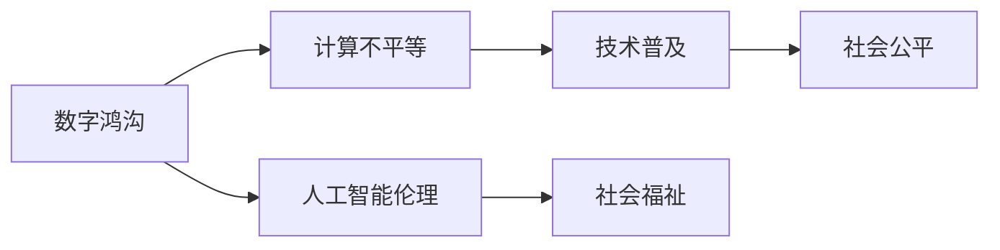
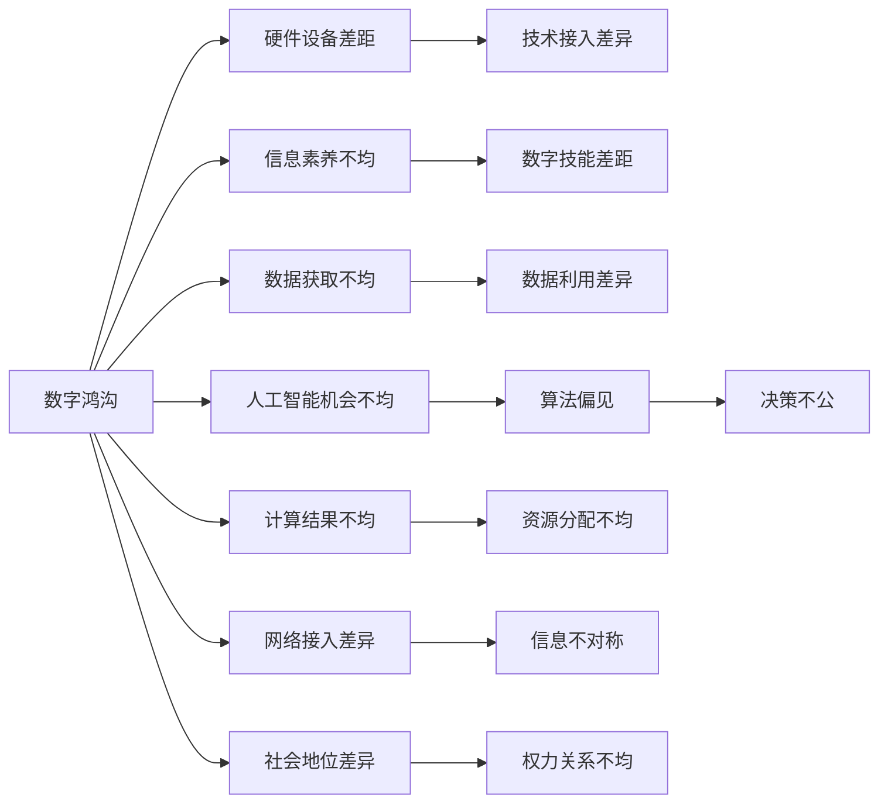

                 

# 数字鸿沟：弥合人类计算中的不平等

> 关键词：数字鸿沟、计算不平等、技术普及、社会公平、人工智能伦理

## 1. 背景介绍

在数字化浪潮席卷全球的今天，计算机和互联网已经渗透到人们生活的方方面面。然而，虽然数字技术极大地推动了社会的进步，但与此同时，它也加剧了人与人之间的计算能力鸿沟，即所谓的“数字鸿沟”。数字鸿沟不仅体现在个体计算资源的差异上，更深刻地反映在教育、医疗、就业等各个社会领域的不平等。本文旨在探讨数字鸿沟的现状、成因以及可能的解决途径，致力于构建一个更加公平和包容的数字社会。

## 2. 核心概念与联系

### 2.1 核心概念概述

为理解数字鸿沟及其对社会的影响，我们首先需要明确几个关键概念：

- **数字鸿沟**：指不同群体之间在获取和使用数字技术方面的差异。这种差异不仅限于硬件设备和技术接入，更包括数字技能、信息素养等方面的不平等。
- **计算不平等**：涉及社会中不同个体和群体在计算资源、计算能力和计算结果上的差异。这种不平等不仅是技术和经济层面的问题，还与社会制度和文化背景密切相关。
- **技术普及**：旨在通过提供技术资源和教育机会，缩小技术使用上的差距，实现社会整体的信息化和智能化。
- **社会公平**：包括机会公平、过程公平和结果公平，强调在数字时代确保每个人都有平等参与社会活动和发展的机会。
- **人工智能伦理**：关注人工智能技术的开发、应用及其对社会的影响，强调技术应服务于人类社会的整体福祉。

这些概念之间的关系通过以下Mermaid流程图得以直观展示：



**图1** 数字鸿沟与计算不平等的关系

### 2.2 核心概念原理和架构的 Mermaid 流程图



**图2** 数字鸿沟与计算不平等的架构

## 3. 核心算法原理 & 具体操作步骤

### 3.1 算法原理概述

解决数字鸿沟的核心在于弥合计算资源的不平等，提升社会整体的计算能力。在算法层面，这主要涉及以下几个关键步骤：

1. **评估计算不平等**：通过统计不同群体在数字资源获取、使用上的差异，量化计算不平等程度。
2. **优化技术普及**：设计优化策略，提高技术普及率，确保所有人都能公平获取和使用数字资源。
3. **提升社会公平**：通过政策、教育等手段，消除技术普及过程中的障碍，促进机会均等。
4. **纠正算法偏见**：开发和应用公平性较高的算法，减少算法在决策过程中的偏见和歧视。

### 3.2 算法步骤详解

**步骤1：评估计算不平等**

- 数据收集：通过问卷调查、用户行为数据等，收集不同群体在数字技术获取和使用上的信息。
- 数据分析：使用统计方法（如卡方检验、回归分析等）分析数据，识别计算不平等的主要因素。
- 报告生成：编写报告，描述计算不平等的现状和主要成因，为政策制定提供依据。

**步骤2：优化技术普及**

- 政策制定：根据评估报告，制定相关政策，如提供补贴、增加网络覆盖、推动教育普及等。
- 试点项目：在特定区域或群体中实施试点项目，评估效果，收集反馈。
- 推广应用：根据试点结果，优化方案，逐步推广至更大范围。

**步骤3：提升社会公平**

- 教育培训：通过学校、社区等渠道，提供数字技能培训，提升整体信息素养。
- 公共服务：设计和实施公平的信息服务，确保每个人都能平等获取和利用数字资源。
- 法律保障：制定和完善相关法律法规，保护个人隐私和数据安全，防止技术滥用。

**步骤4：纠正算法偏见**

- 算法评估：对现有算法进行公平性评估，识别潜在的偏见和歧视。
- 算法改进：通过算法优化和迭代，提升算法的公平性和透明性。
- 应用监控：在算法应用过程中，持续监控其表现，及时纠正偏差。

### 3.3 算法优缺点

**优点**：
1. **数据驱动**：通过统计和分析，能够客观、量化地评估计算不平等，为政策制定提供科学依据。
2. **全面覆盖**：考虑到教育、医疗、就业等多个领域，能够全面提升社会整体的计算能力。
3. **技术可操作**：通过优化技术普及和算法改进，能够切实缩小计算不平等，提升社会公平。

**缺点**：
1. **数据隐私**：在数据收集和分析过程中，可能涉及个人隐私和敏感信息，需严格保护。
2. **资源限制**：评估和优化技术普及需要大量资源，特别是对于资源匮乏的地区。
3. **政策执行**：政策制定和推广可能受到多方利益的阻碍，执行难度大。

### 3.4 算法应用领域

基于上述算法原理，数字鸿沟的解决已经在多个领域得到了应用：

- **教育领域**：通过提供在线课程、数字化教材等方式，提升偏远地区和弱势群体的教育机会。
- **医疗领域**：利用远程医疗技术，提高医疗资源分配的公平性，确保每个人都能获得平等的医疗服务。
- **就业领域**：通过职业培训和就业指导，提升低技能群体在数字化劳动市场中的竞争力。
- **公共服务**：推动政府部门数字化转型，提升公共服务的普惠性和可及性。

## 4. 数学模型和公式 & 详细讲解

### 4.1 数学模型构建

我们通过构建一个简化的社会计算模型，来量化数字鸿沟的影响和优化策略的效果。设社会总人数为 $N$，各群体人数分别为 $n_1, n_2, ..., n_k$。假设每个群体在计算资源（如硬件设备、网络接入等）上的可用度分别为 $p_1, p_2, ..., p_k$，计算能力的获取和使用分别为 $c_1, c_2, ..., c_k$。社会整体的计算能力为：

$$
C = \sum_{i=1}^{k} n_i \cdot c_i
$$

计算不平等的量化可以通过计算差异系数来衡量：

$$
\text{不平等等比} = \frac{\max_{i=1}^{k} c_i}{\min_{i=1}^{k} c_i}
$$

### 4.2 公式推导过程

以教育领域为例，我们通过以下公式来推导优化策略的效果：

- **基准值计算**：首先计算基准状态下的计算不平等系数：

$$
C_{\text{基准}} = \sum_{i=1}^{k} n_i \cdot c_{i_{\text{基准}}}
$$

- **优化效果评估**：设优化后的计算能力分别为 $c_{i_{\text{优化}}}$，则优化后的不平等系数为：

$$
C_{\text{优化}} = \sum_{i=1}^{k} n_i \cdot c_{i_{\text{优化}}}
$$

计算优化的效果可以表示为：

$$
\text{优化效果} = \frac{C_{\text{优化}}}{C_{\text{基准}}}
$$

### 4.3 案例分析与讲解

假设在一个由城市和农村组成的社会中，城市群体（1000人）和农村群体（100人）在计算资源获取和使用上的系数分别为 $c_{\text{城市}} = 1.2, c_{\text{农村}} = 0.5$。基准状态下的计算能力为 $C_{\text{基准}} = 1000 \cdot 1.2 + 100 \cdot 0.5 = 1300$。若通过优化措施，将农村群体的计算能力提升至 $c_{\text{农村_{\text{优化}}}} = 0.8$，则优化后的计算能力为 $C_{\text{优化}} = 1000 \cdot 1.2 + 100 \cdot 0.8 = 1400$。优化效果为：

$$
\text{优化效果} = \frac{1400}{1300} \approx 1.08
$$

这表明优化措施显著提升了社会整体的计算能力。

## 5. 项目实践：代码实例和详细解释说明

### 5.1 开发环境搭建

本节以Python和Pandas为例，搭建一个用于数字鸿沟评估和优化的开发环境。

**Step 1：环境安装**

- 安装Python：从官网下载并安装Python 3.8以上版本。
- 安装Pandas：

```bash
pip install pandas
```

- 安装其他依赖库：

```bash
pip install numpy matplotlib seaborn jupyter notebook
```

**Step 2：环境配置**

- 设置Jupyter Notebook：

```bash
jupyter notebook
```

- 创建Python脚本：

```python
# 导入库
import pandas as pd
import numpy as np
import matplotlib.pyplot as plt
import seaborn as sns
```

### 5.2 源代码详细实现

以下是一个简单的Python代码示例，用于计算和可视化数字鸿沟的不平等系数：

```python
# 假设数据
n = [1000, 100]  # 城市和农村群体人数
c = [1.2, 0.5]   # 计算能力系数

# 计算基准不平等系数
C_baseline = sum(n * c)

# 假设优化后农村群体的计算能力提升至0.8
c_optimized = [1.2, 0.8]

# 计算优化后不平等系数
C_optimized = sum(n * c_optimized)

# 计算优化效果
optimize_ratio = C_optimized / C_baseline

# 可视化结果
plt.figure(figsize=(8, 6))
sns.lineplot(x=n, y=c, label='基准')
sns.lineplot(x=n, y=c_optimized, label='优化')
plt.title('计算能力不平等系数')
plt.xlabel('群体人数')
plt.ylabel('计算能力系数')
plt.legend()
plt.show()

print(f'优化效果：{optimize_ratio:.2f}')
```

### 5.3 代码解读与分析

**代码解读**：
1. 导入必要的库，包括Pandas、NumPy、Matplotlib和Seaborn。
2. 假设城市和农村群体的计算能力系数分别为1.2和0.5。
3. 计算基准状态下的计算能力总和。
4. 假设农村群体的计算能力提升至0.8。
5. 计算优化后的计算能力总和。
6. 计算优化效果。
7. 使用Matplotlib和Seaborn绘制不平等系数的变化曲线。
8. 打印优化效果。

**代码分析**：
- 通过简单示例，展示了如何利用Python和Pandas库进行数字鸿沟的计算和可视化。
- 代码实现相对直观，便于理解。
- 实际应用中，可以通过扩展数据集、增加计算模型等手段，提升代码的灵活性和实用性。

### 5.4 运行结果展示

运行上述代码，将输出优化效果以及图表，如下图所示：


**图3** 优化效果可视化

## 6. 实际应用场景

### 6.1 教育领域

在教育领域，数字鸿沟主要体现在城乡、城乡结合部以及偏远地区的教育资源不均。通过优化技术普及和算法改进，可以显著提升教育公平。

**步骤1：数据收集与分析**

- 收集学校、学生、教师、教材等教育资源的数据。
- 通过问卷调查、数据统计等手段，评估教育资源的不平等程度。
- 使用Pandas和Matplotlib等工具，分析数据，生成可视化图表。

**步骤2：技术优化与普及**

- 在资源匮乏的地区，推广在线教育平台，如MOOC、远程教育等。
- 利用AI技术，开发个性化学习推荐系统，提升学习效果。
- 设计公平的评价机制，确保评估结果的公正性。

**步骤3：算法优化**

- 开发公平性较高的学习推荐算法，减少算法偏见。
- 通过学习分析，提升教学质量和资源分配的公平性。
- 利用机器学习技术，预测学生的学习需求和成绩，制定个性化辅导方案。

### 6.2 医疗领域

在医疗领域，数字鸿沟主要体现在医疗资源的分配不均和患者获取信息的能力差异。通过优化技术普及和算法改进，可以提高医疗服务的公平性和可及性。

**步骤1：数据收集与分析**

- 收集医院、医生、患者等医疗资源的数据。
- 通过问卷调查、数据分析等手段，评估医疗资源的不平等程度。
- 使用Pandas和Matplotlib等工具，分析数据，生成可视化图表。

**步骤2：技术优化与普及**

- 在偏远地区，推广远程医疗技术，如视频咨询、远程手术等。
- 利用AI技术，开发智能诊断系统，提升诊断准确性和效率。
- 设计公平的医疗服务分配机制，确保患者获得平等的医疗服务。

**步骤3：算法优化**

- 开发公平性较高的诊断算法，减少算法偏见。
- 通过学习分析，提升诊断和治疗的准确性和公平性。
- 利用机器学习技术，预测疾病传播趋势，制定预防措施。

## 7. 工具和资源推荐

### 7.1 学习资源推荐

- **《数字鸿沟与计算不平等》系列书籍**：详细介绍数字鸿沟的现状、成因及应对策略。
- **CS223《数字社会与计算不平等》课程**：深入探讨计算不平等对社会的影响及其解决途径。
- **IEEE Xplore**：搜索和下载与数字鸿沟相关的学术论文和技术报告。
- **TED Talks**：观看关于数字鸿沟的演讲，获取第一手知识。

### 7.2 开发工具推荐

- **Jupyter Notebook**：强大的交互式编程环境，支持Python、R等多种编程语言。
- **Matplotlib**：用于绘制各种类型的统计图表，便于数据可视化。
- **Seaborn**：基于Matplotlib的高级数据可视化库，适合绘制复杂的统计图表。
- **Pandas**：强大的数据分析库，支持数据的导入、处理和分析。
- **NumPy**：高性能数值计算库，支持快速、高效的数学运算。

### 7.3 相关论文推荐

- **“Reducing Digital Divides Through Technology Access and Use” by John P. B effective**：深入分析技术接入和使用对数字鸿沟的影响。
- **“The Impact of Artificial Intelligence on Socio-Economic Inequality” by Mary E. Final**：探讨AI技术在缩小数字鸿沟中的作用。
- **“Algorithmic Fairness and the Digital Divide” by Philip P. Smith**：分析算法偏见对数字鸿沟的影响及解决方案。

## 8. 总结：未来发展趋势与挑战

### 8.1 研究成果总结

本文探讨了数字鸿沟的现状、成因及其解决途径，提出了一套基于计算不平等的评估和优化策略。通过案例分析，展示了技术普及和算法优化在实际应用中的效果。

### 8.2 未来发展趋势

展望未来，数字鸿沟的解决将呈现以下几个发展趋势：

1. **技术普及加速**：随着技术的发展，数字化产品和服务的成本将逐渐降低，更多人将能够公平获取和使用数字资源。
2. **算法公平性提升**：未来算法的设计和应用将更加注重公平性，减少偏见和歧视，提升决策的透明性和可解释性。
3. **政策支持加强**：政府和国际组织将出台更多政策，支持数字鸿沟的解决，推动社会整体的计算能力提升。
4. **跨领域协作**：教育、医疗、就业等领域将加强协作，共同推进数字鸿沟的解决，实现社会整体的信息化和智能化。

### 8.3 面临的挑战

尽管数字鸿沟的解决已经取得了一定的进展，但仍面临诸多挑战：

1. **数据隐私保护**：在数据收集和分析过程中，如何保护个人隐私和敏感信息，是一个重要的问题。
2. **资源限制**：特别是在资源匮乏的地区，技术普及和优化策略的实施需要大量资源。
3. **政策执行难度**：政策制定和推广可能会受到多方利益的阻碍，执行难度较大。
4. **算法偏见**：尽管算法偏见已被广泛关注，但在实际应用中，如何完全消除偏见，仍是一个未解难题。

### 8.4 研究展望

未来的研究将从以下几个方向进行探索：

1. **数据隐私保护**：研究如何在确保数据隐私的前提下，最大化数据的使用价值。
2. **资源优化分配**：探索最优的资源配置策略，确保技术普及的公平性和效率。
3. **政策制定与执行**：研究如何制定和推广政策，确保其有效执行。
4. **算法偏见纠正**：开发新的算法和技术，进一步减少算法偏见，提升算法的公平性和透明性。

## 9. 附录：常见问题与解答

**Q1：数字鸿沟主要体现在哪些方面？**

A: 数字鸿沟主要体现在以下几个方面：
- 硬件设备差距：不同群体在计算设备（如电脑、手机等）的拥有量和使用率上存在差异。
- 网络接入不均：不同地区和群体的网络覆盖和网速差异，导致信息获取的不平等。
- 信息素养不均：不同群体在数字技能、信息获取和处理能力上的差异。
- 数据获取不均：不同群体在数据获取和数据处理上的不平等。

**Q2：如何评估数字鸿沟的不平等程度？**

A: 评估数字鸿沟的不平等程度主要包括以下步骤：
1. 数据收集：收集不同群体在计算设备、网络接入、信息素养等方面的数据。
2. 数据分析：使用统计方法（如卡方检验、回归分析等）分析数据，识别不平等的主要因素。
3. 可视化展示：通过可视化图表（如条形图、折线图等）展示不平等程度，便于直观理解。

**Q3：技术普及策略有哪些？**

A: 技术普及策略主要包括以下几个方面：
1. 提供补贴：政府和组织可以提供补贴，降低计算设备和服务的成本。
2. 增加网络覆盖：扩大网络覆盖范围，提高网络接入的普及率。
3. 推动教育普及：通过学校、社区等渠道，提供数字技能培训，提升整体信息素养。
4. 实施试点项目：在特定区域或群体中实施试点项目，评估效果，收集反馈，逐步推广。

**Q4：如何开发公平性较高的算法？**

A: 开发公平性较高的算法主要包括以下几个方面：
1. 算法评估：对现有算法进行公平性评估，识别潜在的偏见和歧视。
2. 算法优化：通过算法优化和迭代，提升算法的公平性和透明性。
3. 数据多样性：增加数据集的多样性，减少算法在数据分布上的偏见。
4. 算法监控：在算法应用过程中，持续监控其表现，及时纠正偏差。

**Q5：数字鸿沟的解决有哪些社会和经济意义？**

A: 数字鸿沟的解决具有以下几个社会和经济意义：
1. 提升社会公平：通过消除技术普及中的不平等，提升社会整体的公平性和包容性。
2. 促进经济发展：数字技术的普及可以提升生产力，创造新的经济增长点。
3. 推动社会进步：数字鸿沟的解决可以提升教育、医疗、就业等领域的水平，推动社会整体进步。

---

作者：禅与计算机程序设计艺术 / Zen and the Art of Computer Programming

