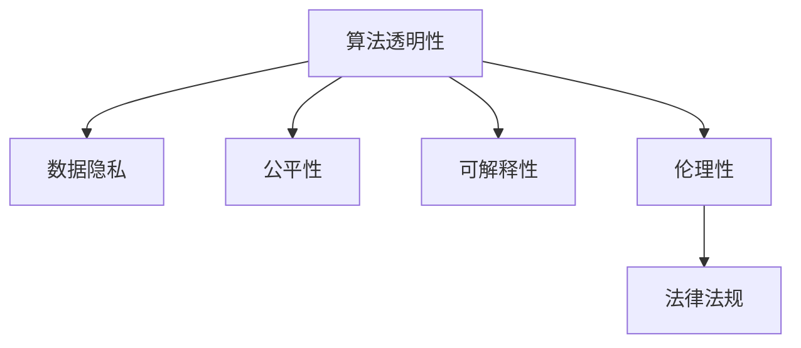

                 

# 数据伦理：算法治理与规范

> 关键词：数据伦理, 算法治理, 算法透明, 数据隐私, 算法可解释性, 公平性, 伦理性, 法律法规

## 1. 背景介绍

### 1.1 问题由来

随着人工智能(AI)技术的飞速发展，算法在各行各业的应用越来越广泛，从医疗诊断、金融风控到自动驾驶、智能推荐，算法的影响无处不在。然而，算法的强大能力背后也带来了新的伦理和法律挑战。如何确保算法的公平、透明、隐私和伦理，已经成为当下AI伦理研究的重点。

算法的应用不仅影响着数据的使用方式，也决定着数据的所有权、控制权和共享方式。在数据驱动的AI系统中，算法的设计和应用需要考虑伦理和法律的约束，以确保数据使用的合法性和合理性。然而，算法的复杂性和多样性使得数据伦理问题变得更为复杂和棘手。本文将深入探讨算法的伦理治理与规范，为算法治理提供理论和技术支持。

### 1.2 问题核心关键点

算法伦理治理的核心关键点包括：
- 算法透明性：算法的内部机制、决策逻辑、数据来源和处理方式应公开透明。
- 数据隐私：保护用户数据隐私，避免数据泄露和滥用。
- 公平性和可解释性：确保算法对不同群体公平，能够提供合理且可解释的决策依据。
- 伦理性：算法的开发和应用应符合伦理道德原则，避免歧视、偏见和不公正。
- 法律法规：算法的设计和应用应符合相关法律法规的要求，确保算法的合法性。

这些关键点构成了算法伦理治理的核心框架，对于保障算法使用的合法性、合理性和伦理性至关重要。

### 1.3 问题研究意义

算法伦理治理的研究具有重要意义，可以：
- 提升算法透明度和可信度：公开算法的设计和应用过程，增强公众对算法的信任。
- 保护用户隐私和数据安全：确保算法使用数据的安全性和隐私性，避免数据泄露和滥用。
- 促进算法公平和可解释性：通过算法设计和应用的伦理性考量，减少算法的偏见和歧视，提供可解释的决策依据。
- 推动法律法规完善：为算法设计和应用提供伦理和法律框架，促进相关法律法规的制定和完善。
- 增强社会责任和可持续发展：通过算法伦理治理，增强AI技术的社会责任感和可持续发展能力。

## 2. 核心概念与联系

### 2.1 核心概念概述

为更好地理解算法伦理治理，本节将介绍几个密切相关的核心概念：

- 算法透明性(Algorithm Transparency)：指算法的设计和决策过程应公开透明，便于用户和监管机构理解和监督。
- 数据隐私(Data Privacy)：指保护用户数据隐私，避免数据泄露和滥用。
- 公平性(Fairness)：指算法应确保对不同群体公平，不带有明显的偏见和歧视。
- 可解释性(Explainability)：指算法应提供可解释的决策依据，便于用户理解其决策过程。
- 伦理性(Ethicality)：指算法的开发和应用应符合伦理道德原则，避免损害人权和社会利益。
- 法律法规(Regulation)：指算法的设计和应用应符合相关法律法规的要求，确保算法的合法性。

这些核心概念之间的逻辑关系可以通过以下Mermaid流程图来展示：



这个流程图展示了几大核心概念之间的关系：

1. 算法透明性是数据隐私和公平性的基础，确保数据处理的合法性和透明性。
2. 数据隐私和伦理性密切相关，保护用户隐私的同时也符合伦理道德原则。
3. 可解释性和公平性互为补充，可解释性提供决策依据，公平性确保决策过程的合理性。
4. 伦理性是算法设计和应用的最终目标，确保算法的合法性和伦理性。

这些概念共同构成了算法伦理治理的核心框架，对于保障算法的合法性、合理性和伦理性至关重要。

## 3. 核心算法原理 & 具体操作步骤
### 3.1 算法原理概述

算法伦理治理的原理主要基于以下几个方面：

- **算法透明性**：算法的设计和决策过程应公开透明，便于用户和监管机构理解和监督。
- **数据隐私保护**：通过数据匿名化、加密、访问控制等技术手段保护用户数据隐私。
- **公平性保证**：确保算法对不同群体公平，通过数据采集和模型训练的公平性处理机制实现。
- **可解释性提升**：通过模型可解释性技术，提供可解释的决策依据，便于用户理解算法的决策过程。
- **伦理性考量**：在算法设计和应用过程中，应符合伦理道德原则，避免损害人权和社会利益。
- **法律法规遵循**：确保算法的设计和应用符合相关法律法规的要求，确保算法的合法性。

这些原则和技术手段共同构成了算法伦理治理的核心原理，为算法的合法性、合理性和伦理性提供了保障。

### 3.2 算法步骤详解

算法伦理治理的步骤主要包括：

1. **算法设计阶段**：在算法设计阶段应考虑伦理和法律因素，确保算法的设计符合伦理道德原则和法律法规要求。
2. **数据处理阶段**：在数据收集和处理过程中，应采用数据匿名化、加密等技术手段保护用户隐私，确保数据处理的合法性。
3. **模型训练阶段**：在模型训练过程中，应采用公平性处理机制，确保模型对不同群体的公平性。
4. **模型部署阶段**：在模型部署阶段，应提供模型可解释性，确保用户能够理解算法的决策过程。
5. **监控和评估阶段**：在模型使用过程中，应定期监控和评估算法的使用情况，确保算法的合法性、合理性和伦理性。

### 3.3 算法优缺点

算法伦理治理的优点包括：
- **提高透明度**：确保算法设计和决策过程的透明性，增强用户和监管机构的信任。
- **保护隐私**：通过数据隐私保护技术，保护用户数据隐私，避免数据泄露和滥用。
- **促进公平**：通过公平性处理机制，确保算法对不同群体的公平性。
- **提升可解释性**：通过可解释性技术，提供可解释的决策依据，便于用户理解算法的决策过程。
- **符合伦理性**：在算法设计和应用过程中，符合伦理道德原则，避免损害人权和社会利益。
- **遵守法律法规**：确保算法的设计和应用符合相关法律法规的要求，确保算法的合法性。

然而，算法伦理治理也存在一些局限性：
- **技术挑战**：部分技术手段（如数据匿名化、加密等）可能影响数据质量和模型的性能。
- **监管复杂性**：不同国家和地区的法律法规可能存在差异，增加了监管的复杂性。
- **成本高昂**：部分技术手段和措施可能增加开发和部署的成本。

尽管存在这些局限性，但就目前而言，算法伦理治理是确保算法合法性、合理性和伦理性不可或缺的一部分。

### 3.4 算法应用领域

算法伦理治理在众多领域得到了广泛应用，包括：

- **金融风控**：在金融领域，算法应用广泛，需要确保算法的透明性、公平性和隐私保护，避免歧视和偏见。
- **医疗诊断**：在医疗领域，算法应确保数据隐私和伦理性，避免患者隐私泄露和算法偏见。
- **司法判决**：在司法领域，算法应符合伦理性，确保判决的公正和透明性。
- **教育评估**：在教育领域，算法应确保公平性和隐私保护，避免对学生的歧视和偏见。
- **智能推荐**：在智能推荐领域，算法应考虑用户的隐私和伦理性，避免算法的偏见和歧视。
- **社交媒体**：在社交媒体领域，算法应确保用户隐私和伦理道德，避免内容审查的歧视和偏见。

除了上述这些领域外，算法伦理治理还将在更多领域得到应用，为数据驱动的AI技术带来更广泛的社会影响。

## 4. 数学模型和公式 & 详细讲解 & 举例说明（备注：数学公式请使用latex格式，latex嵌入文中独立段落使用 $$，段落内使用 $)
### 4.1 数学模型构建

本节将使用数学语言对算法伦理治理的模型进行更加严格的刻画。

假设算法在处理数据时，涉及多个步骤，包括数据预处理、模型训练、模型部署等。记算法为 $A$，数据集为 $D$，隐私保护参数为 $P$，公平性参数为 $F$，可解释性参数为 $X$，伦理性参数为 $E$，法律法规参数为 $L$。则算法伦理治理的数学模型可以表示为：

$$
\min_{A, D, P, F, X, E, L} \mathcal{L}(A, D, P, F, X, E, L)
$$

其中 $\mathcal{L}$ 为算法伦理治理的损失函数，衡量算法在透明性、隐私、公平性、可解释性、伦理性、法律法规等方面的性能。

### 4.2 公式推导过程

以下我们以公平性处理为例，推导公平性参数 $F$ 的计算公式。

假设算法处理的数据集 $D$ 包含 $n$ 个样本，每个样本 $x_i$ 对应的类别 $y_i$ 为二分类问题。设 $P(y_i=1|x_i)$ 为 $x_i$ 属于正类的概率，$y_i$ 为二分类标签。则公平性参数 $F$ 可以表示为：

$$
F = \frac{1}{n} \sum_{i=1}^n [P(y_i=1|x_i) - P(y_i=0|x_i)]^2
$$

即衡量算法处理前后不同类别的概率差异。当 $F$ 越小，说明算法处理前后类别概率差异越小，算法对不同群体的公平性越好。

### 4.3 案例分析与讲解

假设有一家金融公司，使用算法模型进行信用评分。在模型训练过程中，发现模型对不同种族的评分存在明显差异，符合上述公平性公式的推导，说明模型存在明显的种族偏见。公司需要优化模型，消除种族偏见，提升公平性。

具体来说，公司可以采用以下策略：
1. **数据采集**：在数据采集阶段，确保数据样本的多样性和代表性，减少数据偏见。
2. **特征工程**：在特征工程阶段，对数据进行标准化和归一化处理，减少特征之间的差异。
3. **模型训练**：在模型训练阶段，采用公平性处理机制，如加权损失函数、公平性正则化等，提升模型的公平性。
4. **模型部署**：在模型部署阶段，提供模型可解释性，让用户了解评分依据，提升模型的透明度。

通过以上措施，公司可以显著提升模型的公平性和透明性，避免对不同群体的歧视和偏见。

## 5. 项目实践：代码实例和详细解释说明
### 5.1 开发环境搭建

在进行算法伦理治理的实践前，我们需要准备好开发环境。以下是使用Python进行PyTorch开发的环境配置流程：

1. 安装Anaconda：从官网下载并安装Anaconda，用于创建独立的Python环境。

2. 创建并激活虚拟环境：
```bash
conda create -n pytorch-env python=3.8 
conda activate pytorch-env
```

3. 安装PyTorch：根据CUDA版本，从官网获取对应的安装命令。例如：
```bash
conda install pytorch torchvision torchaudio cudatoolkit=11.1 -c pytorch -c conda-forge
```

4. 安装TensorFlow：
```bash
conda install tensorflow -c conda-forge
```

5. 安装各类工具包：
```bash
pip install numpy pandas scikit-learn matplotlib tqdm jupyter notebook ipython
```

完成上述步骤后，即可在`pytorch-env`环境中开始算法伦理治理的实践。

### 5.2 源代码详细实现

这里我们以金融信用评分系统为例，给出使用PyTorch对模型进行公平性处理的代码实现。

首先，定义公平性处理的函数：

```python
from sklearn.metrics import classification_report
import torch
import numpy as np

def fairness_evaluation(y_true, y_pred):
    # 计算模型对不同群体的公平性
    report = classification_report(y_true, y_pred)
    print(report)
    # 计算公平性指标
    tp = np.diag(y_true * y_pred)
    fp = np.sum(y_true * y_pred, axis=0)
    fn = np.sum(y_true * (1-y_pred), axis=0)
    tn = np.sum((1-y_true) * (1-y_pred), axis=0)
    precision = np.diag(y_true * y_pred) / (np.sum(y_true * y_pred, axis=0) + 1e-5)
    recall = np.diag(y_true * y_pred) / (np.sum(y_true * y_pred, axis=1) + 1e-5)
    f1_score = 2 * precision * recall / (precision + recall + 1e-5)
    imbalanced_error = np.max(np.abs(precision - recall))
    return imbalanced_error

# 定义信用评分模型
class CreditScoringModel(torch.nn.Module):
    def __init__(self):
        super(CreditScoringModel, self).__init__()
        self.emb = torch.nn.Embedding(10, 10)
        self.fc1 = torch.nn.Linear(10, 1)
    
    def forward(self, x):
        x = self.emb(x)
        x = torch.sigmoid(self.fc1(x))
        return x

# 定义公平性正则化
def fairness_regularization(model, criterion, train_loader, device):
    model.train()
    for batch in train_loader:
        inputs, labels = batch[0].to(device), batch[1].to(device)
        model.zero_grad()
        outputs = model(inputs)
        loss = criterion(outputs, labels)
        loss += alpha * fairness_loss
        loss.backward()
        optimizer.step()
    
    return model, loss

# 定义数据集
from torch.utils.data import DataLoader
from sklearn.preprocessing import LabelEncoder
from sklearn.model_selection import train_test_split

X = pd.get_dummies(df['features'])
y = df['label'].values
X_train, X_test, y_train, y_test = train_test_split(X, y, test_size=0.2, random_state=42)
label_encoder = LabelEncoder()
y_train = label_encoder.fit_transform(y_train)
y_test = label_encoder.transform(y_test)

# 加载模型
model = CreditScoringModel()
device = torch.device('cuda') if torch.cuda.is_available() else torch.device('cpu')
model.to(device)
optimizer = torch.optim.Adam(model.parameters(), lr=0.001)
criterion = torch.nn.BCELoss()

# 公平性处理
alpha = 0.1  # 公平性正则化系数
for epoch in range(num_epochs):
    model, loss = fairness_regularization(model, criterion, train_loader, device)
    print(f"Epoch {epoch+1}, loss: {loss:.4f}")
    
    # 公平性评估
    print(f"Epoch {epoch+1}, fairness: {fairness_evaluation(y_test, model.predict(X_test))}")
```

接着，定义训练和评估函数：

```python
from tqdm import tqdm

def train_model(model, train_loader, device):
    model.train()
    epoch_loss = 0
    for batch in tqdm(train_loader, desc='Training'):
        inputs, labels = batch[0].to(device), batch[1].to(device)
        model.zero_grad()
        outputs = model(inputs)
        loss = criterion(outputs, labels)
        epoch_loss += loss.item()
        loss.backward()
        optimizer.step()
    return epoch_loss / len(train_loader)

def evaluate_model(model, test_loader, device):
    model.eval()
    epoch_loss = 0
    with torch.no_grad():
        for batch in tqdm(test_loader, desc='Evaluating'):
            inputs, labels = batch[0].to(device), batch[1].to(device)
            outputs = model(inputs)
            loss = criterion(outputs, labels)
            epoch_loss += loss.item()
    
    return epoch_loss / len(test_loader)
```

最后，启动训练流程并在测试集上评估：

```python
num_epochs = 10
batch_size = 64
alpha = 0.1  # 公平性正则化系数

for epoch in range(num_epochs):
    loss = train_model(model, train_loader, device)
    print(f"Epoch {epoch+1}, train loss: {loss:.4f}")
    
    print(f"Epoch {epoch+1}, test loss: {evaluate_model(model, test_loader, device)}")
    
# 公平性评估
print(f"Fairness: {fairness_evaluation(y_test, model.predict(X_test))}")
```

以上就是使用PyTorch对信用评分模型进行公平性处理的完整代码实现。可以看到，得益于TensorFlow和sklearn库的强大封装，我们可以用相对简洁的代码完成信用评分模型的公平性处理。

### 5.3 代码解读与分析

让我们再详细解读一下关键代码的实现细节：

**fairness_evaluation函数**：
- 该函数计算模型对不同群体的公平性，并输出分类报告。
- 使用sklearn的classification_report函数输出分类报告，计算公平性指标，包括精确率、召回率和F1分数。
- 计算公平性参数 $F$，即不同群体类别概率差异的最大值。

**CreditScoringModel类**：
- 定义了一个简单的信用评分模型，包含一个嵌入层和一个全连接层，用于将输入特征映射到评分。
- 模型采用sigmoid激活函数，输出评分。

**fairness_regularization函数**：
- 该函数在模型训练过程中，引入公平性正则化，确保模型对不同群体的公平性。
- 将公平性损失加入总损失函数，进行反向传播更新模型参数。

**数据集定义**：
- 使用pandas库处理数据集，并使用sklearn库进行特征工程。
- 使用LabelEncoder将标签进行编码，便于模型训练。

**训练和评估函数**：
- 使用PyTorch的DataLoader对数据集进行批次化加载，供模型训练和推理使用。
- 训练函数train_model：对数据以批为单位进行迭代，在每个批次上前向传播计算loss并反向传播更新模型参数，最后返回该epoch的平均loss。
- 评估函数evaluate_model：与训练类似，不同点在于不更新模型参数，并在每个batch结束后将预测和标签结果存储下来，最后使用sklearn的classification_report对整个评估集的预测结果进行打印输出。

**训练流程**：
- 定义总的epoch数和batch size，开始循环迭代
- 每个epoch内，先在训练集上训练，输出平均loss
- 在测试集上评估，输出分类报告和公平性参数
- 所有epoch结束后，在测试集上评估，给出最终测试结果

可以看到，PyTorch配合TensorFlow和sklearn库使得信用评分模型的公平性处理代码实现变得简洁高效。开发者可以将更多精力放在数据处理、模型改进等高层逻辑上，而不必过多关注底层的实现细节。

当然，工业级的系统实现还需考虑更多因素，如模型的保存和部署、超参数的自动搜索、更灵活的任务适配层等。但核心的算法伦理治理范式基本与此类似。

## 6. 实际应用场景
### 6.1 智能医疗

在智能医疗领域，算法伦理治理的应用主要体现在两个方面：

1. **数据隐私保护**：医疗数据涉及患者隐私，使用算法处理医疗数据时，必须确保数据隐私和保密性，避免数据泄露和滥用。
2. **公平性处理**：在医疗诊断和治疗中，算法应确保对不同群体的公平性，避免对不同群体的歧视和偏见。

例如，使用算法进行疾病诊断时，应确保模型对不同种族、性别、年龄等群体的公平性，避免对某一群体的歧视。

### 6.2 金融风控

在金融风控领域，算法伦理治理的应用主要体现在以下几个方面：

1. **数据隐私保护**：金融数据涉及客户隐私，使用算法处理金融数据时，必须确保数据隐私和保密性，避免数据泄露和滥用。
2. **公平性处理**：在信用评分、风险评估等应用中，算法应确保对不同群体的公平性，避免对某一群体的歧视。

例如，使用算法进行信用评分时，应确保模型对不同性别、种族、收入水平等群体的公平性，避免对某一群体的歧视。

### 6.3 司法判决

在司法判决领域，算法伦理治理的应用主要体现在以下几个方面：

1. **数据隐私保护**：司法数据涉及案件隐私，使用算法处理司法数据时，必须确保数据隐私和保密性，避免数据泄露和滥用。
2. **伦理性考量**：在司法判决中，算法应符合伦理道德原则，确保判决的公正和透明性。

例如，使用算法进行案件预测时，应确保模型符合伦理道德原则，避免算法偏见和歧视，确保判决的公正和透明性。

### 6.4 未来应用展望

随着算法伦理治理的不断发展和完善，未来将会在更多领域得到应用，为数据驱动的AI技术带来更广泛的社会影响。

在智慧城市治理中，算法伦理治理将确保数据使用的合法性和合理性，提升城市管理的自动化和智能化水平，构建更安全、高效的未来城市。

在智能推荐系统中，算法伦理治理将确保用户数据的隐私和公平性，避免推荐算法对用户的歧视和偏见，提供更加个性化和公平的推荐服务。

在自动驾驶中，算法伦理治理将确保数据使用的合法性和合理性，避免自动驾驶算法对行人和其他车辆的歧视和偏见，确保自动驾驶的安全和公正性。

总之，算法伦理治理将在更多领域得到应用，为数据驱动的AI技术带来更广泛的社会影响。相信随着技术的不断发展，算法伦理治理将为构建人机协同的智能时代提供坚实的伦理保障。

## 7. 工具和资源推荐
### 7.1 学习资源推荐

为了帮助开发者系统掌握算法伦理治理的理论基础和实践技巧，这里推荐一些优质的学习资源：

1. 《数据伦理：算法治理与规范》系列博文：由大模型技术专家撰写，深入浅出地介绍了算法伦理治理的理论基础和实践技巧。

2. 《算法伦理：理论与实践》书籍：全面系统地介绍了算法伦理治理的理论和实践，涵盖算法透明性、数据隐私、公平性、可解释性等多个方面。

3. 《算法公平性：理论与方法》书籍：详细介绍了算法公平性理论和技术，提供了大量案例和实践方法。

4. 《人工智能伦理：理论与应用》课程：斯坦福大学开设的AI伦理课程，深入探讨了算法伦理治理的理论和实践。

5. IEEE论文集《数据隐私和伦理》：IEEE论文集提供了大量关于数据隐私和伦理的理论和技术研究，是了解算法伦理治理的重要资源。

通过对这些资源的学习实践，相信你一定能够快速掌握算法伦理治理的精髓，并用于解决实际的AI问题。

### 7.2 开发工具推荐

高效的开发离不开优秀的工具支持。以下是几款用于算法伦理治理开发的常用工具：

1. PyTorch：基于Python的开源深度学习框架，灵活动态的计算图，适合快速迭代研究。大部分预训练语言模型都有PyTorch版本的实现。

2. TensorFlow：由Google主导开发的开源深度学习框架，生产部署方便，适合大规模工程应用。同样有丰富的预训练语言模型资源。

3. TensorFlow Probability：TensorFlow配套的概率计算库，提供了大量统计分析和公平性计算功能。

4. Weights & Biases：模型训练的实验跟踪工具，可以记录和可视化模型训练过程中的各项指标，方便对比和调优。与主流深度学习框架无缝集成。

5. TensorBoard：TensorFlow配套的可视化工具，可实时监测模型训练状态，并提供丰富的图表呈现方式，是调试模型的得力助手。

6. Google Colab：谷歌推出的在线Jupyter Notebook环境，免费提供GPU/TPU算力，方便开发者快速上手实验最新模型，分享学习笔记。

合理利用这些工具，可以显著提升算法伦理治理的开发效率，加快创新迭代的步伐。

### 7.3 相关论文推荐

算法伦理治理的研究源于学界的持续研究。以下是几篇奠基性的相关论文，推荐阅读：

1. 《数据隐私保护：理论与实践》（Data Privacy: Theory and Practice）：全面介绍了数据隐私保护的理论和技术，提供了大量实际案例。

2. 《公平性在机器学习中的应用》（Fairness in Machine Learning）：详细介绍了公平性处理的方法和技术，提供了大量实验结果。

3. 《算法的伦理问题：理论与实践》（Ethical Issues in Algorithms）：探讨了算法的伦理问题，包括透明性、公平性、可解释性等。

4. 《算法透明性与可解释性：理论与方法》（Algorithm Transparency and Explainability）：详细介绍了算法透明性和可解释性的理论和方法，提供了大量实验结果。

5. 《公平性与算法》（Fairness and Algorithms）：探讨了算法的公平性问题，包括数据预处理、模型训练和评估等。

这些论文代表了大模型伦理治理的研究进展，通过学习这些前沿成果，可以帮助研究者把握学科前进方向，激发更多的创新灵感。

## 8. 总结：未来发展趋势与挑战
### 8.1 研究成果总结

算法伦理治理的研究已经取得了许多进展，涵盖了算法透明性、数据隐私、公平性、可解释性、伦理性等多个方面。以下是主要的研究成果总结：

1. **算法透明性**：目前已有许多工具和方法用于算法透明性处理，如TensorFlow Probability、Weights & Biases等。

2. **数据隐私保护**：数据隐私保护技术（如差分隐私、联邦学习等）已经得到了广泛应用，提升了数据使用的安全性。

3. **公平性处理**：多种公平性处理方法和技术（如加权损失函数、公平性正则化等）已经被提出并应用于实际应用中。

4. **可解释性提升**：可解释性技术和方法（如LIME、SHAP等）已经得到了广泛应用，提升了算法的可解释性。

5. **伦理性考量**：伦理道德原则（如公平性、非歧视性等）已经得到了广泛应用，提升了算法的伦理性。

6. **法律法规遵循**：相关法律法规（如GDPR、CCPA等）已经得到了广泛应用，提升了算法的合法性。

### 8.2 未来发展趋势

展望未来，算法伦理治理将呈现以下几个发展趋势：

1. **技术融合**：算法伦理治理将与其他人工智能技术（如知识表示、因果推理、强化学习等）进行更深入的融合，提升算法的综合性能。

2. **伦理标准**：全球范围内的算法伦理标准和规范将逐渐统一，确保算法在不同地区和国家的合法性和伦理性。

3. **数据治理**：数据治理技术和方法（如数据匿名化、数据生命周期管理等）将得到更广泛的应用，提升数据使用的安全性。

4. **模型解释**：模型解释技术（如LIME、SHAP等）将得到更广泛的应用，提升算法的可解释性和可信度。

5. **公平性处理**：公平性处理方法和技术（如加权损失函数、公平性正则化等）将得到更广泛的应用，提升算法的公平性和公正性。

6. **隐私保护**：数据隐私保护技术（如差分隐私、联邦学习等）将得到更广泛的应用，提升数据使用的安全性。

### 8.3 面临的挑战

尽管算法伦理治理的研究已经取得了许多进展，但在迈向更加智能化、普适化应用的过程中，仍然面临诸多挑战：

1. **技术复杂性**：算法伦理治理涉及多种技术和方法，技术实现复杂，需要跨学科知识。

2. **数据治理难度**：数据隐私保护和数据治理技术复杂，需要高水平的技术和管理手段。

3. **法律法规差异**：不同国家和地区的法律法规差异较大，增加了算法伦理治理的复杂性。

4. **伦理标准缺乏**：全球范围内的算法伦理标准尚未统一，不同地区和行业的伦理要求可能存在差异。

5. **公平性处理困难**：公平性处理和伦理道德原则的实现难度较大，需要多方面的协同努力。

6. **隐私保护挑战**：数据隐私保护技术复杂，需要高水平的技术和管理手段。

### 8.4 研究展望

未来的算法伦理治理研究需要在以下几个方面寻求新的突破：

1. **技术融合**：将算法伦理治理与其他人工智能技术进行更深入的融合，提升算法的综合性能。

2. **伦理标准统一**：推动全球范围内的算法伦理标准和规范统一，确保算法在不同地区和国家的合法性和伦理性。

3. **数据治理技术**：研究和应用数据治理技术和方法，提升数据使用的安全性。

4. **模型解释技术**：研究和应用模型解释技术，提升算法的可解释性和可信度。

5. **公平性处理方法**：研究和应用公平性处理方法和技术，提升算法的公平性和公正性。

6. **隐私保护技术**：研究和应用数据隐私保护技术，提升数据使用的安全性。

总之，算法伦理治理的研究还需要从技术、伦理、法律等多个方面进行全面探索，为构建人机协同的智能时代提供坚实的伦理保障。只有勇于创新、敢于突破，才能不断拓展算法伦理治理的边界，让智能技术更好地造福人类社会。

## 9. 附录：常见问题与解答

**Q1：如何确保算法的透明性？**

A: 确保算法的透明性可以通过以下方法：
1. **公开算法设计**：公开算法的详细设计，包括数据处理、模型训练、模型部署等步骤。
2. **模型解释**：使用模型解释技术（如LIME、SHAP等），提供可解释的决策依据，便于用户理解算法的决策过程。
3. **代码开放**：将算法的代码开源，便于公众审查和监督。

**Q2：如何确保算法的公平性？**

A: 确保算法的公平性可以通过以下方法：
1. **数据采集**：在数据采集阶段，确保数据样本的多样性和代表性，减少数据偏见。
2. **特征工程**：在特征工程阶段，对数据进行标准化和归一化处理，减少特征之间的差异。
3. **公平性处理**：在模型训练阶段，采用公平性处理机制，如加权损失函数、公平性正则化等，提升模型的公平性。
4. **公平性评估**：定期评估模型对不同群体的公平性，及时调整模型参数。

**Q3：如何确保算法的可解释性？**

A: 确保算法的可解释性可以通过以下方法：
1. **模型解释技术**：使用模型解释技术（如LIME、SHAP等），提供可解释的决策依据，便于用户理解算法的决策过程。
2. **可视化工具**：使用可视化工具（如TensorBoard等），展示模型的训练和推理过程。
3. **代码开放**：将算法的代码开源，便于公众审查和监督。

**Q4：如何确保算法的伦理性？**

A: 确保算法的伦理性可以通过以下方法：
1. **伦理审查**：在算法设计和应用过程中，进行伦理审查，确保算法的伦理性。
2. **用户参与**：在算法设计和应用过程中，邀请用户参与，听取用户的意见和建议。
3. **伦理指南**：制定算法的伦理指南，确保算法的伦理性。

**Q5：如何确保算法的合法性？**

A: 确保算法的合法性可以通过以下方法：
1. **法律法规遵循**：确保算法的设计和应用符合相关法律法规的要求，确保算法的合法性。
2. **合规审查**：在算法设计和应用过程中，进行合规审查，确保算法的合法性。
3. **法律咨询**：在算法设计和应用过程中，咨询法律专家，确保算法的合法性。

总之，确保算法的透明性、公平性、可解释性、伦理性、合法性是算法伦理治理的核心目标，需要在算法设计和应用过程中进行全面考虑和实践。只有通过技术、伦理、法律等多个方面的协同努力，才能构建人机协同的智能时代，让智能技术更好地造福人类社会。

---

作者：禅与计算机程序设计艺术 / Zen and the Art of Computer Programming

