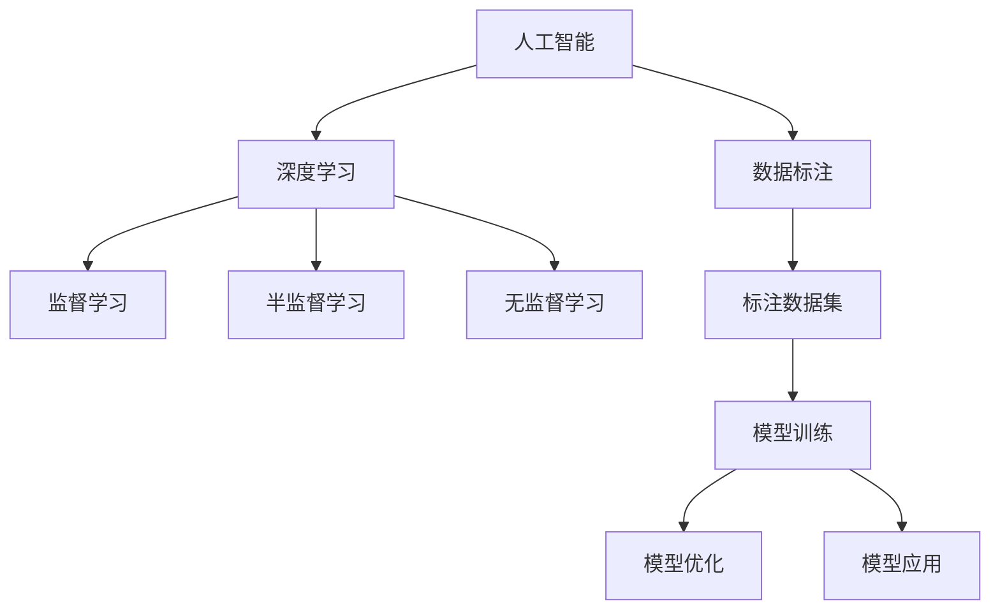

                 

# 数据标注：人工智能发展背后的幕后英雄

## 1. 背景介绍

### 1.1 问题由来
人工智能(AI)技术的飞速发展，离不开背后庞大的数据资源支撑。尽管深度学习模型和算法日趋成熟，但它们仍然依赖大量标注数据的输入。数据标注，正是AI发展的幕后英雄，对模型训练、优化和应用起到了至关重要的作用。

**数据标注**通常是指人工审核和校验数据集，以确保数据的正确性和可靠性。具体过程包括数据收集、清洗、预处理、注释等环节。标注人员需要根据任务需求，对原始数据进行细致分类、标注和校验，最终生成可供机器学习模型使用的标注数据集。

在AI的众多领域中，无论是图像识别、语音识别、自然语言处理(NLP)还是自动驾驶，数据标注都是不可或缺的环节。尽管标注成本高昂，且质量难以保证，但标注数据的质量直接决定了模型的性能和可靠性。因此，对数据标注的重视和优化，不仅能够提升模型的训练效果，也是AI技术能否成功落地应用的关键。

### 1.2 问题核心关键点
数据标注的核心关键点包括以下几个方面：
1. **数据集的多样性**：标注数据集应覆盖尽可能多的场景和样本，以减少模型过拟合和泛化能力不足的问题。
2. **标注的质量**：标注数据的准确性和一致性直接影响模型的学习效果，标注员需要严格遵循标注规范，反复校验标注结果。
3. **标注的效率**：高强度的标注工作需要高效的工具和流程支持，以降低时间和人力成本，加速模型开发和部署。
4. **标注的伦理考量**：数据标注过程可能涉及敏感信息，需要确保数据隐私和安全，遵守相关法律法规。

本文将从数据标注的概念、核心算法原理、操作步骤、数学模型和公式、项目实践、应用场景、工具和资源推荐等多个方面，全面系统地介绍数据标注的重要性和实践方法。

## 2. 核心概念与联系

### 2.1 核心概念概述

为了更好地理解数据标注的原理和架构，本节将介绍几个核心概念：

- **人工智能(AI)**：通过算法和模型，模拟人类智能行为的计算系统。AI涉及感知、学习、推理等多个层面，依赖大量的数据输入进行训练和优化。
- **深度学习(Deep Learning)**：一种基于神经网络的机器学习范式，能够自动学习特征表示，并在数据集上进行端到端的学习和优化。
- **数据标注(Data Annotation)**：将原始数据集转换为可供机器学习模型使用的格式，通常需要人工标注和校验。
- **机器学习(Machine Learning)**：通过数据训练模型，使模型具备一定的预测和分类能力，能够在新数据上泛化。
- **监督学习(Supervised Learning)**：使用有标注数据训练模型，使其能够正确预测未知数据。
- **半监督学习(Semi-Supervised Learning)**：使用少量标注数据和大量未标注数据训练模型。
- **无监督学习(Unsupervised Learning)**：不使用标注数据，从数据本身学习特征。

这些核心概念之间的逻辑关系可以通过以下Mermaid流程图来展示：



这个流程图展示了人工智能、深度学习和数据标注之间的紧密联系：

1. 数据标注是人工智能系统获取数据的重要环节，为模型训练提供了基础。
2. 深度学习模型通过大量标注数据训练，具备学习复杂特征和模式的能力。
3. 监督学习、半监督学习和无监督学习是深度学习模型的主要训练范式，分别使用不同类型的数据进行训练。
4. 标注数据集为模型训练和优化提供必要的信息，是确保模型性能的关键。

## 3. 核心算法原理 & 具体操作步骤
### 3.1 算法原理概述

数据标注的核心算法原理是基于有监督学习的范式，通过人工标注的训练集，让模型学习输入与输出之间的关系。其基本流程包括以下几个步骤：

1. **数据收集**：从各种渠道收集原始数据，如图片、文本、语音等。
2. **数据清洗**：对收集到的数据进行预处理，包括去噪、去除重复数据等。
3. **数据标注**：通过人工标注，给数据集中的每个样本打上标签，反映其真实属性或类别。
4. **数据验证**：对标注结果进行校验，确保标注数据的准确性和一致性。
5. **数据整合**：将清洗和标注后的数据整合，生成可供机器学习模型训练的标注数据集。
6. **模型训练**：使用标注数据集训练深度学习模型，学习输入与输出之间的映射关系。
7. **模型优化**：通过调整模型结构、学习率、正则化等参数，优化模型性能。
8. **模型应用**：将训练好的模型应用于实际场景，进行预测和分类。

### 3.2 算法步骤详解

以下详细介绍数据标注的主要操作步骤：

#### 3.2.1 数据收集
数据收集是数据标注的第一步，涉及从多个渠道获取原始数据。常见数据来源包括：

- 网络公开数据集：如ImageNet、COCO、Wikipedia等。
- 用户上传数据：如社交媒体、在线购物网站、医疗记录等。
- 专业数据提供商：如DataRobot、CrowdFlower等。

数据收集需要确保数据的多样性和代表性，涵盖不同的场景和样本，以提高模型泛化能力。

#### 3.2.2 数据清洗
数据清洗是数据预处理的关键步骤，主要目的是去除噪音和冗余数据，保证数据质量。具体步骤包括：

- **去噪**：去除数据集中的异常值和噪声数据。
- **去重**：删除重复数据，确保每个样本的唯一性。
- **缺失值处理**：填补或删除缺失值，避免模型学习错误的信息。

数据清洗需要结合具体数据类型和应用场景进行，常见的清洗方法包括过滤、替换、插值等。

#### 3.2.3 数据标注
数据标注是人工干预的重要环节，需要标注人员根据任务需求，对数据集中的每个样本进行标注。常见的标注类型包括：

- **分类标注**：将样本分为不同的类别，如图像分类、文本分类等。
- **回归标注**：给定样本的连续值，如预测房价、预测股票等。
- **序列标注**：对序列数据进行标注，如命名实体识别、词性标注等。
- **图像标注**：对图像中的物体、区域进行标注，如实例分割、目标检测等。

标注过程中，标注人员需要遵循统一的标准和规范，确保标注结果的一致性和准确性。常见的标注标准包括ImageNet标注规范、COCO标注规范等。

#### 3.2.4 数据验证
数据验证是确保标注质量的重要步骤，主要通过人工校验标注结果的准确性和一致性。具体过程包括：

- **标注对比**：比较不同标注员之间的标注结果，确保一致性。
- **数据抽样**：从数据集中随机抽取样本，进行双重标注和校验。
- **统计分析**：对标注结果进行统计分析，发现和纠正错误标注。

数据验证需要反复进行，以确保标注数据的可靠性和一致性。常见数据验证方法包括抽样验证、三标注员校验等。

#### 3.2.5 数据整合
数据整合是将清洗和标注后的数据集合并为一个完整的数据集，便于后续的模型训练和优化。具体过程包括：

- **数据格式化**：将不同来源的数据格式统一，便于模型处理。
- **数据扩充**：对数据集进行扩充，增加样本多样性。
- **数据分割**：将数据集划分为训练集、验证集和测试集，便于模型评估和验证。

数据整合需要确保数据集的完整性和多样性，常见的数据分割方法包括随机分割、时间序列分割等。

#### 3.2.6 模型训练
模型训练是将标注数据集输入模型，训练深度学习模型的过程。常见模型包括：

- **卷积神经网络(CNN)**：用于图像识别和计算机视觉任务。
- **循环神经网络(RNN)**：用于自然语言处理和序列标注任务。
- **注意力机制(Attention)**：用于提升模型对关键信息的关注能力。
- **Transformer**：用于大规模语言模型的训练和优化。

模型训练需要选择合适的优化算法和学习率，常见优化算法包括SGD、Adam、Adagrad等。

#### 3.2.7 模型优化
模型优化是通过调整模型结构和参数，提升模型性能和泛化能力的过程。常见优化方法包括：

- **参数调整**：调整模型层数、节点数、激活函数等。
- **正则化**：使用L1/L2正则、Dropout、Early Stopping等防止过拟合。
- **超参数调优**：通过网格搜索、随机搜索等方法，寻找最优的超参数组合。
- **集成学习**：结合多个模型的预测结果，提高模型的稳定性和准确性。

模型优化需要根据具体任务和数据特点进行，常见的优化方法包括交叉验证、学习曲线分析等。

#### 3.2.8 模型应用
模型应用是将训练好的模型应用于实际场景，进行预测和分类的过程。常见应用场景包括：

- **图像识别**：识别图像中的物体、区域、人脸等。
- **自然语言处理(NLP)**：进行文本分类、情感分析、机器翻译等。
- **语音识别**：将语音转换为文本，并进行语音识别和语音合成。
- **自动驾驶**：对传感器数据进行融合和处理，实现自动驾驶功能。

模型应用需要确保模型的稳定性和鲁棒性，常见的应用方法包括在线部署、API接口、客户端应用等。

### 3.3 算法优缺点

数据标注方法具有以下优点：

1. **准确性高**：人工标注能够确保数据的准确性和一致性，减少模型训练中的噪声和误差。
2. **适应性强**：标注数据集可以覆盖各种场景和样本，提升模型的泛化能力。
3. **可控性高**：标注人员可以灵活控制标注标准和规范，确保标注结果符合任务需求。

同时，数据标注方法也存在以下缺点：

1. **成本高昂**：人工标注需要大量人力和时间，成本较高。
2. **质量依赖人工**：标注结果依赖标注人员的专业水平和责任心，难以保证一致性。
3. **效率低下**：标注过程繁琐，难以大规模并行处理。
4. **隐私风险**：标注数据可能包含敏感信息，存在隐私泄露的风险。

尽管存在这些局限性，数据标注仍然是深度学习模型训练和优化的关键环节，其重要性不可替代。

### 3.4 算法应用领域

数据标注在众多AI领域中都有广泛应用，以下是几个典型应用场景：

#### 3.4.1 图像识别
图像识别是数据标注的重要应用之一，主要应用于计算机视觉领域。常见任务包括：

- **物体检测**：检测图像中的物体，并进行分类和定位。
- **图像分割**：将图像分割成不同的区域，并标注每个区域的属性。
- **实例分割**：检测并分割出图像中的每个实例，并进行分类。

#### 3.4.2 自然语言处理(NLP)
自然语言处理是数据标注的另一个重要应用，主要应用于语言理解和生成任务。常见任务包括：

- **文本分类**：将文本分为不同的类别，如新闻分类、情感分析等。
- **命名实体识别**：识别文本中的命名实体，如人名、地名、组织名等。
- **语义理解**：理解文本的语义和情感，并进行情感分析和文本生成。

#### 3.4.3 自动驾驶
自动驾驶领域的数据标注主要应用于传感器数据融合和路径规划。常见任务包括：

- **目标检测**：检测道路中的车辆、行人等目标，并进行分类和定位。
- **语义分割**：将道路地图分割成不同的区域，标注每个区域的属性。
- **路径规划**：根据传感器数据和地图信息，生成最优路径规划策略。

#### 3.4.4 医疗影像
医疗影像领域的数据标注主要应用于医学图像的自动分析和诊断。常见任务包括：

- **病变检测**：检测医学影像中的病变区域，并进行分类和定位。
- **图像分割**：将医学影像分割成不同的区域，并标注每个区域的属性。
- **诊断分析**：基于医学影像和病历信息，进行疾病诊断和治疗方案推荐。

## 4. 数学模型和公式 & 详细讲解 & 举例说明

### 4.1 数学模型构建

数据标注的数学模型可以基于监督学习范式构建。设标注数据集为 $D=\{(x_i, y_i)\}_{i=1}^N$，其中 $x_i$ 为输入样本，$y_i$ 为标注标签。模型的目标是最小化损失函数 $\mathcal{L}(w)$，其中 $w$ 为模型参数，$\mathcal{L}$ 为损失函数。常见损失函数包括交叉熵损失、均方误差损失等。

数学模型可以表示为：

$$
\min_{w} \mathcal{L}(w) = \frac{1}{N} \sum_{i=1}^N \ell(y_i, \hat{y}(w))
$$

其中 $\ell$ 为损失函数，$\hat{y}(w)$ 为模型预测的标签。

### 4.2 公式推导过程

以下以二分类任务为例，推导交叉熵损失函数的公式及其梯度。

设模型在输入 $x$ 上的输出为 $\hat{y}=\sigma(z(x))$，其中 $\sigma$ 为激活函数，$z(x)$ 为线性变换层，$w$ 为模型参数。则二分类交叉熵损失函数定义为：

$$
\ell(y_i, \hat{y}) = -[y_i\log \hat{y} + (1-y_i)\log(1-\hat{y})]
$$

将其代入经验风险公式，得：

$$
\mathcal{L}(w) = -\frac{1}{N}\sum_{i=1}^N [y_i\log \hat{y} + (1-y_i)\log(1-\hat{y})]
$$

根据链式法则，损失函数对参数 $w$ 的梯度为：

$$
\frac{\partial \mathcal{L}(w)}{\partial w} = -\frac{1}{N}\sum_{i=1}^N \frac{\partial \ell(y_i, \hat{y})}{\partial w}
$$

其中 $\frac{\partial \ell(y_i, \hat{y})}{\partial w}$ 为交叉熵损失函数对参数 $w$ 的梯度，可通过反向传播算法高效计算。

### 4.3 案例分析与讲解

以图像识别任务为例，分析数据标注的详细流程。

#### 4.3.1 数据收集
从COCO数据集中收集图像和标注数据，其中包含常见的物体类别，如人、车、动物等。

#### 4.3.2 数据清洗
对收集到的图像进行预处理，包括去噪、裁剪、旋转等，以提高数据质量。

#### 4.3.3 数据标注
根据COCO标注规范，对图像中的物体进行标注，包括边界框、类别标签等信息。

#### 4.3.4 数据验证
随机抽取一部分标注数据，进行三标注员校验，确保标注结果的一致性和准确性。

#### 4.3.5 数据整合
将清洗和标注后的数据整合为一个完整的数据集，并进行数据分割，划分为训练集、验证集和测试集。

#### 4.3.6 模型训练
使用标注数据集训练YOLOv3模型，学习图像中的物体检测和分类。

#### 4.3.7 模型优化
通过调整YOLOv3的超参数，如学习率、批量大小、正则化等，优化模型性能和泛化能力。

#### 4.3.8 模型应用
将训练好的YOLOv3模型应用于实际场景，进行物体检测和分类。

## 5. 项目实践：代码实例和详细解释说明

### 5.1 开发环境搭建

在进行数据标注的实践前，我们需要准备好开发环境。以下是使用Python进行PyTorch开发的环境配置流程：

1. 安装Anaconda：从官网下载并安装Anaconda，用于创建独立的Python环境。

2. 创建并激活虚拟环境：
```bash
conda create -n pytorch-env python=3.8 
conda activate pytorch-env
```

3. 安装PyTorch：根据CUDA版本，从官网获取对应的安装命令。例如：
```bash
conda install pytorch torchvision torchaudio cudatoolkit=11.1 -c pytorch -c conda-forge
```

4. 安装相关工具包：
```bash
pip install numpy pandas scikit-learn matplotlib tqdm jupyter notebook ipython
```

完成上述步骤后，即可在`pytorch-env`环境中开始数据标注实践。

### 5.2 源代码详细实现

这里我们以图像分类任务为例，给出使用PyTorch进行数据标注的代码实现。

首先，定义图像分类任务的数据处理函数：

```python
from torch.utils.data import Dataset
import torch
import torchvision.transforms as transforms

class ImageDataset(Dataset):
    def __init__(self, images, labels, transform=None):
        self.images = images
        self.labels = labels
        self.transform = transform
        
    def __len__(self):
        return len(self.images)
    
    def __getitem__(self, item):
        img = self.images[item]
        label = self.labels[item]
        
        if self.transform:
            img = self.transform(img)
        
        return {'image': img, 
                'label': label}

# 定义图像预处理步骤
transform = transforms.Compose([
    transforms.Resize((224, 224)),
    transforms.ToTensor(),
    transforms.Normalize(mean=[0.485, 0.456, 0.406], std=[0.229, 0.224, 0.225])
])

# 创建数据集
data = []
for img_path, label in zip(img_paths, labels):
    img = transforms.Image.open(img_path)
    data.append({'image': img, 'label': label})

dataset = ImageDataset(data, labels, transform=transform)
```

然后，定义模型和优化器：

```python
from torchvision.models import ResNet
from torch.optim import SGD

model = ResNet(18)
optimizer = SGD(model.parameters(), lr=0.01, momentum=0.9)
```

接着，定义训练和评估函数：

```python
from torch.utils.data import DataLoader
from tqdm import tqdm

device = torch.device('cuda') if torch.cuda.is_available() else torch.device('cpu')
model.to(device)

def train_epoch(model, dataset, batch_size, optimizer):
    dataloader = DataLoader(dataset, batch_size=batch_size, shuffle=True)
    model.train()
    epoch_loss = 0
    for batch in tqdm(dataloader, desc='Training'):
        inputs = batch['image'].to(device)
        targets = batch['label'].to(device)
        model.zero_grad()
        outputs = model(inputs)
        loss = F.cross_entropy(outputs, targets)
        epoch_loss += loss.item()
        loss.backward()
        optimizer.step()
    return epoch_loss / len(dataloader)

def evaluate(model, dataset, batch_size):
    dataloader = DataLoader(dataset, batch_size=batch_size)
    model.eval()
    preds, labels = [], []
    with torch.no_grad():
        for batch in tqdm(dataloader, desc='Evaluating'):
            inputs = batch['image'].to(device)
            targets = batch['label'].to(device)
            outputs = model(inputs)
            preds.append(outputs.argmax(dim=1).to('cpu').tolist())
            labels.append(targets.to('cpu').tolist())
                
    print(classification_report(labels, preds))
```

最后，启动训练流程并在测试集上评估：

```python
epochs = 10
batch_size = 16

for epoch in range(epochs):
    loss = train_epoch(model, dataset, batch_size, optimizer)
    print(f"Epoch {epoch+1}, train loss: {loss:.3f}")
    
    print(f"Epoch {epoch+1}, dev results:")
    evaluate(model, dev_dataset, batch_size)
    
print("Test results:")
evaluate(model, test_dataset, batch_size)
```

以上就是使用PyTorch进行图像分类任务数据标注的完整代码实现。可以看到，得益于PyTorch的强大封装，代码实现变得简洁高效。

### 5.3 代码解读与分析

让我们再详细解读一下关键代码的实现细节：

**ImageDataset类**：
- `__init__`方法：初始化图像、标签、预处理步骤等关键组件。
- `__len__`方法：返回数据集的样本数量。
- `__getitem__`方法：对单个样本进行处理，将图像输入预处理步骤，返回模型所需的输入。

**transforms.Compose方法**：
- `transforms.Compose`方法：定义图像预处理步骤，包括大小调整、归一化等，用于提高模型训练的效率和效果。

**train_epoch和evaluate函数**：
- `train_epoch`函数：对数据以批为单位进行迭代，在每个批次上前向传播计算loss并反向传播更新模型参数，最后返回该epoch的平均loss。
- `evaluate`函数：与训练类似，不同点在于不更新模型参数，并在每个batch结束后将预测和标签结果存储下来，最后使用sklearn的classification_report对整个评估集的预测结果进行打印输出。

**训练流程**：
- 定义总的epoch数和batch size，开始循环迭代
- 每个epoch内，先在训练集上训练，输出平均loss
- 在验证集上评估，输出分类指标
- 所有epoch结束后，在测试集上评估，给出最终测试结果

可以看到，PyTorch配合transforms库使得数据标注的代码实现变得简洁高效。开发者可以将更多精力放在数据处理、模型改进等高层逻辑上，而不必过多关注底层的实现细节。

当然，工业级的系统实现还需考虑更多因素，如模型的保存和部署、超参数的自动搜索、更灵活的任务适配层等。但核心的数据标注范式基本与此类似。

## 6. 实际应用场景

### 6.1 图像识别
图像识别是数据标注的重要应用之一，主要应用于计算机视觉领域。常见任务包括：

- **物体检测**：检测图像中的物体，并进行分类和定位。
- **图像分割**：将图像分割成不同的区域，并标注每个区域的属性。
- **实例分割**：检测并分割出图像中的每个实例，并进行分类。

#### 6.1.1 医疗影像
医疗影像领域的数据标注主要应用于医学图像的自动分析和诊断。常见任务包括：

- **病变检测**：检测医学影像中的病变区域，并进行分类和定位。
- **图像分割**：将医学影像分割成不同的区域，并标注每个区域的属性。
- **诊断分析**：基于医学影像和病历信息，进行疾病诊断和治疗方案推荐。

#### 6.1.2 自动驾驶
自动驾驶领域的数据标注主要应用于传感器数据融合和路径规划。常见任务包括：

- **目标检测**：检测道路中的车辆、行人等目标，并进行分类和定位。
- **语义分割**：将道路地图分割成不同的区域，标注每个区域的属性。
- **路径规划**：根据传感器数据和地图信息，生成最优路径规划策略。

### 6.2 自然语言处理(NLP)
自然语言处理是数据标注的另一个重要应用，主要应用于语言理解和生成任务。常见任务包括：

- **文本分类**：将文本分为不同的类别，如新闻分类、情感分析等。
- **命名实体识别**：识别文本中的命名实体，如人名、地名、组织名等。
- **语义理解**：理解文本的语义和情感，并进行情感分析和文本生成。

#### 6.2.1 医疗文本
医疗文本领域的数据标注主要应用于医疗文档的自动分析和处理。常见任务包括：

- **疾病诊断**：根据病历记录和影像信息，进行疾病诊断和治疗方案推荐。
- **文本分类**：将医疗文本分为不同的类别，如手术记录、诊断报告等。
- **实体抽取**：从医疗文本中提取关键信息，如疾病名称、治疗方案等。

#### 6.2.2 金融文本
金融文本领域的数据标注主要应用于金融文档的自动分析和处理。常见任务包括：

- **财务分析**：根据财务报表和新闻信息，进行财务预测和分析。
- **文本分类**：将金融文本分为不同的类别，如股票公告、新闻报道等。
- **实体抽取**：从金融文本中提取关键信息，如公司名称、股票代码等。

## 7. 工具和资源推荐

### 7.1 学习资源推荐

为了帮助开发者系统掌握数据标注的理论基础和实践技巧，这里推荐一些优质的学习资源：

1. **《自然语言处理综论》**：涵盖了NLP领域的主要概念和算法，包括数据标注、特征工程、模型训练等。

2. **《深度学习》**：由Ian Goodfellow等人合著，系统介绍了深度学习的理论基础和应用实践，包括数据标注、模型训练、优化算法等。

3. **Coursera《自然语言处理》课程**：由斯坦福大学开设，涵盖NLP领域的主要概念和算法，包括数据标注、语言模型、神经网络等。

4. **Kaggle数据科学竞赛**：通过实际竞赛项目，帮助开发者锻炼数据标注和模型训练的实践能力。

5. **Google Cloud AI平台**：提供云端数据标注和模型训练服务，帮助开发者快速搭建数据标注系统。

通过对这些资源的学习实践，相信你一定能够快速掌握数据标注的精髓，并用于解决实际的NLP问题。

### 7.2 开发工具推荐

高效的开发离不开优秀的工具支持。以下是几款用于数据标注开发的常用工具：

1. **LabelImg**：一款开源的图像标注工具，支持手动绘制边界框、类别标签等。

2. **VGG Image Annotator (VIA)**：一款开源的图像标注工具，支持多种标注方式，如绘制边界框、添加多边形等。

3. **Roboflow**：一款云端图像标注平台，支持批量上传数据集，自动分配标注任务。

4. **HuBox**：一款基于Web的图像标注平台，支持手动绘制边界框、标注类别等。

5. **CrowdFlower**：一款商业化的数据标注平台，提供大规模众包标注服务，适用于大规模标注项目。

6. **Amazon Mechanical Turk**：一款商业化的众包标注平台，支持大规模众包标注任务，适用于需要快速标注的项目。

合理利用这些工具，可以显著提升数据标注的工作效率，降低人力和时间成本，加速模型开发和部署。

### 7.3 相关论文推荐

数据标注在众多AI领域中都有广泛应用，以下是几篇奠基性的相关论文，推荐阅读：

1. **ImageNet: A Large-Scale Hierarchical Image Database**：提出了ImageNet数据集，包含数百万张图像和标注，为图像识别任务提供了强大的数据支持。

2. **COCO Dataset for Object Detection, Segmentation, and Keypoint Detection**：提出了COCO数据集，涵盖多个图像识别和目标检测任务，为大规模图像标注提供了基准数据集。

3. **Visual Genome Dataset**：提出了Visual Genome数据集，涵盖丰富的视觉和语义信息，为视觉理解任务提供了强大的数据支持。

4. **OAI (OpenAI)**：提出了OpenAI数据集，涵盖多种自然语言处理任务，为NLP任务提供了丰富的数据资源。

5. **Natural Language Processing with Deep Learning**：由Yoshua Bengio等人合著，系统介绍了深度学习在NLP中的应用，包括数据标注、语言模型、神经网络等。

这些论文代表了大数据标注技术的最新进展，通过学习这些前沿成果，可以帮助研究者把握学科前进方向，激发更多的创新灵感。

## 8. 总结：未来发展趋势与挑战

### 8.1 总结

本文对数据标注的概念、核心算法原理、操作步骤、数学模型和公式、项目实践、应用场景、工具和资源推荐等多个方面，全面系统地介绍了数据标注的重要性和实践方法。

通过本文的系统梳理，可以看到，数据标注在AI技术的各个领域中起到了至关重要的作用，其重要性不可替代。未来，随着深度学习模型的不断进步和应用场景的拓展，数据标注技术也将面临更多的挑战和机遇。

### 8.2 未来发展趋势

展望未来，数据标注技术将呈现以下几个发展趋势：

1. **自动化标注**：随着自动化标注技术的发展，数据标注成本将显著降低，数据集的质量和规模将得到提升。
2. **大规模众包**：基于云端众包平台，大规模数据标注将变得更加高效和经济，适用于大规模数据集标注项目。
3. **智能标注**：利用AI技术对标注数据进行初步筛选和校验，减少人工标注的工作量和成本。
4. **无监督标注**：结合无监督学习和半监督学习，利用非标注数据进行数据增强和标注，提升标注数据的泛化能力。
5. **跨领域标注**：结合多领域数据，进行跨领域的数据标注和迁移学习，提升模型的泛化能力和鲁棒性。

这些趋势凸显了数据标注技术的广阔前景，未来的发展方向将更加智能化、自动化和规模化。

### 8.3 面临的挑战

尽管数据标注技术已经取得了显著进展，但在迈向更加智能化、普适化应用的过程中，它仍面临着诸多挑战：

1. **数据隐私和安全**：标注数据可能包含敏感信息，需要确保数据隐私和安全，遵守相关法律法规。
2. **标注质量和效率**：标注结果依赖标注人员的专业水平和责任心，难以保证一致性和高效性。
3. **标注成本高昂**：人工标注需要大量人力和时间，成本较高。
4. **标注任务复杂**：某些复杂任务，如语义理解、情感分析等，难以通过简单的标注规则进行自动标注。

尽管存在这些挑战，数据标注仍然是AI技术发展的重要环节，其重要性不可替代。未来，需要通过技术创新和行业规范，逐步解决这些问题，推动数据标注技术的进步。

### 8.4 未来突破

面对数据标注技术所面临的种种挑战，未来的研究需要在以下几个方面寻求新的突破：

1. **自动化标注算法**：开发更加智能和高效的标注算法，减少人工干预，降低标注成本。
2. **无监督和半监督标注**：结合无监督学习和半监督学习，利用非标注数据进行数据增强和标注，提升标注数据的泛化能力。
3. **多领域数据标注**：结合多领域数据，进行跨领域的数据标注和迁移学习，提升模型的泛化能力和鲁棒性。
4. **智能标注工具**：开发更加智能和高效的标注工具，利用AI技术对标注数据进行初步筛选和校验，减少人工标注的工作量和成本。
5. **跨平台标注系统**：开发跨平台的标注系统，支持多设备、多用户协同标注，提升标注效率和数据质量。

这些研究方向将进一步推动数据标注技术的发展，提升AI系统的性能和应用范围。

## 9. 附录：常见问题与解答

**Q1：数据标注的主要任务有哪些？**

A: 数据标注的主要任务包括数据收集、数据清洗、数据标注、数据验证、数据整合、模型训练、模型优化、模型应用等。

**Q2：数据标注过程中需要注意哪些问题？**

A: 数据标注过程中需要注意以下问题：
1. 数据收集的全面性和代表性，涵盖各种场景和样本。
2. 数据清洗的准确性和效率，去除噪音和冗余数据。
3. 数据标注的一致性和准确性，遵循统一的标准和规范。
4. 数据验证的全面性和细致性，确保标注结果的可靠性和一致性。
5. 数据整合的完整性和多样性，生成可供机器学习模型训练的标注数据集。

**Q3：如何选择合适的数据标注工具？**

A: 选择合适的数据标注工具需要考虑以下几个方面：
1. 工具的易用性和效率，是否能够满足标注任务的需求。
2. 工具的灵活性和扩展性，是否能够适应不同的标注任务和数据格式。
3. 工具的可靠性和安全性，是否能够确保标注数据的隐私和安全。
4. 工具的成本和资源消耗，是否能够在预算范围内完成标注任务。
5. 工具的用户支持和社区资源，是否能够提供及时的技术支持和社区交流。

**Q4：数据标注在哪些领域有广泛应用？**

A: 数据标注在计算机视觉、自然语言处理、自动驾驶、医疗影像等多个领域有广泛应用，是AI系统训练和优化的重要环节。

---

作者：禅与计算机程序设计艺术 / Zen and the Art of Computer Programming

