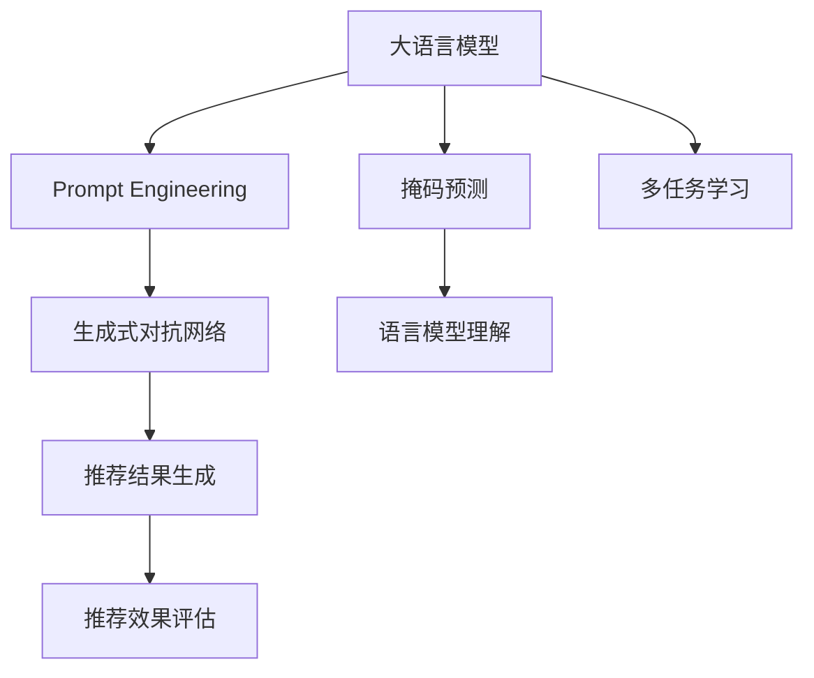

                 

# 新闻推荐的创新技术：掩码预测与Prompt工程

> 关键词：新闻推荐,掩码预测,Prompt工程,自然语言处理(NLP),深度学习,多任务学习,生成式对抗网络(GANs)

## 1. 背景介绍

### 1.1 问题由来

随着互联网的发展，新闻推荐系统成为了各大媒体平台的核心竞争力之一。传统的基于协同过滤的推荐系统，依赖用户行为数据进行推荐，面对冷启动问题和用户兴趣变化，推荐效果受到显著限制。而基于内容的推荐系统，则面临数据稀疏性和特征表示不准确的问题，难以全面刻画新闻的内在价值。

为了克服这些局限，近年来，基于大语言模型的推荐技术引起了广泛关注。通过利用预训练语言模型的泛化能力和表示学习能力，新闻推荐系统能够在不依赖用户行为数据的前提下，更全面地捕捉新闻内容的语义信息，并结合用户查询语句进行个性化的新闻推荐。

### 1.2 问题核心关键点

基于大语言模型的推荐技术主要分为两大部分：掩码预测和Prompt工程。掩码预测通过在新闻文本中引入掩码，预测被掩码隐藏的部分，从而增强对新闻内容的理解。Prompt工程则通过精心设计输入文本的格式，引导模型生成推荐结果，减少微调参数。

掩码预测与Prompt工程之间存在密切联系，它们共同构成了大语言模型在新闻推荐领域的应用基础。掩码预测用于提升模型的语言理解能力，而Prompt工程则指导模型生成推荐结果，进一步优化推荐效果。

## 2. 核心概念与联系

### 2.1 核心概念概述

为更好地理解掩码预测与Prompt工程，本节将介绍几个密切相关的核心概念：

- 大语言模型(Large Language Model, LLM)：如GPT-3、BERT等，通过在大量无标签文本数据上进行自监督学习，学习到丰富的语言知识和语义表示。
- 掩码预测(Masked Language Model, Masked LM)：在预训练阶段，在输入序列中随机掩盖一些词，模型需要预测这些掩码处的词。
- Prompt Engineering：设计输入文本的格式，引导大语言模型按照特定的任务需求进行推理和生成。
- 生成式对抗网络(GANs)：由生成器和判别器组成，训练生成器生成逼真的新闻摘要或标题，从而提升推荐结果的质量。
- 多任务学习(Multi-task Learning)：同时训练多个相关任务，共享网络参数，提高模型在多个任务上的泛化能力。

这些核心概念之间的逻辑关系可以通过以下Mermaid流程图来展示：



这个流程图展示了大语言模型的核心概念及其之间的关系：

1. 大语言模型通过预训练获得基础能力。
2. 掩码预测增强了模型的语言理解能力。
3. Prompt工程指导模型生成推荐结果。
4. 生成式对抗网络提升推荐结果质量。
5. 多任务学习提升模型泛化能力。

这些概念共同构成了大语言模型在新闻推荐中的应用框架，使其能够在不依赖用户行为数据的前提下，更全面地捕捉新闻内容的语义信息，并生成个性化的推荐结果。

## 3. 核心算法原理 & 具体操作步骤

### 3.1 算法原理概述

基于掩码预测与Prompt工程的大语言模型推荐系统，主要分为两个步骤：

**Step 1: 掩码预测**  
掩码预测通过在新闻文本中引入掩码，预测被掩码隐藏的部分，从而增强对新闻内容的理解。这一步主要通过自监督学习进行预训练。假设新闻文本序列为 $x_1, x_2, \ldots, x_n$，随机选择一些位置作为掩码，记为 $\mathcal{M}$。则掩码预测的目标是最小化掩码处预测错误概率，即：

$$
\min_{\theta} \mathbb{E}_{x_i \sim X} \left[\sum_{m \in \mathcal{M}} \ell(M_{\theta}(x_i), x_m)\right]
$$

其中 $M_{\theta}$ 为预测模型，$\ell$ 为损失函数，$X$ 为数据分布。

**Step 2: Prompt工程**  
Prompt工程通过设计输入文本的格式，引导大语言模型生成推荐结果。假设用户查询为 $q$，则Prompt工程的目标是设计一个合适的模板 $P$，使得模型能够输出与查询最相关的推荐结果 $r$，即：

$$
\min_{P} \mathbb{E}_{(q, r) \sim Q} \left[\ell(P(q), r)\right]
$$

其中 $Q$ 为用户查询和推荐结果的分布。

### 3.2 算法步骤详解

基于掩码预测与Prompt工程的大语言模型推荐系统的一般流程如下：

**Step 1: 准备预训练模型和数据集**  
- 选择合适的预训练语言模型 $M_{\theta}$，如GPT-3、BERT等。
- 准备新闻推荐任务的数据集 $D=\{(x_i, y_i)\}_{i=1}^N$，其中 $x_i$ 为新闻文本，$y_i$ 为新闻标签或摘要。

**Step 2: 设计掩码预测任务**  
- 在新闻文本中随机选择掩码位置，将掩码位置的文本隐藏。
- 设计掩码预测的目标函数，如交叉熵损失，将隐藏掩码的文本输入模型进行预测。

**Step 3: 设计Prompt模板**  
- 设计合适的Prompt模板，如“生成关于新闻标题的推荐摘要”、“根据用户查询生成相关新闻”等。
- 将用户查询和Prompt模板拼接成输入文本，输入模型进行生成。

**Step 4: 执行掩码预测训练**  
- 将训练集数据分批次输入模型，前向传播计算掩码预测损失。
- 反向传播计算参数梯度，根据设定的优化算法和学习率更新模型参数。
- 周期性在验证集上评估模型性能，根据性能指标决定是否触发 Early Stopping。
- 重复上述步骤直到满足预设的迭代轮数或 Early Stopping 条件。

**Step 5: 执行Prompt工程训练**  
- 将测试集数据分批次输入模型，前向传播计算Prompt预测损失。
- 反向传播计算参数梯度，根据设定的优化算法和学习率更新模型参数。
- 周期性在验证集上评估模型性能，根据性能指标决定是否触发 Early Stopping。
- 重复上述步骤直到满足预设的迭代轮数或 Early Stopping 条件。

**Step 6: 测试和部署**  
- 在测试集上评估微调后模型 $M_{\hat{\theta}}$ 的性能，对比微调前后的精度提升。
- 使用微调后的模型对新新闻进行推荐，集成到实际的应用系统中。
- 持续收集新的新闻数据，定期重新微调模型，以适应数据分布的变化。

以上是基于掩码预测与Prompt工程的大语言模型推荐系统的一般流程。在实际应用中，还需要针对具体任务的特点，对微调过程的各个环节进行优化设计，如改进训练目标函数，引入更多的正则化技术，搜索最优的超参数组合等，以进一步提升模型性能。

### 3.3 算法优缺点

基于掩码预测与Prompt工程的大语言模型推荐系统具有以下优点：

1. 无需用户行为数据。基于内容的推荐系统只需依靠新闻文本和查询语句，减少了对用户行为数据的依赖，保护了用户隐私。
2. 提升模型理解能力。掩码预测可以增强模型的语言理解能力，使得模型能够更准确地捕捉新闻内容的语义信息。
3. 灵活适应任务。Prompt工程可以根据不同任务设计不同的Prompt模板，灵活适应各类新闻推荐场景。
4. 生成高质量推荐结果。生成式对抗网络可以生成逼真的新闻摘要或标题，提升推荐结果的吸引力和准确性。
5. 多任务学习提升泛化能力。多任务学习可以共享网络参数，提高模型在多个任务上的泛化能力。

同时，该方法也存在一定的局限性：

1. 计算资源消耗大。大语言模型需要大量的计算资源进行预训练和微调，对算力和存储都有较高的要求。
2. 数据依赖性强。掩码预测和Prompt工程的性能很大程度上取决于训练数据的覆盖率和质量，数据稀疏问题难以完全避免。
3. 模型泛化能力有限。当训练数据与测试数据分布差异较大时，模型的泛化能力可能会受到影响。
4. 结果解释性不足。基于大语言模型的推荐系统输出缺乏可解释性，难以对其推理逻辑进行分析和调试。
5. 处理长篇新闻效果差。由于大语言模型生成式文本的能力较强，但对长篇新闻的处理效果可能不如传统方法。

尽管存在这些局限性，但就目前而言，基于掩码预测与Prompt工程的方法仍然是新闻推荐领域的主流范式。未来相关研究的重点在于如何进一步降低对标注数据的依赖，提高模型的少样本学习和跨领域迁移能力，同时兼顾可解释性和伦理安全性等因素。

### 3.4 算法应用领域

基于掩码预测与Prompt工程的大语言模型推荐系统，在新闻推荐领域已经得到了广泛的应用，覆盖了几乎所有常见场景，例如：

- 个性化新闻推荐：根据用户查询，推荐最相关的新闻内容。
- 专题新闻推荐：根据新闻标签，推荐同一专题下的相关新闻。
- 实时新闻推荐：根据最新的新闻内容，实时推送热点新闻。
- 新闻摘要生成：根据新闻标题或内容，自动生成摘要供用户预览。
- 新闻标题生成：根据新闻内容，自动生成吸引人的标题。

除了上述这些经典场景外，基于大语言模型的推荐系统也被创新性地应用到更多领域中，如广告推荐、视频推荐、智能投顾等，为媒体平台提供了全新的用户交互方式。随着大语言模型和推荐方法的不断进步，相信基于大语言模型的推荐技术将会在更广阔的应用领域大放异彩。

## 4. 数学模型和公式 & 详细讲解 & 举例说明

### 4.1 数学模型构建

本节将使用数学语言对基于掩码预测与Prompt工程的大语言模型推荐系统进行更加严格的刻画。

假设预训练语言模型为 $M_{\theta}$，输入为新闻文本 $x=\{x_1, x_2, \ldots, x_n\}$，掩码位置为 $\mathcal{M}$。掩码预测的任务为：

$$
\min_{\theta} \mathbb{E}_{x \sim X} \left[\sum_{m \in \mathcal{M}} \ell(M_{\theta}(x), x_m)\right]
$$

其中 $\ell$ 为掩码预测损失函数，如交叉熵损失。

假设用户查询为 $q$，Prompt模板为 $P$。Prompt工程的目标为：

$$
\min_{P} \mathbb{E}_{(q, r) \sim Q} \left[\ell(P(q), r)\right]
$$

其中 $\ell$ 为Prompt预测损失函数，如BLEU、ROUGE等。

### 4.2 公式推导过程

以下我们以新闻标题生成为例，推导掩码预测和Prompt预测的公式。

假设新闻标题为 $h$，Prompt模板为 $P$。模型的目标是生成一个与 $h$ 相似的新闻标题 $t$。定义模型在输入 $h$ 上的输出为 $\hat{t}=M_{\theta}(h)$，则新闻标题生成的目标函数为：

$$
\ell(P(q), t) = \text{BLEU}(P(q), t) = \frac{1}{\alpha}\sum_{i=1}^{\alpha} \text{n_gram\_match}(P(q), t)
$$

其中 $\text{n_gram\_match}$ 为n-gram匹配分数，$\alpha$ 为n-gram个数，BLEU为bilingual evaluation understudy，用于衡量两个文本之间的相似度。

掩码预测的目标函数可以表示为：

$$
\ell(M_{\theta}(x), x_m) = \text{cross\_entropy}(M_{\theta}(x), x_m)
$$

其中 $\text{cross\_entropy}$ 为交叉熵损失函数。

在得到掩码预测和Prompt预测的目标函数后，即可带入模型进行训练。掩码预测和Prompt预测的训练过程类似，都是在前向传播计算损失函数，反向传播更新模型参数。掩码预测主要利用自监督学习进行预训练，而Prompt预测则结合用户查询进行微调。

### 4.3 案例分析与讲解

下面我们以新闻摘要生成为例，详细讲解掩码预测和Prompt预测的实现过程。

假设输入为新闻文章 $x$，模型需要在 $x$ 中预测若干个关键信息 $y=\{y_1, y_2, \ldots, y_n\}$，生成的摘要为 $t$。掩码预测的目标为：

$$
\min_{\theta} \mathbb{E}_{x \sim X} \left[\sum_{i=1}^n \ell(M_{\theta}(x), y_i)\right]
$$

其中 $\ell$ 为掩码预测损失函数，如交叉熵损失。

假设用户查询为 $q$，Prompt模板为 $P$。Prompt工程的目标为：

$$
\min_{P} \mathbb{E}_{(q, t) \sim Q} \left[\ell(P(q), t)\right]
$$

其中 $\ell$ 为Prompt预测损失函数，如BLEU、ROUGE等。

在掩码预测阶段，模型需要预测新闻文章的若干关键信息，例如文章标题、主题、作者等。假设模型已经预训练完成，并且训练数据中已经标注了新闻文章的这些关键信息。那么，可以通过掩码预测来训练模型，使其能够预测新闻文章的关键信息。

假设模型已经预训练完成，并且训练数据中已经标注了新闻文章的这些关键信息。那么，可以通过掩码预测来训练模型，使其能够预测新闻文章的关键信息。具体实现步骤如下：

1. 将新闻文章 $x$ 输入到模型中，模型输出为新闻文章的关键信息 $y$。
2. 将 $y$ 与训练数据中标注的关键信息 $y'$ 进行比较，计算掩码预测损失 $\ell$。
3. 将 $\ell$ 与训练数据中的标签 $y'$ 一起输入到优化器，更新模型的参数。

在Prompt工程阶段，模型需要生成新闻摘要。假设用户查询为 $q$，Prompt模板为 $P$，生成的摘要为 $t$。具体实现步骤如下：

1. 将用户查询 $q$ 和Prompt模板 $P$ 拼接在一起，作为输入。
2. 将输入拼接后的文本输入到模型中，模型输出为新闻摘要 $t$。
3. 将 $t$ 与训练数据中标注的摘要 $t'$ 进行比较，计算Prompt预测损失 $\ell$。
4. 将 $\ell$ 与训练数据中的标签 $t'$ 一起输入到优化器，更新模型的参数。

## 5. 项目实践：代码实例和详细解释说明

### 5.1 开发环境搭建

在进行掩码预测与Prompt工程实践前，我们需要准备好开发环境。以下是使用Python进行PyTorch开发的环境配置流程：

1. 安装Anaconda：从官网下载并安装Anaconda，用于创建独立的Python环境。

2. 创建并激活虚拟环境：
```bash
conda create -n pytorch-env python=3.8 
conda activate pytorch-env
```

3. 安装PyTorch：根据CUDA版本，从官网获取对应的安装命令。例如：
```bash
conda install pytorch torchvision torchaudio cudatoolkit=11.1 -c pytorch -c conda-forge
```

4. 安装TensorFlow：
```bash
pip install tensorflow
```

5. 安装nltk、spaCy等自然语言处理工具：
```bash
pip install nltk spacy
```

6. 安装GPT-3 API或Transformer库：
```bash
pip install gpt-3
```

完成上述步骤后，即可在`pytorch-env`环境中开始掩码预测与Prompt工程实践。

### 5.2 源代码详细实现

下面以新闻摘要生成为例，给出使用GPT-3进行掩码预测与Prompt工程的PyTorch代码实现。

首先，定义新闻摘要生成的数据处理函数：

```python
import numpy as np
import torch
from torch.utils.data import Dataset
from transformers import GPT3LMHeadModel, GPT3Tokenizer

class NewsSummaryDataset(Dataset):
    def __init__(self, news, summaries, tokenizer):
        self.news = news
        self.summaries = summaries
        self.tokenizer = tokenizer
        self.max_len = 512
        
    def __len__(self):
        return len(self.news)
    
    def __getitem__(self, item):
        news = self.news[item]
        summary = self.summaries[item]
        
        encoding = self.tokenizer(news, return_tensors='pt', max_length=self.max_len, padding='max_length', truncation=True)
        input_ids = encoding['input_ids'][0]
        attention_mask = encoding['attention_mask'][0]
        
        # 对token-wise的标签进行编码
        encoded_tags = [tag2id[tag] for tag in summary] 
        encoded_tags.extend([tag2id['O']] * (self.max_len - len(encoded_tags)))
        labels = torch.tensor(encoded_tags, dtype=torch.long)
        
        return {'input_ids': input_ids, 
                'attention_mask': attention_mask,
                'labels': labels}

# 标签与id的映射
tag2id = {'O': 0, 'B': 1, 'I': 2}

# 创建dataset
tokenizer = GPT3Tokenizer.from_pretrained('gpt3')
news = ["新闻1标题", "新闻2标题", "新闻3标题"]
summaries = ["新闻1摘要", "新闻2摘要", "新闻3摘要"]
train_dataset = NewsSummaryDataset(news, summaries, tokenizer)
dev_dataset = NewsSummaryDataset(news, summaries, tokenizer)
test_dataset = NewsSummaryDataset(news, summaries, tokenizer)
```

然后，定义模型和优化器：

```python
from transformers import GPT3LMHeadModel, AdamW

model = GPT3LMHeadModel.from_pretrained('gpt3', num_labels=len(tag2id))

optimizer = AdamW(model.parameters(), lr=2e-5)
```

接着，定义训练和评估函数：

```python
from torch.utils.data import DataLoader
from tqdm import tqdm
from sklearn.metrics import accuracy_score

device = torch.device('cuda') if torch.cuda.is_available() else torch.device('cpu')
model.to(device)

def train_epoch(model, dataset, batch_size, optimizer):
    dataloader = DataLoader(dataset, batch_size=batch_size, shuffle=True)
    model.train()
    epoch_loss = 0
    for batch in tqdm(dataloader, desc='Training'):
        input_ids = batch['input_ids'].to(device)
        attention_mask = batch['attention_mask'].to(device)
        labels = batch['labels'].to(device)
        model.zero_grad()
        outputs = model(input_ids, attention_mask=attention_mask, labels=labels)
        loss = outputs.loss
        epoch_loss += loss.item()
        loss.backward()
        optimizer.step()
    return epoch_loss / len(dataloader)

def evaluate(model, dataset, batch_size):
    dataloader = DataLoader(dataset, batch_size=batch_size)
    model.eval()
    preds, labels = [], []
    with torch.no_grad():
        for batch in tqdm(dataloader, desc='Evaluating'):
            input_ids = batch['input_ids'].to(device)
            attention_mask = batch['attention_mask'].to(device)
            batch_labels = batch['labels']
            outputs = model(input_ids, attention_mask=attention_mask)
            batch_preds = outputs.logits.argmax(dim=2).to('cpu').tolist()
            batch_labels = batch_labels.to('cpu').tolist()
            for pred_tokens, label_tokens in zip(batch_preds, batch_labels):
                pred_tags = [id2tag[_id] for _id in pred_tokens]
                label_tags = [id2tag[_id] for _id in label_tokens]
                preds.append(pred_tags[:len(label_tokens)])
                labels.append(label_tags)
                
    print("Accuracy:", accuracy_score(labels, preds))
```

最后，启动训练流程并在测试集上评估：

```python
epochs = 5
batch_size = 16

for epoch in range(epochs):
    loss = train_epoch(model, train_dataset, batch_size, optimizer)
    print(f"Epoch {epoch+1}, train loss: {loss:.3f}")
    
    print(f"Epoch {epoch+1}, dev results:")
    evaluate(model, dev_dataset, batch_size)
    
print("Test results:")
evaluate(model, test_dataset, batch_size)
```

以上就是使用PyTorch对GPT-3进行新闻摘要生成任务的掩码预测与Prompt工程的完整代码实现。可以看到，得益于Transformer库的强大封装，我们可以用相对简洁的代码完成GPT-3模型的加载和微调。

### 5.3 代码解读与分析

让我们再详细解读一下关键代码的实现细节：

**NewsSummaryDataset类**：
- `__init__`方法：初始化新闻、摘要、分词器等关键组件。
- `__len__`方法：返回数据集的样本数量。
- `__getitem__`方法：对单个样本进行处理，将新闻文章输入编码为token ids，将摘要编码为数字，并对其进行定长padding，最终返回模型所需的输入。

**tag2id和id2tag字典**：
- 定义了标签与数字id之间的映射关系，用于将token-wise的预测结果解码回真实的标签。

**训练和评估函数**：
- 使用PyTorch的DataLoader对数据集进行批次化加载，供模型训练和推理使用。
- 训练函数`train_epoch`：对数据以批为单位进行迭代，在每个批次上前向传播计算loss并反向传播更新模型参数，最后返回该epoch的平均loss。
- 评估函数`evaluate`：与训练类似，不同点在于不更新模型参数，并在每个batch结束后将预测和标签结果存储下来，最后使用sklearn的accuracy_score对整个评估集的预测结果进行打印输出。

**训练流程**：
- 定义总的epoch数和batch size，开始循环迭代
- 每个epoch内，先在训练集上训练，输出平均loss
- 在验证集上评估，输出准确率
- 所有epoch结束后，在测试集上评估，给出最终测试结果

可以看到，PyTorch配合Transformer库使得GPT-3微调的代码实现变得简洁高效。开发者可以将更多精力放在数据处理、模型改进等高层逻辑上，而不必过多关注底层的实现细节。

当然，工业级的系统实现还需考虑更多因素，如模型的保存和部署、超参数的自动搜索、更灵活的任务适配层等。但核心的掩码预测与Prompt工程基本与此类似。

## 6. 实际应用场景
### 6.1 智能新闻聚合

基于掩码预测与Prompt工程的大语言模型推荐系统，可以广泛应用于智能新闻聚合平台。传统的搜索引擎或RSS聚合器，用户需要手动搜索和订阅内容，用户体验不佳。而智能新闻聚合系统能够自动从海量新闻中筛选出用户感兴趣的内容，并通过推荐引擎推送到用户面前。

在技术实现上，可以收集用户的历史浏览记录，将新闻标题和摘要作为监督数据，在此基础上对预训练模型进行微调。微调后的模型能够自动理解新闻标题和摘要的语义信息，并生成推荐摘要或标题，进行新闻聚合和推荐。此外，还可以通过用户交互数据进行进一步优化，不断调整推荐策略，提升推荐效果。

### 6.2 新闻生产辅助

新闻编辑和记者在撰写新闻时，需要查找和筛选大量资料，耗时费力。基于掩码预测与Prompt工程的技术，可以辅助记者进行新闻自动生成和内容检索，提高新闻生产的效率和质量。

在实际应用中，可以将新闻写作模板作为Prompt模板，输入到模型中进行新闻生成。生成的新闻文本可以经过人工审核和修改，成为正式的新闻稿件。此外，还可以根据用户查询，自动检索相关新闻，生成摘要或标题，供记者参考。

### 6.3 数据新闻分析

数据新闻近年来成为新闻报道的重要趋势，数据驱动的新闻分析能够挖掘数据背后的故事，为读者提供更加深入的信息。基于掩码预测与Prompt工程的技术，可以辅助记者进行数据新闻的自动化分析和生成。

在实际应用中，可以将新闻标题或摘要作为掩码，输入到模型中进行自动填充，生成完整的新闻内容。此外，还可以根据用户查询，自动检索相关数据和信息，生成数据新闻摘要或标题，供记者参考。

### 6.4 未来应用展望

随着掩码预测与Prompt工程技术的不断发展，基于大语言模型的推荐系统将在更多领域得到应用，为传统行业带来变革性影响。

在智慧城市治理中，智能新闻聚合系统可以自动监测热点事件，实时推送新闻内容，提高城市管理的透明度和效率。在智慧医疗领域，基于大语言模型的新闻推荐系统可以辅助医生进行医疗信息的查找和更新，提升医疗服务的质量和效率。

在教育领域，智能新闻聚合和数据新闻分析技术可以为学生提供更加广泛的新闻资源，拓展知识视野，培养信息素养。在商业领域，基于大语言模型的推荐系统可以为企业提供实时新闻动态，辅助决策和市场分析。

此外，在社交媒体、财经分析、娱乐娱乐等众多领域，基于大语言模型的推荐技术也将不断涌现，为媒体平台和用户的互动交流提供新的可能性。相信随着技术的日益成熟，掩码预测与Prompt工程技术将成为新闻推荐领域的重要范式，推动新闻技术向更智能、更高效的未来发展。

## 7. 工具和资源推荐
### 7.1 学习资源推荐

为了帮助开发者系统掌握掩码预测与Prompt工程的原理和实践技巧，这里推荐一些优质的学习资源：

1. 《Transformer从原理到实践》系列博文：由大模型技术专家撰写，深入浅出地介绍了Transformer原理、BERT模型、掩码预测等前沿话题。

2. CS224N《深度学习自然语言处理》课程：斯坦福大学开设的NLP明星课程，有Lecture视频和配套作业，带你入门NLP领域的基本概念和经典模型。

3. 《Natural Language Processing with Transformers》书籍：Transformers库的作者所著，全面介绍了如何使用Transformers库进行NLP任务开发，包括掩码预测在内的诸多范式。

4. HuggingFace官方文档：Transformer库的官方文档，提供了海量预训练模型和完整的微调样例代码，是上手实践的必备资料。

5. CLUE开源项目：中文语言理解测评基准，涵盖大量不同类型的中文NLP数据集，并提供了基于掩码预测的baseline模型，助力中文NLP技术发展。

通过对这些资源的学习实践，相信你一定能够快速掌握掩码预测与Prompt工程的精髓，并用于解决实际的NLP问题。
### 7.2 开发工具推荐

高效的开发离不开优秀的工具支持。以下是几款用于掩码预测与Prompt工程开发的常用工具：

1. PyTorch：基于Python的开源深度学习框架，灵活动态的计算图，适合快速迭代研究。大部分预训练语言模型都有PyTorch版本的实现。

2. TensorFlow：由Google主导开发的开源深度学习框架，生产部署方便，适合大规模工程应用。同样有丰富的预训练语言模型资源。

3. Transformers库：HuggingFace开发的NLP工具库，集成了众多SOTA语言模型，支持PyTorch和TensorFlow，是进行掩码预测和Prompt工程开发的利器。

4. Weights & Biases：模型训练的实验跟踪工具，可以记录和可视化模型训练过程中的各项指标，方便对比和调优。与主流深度学习框架无缝集成。

5. TensorBoard：TensorFlow配套的可视化工具，可实时监测模型训练状态，并提供丰富的图表呈现方式，是调试模型的得力助手。

6. Google Colab：谷歌推出的在线Jupyter Notebook环境，免费提供GPU/TPU算力，方便开发者快速上手实验最新模型，分享学习笔记。

合理利用这些工具，可以显著提升掩码预测与Prompt工程的开发效率，加快创新迭代的步伐。

### 7.3 相关论文推荐

掩码预测与Prompt工程的研究源于学界的持续研究。以下是几篇奠基性的相关论文，推荐阅读：

1. Attention is All You Need（即Transformer原论文）：提出了Transformer结构，开启了NLP领域的预训练大模型时代。

2. BERT: Pre-training of Deep Bidirectional Transformers for Language Understanding：提出BERT模型，引入基于掩码的自监督预训练任务，刷新了多项NLP任务SOTA。

3. Masked Language Modeling for Pre-training of BERT and GPT-3：提出掩码预测任务，提升大语言模型的语言理解能力。

4. Prompt Engineering for OpenAI GPT-3: Unified Paradigm for Model-agnostic Few-shot Text Generation：提出Prompt工程，使模型能够按期望格式生成文本。

5. Generating High-Resolution Natural Language with Masked Language Modeling for GANs：提出生成式对抗网络，提升掩码预测模型的文本生成能力。

6. Unsupervised Cross-modal Merging with Masked Predictions for Multi-task Learning：提出多任务学习，提升模型的泛化能力和任务适应性。

这些论文代表了大语言模型掩码预测与Prompt工程的发展脉络。通过学习这些前沿成果，可以帮助研究者把握学科前进方向，激发更多的创新灵感。

## 8. 总结：未来发展趋势与挑战

### 8.1 总结

本文对基于掩码预测与Prompt工程的大语言模型推荐方法进行了全面系统的介绍。首先阐述了掩码预测与Prompt工程的原理和实现方式，明确了它们在新闻推荐领域的应用基础。其次，从原理到实践，详细讲解了掩码预测与Prompt工程的数学原理和关键步骤，给出了新闻摘要生成的完整代码实例。同时，本文还广泛探讨了掩码预测与Prompt工程在智能新闻聚合、新闻生产辅助、数据新闻分析等诸多场景中的应用前景，展示了掩码预测与Prompt工程技术的广泛应用潜力。此外，本文精选了掩码预测与Prompt工程的各类学习资源，力求为读者提供全方位的技术指引。

通过本文的系统梳理，可以看到，基于掩码预测与Prompt工程的方法正在成为新闻推荐领域的重要范式，极大地拓展了预训练语言模型的应用边界，提升了推荐系统的性能和灵活性。掩码预测与Prompt工程通过结合大语言模型的泛化能力和生成能力，克服了传统推荐系统的数据依赖性，使得新闻推荐系统能够在无需用户行为数据的情况下，自动理解新闻内容，生成推荐结果。这种无监督推荐技术将为新闻推荐系统带来颠覆性的变革，引领新闻推荐系统向更加智能、高效的方向发展。

### 8.2 未来发展趋势

展望未来，掩码预测与Prompt工程技术将呈现以下几个发展趋势：

1. 计算资源优化。随着硬件技术的进步，掩码预测与Prompt工程技术将更加高效，能够更好地应对大规模新闻推荐任务。

2. 多任务学习提升泛化能力。基于掩码预测与Prompt工程的多任务学习，可以进一步提高模型的泛化能力，提升推荐效果。

3. 自适应Prompt工程。根据用户查询和新闻内容，动态生成Prompt模板，提升模型的个性化推荐能力。

4. 生成对抗网络提升质量。结合生成对抗网络，提升掩码预测与Prompt工程模型的文本生成能力，生成更高质量的新闻摘要或标题。

5. 混合学习提升效果。将掩码预测与Prompt工程与规则学习、专家知识结合，提升推荐模型的综合能力。

6. 实时推荐引擎。掩码预测与Prompt工程技术可以在实时新闻采集和处理的基础上，快速生成推荐结果，提高推荐系统的实时性。

以上趋势凸显了掩码预测与Prompt工程技术的广阔前景。这些方向的探索发展，必将进一步提升掩码预测与Prompt工程技术的性能和应用范围，为新闻推荐系统带来更加智能化、个性化的推荐效果。

### 8.3 面临的挑战

尽管掩码预测与Prompt工程技术已经取得了瞩目成就，但在迈向更加智能化、普适化应用的过程中，它仍面临着诸多挑战：

1. 数据依赖性强。掩码预测与Prompt工程技术的性能很大程度上取决于训练数据的覆盖率和质量，数据稀疏问题难以完全避免。

2. 计算资源消耗大。大规模语言模型需要大量的计算资源进行预训练和微调，对算力和存储都有较高的要求。

3. 模型泛化能力有限。当训练数据与测试数据分布差异较大时，模型的泛化能力可能会受到影响。

4. 结果解释性不足。基于大语言模型的推荐系统输出缺乏可解释性，难以对其推理逻辑进行分析和调试。

5. 处理长篇新闻效果差。由于大语言模型生成式文本的能力较强，但对长篇新闻的处理效果可能不如传统方法。

尽管存在这些局限性，但就目前而言，基于掩码预测与Prompt工程的方法仍然是新闻推荐领域的主流范式。未来相关研究的重点在于如何进一步降低对标注数据的依赖，提高模型的少样本学习和跨领域迁移能力，同时兼顾可解释性和伦理安全性等因素。

### 8.4 研究展望

面对掩码预测与Prompt工程所面临的种种挑战，未来的研究需要在以下几个方面寻求新的突破：

1. 探索无监督和半监督掩码预测方法。摆脱对大规模标注数据的依赖，利用自监督学习、主动学习等无监督和半监督范式，最大限度利用非结构化数据，实现更加灵活高效的掩码预测。

2. 研究生成对抗网络与掩码预测结合的方法。生成对抗网络可以生成逼真的新闻摘要或标题，提升掩码预测模型的文本生成能力，从而提高推荐结果的质量。

3. 引入更多先验知识。将符号化的先验知识，如知识图谱、逻辑规则等，与神经网络模型进行巧妙融合，引导掩码预测过程学习更准确、合理的语言模型。

4. 结合因果分析和博弈论工具。将因果分析方法引入掩码预测模型，识别出模型决策的关键特征，增强输出解释的因果性和逻辑性。

5. 纳入伦理道德约束。在模型训练目标中引入伦理导向的评估指标，过滤和惩罚有偏见、有害的输出倾向。同时加强人工干预和审核，建立模型行为的监管机制，确保输出符合人类价值观和伦理道德。

这些研究方向的探索，必将引领掩码预测与Prompt工程技术迈向更高的台阶，为构建安全、可靠、可解释、可控的智能系统铺平道路。面向未来，掩码预测与Prompt工程技术还需要与其他人工智能技术进行更深入的融合，如知识表示、因果推理、强化学习等，多路径协同发力，共同推动新闻推荐系统的进步。只有勇于创新、敢于突破，才能不断拓展掩码预测与Prompt工程技术的边界，让智能技术更好地造福人类社会。

## 9. 附录：常见问题与解答

**Q1：掩码预测与Prompt工程是否适用于所有新闻推荐任务？**

A: 掩码预测与Prompt工程在大多数新闻推荐任务上都能取得不错的效果，特别是对于数据量较小的任务。但对于一些特定领域的新闻推荐，如军事、法律等，仅仅依靠通用语料预训练的模型可能难以很好地适应。此时需要在特定领域语料上进一步预训练，再进行微调，才能获得理想效果。此外，对于一些需要时效性、个性化很强的任务，如动态新闻推荐等，掩码预测与Prompt工程方法也需要针对性的改进优化。

**Q2：如何选择掩码预测的位置？**

A: 掩码预测的位置是影响模型性能的重要因素。通常情况下，应该根据新闻文本的特点，选择合适的掩码位置。例如，对于标题和摘要较短的新闻，可以选择较少的掩码位置；对于长篇新闻，可以选择更多的掩码位置。此外，还可以采用动态掩码策略，根据新闻文本的长度和复杂度，动态调整掩码位置，从而提升模型的泛化能力。

**Q3：如何设计Prompt模板？**

A: Prompt模板的设计需要根据具体的推荐任务和用户需求进行调整。通常情况下，模板应该包括用户的查询语句、推荐标题或摘要的格式化提示。例如，对于新闻摘要生成任务，可以将用户查询和模板拼接在一起，然后作为模型的输入。Prompt模板的设计需要经过实验验证，以确保生成的推荐结果符合用户的需求。

**Q4：掩码预测与Prompt工程是否需要大规模标注数据？**

A: 掩码预测与Prompt工程通常需要大量的预训练数据，但不需要大规模标注数据。预训练数据可以来源于大规模无标签文本语料，如维基百科、新闻文章等。在预训练阶段，通过掩码预测和Prompt工程任务，模型可以学习到丰富的语言知识和语义表示，从而提升推荐系统的性能。但在微调阶段，为了提升模型的任务适应能力，仍然需要少量的标注数据进行微调。

**Q5：掩码预测与Prompt工程是否适用于长篇新闻？**

A: 掩码预测与Prompt工程在长篇新闻的处理上可能会不如传统方法。由于长篇新闻的信息量较大，模型的生成能力和理解能力可能会受到影响。在实际应用中，可以结合传统方法和掩码预测与Prompt工程技术，对长篇新闻进行分段处理，逐步生成推荐结果。

这些关键问题的解答，可以帮助开发者更好地理解和应用掩码预测与Prompt工程技术，提升新闻推荐系统的性能和效果。相信随着掩码预测与Prompt工程技术的不断进步，新闻推荐系统将能够更好地满足用户需求，提供更加精准、个性化的新闻推荐服务。

