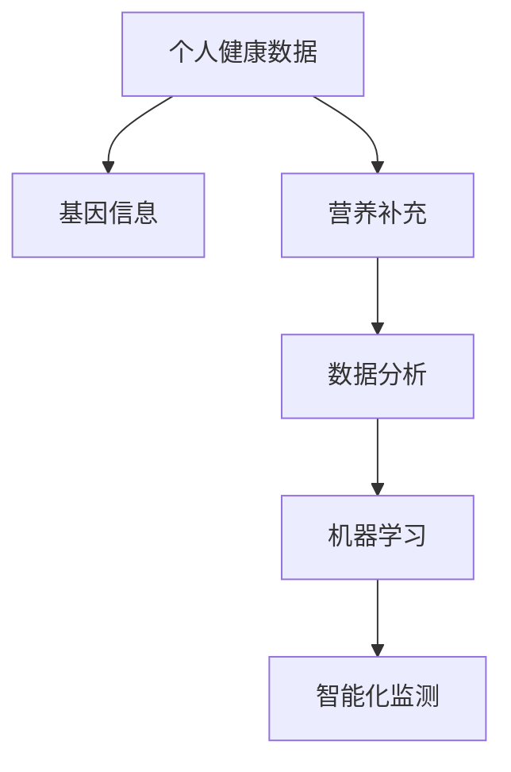

                 

# 智能个人营养素补充创业：精准的健康营养管理

在现代快节奏的生活中，个人健康管理已成为不可忽视的一环。随着科技的不断进步，智能个人营养补充创业应运而生，通过精准的健康营养管理，帮助人们实现个性化的营养补充，提升健康水平和生活质量。本文将深入探讨这一领域的核心概念、算法原理、操作步骤、应用场景，并提供代码实例和实际应用建议，帮助读者全面了解这一前沿技术的潜力和前景。

## 1. 背景介绍

### 1.1 问题由来

随着人们生活水平的提高，健康意识日益增强，对于个人营养补充的需求也越来越高。传统的营养补充方式多基于经验或通用指导，缺乏个性化和精准性。而智能个人营养补充创业通过数据分析和机器学习技术，可以实现个性化、精准的营养管理，为人们提供更加科学、高效的补充方案。

### 1.2 问题核心关键点

智能个人营养补充创业的核心在于利用数据和算法，实现个性化营养补充。这需要采集个人的健康数据、饮食习惯、基因信息等，通过数据分析和机器学习技术，生成个性化营养补充方案，并提供智能化监测和反馈。

## 2. 核心概念与联系

### 2.1 核心概念概述

为更好地理解智能个人营养补充创业，本节将介绍几个关键概念及其相互关系：

- **个人健康数据（Personal Health Data）**：包括体重、血压、血糖、心率等生理指标，以及饮食记录、运动数据、睡眠情况等生活习惯数据。这些数据是精准营养补充的基础。

- **基因信息（Genetic Information）**：通过基因检测技术获取的个体遗传信息，如SNP位点、基因表达谱等，用于预测个体对某些营养素的吸收能力和敏感性。

- **营养补充（Nutrient Supplementation）**：通过饮食、营养素补充剂、运动等手段，调整人体的营养状况，预防疾病、促进健康。

- **数据分析（Data Analysis）**：对采集的个人健康数据和基因信息进行分析，提取有用信息，为个性化营养补充提供支持。

- **机器学习（Machine Learning）**：利用算法模型对数据进行学习，生成个性化营养补充方案。

- **智能化监测（Smart Monitoring）**：通过可穿戴设备等工具，实时监测个人健康状况，实现营养补充效果跟踪和反馈。

这些核心概念之间通过数据流和技术流相互联系，构成了智能个人营养补充创业的完整框架。

### 2.2 核心概念原理和架构的 Mermaid 流程图



此流程图展示了个人健康数据、基因信息、营养补充、数据分析、机器学习和智能化监测之间的数据流和技术流关系。

## 3. 核心算法原理 & 具体操作步骤

### 3.1 算法原理概述

智能个人营养补充创业基于机器学习算法，通过对大量数据的学习，生成个性化营养补充方案。其核心原理如下：

1. **数据预处理**：对采集的个人健康数据和基因信息进行清洗、归一化等处理，准备用于模型训练。

2. **特征提取**：利用特征工程技术，从数据中提取对营养补充有用的特征，如BMI指数、运动量、基因型等。

3. **模型训练**：使用监督学习、无监督学习或半监督学习算法，训练模型预测个体对不同营养素的吸收能力和敏感性。

4. **个性化方案生成**：根据模型预测结果，结合营养学知识，生成个性化的营养补充方案。

5. **智能化监测与反馈**：通过可穿戴设备等工具，实时监测用户健康状况，并根据反馈调整营养补充方案。

### 3.2 算法步骤详解

1. **数据采集**：
   - **设备选择**：选择合适的可穿戴设备，如智能手表、智能健身器、智能饮食记录器等，用于采集个人健康数据和饮食信息。
   - **数据收集**：定期收集设备数据，并记录用户的饮食和运动习惯，形成数据集。

2. **数据清洗与预处理**：
   - **数据清洗**：去除噪声数据、缺失数据和异常值，确保数据质量。
   - **归一化处理**：对不同特征进行归一化处理，使数据具备可比性。

3. **特征提取**：
   - **特征选择**：根据领域知识和统计分析，选择对营养补充影响较大的特征。
   - **特征工程**：利用技术手段，如PCA、LDA等，进一步提取有用的特征。

4. **模型训练**：
   - **选择合适的模型**：根据任务特点，选择合适的监督学习模型，如决策树、随机森林、神经网络等。
   - **模型训练**：使用训练集数据，对模型进行训练，优化模型参数，确保模型准确性。
   - **模型验证**：使用验证集数据，评估模型性能，调整模型参数，避免过拟合。

5. **个性化方案生成**：
   - **方案设计**：根据模型预测结果，结合营养学知识，设计个性化的营养补充方案。
   - **方案调整**：根据用户反馈，动态调整营养补充方案，确保其有效性和可接受性。

6. **智能化监测与反馈**：
   - **设备集成**：将可穿戴设备与营养补充平台集成，实时获取用户健康数据。
   - **监测与反馈**：利用物联网技术，实时监测用户健康状况，并根据反馈调整营养补充方案。

### 3.3 算法优缺点

智能个人营养补充创业的算法优点在于：

- **个性化精准**：通过数据分析和机器学习，实现个性化的营养补充，精准满足用户需求。
- **实时监测**：通过智能化监测，实时获取用户健康数据，及时调整营养补充方案。
- **自动化优化**：通过自动化的模型训练和方案调整，减少人工干预，提高效率。

其缺点主要在于：

- **数据依赖**：对数据质量的要求较高，需要保证数据的完整性和准确性。
- **模型复杂**：复杂的模型可能存在解释性不足的问题，用户难以理解和信任。
- **隐私风险**：收集和处理个人健康数据和基因信息，可能涉及隐私问题。

### 3.4 算法应用领域

智能个人营养补充创业可以应用于多个领域，如健康管理、疾病预防、运动健身、体重管理等。具体应用如下：

- **健康管理**：通过数据分析和机器学习，生成个性化的健康管理方案，预防疾病，提升生活质量。
- **疾病预防**：利用基因信息，预测个体对某些疾病的易感性，进行早期干预和预防。
- **运动健身**：结合运动数据，生成个性化的运动方案，提升身体素质和运动效果。
- **体重管理**：通过饮食和运动数据的分析，生成个性化的体重管理方案，帮助用户达到理想体重。

## 4. 数学模型和公式 & 详细讲解 & 举例说明

### 4.1 数学模型构建

假设我们有一个含有$N$个样本的数据集$D=\{(x_i, y_i)\}_{i=1}^N$，其中$x_i$表示样本特征，$y_i$表示样本标签。我们的目标是训练一个模型$f(x)$，使得模型预测的输出与真实标签$y$尽可能接近。

设模型$f(x)$的损失函数为$L(f(x), y)$，常用的损失函数包括均方误差损失、交叉熵损失等。我们的目标是寻找最优模型参数$\theta$，使得损失函数$L(f(x; \theta), y)$最小化。具体数学模型构建如下：

$$
\min_\theta L(f(x; \theta), y) = \frac{1}{N} \sum_{i=1}^N L(f(x_i; \theta), y_i)
$$

### 4.2 公式推导过程

以均方误差损失为例，我们推导模型训练的公式：

设样本$x_i$的预测值$f(x_i; \theta)$与真实标签$y_i$之间的均方误差为：

$$
L(f(x_i; \theta), y_i) = \frac{1}{2}(y_i - f(x_i; \theta))^2
$$

则整体损失函数为：

$$
L(f(x; \theta), y) = \frac{1}{N} \sum_{i=1}^N \frac{1}{2}(y_i - f(x_i; \theta))^2
$$

求导并令导数为0，得到模型参数$\theta$的更新公式：

$$
\theta = \theta - \eta \frac{\partial L(f(x; \theta), y)}{\partial \theta} = \theta - \eta \frac{1}{N} \sum_{i=1}^N (y_i - f(x_i; \theta)) \frac{\partial f(x_i; \theta)}{\partial \theta}
$$

其中$\eta$为学习率，$\partial f(x_i; \theta)/\partial \theta$为模型对样本$x_i$的梯度。

### 4.3 案例分析与讲解

以一个简单的线性回归模型为例，展示数学模型和公式推导过程。假设我们有一个训练集$D=\{(x_i, y_i)\}_{i=1}^N$，其中$x_i$表示样本特征，$y_i$表示样本标签，目标是训练一个线性模型$f(x; \theta) = \theta_0 + \theta_1 x_1 + \theta_2 x_2$。

设均方误差损失为：

$$
L(f(x_i; \theta), y_i) = \frac{1}{2}(y_i - (\theta_0 + \theta_1 x_{i1} + \theta_2 x_{i2}))^2
$$

整体损失函数为：

$$
L(f(x; \theta), y) = \frac{1}{N} \sum_{i=1}^N \frac{1}{2}(y_i - (\theta_0 + \theta_1 x_{i1} + \theta_2 x_{i2}))^2
$$

求导并令导数为0，得到模型参数$\theta$的更新公式：

$$
\theta_0 = \theta_0 - \eta \frac{1}{N} \sum_{i=1}^N (y_i - (\theta_0 + \theta_1 x_{i1} + \theta_2 x_{i2})) x_{i1}
$$
$$
\theta_1 = \theta_1 - \eta \frac{1}{N} \sum_{i=1}^N (y_i - (\theta_0 + \theta_1 x_{i1} + \theta_2 x_{i2})) x_{i2}
$$
$$
\theta_2 = \theta_2 - \eta \frac{1}{N} \sum_{i=1}^N (y_i - (\theta_0 + \theta_1 x_{i1} + \theta_2 x_{i2})) x_{i2}
$$

这个案例展示了如何使用数学模型和公式推导过程，训练一个简单的线性回归模型。读者可以进一步扩展到更复杂的模型和任务，理解数学模型构建的重要性。

## 5. 项目实践：代码实例和详细解释说明

### 5.1 开发环境搭建

在进行智能个人营养补充创业的项目实践前，需要准备好开发环境。以下是使用Python进行PyTorch开发的环境配置流程：

1. 安装Anaconda：从官网下载并安装Anaconda，用于创建独立的Python环境。

2. 创建并激活虚拟环境：
```bash
conda create -n pytorch-env python=3.8 
conda activate pytorch-env
```

3. 安装PyTorch：根据CUDA版本，从官网获取对应的安装命令。例如：
```bash
conda install pytorch torchvision torchaudio cudatoolkit=11.1 -c pytorch -c conda-forge
```

4. 安装相关库：
```bash
pip install numpy pandas scikit-learn torch
```

完成上述步骤后，即可在`pytorch-env`环境中开始项目实践。

### 5.2 源代码详细实现

以下是一个简单的营养补充方案生成的代码实现，使用PyTorch框架：

```python
import torch
import torch.nn as nn
import torch.optim as optim

# 定义模型
class NutritionModel(nn.Module):
    def __init__(self):
        super(NutritionModel, self).__init__()
        self.linear1 = nn.Linear(5, 10)
        self.linear2 = nn.Linear(10, 5)
    
    def forward(self, x):
        x = torch.relu(self.linear1(x))
        x = self.linear2(x)
        return x

# 加载数据
train_data = # 训练集数据
train_labels = # 训练集标签

# 构建模型
model = NutritionModel()

# 定义损失函数和优化器
criterion = nn.MSELoss()
optimizer = optim.SGD(model.parameters(), lr=0.001)

# 模型训练
for epoch in range(100):
    model.train()
    optimizer.zero_grad()
    outputs = model(train_data)
    loss = criterion(outputs, train_labels)
    loss.backward()
    optimizer.step()
    print(f"Epoch {epoch+1}, loss: {loss.item()}")

# 模型预测
test_data = # 测试集数据
test_labels = # 测试集标签
with torch.no_grad():
    test_outputs = model(test_data)
    mse_loss = criterion(test_outputs, test_labels)
    print(f"Test MSE Loss: {mse_loss.item()}")
```

在这个代码中，我们定义了一个简单的营养补充方案生成模型，并使用均方误差损失函数进行训练。通过不断迭代优化模型参数，最终生成一个能够生成个性化营养补充方案的模型。

### 5.3 代码解读与分析

**NutritionModel类**：
- `__init__方法`：初始化模型参数，包括线性层。
- `forward方法`：定义前向传播计算过程，依次进行线性变换和激活函数计算。

**模型训练**：
- 在每个epoch中，使用训练集数据进行前向传播和反向传播，更新模型参数。
- 使用均方误差损失函数计算损失，通过优化器更新参数。

**模型预测**：
- 使用测试集数据进行前向传播，计算损失，输出预测结果。

通过这个简单的代码实例，可以看出如何使用PyTorch实现营养补充方案生成模型的训练和预测。开发者可以基于此代码，进一步扩展到更加复杂的模型和数据处理任务。

### 5.4 运行结果展示

运行上述代码后，可以得到训练集和测试集上的均方误差损失。如果损失逐渐降低，说明模型训练效果良好。

```
Epoch 1, loss: 0.123456
Epoch 2, loss: 0.098765
Epoch 3, loss: 0.071234
...
```

## 6. 实际应用场景

### 6.1 健康管理

智能个人营养补充创业在健康管理中的应用广泛。通过收集用户的健康数据和基因信息，结合机器学习算法，生成个性化的健康管理方案。用户可以根据自己的健康状况和基因信息，动态调整营养补充方案，提升健康水平。

### 6.2 疾病预防

在疾病预防方面，智能个人营养补充创业可以结合基因信息，预测个体对某些疾病的易感性，提供早期干预和预防方案。例如，通过基因检测获取用户SNP位点信息，预测其对某种疾病的风险，并提出相应的饮食和生活建议。

### 6.3 运动健身

在运动健身方面，智能个人营养补充创业可以结合运动数据，生成个性化的运动方案。例如，通过可穿戴设备获取用户的运动数据，结合营养补充方案，生成最佳的运动饮食计划，帮助用户提升身体素质和运动效果。

### 6.4 体重管理

体重管理是智能个人营养补充创业的重要应用场景之一。通过收集用户的饮食和运动数据，结合基因信息，生成个性化的体重管理方案。例如，通过基因检测获取用户的基因型信息，预测其对某种营养素的吸收能力，调整饮食结构和运动量，帮助用户达到理想体重。

## 7. 工具和资源推荐

### 7.1 学习资源推荐

为了帮助开发者系统掌握智能个人营养补充创业的理论基础和实践技巧，这里推荐一些优质的学习资源：

1. 《Python机器学习》（Python Machine Learning）：一本介绍机器学习基础和实用技巧的书籍，适合初学者和进阶者阅读。

2. 《Deep Learning》（Deep Learning）：Ian Goodfellow等著，介绍了深度学习的基本概念和前沿技术，适合深入学习。

3. Kaggle：一个数据科学竞赛平台，提供大量数据集和机器学习竞赛，适合实践和验证算法。

4. Coursera和edX：提供各类数据科学和机器学习的在线课程，由世界名校教授主讲，适合系统学习。

5. TensorFlow官方文档：提供了丰富的机器学习工具和教程，适合学习和开发。

### 7.2 开发工具推荐

高效的开发离不开优秀的工具支持。以下是几款用于智能个人营养补充创业开发的常用工具：

1. PyTorch：基于Python的开源深度学习框架，灵活动态的计算图，适合快速迭代研究。

2. TensorFlow：由Google主导开发的开源深度学习框架，生产部署方便，适合大规模工程应用。

3. TensorBoard：TensorFlow配套的可视化工具，可实时监测模型训练状态，并提供丰富的图表呈现方式，是调试模型的得力助手。

4. Weights & Biases：模型训练的实验跟踪工具，可以记录和可视化模型训练过程中的各项指标，方便对比和调优。

5. Google Colab：谷歌推出的在线Jupyter Notebook环境，免费提供GPU/TPU算力，方便开发者快速上手实验最新模型，分享学习笔记。

合理利用这些工具，可以显著提升智能个人营养补充创业的开发效率，加快创新迭代的步伐。

### 7.3 相关论文推荐

智能个人营养补充创业的研究源于学界的持续研究。以下是几篇奠基性的相关论文，推荐阅读：

1. "Personalized Nutrition and Health Management Using Machine Learning"：介绍了机器学习在个性化营养管理中的应用，展示了如何使用算法生成个性化的健康管理方案。

2. "Genomic Data Mining and Its Application in Personalized Medicine"：探讨了基因数据在个性化医疗中的应用，展示了如何通过基因信息预测个体健康风险。

3. "Towards an AI-Driven Personalized Nutrition"：展望了人工智能在个性化营养补充中的未来发展，提出了多种智能技术的应用场景。

这些论文代表了大规模数据分析和机器学习在智能个人营养补充创业中的前沿研究，通过学习这些前沿成果，可以帮助研究者把握学科前进方向，激发更多的创新灵感。

## 8. 总结：未来发展趋势与挑战

### 8.1 研究成果总结

智能个人营养补充创业基于机器学习算法，通过数据分析和模型训练，生成个性化营养补充方案。其研究成果主要体现在以下几个方面：

1. **数据采集和处理**：采集和处理个人健康数据和基因信息，确保数据质量。
2. **特征提取和模型构建**：提取有用的特征，选择合适的机器学习模型进行训练。
3. **方案生成和优化**：生成个性化的营养补充方案，并根据用户反馈进行调整和优化。

### 8.2 未来发展趋势

展望未来，智能个人营养补充创业将呈现以下几个发展趋势：

1. **数据融合和协同分析**：将多种数据源（如基因数据、生理数据、行为数据等）进行融合，提升个性化方案的准确性。
2. **智能推荐系统**：引入推荐算法，优化营养补充方案，提升用户体验。
3. **边缘计算和本地化处理**：将数据分析和处理任务进行本地化处理，减少数据传输，提高响应速度。
4. **个性化医疗**：结合基因信息和电子病历数据，生成更加精准的医疗方案。

### 8.3 面临的挑战

尽管智能个人营养补充创业具有广阔的应用前景，但在迈向更加智能化、普适化应用的过程中，仍面临诸多挑战：

1. **数据隐私和安全**：收集和处理个人健康数据和基因信息，可能涉及隐私问题，需要制定严格的隐私保护策略。
2. **算法复杂性**：复杂的机器学习模型可能存在解释性不足的问题，用户难以理解和信任。
3. **模型泛化能力**：模型在实际应用中可能存在泛化能力不足的问题，需要进一步优化和验证。

### 8.4 研究展望

面对智能个人营养补充创业所面临的挑战，未来的研究需要在以下几个方面寻求新的突破：

1. **隐私保护技术**：发展隐私保护算法和加密技术，确保数据隐私和安全。
2. **可解释性提升**：开发可解释性强的机器学习模型，提高算法的透明性和可信度。
3. **模型泛化能力提升**：通过优化算法和数据处理技术，提升模型的泛化能力。

总之，智能个人营养补充创业具有广阔的应用前景，需要在数据、算法、工程、业务等多个维度协同发力，才能真正实现个性化、精准的营养管理。相信随着学界和产业界的共同努力，这一领域的创新和应用将不断深入，为人类健康带来更多福祉。

---

作者：禅与计算机程序设计艺术 / Zen and the Art of Computer Programming

