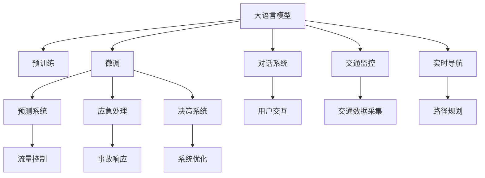

                 

## 1. 背景介绍

随着城市化进程的不断加快，城市交通管理面临着前所未有的挑战。随着私家车、公共交通工具、共享单车等交通工具的增加，交通拥堵、事故频发等问题日益严重。与此同时，车联网、智慧交通等技术的迅猛发展，为解决这些问题带来了新的机遇。

近年来，自然语言处理（Natural Language Processing, NLP）和大语言模型（Large Language Models, LLMs）在智能交通管理中的应用逐渐增多。利用预训练的LLMs，可以实时处理交通数据，辅助城市管理，提升交通效率。本文将介绍基于大语言模型优化的智能交通管理系统，探讨LLMs在城市出行优化中的应用。

## 2. 核心概念与联系

### 2.1 核心概念概述

大语言模型（LLMs）是一种通过深度学习技术构建的复杂语言模型，能够对大量文本数据进行建模和理解。这些模型通常基于自回归模型或自编码模型，采用Transformer等架构，通过预训练获得泛化能力。在大规模无标签文本数据上进行预训练后，大语言模型可以用于各种NLP任务，如文本分类、机器翻译、对话系统等。

智能交通管理（ITS）是利用信息技术和人工智能技术，对交通系统进行优化和管理的实践。它包括交通监控、实时导航、事故预测与处理等多个子系统。通过智能交通管理系统，可以实现交通流量控制、事故应急响应、智能停车等目标，提高交通系统的效率和安全性。

基于大语言模型的智能交通管理，利用LLMs对交通数据进行理解、分析和推理，辅助决策和控制。这种系统可以实时处理大量的交通数据，提升交通管理系统的智能化和自动化水平。

### 2.2 核心概念原理和架构的 Mermaid 流程图



这个流程图展示了LLMs在智能交通管理中的应用：

1. 大语言模型（A）通过预训练（B）获得泛化能力，经过微调（C）提升特定任务性能。
2. 微调后的LLMs用于对话系统（D），辅助用户交互（J）；
3. 用于交通监控（E）、实时导航（F）、预测系统（G）、应急处理（H）、决策系统（I）等子系统；
4. 这些系统通过数据采集（K）、路径规划（L）、流量控制（M）、事故响应（N）和系统优化（O）等操作，共同构成智能交通管理系统。

## 3. 核心算法原理 & 具体操作步骤

### 3.1 算法原理概述

基于大语言模型的智能交通管理系统，主要通过以下步骤优化城市出行：

1. **数据采集与预处理**：采集城市交通相关的数据，如车流量、交通信号灯状态、交通事故信息等。然后对数据进行清洗、标注和预处理，便于模型使用。
2. **模型预训练**：利用大规模无标签交通数据进行预训练，学习交通数据的泛化表示。
3. **模型微调**：在交通管理相关的标注数据上对预训练模型进行微调，提升其在特定任务上的性能。
4. **预测与决策**：微调后的模型用于交通数据处理和预测，辅助交通管理决策。

### 3.2 算法步骤详解

#### 3.2.1 数据采集与预处理

智能交通管理系统需要大量的交通数据。这些数据通常包括：

- **交通流量数据**：通过传感器、摄像头等设备采集的车辆位置和速度信息。
- **交通信号灯数据**：交通信号灯的状态信息，包括红绿灯、转弯灯等。
- **交通事故数据**：发生交通事故的时间、地点和原因等。
- **天气数据**：天气变化对交通的影响，如雨雪天气等。

数据采集完成后，需要对数据进行预处理：

- **清洗**：去除噪声和异常值，确保数据的准确性和完整性。
- **标注**：对部分数据进行标注，如将交通信号灯的状态标记为“红”或“绿”。
- **标准化**：对不同来源的数据进行标准化处理，使其统一格式和单位。

#### 3.2.2 模型预训练

利用大规模无标签交通数据对LLMs进行预训练，可以学习交通数据的泛化表示。预训练过程中，LLMs可以学习交通流、交通信号、事故预测等知识，提升对交通数据的理解和分析能力。

预训练过程一般包括：

- **自回归模型训练**：利用LSTM或Transformer等自回归模型，对交通数据进行建模。
- **自编码器训练**：利用自编码器对交通数据进行特征提取和重构。
- **预训练任务**：利用掩码语言模型、下棋游戏等自监督任务进行预训练。

#### 3.2.3 模型微调

在特定任务上，需要对预训练模型进行微调，提升其在特定任务上的性能。微调过程中，通常需要进行以下操作：

- **任务适配层**：设计特定的输出层和损失函数，以适应特定的任务。例如，对于交通流量预测任务，可以设计一个线性回归层和均方误差损失函数。
- **学习率设置**：通常需要较小的学习率，以免破坏预训练的权重。
- **正则化技术**：使用L2正则、Dropout、Early Stopping等技术，防止过拟合。
- **数据增强**：通过对交通数据进行改写、回译等方式增强训练集的多样性。

#### 3.2.4 预测与决策

微调后的LLMs可以用于交通数据的实时处理和预测，辅助交通管理决策。例如：

- **交通流量预测**：利用微调后的LLMs预测未来的交通流量，辅助交通流量控制。
- **事故预测**：利用微调后的LLMs预测潜在的交通事故，辅助事故应急响应。
- **路径规划**：利用微调后的LLMs计算最优路径，辅助实时导航。

### 3.3 算法优缺点

#### 3.3.1 优点

1. **泛化能力强**：利用预训练模型，LLMs可以学习大规模数据中的泛化知识，提升对未知数据的处理能力。
2. **实时性高**：LLMs可以实时处理和预测交通数据，辅助交通管理决策。
3. **可扩展性强**：LLMs可以方便地扩展到多种交通管理任务，提升系统的智能化水平。

#### 3.3.2 缺点

1. **数据依赖性高**：微调过程需要大量的标注数据，标注成本较高。
2. **计算资源消耗大**：预训练和微调需要大量的计算资源，对于资源有限的系统可能不适用。
3. **模型复杂度高**：大语言模型的参数量巨大，对硬件的要求较高。

### 3.4 算法应用领域

大语言模型在智能交通管理中的应用非常广泛，包括：

- **交通流量控制**：利用微调后的LLMs预测交通流量，辅助交通信号灯控制和道路管理。
- **路径规划与导航**：利用微调后的LLMs计算最优路径，辅助用户实时导航。
- **事故预测与应急响应**：利用微调后的LLMs预测潜在的交通事故，辅助事故应急响应。
- **智能停车**：利用微调后的LLMs优化停车管理，提高停车效率和安全性。

## 4. 数学模型和公式 & 详细讲解 & 举例说明

### 4.1 数学模型构建

假设交通数据由时间序列 $t$ 和交通流量 $f_t$ 组成，其中 $f_t$ 为一个标量。利用微调后的LLMs $M_{\theta}$ 进行交通流量预测，其预测公式为：

$$
\hat{f_t} = M_{\theta}(\text{input}_{t})
$$

其中 $\text{input}_{t}$ 为时间 $t$ 的输入特征，可以包括历史交通流量、天气、时间等。

### 4.2 公式推导过程

假设交通流量 $f_t$ 为一个标量，利用微调后的LLMs $M_{\theta}$ 进行预测，其预测公式为：

$$
\hat{f_t} = M_{\theta}(\text{input}_{t})
$$

其中 $\text{input}_{t}$ 为时间 $t$ 的输入特征，可以包括历史交通流量、天气、时间等。

假设 $M_{\theta}$ 为一层全连接神经网络，其预测公式为：

$$
\hat{f_t} = \sum_{i=1}^{n} w_i f_{t-i} + b
$$

其中 $w_i$ 为权重，$b$ 为偏置项，$f_{t-i}$ 为历史交通流量。

假设 $M_{\theta}$ 为一个Transformer模型，其预测公式为：

$$
\hat{f_t} = \text{Softmax}(\text{Attention}(\text{Encoder}(\text{input}_{t})))
$$

其中 $\text{Encoder}$ 为自编码器，$\text{Attention}$ 为注意力机制，$\text{Softmax}$ 为输出层。

### 4.3 案例分析与讲解

假设某城市在交叉口 $K$ 采集了100天的交通流量数据，使用微调后的LLMs进行预测。首先，将原始数据标准化处理，得到时间序列 $t$ 和交通流量 $f_t$。然后，设计一个时间窗口 $T$，利用 $f_{t-T}$ 到 $f_{t-1}$ 的数据训练模型，预测 $f_t$ 的值为：

$$
\hat{f_t} = M_{\theta}(\text{input}_{t})
$$

其中 $\text{input}_{t}$ 为时间 $t$ 的输入特征，包括 $f_{t-T}$ 到 $f_{t-1}$ 的数据。

利用微调后的LLMs进行训练，得到最优的权重和偏置项，最终输出预测的交通流量 $\hat{f_t}$。

## 5. 项目实践：代码实例和详细解释说明

### 5.1 开发环境搭建

在进行LLMs微调实践前，需要准备好开发环境。以下是使用Python进行PyTorch开发的环境配置流程：

1. 安装Anaconda：从官网下载并安装Anaconda，用于创建独立的Python环境。

2. 创建并激活虚拟环境：
```bash
conda create -n pytorch-env python=3.8 
conda activate pytorch-env
```

3. 安装PyTorch：根据CUDA版本，从官网获取对应的安装命令。例如：
```bash
conda install pytorch torchvision torchaudio cudatoolkit=11.1 -c pytorch -c conda-forge
```

4. 安装Transformers库：
```bash
pip install transformers
```

5. 安装各类工具包：
```bash
pip install numpy pandas scikit-learn matplotlib tqdm jupyter notebook ipython
```

完成上述步骤后，即可在`pytorch-env`环境中开始LLMs微调实践。

### 5.2 源代码详细实现

下面我们以交通流量预测为例，给出使用Transformers库对BERT模型进行微调的PyTorch代码实现。

首先，定义模型：

```python
from transformers import BertForRegression
from torch.utils.data import Dataset, DataLoader
from torch import nn

class TrafficData(Dataset):
    def __init__(self, data, labels, input_ids):
        self.data = data
        self.labels = labels
        self.input_ids = input_ids
        
    def __len__(self):
        return len(self.data)
    
    def __getitem__(self, item):
        return {'input_ids': self.input_ids[item], 'labels': self.labels[item]}
        
class Model(nn.Module):
    def __init__(self):
        super(Model, self).__init__()
        self.bert = BertForRegression.from_pretrained('bert-base-uncased')
        self.fc = nn.Linear(768, 1)
        
    def forward(self, x):
        x = self.bert(x)
        x = self.fc(x)
        return x
```

然后，定义训练函数：

```python
def train_epoch(model, dataloader, optimizer):
    model.train()
    for batch in dataloader:
        input_ids = batch['input_ids'].to(device)
        labels = batch['labels'].to(device)
        optimizer.zero_grad()
        outputs = model(input_ids)
        loss = nn.MSELoss()(outputs, labels)
        loss.backward()
        optimizer.step()
    return loss.item()
```

接着，定义评估函数：

```python
def evaluate(model, dataloader, batch_size):
    model.eval()
    preds, labels = [], []
    with torch.no_grad():
        for batch in dataloader:
            input_ids = batch['input_ids'].to(device)
            labels = batch['labels'].to(device)
            outputs = model(input_ids)
            preds.append(outputs.detach().cpu().numpy())
            labels.append(labels.to('cpu').numpy())
    return preds, labels
```

最后，启动训练流程并在测试集上评估：

```python
epochs = 5
batch_size = 32
device = torch.device('cuda' if torch.cuda.is_available() else 'cpu')

model = Model().to(device)
optimizer = AdamW(model.parameters(), lr=2e-5)

dataloader = DataLoader(TrafficData(train_data, train_labels, train_input_ids), batch_size=batch_size, shuffle=True)

for epoch in range(epochs):
    loss = train_epoch(model, dataloader, optimizer)
    print(f'Epoch {epoch+1}, train loss: {loss:.3f}')
    
    preds, labels = evaluate(model, dataloader, batch_size)
    print(f'Epoch {epoch+1}, test loss: {torch.mean(torch.square(preds - labels)).item():.3f}')
```

以上就是使用PyTorch对BERT进行交通流量预测的完整代码实现。可以看到，利用Transformers库，可以很方便地对BERT模型进行微调。

### 5.3 代码解读与分析

让我们再详细解读一下关键代码的实现细节：

**TrafficData类**：
- `__init__`方法：初始化训练数据、标签、输入特征等关键组件。
- `__len__`方法：返回数据集的样本数量。
- `__getitem__`方法：对单个样本进行处理，将数据输入转换为模型可用的格式。

**Model类**：
- `__init__`方法：初始化BERT模型和全连接层。
- `forward`方法：定义模型的前向传播过程，包括输入特征、BERT模型、全连接层。

**train_epoch函数**：
- 在训练集中迭代，对每个批次进行前向传播、损失计算、梯度更新。

**evaluate函数**：
- 在测试集上对模型进行评估，返回预测值和真实标签。

**训练流程**：
- 设置总epoch数和批次大小，开始循环迭代
- 在每个epoch内，在训练集上进行训练，输出平均loss
- 在测试集上进行评估，输出预测结果和真实结果

可以看到，PyTorch配合Transformers库使得BERT微调的代码实现变得简洁高效。开发者可以将更多精力放在数据处理、模型改进等高层逻辑上，而不必过多关注底层的实现细节。

当然，工业级的系统实现还需考虑更多因素，如模型的保存和部署、超参数的自动搜索、更灵活的任务适配层等。但核心的微调范式基本与此类似。

## 6. 实际应用场景

### 6.1 智能交通管理系统

基于LLMs的智能交通管理系统，可以实时处理交通数据，辅助交通管理决策。具体应用包括：

1. **交通流量控制**：利用微调后的LLMs预测交通流量，辅助交通信号灯控制和道路管理。例如，在交通高峰期，系统可以自动调整信号灯时间，优化交通流量。
2. **事故预测与应急响应**：利用微调后的LLMs预测潜在的交通事故，辅助事故应急响应。例如，在发现事故发生时，系统可以立即通知相关部门，并进行交通疏导。
3. **路径规划与导航**：利用微调后的LLMs计算最优路径，辅助实时导航。例如，在用户输入目的地后，系统可以自动计算最优路径，并提供实时导航指引。
4. **智能停车**：利用微调后的LLMs优化停车管理，提高停车效率和安全性。例如，在停车场入口处，系统可以识别车牌信息，并计算最优停车位置。

### 6.2 未来应用展望

随着LLMs和微调方法的不断发展，基于微调范式将在更多领域得到应用，为智能交通管理带来变革性影响。

1. **智能驾驶**：基于LLMs的智能驾驶系统，可以实时处理道路信息，辅助驾驶员决策。例如，在遇到交通拥堵时，系统可以自动调整车速和车道。
2. **智慧城市**：利用LLMs进行城市管理，实现智能化、高效化的城市运行。例如，在城市监控系统中，系统可以实时处理视频数据，识别异常行为并进行预警。
3. **智慧能源**：基于LLMs的智能电网系统，可以实时处理用电数据，优化电力分配。例如，在电力需求高峰期，系统可以自动调整电力供应，保障电力稳定。

## 7. 工具和资源推荐

### 7.1 学习资源推荐

为了帮助开发者系统掌握大语言模型微调的理论基础和实践技巧，这里推荐一些优质的学习资源：

1. 《Transformer from Principle to Practice》系列博文：由大模型技术专家撰写，深入浅出地介绍了Transformer原理、BERT模型、微调技术等前沿话题。
2. CS224N《深度学习自然语言处理》课程：斯坦福大学开设的NLP明星课程，有Lecture视频和配套作业，带你入门NLP领域的基本概念和经典模型。
3. 《Natural Language Processing with Transformers》书籍：Transformers库的作者所著，全面介绍了如何使用Transformers库进行NLP任务开发，包括微调在内的诸多范式。
4. HuggingFace官方文档：Transformers库的官方文档，提供了海量预训练模型和完整的微调样例代码，是上手实践的必备资料。
5. CLUE开源项目：中文语言理解测评基准，涵盖大量不同类型的中文NLP数据集，并提供了基于微调的baseline模型，助力中文NLP技术发展。

通过对这些资源的学习实践，相信你一定能够快速掌握大语言模型微调的精髓，并用于解决实际的NLP问题。

### 7.2 开发工具推荐

高效的开发离不开优秀的工具支持。以下是几款用于大语言模型微调开发的常用工具：

1. PyTorch：基于Python的开源深度学习框架，灵活动态的计算图，适合快速迭代研究。大部分预训练语言模型都有PyTorch版本的实现。
2. TensorFlow：由Google主导开发的开源深度学习框架，生产部署方便，适合大规模工程应用。同样有丰富的预训练语言模型资源。
3. Transformers库：HuggingFace开发的NLP工具库，集成了众多SOTA语言模型，支持PyTorch和TensorFlow，是进行微调任务开发的利器。
4. Weights & Biases：模型训练的实验跟踪工具，可以记录和可视化模型训练过程中的各项指标，方便对比和调优。与主流深度学习框架无缝集成。
5. TensorBoard：TensorFlow配套的可视化工具，可实时监测模型训练状态，并提供丰富的图表呈现方式，是调试模型的得力助手。
6. Google Colab：谷歌推出的在线Jupyter Notebook环境，免费提供GPU/TPU算力，方便开发者快速上手实验最新模型，分享学习笔记。

合理利用这些工具，可以显著提升大语言模型微调任务的开发效率，加快创新迭代的步伐。

### 7.3 相关论文推荐

大语言模型和微调技术的发展源于学界的持续研究。以下是几篇奠基性的相关论文，推荐阅读：

1. Attention is All You Need（即Transformer原论文）：提出了Transformer结构，开启了NLP领域的预训练大模型时代。
2. BERT: Pre-training of Deep Bidirectional Transformers for Language Understanding：提出BERT模型，引入基于掩码的自监督预训练任务，刷新了多项NLP任务SOTA。
3. Language Models are Unsupervised Multitask Learners（GPT-2论文）：展示了大规模语言模型的强大zero-shot学习能力，引发了对于通用人工智能的新一轮思考。
4. Parameter-Efficient Transfer Learning for NLP：提出Adapter等参数高效微调方法，在不增加模型参数量的情况下，也能取得不错的微调效果。
5. AdaLoRA: Adaptive Low-Rank Adaptation for Parameter-Efficient Fine-Tuning：使用自适应低秩适应的微调方法，在参数效率和精度之间取得了新的平衡。
6. Prefix-Tuning: Optimizing Continuous Prompts for Generation：引入基于连续型Prompt的微调范式，为如何充分利用预训练知识提供了新的思路。

这些论文代表了大语言模型微调技术的发展脉络。通过学习这些前沿成果，可以帮助研究者把握学科前进方向，激发更多的创新灵感。

## 8. 总结：未来发展趋势与挑战

### 8.1 研究成果总结

本文对基于大语言模型的智能交通管理系统进行了全面系统的介绍。首先阐述了LLMs在智能交通管理中的应用背景和意义，明确了微调在拓展预训练模型应用、提升下游任务性能方面的独特价值。其次，从原理到实践，详细讲解了微调的数学原理和关键步骤，给出了微调任务开发的完整代码实例。同时，本文还广泛探讨了微调方法在智能交通管理中的应用前景，展示了微调范式的巨大潜力。最后，本文精选了微调技术的各类学习资源，力求为读者提供全方位的技术指引。

通过本文的系统梳理，可以看到，基于大语言模型的微调方法正在成为智能交通管理的重要范式，极大地拓展了预训练语言模型的应用边界，催生了更多的落地场景。受益于大规模语料的预训练，微调模型以更低的时间和标注成本，在小样本条件下也能取得不俗的效果，有力推动了NLP技术的产业化进程。未来，伴随预训练语言模型和微调方法的持续演进，相信NLP技术将在更广阔的应用领域大放异彩，深刻影响人类的生产生活方式。

### 8.2 未来发展趋势

展望未来，大语言模型微调技术将呈现以下几个发展趋势：

1. **模型规模持续增大**：随着算力成本的下降和数据规模的扩张，预训练语言模型的参数量还将持续增长。超大规模语言模型蕴含的丰富语言知识，有望支撑更加复杂多变的下游任务微调。
2. **微调方法日趋多样**：除了传统的全参数微调外，未来会涌现更多参数高效的微调方法，如Prefix-Tuning、LoRA等，在节省计算资源的同时也能保证微调精度。
3. **持续学习成为常态**：随着数据分布的不断变化，微调模型也需要持续学习新知识以保持性能。如何在不遗忘原有知识的同时，高效吸收新样本信息，将成为重要的研究课题。
4. **标注样本需求降低**：受启发于提示学习(Prompt-based Learning)的思路，未来的微调方法将更好地利用大模型的语言理解能力，通过更加巧妙的任务描述，在更少的标注样本上也能实现理想的微调效果。
5. **多模态微调崛起**：当前的微调主要聚焦于纯文本数据，未来会进一步拓展到图像、视频、语音等多模态数据微调。多模态信息的融合，将显著提升语言模型对现实世界的理解和建模能力。
6. **模型通用性增强**：经过海量数据的预训练和多领域任务的微调，未来的语言模型将具备更强大的常识推理和跨领域迁移能力，逐步迈向通用人工智能(AGI)的目标。

以上趋势凸显了大语言模型微调技术的广阔前景。这些方向的探索发展，必将进一步提升NLP系统的性能和应用范围，为人类认知智能的进化带来深远影响。

### 8.3 面临的挑战

尽管大语言模型微调技术已经取得了瞩目成就，但在迈向更加智能化、普适化应用的过程中，它仍面临着诸多挑战：

1. **标注成本瓶颈**：微调过程需要大量的标注数据，标注成本较高。如何进一步降低微调对标注样本的依赖，将是一大难题。
2. **模型鲁棒性不足**：当前微调模型面对域外数据时，泛化性能往往大打折扣。对于测试样本的微小扰动，微调模型的预测也容易发生波动。如何提高微调模型的鲁棒性，避免灾难性遗忘，还需要更多理论和实践的积累。
3. **推理效率有待提高**：大规模语言模型虽然精度高，但在实际部署时往往面临推理速度慢、内存占用大等效率问题。如何在保证性能的同时，简化模型结构，提升推理速度，优化资源占用，将是重要的优化方向。
4. **可解释性亟需加强**：当前微调模型更像是"黑盒"系统，难以解释其内部工作机制和决策逻辑。对于医疗、金融等高风险应用，算法的可解释性和可审计性尤为重要。如何赋予微调模型更强的可解释性，将是亟待攻克的难题。
5. **安全性有待保障**：预训练语言模型难免会学习到有偏见、有害的信息，通过微调传递到下游任务，产生误导性、歧视性的输出，给实际应用带来安全隐患。如何从数据和算法层面消除模型偏见，避免恶意用途，确保输出的安全性，也将是重要的研究课题。
6. **知识整合能力不足**：现有的微调模型往往局限于任务内数据，难以灵活吸收和运用更广泛的先验知识。如何让微调过程更好地与外部知识库、规则库等专家知识结合，形成更加全面、准确的信息整合能力，还有很大的想象空间。

正视微调面临的这些挑战，积极应对并寻求突破，将是大语言模型微调走向成熟的必由之路。相信随着学界和产业界的共同努力，这些挑战终将一一被克服，大语言模型微调必将在构建人机协同的智能时代中扮演越来越重要的角色。

### 8.4 研究展望

面对大语言模型微调所面临的种种挑战，未来的研究需要在以下几个方面寻求新的突破：

1. **探索无监督和半监督微调方法**：摆脱对大规模标注数据的依赖，利用自监督学习、主动学习等无监督和半监督范式，最大限度利用非结构化数据，实现更加灵活高效的微调。
2. **研究参数高效和计算高效的微调范式**：开发更加参数高效的微调方法，在固定大部分预训练参数的同时，只更新极少量的任务相关参数。同时优化微调模型的计算图，减少前向传播和反向传播的资源消耗，实现更加轻量级、实时性的部署。
3. **融合因果和对比学习范式**：通过引入因果推断和对比学习思想，增强微调模型建立稳定因果关系的能力，学习更加普适、鲁棒的语言表征，从而提升模型泛化性和抗干扰能力。
4. **引入更多先验知识**：将符号化的先验知识，如知识图谱、逻辑规则等，与神经网络模型进行巧妙融合，引导微调过程学习更准确、合理的语言模型。同时加强不同模态数据的整合，实现视觉、语音等多模态信息与文本信息的协同建模。
5. **结合因果分析和博弈论工具**：将因果分析方法引入微调模型，识别出模型决策的关键特征，增强输出解释的因果性和逻辑性。借助博弈论工具刻画人机交互过程，主动探索并规避模型的脆弱点，提高系统稳定性。
6. **纳入伦理道德约束**：在模型训练目标中引入伦理导向的评估指标，过滤和惩罚有偏见、有害的输出倾向。同时加强人工干预和审核，建立模型行为的监管机制，确保输出符合人类价值观和伦理道德。

这些研究方向的探索，必将引领大语言模型微调技术迈向更高的台阶，为构建安全、可靠、可解释、可控的智能系统铺平道路。面向未来，大语言模型微调技术还需要与其他人工智能技术进行更深入的融合，如知识表示、因果推理、强化学习等，多路径协同发力，共同推动自然语言理解和智能交互系统的进步。只有勇于创新、敢于突破，才能不断拓展语言模型的边界，让智能技术更好地造福人类社会。

## 9. 附录：常见问题与解答

**Q1：大语言模型微调是否适用于所有NLP任务？**

A: 大语言模型微调在大多数NLP任务上都能取得不错的效果，特别是对于数据量较小的任务。但对于一些特定领域的任务，如医学、法律等，仅仅依靠通用语料预训练的模型可能难以很好地适应。此时需要在特定领域语料上进一步预训练，再进行微调，才能获得理想效果。此外，对于一些需要时效性、个性化很强的任务，如对话、推荐等，微调方法也需要针对性的改进优化。

**Q2：微调过程中如何选择合适的学习率？**

A: 微调的学习率一般要比预训练时小1-2个数量级，如果使用过大的学习率，容易破坏预训练权重，导致过拟合。一般建议从1e-5开始调参，逐步减小学习率，直至收敛。也可以使用warmup策略，在开始阶段使用较小的学习率，再逐渐过渡到预设值。需要注意的是，不同的优化器(如AdamW、Adafactor等)以及不同的学习率调度策略，可能需要设置不同的学习率阈值。

**Q3：采用大模型微调时会面临哪些资源瓶颈？**

A: 目前主流的预训练大模型动辄以亿计的参数规模，对算力、内存、存储都提出了很高的要求。GPU/TPU等高性能设备是必不可少的，但即便如此，超大批次的训练和推理也可能遇到显存不足的问题。因此需要采用一些资源优化技术，如梯度积累、混合精度训练、模型并行等，来突破硬件瓶颈。同时，模型的存储和读取也可能占用大量时间和空间，需要采用模型压缩、稀疏化存储等方法进行优化。

**Q4：如何缓解微调过程中的过拟合问题？**

A: 过拟合是微调面临的主要挑战，尤其是在标注数据不足的情况下。常见的缓解策略包括：
1. 数据增强：通过回译、近义替换等方式扩充训练集
2. 正则化：使用L2正则、Dropout、Early Stopping等技术，防止过拟合
3. 对抗训练：引入对抗样本，提高模型鲁棒性
4. 参数高效微调：只调整少量参数(如Adapter、Prefix等)，减小过拟合风险
5. 多模型集成：训练多个微调模型，取平均输出，抑制过拟合

这些策略往往需要根据具体任务和数据特点进行灵活组合。只有在数据、模型、训练、推理等各环节进行全面优化，才能最大限度地发挥大模型微调的威力。

**Q5：微调模型在落地部署时需要注意哪些问题？**

A: 将微调模型转化为实际应用，还需要考虑以下因素：
1. 模型裁剪：去除不必要的层和参数，减小模型尺寸，加快推理速度
2. 量化加速：将浮点模型转为定点模型，压缩存储空间，提高计算效率
3. 服务化封装：将模型封装为标准化服务接口，便于集成调用
4. 弹性伸缩：根据请求流量动态调整资源配置，平衡服务质量和成本
5. 监控告警：实时采集系统指标，设置异常告警阈值，确保服务稳定性
6. 安全防护：采用访问鉴权、数据脱敏等措施，保障数据和模型安全

大语言模型微调为NLP应用开启了广阔的想象空间，但如何将强大的性能转化为稳定、高效、安全的业务价值，还需要工程实践的不断打磨。唯有从数据、算法、工程、业务等多个维度协同发力，才能真正实现人工智能技术在垂直行业的规模化落地。总之，微调需要开发者根据具体任务，不断迭代和优化模型、数据和算法，方能得到理想的效果。

---

作者：禅与计算机程序设计艺术 / Zen and the Art of Computer Programming

