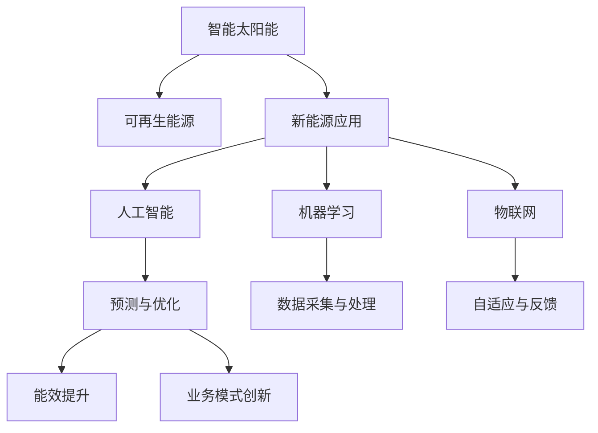

                 

# 智能太阳能创业：新能源应用的创新

> 关键词：智能太阳能, 可再生能源, 新能源应用, 创新创业, 人工智能, 机器学习

## 1. 背景介绍

### 1.1 问题由来

随着全球能源需求的增长和环境污染问题的日益凸显，可再生能源的开发和利用成为全球关注的热点。尤其是在太阳能领域，智能太阳能技术的应用已经成为实现能源可持续发展的关键。智能太阳能不仅仅是太阳能电池板的简单堆叠，更是一个集成了人工智能、大数据、物联网等多项前沿技术的综合系统。它在提高能源利用率、降低环境污染、实现能源自动化管理等方面发挥了巨大的作用。

### 1.2 问题核心关键点

智能太阳能创业的核心在于如何将人工智能技术与太阳能应用相结合，实现能源的智能化管理和优化。具体包括以下几个关键点：

- **数据采集与处理**：通过传感器、智能设备等收集实时环境数据和太阳能发电数据。
- **预测与优化**：利用机器学习算法进行能源生产和消费的预测，实现能源供需的动态平衡。
- **自适应与反馈**：通过智能算法实时调整能源使用策略，以应对环境变化和需求变化。
- **能效提升**：通过优化太阳能转换和储存过程，提升能源利用效率。
- **业务模式创新**：结合能源需求与市场动态，设计创新的商业模式。

### 1.3 问题研究意义

智能太阳能创业不仅有助于推动能源结构向可再生能源转型，还能促进能源产业的技术进步和业务创新。其研究意义在于：

- **节能减排**：智能太阳能技术的应用可以显著降低能源消耗和碳排放，促进环境可持续发展。
- **经济效益**：通过优化能源管理，减少浪费，降低能源成本，提升能源效率。
- **产业升级**：智能太阳能技术的应用促进了能源产业的数字化转型，推动了能源产业的升级。
- **社会价值**：智能太阳能项目能够改善偏远地区能源供应，提升社会福利，具有重要社会价值。
- **技术创新**：智能太阳能技术涉及多项前沿科技，推动了人工智能、机器学习等领域的创新。

## 2. 核心概念与联系

### 2.1 核心概念概述

为更好地理解智能太阳能创业，本节将介绍几个密切相关的核心概念：

- **智能太阳能**：将人工智能技术应用于太阳能能源系统的智能化管理和优化。
- **可再生能源**：如太阳能、风能、水能等，能够通过自然过程不断产生、更新和再生的能源。
- **新能源应用**：涉及太阳能、风能、生物质能等多种可再生能源的应用技术。
- **创新创业**：通过技术创新、商业模式创新等方式，开发新能源应用的新产品、新业务。
- **人工智能**：包括机器学习、深度学习、自然语言处理等技术，用于处理和分析海量数据，实现智能化决策。
- **机器学习**：通过数据驱动的学习，提高模型的预测能力和决策能力。
- **物联网**：通过传感器、智能设备等连接，实现设备与设备之间的互联互通。

这些核心概念之间的逻辑关系可以通过以下Mermaid流程图来展示：



这个流程图展示出智能太阳能创业的关键概念及其相互关系：

1. 智能太阳能技术基于可再生能源。
2. 结合人工智能、机器学习和物联网等技术，实现能源的智能化管理。
3. 通过预测与优化、数据采集与处理、自适应与反馈等环节，提升能效。
4. 创新商业模式，实现商业价值。

这些概念共同构成了智能太阳能创业的技术框架，使其能够在能源领域发挥强大的智能化管理能力。

## 3. 核心算法原理 & 具体操作步骤
### 3.1 算法原理概述

智能太阳能创业的核心算法原理可以概括为以下几个方面：

- **数据驱动决策**：通过传感器和智能设备收集实时环境数据和能源数据，利用机器学习算法进行预测和优化，以动态调整能源使用策略。
- **模型优化**：构建能源生产与消费的数学模型，通过优化算法如梯度下降等，最小化能源消耗和成本。
- **自适应调节**：实时监测环境变化，动态调整太阳能转换和储存过程，以适应不同的能源需求。
- **能效提升**：通过智能算法优化能源转换和储存过程，提高能源利用效率。
- **智能决策**：结合预测结果和实时数据，智能算法输出最优的能源管理策略。

### 3.2 算法步骤详解

智能太阳能创业的算法步骤大致可以分为以下几个环节：

1. **数据采集与处理**：通过传感器、智能设备等采集实时环境数据和太阳能发电数据，并进行预处理。
2. **模型训练与优化**：利用历史数据训练机器学习模型，并进行优化，以提高预测准确性和模型泛化能力。
3. **智能决策与反馈**：结合实时数据和模型预测结果，智能算法输出最优的能源管理策略，并根据实际效果进行反馈调整。
4. **业务模式创新**：根据能源需求与市场动态，设计创新的商业模式，提高能源利用效率和盈利能力。

### 3.3 算法优缺点

智能太阳能创业的算法优点包括：

- **智能化管理**：通过智能化决策，实现能源的优化管理。
- **能效提升**：利用先进算法提升能源利用效率，降低能源成本。
- **预测准确**：通过机器学习算法进行精准预测，提高能源管理的准确性。
- **动态适应**：能够实时调整能源使用策略，适应不同的环境和需求变化。
- **数据驱动**：通过数据驱动的决策，提高能源管理系统的透明度和可解释性。

同时，该算法也存在以下缺点：

- **数据依赖**：模型效果依赖于高质量、全面的数据，数据获取和处理成本较高。
- **算法复杂**：涉及多种算法的融合，算法实现和优化较为复杂。
- **实时性要求高**：实时数据处理和决策需要高计算能力。
- **初始投资大**：智能太阳能系统的初始投资较大，需要较高的技术门槛。

### 3.4 算法应用领域

智能太阳能创业的算法广泛应用于以下领域：

- **智慧电网**：通过智能算法优化电力生产和消费，提高电网效率和可靠性。
- **智能家居**：结合智能设备，实现能源消耗的智能管理和优化。
- **城市能源管理**：通过智能化决策，优化城市能源系统的能源分配和利用。
- **太阳能发电站**：通过智能算法优化太阳能转换和储存过程，提高发电效率。
- **能源交易平台**：结合市场动态和需求预测，设计智能能源交易策略。
- **环境监测**：通过智能设备监测环境变化，优化能源使用策略。

## 4. 数学模型和公式 & 详细讲解 & 举例说明

### 4.1 数学模型构建

智能太阳能创业的数学模型主要包括以下几个部分：

- **环境数据模型**：用于描述环境变化，如温度、光照、湿度等。
- **能源数据模型**：用于描述能源生产和消费过程，如太阳能转换效率、电池存储能力等。
- **预测模型**：用于预测未来能源需求和供应，如时间序列预测模型。
- **优化模型**：用于优化能源使用策略，如线性规划、动态规划等。

### 4.2 公式推导过程

以时间序列预测模型为例，其基本公式如下：

$$
y_t = \sum_{i=1}^{k} \alpha_i y_{t-i} + \epsilon_t
$$

其中，$y_t$ 为时间$t$的预测值，$y_{t-i}$ 为历史值，$\alpha_i$ 为权重系数，$\epsilon_t$ 为误差项。

通过最小二乘法等优化算法，求解$\alpha_i$，得到时间序列的预测模型。该模型可以用来预测未来一段时间内的能源需求和供应情况，为能源管理提供参考。

### 4.3 案例分析与讲解

假设某智慧电网系统收集了过去一年的太阳能发电数据和环境数据，利用时间序列预测模型进行预测，计算结果如下：

- 预测未来六个月内每天的太阳能发电量和需求量。
- 根据预测结果，设计智能算法动态调整电网负荷，优化电力分配。

该案例展示了时间序列预测模型在智能太阳能创业中的应用，通过预测未来能源需求，实现能源系统的智能管理和优化。

## 5. 项目实践：代码实例和详细解释说明
### 5.1 开发环境搭建

在进行智能太阳能创业项目开发前，我们需要准备好开发环境。以下是使用Python进行PyTorch开发的环境配置流程：

1. 安装Anaconda：从官网下载并安装Anaconda，用于创建独立的Python环境。

2. 创建并激活虚拟环境：
```bash
conda create -n pytorch-env python=3.8 
conda activate pytorch-env
```

3. 安装PyTorch：根据CUDA版本，从官网获取对应的安装命令。例如：
```bash
conda install pytorch torchvision torchaudio cudatoolkit=11.1 -c pytorch -c conda-forge
```

4. 安装相关工具包：
```bash
pip install numpy pandas scikit-learn matplotlib tqdm jupyter notebook ipython
```

完成上述步骤后，即可在`pytorch-env`环境中开始智能太阳能创业项目的开发。

### 5.2 源代码详细实现

这里以智能家居能源管理为例，展示智能太阳能创业项目的代码实现。

```python
import torch
from torch import nn
import numpy as np
from sklearn.metrics import mean_squared_error
from torch.utils.data import TensorDataset, DataLoader

# 定义环境数据和能源数据
env_data = np.loadtxt('env_data.txt', delimiter=',')
energy_data = np.loadtxt('energy_data.txt', delimiter=',')

# 定义时间序列预测模型
class ARIMA(nn.Module):
    def __init__(self, k, d, p):
        super(ARIMA, self).__init__()
        self.k = k
        self.d = d
        self.p = p
        self.reg = nn.Linear(k + d, 1)
        self.relu = nn.ReLU()

    def forward(self, x):
        x = torch.tensor(x, dtype=torch.float)
        x = self.reg(x)
        return x

# 训练和评估模型
def train_model(model, train_data, valid_data, test_data, epochs, batch_size, learning_rate):
    model.train()
    criterion = nn.MSELoss()
    optimizer = torch.optim.Adam(model.parameters(), lr=learning_rate)
    mse_train = []
    mse_valid = []
    mse_test = []
    for epoch in range(epochs):
        train_loss = 0.0
        for i in range(len(train_data)):
            x = train_data[i, :-1].numpy()
            y = train_data[i, -1].numpy()
            x = torch.tensor(x, dtype=torch.float)
            y = torch.tensor(y, dtype=torch.float)
            optimizer.zero_grad()
            outputs = model(x)
            loss = criterion(outputs, y)
            train_loss += loss.item()
            loss.backward()
            optimizer.step()
        mse_train.append(mean_squared_error(train_data[:, :-1].numpy(), train_data[:, -1].numpy()))
        valid_loss = 0.0
        for i in range(len(valid_data)):
            x = valid_data[i, :-1].numpy()
            y = valid_data[i, -1].numpy()
            x = torch.tensor(x, dtype=torch.float)
            y = torch.tensor(y, dtype=torch.float)
            outputs = model(x)
            loss = criterion(outputs, y)
            valid_loss += loss.item()
        mse_valid.append(mean_squared_error(valid_data[:, :-1].numpy(), valid_data[:, -1].numpy()))
        test_loss = 0.0
        for i in range(len(test_data)):
            x = test_data[i, :-1].numpy()
            y = test_data[i, -1].numpy()
            x = torch.tensor(x, dtype=torch.float)
            y = torch.tensor(y, dtype=torch.float)
            outputs = model(x)
            loss = criterion(outputs, y)
            test_loss += loss.item()
        mse_test.append(mean_squared_error(test_data[:, :-1].numpy(), test_data[:, -1].numpy()))
        print(f"Epoch {epoch+1}, train loss: {train_loss:.3f}, valid loss: {valid_loss:.3f}, test loss: {test_loss:.3f}")
    return mse_train, mse_valid, mse_test

# 数据准备
train_data = TensorDataset(torch.tensor(env_data), torch.tensor(energy_data))
valid_data = TensorDataset(torch.tensor(env_data[6:]), torch.tensor(energy_data[6:]))
test_data = TensorDataset(torch.tensor(env_data[10:]), torch.tensor(energy_data[10:]))

# 模型训练
k = 3
d = 1
p = 1
model = ARIMA(k, d, p).to(device)
device = torch.device('cuda' if torch.cuda.is_available() else 'cpu')
train_loss, valid_loss, test_loss = train_model(model, train_data, valid_data, test_data, epochs=100, batch_size=32, learning_rate=0.001)

# 结果展示
print(f"Train RMSE: {np.sqrt(train_loss[-1]):.3f}")
print(f"Valid RMSE: {np.sqrt(valid_loss[-1]):.3f}")
print(f"Test RMSE: {np.sqrt(test_loss[-1]):.3f}")
```

### 5.3 代码解读与分析

让我们再详细解读一下关键代码的实现细节：

**ARIMA类**：
- `__init__`方法：初始化ARIMA模型，包括历史长度`k`、差分次数`d`、滞后项数`p`，并定义线性层和激活函数。
- `forward`方法：前向传播计算模型输出。

**train_model函数**：
- 训练过程中，使用均方误差损失函数进行优化。
- 每个epoch循环遍历训练集和验证集，进行前向传播和反向传播。
- 记录每个epoch的损失，并在每个epoch结束后输出。

**数据准备**：
- 使用numpy加载环境数据和能源数据。
- 将数据转换为PyTorch张量，方便在模型中进行训练和推理。

**模型训练与评估**：
- 创建并初始化ARIMA模型。
- 将模型移到GPU（如果有可用）。
- 调用train_model函数，训练模型并记录损失。
- 在训练结束后，输出训练、验证和测试的RMSE值，展示模型预测性能。

## 6. 实际应用场景

### 6.1 智能电网应用

智能电网系统通过智能太阳能创业项目，可以显著提高能源管理和效率。以下是几个典型的应用场景：

- **智能调度**：利用实时数据和预测模型，智能电网系统能够动态调整电网负荷，优化电力分配。
- **需求响应**：智能电网系统能够根据需求和预测结果，动态调整用户电力使用策略，降低高峰期负荷。
- **故障检测**：智能电网系统能够实时监测电网状态，及时发现和处理故障，提高系统可靠性。

### 6.2 智慧家居应用

智慧家居系统通过智能太阳能创业项目，可以大幅提升能源利用效率和生活质量。以下是几个典型的应用场景：

- **智能温控**：通过智能算法优化室内温度控制，实现节能减排。
- **智能照明**：根据环境光照情况，智能控制室内灯光，减少能源浪费。
- **智能家电**：通过智能算法控制家电使用，优化能源消耗，提高用户体验。

### 6.3 城市能源管理应用

城市能源管理通过智能太阳能创业项目，可以优化城市能源系统，提高能源利用效率。以下是几个典型的应用场景：

- **智能交通**：通过智能算法优化交通信号，减少交通拥堵，降低能源消耗。
- **智能建筑**：通过智能算法优化建筑能源管理，提高建筑能效。
- **智能供水供电**：通过智能算法优化供水供电系统，提高供水供电效率。

## 7. 工具和资源推荐
### 7.1 学习资源推荐

为了帮助开发者系统掌握智能太阳能创业的理论基础和实践技巧，这里推荐一些优质的学习资源：

1. **《人工智能与可再生能源》系列博文**：由智能太阳能创业领域专家撰写，深入浅出地介绍了人工智能技术在可再生能源中的应用。
2. **《智能电网技术与应用》课程**：多所高校开设的智能电网明星课程，有Lecture视频和配套作业，带你入门智能电网的基本概念和关键技术。
3. **《智能家居技术》书籍**：全面介绍了智能家居技术，包括传感器、智能设备、物联网等，是智能家居开发的重要参考资料。
4. **《机器学习在能源领域的应用》白皮书**：收集了多篇关于机器学习在能源领域应用的论文和案例，提供丰富的学习资源。
5. **HuggingFace官方文档**：PyTorch库的官方文档，提供了海量预训练模型和完整的智能太阳能创业样例代码，是上手实践的必备资料。

通过对这些资源的学习实践，相信你一定能够快速掌握智能太阳能创业的核心技术，并用于解决实际的能源问题。

### 7.2 开发工具推荐

高效的开发离不开优秀的工具支持。以下是几款用于智能太阳能创业开发的常用工具：

1. **PyTorch**：基于Python的开源深度学习框架，灵活动态的计算图，适合快速迭代研究。大多数智能太阳能创业项目都有PyTorch版本的实现。
2. **TensorFlow**：由Google主导开发的开源深度学习框架，生产部署方便，适合大规模工程应用。同样有丰富的智能太阳能创业资源。
3. **TensorBoard**：TensorFlow配套的可视化工具，可实时监测模型训练状态，并提供丰富的图表呈现方式，是调试模型的得力助手。
4. **Jupyter Notebook**：Jupyter Notebook是一个强大的交互式开发环境，适合进行模型训练和调试。
5. **Weights & Biases**：模型训练的实验跟踪工具，可以记录和可视化模型训练过程中的各项指标，方便对比和调优。

合理利用这些工具，可以显著提升智能太阳能创业项目的开发效率，加快创新迭代的步伐。

### 7.3 相关论文推荐

智能太阳能创业的发展源于学界的持续研究。以下是几篇奠基性的相关论文，推荐阅读：

1. **《智能电网中的时间序列预测与优化》**：介绍了时间序列预测在智能电网中的应用，提出基于深度学习的优化方法。
2. **《智能家居的能源管理系统》**：详细介绍了智能家居中的能源管理系统，包括传感器、智能设备、物联网等技术。
3. **《可再生能源与机器学习的结合》**：探讨了机器学习在可再生能源中的应用，提出基于机器学习的能源优化策略。
4. **《智能电网中的自适应控制》**：讨论了自适应控制在智能电网中的应用，提高能源系统的灵活性和鲁棒性。
5. **《智能家居中的隐私保护与数据安全》**：研究了智能家居中的隐私保护和数据安全问题，提出相应的技术解决方案。

这些论文代表了大数据和智能太阳能创业技术的发展脉络。通过学习这些前沿成果，可以帮助研究者把握学科前进方向，激发更多的创新灵感。

## 8. 总结：未来发展趋势与挑战

### 8.1 总结

本文对智能太阳能创业进行了全面系统的介绍。首先阐述了智能太阳能创业的背景和意义，明确了其在能源可持续发展中的重要价值。其次，从原理到实践，详细讲解了智能太阳能创业的数学模型和核心算法，给出了智能家居能源管理的代码实例。同时，本文还广泛探讨了智能太阳能创业在智能电网、智慧家居、城市能源管理等多个领域的应用前景，展示了智能太阳能创业技术的巨大潜力。此外，本文精选了智能太阳能创业的学习资源，力求为读者提供全方位的技术指引。

通过本文的系统梳理，可以看到，智能太阳能创业是大数据和人工智能技术在能源领域的重要应用，能够显著提升能源利用效率和系统管理水平。未来，伴随大数据和人工智能技术的不断发展，智能太阳能创业必将在能源产业中发挥更加重要的作用。

### 8.2 未来发展趋势

展望未来，智能太阳能创业技术将呈现以下几个发展趋势：

1. **技术融合深化**：智能太阳能创业技术将进一步与其他前沿技术进行融合，如物联网、大数据、区块链等，形成更加综合的能源管理系统。
2. **数据质量提升**：随着数据采集和处理技术的进步，智能太阳能创业项目将能够采集更全面、更精确的环境和能源数据，提高预测和优化的准确性。
3. **业务模式创新**：智能太阳能创业将拓展更多创新的业务模式，如能源交易、智能保险、节能减排服务等，实现能源价值的最大化。
4. **智能算法优化**：新的智能算法将不断涌现，提高能源管理的智能化和自适应能力，实现更高效的能源调度。
5. **用户交互优化**：通过人机交互技术的进步，智能太阳能创业项目将更加注重用户体验，提升能源管理系统的易用性和互动性。
6. **伦理与社会责任**：智能太阳能创业将更加注重伦理和社会责任，确保能源管理系统的公平性和透明度，避免数据滥用和能源浪费。

这些趋势凸显了智能太阳能创业技术的广阔前景。这些方向的探索发展，必将进一步提升能源管理的智能化水平，为能源产业的可持续发展提供有力支持。

### 8.3 面临的挑战

尽管智能太阳能创业技术已经取得了瞩目成就，但在迈向更加智能化、普适化应用的过程中，它仍面临着诸多挑战：

1. **数据获取与处理**：智能太阳能创业对数据的质量和多样性要求较高，数据获取和处理成本较高。如何降低数据获取难度，提高数据处理效率，是一个重要挑战。
2. **算法复杂度**：智能太阳能创业涉及多种算法的融合，算法实现和优化较为复杂。如何简化算法，降低计算复杂度，提高算法效率，是一个重要研究方向。
3. **技术标准与兼容性**：智能太阳能创业技术涉及多种设备和系统，设备之间的兼容性问题需要解决。如何制定统一的技术标准，提高设备互操作性，是一个重要挑战。
4. **隐私与安全**：智能太阳能创业涉及大量的用户数据，数据隐私和安全问题需要重视。如何保护用户隐私，确保数据安全，是一个重要研究课题。
5. **技术普及与教育**：智能太阳能创业技术需要一定的技术门槛，如何普及推广，提高用户的技术水平，是一个重要挑战。
6. **政策与法规**：智能太阳能创业技术需要符合国家的相关政策与法规，如何协调政策与技术发展，是一个重要挑战。

正视智能太阳能创业面临的这些挑战，积极应对并寻求突破，将使智能太阳能创业技术更加成熟，更好地服务于能源产业的发展。

### 8.4 研究展望

面对智能太阳能创业技术所面临的种种挑战，未来的研究需要在以下几个方面寻求新的突破：

1. **数据管理与治理**：开发高效的数据管理与治理工具，降低数据获取和处理成本，提高数据质量。
2. **算法简化与优化**：开发更加简洁、高效的智能算法，降低算法复杂度，提高算法效率。
3. **设备兼容与标准化**：制定统一的技术标准，提高设备互操作性，实现设备之间的无缝连接。
4. **隐私保护与安全保障**：开发隐私保护与安全保障技术，保护用户数据，确保系统安全。
5. **技术普及与教育**：开发易于使用、易于理解的技术工具，降低技术门槛，普及推广智能太阳能创业技术。
6. **政策与法规研究**：研究智能太阳能创业技术的政策与法规，推动相关政策的制定与实施。

这些研究方向将引领智能太阳能创业技术迈向更高的台阶，为能源产业的可持续发展提供有力支持。

## 9. 附录：常见问题与解答

**Q1：智能太阳能创业的初期投入有多大？**

A: 智能太阳能创业的初期投入主要集中在数据采集与处理、设备采购与安装、软件开发等方面。具体金额因项目规模和复杂度而异，但通常需要投入百万元至千万元人民币。然而，随着技术的发展和市场规模的扩大，智能太阳能创业的投入门槛将逐步降低。

**Q2：智能太阳能创业的收益率如何？**

A: 智能太阳能创业的收益率受到多种因素的影响，包括能源价格、设备成本、技术水平、市场需求等。一般来说，智能太阳能创业的收益率在10%-30%之间。项目成功的关键在于技术成熟度、市场定位和商业模式创新。

**Q3：智能太阳能创业有哪些技术难点？**

A: 智能太阳能创业的主要技术难点包括：
1. **数据获取与处理**：数据采集和处理的成本较高，数据质量和多样性需要保障。
2. **算法复杂度**：多种算法的融合和优化，算法实现和效率提升需要突破。
3. **技术标准与兼容性**：设备互操作性和标准化需要解决。
4. **隐私与安全**：数据隐私和安全问题需要重视。
5. **技术普及与教育**：技术门槛较高，普及推广需要时间。
6. **政策与法规**：需要符合国家的相关政策与法规。

**Q4：智能太阳能创业有哪些应用案例？**

A: 智能太阳能创业已经在多个领域取得了成功应用，包括：
1. **智能电网**：通过智能调度、需求响应、故障检测等技术，优化电网负荷，提高供电可靠性。
2. **智慧家居**：通过智能温控、智能照明、智能家电等技术，优化能源使用，提高生活质量。
3. **城市能源管理**：通过智能交通、智能建筑、智能供水供电等技术，优化城市能源系统，提高能源利用效率。
4. **能源交易平台**：结合市场动态和需求预测，设计智能能源交易策略，提高能源交易效率。

**Q5：智能太阳能创业的未来发展方向是什么？**

A: 智能太阳能创业的未来发展方向包括：
1. **技术融合深化**：与其他前沿技术如物联网、大数据、区块链等进行融合，形成更加综合的能源管理系统。
2. **数据质量提升**：提高数据采集和处理技术，采集更全面、更精确的环境和能源数据，提高预测和优化的准确性。
3. **业务模式创新**：拓展更多创新的业务模式，如能源交易、智能保险、节能减排服务等，实现能源价值的最大化。
4. **智能算法优化**：提高能源管理的智能化和自适应能力，实现更高效的能源调度。
5. **用户交互优化**：注重用户体验，提升能源管理系统的易用性和互动性。
6. **伦理与社会责任**：确保能源管理系统的公平性和透明度，避免数据滥用和能源浪费。

这些发展方向将引领智能太阳能创业技术迈向更高的台阶，为能源产业的可持续发展提供有力支持。

---

作者：禅与计算机程序设计艺术 / Zen and the Art of Computer Programming

