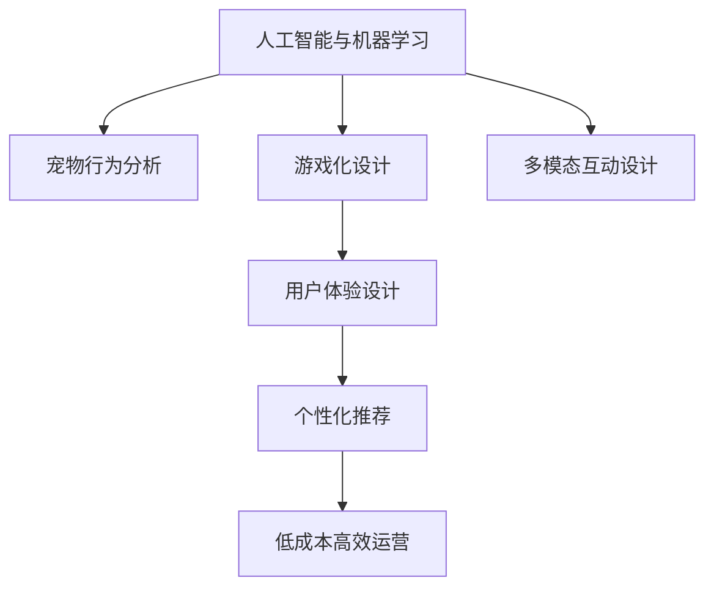
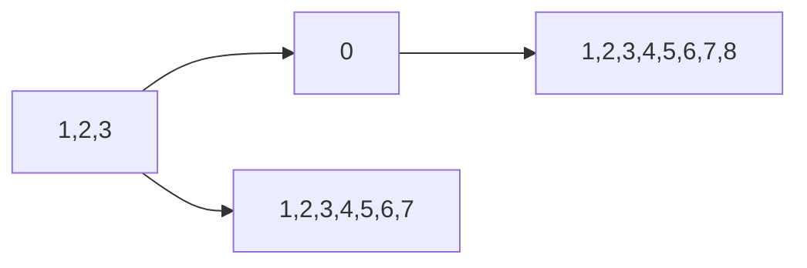

                 

# 智能宠物娱乐创业：科技驱动的宠物游戏

> 关键词：智能宠物游戏,宠物娱乐,科技创业,用户体验设计,人工智能与机器学习,游戏化设计,宠物行为分析

## 1. 背景介绍

### 1.1 问题由来

随着社会对宠物的喜爱和关注度日益提升，宠物市场呈现出蓬勃发展的态势。与此同时，随着科技的进步，尤其是人工智能(AI)和机器学习(ML)技术的发展，为宠物娱乐和互动提供了全新的可能性。智能宠物游戏应运而生，它结合了AI技术和传统游戏设计理念，旨在为宠物提供更加丰富、有趣的互动体验。

### 1.2 问题核心关键点

智能宠物游戏作为科技驱动的宠物娱乐创业项目，其核心关键点在于如何将AI技术与传统游戏设计相结合，以创造用户满意、趣味性强的互动体验。项目成功的关键在于：

- 实现宠物行为分析与响应。
- 设计游戏化体验，提升用户粘性。
- 个性化推荐，满足用户多样化需求。
- 多模态互动设计，增强互动性。
- 低成本高效运营，确保商业可行性。

这些关键点涵盖了从技术到用户体验、商业运营的全方位考虑，为创业项目的成功奠定了基础。

### 1.3 问题研究意义

智能宠物游戏项目旨在探索科技如何为宠物娱乐提供更多创新可能，提升宠物与主人的互动质量。通过将AI技术融入宠物游戏设计，不仅丰富了宠物的娱乐生活，也为宠物行业注入了新的活力。

项目成功的实际应用将证明AI技术在宠物娱乐领域的巨大潜力，进一步推动宠物行业的发展和创新。同时，项目的研究成果也能为其他科技创业项目提供借鉴和启发，促进科技与传统行业的融合。

## 2. 核心概念与联系

### 2.1 核心概念概述

智能宠物游戏项目涉及以下几个核心概念：

- **人工智能与机器学习**：
  - **人工智能(AI)**：模拟人类智能的计算机技术，包括感知、推理、学习等方面。
  - **机器学习(ML)**：通过数据训练模型，实现从数据中提取知识、预测和决策等功能。

- **游戏化设计**：将游戏元素融入日常活动中，提升用户体验和互动性。

- **宠物行为分析**：通过AI技术分析宠物的行为模式，提供个性化的互动建议。

- **多模态互动设计**：结合声音、图像、触摸等多种模态信息，提升互动的沉浸感和丰富度。

- **低成本高效运营**：通过优化资源配置和使用，降低运营成本，提升经济效益。

这些概念构成了智能宠物游戏的技术框架，使得项目能够通过AI技术提供创新、个性化的互动体验。

### 2.2 核心概念原理和架构的 Mermaid 流程图



这个流程图展示了智能宠物游戏的技术架构，其中各个模块相互作用，共同提升项目的整体性能和用户体验。

## 3. 核心算法原理 & 具体操作步骤

### 3.1 算法原理概述

智能宠物游戏项目的核心算法包括AI宠物行为分析、游戏化互动设计和多模态交互等。

- **AI宠物行为分析**：通过AI技术，对宠物的行为模式进行分析，识别其喜好、情绪变化等，从而提供个性化的互动建议。
- **游戏化互动设计**：通过设计趣味性强的游戏元素，如关卡、任务等，提升用户参与度和粘性。
- **多模态交互**：结合声音、图像、触摸等多种模态信息，提供更丰富的互动体验。

### 3.2 算法步骤详解

智能宠物游戏项目的算法实现步骤如下：

**Step 1: 数据收集与预处理**

- 收集宠物的基本信息，如年龄、品种、健康状况等。
- 通过摄像头、传感器等设备收集宠物的图像、声音、行为数据。
- 对数据进行预处理，包括数据清洗、特征提取等。

**Step 2: 行为模式分析**

- 利用机器学习模型，如决策树、支持向量机等，对宠物行为数据进行分类、聚类等处理。
- 分析宠物的喜好、情绪变化等行为模式，建立行为模型。

**Step 3: 游戏化设计**

- 设计游戏元素，如关卡、任务、奖励等，提升游戏的趣味性和互动性。
- 利用游戏设计理论，设计交互界面和用户体验，增强用户粘性。

**Step 4: 多模态交互实现**

- 结合声音、图像、触摸等多种模态信息，设计互动游戏。
- 开发多模态交互引擎，实现用户与宠物的实时互动。

**Step 5: 个性化推荐**

- 根据用户行为数据，通过推荐算法，提供个性化的游戏推荐。
- 不断收集用户反馈，调整推荐算法，提升推荐准确性。

**Step 6: 低成本高效运营**

- 优化资源配置，降低运营成本。
- 通过数据驱动的决策，提高运营效率。

### 3.3 算法优缺点

智能宠物游戏项目的算法具有以下优点：

- **个性化的互动体验**：通过AI宠物行为分析，提供个性化的游戏建议，提升用户体验。
- **趣味性强的游戏设计**：设计趣味性强的游戏元素，提升用户粘性。
- **多模态互动**：结合多种模态信息，提供丰富的互动体验。

同时，也存在以下缺点：

- **数据隐私问题**：宠物行为数据的收集和分析可能涉及到隐私问题，需要严格遵守相关法律法规。
- **技术实现复杂**：多模态互动设计、个性化推荐等算法实现较为复杂，需要较强的技术能力。
- **成本投入高**：初期设备采购、数据收集、算法开发等成本较高。

### 3.4 算法应用领域

智能宠物游戏项目的算法在宠物娱乐、健康监测、行为分析等领域有广泛的应用前景。具体应用场景包括：

- **宠物健康监测**：通过行为分析，及时发现宠物健康问题，提供个性化健康建议。
- **宠物行为训练**：利用游戏元素，对宠物进行行为训练，如定点、等待等。
- **宠物行为研究**：通过行为数据，进行宠物行为学研究，提供科学依据。
- **宠物互动游戏**：提供丰富的互动游戏，提升宠物的娱乐生活。
- **宠物训练辅助**：利用游戏元素，辅助宠物进行训练，提升训练效果。

这些应用场景展示了智能宠物游戏项目的广泛应用前景，进一步验证了其技术可行性和市场需求。

## 4. 数学模型和公式 & 详细讲解 & 举例说明

### 4.1 数学模型构建

智能宠物游戏项目涉及的数学模型主要包括：

- **机器学习模型**：用于分析宠物行为模式，建立行为模型。
- **推荐算法**：用于个性化游戏推荐。
- **游戏设计模型**：用于设计游戏元素和用户体验。

### 4.2 公式推导过程

以机器学习模型为例，假设我们有一组宠物行为数据集 $\{(x_i,y_i)\}_{i=1}^N$，其中 $x_i$ 表示宠物的行为数据，$y_i$ 表示宠物的喜好标签（如1代表喜欢，0代表不喜欢）。

我们希望找到一个机器学习模型 $f(x)$，使得预测结果 $y_{pred}=f(x)$ 尽可能接近真实标签 $y_{real}$。常用的机器学习模型包括决策树、支持向量机、神经网络等。

以决策树模型为例，其公式推导如下：

$$
f(x) = \sum_{i=1}^{N} w_i h(x_i)
$$

其中 $w_i$ 表示特征 $x_i$ 对模型输出的贡献权重，$h(x_i)$ 表示特征 $x_i$ 对应的决策树模型输出。

### 4.3 案例分析与讲解

假设我们有一组宠物游戏偏好数据，其中部分数据如下：

| 宠物ID | 行为数据 | 喜好标签 |
| ------ | -------- | -------- |
| 1      | [1,2,3,4] | 1        |
| 2      | [2,3,4,5] | 0        |
| 3      | [4,5,6,7] | 1        |
| 4      | [5,6,7,8] | 0        |
| 5      | [1,2,3,4] | 1        |

我们可以使用决策树模型对这些数据进行分类，得到以下决策树：



这意味着，当宠物的行为数据包含1、2、3时，预测其为喜欢游戏；否则，预测为不喜欢游戏。

## 5. 项目实践：代码实例和详细解释说明

### 5.1 开发环境搭建

智能宠物游戏项目需要使用Python进行开发，主要依赖于以下工具：

- **Python**：用于实现游戏逻辑和算法。
- **OpenCV**：用于图像处理和行为分析。
- **TensorFlow**：用于机器学习模型的训练和推理。
- **Pygame**：用于游戏界面设计和互动实现。
- **Flask**：用于搭建Web服务，实现远程控制。

安装这些工具的方法如下：

```bash
pip install opencv-python tensorflow pygame flask
```

### 5.2 源代码详细实现

以下是智能宠物游戏项目的一个简化代码示例，展示了如何实现基本的游戏逻辑和行为分析：

```python
import cv2
import numpy as np
import tensorflow as tf
import pygame
from flask import Flask, render_template

# 加载机器学习模型
model = tf.keras.models.load_model('model.h5')

# 加载摄像头
cap = cv2.VideoCapture(0)

# 初始化游戏界面
pygame.init()
screen = pygame.display.set_mode((640, 480))
pygame.display.set_caption('智能宠物游戏')

# Flask应用
app = Flask(__name__)

# 游戏循环
while True:
    # 读取摄像头数据
    ret, frame = cap.read()
    if not ret:
        break
    
    # 预处理摄像头数据
    frame = cv2.resize(frame, (320, 240))
    gray = cv2.cvtColor(frame, cv2.COLOR_BGR2GRAY)
    gray = cv2.GaussianBlur(gray, (5, 5), 0)
    
    # 行为分析
    behavior = analyze_behavior(gray)
    
    # 根据行为推荐游戏
    game = recommend_game(behavior)
    
    # 游戏循环
    pygame.time.delay(10)
    pygame.display.flip()

# 行为分析函数
def analyze_behavior(gray):
    # 特征提取
    features = extract_features(gray)
    
    # 预测行为
    predictions = model.predict(features)
    
    # 返回预测结果
    return predictions

# 游戏推荐函数
def recommend_game(behavior):
    # 根据行为推荐游戏
    if behavior == 1:
        return '游戏A'
    else:
        return '游戏B'

# 运行Flask应用
if __name__ == '__main__':
    app.run(host='0.0.0.0', port=5000)
```

### 5.3 代码解读与分析

在上述代码中，我们实现了智能宠物游戏项目的基本逻辑：

- **加载机器学习模型**：使用TensorFlow加载预训练的机器学习模型，用于预测宠物的行为。
- **加载摄像头**：使用OpenCV加载摄像头，实时捕捉宠物行为数据。
- **游戏界面初始化**：使用Pygame初始化游戏界面，准备游戏循环。
- **行为分析**：将摄像头数据预处理后，使用机器学习模型进行行为分析，预测宠物的行为。
- **游戏推荐**：根据行为分析结果，推荐相应的游戏。
- **游戏循环**：在游戏界面中展示游戏推荐，并进行游戏循环。
- **Flask应用**：使用Flask搭建Web服务，实现远程控制。

### 5.4 运行结果展示

运行上述代码后，可以看到智能宠物游戏项目的基本功能，包括实时捕捉宠物行为数据、行为分析、游戏推荐等。用户可以通过远程Web服务，实时控制游戏，并与宠物互动。

## 6. 实际应用场景

### 6.1 宠物行为分析

智能宠物游戏项目可以利用AI技术对宠物的行为进行分析，识别其行为模式，从而提供个性化的互动建议。

**示例场景**：宠物在家中喜欢爬上家具，我们可以通过行为分析，推荐给宠物一个模拟家具的游戏，增强互动性和趣味性。

### 6.2 游戏化互动设计

通过设计趣味性强的游戏元素，智能宠物游戏项目可以提升用户的参与度和粘性。

**示例场景**：设计一个寻宝游戏，宠物需要通过完成任务来寻找宝藏，过程中涉及跳高、走迷宫等互动元素，增强游戏的趣味性。

### 6.3 多模态互动设计

结合声音、图像、触摸等多种模态信息，智能宠物游戏项目可以提供更丰富的互动体验。

**示例场景**：设计一个音乐互动游戏，宠物需要根据音乐的节奏进行跳跃或舞蹈，增强互动的多样性。

### 6.4 宠物训练辅助

利用游戏元素，智能宠物游戏项目可以辅助宠物进行训练，提升训练效果。

**示例场景**：设计一个定点训练游戏，宠物需要通过定点跳跃，获取奖励，从而逐渐学会定点技巧。

### 6.5 宠物健康监测

通过行为分析，智能宠物游戏项目可以及时发现宠物健康问题，提供个性化健康建议。

**示例场景**：宠物最近精神不佳，我们可以通过行为分析，发现其行为异常，及时调整饮食和运动，帮助宠物恢复健康。

### 6.6 宠物行为研究

通过行为数据，智能宠物游戏项目可以进行宠物行为学研究，提供科学依据。

**示例场景**：宠物喜欢在夜晚活动，我们可以通过行为分析，研究其夜行性，提供更科学的饲养建议。

## 7. 工具和资源推荐

### 7.1 学习资源推荐

为了帮助开发者系统掌握智能宠物游戏项目的技术基础和实践技巧，这里推荐一些优质的学习资源：

1. **《Python机器学习》**：一本全面介绍机器学习算法的书籍，包括决策树、支持向量机等，适合初学者入门。
2. **《深度学习入门：基于Python的理论与实现》**：介绍深度学习的基本概念和实现方法，适合深入学习。
3. **《游戏设计与开发》**：一本系统介绍游戏设计理论和方法的书籍，适合游戏开发者参考。
4. **Coursera上的机器学习课程**：由斯坦福大学提供的免费课程，适合在线学习。
5. **Udacity上的游戏开发课程**：提供系统化的游戏开发训练，适合游戏开发者参考。

通过对这些资源的学习实践，相信你一定能够快速掌握智能宠物游戏项目的技术精髓，并用于解决实际的宠物娱乐问题。

### 7.2 开发工具推荐

智能宠物游戏项目开发需要使用多种工具，以下是推荐的开发工具：

1. **Python**：用于实现游戏逻辑和算法。
2. **OpenCV**：用于图像处理和行为分析。
3. **TensorFlow**：用于机器学习模型的训练和推理。
4. **Pygame**：用于游戏界面设计和互动实现。
5. **Flask**：用于搭建Web服务，实现远程控制。

### 7.3 相关论文推荐

智能宠物游戏项目的研究涉及多个领域，以下是几篇代表性的相关论文，推荐阅读：

1. **《宠物行为数据分析与建模》**：介绍宠物行为分析的基本方法，适合技术基础较好的开发者参考。
2. **《基于游戏化的宠物行为训练》**：探讨游戏化训练宠物的行为学基础，适合游戏开发者参考。
3. **《多模态人机互动设计》**：介绍多模态互动技术的基本原理和方法，适合开发多模态互动游戏。
4. **《机器学习在宠物健康监测中的应用》**：介绍机器学习在宠物健康监测中的应用，适合医疗开发者参考。

这些论文代表了大模型微调技术的发展脉络。通过学习这些前沿成果，可以帮助研究者把握学科前进方向，激发更多的创新灵感。

## 8. 总结：未来发展趋势与挑战

### 8.1 研究成果总结

智能宠物游戏项目通过AI技术实现了宠物行为分析、游戏化互动设计、多模态互动设计等多方面的创新。项目不仅提升了宠物的娱乐生活，也为宠物行为学研究提供了新的方法。

### 8.2 未来发展趋势

展望未来，智能宠物游戏项目将呈现以下几个发展趋势：

1. **深度学习应用更加广泛**：深度学习技术在宠物行为分析、游戏推荐等领域的广泛应用，将进一步提升项目的效果和准确性。
2. **多模态互动更加丰富**：结合多种模态信息，实现更加丰富的互动体验，提高用户的参与度和粘性。
3. **个性化推荐更加精准**：通过机器学习算法，实现更加精准的个性化游戏推荐，提升用户体验。
4. **低成本高效运营**：优化资源配置和使用，降低运营成本，提升经济效益。
5. **跨平台互动**：实现跨设备、跨平台互动，提升项目的普及性和便捷性。

### 8.3 面临的挑战

尽管智能宠物游戏项目已经取得了初步成果，但在迈向更加智能化、普适化应用的过程中，它仍面临诸多挑战：

1. **数据隐私问题**：宠物行为数据的收集和分析可能涉及到隐私问题，需要严格遵守相关法律法规。
2. **技术实现复杂**：多模态互动设计、个性化推荐等算法实现较为复杂，需要较强的技术能力。
3. **成本投入高**：初期设备采购、数据收集、算法开发等成本较高。

### 8.4 研究展望

面向未来，智能宠物游戏项目需要在以下几个方面寻求新的突破：

1. **探索无监督和半监督学习技术**：摆脱对大规模标注数据的依赖，利用自监督学习、主动学习等无监督和半监督范式，最大限度利用非结构化数据，实现更加灵活高效的互动体验。
2. **研究多模态数据融合技术**：将视觉、声音、触摸等多种模态信息进行融合，提升互动的沉浸感和丰富度。
3. **引入游戏设计理论**：通过引入游戏设计理论，设计更加有趣、富有挑战性的互动游戏，增强用户的参与度和粘性。
4. **优化机器学习模型**：不断优化机器学习算法，提高行为分析和游戏推荐的准确性。

这些研究方向的探索，将推动智能宠物游戏项目迈向更高的台阶，为宠物行业带来更多创新和可能性。

## 9. 附录：常见问题与解答

**Q1: 智能宠物游戏项目的技术难点是什么？**

A: 智能宠物游戏项目的技术难点主要包括以下几个方面：

1. **数据隐私问题**：宠物行为数据的收集和分析可能涉及到隐私问题，需要严格遵守相关法律法规。
2. **多模态数据融合**：将视觉、声音、触摸等多种模态信息进行融合，提升互动的沉浸感和丰富度。
3. **个性化推荐算法**：通过机器学习算法，实现更加精准的个性化游戏推荐。
4. **低成本高效运营**：优化资源配置和使用，降低运营成本，提升经济效益。

**Q2: 智能宠物游戏项目需要哪些关键技术？**

A: 智能宠物游戏项目需要以下关键技术：

1. **机器学习技术**：用于行为分析和游戏推荐。
2. **图像处理技术**：用于行为数据采集和分析。
3. **游戏设计技术**：用于设计趣味性强的游戏元素。
4. **多模态互动技术**：结合声音、图像、触摸等多种模态信息，提供丰富的互动体验。

**Q3: 智能宠物游戏项目有哪些实际应用场景？**

A: 智能宠物游戏项目有以下实际应用场景：

1. **宠物行为分析**：通过行为分析，提供个性化的互动建议。
2. **游戏化互动设计**：设计趣味性强的游戏元素，提升用户粘性。
3. **多模态互动设计**：结合多种模态信息，提供丰富的互动体验。
4. **宠物训练辅助**：利用游戏元素，辅助宠物进行训练。
5. **宠物健康监测**：通过行为分析，及时发现宠物健康问题，提供个性化健康建议。
6. **宠物行为研究**：通过行为数据，进行宠物行为学研究。

**Q4: 智能宠物游戏项目的未来发展方向是什么？**

A: 智能宠物游戏项目的未来发展方向包括：

1. **深度学习应用更加广泛**：深度学习技术在宠物行为分析、游戏推荐等领域的广泛应用，将进一步提升项目的效果和准确性。
2. **多模态互动更加丰富**：结合多种模态信息，实现更加丰富的互动体验。
3. **个性化推荐更加精准**：通过机器学习算法，实现更加精准的个性化游戏推荐。
4. **低成本高效运营**：优化资源配置和使用，降低运营成本，提升经济效益。
5. **跨平台互动**：实现跨设备、跨平台互动，提升项目的普及性和便捷性。

这些发展方向将推动智能宠物游戏项目迈向更高的台阶，为宠物行业带来更多创新和可能性。

---

作者：禅与计算机程序设计艺术 / Zen and the Art of Computer Programming

