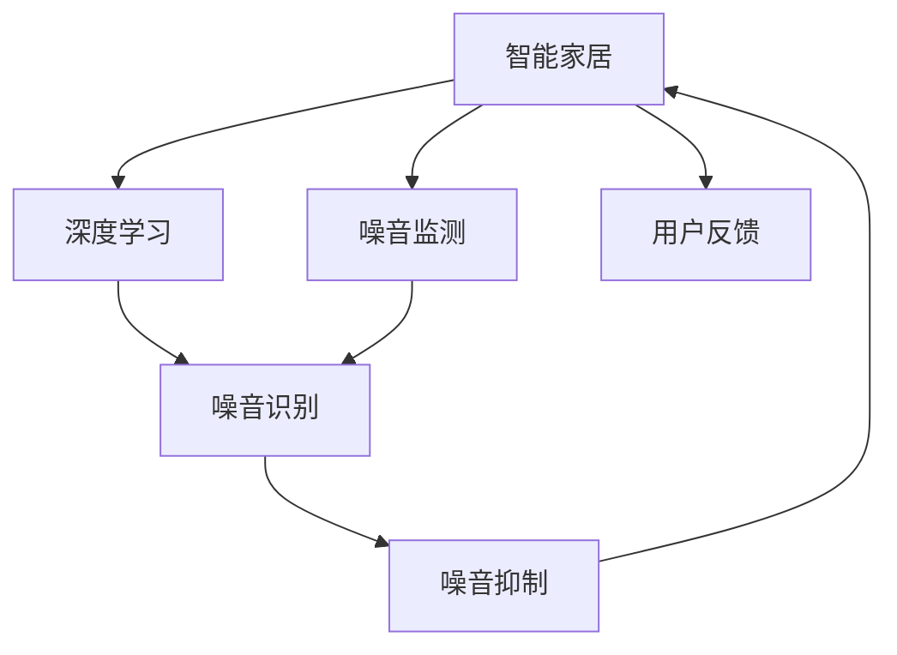
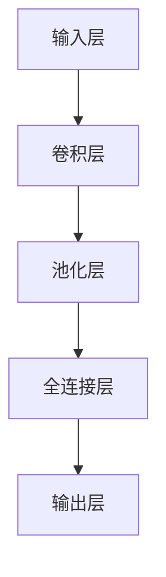
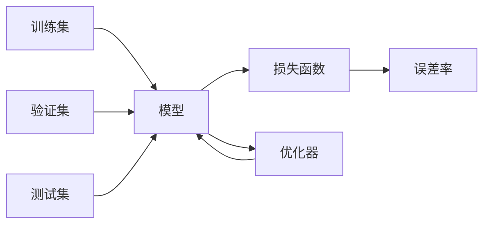

                 

# 智能家居噪音控制创业：声学优化的生活空间

## 1. 背景介绍

### 1.1 问题由来

随着智能家居技术的不断发展和普及，越来越多的家庭开始采用智能设备来提升生活品质。然而，智能设备的广泛应用也带来了新的问题——噪音污染。传统的噪音控制方式多依赖于物理隔离或环境优化，但面对数量日益庞大的智能设备，这些方式显得力不从心。

因此，结合智能家居和声学优化的噪音控制技术，成为提升家庭生活舒适度的关键。通过人工智能技术，可以实时监测室内噪音水平，自动识别噪音源并采取有效措施进行抑制，从而营造一个安静、舒适的生活环境。

### 1.2 问题核心关键点

智能家居噪音控制的核心在于：

1. **实时监测**：通过传感器和智能设备收集室内噪音数据，实时反映噪音水平和变化趋势。
2. **噪音识别**：运用深度学习算法对噪音数据进行分析，识别出主要噪音源和噪音类型。
3. **噪音抑制**：针对不同的噪音源和类型，采取相应的抑制措施，如关闭设备、调整音量等。
4. **用户反馈**：通过用户反馈机制，进一步优化噪音控制策略，提高控制效果。

## 2. 核心概念与联系

### 2.1 核心概念概述

为更好地理解智能家居噪音控制的实现，本节将介绍几个密切相关的核心概念：

- **智能家居**：以物联网技术为支撑，通过各种智能设备实现对家庭环境的智能化控制，如照明、温度、噪音等。
- **深度学习**：一种模拟人脑神经网络结构的机器学习方法，通过大量数据训练神经网络，使其具备自主学习和决策能力。
- **噪音监测**：利用传感器等设备对室内噪音进行实时监测和数据采集，为噪音控制提供数据基础。
- **噪音识别**：通过深度学习模型对噪音数据进行分析，识别出噪音源和噪音类型。
- **噪音抑制**：采取技术手段降低噪音水平，如关闭设备、降低音量、声学吸音等。
- **用户反馈**：通过用户交互获取对噪音控制效果的反馈，进一步优化控制策略。

这些核心概念之间的逻辑关系可以通过以下Mermaid流程图来展示：



这个流程图展示出智能家居噪音控制的整个流程：

1. 智能家居平台通过传感器收集噪音数据。
2. 深度学习模型对噪音数据进行分析，识别出噪音源和类型。
3. 根据噪音识别结果，采取相应的噪音抑制措施。
4. 用户对噪音控制效果进行反馈，系统不断优化控制策略。

## 3. 核心算法原理 & 具体操作步骤
### 3.1 算法原理概述

智能家居噪音控制的本质是通过深度学习模型对噪音数据进行分析和处理，识别出主要噪音源和类型，并采取相应的抑制措施。具体来说，智能家居噪音控制算法主要分为三个步骤：噪音监测、噪音识别和噪音抑制。

### 3.2 算法步骤详解

#### 3.2.1 噪音监测

智能家居平台通过传感器、麦克风等设备实时收集室内噪音数据。这些数据通常包括噪音的强度、频率、持续时间和噪音源类型等。采集到的噪音数据通过预处理，如去噪、滤波、降噪等，转换为可用于深度学习模型分析的格式。

#### 3.2.2 噪音识别

噪音识别是智能家居噪音控制的核心环节。该环节主要包括以下几个步骤：

1. **数据预处理**：对噪音数据进行归一化、特征提取等处理，将噪音数据转换为模型所需的特征向量。
2. **模型选择**：选择合适的深度学习模型，如卷积神经网络(CNN)、循环神经网络(RNN)、Transformer等，用于噪音识别。
3. **训练模型**：利用标注好的噪音数据集对模型进行训练，使其能够识别不同的噪音源和类型。
4. **模型验证**：在验证集上评估模型性能，通过超参数调优和模型融合等手段提升模型准确率。

#### 3.2.3 噪音抑制

噪音抑制是实现噪音控制的关键步骤。该环节主要包括以下几个步骤：

1. **策略生成**：根据噪音识别结果，生成噪音抑制策略，如关闭设备、降低音量、声学吸音等。
2. **策略执行**：智能家居平台根据生成的策略，自动执行相应的操作，如控制设备、调整音量等。
3. **效果反馈**：用户对噪音控制效果进行反馈，系统根据反馈结果进一步优化策略，提升噪音控制效果。

### 3.3 算法优缺点

智能家居噪音控制算法具有以下优点：

1. **实时性**：能够实时监测室内噪音，快速识别和抑制噪音源，提升生活舒适度。
2. **准确性**：利用深度学习技术进行噪音识别，准确率较高，能够识别复杂的噪音源和类型。
3. **自动化**：实现噪音控制自动化，无需人工干预，用户可以享受安静舒适的生活环境。
4. **可扩展性**：能够轻松扩展到不同的噪音源和环境，适应不同的家庭场景。

同时，该算法也存在一定的局限性：

1. **设备依赖**：依赖于智能家居设备和传感器，设备安装和维护成本较高。
2. **模型训练成本**：深度学习模型训练需要大量标注数据，模型训练成本较高。
3. **误识别率**：在噪音复杂多样时，模型可能出现误识别，影响噪音控制效果。
4. **用户依赖**：用户反馈对于优化噪音控制策略至关重要，用户参与度不高可能影响控制效果。

尽管存在这些局限性，但智能家居噪音控制算法仍为解决家庭噪音问题提供了新的技术手段，具有广阔的应用前景。

### 3.4 算法应用领域

智能家居噪音控制算法在多个领域有着广泛的应用：

- **住宅环境优化**：通过对家庭环境噪音的实时监测和抑制，提升居住体验，营造安静舒适的家庭环境。
- **办公环境改善**：在办公环境中，智能家居噪音控制可以优化工作环境，提升员工工作效率。
- **公共空间管理**：在公共场所，如酒店、商场、图书馆等，噪音控制可以提升用户体验，维护良好的公共秩序。
- **智能交通系统**：在交通管理中，智能家居噪音控制可以优化交通环境，提升交通系统的智能化水平。

## 4. 数学模型和公式 & 详细讲解  
### 4.1 数学模型构建

本节将使用数学语言对智能家居噪音控制的核心模型进行更加严格的刻画。

记噪音数据为 $x=(x_1,x_2,...,x_n)$，其中 $x_i$ 为第 $i$ 个噪音样本。假设噪音识别模型的输入为 $X$，输出为 $Y$，则模型的训练目标为：

$$
\min_{\theta} \frac{1}{N}\sum_{i=1}^N \ell(Y_i, \hat{Y}_i)
$$

其中，$\ell$ 为损失函数，$\hat{Y}_i$ 为模型预测结果。

### 4.2 公式推导过程

假设噪音识别模型为卷积神经网络(CNN)，其结构如图1所示：



图1: CNN模型结构示意图

对于一个输入样本 $x$，CNN模型的输出 $Y$ 可以通过以下公式计算：

$$
Y = \sigma(\sum_{i=1}^n w_i x_i + b)
$$

其中，$w_i$ 为卷积核权重，$b$ 为偏置项，$\sigma$ 为激活函数。

为了评估模型性能，通常使用交叉熵损失函数作为损失函数 $\ell$：

$$
\ell(Y, \hat{Y}) = -\sum_{i=1}^N \frac{1}{N}(y_i \log \hat{y}_i + (1-y_i)\log(1-\hat{y}_i))
$$

### 4.3 案例分析与讲解

以一个简单的二分类噪音识别为例，假设噪音数据集包含两类别（设备噪音和非设备噪音），模型训练过程如图2所示：



图2: 模型训练流程图

首先，将噪音数据集 $A$ 划分为训练集 $A_1$ 和验证集 $A_2$。然后，将训练集 $A_1$ 输入到模型 $D$ 中进行训练，同时通过优化器 $F$ 更新模型参数，并计算损失函数 $E$ 的误差率 $G$。在验证集 $B$ 上评估模型性能，并根据验证集误差率调整模型超参数，如学习率、正则化系数等。最后，在测试集 $C$ 上验证模型的泛化性能，确保模型在不同数据分布下的表现稳定。

## 5. 项目实践：代码实例和详细解释说明
### 5.1 开发环境搭建

在进行智能家居噪音控制项目开发前，我们需要准备好开发环境。以下是使用Python进行TensorFlow开发的环境配置流程：

1. 安装Anaconda：从官网下载并安装Anaconda，用于创建独立的Python环境。

2. 创建并激活虚拟环境：
```bash
conda create -n tf-env python=3.8 
conda activate tf-env
```

3. 安装TensorFlow：根据CUDA版本，从官网获取对应的安装命令。例如：
```bash
conda install tensorflow==2.6 -c tf
```

4. 安装各类工具包：
```bash
pip install numpy pandas scikit-learn matplotlib tqdm jupyter notebook ipython
```

完成上述步骤后，即可在`tf-env`环境中开始智能家居噪音控制项目的开发。

### 5.2 源代码详细实现

以下是使用TensorFlow实现智能家居噪音控制的代码示例：

```python
import tensorflow as tf
import numpy as np
import matplotlib.pyplot as plt

# 加载数据
def load_data(file_path):
    with open(file_path, 'r') as f:
        data = f.readlines()
    X = np.array([np.array([float(x) for x in line.split(',')]) for line in data])
    Y = np.array([1 if 'device' in line else 0 for line in data])
    return X, Y

# 定义CNN模型
def create_model():
    model = tf.keras.models.Sequential([
        tf.keras.layers.Conv2D(32, (3, 3), activation='relu', input_shape=(10, 10, 1)),
        tf.keras.layers.MaxPooling2D((2, 2)),
        tf.keras.layers.Flatten(),
        tf.keras.layers.Dense(64, activation='relu'),
        tf.keras.layers.Dense(1, activation='sigmoid')
    ])
    return model

# 训练模型
def train_model(model, X_train, Y_train, X_valid, Y_valid, epochs=10, batch_size=32):
    model.compile(optimizer='adam', loss='binary_crossentropy', metrics=['accuracy'])
    history = model.fit(X_train, Y_train, validation_data=(X_valid, Y_valid), epochs=epochs, batch_size=batch_size)
    return model, history

# 加载数据集
X_train, Y_train = load_data('train.txt')
X_valid, Y_valid = load_data('valid.txt')

# 创建模型
model = create_model()

# 训练模型
model, history = train_model(model, X_train, Y_train, X_valid, Y_valid)

# 绘制训练曲线
plt.plot(history.history['loss'], label='train')
plt.plot(history.history['val_loss'], label='validation')
plt.legend()
plt.show()
```

在上述代码中，我们首先定义了数据加载函数 `load_data`，用于读取数据文件并生成输入矩阵 $X$ 和输出向量 $Y$。然后定义了CNN模型 `create_model`，包括卷积层、池化层、全连接层和输出层。接着，我们实现了模型训练函数 `train_model`，使用二分类交叉熵损失函数进行训练，并在验证集上评估模型性能。最后，我们加载数据集，创建并训练模型，并绘制训练曲线。

### 5.3 代码解读与分析

让我们再详细解读一下关键代码的实现细节：

**load_data函数**：
- 读取数据文件，按行分割为输入矩阵 $X$ 和输出向量 $Y$。

**create_model函数**：
- 定义卷积神经网络模型，包括卷积层、池化层、全连接层和输出层。

**train_model函数**：
- 使用TensorFlow的`compile`方法定义优化器和损失函数。
- 使用`fit`方法进行模型训练，在每个epoch结束时输出训练曲线。

**训练流程**：
- 定义总的epoch数和批大小，开始循环迭代。
- 每个epoch内，先在训练集上训练，输出训练集误差和验证集误差。
- 在验证集上评估模型性能，根据误差率调整模型超参数。
- 重复上述过程直至满足预设的epoch数或验证集误差收敛。

可以看到，TensorFlow提供了丰富的工具和库，使得智能家居噪音控制模型的开发和训练变得简洁高效。开发者可以将更多精力放在数据处理、模型改进等高层逻辑上，而不必过多关注底层的实现细节。

当然，工业级的系统实现还需考虑更多因素，如模型的保存和部署、超参数的自动搜索、更灵活的任务适配层等。但核心的模型构建和训练流程基本与此类似。

## 6. 实际应用场景
### 6.1 智能家居噪音控制系统的开发

基于TensorFlow的智能家居噪音控制系统，可以应用于多种家庭场景，实现噪音实时监测和抑制。

例如，在卧室环境中，系统可以通过智能音箱、智能窗帘等设备，实时监测室内噪音水平。如果噪音水平超出设定阈值，系统将自动控制设备降低音量或关闭设备，并记录噪音抑制效果，不断优化控制策略。

### 6.2 办公环境的噪音管理

在办公室中，智能家居噪音控制系统可以优化工作环境，提升员工工作效率。系统可以通过智能空调、智能窗等设备，实时监测室内噪音水平，并根据噪音情况自动调节设备参数。

### 6.3 公共空间的管理

在公共场所，如酒店、商场、图书馆等，智能家居噪音控制系统可以提升用户体验，维护良好的公共秩序。系统可以通过智能监控设备，实时监测噪音水平，并自动控制设备，确保公共空间安静舒适。

### 6.4 未来应用展望

随着智能家居和深度学习技术的不断发展，基于智能家居噪音控制的技术将不断进步。未来，系统将具备更强的自主学习能力和噪音抑制效果，并能够与其他智能设备协同工作，形成更加智能化、个性化的家庭环境。

例如，未来系统将能够自动识别噪音源，并根据用户偏好进行噪音抑制，如优先关闭噪音较大的设备，或根据时间段调整设备音量。同时，系统还可以通过用户反馈进一步优化控制策略，提升噪音控制效果。

## 7. 工具和资源推荐
### 7.1 学习资源推荐

为了帮助开发者系统掌握智能家居噪音控制的技术基础和实践技巧，这里推荐一些优质的学习资源：

1. 《TensorFlow深度学习》书籍：TensorFlow官方出版，系统介绍了TensorFlow的原理和应用，适合深入学习TensorFlow技术。
2. Coursera《深度学习专项课程》：由深度学习领域的专家开设，涵盖深度学习基础、卷积神经网络、循环神经网络等多个方面，适合初学者入门。
3. HuggingFace官方文档：包含TensorFlow模型实现、训练方法等内容，是TensorFlow深度学习实践的必备资料。
4. GitHub上开源的智能家居噪音控制项目：如TensorFlow官方提供的示例项目，可以参考学习。

通过对这些资源的学习实践，相信你一定能够快速掌握智能家居噪音控制的核心技术，并用于解决实际的智能家居问题。
###  7.2 开发工具推荐

高效的开发离不开优秀的工具支持。以下是几款用于智能家居噪音控制开发的常用工具：

1. TensorFlow：由Google主导开发的开源深度学习框架，生产部署方便，适合大规模工程应用。

2. Jupyter Notebook：交互式编程环境，方便调试和展示代码实现过程。

3. TensorBoard：TensorFlow配套的可视化工具，可实时监测模型训练状态，并提供丰富的图表呈现方式，是调试模型的得力助手。

4. GitHub：代码托管和版本控制平台，方便团队协作和代码管理。

5. Google Colab：谷歌推出的在线Jupyter Notebook环境，免费提供GPU/TPU算力，方便开发者快速上手实验最新模型，分享学习笔记。

合理利用这些工具，可以显著提升智能家居噪音控制项目的开发效率，加快创新迭代的步伐。

### 7.3 相关论文推荐

智能家居噪音控制技术的发展源于学界的持续研究。以下是几篇奠基性的相关论文，推荐阅读：

1. "Deep Learning for Smart Home Systems"：探讨了深度学习在智能家居系统中的应用，包括噪音监测、设备控制等方面。

2. "Noise Source Identification and Suppression in Smart Homes"：介绍了基于深度学习的噪音识别和抑制方法，应用于智能家居系统。

3. "Real-Time Noise Monitoring and Control in Smart Homes"：提出了实时噪音监测和抑制的框架，利用深度学习进行噪音识别和抑制。

4. "An Overview of Smart Home Technologies"：全面介绍了智能家居技术的现状和发展方向，涵盖噪音控制等多个方面。

这些论文代表了大语言模型微调技术的发展脉络。通过学习这些前沿成果，可以帮助研究者把握学科前进方向，激发更多的创新灵感。

## 8. 总结：未来发展趋势与挑战
### 8.1 总结

本文对智能家居噪音控制的实现进行了全面系统的介绍。首先阐述了智能家居噪音控制的背景和意义，明确了实时监测、噪音识别和噪音抑制的核心关键点。其次，从原理到实践，详细讲解了智能家居噪音控制的核心模型和操作步骤，给出了智能家居噪音控制项目的完整代码实现。同时，本文还探讨了智能家居噪音控制技术在多个领域的应用前景，展示了该技术的前景和潜力。

通过本文的系统梳理，可以看到，智能家居噪音控制技术正在成为智能家居领域的核心技术之一，为家庭生活带来了新的可能性。未来，伴随技术进步和市场需求的增长，智能家居噪音控制技术必将不断进步，推动智能家居产业的发展。

### 8.2 未来发展趋势

展望未来，智能家居噪音控制技术将呈现以下几个发展趋势：

1. **实时性进一步提升**：通过优化模型结构和算法，提高噪音监测的实时性和准确性，实现更快速、更高效的噪音控制。
2. **设备智能化升级**：通过智能家居设备之间的协同工作，实现更精准的噪音监测和抑制，提升用户体验。
3. **用户个性化定制**：利用深度学习技术进行用户行为建模，实现个性化噪音控制策略，提升控制效果。
4. **多模态融合**：结合声音、图像、文本等多种传感器数据，进行多模态噪音监测和抑制，提升系统鲁棒性。
5. **开源社区活跃**：智能家居噪音控制技术将更加开放和透明，开源社区将发挥重要作用，推动技术进步和应用普及。

以上趋势凸显了智能家居噪音控制技术的广阔前景。这些方向的探索发展，必将进一步提升智能家居系统的智能化水平，为家庭生活带来更多的便利和舒适。

### 8.3 面临的挑战

尽管智能家居噪音控制技术已经取得了一定进展，但在迈向更加智能化、普适化应用的过程中，它仍面临诸多挑战：

1. **设备兼容性**：不同品牌、型号的智能家居设备兼容性问题，影响噪音控制系统的稳定性和可靠性。
2. **用户隐私保护**：智能家居设备大量收集用户数据，如何保护用户隐私成为重要问题。
3. **数据隐私与安全**：智能家居噪音控制系统需要大量数据支持，如何保证数据隐私和安全成为关键挑战。
4. **模型泛化能力**：不同家庭环境、不同噪音源的多样性，要求噪音识别模型具备更强的泛化能力。
5. **模型计算资源**：智能家居噪音控制模型需要较高的计算资源，如何降低计算成本成为重要问题。

尽管面临这些挑战，但智能家居噪音控制技术仍具有巨大的发展潜力和广阔的应用前景。相信随着技术不断进步和市场不断成熟，这些挑战终将一一被克服，智能家居噪音控制技术必将在家庭生活中发挥越来越重要的作用。

### 8.4 研究展望

面对智能家居噪音控制所面临的挑战，未来的研究需要在以下几个方面寻求新的突破：

1. **多模态融合技术**：结合声音、图像、文本等多种传感器数据，进行多模态噪音监测和抑制，提升系统鲁棒性。
2. **设备自适应算法**：开发智能家居设备自适应算法，实现设备之间的协同工作，提升噪音控制效果。
3. **数据隐私保护技术**：研究数据隐私保护技术，确保智能家居设备收集的用户数据安全。
4. **低成本计算方案**：探索低成本计算方案，降低智能家居噪音控制系统的计算成本，推动技术普及。
5. **用户体验优化**：结合用户反馈进行智能家居噪音控制系统的优化，提升用户体验和满意度。

这些研究方向的探索，必将引领智能家居噪音控制技术迈向更高的台阶，为家庭生活带来更多的便利和舒适。面向未来，智能家居噪音控制技术还需要与其他智能家居技术进行更深入的融合，共同推动智能家居产业的发展。总之，智能家居噪音控制技术需要在技术、市场和用户体验等多个方面进行全面优化，才能真正实现智能家居系统的智能化、个性化和高效性。

## 9. 附录：常见问题与解答

**Q1：智能家居噪音控制系统是否适用于所有家庭场景？**

A: 智能家居噪音控制系统适用于大多数家庭场景，但需要考虑设备的兼容性和安装成本。不同品牌、型号的智能家居设备可能存在兼容性问题，需要统一标准的接口和协议。同时，智能家居设备的安装和维护成本较高，需要根据具体需求进行权衡。

**Q2：智能家居噪音控制系统对隐私和数据安全有哪些保障措施？**

A: 智能家居噪音控制系统需要保证用户隐私和数据安全，可以采取以下措施：

1. 数据加密：对用户数据进行加密存储和传输，防止数据泄露。
2. 权限控制：设置设备访问权限，限制非授权设备访问。
3. 匿名化处理：对用户数据进行匿名化处理，避免个人信息被滥用。
4. 定期更新：定期更新设备固件和软件，及时修补安全漏洞。
5. 用户教育：教育用户安全使用智能家居设备，提高安全意识。

**Q3：智能家居噪音控制系统的噪音识别准确率如何？**

A: 智能家居噪音控制系统的噪音识别准确率取决于模型的训练数据和算法设计。一般情况下，经过充分训练的噪音识别模型可以达到较高的准确率，能够识别出主要的噪音源和类型。但在噪音复杂多样时，模型可能出现误识别，影响噪音控制效果。可以通过数据增强和模型融合等手段进一步提升模型准确率。

**Q4：智能家居噪音控制系统在实际应用中有哪些挑战？**

A: 智能家居噪音控制系统在实际应用中面临以下挑战：

1. 设备兼容性问题：不同品牌、型号的智能家居设备可能存在兼容性问题，影响噪音控制系统的稳定性和可靠性。
2. 数据隐私问题：智能家居设备大量收集用户数据，如何保护用户隐私成为重要问题。
3. 模型泛化能力：不同家庭环境、不同噪音源的多样性，要求噪音识别模型具备更强的泛化能力。
4. 计算资源问题：智能家居噪音控制模型需要较高的计算资源，如何降低计算成本成为重要问题。
5. 用户教育问题：用户对智能家居设备的使用习惯和需求不同，需要提高用户对噪音控制系统的认知和使用技巧。

这些挑战需要在技术、市场和用户体验等多个方面进行全面优化，才能真正实现智能家居噪音控制系统的智能化、个性化和高效性。

**Q5：智能家居噪音控制系统的未来发展方向有哪些？**

A: 智能家居噪音控制系统的未来发展方向包括：

1. 实时性进一步提升：通过优化模型结构和算法，提高噪音监测的实时性和准确性，实现更快速、更高效的噪音控制。
2. 设备智能化升级：通过智能家居设备之间的协同工作，实现更精准的噪音监测和抑制，提升用户体验。
3. 用户个性化定制：利用深度学习技术进行用户行为建模，实现个性化噪音控制策略，提升控制效果。
4. 多模态融合：结合声音、图像、文本等多种传感器数据，进行多模态噪音监测和抑制，提升系统鲁棒性。
5. 开源社区活跃：智能家居噪音控制技术将更加开放和透明，开源社区将发挥重要作用，推动技术进步和应用普及。

这些发展方向凸显了智能家居噪音控制技术的广阔前景，为家庭生活带来更多的便利和舒适。

---

作者：禅与计算机程序设计艺术 / Zen and the Art of Computer Programming

