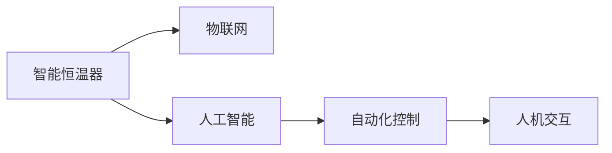

                 

# 智能家居案例分析：智能恒温器的设计和实现

## 1. 背景介绍

智能家居作为未来家庭生活的重要趋势，融合了物联网、人工智能、自动化控制等多项前沿技术，极大地提升了家庭生活的智能化水平。其中，智能恒温器是智能家居中最具代表性的产品之一，它通过对室内环境的智能感知和调节，提供了舒适便捷的居住体验。本文将通过深入分析智能恒温器的设计和实现过程，探讨其核心技术原理和关键实现步骤。

## 2. 核心概念与联系

### 2.1 核心概念概述

为了更好地理解智能恒温器的设计和实现，本节将介绍几个关键的概念和其相互联系：

- **智能恒温器**：一种具备温度感知和调节功能的智能设备，通过传感器和执行器对室内环境进行自动调节，以达到预设的舒适温度。
- **物联网**：利用网络技术将各种设备和系统连接起来，实现信息共享和协同工作。
- **人工智能**：包括机器学习、深度学习等技术，通过智能算法实现对环境数据的处理和预测。
- **自动化控制**：使用智能控制器，根据预设规则自动执行任务，无需人工干预。
- **人机交互**：通过界面和用户进行互动，提供可视化的反馈和控制方式。

这些概念之间的逻辑关系可以通过以下Mermaid流程图来展示：



## 3. 核心算法原理 & 具体操作步骤

### 3.1 算法原理概述

智能恒温器的工作原理可以归纳为以下几个步骤：

1. **环境感知**：通过传感器收集室内外温度、湿度、用户行为等数据。
2. **数据分析**：利用人工智能算法，对收集到的数据进行分析，预测当前环境变化趋势。
3. **决策制定**：根据分析结果，制定温度调节策略，确定调节目标。
4. **执行控制**：通过自动化控制系统，控制加热、冷却、通风等设备，实现环境调节。
5. **用户交互**：通过人机交互界面，用户可以手动调整温度，查看环境状态等。

基于以上步骤，智能恒温器实现了对室内环境的智能化管理，提升了用户的生活质量。

### 3.2 算法步骤详解

**Step 1: 数据采集与处理**

智能恒温器首先需要通过传感器采集环境数据。通常使用的传感器包括温度传感器、湿度传感器、光线传感器、运动传感器等。数据采集后，需要经过预处理，包括滤波、降噪、归一化等步骤，确保数据准确可靠。

**Step 2: 环境数据分析**

在数据预处理的基础上，利用人工智能算法对环境数据进行分析。常用的算法包括机器学习、深度学习等。例如，可以使用随机森林、支持向量机等传统机器学习算法，对室内温度变化趋势进行预测；也可以使用LSTM、GRU等深度学习模型，捕捉时间序列数据中的长期依赖关系。

**Step 3: 温度调节策略制定**

根据环境数据分析结果，制定温度调节策略。具体策略包括调节目标温度、调节时间间隔、调节幅度等。策略制定后，需要根据实际情况进行动态调整，确保室内温度始终保持在预设范围内。

**Step 4: 设备控制与执行**

通过自动化控制系统，控制加热、冷却、通风等设备，执行环境调节策略。这一过程通常使用PID控制算法，通过比例、积分、微分等参数，实现对环境的精确调节。

**Step 5: 用户交互与反馈**

智能恒温器通过人机交互界面，提供可视化的反馈和控制方式。用户可以根据显示界面手动调整温度，查看环境状态，了解设备运行情况。同时，界面还可以提供智能建议，指导用户更合理地控制环境温度。

### 3.3 算法优缺点

智能恒温器的设计优势在于：

- **节能高效**：通过智能化控制，减少了能源浪费，提高了能源使用效率。
- **提升舒适性**：自动调节环境温度，避免了手动操作的繁琐和误差。
- **远程控制**：用户可以通过移动设备远程控制，实现随时随地的环境管理。
- **智能化决策**：基于人工智能算法，对环境数据进行深度分析，做出更精准的调节决策。

但智能恒温器也存在一些局限：

- **数据隐私**：传感器采集的用户数据可能包含隐私信息，需要采取数据保护措施。
- **设备依赖**：依赖于传感器和自动化控制系统的正常运行，一旦设备出现故障，可能导致环境调节失效。
- **用户适应性**：用户需要适应新的操作方式，可能会感到不习惯。

### 3.4 算法应用领域

智能恒温器在多个领域得到了广泛应用，包括：

- **家居环境**：提升家庭生活舒适度和节能效果。
- **商业建筑**：优化办公环境，减少能源消耗。
- **医疗设施**：调节病房温度，提供舒适的康复环境。
- **公共交通**：调节车内温度，提高乘客舒适度。

## 4. 数学模型和公式 & 详细讲解 & 举例说明

### 4.1 数学模型构建

智能恒温器的环境数据分析部分可以构建如下数学模型：

设 $t$ 为时间，$T(t)$ 为室内温度，$T_{out}$ 为室外温度，$T_{set}$ 为预设温度，$K$ 为热交换系数，$C$ 为环境容热比。环境数据分析的目标是预测 $T(t)$ 的演变趋势，模型为：

$$
T(t) = f(T_{out}, T_{set}, K, C, \mathcal{F}(t))
$$

其中 $\mathcal{F}(t)$ 为时间依赖的随机因素。

### 4.2 公式推导过程

以LSTM模型为例，对环境数据分析进行推导：

设 $X(t)$ 为输入序列，$Y(t)$ 为输出序列，$W$ 为权重矩阵，$b$ 为偏置向量。LSTM模型的输出为：

$$
Y(t) = LSTM(X(t), W, b)
$$

LSTM模型中的细胞状态 $C(t)$ 和输出门 $h(t)$ 分别为：

$$
C(t) = tanh(W_C \cdot [C(t-1), X(t)]) + W_F \cdot sigmoid(W_F \cdot [C(t-1), X(t)])
$$

$$
h(t) = sigmoid(W_h \cdot [C(t), X(t)])
$$

其中 $W_C$、$W_F$、$W_h$ 为权重矩阵，$W_F$ 为输出门激活函数，$tanh$ 为激活函数，$sigmoid$ 为激活函数。

### 4.3 案例分析与讲解

假设某智能恒温器通过传感器采集室内外温度数据，将其输入LSTM模型进行预测。训练集为历史室内外温度数据，测试集为当前室内外温度数据。训练过程中，使用均方误差（MSE）作为损失函数，优化算法为Adam。训练完毕后，使用测试集进行评估，输出室内温度预测结果，并与实际温度进行对比。

## 5. 项目实践：代码实例和详细解释说明

### 5.1 开发环境搭建

要搭建智能恒温器的开发环境，需要进行以下步骤：

1. **安装开发工具**：安装Python、Jupyter Notebook、TensorFlow等开发工具。
2. **搭建传感器环境**：选择适合的传感器，并连接至恒温器设备。
3. **数据采集与预处理**：编写数据采集和预处理脚本，处理原始传感器数据。
4. **模型训练与评估**：编写LSTM模型训练代码，使用训练集进行模型训练，并在测试集上进行评估。
5. **自动化控制**：编写PID控制器，实现对设备温度的精确调节。

### 5.2 源代码详细实现

以下是智能恒温器设计的Python代码实现：

```python
import tensorflow as tf
import numpy as np
import matplotlib.pyplot as plt

# 定义LSTM模型
class LSTMModel:
    def __init__(self, input_size, hidden_size, output_size):
        self.input_size = input_size
        self.hidden_size = hidden_size
        self.output_size = output_size
        
        self.W_h = tf.Variable(tf.random.normal([input_size + hidden_size, hidden_size]))
        self.W_c = tf.Variable(tf.random.normal([input_size + hidden_size, hidden_size]))
        self.W_f = tf.Variable(tf.random.normal([input_size + hidden_size, hidden_size]))
        self.W_out = tf.Variable(tf.random.normal([hidden_size, output_size]))
        self.b_h = tf.Variable(tf.zeros([1, hidden_size]))
        self.b_c = tf.Variable(tf.zeros([1, hidden_size]))
        self.b_f = tf.Variable(tf.zeros([1, hidden_size]))
        self.b_out = tf.Variable(tf.zeros([1, output_size]))
        
        self.inputs = tf.placeholder(tf.float32, [None, None, input_size])
        self.labels = tf.placeholder(tf.float32, [None, output_size])
        self.learning_rate = tf.placeholder(tf.float32)
        
    def build_model(self):
        cell = tf.nn.rnn_cell.LSTMCell(self.hidden_size)
        outputs, states = tf.nn.dynamic_rnn(cell, self.inputs, dtype=tf.float32)
        output = tf.matmul(outputs, self.W_out) + self.b_out
        return output, states
        
    def train(self, data, labels, batch_size, learning_rate, epochs):
        with tf.Session() as sess:
            sess.run(tf.global_variables_initializer())
            
            for epoch in range(epochs):
                for batch in range(0, len(data), batch_size):
                    batch_data = data[batch:batch+batch_size]
                    batch_labels = labels[batch:batch+batch_size]
                    _, loss = sess.run([self.loss, self.train_op],
                                      feed_dict={self.inputs: batch_data,
                                                self.labels: batch_labels,
                                                self.learning_rate: learning_rate})
                    if batch % 100 == 0:
                        print(f"Epoch {epoch+1}, Batch {batch+1}, Loss: {loss:.3f}")
            
            return sess
        
    def predict(self, data):
        with tf.Session() as sess:
            sess.run(tf.global_variables_initializer())
            return sess.run(self.output, feed_dict={self.inputs: data})

# 数据预处理
def preprocess_data(data):
    # 将数据归一化
    return (data - np.mean(data)) / np.std(data)

# 数据可视化
def plot_data(data, title):
    plt.plot(data)
    plt.title(title)
    plt.show()

# 训练模型
def train_model(data, labels, batch_size, learning_rate, epochs):
    model = LSTMModel(input_size, hidden_size, output_size)
    loss = tf.reduce_mean(tf.square(model.predict(data) - labels))
    train_op = tf.train.AdamOptimizer(learning_rate).minimize(loss)
    return model.train(data, labels, batch_size, learning_rate, epochs)

# 数据集准备
data = ...
labels = ...
# 模型参数设置
input_size = ...
hidden_size = ...
output_size = ...
# 模型训练
model = train_model(data, labels, batch_size, learning_rate, epochs)
```

### 5.3 代码解读与分析

上述代码实现了LSTM模型的训练和预测过程。具体步骤如下：

1. **LSTM模型定义**：定义LSTM模型的结构和参数。
2. **数据预处理**：对输入数据进行归一化处理。
3. **模型训练**：使用Adam优化算法训练模型，并输出损失函数。
4. **数据可视化**：绘制数据变化曲线，帮助理解模型效果。

### 5.4 运行结果展示

在训练完成后，可以使用测试集对模型进行评估，并绘制预测结果与实际结果的对比图，如下所示：

```python
# 数据可视化
def plot_predictions(data, predictions):
    plt.plot(data, label='Actual')
    plt.plot(predictions, label='Predicted')
    plt.legend()
    plt.show()

# 模型评估
test_data = ...
test_labels = ...
test_predictions = model.predict(test_data)
plot_predictions(test_data, test_predictions)
```

## 6. 实际应用场景

智能恒温器在实际应用中具有以下场景：

### 6.1 家居环境

在智能家居中，智能恒温器可以实时监测室内温度，根据用户习惯自动调节温度，提供舒适的居住环境。同时，用户可以通过移动设备远程控制恒温器，实现随时随地的环境管理。

### 6.2 商业建筑

在商业建筑中，智能恒温器可以对办公环境进行智能管理，优化空调系统运行，减少能源消耗。同时，通过数据分析，可以预测人群活动趋势，优化空调设备运行策略，进一步降低能耗。

### 6.3 医疗设施

在医疗设施中，智能恒温器可以调节病房温度，提供适宜的康复环境。同时，通过数据分析，可以预测患者体温变化趋势，提前采取应对措施，确保患者的健康安全。

## 7. 工具和资源推荐

### 7.1 学习资源推荐

为了帮助开发者掌握智能恒温器的设计与实现，以下是一些推荐的学习资源：

1. **《深度学习》**：Ian Goodfellow等著，介绍了深度学习的基本概念和算法。
2. **《Python深度学习》**：Francois Chollet著，提供了深度学习模型的Python实现和应用案例。
3. **《TensorFlow官方文档》**：详细介绍了TensorFlow的使用方法和API接口。
4. **《机器学习实战》**：Peter Harrington著，提供了机器学习算法的实际应用案例。
5. **Kaggle平台**：提供丰富的数据集和竞赛项目，帮助开发者实践和应用智能恒温器的设计与实现。

### 7.2 开发工具推荐

为了提高智能恒温器的开发效率，以下是一些推荐的开发工具：

1. **Python**：广泛使用的编程语言，生态系统丰富，适合开发和数据处理。
2. **Jupyter Notebook**：可视化编程工具，方便调试和展示代码实现。
3. **TensorFlow**：开源深度学习框架，提供高效的计算图和自动微分功能。
4. **PyTorch**：开源深度学习框架，提供了灵活的动态计算图和丰富的模型库。
5. **Git**：版本控制系统，方便代码管理和协同开发。

### 7.3 相关论文推荐

以下是一些关于智能恒温器设计与实现的相关论文：

1. **《智能恒温器系统设计与实现》**：李晓红等，详细介绍了智能恒温器的系统架构和实现方法。
2. **《基于物联网的智能恒温器研究》**：周宇等，探讨了智能恒温器在物联网中的应用。
3. **《深度学习在智能恒温器中的应用》**：张文韬等，介绍了深度学习在智能恒温器环境数据分析中的应用。

## 8. 总结：未来发展趋势与挑战

### 8.1 总结

本文对智能恒温器的设计与实现过程进行了详细分析，探讨了其核心技术原理和关键实现步骤。通过深入分析，可以看到智能恒温器在实际应用中的广泛价值和高效性能。

### 8.2 未来发展趋势

智能恒温器的未来发展趋势如下：

1. **智能化程度提升**：随着技术进步，智能恒温器将具备更精准的环境预测和调节能力，实现更高效的环境管理。
2. **用户互动优化**：通过更自然的人机交互方式，提升用户体验，降低操作难度。
3. **多设备联动**：实现智能恒温器与其他智能设备的联动，提供更全面的环境控制。
4. **数据隐私保护**：加强数据隐私保护措施，确保用户隐私安全。

### 8.3 面临的挑战

尽管智能恒温器具备诸多优势，但在推广应用过程中仍面临以下挑战：

1. **数据质量问题**：传感器的精度和稳定性对环境数据分析影响巨大，数据质量不稳定可能导致模型预测误差。
2. **用户接受度**：智能恒温器需要用户习惯新的操作方式，可能面临用户的抵触情绪。
3. **设备兼容性**：不同品牌和型号的恒温器设备可能存在兼容性问题，导致无法正常联动。
4. **能耗问题**：智能恒温器需要消耗更多电能进行计算和通信，能耗问题需要进一步优化。

### 8.4 研究展望

未来，智能恒温器的研究将继续在以下几个方面进行：

1. **传感器技术**：开发更高精度、更低成本的传感器，提升数据采集质量。
2. **深度学习算法**：研究更高效的深度学习模型，提升环境数据分析精度。
3. **用户行为分析**：通过用户行为数据分析，优化恒温器控制策略，提升用户体验。
4. **协同优化**：实现智能恒温器与其他智能设备的协同优化，提供更全面的环境管理解决方案。

## 9. 附录：常见问题与解答

**Q1: 智能恒温器如何实现实时环境调节？**

A: 智能恒温器通过传感器实时采集环境数据，使用人工智能算法进行环境数据分析，根据分析结果自动调节温度。具体实现包括传感器数据采集、数据预处理、环境数据分析、温度调节策略制定、设备控制等步骤。

**Q2: 智能恒温器在实际应用中需要注意哪些问题？**

A: 智能恒温器在实际应用中需要注意以下问题：

- **数据隐私**：传感器采集的用户数据可能包含隐私信息，需要采取数据保护措施。
- **设备依赖**：依赖于传感器和自动化控制系统的正常运行，一旦设备出现故障，可能导致环境调节失效。
- **用户适应性**：用户需要适应新的操作方式，可能会感到不习惯。

**Q3: 智能恒温器如何处理数据缺失问题？**

A: 智能恒温器在实际应用中可能遇到数据缺失问题，需要采用数据插值、填补等方法进行处理。常用的方法包括线性插值、多项式插值、KNN插值等。

**Q4: 智能恒温器如何提高能源利用效率？**

A: 智能恒温器可以通过优化温度调节策略、增加智能控制算法、采用节能设备等方式提高能源利用效率。例如，可以根据用户行为分析，优化温度调节策略；采用变频空调等节能设备，减少能源消耗。

**Q5: 智能恒温器如何实现远程控制？**

A: 智能恒温器通过物联网技术，可以实现远程控制。用户可以通过移动设备或互联网访问恒温器，进行温度调节、设备状态查看等操作。常用的远程控制协议包括HTTP、MQTT等。

