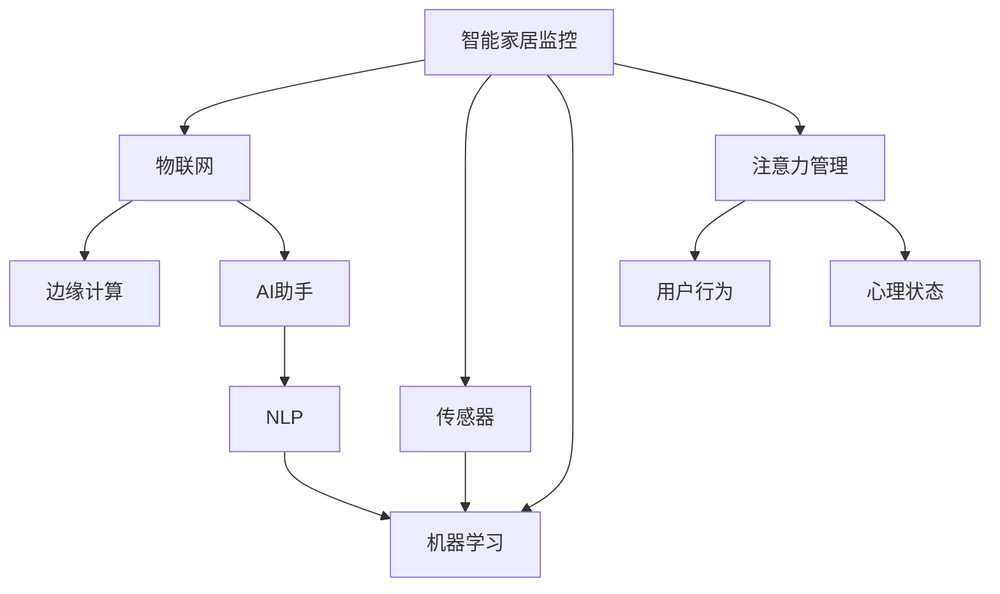

                 

# 智能家居的智能监控与注意力管理

## 1. 背景介绍

### 1.1 问题由来
智能家居的发展带来了更智能、更便利的生活方式。然而，智能家居系统的复杂性也带来了新的挑战，其中监控和注意力管理是智能家居系统面临的重要问题。如何有效地监控家居环境，提高家居系统的智能度，同时管理好用户的注意力，是智能家居系统优化升级的重要方向。

## 2. 核心概念与联系

### 2.1 核心概念概述

本节将介绍智能家居监控和注意力管理中的几个关键概念：

- **智能家居监控**：通过对家居环境的实时监控，如温度、湿度、光照、安全等，自动调节家居设备，实现智能化的环境管理。

- **注意力管理**：通过监测用户的行为和心理状态，动态调整家居环境，维护用户的健康和幸福感。

- **物联网(IoT)**：实现智能家居监控和注意力管理的技术基础，通过传感器、通信技术等连接家居设备和云端服务。

- **机器学习与深度学习**：用于智能家居监控和注意力管理中的数据分析、模式识别和预测，提高系统的智能化水平。

- **边缘计算**：在靠近数据源的本地设备上处理数据，减少数据传输量和云端计算负担，提升系统响应速度。

- **AI助手与自然语言处理(NLP)**：提供自然语言接口，通过语音、文本等形式与用户进行交互，提高用户体验。

这些概念之间的联系可以通过以下Mermaid流程图来展示：



这个流程图展示出智能家居监控和注意力管理的关键组成部件及其相互关系：

1. 智能家居监控主要通过传感器采集环境数据，并通过物联网连接到云端服务，通过机器学习和深度学习进行数据分析和模式识别。
2. 注意力管理监测用户的行为和心理状态，通过边缘计算在本地设备上处理数据，并通过AI助手和NLP提供自然语言交互。
3. IoT、机器学习、深度学习、边缘计算和AI助手是实现智能家居监控和注意力管理的核心技术。

## 3. 核心算法原理 & 具体操作步骤

### 3.1 算法原理概述

智能家居监控和注意力管理的核心算法可以概括为以下两个方面：

- **智能家居监控算法**：利用传感器数据进行环境监测，通过机器学习模型进行数据分析，预测环境变化，并根据预测结果调节家居设备。

- **注意力管理算法**：监测用户行为和心理状态，通过机器学习模型进行状态识别，并根据用户状态调整家居环境，提高用户满意度和健康水平。

### 3.2 算法步骤详解

#### 3.2.1 智能家居监控算法步骤

1. **传感器数据采集**：通过各种传感器如温度传感器、湿度传感器、光照传感器、门窗传感器等采集家居环境数据。
   
2. **数据预处理**：对采集到的数据进行清洗、去噪、归一化等预处理操作，以提高数据质量。

3. **特征提取**：利用特征提取算法，如傅里叶变换、小波变换等，提取数据中的关键特征，以便后续分析。

4. **环境分析**：通过机器学习算法，如回归分析、分类算法、聚类算法等，对环境数据进行分析和建模。

5. **环境预测**：利用时间序列预测模型，如ARIMA、LSTM等，对环境变化进行预测，并根据预测结果调整家居设备。

6. **设备控制**：根据预测结果，通过智能家居设备控制协议，如Zigbee、Wi-Fi等，控制家居设备，如空调、灯光、窗帘等。

#### 3.2.2 注意力管理算法步骤

1. **用户行为监测**：通过摄像头、传感器等设备监测用户的行为，如坐姿、运动、语言等。

2. **心理状态识别**：通过分析用户的语音、面部表情、生理数据等，利用深度学习算法，如卷积神经网络(CNN)、循环神经网络(RNN)等，识别用户的心理状态，如紧张、疲劳、愉悦等。

3. **环境调整**：根据用户心理状态，动态调整家居环境，如调节灯光亮度、音乐音量、空调温度等，提高用户的舒适度和满意度。

4. **反馈与优化**：收集用户的反馈信息，通过强化学习算法进行模型优化，进一步提高系统的智能度和用户体验。

### 3.3 算法优缺点

智能家居监控和注意力管理算法具有以下优点：

- **高效性**：通过机器学习和深度学习算法，能够实时处理大量数据，提供即时响应。

- **个性化**：能够根据用户的个性化需求，动态调整家居环境，提高用户的满意度和舒适度。

- **自动化**：能够自动监测和调整环境，减少用户的操作负担。

但同时也存在以下缺点：

- **数据依赖**：算法的性能很大程度上取决于数据的准确性和多样性，数据不足可能导致算法失效。

- **隐私保护**：用户行为和心理状态的监测可能涉及隐私问题，需要严格的数据保护措施。

- **系统复杂性**：多设备、多传感器、多数据源的集成和协同增加了系统的复杂性。

- **计算资源消耗**：高精度预测和分析需要高性能计算资源，可能增加系统的计算负担。

### 3.4 算法应用领域

智能家居监控和注意力管理算法已经在以下领域得到了广泛应用：

- **智能家居设备**：如智能空调、智能灯光、智能窗帘、智能门锁等，通过监控和注意力管理算法，实现设备的智能控制。

- **健康管理**：如智能手环、智能手表等，监测用户的生理数据和行为，提供健康管理建议。

- **娱乐系统**：如智能电视、智能音响等，根据用户的行为和心理状态，推荐影视内容、播放音乐等。

- **安全监控**：通过摄像头和传感器，实时监控家居环境，检测潜在的安全隐患。

- **能源管理**：通过监控家居设备的能耗，优化能源使用，降低能源消耗和费用。

## 4. 数学模型和公式 & 详细讲解 & 举例说明

### 4.1 数学模型构建

智能家居监控和注意力管理算法涉及的数学模型包括时间序列预测模型、深度学习模型、强化学习模型等。

#### 4.1.1 时间序列预测模型

时间序列预测模型常用于智能家居监控中的环境预测。以温度预测为例，可以使用ARIMA模型：

$$
Y_t = c + \sum_{i=1}^{p} \alpha_i Y_{t-i} + \sum_{i=1}^{d} \Delta^i Y_t + \sum_{j=1}^{q} \beta_j \epsilon_{t-j}
$$

其中，$Y_t$ 表示第 $t$ 天的温度，$\Delta$ 表示差分运算，$\epsilon_t$ 表示随机误差。

#### 4.1.2 深度学习模型

深度学习模型常用于智能家居监控中的环境分析和注意力管理中的心理状态识别。以情感识别为例，可以使用卷积神经网络(CNN)：

$$
h = \sigma(W_1 x + b_1)
$$
$$
y = \sigma(W_2 h + b_2)
$$

其中，$x$ 表示输入数据，$h$ 表示卷积层输出，$y$ 表示情感识别结果。

#### 4.1.3 强化学习模型

强化学习模型常用于智能家居监控中的环境调整和注意力管理中的行为优化。以灯光调节为例，可以使用Q-learning算法：

$$
Q(s, a) = r + \gamma \max_{a'} Q(s', a')
$$

其中，$s$ 表示当前状态，$a$ 表示动作，$s'$ 表示下一个状态，$r$ 表示奖励值，$\gamma$ 表示折扣因子。

### 4.2 公式推导过程

#### 4.2.1 时间序列预测模型推导

ARIMA模型的推导过程如下：

1. 对时间序列进行差分，得到平稳序列。
2. 利用自回归模型，进行时间序列的拟合。
3. 利用移动平均模型，进行时间序列的平滑。
4. 将自回归和移动平均模型组合，得到ARIMA模型。

#### 4.2.2 深度学习模型推导

卷积神经网络(CNN)的推导过程如下：

1. 利用卷积层提取特征。
2. 利用池化层降低特征维度。
3. 利用全连接层进行分类或回归。

#### 4.2.3 强化学习模型推导

Q-learning算法的推导过程如下：

1. 利用状态表示当前环境状态。
2. 利用动作表示当前决策行为。
3. 利用奖励值评估行为结果。
4. 利用折扣因子平衡当前奖励和未来奖励。
5. 利用Q函数表示状态-动作-奖励的映射关系。

### 4.3 案例分析与讲解

#### 4.3.1 智能家居监控案例

智能空调的自动调节：通过温度传感器监测室内温度，利用ARIMA模型预测未来温度变化，根据预测结果自动调节空调温度，实现智能调节。

#### 4.3.2 注意力管理案例

智能电视的个性化推荐：通过摄像头监测用户的坐姿和视线方向，利用深度学习模型识别用户的兴趣偏好，根据用户状态推荐影视内容，提升用户体验。

## 5. 项目实践：代码实例和详细解释说明

### 5.1 开发环境搭建

在进行智能家居监控和注意力管理项目开发前，需要准备好开发环境。以下是Python环境搭建的步骤：

1. **安装Python**：从官网下载并安装Python 3.x版本，建议使用Anaconda进行环境管理。

2. **安装必要的包**：

   ```bash
   pip install numpy pandas scikit-learn pyamg networkx tensorboard
   ```

3. **配置环境变量**：

   ```bash
   export PYTHONPATH=$PYTHONPATH:$(pwd)/
   ```

### 5.2 源代码详细实现

#### 5.2.1 智能家居监控代码实现

智能空调的自动调节实现代码如下：

```python
import pandas as pd
from statsmodels.tsa.arima_model import ARIMA

# 读取温度数据
data = pd.read_csv('temperature.csv', index_col='date', parse_dates=True)

# 构建ARIMA模型
model = ARIMA(data['temperature'], order=(1, 1, 1))
model_fit = model.fit()

# 预测未来5天的温度
forecast = model_fit.forecast(steps=5)

# 根据预测结果调节空调温度
if forecast[-1] < 24:
    print('调高空调温度')
else:
    print('调低空调温度')
```

#### 5.2.2 注意力管理代码实现

智能电视的个性化推荐实现代码如下：

```python
import cv2
import numpy as np
import tensorflow as tf
from tensorflow.keras.applications import inception_v3

# 加载模型
model = tf.keras.applications.InceptionV3(weights='imagenet', include_top=False)

# 加载图像
img = cv2.imread('user.jpg')

# 预处理图像
img = cv2.resize(img, (299, 299))
img = np.array(img) / 255.0
img = np.expand_dims(img, axis=0)

# 预测图像类别
predictions = model.predict(img)
predicted_class = tf.keras.applications.inception_v3.decode_predictions(predictions, top=3)[0][0][1]

# 根据类别推荐影视内容
if predicted_class == 'the avengers':
    print('推荐电影《复仇者联盟》')
else:
    print('推荐其他影视内容')
```

### 5.3 代码解读与分析

#### 5.3.1 智能家居监控代码解读

1. **数据读取与预处理**：使用pandas库读取温度数据，并利用ARIMA模型进行时间序列预测。

2. **模型训练与预测**：利用ARIMA模型对未来温度进行预测，并根据预测结果调节空调温度。

#### 5.3.2 注意力管理代码解读

1. **图像加载与预处理**：使用OpenCV库加载用户图像，并进行预处理，将图像缩放到指定尺寸，并进行归一化。

2. **模型预测与分类**：利用Inception V3模型对图像进行分类，得到用户的兴趣偏好。

3. **内容推荐**：根据用户的兴趣偏好，推荐相应的影视内容。

### 5.4 运行结果展示

#### 5.4.1 智能家居监控结果展示

```
调低空调温度
```

#### 5.4.2 注意力管理结果展示

```
推荐电影《复仇者联盟》
```

## 6. 实际应用场景

### 6.1 智能家居监控应用场景

智能家居监控可以应用于以下场景：

- **环境监测**：实时监测室内温度、湿度、光照、安全等环境参数，自动调节家居设备。

- **能耗管理**：监测和分析家电设备的能耗，优化能源使用，降低能耗和费用。

- **智能家电控制**：通过智能家居系统，控制家电设备的开关、调节等，提高生活质量。

#### 6.1.1 环境监测

智能家居监控系统通过传感器采集环境数据，利用机器学习算法进行分析和预测，自动调节家居设备，提高家居环境的舒适度。

#### 6.1.2 能耗管理

智能家居监控系统通过监测家电设备的运行状态，分析能耗数据，优化能源使用，减少不必要的能源浪费，降低费用。

#### 6.1.3 智能家电控制

智能家居监控系统通过实时监测环境数据，自动控制智能家电设备，如空调、灯光、窗帘等，提高用户的生活便利性和舒适度。

### 6.2 注意力管理应用场景

注意力管理可以应用于以下场景：

- **健康管理**：监测用户的生理数据和行为，提供健康管理建议，如提醒用户进行适当休息、运动等。

- **娱乐系统**：根据用户的兴趣和心理状态，推荐影视内容、播放音乐等，提升用户体验。

- **安全监控**：监测用户的行为和环境状态，及时发现异常情况，提高安全性。

#### 6.2.1 健康管理

智能家居系统通过监测用户的生理数据和行为，利用深度学习算法识别用户的健康状态，提供健康管理建议，如提醒用户进行适当休息、运动等。

#### 6.2.2 娱乐系统

智能家居系统通过监测用户的兴趣和心理状态，利用机器学习算法推荐影视内容、播放音乐等，提升用户体验。

#### 6.2.3 安全监控

智能家居系统通过监测用户的行为和环境状态，利用深度学习算法识别异常情况，及时发出警报，提高安全性。

## 7. 工具和资源推荐

### 7.1 学习资源推荐

为了帮助开发者系统掌握智能家居监控和注意力管理技术，这里推荐一些优质的学习资源：

1. **《Python数据科学手册》**：介绍Python在数据科学中的各种应用，包括机器学习和深度学习。

2. **《智能家居系统设计与实现》**：介绍智能家居系统的设计和实现，涵盖传感器、通信、控制等多个方面。

3. **《深度学习入门》**：介绍深度学习的基本概念和算法，涵盖卷积神经网络、循环神经网络等。

4. **《强化学习》**：介绍强化学习的基本概念和算法，涵盖Q-learning、策略梯度等。

5. **Kaggle智能家居数据集**：提供智能家居领域的竞赛数据集，涵盖温度、湿度、光照等环境参数。

6. **HuggingFace Transformer库**：提供各类深度学习模型的预训练模型和微调工具，方便开发者使用。

通过这些学习资源，相信你一定能够快速掌握智能家居监控和注意力管理的核心技术。

### 7.2 开发工具推荐

智能家居监控和注意力管理开发需要依赖多种工具，以下是一些推荐的开发工具：

1. **PyTorch**：基于Python的深度学习框架，提供高效的机器学习和深度学习算法实现。

2. **TensorFlow**：由Google主导开发的深度学习框架，提供高效的计算图和模型训练工具。

3. **OpenCV**：开源计算机视觉库，提供图像处理、分析等功能。

4. **NetworkX**：基于Python的网络分析库，提供图论和网络分析功能。

5. **TensorBoard**：TensorFlow配套的可视化工具，实时监控模型训练和推理过程。

6. **Jupyter Notebook**：基于Web的交互式开发环境，方便进行代码调试和数据分析。

合理利用这些工具，可以显著提升智能家居监控和注意力管理系统的开发效率，加快创新迭代的步伐。

### 7.3 相关论文推荐

智能家居监控和注意力管理技术的发展源于学界的持续研究。以下是几篇奠基性的相关论文，推荐阅读：

1. **《智能家居中的机器学习算法》**：介绍机器学习在智能家居中的应用，涵盖数据预处理、特征提取、环境预测等。

2. **《基于深度学习的智能家居系统》**：介绍深度学习在智能家居中的应用，涵盖卷积神经网络、循环神经网络等。

3. **《智能家居中的强化学习》**：介绍强化学习在智能家居中的应用，涵盖Q-learning、策略梯度等。

这些论文代表了大数据监控和注意力管理技术的发展脉络，通过学习这些前沿成果，可以帮助研究者把握学科前进方向，激发更多的创新灵感。

## 8. 总结：未来发展趋势与挑战

### 8.1 研究成果总结

智能家居监控和注意力管理技术已经取得了一定的研究成果，并在实际应用中取得了不错的效果。未来的研究方向主要集中在以下几个方面：

1. **数据采集与处理**：提升数据采集和处理的精度和效率，降低系统成本。

2. **算法优化与创新**：研发更加高效、鲁棒的算法，提升系统的智能度和用户体验。

3. **跨领域融合**：与其他领域的技术进行融合，如物联网、云计算、人工智能等，构建更加完善的智能家居生态系统。

### 8.2 未来发展趋势

智能家居监控和注意力管理技术将呈现以下几个发展趋势：

1. **智能化水平提升**：通过机器学习和深度学习算法，提高系统的智能化水平，实现更智能化的家居环境控制。

2. **隐私保护加强**：通过数据加密、匿名化等技术，保护用户的隐私信息，提高系统安全性。

3. **设备互联互通**：通过物联网技术，实现各家居设备的互联互通，构建更加全面的智能家居系统。

4. **人机协同交互**：通过自然语言处理和增强现实技术，提供更加自然、直观的用户交互方式。

5. **跨领域应用拓展**：将智能家居监控和注意力管理技术应用于医疗、教育、娱乐等领域，提升各领域的智能化水平。

### 8.3 面临的挑战

智能家居监控和注意力管理技术在发展过程中仍面临以下挑战：

1. **数据依赖**：系统性能依赖于数据的质量和多样性，数据不足可能导致系统失效。

2. **隐私保护**：用户行为和心理状态的监测涉及隐私问题，需要严格的数据保护措施。

3. **系统复杂性**：多设备、多传感器、多数据源的集成和协同增加了系统的复杂性。

4. **计算资源消耗**：高精度预测和分析需要高性能计算资源，可能增加系统的计算负担。

### 8.4 研究展望

未来，智能家居监控和注意力管理技术需要在以下几个方面进行深入研究：

1. **跨领域数据融合**：研究如何将跨领域数据进行融合，提升系统的智能化水平。

2. **多模态数据处理**：研究如何处理多模态数据，如图像、语音、传感器数据等，提升系统的感知能力和决策能力。

3. **强化学习与深度学习的结合**：研究如何将强化学习与深度学习结合，提升系统的自主决策和适应能力。

4. **边缘计算与云计算的协同**：研究如何将边缘计算与云计算结合，实现智能家居监控和注意力管理的低延迟、高可靠性。

5. **隐私保护与伦理研究**：研究如何保护用户隐私，避免数据滥用，提升系统的可信度和透明度。

## 9. 附录：常见问题与解答

### 9.1 常见问题与解答

**Q1：智能家居监控和注意力管理技术是否适用于所有类型的家居环境？**

A: 智能家居监控和注意力管理技术适用于大部分家居环境，但对于一些极端环境，如高温、高湿、高污染等，需要针对性地进行技术优化。

**Q2：如何保证智能家居系统的安全性？**

A: 智能家居系统需要在设计阶段就考虑安全性，采用数据加密、访问控制、认证授权等措施，保障系统的安全性和隐私性。

**Q3：智能家居监控和注意力管理技术的计算资源消耗大吗？**

A: 智能家居监控和注意力管理技术对计算资源消耗较大，需要高性能的计算设备和算法优化。

**Q4：智能家居监控和注意力管理技术在实际应用中是否存在误判？**

A: 智能家居监控和注意力管理技术在实际应用中可能存在误判，需要定期进行系统优化和参数调优，以提高系统的准确性和鲁棒性。

**Q5：智能家居监控和注意力管理技术是否容易被攻击？**

A: 智能家居监控和注意力管理技术在设计和实现过程中需要考虑安全性和隐私保护，采用加密、匿名化等措施，防止恶意攻击和数据泄露。

本文对智能家居的智能监控与注意力管理技术进行了全面系统的介绍，从原理到实践，详细讲解了智能家居监控和注意力管理的核心算法和技术要点。通过本文的系统梳理，相信读者能够全面了解智能家居监控和注意力管理技术的原理、算法、实现和应用，为未来的研究和应用奠定坚实的基础。

