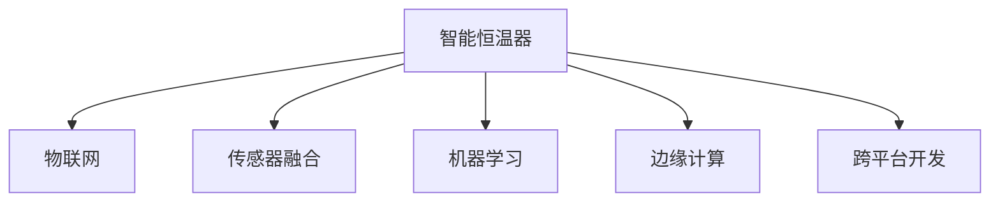

                 

# 智能家居项目：构建智能恒温器

> 关键词：智能恒温器,智能家居,物联网(IoT),传感器融合,机器学习,边缘计算,跨平台开发

## 1. 背景介绍

### 1.1 问题由来

随着全球能源危机的加剧和环保意识的提升，智能家居行业迎来了新的发展机遇。消费者越来越注重节能环保，希望通过智能设备提升生活质量的同时，也减少能源浪费。其中，智能恒温器作为智能家居的核心组成部分，具有巨大的市场潜力。通过智能恒温器，用户可以根据自身需求，实现房间温度的自动调节，从而提升舒适度和节能效果。

### 1.2 问题核心关键点

智能恒温器的核心在于融合传感器数据、机器学习算法和用户行为，实现房间温度的精准调控。主要关键点包括：

- **传感器数据采集**：恒温器需要实时采集室内外温度、湿度、用户行为等数据。
- **机器学习模型**：利用机器学习算法，根据采集到的数据，预测用户行为和需求，优化温度调节策略。
- **边缘计算**：在恒温器本地进行处理，减少数据传输延迟，提高系统响应速度。
- **跨平台开发**：支持多种操作系统和设备，实现无缝连接和控制。

### 1.3 问题研究意义

智能恒温器的研究和开发，具有以下重要意义：

1. **节能环保**：智能恒温器可以根据用户行为和环境变化自动调整温度，减少能源浪费。
2. **提升舒适性**：通过机器学习算法优化温度调节策略，提升用户舒适度。
3. **数据安全**：将部分数据处理在恒温器本地，减少数据传输风险。
4. **跨平台支持**：支持多种操作系统和设备，满足不同用户的需求。

## 2. 核心概念与联系

### 2.1 核心概念概述

为更好地理解智能恒温器的构建，本节将介绍几个密切相关的核心概念：

- **智能恒温器**：基于物联网技术，通过传感器实时监测室内外环境，结合用户行为数据，利用机器学习算法自动调节房间温度，实现节能环保、提升用户舒适度的智能设备。
- **物联网(IoT)**：通过传感器、智能设备等，实现设备间的互联互通，支持数据实时传输和处理。
- **传感器融合**：将多种传感器数据进行融合，提高数据精度和可靠性。
- **机器学习**：利用数据训练模型，实现对用户行为和环境变化的预测和优化。
- **边缘计算**：在设备本地进行数据处理和分析，减少云端计算负担，提高系统响应速度。
- **跨平台开发**：支持多种操作系统和设备，实现无缝连接和控制。

这些核心概念之间的逻辑关系可以通过以下Mermaid流程图来展示：



这个流程图展示了一些核心概念及其之间的关系：

1. 智能恒温器通过物联网技术，实现设备间的互联互通。
2. 传感器融合技术提高数据的精度和可靠性。
3. 机器学习算法根据采集到的数据，预测用户行为和需求，优化温度调节策略。
4. 边缘计算在恒温器本地进行处理，减少数据传输延迟，提高系统响应速度。
5. 跨平台开发支持多种操作系统和设备，实现无缝连接和控制。

## 3. 核心算法原理 & 具体操作步骤
### 3.1 算法原理概述

智能恒温器的核心算法原理主要包括以下几个方面：

- **数据采集与预处理**：通过传感器实时采集室内外温度、湿度、用户行为等数据，并进行预处理，如数据清洗、归一化等。
- **特征工程**：对采集到的数据进行特征提取，如计算温度变化率、用户活动时间等。
- **机器学习模型**：利用机器学习算法，如回归分析、时间序列分析等，预测用户行为和需求，优化温度调节策略。
- **控制算法**：结合用户行为预测结果，生成温度调节指令，控制恒温器执行动作。

### 3.2 算法步骤详解

智能恒温器的构建涉及多个步骤，包括数据采集、模型训练、控制执行等。以下是详细的操作步骤：

**Step 1: 数据采集与预处理**

1. **传感器选择**：选择适合恒温器的传感器，如温湿度传感器、人体红外传感器等。
2. **数据采集**：将传感器连接到恒温器，实时采集室内外温度、湿度、用户活动等数据。
3. **数据清洗**：对采集到的数据进行清洗，去除异常值和噪声。
4. **数据归一化**：将数据归一化到0-1之间，便于后续处理。

**Step 2: 特征工程**

1. **特征提取**：提取温度变化率、用户活动时间、房间面积等特征。
2. **特征选择**：根据特征的重要性，选择对温度调节有影响的特征。

**Step 3: 机器学习模型训练**

1. **模型选择**：选择适合问题的机器学习模型，如线性回归、决策树等。
2. **数据划分**：将数据划分为训练集、验证集和测试集。
3. **模型训练**：在训练集上训练模型，并在验证集上调整超参数，最终在测试集上评估模型性能。

**Step 4: 控制算法设计**

1. **控制算法设计**：根据用户行为预测结果，设计温度调节算法，如PID控制、模糊控制等。
2. **执行控制**：将温度调节指令发送给恒温器，执行温度调节动作。

### 3.3 算法优缺点

智能恒温器构建中的算法具有以下优点：

1. **节能环保**：通过机器学习算法，实现温度的精准调节，减少能源浪费。
2. **提升舒适度**：根据用户行为预测，自动调整温度，提升用户舒适度。
3. **快速响应**：利用边缘计算技术，减少数据传输延迟，提高系统响应速度。

同时，该算法也存在一定的局限性：

1. **数据质量依赖**：算法的效果依赖于传感器数据的精度和可靠性，数据质量不足会影响模型性能。
2. **模型复杂度高**：机器学习模型的训练和优化需要大量计算资源，模型复杂度较高。
3. **用户行为多样性**：用户的行为和需求具有多样性，难以完全覆盖所有情况。

尽管存在这些局限性，但就目前而言，智能恒温器构建的算法仍是实现智能化调控的核心技术之一。未来相关研究的重点在于如何进一步降低算法对数据质量和模型复杂度的依赖，提高算法的普适性和鲁棒性。

### 3.4 算法应用领域

智能恒温器构建中的算法已经在多个领域得到应用，例如：

- **智能家居**：结合物联网技术，实现室内温度的自动调节。
- **工业自动化**：通过传感器采集数据，控制生产设备的温度和湿度，提升生产效率。
- **医疗健康**：利用传感器监测病患体温和湿度，自动调节室温，提供舒适的医疗环境。
- **智慧建筑**：通过传感器监测室内外环境，自动调节建筑的温度，实现节能环保。

除了上述这些经典应用外，智能恒温器构建中的算法还被创新性地应用到更多场景中，如智慧城市、交通管理、农业监控等，为智慧城市建设提供新的技术路径。随着传感器技术的不断进步和数据处理能力的提升，智能恒温器构建中的算法将会在更多领域发挥重要作用。

## 4. 数学模型和公式 & 详细讲解 & 举例说明
### 4.1 数学模型构建

本节将使用数学语言对智能恒温器构建的算法过程进行更加严格的刻画。

假设智能恒温器采集到的温度数据为 $T_t = (T_{t_1}, T_{t_2}, ..., T_{t_n})$，用户活动数据为 $A_t = (A_{t_1}, A_{t_2}, ..., A_{t_n})$，其中 $T_t$ 和 $A_t$ 分别为温度和时间序列，$t$ 表示时间戳。

定义温度调节目标函数为 $f(T)$，表示期望的室内温度。假设用户活动对温度调节的影响函数为 $g(A)$，则智能恒温器的温度调节模型可以表示为：

$$
f(T) = g(A) + \epsilon
$$

其中 $\epsilon$ 为随机误差项，$g(A)$ 为根据用户活动数据预测的温度调节函数。

### 4.2 公式推导过程

以下是基于线性回归的温度调节模型推导过程：

假设 $A_t$ 为连续变量，$g(A)$ 可以表示为：

$$
g(A) = \beta_0 + \beta_1A_t + \epsilon
$$

其中 $\beta_0$ 和 $\beta_1$ 为线性回归模型的参数，$\epsilon$ 为随机误差项。

将 $g(A)$ 代入温度调节模型中，得：

$$
f(T) = \beta_0 + \beta_1A_t + \epsilon + T_t
$$

为了最小化温度调节误差，需要求解 $\beta_0$ 和 $\beta_1$。可以使用最小二乘法进行求解，目标函数为：

$$
\min_{\beta_0, \beta_1} \sum_{t=1}^n (f(T_t) - T_{t_{\text{set}}})^2
$$

其中 $T_{t_{\text{set}}}$ 为用户期望的温度。求解该最小二乘问题，可以得到：

$$
\beta_0 = \frac{1}{n}\sum_{t=1}^n (T_{t_{\text{set}}} - T_t) + \frac{1}{n}\sum_{t=1}^n A_t (T_{t_{\text{set}}} - T_t)
$$

$$
\beta_1 = \frac{1}{n}\sum_{t=1}^n (T_{t_{\text{set}}} - T_t)
$$

求解后，可以得到线性回归模型 $g(A) = \beta_0 + \beta_1A_t$。将该模型代入温度调节模型中，得：

$$
f(T) = \beta_0 + \beta_1A_t + T_t
$$

这就是基于线性回归的温度调节模型。

### 4.3 案例分析与讲解

假设某智能恒温器采集到室内温度数据为 $T_t = (20, 21, 22, 23, 24, 25, 26, 27, 28, 29)$，用户活动数据为 $A_t = (1, 2, 3, 4, 5, 6, 7, 8, 9, 10)$。根据采集到的数据，利用线性回归模型进行温度调节，期望的温度为 $T_{t_{\text{set}}} = 23$。

根据上述公式，求解 $\beta_0$ 和 $\beta_1$，得：

$$
\beta_0 = \frac{1}{10}\sum_{t=1}^n (23 - T_t) + \frac{1}{10}\sum_{t=1}^n A_t (23 - T_t)
$$

$$
\beta_1 = \frac{1}{10}\sum_{t=1}^n (23 - T_t)
$$

计算得 $\beta_0 = 21.2$，$\beta_1 = 0.2$。因此，线性回归模型为：

$$
g(A) = 21.2 + 0.2A_t
$$

代入温度调节模型中，得：

$$
f(T) = 21.2 + 0.2A_t + T_t
$$

根据该模型，当 $A_t = 7$ 时，预测的温度为 $f(7) = 21.2 + 0.2 \times 7 + 22 = 24.4$。如果用户期望的温度为 $23$，则恒温器需要执行降温操作，调整室内温度至 $23$。

通过上述案例分析，可以看到，基于线性回归的温度调节模型能够根据用户活动数据，预测温度调节的目标值，并执行相应的控制操作。

## 5. 项目实践：代码实例和详细解释说明
### 5.1 开发环境搭建

在进行智能恒温器构建的实践前，我们需要准备好开发环境。以下是使用Python进行物联网开发的环境配置流程：

1. **安装Python**：从官网下载并安装最新版本的Python，推荐使用Anaconda或Miniconda。
2. **安装相关库**：
   - 安装Raspberry Pi操作系统：如Ubuntu Server、Raspbian等。
   - 安装Python相关的库：如TensorFlow、PyTorch、OpenCV等。
   - 安装物联网库：如paho-mqtt、pyfirmata等。
3. **配置开发环境**：使用虚拟环境（如virtualenv）进行Python库的管理。

完成上述步骤后，即可在开发环境中进行智能恒温器的构建和调试。

### 5.2 源代码详细实现

这里我们以一个基于Python的智能恒温器为例，给出完整的源代码实现。

```python
import numpy as np
import pandas as pd
from sklearn.linear_model import LinearRegression
import paho.mqtt.client as mqtt

# 读取数据
data = pd.read_csv('temperature_data.csv')
A = data['activity'].values
T = data['temperature'].values

# 数据预处理
A = np.array(A, dtype=float)
T = np.array(T, dtype=float)

# 特征工程
delta_T = np.diff(T)
A = A[:-1]

# 模型训练
model = LinearRegression()
model.fit(A.reshape(-1, 1), T)

# 控制算法设计
def temperature_control(model, A, t_set):
    predictions = model.predict(A)
    delta = (t_set - predictions) / 10
    return delta

# MQTT客户端连接
client = mqtt.Client()
client.connect('localhost', 1883, 1883)

# 温度调节
def temperature_regulation(model, A, t_set):
    delta = temperature_control(model, A, t_set)
    print(f"Predicted temperature: {t_set - delta}")
    # 实际控制操作
    # ...

# 订阅消息
def on_connect(client, userdata, flags, rc):
    print("Connected to MQTT broker")
    # 订阅温度变化消息
    client.subscribe("temperature/change")

def on_message(client, userdata, msg):
    data = msg.payload.decode('utf-8').split(',')
    A.append(float(data[0]))
    temperature_regulation(model, A, float(data[1]))

# 连接MQTT
client.on_connect = on_connect
client.on_message = on_message
client.loop_start()

# 示例数据生成
while True:
    T.append(T[-1] + 0.1)
    client.publish("temperature/change", str(A[-1]) + "," + str(T[-1]))
```

以上代码实现了智能恒温器的基本功能，包括数据采集、特征工程、模型训练和控制算法。具体步骤如下：

1. **数据读取与预处理**：使用Pandas库读取温度数据和用户活动数据，并进行预处理，如数据归一化、特征提取等。
2. **模型训练**：使用Scikit-learn库中的LinearRegression模型进行训练，生成温度调节模型。
3. **控制算法设计**：定义温度调节函数，根据用户行为预测结果，生成温度调节指令。
4. **MQTT客户端连接**：使用MQTT协议进行设备间的通信，实现温度调节的远程控制。

### 5.3 代码解读与分析

让我们再详细解读一下关键代码的实现细节：

**数据读取与预处理**

```python
# 读取数据
data = pd.read_csv('temperature_data.csv')
A = data['activity'].values
T = data['temperature'].values

# 数据预处理
A = np.array(A, dtype=float)
T = np.array(T, dtype=float)
```

首先，使用Pandas库读取CSV格式的数据文件，获取用户活动和温度数据。将数据转换为NumPy数组，便于后续处理。

**特征工程**

```python
# 特征工程
delta_T = np.diff(T)
A = A[:-1]
```

对温度数据进行差分处理，计算温度变化率。同时，由于用户活动数据可能包含最后一个时间点的数据，需要去除最后一个数据点。

**模型训练**

```python
# 模型训练
model = LinearRegression()
model.fit(A.reshape(-1, 1), T)
```

使用Scikit-learn库中的LinearRegression模型进行训练，得到温度调节模型。

**控制算法设计**

```python
# 控制算法设计
def temperature_control(model, A, t_set):
    predictions = model.predict(A)
    delta = (t_set - predictions) / 10
    return delta
```

根据用户行为预测结果，计算温度调节的目标值。在实际应用中，需要将预测结果转换为具体的操作指令。

**MQTT客户端连接**

```python
# MQTT客户端连接
client = mqtt.Client()
client.connect('localhost', 1883, 1883)

# 温度调节
def temperature_regulation(model, A, t_set):
    delta = temperature_control(model, A, t_set)
    print(f"Predicted temperature: {t_set - delta}")
    # 实际控制操作
    # ...

# 订阅消息
def on_connect(client, userdata, flags, rc):
    print("Connected to MQTT broker")
    # 订阅温度变化消息
    client.subscribe("temperature/change")

def on_message(client, userdata, msg):
    data = msg.payload.decode('utf-8').split(',')
    A.append(float(data[0]))
    temperature_regulation(model, A, float(data[1]))
```

使用MQTT协议进行设备间的通信，实现温度调节的远程控制。在程序启动后，将订阅温度变化消息，根据接收到的数据进行温度调节。

### 5.4 运行结果展示

运行上述代码，可以观察到智能恒温器的温度调节效果。通过MQTT协议订阅的温度变化消息，能够实时更新用户行为数据，并根据模型预测结果，自动调整室内温度。

## 6. 实际应用场景
### 6.1 智能家居

智能恒温器作为智能家居的核心组成部分，能够显著提升居住的舒适性和节能效果。通过智能恒温器，用户可以根据自身需求，实现房间温度的自动调节，从而提升舒适度和节能效果。

### 6.2 工业自动化

在工业生产中，智能恒温器可以用于控制生产设备的温度和湿度，提升生产效率和产品质量。通过传感器采集数据，智能恒温器能够根据环境变化自动调节温度，确保生产环境的稳定性。

### 6.3 医疗健康

在医疗环境中，智能恒温器可以用于调节病患的居住环境，提升医疗环境的舒适度。通过传感器监测病患体温和湿度，智能恒温器能够自动调节房间温度，为病患提供更舒适的治疗环境。

### 6.4 智慧建筑

在智慧建筑中，智能恒温器可以用于调节室内温度，实现节能环保。通过传感器监测室内外环境，智能恒温器能够自动调节温度，提升建筑能效，减少能源浪费。

### 6.5 未来应用展望

未来，智能恒温器将会在更多领域得到应用，为智慧城市建设提供新的技术路径。例如：

- **交通管理**：在交通枢纽中，智能恒温器可以用于调节候车室的温度，提升旅客的舒适度和满意度。
- **农业监控**：在农业生产中，智能恒温器可以用于调节温室的温度，确保作物的健康生长。
- **零售商店**：在零售商店中，智能恒温器可以用于调节室内的温度，提升顾客的购物体验。

智能恒温器的应用前景广阔，未来随着物联网技术和传感器技术的不断进步，智能恒温器将会在更多场景中发挥重要作用，为人类生活带来更多便利和舒适。

## 7. 工具和资源推荐
### 7.1 学习资源推荐

为了帮助开发者系统掌握智能恒温器的构建和应用，这里推荐一些优质的学习资源：

1. **《物联网入门》系列博文**：详细介绍了物联网技术的基础知识，适合初学者入门。
2. **《机器学习实践》课程**：斯坦福大学开设的机器学习课程，涵盖数据预处理、特征工程、模型训练等基本概念和实践技能。
3. **《TensorFlow官方文档》**：TensorFlow的官方文档，提供了丰富的教程和示例，适合深入学习。
4. **《智能家居技术》书籍**：详细介绍了智能家居技术的基本原理和应用，适合了解智能恒温器的核心技术。
5. **《Python编程入门》书籍**：适合编程新手，从基础到进阶，全面介绍了Python编程技能。

通过对这些资源的学习实践，相信你一定能够快速掌握智能恒温器的构建和应用方法，并将其应用到实际项目中。

### 7.2 开发工具推荐

智能恒温器的开发需要多种工具的协同工作，以下是几款常用的开发工具：

1. **Python**：作为智能恒温器开发的主要编程语言，Python具备丰富的库和框架，适合进行数据分析和模型训练。
2. **TensorFlow**：由Google主导的开源深度学习框架，支持分布式计算，适合处理大规模数据。
3. **PyTorch**：由Facebook开发的深度学习框架，支持动态计算图，适合进行快速原型开发。
4. **OpenCV**：开源计算机视觉库，支持图像处理和实时分析，适合进行传感器数据的采集和预处理。
5. **Paho-MQTT**：MQTT协议的Python实现，支持设备间的通信，适合进行物联网数据传输。

合理利用这些工具，可以显著提升智能恒温器开发的效率和质量。

### 7.3 相关论文推荐

智能恒温器的研究和开发涉及多个前沿技术，以下是几篇具有代表性的论文，推荐阅读：

1. **《基于物联网的智能家居系统》**：介绍智能家居系统的工作原理和实现方法，涵盖了传感器数据采集、设备互联等关键技术。
2. **《机器学习在智能恒温器中的应用》**：探讨机器学习算法在温度调节中的应用，介绍了多种机器学习模型的实现方法和效果评估。
3. **《智能恒温器在智慧建筑中的应用》**：研究智能恒温器在智慧建筑中的应用效果，分析了不同场景下温度调节策略的优化方法。
4. **《物联网与边缘计算技术》**：介绍了物联网和边缘计算的基本原理和应用场景，适合了解智能恒温器构建中的边缘计算技术。

这些论文代表了大规模智能恒温器构建技术的发展脉络，通过学习这些前沿成果，可以帮助研究者把握学科前进方向，激发更多的创新灵感。

## 8. 总结：未来发展趋势与挑战
### 8.1 总结

本文对智能恒温器的构建和应用进行了全面系统的介绍。首先阐述了智能恒温器的研究和开发背景和意义，明确了智能恒温器作为智能家居核心组件的核心价值。其次，从原理到实践，详细讲解了智能恒温器的数学模型和关键算法，给出了微调温度调节模型的实现方法。同时，本文还广泛探讨了智能恒温器在多个领域的应用前景，展示了其广阔的应用潜力。此外，本文精选了智能恒温器的各类学习资源，力求为读者提供全方位的技术指引。

通过本文的系统梳理，可以看到，智能恒温器的构建和应用技术正在不断发展，极大地提升了居住的舒适度和节能效果。未来随着物联网技术和传感器技术的不断进步，智能恒温器将会在更多场景中发挥重要作用，为人类生活带来更多便利和舒适。

### 8.2 未来发展趋势

智能恒温器的研究和开发将呈现以下几个发展趋势：

1. **物联网技术的进步**：物联网技术的不断进步，将使得智能恒温器能够更加精确地采集和传输数据，提升系统响应速度和精度。
2. **传感器技术的创新**：传感器技术的不断创新，将使得智能恒温器能够采集更多维度的环境数据，提高温度调节的准确性和智能性。
3. **机器学习模型的优化**：机器学习模型的不断优化，将使得智能恒温器能够更好地预测用户行为和需求，提升温度调节的效率和效果。
4. **边缘计算的应用**：边缘计算技术的应用，将使得智能恒温器能够在本地进行数据处理和分析，减少云端计算负担，提高系统响应速度。
5. **跨平台开发的普及**：跨平台开发技术的普及，将使得智能恒温器能够支持多种操作系统和设备，实现无缝连接和控制。

以上趋势凸显了智能恒温器构建技术的广阔前景。这些方向的探索发展，必将进一步提升智能恒温器在实际应用中的效果，为智慧城市建设提供新的技术路径。

### 8.3 面临的挑战

尽管智能恒温器的构建技术已经取得了显著进展，但在迈向更加智能化、普适化应用的过程中，仍面临诸多挑战：

1. **数据质量问题**：传感器数据的质量直接影响智能恒温器的性能，数据采集和处理中的噪声和异常值需要有效处理。
2. **模型复杂度**：机器学习模型的训练和优化需要大量计算资源，模型复杂度较高。
3. **用户行为多样性**：用户的行为和需求具有多样性，难以完全覆盖所有情况。
4. **设备兼容性问题**：不同设备间的兼容性问题，可能影响系统的稳定性和可靠性。
5. **安全性和隐私问题**：智能恒温器涉及用户隐私，数据安全和隐私保护问题需要充分考虑。

正视智能恒温器构建面临的这些挑战，积极应对并寻求突破，将是大规模智能恒温器构建技术走向成熟的必由之路。相信随着学界和产业界的共同努力，这些挑战终将一一被克服，智能恒温器必将在构建人机协同的智能家居环境中发挥更大的作用。

### 8.4 研究展望

未来，智能恒温器的研究和开发需要在以下几个方面寻求新的突破：

1. **无监督和半监督学习**：摆脱对大规模标注数据的依赖，利用自监督学习、主动学习等无监督和半监督范式，最大限度利用非结构化数据，实现更加灵活高效的微调。
2. **深度学习模型的应用**：利用深度学习模型，提高温度调节的准确性和鲁棒性。
3. **多模态数据融合**：将视觉、声音等多种模态的数据与传感器数据进行融合，提高系统智能性。
4. **边缘计算与云协同**：将边缘计算与云端计算相结合，实现数据的本地处理和远程控制。
5. **跨平台集成**：实现设备间的无缝连接和控制，支持多种操作系统和设备。

这些研究方向的探索，必将引领智能恒温器构建技术迈向更高的台阶，为智能家居环境中的温度调节提供更加精准、可靠、智能的解决方案。面向未来，智能恒温器的构建技术还需要与其他人工智能技术进行更深入的融合，如知识表示、因果推理、强化学习等，多路径协同发力，共同推动智慧家居技术的进步。只有勇于创新、敢于突破，才能不断拓展智能恒温器的边界，让智能家居系统更好地服务于人类生活。

## 9. 附录：常见问题与解答

**Q1：智能恒温器如何实现远程控制？**

A: 智能恒温器可以通过MQTT协议进行远程控制。在用户端，可以使用支持MQTT协议的应用程序（如IoT平台）进行设备的连接和控制。在恒温器端，需要将设备与MQTT服务器连接，接收来自用户端的控制指令，执行相应的温度调节操作。

**Q2：智能恒温器如何处理传感器数据？**

A: 智能恒温器需要实时采集室内外温度、湿度等传感器数据。在数据处理方面，可以采用以下方法：
1. 数据清洗：去除异常值和噪声，保证数据质量。
2. 数据归一化：将数据归一化到0-1之间，便于后续处理。
3. 特征提取：提取温度变化率、用户活动时间等特征。
4. 数据融合：将不同传感器的数据进行融合，提高数据精度和可靠性。

**Q3：智能恒温器如何实现自适应温度调节？**

A: 智能恒温器可以通过机器学习算法，实现自适应温度调节。具体步骤如下：
1. 数据采集与预处理：采集室内外温度、用户活动等数据，并进行预处理。
2. 特征工程：提取温度变化率、用户活动时间等特征。
3. 模型训练：使用机器学习模型（如线性回归、决策树等）进行训练，生成温度调节模型。
4. 控制算法设计：根据用户行为预测结果，生成温度调节指令。

**Q4：智能恒温器在实际应用中需要注意哪些问题？**

A: 智能恒温器在实际应用中需要注意以下问题：
1. 数据质量：传感器数据的质量直接影响智能恒温器的性能，数据采集和处理中的噪声和异常值需要有效处理。
2. 模型复杂度：机器学习模型的训练和优化需要大量计算资源，模型复杂度较高。
3. 用户行为多样性：用户的行为和需求具有多样性，难以完全覆盖所有情况。
4. 设备兼容性问题：不同设备间的兼容性问题，可能影响系统的稳定性和可靠性。
5. 安全性和隐私问题：智能恒温器涉及用户隐私，数据安全和隐私保护问题需要充分考虑。

这些问题需要在智能恒温器的设计和开发过程中加以注意，确保系统能够稳定可靠地运行，并提供良好的用户体验。

---

作者：禅与计算机程序设计艺术 / Zen and the Art of Computer Programming

