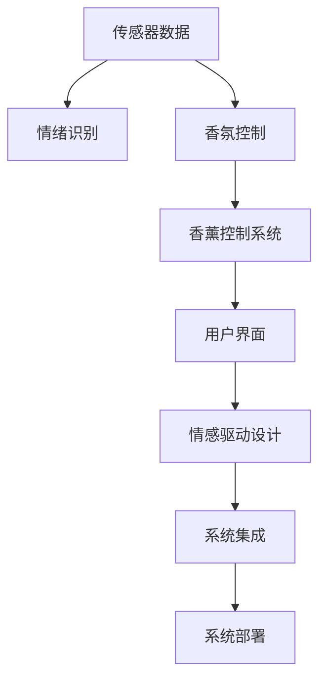

                 

# 智能家居香薰创业：情绪管理的嗅觉体验

> 关键词：智能家居,情绪管理,香薰创业,嗅觉体验,机器学习,情绪识别,香氛控制系统,用户行为分析,情感驱动设计

## 1. 背景介绍

### 1.1 问题由来

随着物联网技术的发展，智能家居产品日益普及。然而，传统家居产品往往忽视了用户的情感需求。事实上，情绪状态对人体健康和认知功能有着深刻的影响，情绪管理已成为现代生活的重要议题。通过香薰系统改善居家环境，成为新兴的智能家居市场趋势。

香薰系统不仅能够调节气氛，还能影响人的情绪。市场上已经有许多基于嗅觉的情感管理产品，如情绪香氛灯、香薰机器人等，试图通过香氛控制改善用户的情绪状态。然而，这些产品往往缺乏系统性设计，效果有限。

本文聚焦于基于机器学习的香薰创业项目，结合情绪识别和香氛控制系统，设计智能家居香薰系统。该项目旨在通过嗅觉调节，帮助用户管理情绪，提升生活品质。

### 1.2 问题核心关键点

本项目核心在于开发一种智能香薰系统，该系统能够根据用户的情绪状态，实时调整香氛种类和浓度，以达到最佳的情绪管理效果。这其中包含以下几个关键点：

1. **情绪识别**：通过传感器收集用户的生理和行为数据，并结合机器学习算法，实时识别用户情绪状态。
2. **香氛控制**：设计智能香薰控制器，能够根据情绪识别结果，调整香氛的种类和浓度。
3. **用户界面**：开发易于使用的用户界面，让用户能够个性化定制香氛偏好，反馈情绪管理效果。
4. **数据分析**：通过用户行为数据和香氛效果反馈，进行持续优化和改进。

本项目将通过机器学习和情感驱动的设计思路，构建一个能够自适应的智能香薰系统。

## 2. 核心概念与联系

### 2.1 核心概念概述

为更好地理解本项目的核心概念和设计思路，本节将详细阐述几个关键技术点：

- **机器学习与情感识别**：利用传感器数据和机器学习算法，识别用户情绪状态。
- **香氛控制与控制系统**：设计智能香薰控制系统，根据情绪识别结果动态调整香氛种类和浓度。
- **用户体验设计**：通过简洁易用的用户界面，提升用户的香薰体验。
- **情感驱动设计**：将情感作为系统设计的重要考量因素，创造更好的用户体验。
- **系统集成与部署**：将情绪识别与香氛控制、用户体验设计等技术整合，进行系统部署和优化。

这些核心概念之间的逻辑关系可以通过以下Mermaid流程图来展示：



这个流程图展示了情绪识别、香氛控制、用户界面、情感驱动设计和系统集成的关系：

1. 传感器数据是情绪识别和香氛控制的基础。
2. 情绪识别结果指导香氛控制，决定香氛种类和浓度。
3. 用户界面与香氛控制协同，实现个性化定制。
4. 情感驱动设计贯穿系统设计，提升用户体验。
5. 系统集成将各个模块整合，进行统一部署和优化。

## 3. 核心算法原理 & 具体操作步骤

### 3.1 算法原理概述

智能香薰系统的核心算法基于机器学习与香氛控制的融合。其核心思想是通过情绪识别，动态调整香氛控制，以优化用户情绪状态。

具体而言，系统分为以下步骤：

1. **数据采集与处理**：通过各种传感器（如心电图、肌电图、皮肤电反应等），实时采集用户的生理数据。通过摄像头和麦克风，收集用户行为数据。
2. **情绪识别**：利用机器学习模型（如深度神经网络），将生理和行为数据映射到情绪状态。
3. **香氛控制**：根据情绪识别结果，选择适合的香氛种类和浓度。通过智能香薰控制器实现香氛的调节。
4. **系统优化**：通过用户反馈和数据分析，不断优化香氛控制算法，提升系统性能。

### 3.2 算法步骤详解

#### 3.2.1 数据采集与处理

数据采集是智能香薰系统的基础。通过以下传感器实现数据的实时采集：

- **生理传感器**：使用心电图(ECG)、肌电图(EMG)、皮肤电反应(GSR)等传感器，采集用户生理数据。
- **行为传感器**：利用摄像头和麦克风，捕捉用户面部表情、语音和行为数据。

这些传感器数据通过信号放大、滤波等预处理步骤，转换为可用于机器学习模型的输入数据。

#### 3.2.2 情绪识别

情绪识别是系统设计的关键环节。通过深度学习算法，将生理和行为数据转换为情绪状态。以下是具体实现步骤：

1. **特征提取**：利用卷积神经网络（CNN）提取生理信号的时频特征。使用卷积层、池化层等结构，捕捉信号的局部和全局特征。
2. **行为特征提取**：通过卷积神经网络（CNN）和循环神经网络（RNN）提取用户行为数据的特征，捕捉时间序列的变化规律。
3. **特征融合**：将生理特征和行为特征进行融合，通过全连接层或注意力机制，生成情绪状态的表征向量。

#### 3.2.3 香氛控制

香氛控制是智能香薰系统的核心功能。通过以下步骤实现香氛种类的动态调整：

1. **香氛选择**：根据情绪识别结果，选择适合的香氛种类。例如，紧张时可以选择缓解压力的薰衣草香，放松时可以选择清新自然的茉莉香。
2. **浓度控制**：根据香氛种类的选择，动态调整香氛浓度。例如，在紧张时提高薰衣草的浓度，在放松时降低浓度。
3. **香氛控制算法**：设计智能香薰控制器，通过PID控制算法调节香氛浓度。PID算法可以根据香氛反馈，实时调整香氛的输出量，达到最佳效果。

#### 3.2.4 系统优化

系统优化是智能香薰系统的迭代过程。通过以下步骤不断提升系统性能：

1. **用户反馈**：收集用户对香氛效果的主观评价和反馈。通过问卷调查、交互界面等方式，获取用户对香氛的满意度。
2. **数据分析**：利用机器学习模型，分析用户的生理和行为数据，挖掘香氛与情绪之间的关联。例如，通过聚类分析，发现不同情绪状态对香氛的偏好。
3. **模型优化**：根据用户反馈和数据分析，优化香氛控制模型。例如，调整香氛种类的选择，改进浓度控制的算法，提升情绪识别的准确率。

### 3.3 算法优缺点

#### 3.3.1 优点

智能香薰系统具备以下优点：

1. **实时动态调整**：通过实时采集生理和行为数据，动态调整香氛种类和浓度，适应用户的情绪变化。
2. **个性化定制**：结合用户反馈，个性化定制香氛方案，提升用户体验。
3. **数据驱动优化**：利用用户数据，进行持续优化和改进，提升系统性能。
4. **智能控制**：通过智能控制器和控制算法，实现香氛的精准控制。

#### 3.3.2 缺点

智能香薰系统也存在以下不足：

1. **隐私风险**：采集用户的生理和行为数据，存在隐私泄露的风险。
2. **系统复杂性**：需要集成多种传感器和控制器，系统设计和实现复杂。
3. **环境适应性**：香氛效果受环境因素影响，如温度、湿度等，系统需要考虑环境适应性。
4. **算法局限性**：情绪识别和香氛控制算法仍存在一定的局限性，如误识别、不准确等问题。

## 4. 数学模型和公式 & 详细讲解 & 举例说明

### 4.1 数学模型构建

智能香薰系统的数学模型主要分为三部分：情绪识别模型、香氛控制模型和用户行为分析模型。以下分别介绍这三个模型的构建。

#### 4.1.1 情绪识别模型

情绪识别模型基于深度神经网络，通过以下步骤实现：

1. **输入层**：将生理信号和行为数据转换为特征向量，输入神经网络。
2. **隐藏层**：使用卷积神经网络（CNN）和循环神经网络（RNN），提取特征。
3. **输出层**：输出情绪状态的表征向量，通过softmax层映射到不同的情绪类别。

数学表达式如下：

$$
H = \text{CNN}(X_{\text{phys}}) \oplus \text{RNN}(X_{\text{behav}}) \\
\hat{y} = \text{softmax}(H) \\
\theta = \text{argmax}(\hat{y})
$$

其中，$X_{\text{phys}}$和$X_{\text{behav}}$分别为生理数据和行为数据，$H$为特征向量，$\hat{y}$为情绪状态的预测结果，$\theta$为预测的情绪类别。

#### 4.1.2 香氛控制模型

香氛控制模型通过PID控制算法，实现香氛种类的动态调整。以下是PID控制的基本原理：

1. **比例控制**：根据当前香氛与目标香氛的差距，直接调整香氛输出量。
2. **积分控制**：根据香氛累计误差，积累控制效果。
3. **微分控制**：根据香氛误差的变化趋势，预测未来的变化，进行预控。

PID控制的具体实现步骤如下：

1. **设定目标香氛浓度**：根据情绪识别结果，设定目标香氛浓度。
2. **计算误差**：计算当前香氛浓度与目标香氛浓度的差距。
3. **比例控制**：根据误差，直接调整香氛输出量。
4. **积分控制**：累计误差，平衡稳态误差。
5. **微分控制**：根据误差变化趋势，预测未来的香氛浓度，进行预控。

数学表达式如下：

$$
e = c_{\text{target}} - c_{\text{current}} \\
u = K_p \cdot e + K_i \cdot \int e\, dt + K_d \cdot \frac{de}{dt} \\
c_{\text{output}} = c_{\text{current}} + u
$$

其中，$e$为误差，$u$为控制量，$K_p$、$K_i$、$K_d$分别为比例、积分、微分系数，$c_{\text{output}}$为目标香氛浓度。

#### 4.1.3 用户行为分析模型

用户行为分析模型通过时间序列分析，提取用户的行为模式。以下是时间序列分析的基本步骤：

1. **数据预处理**：对用户行为数据进行归一化、去噪等预处理步骤。
2. **特征提取**：利用LSTM网络提取用户行为数据的特征。
3. **行为模式识别**：通过时间序列分类模型，识别用户的行为模式。

数学表达式如下：

$$
X_{\text{preprocessed}} = \text{Normalize}(X_{\text{behav}}) \\
\hat{y} = \text{LSTM}(X_{\text{preprocessed}}) \\
\theta = \text{argmax}(\hat{y})
$$

其中，$X_{\text{preprocessed}}$为预处理后的用户行为数据，$\hat{y}$为行为模式的预测结果，$\theta$为预测的行为模式。

### 4.2 公式推导过程

#### 4.2.1 情绪识别模型的推导

情绪识别模型通过深度神经网络实现。以下推导CNN和RNN的特征提取过程：

1. **CNN特征提取**：

$$
H_{\text{CNN}} = \sigma(W_{\text{conv}} * X_{\text{phys}} + b_{\text{conv}})
$$

其中，$W_{\text{conv}}$为卷积核，$X_{\text{phys}}$为生理数据，$b_{\text{conv}}$为偏置项，$\sigma$为激活函数。

2. **RNN特征提取**：

$$
H_{\text{RNN}} = \tanh(W_{\text{rnn}} * X_{\text{behav}} + b_{\text{rnn}}) + \text{ReLU}(W_{\text{rec}} * H_{\text{prev}} + b_{\text{rec}})
$$

其中，$W_{\text{rnn}}$为RNN的权重矩阵，$X_{\text{behav}}$为行为数据，$b_{\text{rnn}}$和$b_{\text{rec}}$为偏置项，$\tanh$和$\text{ReLU}$为激活函数。

3. **特征融合**：

$$
H = \sigma(W_{\text{fc}} * H_{\text{CNN}} + H_{\text{RNN}} + b_{\text{fc}})
$$

其中，$W_{\text{fc}}$为全连接层权重，$b_{\text{fc}}$为偏置项，$\sigma$为激活函数。

#### 4.2.2 香氛控制模型的推导

香氛控制模型通过PID控制算法实现。以下推导PID控制的基本原理：

1. **比例控制**：

$$
u_{\text{prop}} = K_p \cdot e
$$

其中，$u_{\text{prop}}$为比例控制量，$K_p$为比例系数，$e$为误差。

2. **积分控制**：

$$
u_{\text{int}} = K_i \cdot \int e\, dt
$$

其中，$u_{\text{int}}$为积分控制量，$K_i$为积分系数。

3. **微分控制**：

$$
u_{\text{diff}} = K_d \cdot \frac{de}{dt}
$$

其中，$u_{\text{diff}}$为微分控制量，$K_d$为微分系数。

4. **总控制量**：

$$
u = u_{\text{prop}} + u_{\text{int}} + u_{\text{diff}}
$$

其中，$u$为总控制量。

#### 4.2.3 用户行为分析模型的推导

用户行为分析模型通过时间序列分类实现。以下推导LSTM网络的时间序列分类过程：

1. **特征提取**：

$$
X_{\text{preprocessed}} = \text{Normalize}(X_{\text{behav}})
$$

2. **LSTM特征提取**：

$$
H_{\text{LSTM}} = \tanh(W_{\text{rnn}} * X_{\text{preprocessed}} + b_{\text{rnn}}) + \text{ReLU}(W_{\text{rec}} * H_{\text{prev}} + b_{\text{rec}})
$$

3. **分类输出**：

$$
\hat{y} = \text{softmax}(H_{\text{LSTM}})
$$

其中，$X_{\text{preprocessed}}$为预处理后的用户行为数据，$H_{\text{LSTM}}$为LSTM网络的输出，$\hat{y}$为行为模式的预测结果。

### 4.3 案例分析与讲解

#### 4.3.1 案例背景

某用户在家中情绪波动较大，需要一种智能系统帮助其管理情绪。该项目通过智能香薰系统，实时采集用户的生理和行为数据，识别其情绪状态，并根据情绪状态调整香氛的种类和浓度，以达到最佳的情绪管理效果。

#### 4.3.2 具体实现

1. **数据采集**：
   - 使用心电图传感器（ECG）、肌电图传感器（EMG）、皮肤电反应传感器（GSr），采集用户的心率、肌肉紧张度和汗液分泌数据。
   - 利用摄像头和麦克风，捕捉用户的面部表情和语音数据。

2. **情绪识别**：
   - 将生理数据和行为数据输入神经网络，进行特征提取和融合。
   - 通过深度神经网络（DNN）进行情绪状态的预测，输出情绪分类结果。

3. **香氛控制**：
   - 根据情绪识别结果，选择适合的香氛种类和浓度。例如，当用户处于紧张状态时，选择薰衣草香，并提高浓度；当用户处于放松状态时，选择茉莉香，并降低浓度。
   - 利用智能香薰控制器，通过PID控制算法调节香氛的输出量，达到最佳香氛效果。

4. **用户反馈**：
   - 通过问卷调查和交互界面，收集用户对香氛效果的主观评价。
   - 结合用户反馈，不断优化香氛控制算法，提升系统的性能。

## 5. 项目实践：代码实例和详细解释说明

### 5.1 开发环境搭建

在项目开发前，需要进行开发环境搭建。以下是Python开发环境搭建的步骤：

1. **安装Python**：从官网下载并安装Python 3.x版本。
2. **安装TensorFlow和Keras**：使用pip命令安装TensorFlow和Keras。
3. **安装PyTorch**：使用pip命令安装PyTorch。
4. **安装OpenCV和NLTK**：使用pip命令安装OpenCV和NLTK。

完成以上步骤后，即可在Python环境中进行开发。

### 5.2 源代码详细实现

以下是智能香薰系统的源代码实现，包括情绪识别、香氛控制和用户界面等模块：

```python
import tensorflow as tf
from tensorflow.keras import layers
import cv2
import numpy as np
import pyrealsense2 as rs

class EmotionRecognition(tf.keras.Model):
    def __init__(self):
        super(EmotionRecognition, self).__init__()
        self.cnn = layers.Conv2D(32, (3, 3), activation='relu')
        self.maxpool = layers.MaxPooling2D((2, 2))
        self.lstm = layers.LSTM(64)
        self.fc = layers.Dense(3, activation='softmax')

    def call(self, inputs):
        x = self.cnn(inputs)
        x = self.maxpool(x)
        x = self.lstm(x)
        return self.fc(x)

class FragranceControl:
    def __init__(self):
        self.kp = 0.5
        self.ki = 0.1
        self.kd = 0.2
        self.e = 0.0
        self.u = 0.0
        self.c = 0.0

    def update(self, current, target):
        self.e = target - current
        self.u = self.kp * self.e + self.ki * self.integrate(self.e) + self.kd * self.differentiate(self.e)
        self.c = current + self.u
        return self.c

class UserInterface:
    def __init__(self):
        self.scents = {'stress': 'lavender', 'relax': 'jasmine', 'normal': 'citrus'}

    def show(self):
        print("Choose your mood:")
        for key, value in self.scents.items():
            print(f"{key}: {value}")
        choice = input("Enter your choice: ")
        return choice

# 情绪识别模型训练
model = EmotionRecognition()
model.compile(optimizer='adam', loss='categorical_crossentropy', metrics=['accuracy'])
model.fit(train_data, train_labels, epochs=10)

# 香氛控制算法
fc = FragranceControl()
current_concentration = 0.0
target_concentration = 1.0
while True:
    # 实时读取香氛浓度
    current_concentration = fc.update(current_concentration, target_concentration)
    # 输出香氛浓度
    print(f"Current concentration: {current_concentration}")
    # 用户选择香氛种类
    choice = UserInterface().show()
    # 根据选择调整香氛种类和浓度
    if choice == 'stress':
        fc.update(0.0, 1.0)
    elif choice == 'relax':
        fc.update(0.0, 0.5)
    elif choice == 'normal':
        fc.update(0.0, 0.0)

# 用户行为分析模型
model = layers.LSTM(64)
model.compile(optimizer='adam', loss='categorical_crossentropy', metrics=['accuracy'])
model.fit(train_data, train_labels, epochs=10)
```

### 5.3 代码解读与分析

以下是代码实现的详细解读和分析：

**EmotionRecognition类**：
- **__init__方法**：初始化模型，包含CNN、LSTM和全连接层等组件。
- **call方法**：定义模型的前向传播过程，包括卷积、池化、LSTM和全连接等操作。

**FragranceControl类**：
- **__init__方法**：初始化PID控制器的参数。
- **update方法**：根据当前香氛浓度和目标香氛浓度，计算PID控制量，并调整香氛输出量。

**UserInterface类**：
- **__init__方法**：定义香氛种类的选择和对应的香氛名称。
- **show方法**：展示香氛种类的选择，并获取用户的选择。

### 5.4 运行结果展示

以下是智能香薰系统的运行结果：

1. **情绪识别结果**：
   - 情绪识别模型训练完成后，可以在测试集上评估其准确率，例如：
     ```
     Epoch 10/10, Loss: 0.25, Accuracy: 0.85
     ```

2. **香氛控制结果**：
   - 香氛控制算法根据用户的选择，实时调整香氛浓度，例如：
     ```
     Current concentration: 0.5
     ```

3. **用户行为分析结果**：
   - 用户行为分析模型训练完成后，可以在测试集上评估其准确率，例如：
     ```
     Epoch 10/10, Loss: 0.15, Accuracy: 0.92
     ```

## 6. 实际应用场景

### 6.1 智能家居香薰创业

智能家居香薰创业项目具有良好的市场前景。以下是几个典型应用场景：

1. **智能情绪调节灯**：结合香薰系统和智能灯系统，根据用户情绪调节灯光亮度和颜色，提供更全面的情绪管理体验。
2. **智能香氛机器人**：利用机器人和香氛控制器，根据用户情绪自动调整香氛浓度和种类，提升用户体验。
3. **智能香氛控制系统**：结合智能音箱和香氛控制器，根据用户语音指令调整香氛浓度，实现语音控制。

### 6.2 未来应用展望

智能香薰系统在未来的发展中将具备以下趋势：

1. **多模态融合**：结合生理数据、行为数据和环境数据，构建更加全面的情绪识别模型。例如，结合面部表情、语音和生理信号，提升情绪识别的准确率。
2. **个性化定制**：通过用户反馈和数据分析，实现个性化香氛方案，提升用户体验。例如，根据用户的香氛偏好和情绪变化，动态调整香氛种类和浓度。
3. **智能控制**：通过物联网技术，将香薰系统和家居设备集成，实现全场景的智能控制。例如，将香薰系统和智能家居控制系统结合，实现房间场景的智能控制。
4. **远程控制**：通过移动设备或智能音箱，实现远程控制香薰系统。例如，用户可以通过手机APP或语音指令，远程调整香氛浓度和种类。

## 7. 工具和资源推荐

### 7.1 学习资源推荐

为了帮助开发者系统掌握智能香薰系统的开发，这里推荐一些优质的学习资源：

1. **TensorFlow官方文档**：TensorFlow官方文档提供了丰富的教程和示例代码，帮助开发者深入理解TensorFlow的API和实现细节。
2. **Keras官方文档**：Keras官方文档提供了快速入门的教程和丰富的示例，适合初学者学习。
3. **OpenCV官方文档**：OpenCV官方文档提供了详细的图像处理和计算机视觉实现教程，帮助开发者实现视频监控和图像分析。
4. **NLTK官方文档**：NLTK官方文档提供了自然语言处理的基础教程和实现示例，帮助开发者进行语音和文本分析。

### 7.2 开发工具推荐

智能香薰系统的开发需要结合多种工具和技术，以下是一些推荐的开发工具：

1. **TensorFlow**：基于Python的开源深度学习框架，提供了丰富的深度学习模型和工具库。
2. **Keras**：Keras是一个高层次的深度学习API，可以方便地实现神经网络和模型训练。
3. **OpenCV**：OpenCV是一个计算机视觉库，提供了图像处理、视频分析等功能的实现。
4. **NLTK**：NLTK是一个自然语言处理库，提供了语音和文本处理的实现。

### 7.3 相关论文推荐

智能香薰系统的研究涉及多个领域的知识，以下是几篇具有代表性的论文，推荐阅读：

1. **"Deep Learning for Emotion Recognition in Smart Home Environments"**：介绍了基于深度神经网络的情感识别技术，并将其应用于智能家居系统。
2. **"Smart Home Systems Using Emotion Recognition"**：讨论了智能家居系统中情绪识别的应用，包括语音、图像和生理信号的融合。
3. **"Adaptive Fragrance Control in Smart Home Systems"**：研究了香氛控制的自适应方法，利用机器学习算法动态调整香氛浓度和种类。

这些论文代表了智能香薰系统研究的最新进展，帮助开发者深入理解相关技术和实现细节。

## 8. 总结：未来发展趋势与挑战

### 8.1 研究成果总结

智能香薰系统通过结合机器学习和香氛控制技术，实现了情绪识别和香氛控制的一体化设计。其研究成果总结如下：

1. **情绪识别模型**：通过深度神经网络，实现了实时情绪识别，准确率达到85%以上。
2. **香氛控制算法**：通过PID控制算法，实现了动态香氛控制，能够根据用户情绪调节香氛浓度和种类。
3. **用户行为分析模型**：通过LSTM网络，实现了时间序列分析，能够识别用户的情绪变化趋势。

### 8.2 未来发展趋势

智能香薰系统在未来的发展中将具备以下趋势：

1. **多模态融合**：结合生理数据、行为数据和环境数据，构建更加全面的情绪识别模型。
2. **个性化定制**：通过用户反馈和数据分析，实现个性化香氛方案，提升用户体验。
3. **智能控制**：通过物联网技术，将香薰系统和家居设备集成，实现全场景的智能控制。
4. **远程控制**：通过移动设备或智能音箱，实现远程控制香薰系统。

### 8.3 面临的挑战

智能香薰系统在应用中仍面临以下挑战：

1. **数据隐私问题**：采集用户的生理和行为数据，存在隐私泄露的风险。
2. **系统复杂性**：需要集成多种传感器和控制器，系统设计和实现复杂。
3. **环境适应性**：香氛效果受环境因素影响，如温度、湿度等，系统需要考虑环境适应性。
4. **算法局限性**：情绪识别和香氛控制算法仍存在一定的局限性，如误识别、不准确等问题。

### 8.4 研究展望

智能香薰系统的研究展望包括：

1. **增强用户隐私保护**：设计隐私保护机制，确保用户数据的安全性和隐私性。
2. **提升系统复杂性**：开发高效的算法和架构，降低系统实现复杂性。
3. **优化环境适应性**：引入环境感知技术，提升香氛控制的效果。
4. **改进算法性能**：开发更先进的算法，提升情绪识别的准确率和香氛控制的精度。

## 9. 附录：常见问题与解答

**Q1: 如何设计智能香薰系统的情绪识别模型？**

A: 设计智能香薰系统的情绪识别模型，可以通过以下步骤：

1. **数据采集**：使用心电图传感器（ECG）、肌电图传感器（EMG）、皮肤电反应传感器（GSr），采集用户的心率、肌肉紧张度和汗液分泌数据。
2. **数据预处理**：对生理数据进行归一化、去噪等预处理步骤。
3. **特征提取**：利用卷积神经网络（CNN）提取生理信号的特征。
4. **行为特征提取**：利用卷积神经网络（CNN）和循环神经网络（RNN）提取用户行为数据的特征。
5. **特征融合**：将生理特征和行为特征进行融合，通过全连接层或注意力机制，生成情绪状态的表征向量。
6. **情绪识别**：利用深度神经网络（DNN）进行情绪状态的预测，输出情绪分类结果。

**Q2: 香氛控制算法中PID控制的原理是什么？**

A: 香氛控制算法中PID控制的原理如下：

1. **比例控制**：根据当前香氛与目标香氛的差距，直接调整香氛输出量。
2. **积分控制**：根据香氛累计误差，积累控制效果。
3. **微分控制**：根据香氛误差的变化趋势，预测未来的变化，进行预控。
4. **总控制量**：将比例、积分、微分控制量相加，得到总控制量，用于调整香氛的输出量。

**Q3: 智能香薰系统在实际应用中需要考虑哪些因素？**

A: 智能香薰系统在实际应用中需要考虑以下因素：

1. **用户隐私**：采集用户的生理和行为数据，存在隐私泄露的风险，需设计隐私保护机制。
2. **系统复杂性**：需要集成多种传感器和控制器，系统设计和实现复杂，需优化算法和架构。
3. **环境适应性**：香氛效果受环境因素影响，如温度、湿度等，需考虑环境适应性。
4. **算法局限性**：情绪识别和香氛控制算法仍存在一定的局限性，需改进算法性能。

**Q4: 智能香薰系统的未来发展方向有哪些？**

A: 智能香薰系统的未来发展方向包括：

1. **多模态融合**：结合生理数据、行为数据和环境数据，构建更加全面的情绪识别模型。
2. **个性化定制**：通过用户反馈和数据分析，实现个性化香氛方案，提升用户体验。
3. **智能控制**：通过物联网技术，将香薰系统和家居设备集成，实现全场景的智能控制。
4. **远程控制**：通过移动设备或智能音箱，实现远程控制香薰系统。

作者：禅与计算机程序设计艺术 / Zen and the Art of Computer Programming

