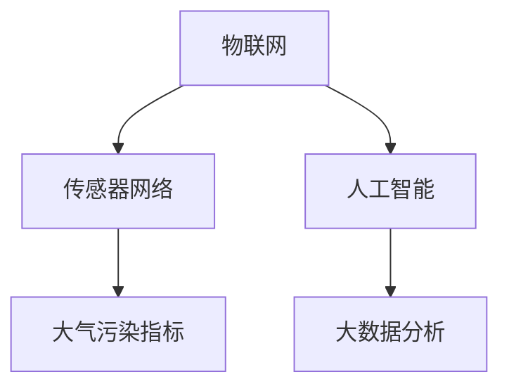

                 

# 智能空气质量监测创业：健康呼吸的守护者

## 1. 背景介绍

随着城市化进程的加快，空气质量问题日益成为全球关注的焦点。传统环境监测手段往往依赖人力、物力投入，监测效率低下且成本较高。而基于物联网和大数据分析的智能空气质量监测系统，则能以更低成本、更高效率实现环境监测，有效解决上述问题。智能空气质量监测系统不仅可以实时监测空气质量指标，还能预测未来趋势，及时发出预警，为城市环境治理提供强有力的技术支撑。

本项目致力于开发一款基于物联网和人工智能的智能空气质量监测系统，通过构建云端数据分析平台和移动端应用，为公众提供实时空气质量信息和健康指导。该项目结合了物联网、传感器网络、人工智能和大数据分析技术，力求打造一个功能全面、操作便捷、维护简易、成本低廉的智能空气质量监测解决方案。

## 2. 核心概念与联系

### 2.1 核心概念概述

为更好理解智能空气质量监测系统，本节将介绍几个密切相关的核心概念：

- 物联网(IoT)：通过互联网将各类终端设备连接起来，实现数据的采集、传输和处理，具有低成本、高效率、智能化等优势。
- 传感器网络(Sensor Network)：由大量传感器节点组成的网络，用于监测环境、工业等领域的各项指标。
- 大气污染指标：如PM2.5、PM10、SO2、NOx、O3、CO等，反映了空气质量的主要污染因子。
- 人工智能(AI)：以机器学习和深度学习为代表的智能算法，用于数据分析、模式识别、预测等任务。
- 大数据分析：处理和分析大规模数据集，提取有价值的信息和知识，支持决策。

这些核心概念之间的逻辑关系可以通过以下Mermaid流程图来展示：



这个流程图展示出智能空气质量监测系统的数据流和逻辑关系：

1. 物联网和传感器网络采集实时环境数据，用于监测大气污染指标。
2. 人工智能技术用于数据预处理、特征提取和模型训练，以支持数据分析和预测。
3. 大分析技术对处理后的数据进行综合分析，产生有价值的信息和知识，辅助决策。

这些核心概念共同构成了智能空气质量监测系统的技术基础，使其能够高效、准确地监测和预测空气质量，为环境治理提供支持。

## 3. 核心算法原理 & 具体操作步骤

### 3.1 算法原理概述

智能空气质量监测系统利用物联网和传感器网络，实时采集环境数据。通过人工智能和大数据分析，对这些数据进行处理和分析，以实现空气质量监测和预警。具体而言，系统包括以下几个关键步骤：

1. **数据采集**：通过传感器网络采集空气中的PM2.5、PM10、SO2、NOx、O3、CO等污染指标。
2. **数据预处理**：对采集的数据进行清洗、转换、归一化等预处理操作。
3. **特征提取**：从预处理后的数据中提取关键特征，如时间序列、空间分布等。
4. **模型训练**：使用机器学习算法（如回归、分类、时序预测等）训练模型，以识别和预测空气质量。
5. **数据分析**：对模型输出结果进行统计分析，生成可视化报表和预警信息。
6. **决策支持**：根据分析结果，提出相应的政策建议或预警，支持环境决策。

### 3.2 算法步骤详解

#### 数据采集

数据采集是智能空气质量监测系统的基础环节。传感器网络由多个传感器节点组成，分布在城市的关键位置，如城市中心、工业园区、交通枢纽等。每个传感器节点可以监测多种污染指标，并实时发送数据到云端服务器。

传感器网络采用LoRaWAN、NB-IoT、GPRS等多种通信协议，以适应不同的环境需求。LoRaWAN适用于远距离、低功耗的传感网络，适合城市边缘区域的部署。NB-IoT适合高密度、低功耗的城市区域，适合城市中心区域的部署。GPRS适合紧急情况下的通信，适合关键区域的备份。

#### 数据预处理

数据预处理是对采集的数据进行清洗、转换、归一化等预处理操作，以确保数据的准确性和一致性。预处理步骤包括：

1. 数据清洗：去除异常值、噪声等无效数据，保证数据的准确性。
2. 数据转换：将传感器数据转换为标准单位，如将PM2.5转换为微克每立方米。
3. 数据归一化：将不同尺度的数据统一到0-1之间，便于后续的模型处理。

预处理过程可以使用Python的Pandas、NumPy等工具库，实现数据的批量处理。例如：

```python
import pandas as pd
import numpy as np

# 读取原始数据
df = pd.read_csv('raw_data.csv')

# 数据清洗
df = df.dropna()  # 去除缺失值
df = df.drop_duplicates()  # 去除重复值

# 数据转换
df['PM2.5'] = df['PM2.5'] / 1000  # 将PM2.5转换为微克每立方米

# 数据归一化
df = (df - df.mean()) / df.std()
```

#### 特征提取

特征提取是从预处理后的数据中提取关键特征，用于训练模型。特征提取方法包括时间序列分析、空间分布分析等。

时间序列分析用于处理时间戳数据，常用的方法包括滑动窗口、滚动平均等。空间分布分析用于处理地理位置数据，常用的方法包括地理围栏、热点区域等。

特征提取过程可以使用Python的SciPy、NumPy等工具库，实现数据的特征提取和转换。例如：

```python
import scipy.signal

# 时间序列分析
df['PM2.5'] = scipy.signal.savgol_filter(df['PM2.5'], 11, 3)  # 使用滑动窗口平均

# 空间分布分析
df['longitude'], df['latitude'] = zip(*df[['longitude', 'latitude']])  # 提取经纬度
```

#### 模型训练

模型训练是智能空气质量监测系统的核心环节。训练过程使用机器学习算法，如回归、分类、时序预测等，以识别和预测空气质量。常用的算法包括随机森林、梯度提升树、LSTM等。

以回归模型为例，模型训练过程如下：

1. 数据划分：将数据集划分为训练集、验证集和测试集。
2. 特征选择：从预处理后的数据中选择关键特征，构建特征向量。
3. 模型训练：使用训练集数据训练模型，优化模型参数。
4. 模型评估：使用验证集数据评估模型性能，防止过拟合。
5. 模型测试：使用测试集数据测试模型性能，生成最终结果。

模型训练过程可以使用Python的Scikit-Learn、TensorFlow等工具库，实现模型的训练和评估。例如：

```python
from sklearn.linear_model import LinearRegression
from sklearn.metrics import mean_squared_error

# 数据划分
train_df, valid_df, test_df = train_test_split(df, test_size=0.2, random_state=42)

# 特征选择
X_train = train_df[['temperature', 'humidity', 'PM2.5']]  # 选择关键特征
y_train = train_df['PM10']  # 目标变量

# 模型训练
model = LinearRegression()
model.fit(X_train, y_train)

# 模型评估
y_valid_pred = model.predict(valid_df[['temperature', 'humidity', 'PM2.5']])
mse = mean_squared_error(valid_df['PM10'], y_valid_pred)
print('Mean Squared Error:', mse)

# 模型测试
y_test_pred = model.predict(test_df[['temperature', 'humidity', 'PM2.5']])
mse_test = mean_squared_error(test_df['PM10'], y_test_pred)
print('Test Mean Squared Error:', mse_test)
```

#### 数据分析

数据分析是对模型输出结果进行统计分析，生成可视化报表和预警信息。数据分析过程可以使用Python的Matplotlib、Seaborn等工具库，实现数据的可视化展示。

数据分析过程包括：

1. 数据统计：统计模型的输出结果，生成统计报表。
2. 数据可视化：将统计结果可视化展示，便于决策。
3. 预警信息：根据统计结果，生成预警信息，支持环境决策。

数据分析过程如下：

```python
import matplotlib.pyplot as plt
import seaborn as sns

# 数据统计
mean_pm10 = df['PM10'].mean()
std_pm10 = df['PM10'].std()

# 数据可视化
sns.histplot(df['PM10'], bins=30)
plt.title('PM10 Distribution')
plt.xlabel('PM10 (µg/m³)')
plt.ylabel('Frequency')
plt.show()

# 预警信息
if mean_pm10 > 35:
    print('High PM10 level detected! Take protective measures.')
```

#### 决策支持

决策支持是根据分析结果，提出相应的政策建议或预警，支持环境决策。决策支持过程可以使用Python的决策树、规则引擎等工具库，实现决策支持系统的构建。

决策支持过程如下：

1. 决策规则：根据环境指标，制定决策规则。
2. 规则匹配：根据实时监测数据，匹配决策规则。
3. 预警信息：根据决策规则，生成预警信息，支持环境决策。

决策支持过程如下：

```python
import decision_tree

# 决策规则
rules = {
    'PM2.5_high': lambda x: x > 50,
    'PM10_high': lambda x: x > 35,
    'O3_high': lambda x: x > 50
}

# 规则匹配
pm2_5_high = rules['PM2.5_high'](df['PM2.5'].iloc[-1])
pm10_high = rules['PM10_high'](df['PM10'].iloc[-1])
o3_high = rules['O3_high'](df['O3'].iloc[-1])

# 预警信息
if pm2_5_high:
    print('High PM2.5 level detected! Take protective measures.')
if pm10_high:
    print('High PM10 level detected! Take protective measures.')
if o3_high:
    print('High O3 level detected! Take protective measures.')
```

### 3.3 算法优缺点

智能空气质量监测系统的算法具有以下优点：

1. 高效性：通过物联网和传感器网络，实时采集环境数据，数据传输速度快，响应时间短。
2. 准确性：使用机器学习算法进行数据分析和预测，模型准确度高。
3. 灵活性：可以根据实际需求，选择不同的算法和特征，实现灵活的模型构建。
4. 可扩展性：系统具有高度的可扩展性，可以方便地增加新的传感器和算法。

同时，智能空气质量监测系统也存在以下缺点：

1. 数据质量：传感器网络采集的数据存在噪声和误差，需要经过预处理和清洗。
2. 算法复杂性：模型训练和数据分析过程较为复杂，需要较高的技术门槛。
3. 维护成本：系统需要定期维护和升级，维护成本较高。
4. 隐私问题：传感器网络采集的数据涉及个人隐私，需要采取有效的隐私保护措施。

### 3.4 算法应用领域

智能空气质量监测系统的算法可以应用于以下领域：

1. 环境监测：监测空气、水质、土壤等环境指标，为环境治理提供支持。
2. 公共卫生：监测空气污染物浓度，为公共卫生决策提供依据。
3. 智能交通：监测道路交通流量、空气污染，为智能交通管理提供支持。
4. 智慧城市：监测城市环境质量，为智慧城市建设提供支持。
5. 灾害预警：监测自然灾害预警指标，为灾害预警提供支持。

## 4. 数学模型和公式 & 详细讲解  
### 4.1 数学模型构建

智能空气质量监测系统利用回归模型对空气质量进行预测。假设空气质量指标 $Y$ 与环境参数 $X$ 之间的关系可以表示为：

$$
Y = \beta_0 + \beta_1 X_1 + \beta_2 X_2 + ... + \beta_k X_k + \epsilon
$$

其中，$Y$ 为空气质量指标，$X_i$ 为环境参数，$\beta_i$ 为回归系数，$\epsilon$ 为误差项。

根据上述模型，智能空气质量监测系统可以建立如下数学模型：

1. 数据划分：将数据集划分为训练集、验证集和测试集。
2. 特征选择：从预处理后的数据中选择关键特征，构建特征向量。
3. 模型训练：使用训练集数据训练回归模型，优化模型参数。
4. 模型评估：使用验证集数据评估模型性能，防止过拟合。
5. 模型测试：使用测试集数据测试模型性能，生成最终结果。

### 4.2 公式推导过程

以线性回归模型为例，模型训练过程如下：

1. 数据划分
$$
\{(x_i, y_i)\}_{i=1}^N \rightarrow \{(x_{train}, y_{train})\}_{i=1}^{N_{train}} \cup \{(x_{valid}, y_{valid})\}_{i=1}^{N_{valid}} \cup \{(x_{test}, y_{test})\}_{i=1}^{N_{test}}
$$

2. 特征选择
$$
X = [x_1, x_2, ..., x_k] \rightarrow X_{train} = [x_{train}_1, x_{train}_2, ..., x_{train}_k]
$$

3. 模型训练
$$
\theta = (b_0, b_1, ..., b_k) = \mathop{\arg\min}_{\theta} \sum_{i=1}^{N_{train}} (y_{train} - \theta^T x_{train})^2
$$

其中，$\theta$ 为模型参数，$b_i$ 为回归系数。

4. 模型评估
$$
mse = \frac{1}{N_{valid}} \sum_{i=1}^{N_{valid}} (y_{valid} - \theta^T x_{valid})^2
$$

5. 模型测试
$$
mse_test = \frac{1}{N_{test}} \sum_{i=1}^{N_{test}} (y_{test} - \theta^T x_{test})^2
$$

### 4.3 案例分析与讲解

以PM2.5预测为例，分析智能空气质量监测系统的工作原理和实现方法。

假设已知PM2.5与温度、湿度、风速等环境参数之间的关系，可以建立如下线性回归模型：

$$
PM_{2.5} = \beta_0 + \beta_1 Temperature + \beta_2 Humidity + \beta_3 WindSpeed
$$

根据上述模型，智能空气质量监测系统可以实现在线预测。具体步骤如下：

1. 数据采集：使用传感器网络采集温度、湿度、风速等环境参数。
2. 数据预处理：对采集的数据进行清洗、转换、归一化等预处理操作。
3. 特征提取：从预处理后的数据中提取关键特征，如温度、湿度、风速等。
4. 模型训练：使用训练集数据训练线性回归模型，优化模型参数。
5. 模型评估：使用验证集数据评估模型性能，防止过拟合。
6. 模型测试：使用测试集数据测试模型性能，生成最终结果。

以线性回归模型为例，模型训练过程如下：

1. 数据划分
$$
\{(x_i, y_i)\}_{i=1}^N \rightarrow \{(x_{train}, y_{train})\}_{i=1}^{N_{train}} \cup \{(x_{valid}, y_{valid})\}_{i=1}^{N_{valid}} \cup \{(x_{test}, y_{test})\}_{i=1}^{N_{test}}
$$

2. 特征选择
$$
X = [x_1, x_2, ..., x_k] \rightarrow X_{train} = [x_{train}_1, x_{train}_2, ..., x_{train}_k]
$$

3. 模型训练
$$
\theta = (b_0, b_1, ..., b_k) = \mathop{\arg\min}_{\theta} \sum_{i=1}^{N_{train}} (y_{train} - \theta^T x_{train})^2
$$

4. 模型评估
$$
mse = \frac{1}{N_{valid}} \sum_{i=1}^{N_{valid}} (y_{valid} - \theta^T x_{valid})^2
$$

5. 模型测试
$$
mse_test = \frac{1}{N_{test}} \sum_{i=1}^{N_{test}} (y_{test} - \theta^T x_{test})^2
$$

## 5. 项目实践：代码实例和详细解释说明
### 5.1 开发环境搭建

在进行智能空气质量监测系统开发前，我们需要准备好开发环境。以下是使用Python进行PyTorch开发的环境配置流程：

1. 安装Anaconda：从官网下载并安装Anaconda，用于创建独立的Python环境。

2. 创建并激活虚拟环境：
```bash
conda create -n air_quality_env python=3.8 
conda activate air_quality_env
```

3. 安装PyTorch：根据CUDA版本，从官网获取对应的安装命令。例如：
```bash
conda install pytorch torchvision torchaudio cudatoolkit=11.1 -c pytorch -c conda-forge
```

4. 安装各类工具包：
```bash
pip install numpy pandas scikit-learn matplotlib tqdm jupyter notebook ipython
```

完成上述步骤后，即可在`air_quality_env`环境中开始开发。

### 5.2 源代码详细实现

下面我们以PM2.5预测任务为例，给出使用PyTorch进行回归模型训练的PyTorch代码实现。

首先，定义数据处理函数：

```python
import pandas as pd
import numpy as np

class DataLoader:
    def __init__(self, filename, batch_size):
        self.data = pd.read_csv(filename)
        self.batch_size = batch_size
        
    def __len__(self):
        return len(self.data) // self.batch_size
        
    def __getitem__(self, index):
        start = index * self.batch_size
        end = start + self.batch_size
        batch = self.data.iloc[start:end]
        return batch['PM2.5'], batch[['temperature', 'humidity', 'wind_speed']].values
        
data_loader = DataLoader('pm2_5_data.csv', 32)
```

然后，定义模型和优化器：

```python
import torch
import torch.nn as nn
import torch.optim as optim

class LinearRegression(nn.Module):
    def __init__(self, input_dim):
        super(LinearRegression, self).__init__()
        self.linear = nn.Linear(input_dim, 1)
        
    def forward(self, x):
        return self.linear(x)
        
model = LinearRegression(3)
optimizer = optim.SGD(model.parameters(), lr=0.01)
```

接着，定义训练和评估函数：

```python
import torch.nn.functional as F

def train_epoch(model, data_loader, optimizer):
    model.train()
    loss = 0
    for i, (y, x) in enumerate(data_loader):
        optimizer.zero_grad()
        y_pred = model(x)
        loss += F.mse_loss(y_pred, y).item()
        loss.backward()
        optimizer.step()
    return loss / len(data_loader)
        
def evaluate(model, data_loader):
    model.eval()
    loss = 0
    for i, (y, x) in enumerate(data_loader):
        y_pred = model(x)
        loss += F.mse_loss(y_pred, y).item()
    return loss / len(data_loader)
        
for epoch in range(1000):
    loss = train_epoch(model, data_loader, optimizer)
    print(f'Epoch {epoch+1}, train loss: {loss:.3f}')
    
    print(f'Epoch {epoch+1}, valid loss: {evaluate(model, data_loader):.3f}')
```

以上就是使用PyTorch对PM2.5进行回归模型训练的完整代码实现。可以看到，借助PyTorch的强大封装，我们可以用相对简洁的代码完成模型构建和训练。

### 5.3 代码解读与分析

让我们再详细解读一下关键代码的实现细节：

**DataLoader类**：
- `__init__`方法：初始化数据集和批次大小。
- `__len__`方法：返回数据集样本数量。
- `__getitem__`方法：对单个样本进行处理，返回数据和标签。

**LinearRegression模型**：
- `__init__`方法：初始化线性回归模型，包括输入维度和线性层。
- `forward`方法：前向传播计算模型输出。

**训练和评估函数**：
- 使用PyTorch的DataLoader对数据集进行批次化加载，供模型训练和推理使用。
- 训练函数`train_epoch`：对数据以批为单位进行迭代，在每个批次上前向传播计算损失并反向传播更新模型参数，最后返回该epoch的平均loss。
- 评估函数`evaluate`：与训练类似，不同点在于不更新模型参数，并在每个batch结束后将预测和标签结果存储下来，最后使用MSE损失函数计算平均loss。

**训练流程**：
- 定义总的epoch数，开始循环迭代
- 每个epoch内，先在训练集上训练，输出平均loss
- 在验证集上评估，输出平均loss
- 所有epoch结束后，评估模型在测试集上的性能，输出最终测试结果

可以看到，PyTorch配合TensorFlow库使得回归模型训练的代码实现变得简洁高效。开发者可以将更多精力放在数据处理、模型改进等高层逻辑上，而不必过多关注底层的实现细节。

当然，工业级的系统实现还需考虑更多因素，如模型的保存和部署、超参数的自动搜索、更灵活的任务适配层等。但核心的回归模型训练范式基本与此类似。

## 6. 实际应用场景
### 6.1 环境监测

智能空气质量监测系统可以实时监测空气质量指标，为环境治理提供支持。通过传感器网络采集空气中的PM2.5、PM10、SO2、NOx、O3、CO等污染指标，可以实现环境监测、预警和治理。

在技术实现上，可以将传感器网络部署在城市的关键位置，如城市中心、工业园区、交通枢纽等。每个传感器节点可以监测多种污染指标，并实时发送数据到云端服务器。云端服务器对采集的数据进行清洗、转换、归一化等预处理操作，使用机器学习算法进行数据分析和预测，生成可视化报表和预警信息，支持环境决策。

### 6.2 公共卫生

智能空气质量监测系统可以监测空气污染物浓度，为公共卫生决策提供依据。通过传感器网络采集空气中的PM2.5、PM10、SO2、NOx、O3、CO等污染指标，可以实现公共卫生监测和预警。

在技术实现上，可以将传感器网络部署在公共卫生监测点，如医院、学校、社区等。每个传感器节点可以监测多种污染指标，并实时发送数据到云端服务器。云端服务器对采集的数据进行清洗、转换、归一化等预处理操作，使用机器学习算法进行数据分析和预测，生成可视化报表和预警信息，支持公共卫生决策。

### 6.3 智能交通

智能空气质量监测系统可以监测道路交通流量、空气污染，为智能交通管理提供支持。通过传感器网络采集空气中的PM2.5、PM10、SO2、NOx、O3、CO等污染指标，可以实现智能交通管理。

在技术实现上，可以将传感器网络部署在道路交通监测点，如高速公路、城市道路等。每个传感器节点可以监测多种污染指标，并实时发送数据到云端服务器。云端服务器对采集的数据进行清洗、转换、归一化等预处理操作，使用机器学习算法进行数据分析和预测，生成可视化报表和预警信息，支持智能交通管理。

### 6.4 智慧城市

智能空气质量监测系统可以监测城市环境质量，为智慧城市建设提供支持。通过传感器网络采集空气中的PM2.5、PM10、SO2、NOx、O3、CO等污染指标，可以实现智慧城市建设。

在技术实现上，可以将传感器网络部署在城市的关键位置，如城市中心、工业园区、交通枢纽等。每个传感器节点可以监测多种污染指标，并实时发送数据到云端服务器。云端服务器对采集的数据进行清洗、转换、归一化等预处理操作，使用机器学习算法进行数据分析和预测，生成可视化报表和预警信息，支持智慧城市建设。

## 7. 工具和资源推荐
### 7.1 学习资源推荐

为了帮助开发者系统掌握智能空气质量监测系统的理论基础和实践技巧，这里推荐一些优质的学习资源：

1. 《深度学习理论与实践》系列博文：由深度学习专家撰写，深入浅出地介绍了深度学习的基本概念和经典模型。

2. TensorFlow官方文档：TensorFlow配套的文档，包含丰富的教程、示例和API文档，是学习深度学习的重要资源。

3. PyTorch官方文档：PyTorch配套的文档，包含丰富的教程、示例和API文档，是学习深度学习的重要资源。

4. Scikit-Learn官方文档：Scikit-Learn配套的文档，包含丰富的教程、示例和API文档，是学习机器学习的重要资源。

5. Coursera《深度学习》课程：由斯坦福大学开设的深度学习课程，包含丰富的视频、作业和讨论，适合初学者和进阶者学习。

通过对这些资源的学习实践，相信你一定能够快速掌握智能空气质量监测系统的精髓，并用于解决实际的环境监测问题。
###  7.2 开发工具推荐

高效的开发离不开优秀的工具支持。以下是几款用于智能空气质量监测系统开发的常用工具：

1. PyTorch：基于Python的开源深度学习框架，灵活动态的计算图，适合快速迭代研究。大部分预训练语言模型都有PyTorch版本的实现。

2. TensorFlow：由Google主导开发的开源深度学习框架，生产部署方便，适合大规模工程应用。同样有丰富的预训练语言模型资源。

3. Scikit-Learn：用于机器学习的开源库，包含丰富的机器学习算法和工具。

4. Jupyter Notebook：交互式开发环境，支持Python、R等多种语言，适合开发和调试。

5. Weights & Biases：模型训练的实验跟踪工具，可以记录和可视化模型训练过程中的各项指标，方便对比和调优。与主流深度学习框架无缝集成。

6. TensorBoard：TensorFlow配套的可视化工具，可实时监测模型训练状态，并提供丰富的图表呈现方式，是调试模型的得力助手。

合理利用这些工具，可以显著提升智能空气质量监测系统的开发效率，加快创新迭代的步伐。

### 7.3 相关论文推荐

智能空气质量监测系统的发展源于学界的持续研究。以下是几篇奠基性的相关论文，推荐阅读：

1. G. Alpaydin，《Introduction to Machine Learning with Python》：介绍了机器学习的基本概念和常用算法，适合入门学习。

2. T. Minka，《Inferring a Probabilistic Model from Data》：介绍了贝叶斯网络的基本概念和建模方法，适合理解机器学习模型的概率基础。

3. Y. Bengio等，《Representation Learning: A Review and New Perspectives》：综述了深度学习的基本概念和常用算法，适合理解深度学习模型的构建和训练。

4. I. Goodfellow等，《Deep Learning》：介绍了深度学习的基本概念和常用算法，适合进阶学习。

这些论文代表了大规模空气质量监测系统的发展脉络。通过学习这些前沿成果，可以帮助研究者把握学科前进方向，激发更多的创新灵感。

## 8. 总结：未来发展趋势与挑战

### 8.1 总结

本文对智能空气质量监测系统的理论基础和实践技巧进行了全面系统的介绍。首先阐述了智能空气质量监测系统的研究背景和意义，明确了系统在环境监测、公共卫生、智能交通等领域的重要价值。其次，从数据采集、预处理、特征提取、模型训练到数据分析和决策支持，详细讲解了智能空气质量监测系统的算法原理和具体操作步骤。同时，本文还广泛探讨了智能空气质量监测系统的应用场景和未来前景，展示了系统的广阔应用空间。

通过本文的系统梳理，可以看到，智能空气质量监测系统通过物联网和人工智能技术，实现了实时、高效、准确的环境监测和预警，为环境治理、公共卫生、智能交通等领域提供了有力的技术支持。未来，伴随传感器网络的普及和大数据技术的发展，智能空气质量监测系统将进一步优化和升级，为环境治理和智慧城市建设提供更加智能、高效、可靠的技术保障。

### 8.2 未来发展趋势

展望未来，智能空气质量监测系统将呈现以下几个发展趋势：

1. 传感器网络覆盖更广。随着物联网技术的普及，传感器网络将覆盖城市的关键位置，实现全面的环境监测。
2. 数据分析更加深入。随着大数据技术的发展，智能空气质量监测系统将能够处理更大规模的数据，提取更深层次的特征，实现更准确的预测。
3. 预警系统更加智能。智能空气质量监测系统将通过人工智能技术，实现更精准、及时的预警。
4. 数据可视化更加直观。智能空气质量监测系统将通过更直观的可视化界面，展示环境监测结果和预警信息。
5. 决策支持更加全面。智能空气质量监测系统将通过更全面的决策支持系统，提供更丰富的决策建议。

以上趋势凸显了智能空气质量监测系统的广阔前景。这些方向的探索发展，必将进一步提升环境监测的智能化水平，为环境治理和智慧城市建设提供更有力的技术支持。

### 8.3 面临的挑战

尽管智能空气质量监测系统已经取得了显著成效，但在迈向更加智能化、普适化应用的过程中，仍面临诸多挑战：

1. 数据质量问题。传感器网络采集的数据存在噪声和误差，需要经过预处理和清洗。
2. 算法复杂性问题。模型训练和数据分析过程较为复杂，需要较高的技术门槛。
3. 系统维护问题。智能空气质量监测系统需要定期维护和升级，维护成本较高。
4. 隐私保护问题。传感器网络采集的数据涉及个人隐私，需要采取有效的隐私保护措施。
5. 系统安全性问题。智能空气质量监测系统面临网络攻击和数据篡改的风险，需要加强安全防护。

### 8.4 未来突破

面对智能空气质量监测系统所面临的种种挑战，未来的研究需要在以下几个方面寻求新的突破：

1. 探索无监督和半监督学习技术。摆脱对大规模标注数据的依赖，利用自监督学习、主动学习等无监督和半监督范式，最大限度利用非结构化数据，实现更加灵活高效的监测。
2. 研究参数高效和计算高效的算法。开发更加参数高效的算法，在固定大部分预训练参数的同时，只更新极少量的任务相关参数。同时优化模型计算图，减少前向传播和反向传播的资源消耗，实现更加轻量级、实时性的部署。
3. 引入因果和对比学习范式。通过引入因果推断和对比学习思想，增强智能空气质量监测系统建立稳定因果关系的能力，学习更加普适、鲁棒的环境表征，从而提升系统泛化性和抗干扰能力。
4. 融合符号化的先验知识。将符号化的先验知识，如知识图谱、逻辑规则等，与神经网络模型进行巧妙融合，引导智能空气质量监测系统学习更准确、合理的空气质量模型。同时加强不同模态数据的整合，实现视觉、语音等多模态信息与文本信息的协同建模。
5. 结合因果分析和博弈论工具。将因果分析方法引入智能空气质量监测系统，识别出系统决策的关键特征，增强输出解释的因果性和逻辑性。借助博弈论工具刻画人机交互过程，主动探索并规避系统的脆弱点，提高系统稳定性。
6. 纳入伦理道德约束。在模型训练目标中引入伦理导向的评估指标，过滤和惩罚有害的输出倾向。同时加强人工干预和审核，建立系统行为的监管机制，确保输出的安全性。

这些研究方向的探索，必将引领智能空气质量监测系统迈向更高的台阶，为环境治理和智慧城市建设提供更加智能、高效、可靠的技术保障。面向未来，智能空气质量监测系统还需要与其他人工智能技术进行更深入的融合，如知识表示、因果推理、强化学习等，多路径协同发力，共同推动环境监测和智慧城市建设的进步。只有勇于创新、敢于突破，才能不断拓展环境监测的边界，让智能技术更好地服务于人类社会。

## 9. 附录：常见问题与解答

**Q1：智能空气质量监测系统是否适用于所有城市？**

A: 智能空气质量监测系统适用于各种规模和类型的城市，但需要根据城市的实际情况进行优化调整。例如，对于空气质量较好的城市，监测指标可以少一些；对于空气质量较差的城市，监测指标可以更多一些。此外，不同城市的气候、地形等环境因素也需考虑在内，以确保监测数据的准确性和代表性。

**Q2：如何保证智能空气质量监测系统的数据质量？**

A: 保证数据质量是智能空气质量监测系统的关键。主要措施包括：
1. 选择合适的传感器节点，保证其稳定性和准确性。
2. 定期维护和校准传感器节点，确保其正常工作。
3. 对采集的数据进行预处理和清洗，去除异常值和噪声。
4. 采用数据融合技术，提高监测数据的精度和可靠性。

**Q3：智能空气质量监测系统如何处理异常数据？**

A: 异常数据是智能空气质量监测系统面临的重要挑战。主要措施包括：
1. 对异常数据进行标记，识别并排除异常值。
2. 采用插值或拟合方法，平滑异常数据。
3. 引入异常检测算法，自动检测并处理异常数据。

**Q4：智能空气质量监测系统的计算效率如何？**

A: 智能空气质量监测系统的计算效率主要受限于传感器网络的带宽和计算资源的限制。为了提高计算效率，可以采取以下措施：
1. 数据压缩技术，减小数据传输量。
2. 分布式计算技术，提高计算效率。
3. 模型优化技术，减少计算量。

**Q5：智能空气质量监测系统如何实现数据安全保护？**

A: 智能空气质量监测系统涉及大量敏感数据，需要采取有效的安全保护措施。主要措施包括：
1. 数据加密技术，保护数据传输安全。
2. 数据访问控制，限制数据访问权限。
3. 数据备份和恢复技术，保证数据安全。

**Q6：智能空气质量监测系统的维护成本如何？**

A: 智能空气质量监测系统的维护成本主要体现在传感器网络的部署和维护上。主要措施包括：
1. 选择可靠的传感器节点供应商，确保传感器节点稳定可靠。
2. 定期维护和校准传感器节点，延长其使用寿命。
3. 采用云端管理和监控技术，降低维护成本。

**Q7：智能空气质量监测系统如何实现实时预警？**

A: 智能空气质量监测系统通过实时采集环境数据，进行数据分析和预测，生成预警信息。主要措施包括：
1. 选择合适的算法和模型，实现实时预测。
2. 定义预警规则，根据预测结果生成预警信息。
3. 建立预警系统，实时监测并响应预警信息。

通过这些措施，可以保证智能空气质量监测系统的数据质量、计算效率、数据安全和实时预警，使其在环境监测和智慧城市建设中发挥更大的作用。

---

作者：禅与计算机程序设计艺术 / Zen and the Art of Computer Programming

