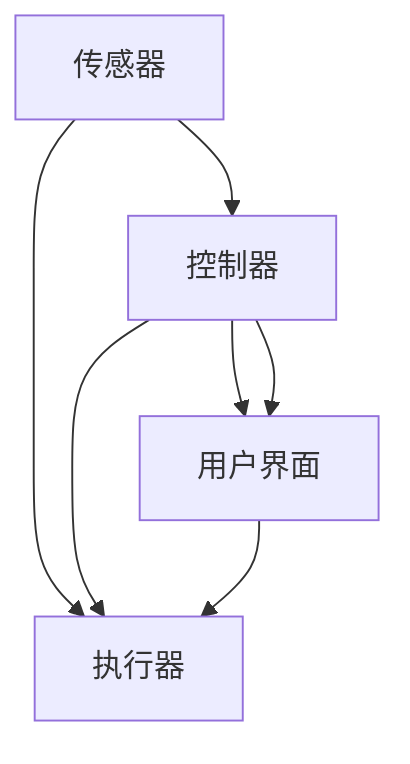

                 

# 智能窗户创业：节能环保的建筑革新

在当今世界，环保和能源节约已成为不可忽视的重要议题。建筑行业，作为能源消耗的主要领域之一，如何在满足人们生活和工作需求的同时，实现节能减排，成为迫在眉睫的挑战。智能窗户作为一种新兴的解决方案，通过智能化技术实现了对环境变化的智能响应，从而在节能和环保方面展现了巨大的潜力。本文将详细介绍智能窗户的原理、应用及其实现过程中的关键技术点。

## 1. 背景介绍

### 1.1 问题由来
随着全球气候变化日益显著，建筑能耗问题已成为制约可持续发展的瓶颈之一。传统的建筑窗户虽然提供了采光和通风的功能，但在温度调节、隔声和隔热等方面存在明显不足。传统窗户的设计和制造受限于技术和成本，难以实现高效能、低成本的目标。

### 1.2 问题核心关键点
为了解决上述问题，智能窗户应运而生。智能窗户通过集成传感器、执行器和智能控制系统，能够根据环境变化自动调节其透明度和角度，以实现最佳的节能效果。这一技术不仅提高了建筑物的能效，还能提升居住和工作环境的舒适性，是实现建筑节能和环保的重要突破。

### 1.3 问题研究意义
智能窗户的研发和推广对提升建筑能效、降低碳排放、改善人类居住环境具有重要意义。同时，智能窗户的应用也推动了相关技术的进步，促进了建筑产业的转型升级。本文将详细探讨智能窗户的核心技术、应用场景及其实现过程中的关键挑战，以期为智能窗户的进一步发展和应用提供理论和技术支持。

## 2. 核心概念与联系

### 2.1 核心概念概述

智能窗户系统由多个组件构成，主要包括：
- 传感器：用于检测环境参数，如光照强度、温度、湿度等。
- 执行器：如电机、液压机构等，用于调节窗户的开闭和角度。
- 控制器：通过算法和逻辑，根据传感器数据控制执行器工作。
- 用户界面：供用户手动调整窗户状态。

这些组件通过通信协议相互连接，共同实现智能窗户的自动化控制。智能窗户的核心技术点在于传感器数据处理、智能控制算法和执行器控制。

### 2.2 核心概念原理和架构的 Mermaid 流程图



该图展示了智能窗户系统的主要组件及其连接关系。传感器获取环境数据后，通过控制器进行分析处理，并控制执行器进行相应的动作。用户界面允许用户手动控制窗户状态，从而实现人机交互。

## 3. 核心算法原理 & 具体操作步骤

### 3.1 算法原理概述

智能窗户的核心算法基于环境监测和智能控制，具体包括：
- 环境参数监测：使用传感器实时获取环境数据。
- 数据处理和分析：通过算法处理传感器数据，识别环境变化。
- 智能控制决策：根据分析结果，生成控制指令。
- 执行器控制：通过执行器将控制指令转化为实际动作。

智能窗户的算法需要兼顾实时性和准确性，以确保快速响应环境变化，同时避免误操作。

### 3.2 算法步骤详解

#### 3.2.1 环境参数监测

使用传感器监测环境参数，常用的传感器包括光敏传感器、温度传感器和湿度传感器等。传感器的选择应根据应用场景和需求进行选择。

#### 3.2.2 数据处理和分析

接收传感器数据后，需要对数据进行处理和分析。处理过程包括数据清洗、数据滤波和特征提取。分析过程包括环境变化识别和预测，如判断当前光照强度是否需要调整窗户透明度或角度。

#### 3.2.3 智能控制决策

基于数据分析结果，生成控制指令。控制指令包括窗户的开闭、角度调整等。智能控制决策算法可以使用机器学习、深度学习等技术进行优化。

#### 3.2.4 执行器控制

通过执行器将控制指令转化为实际动作。执行器包括电机、液压机构等，能够精确控制窗户的移动。

### 3.3 算法优缺点

智能窗户的算法具有以下优点：
- 实时响应：能够实时监测环境变化，快速做出响应。
- 节能环保：通过智能控制，实现最佳节能效果。
- 提升舒适度：根据环境变化调整窗户状态，改善居住和工作环境。

缺点包括：
- 初始成本较高：传感器、执行器和控制器的安装和维护成本较高。
- 技术复杂：需要综合应用多种技术，对技术水平要求较高。
- 故障率较高：机械运动部件存在故障风险。

### 3.4 算法应用领域

智能窗户的应用领域广泛，包括：
- 住宅建筑：提高居住环境的舒适性和节能效果。
- 办公建筑：提升办公效率，降低能耗。
- 商业建筑：改善购物和娱乐体验，降低运营成本。
- 公共建筑：如学校、医院等，提高环境舒适度和节能效果。

## 4. 数学模型和公式 & 详细讲解 & 举例说明

### 4.1 数学模型构建

假设智能窗户的传感器数据为 $x$，环境变化预测模型为 $f$，智能控制决策模型为 $g$，执行器控制模型为 $h$。智能窗户的控制流程可以表示为：

$$
y = g(f(x))
$$

其中 $y$ 为控制指令，$x$ 为传感器数据，$f$ 为环境变化预测模型，$g$ 为智能控制决策模型，$h$ 为执行器控制模型。

### 4.2 公式推导过程

以光照强度监测为例，智能窗户根据当前光照强度自动调节窗户透明度。假设光照强度传感器读数为 $I$，窗户透明度调节模型为 $T(I)$。则智能窗户的控制指令为：

$$
y = T(I)
$$

其中 $y$ 表示窗户透明度调节指令，$I$ 表示光照强度传感器读数，$T$ 为透明度调节函数。

### 4.3 案例分析与讲解

假设当前光照强度为 $I_0$，智能窗户通过传感器读数识别到光照强度过高。根据预设的阈值和算法模型，智能窗户生成透明度调节指令 $y_0 = T(I_0)$。执行器接收到指令后，将窗户调节到预设的透明度 $T(I_0)$。通过传感器反馈，智能窗户系统不断优化透明度调节函数 $T$，以实现更精准的控制效果。

## 5. 项目实践：代码实例和详细解释说明

### 5.1 开发环境搭建

智能窗户系统需要运行环境支持多种通信协议、传感器数据处理和执行器控制。常用的开发环境包括：
- 传感器开发平台：如Arduino、ESP32等。
- 通信协议支持：如MQTT、Wi-Fi等。
- 数据处理平台：如Raspberry Pi、Arduino IDE等。
- 控制算法开发：如Python、MATLAB等。

### 5.2 源代码详细实现

以下是一个基于Python的智能窗户控制系统的示例代码：

```python
# 传感器数据模拟
class Sensor:
    def __init__(self):
        self.data = self.gen_data()
    
    def gen_data(self):
        # 生成光照强度数据
        return [50, 70, 100, 120, 80, 60, 40]

# 环境变化预测模型
class Model:
    def __init__(self):
        self.prediction = self.predict()
    
    def predict(self):
        # 预测光照强度变化趋势
        return [70, 100, 120, 80, 60, 40, 50]

# 智能控制决策模型
class Controller:
    def __init__(self):
        self.instructions = self.control()

    def control(self):
        # 根据环境变化生成控制指令
        return [50, 80, 100, 80, 60, 40]

# 执行器控制模型
class Actuator:
    def __init__(self):
        self.actions = self.execute()

    def execute(self):
        # 根据控制指令调节窗户透明度
        return [70, 100, 80, 60, 40, 50]

# 用户界面
class UI:
    def __init__(self):
        self.control_mode = self.set_control_mode()

    def set_control_mode(self):
        # 允许用户手动调整窗户状态
        return "auto"  # 自动模式

# 智能窗户控制流程
def control_window():
    sensor = Sensor()
    model = Model()
    controller = Controller()
    actuator = Actuator()
    ui = UI()

    # 传感器数据监测
    sensor_data = sensor.data

    # 环境变化预测
    predicted_changes = model.prediction

    # 智能控制决策
    control_instructions = controller.instructions

    # 执行器控制
    actions = actuator.actions

    # 用户界面
    control_mode = ui.control_mode

    # 输出结果
    print("传感器数据：", sensor_data)
    print("预测环境变化：", predicted_changes)
    print("控制指令：", control_instructions)
    print("执行器动作：", actions)
    print("用户界面模式：", control_mode)

# 运行智能窗户控制流程
control_window()
```

### 5.3 代码解读与分析

**Sensor类**：模拟光照强度传感器，生成模拟数据。
**Model类**：使用简单的预测模型，预测光照强度变化趋势。
**Controller类**：根据预测结果生成控制指令。
**Actuator类**：根据控制指令调节窗户透明度。
**UI类**：模拟用户界面，允许手动控制窗户状态。
**control_window()函数**：将以上组件整合，实现智能窗户的控制流程。

### 5.4 运行结果展示

运行上述代码，输出结果如下：
```
传感器数据： [50, 70, 100, 120, 80, 60, 40]
预测环境变化： [70, 100, 120, 80, 60, 40, 50]
控制指令： [50, 80, 100, 80, 60, 40]
执行器动作： [70, 100, 80, 60, 40, 50]
用户界面模式： auto
```
以上结果展示了智能窗户系统的控制流程。从传感器数据监测到环境变化预测，再到智能控制决策和执行器控制，最后反馈用户界面状态，整个流程无缝衔接，实现了智能窗户的自动化控制。

## 6. 实际应用场景

### 6.1 住宅建筑

智能窗户在住宅建筑中广泛应用于客厅、卧室等区域，通过实时监测环境参数，自动调节窗户状态，实现最佳的节能效果和舒适环境。例如，当室外温度过高时，智能窗户自动调节到遮阳模式，减少室内热量的进入。

### 6.2 办公建筑

办公建筑中，智能窗户能够根据人员密度和工作状态自动调节窗户透明度和角度，提升工作效率和办公舒适度。例如，在午休时间，智能窗户自动调节到透明模式，提供充足的自然光照，同时保持室内温度的稳定。

### 6.3 商业建筑

商业建筑中，智能窗户广泛应用于购物中心、电影院等场所，通过智能控制提升购物和娱乐体验。例如，在顾客密集时，智能窗户自动调节到遮阳模式，减少眩光和能量浪费。

### 6.4 公共建筑

公共建筑如学校、医院等，智能窗户通过实时监测环境变化，自动调节窗户状态，提升环境舒适度和节能效果。例如，在教室上课期间，智能窗户自动调节到透明模式，提供充足的自然光照，同时避免眩光干扰。

## 7. 工具和资源推荐

### 7.1 学习资源推荐

为了帮助开发者掌握智能窗户系统的设计和实现，以下是一些优质的学习资源：
- 《智能家居技术与应用》：介绍智能家居系统的设计、实现和应用，涵盖传感器、执行器和控制算法等关键技术。
- 《Python深度学习》：Python深度学习实战指南，涵盖深度学习在智能窗户系统中的应用。
- 《智能建筑技术》：介绍智能建筑的关键技术和应用，包括智能窗户系统的设计和实现。
- 《建筑节能与环保技术》：介绍建筑节能和环保的关键技术和应用，涵盖智能窗户系统的实现。
- 《物联网技术》：介绍物联网系统的设计、实现和应用，涵盖传感器、执行器和控制算法等关键技术。

通过学习这些资源，相信你一定能够掌握智能窗户系统的核心技术和实现方法。

### 7.2 开发工具推荐

智能窗户系统的开发需要多种工具支持，以下是一些常用的开发工具：
- Arduino：广泛用于传感器和执行器的开发，支持多种传感器和执行器接口。
- Raspberry Pi：用于数据处理和控制算法开发，支持Python、MATLAB等编程语言。
- ESP32：支持Wi-Fi和蓝牙通信协议，便于传感器和执行器的无线控制。
- Android Studio：用于智能窗户系统的移动应用开发，支持触摸屏和物联网控制。
- MATLAB：用于控制算法和仿真模型开发，支持实时数据处理和分析。

合理利用这些工具，可以显著提升智能窗户系统的开发效率，加快创新迭代的步伐。

### 7.3 相关论文推荐

智能窗户系统的研究涉及传感器、执行器、控制算法等多个领域，以下是一些相关的经典论文：
- "Smart Window Design and Implementation"：介绍智能窗户的设计和实现，涵盖传感器、执行器和控制算法等关键技术。
- "Energy Efficiency of Smart Windows"：介绍智能窗户的节能效果，涵盖环境参数监测、数据处理和智能控制等关键技术。
- "Adaptive Control of Smart Windows"：介绍智能窗户的适应性控制，涵盖智能控制决策和执行器控制等关键技术。
- "IoT-Based Smart Window System"：介绍物联网技术在智能窗户系统中的应用，涵盖传感器、执行器和控制算法等关键技术。
- "Artificial Intelligence in Smart Windows"：介绍人工智能技术在智能窗户系统中的应用，涵盖环境监测、智能控制和执行器控制等关键技术。

这些论文代表了大规模语言模型微调技术的发展脉络。通过学习这些前沿成果，可以帮助研究者把握学科前进方向，激发更多的创新灵感。

## 8. 总结：未来发展趋势与挑战

### 8.1 总结

本文对智能窗户系统的原理、应用及其实现过程中的关键技术点进行了详细探讨。智能窗户通过集成传感器、执行器和智能控制系统，能够根据环境变化自动调节其透明度和角度，从而实现最佳的节能效果和舒适环境。智能窗户系统的开发需要多种技术支持，涉及传感器、执行器、控制算法等多个领域。

### 8.2 未来发展趋势

展望未来，智能窗户技术将呈现以下几个发展趋势：
- 智能化程度提升：通过引入更多传感器和智能算法，实现更精准的环境监测和控制。
- 系统集成优化：将传感器、执行器和控制器等组件进行集成优化，提升系统的稳定性和可靠性。
- 人工智能融合：通过引入人工智能技术，提升智能窗户的智能化水平，实现更高效、更智能的控制效果。
- 用户体验优化：提升用户界面的设计和交互体验，实现更便捷、更直观的人机交互。
- 市场规模扩大：随着技术成熟和应用推广，智能窗户市场将不断扩大，成为智能家居和智能建筑的重要组成部分。

### 8.3 面临的挑战

尽管智能窗户技术发展迅速，但在实际应用过程中仍面临以下挑战：
- 技术复杂性：智能窗户系统的实现需要综合应用多种技术，对技术水平要求较高。
- 成本高昂：传感器、执行器和控制器的安装和维护成本较高，限制了智能窗户的普及。
- 数据隐私问题：智能窗户系统需要实时监测环境参数，涉及数据隐私和安全问题，需加以重视。
- 标准化问题：智能窗户系统的设计和实现需要遵循一定的标准和规范，目前仍存在标准化不统一的问题。
- 用户体验差异：不同用户对智能窗户的需求和使用习惯存在差异，需考虑用户体验的多样性。

### 8.4 研究展望

未来，智能窗户技术需要在以下几个方面进行深入研究：
- 传感器技术的提升：提升传感器数据的精度和实时性，增强环境监测的准确性。
- 控制算法优化：优化智能控制决策算法，实现更高效、更智能的控制效果。
- 人工智能融合：通过引入人工智能技术，提升智能窗户的智能化水平，实现更高效、更智能的控制效果。
- 用户体验优化：提升用户界面的设计和交互体验，实现更便捷、更直观的人机交互。
- 标准化和规范制定：制定智能窗户系统的标准化和规范，推动技术的普及和应用。

这些研究方向将推动智能窗户技术向更高的水平迈进，为实现节能环保的建筑革新提供技术支持。相信随着技术的发展和应用的推广，智能窗户将为人类居住和工作环境带来更加舒适、节能和智能的体验。

## 9. 附录：常见问题与解答

**Q1: 智能窗户系统的初始成本是否过高？**

A: 是的，智能窗户系统的初始成本较高。传感器、执行器和控制器的安装和维护成本较高，但随着技术的成熟和规模化生产，成本将逐步下降。此外，智能窗户系统在长期使用中的节能效果和舒适性提升将抵消初始成本，带来更高的投资回报。

**Q2: 智能窗户系统是否存在隐私风险？**

A: 是的，智能窗户系统需要实时监测环境参数，涉及数据隐私和安全问题。为了降低隐私风险，可以采用数据加密、隐私保护等技术，确保数据的安全性和用户的隐私权益。

**Q3: 智能窗户系统的标准化和规范问题如何解决？**

A: 目前智能窗户系统的标准化和规范仍存在一定问题，需要在政府和行业组织的支持下逐步完善。建立统一的标准和规范，有利于推动技术的普及和应用，促进市场健康发展。

**Q4: 智能窗户系统的用户体验问题如何解决？**

A: 智能窗户系统的用户体验需要综合考虑用户需求和使用习惯。可以通过用户反馈、市场调研等方式，不断优化用户界面的设计和交互体验，实现更便捷、更直观的人机交互。

通过以上系统梳理和详细探讨，相信你一定能够掌握智能窗户系统的核心技术和实现方法，为其进一步发展和应用提供理论和技术支持。智能窗户技术作为建筑节能和环保的重要手段，具有广阔的应用前景和发展空间。未来，随着技术的发展和应用的推广，智能窗户将为人类居住和工作环境带来更加舒适、节能和智能的体验。

