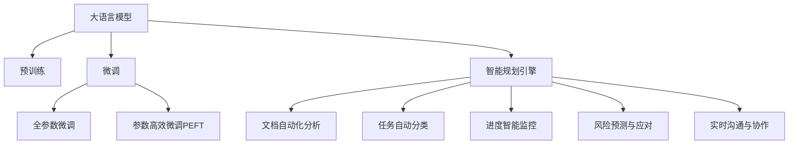

                 

## 1. 背景介绍

### 1.1 问题由来
在现代企业中，项目管理是确保项目按时、按质、按预算完成的关键。传统的项目管理方法，如甘特图、PERT图等，虽然在一定程度上有效，但无法充分适应复杂多变的环境和需求。随着人工智能技术的兴起，基于语言模型的智能规划引擎逐渐成为项目管理领域的新宠，它利用自然语言处理(NLP)和机器学习(ML)技术，将大语言模型(LLM)应用于项目管理，实现了对项目规划、执行和监控的智能化辅助。

### 1.2 问题核心关键点
大语言模型在项目管理中的应用，本质上是利用LLM对自然语言文本的深度理解和处理能力，实现对项目文档、需求、进度等信息的自动化分析，从而帮助项目经理制定更科学合理的规划，优化项目执行过程，提升项目管理效率。核心关键点包括：

- 文档自动化分析：LLM能够自动化地从项目文档、邮件、会议记录中提取关键信息，如项目目标、进度、风险等。
- 任务自动分类：LLM能够自动识别任务类型、优先级、负责人等，帮助项目经理清晰划分任务责任，优化资源配置。
- 进度智能监控：LLM能够通过实时监控项目进度，预测任务延误，及时采取措施。
- 风险预测与应对：LLM能够自动分析项目中的潜在风险，提出相应的预防和应对策略。
- 实时沟通与协作：LLM能够实现项目成员之间的智能沟通和协作，提高团队协作效率。

### 1.3 问题研究意义
利用LLM进行项目管理，有助于提升项目的成功率，减少资源浪费，提高团队效率，具有重要的现实意义：

- 提升项目管理效率：通过自动化分析和决策支持，智能规划引擎可以显著减轻项目经理的工作负担，提高决策速度和准确性。
- 优化资源配置：智能规划引擎能够自动分析任务依赖和资源需求，实现更科学合理的人员和物资分配。
- 风险预警与应对：智能规划引擎通过实时监控和分析项目进度与风险，提前预警潜在问题，帮助项目经理及时调整策略，规避风险。
- 提升团队协作效率：智能规划引擎能够辅助项目成员之间的智能沟通和协作，减少误解和冲突，提高团队合作效率。
- 推动项目管理技术创新：智能规划引擎的开发和应用，将推动项目管理方法的创新，为项目管理带来新的思路和工具。

## 2. 核心概念与联系

### 2.1 核心概念概述

为更好地理解LLM在项目管理中的应用，本节将介绍几个密切相关的核心概念：

- 大语言模型(Large Language Model, LLM)：以自回归(如GPT)或自编码(如BERT)模型为代表的大规模预训练语言模型。通过在大规模无标签文本数据上进行预训练，学习通用的语言表示，具备强大的语言理解和生成能力。

- 预训练(Pre-training)：指在大规模无标签文本语料上，通过自监督学习任务训练通用语言模型的过程。常见的预训练任务包括言语建模、遮挡语言模型等。预训练使得模型学习到语言的通用表示。

- 微调(Fine-tuning)：指在预训练模型的基础上，使用下游任务的少量标注数据，通过有监督学习优化模型在特定任务上的性能。通常只需要调整顶层分类器或解码器，并以较小的学习率更新全部或部分的模型参数。

- 迁移学习(Transfer Learning)：指将一个领域学习到的知识，迁移应用到另一个不同但相关的领域的学习范式。大模型的预训练-微调过程即是一种典型的迁移学习方式。

- 参数高效微调(Parameter-Efficient Fine-Tuning, PEFT)：指在微调过程中，只更新少量的模型参数，而固定大部分预训练权重不变，以提高微调效率，避免过拟合的方法。

- 智能规划引擎(Intelligent Planning Engine)：利用大语言模型技术，对项目管理中的文档、需求、进度等信息进行自动化分析，提供智能决策支持，优化项目管理过程。

这些核心概念之间的逻辑关系可以通过以下Mermaid流程图来展示：



这个流程图展示了大语言模型的核心概念及其之间的关系：

1. 大语言模型通过预训练获得基础能力。
2. 微调是对预训练模型进行任务特定的优化，可以分为全参数微调和参数高效微调（PEFT）。
3. 智能规划引擎利用微调后的模型，实现对项目管理任务的自动化分析与决策支持。
4. 文档自动化分析、任务自动分类、进度监控、风险预警与应对、实时沟通与协作等模块，都是智能规划引擎的重要组成部分，通过各模块的协同工作，实现对项目的全面管理。

## 3. 核心算法原理 & 具体操作步骤
### 3.1 算法原理概述

利用LLM进行项目管理，其核心思想是：将LLM视作一个强大的"文本分析器"，通过在项目管理文档中进行有监督的微调，使得模型能够理解文本中蕴含的各类信息，从而辅助项目经理进行决策和任务管理。

形式化地，假设预训练语言模型为 $M_{\theta}$，其中 $\theta$ 为预训练得到的模型参数。给定项目管理文档 $D=\{(x_i, y_i)\}_{i=1}^N$，微调的目标是找到新的模型参数 $\hat{\theta}$，使得：

$$
\hat{\theta}=\mathop{\arg\min}_{\theta} \mathcal{L}(M_{\theta},D)
$$

其中 $\mathcal{L}$ 为针对项目文档设计的损失函数，用于衡量模型预测输出与真实标签之间的差异。常见的损失函数包括交叉熵损失、均方误差损失等。

通过梯度下降等优化算法，微调过程不断更新模型参数 $\theta$，最小化损失函数 $\mathcal{L}$，使得模型输出逼近真实标签。由于 $\theta$ 已经通过预训练获得了较好的初始化，因此即便在项目管理文档等相对较小规模的数据集上，也能较快收敛到理想的模型参数 $\hat{\theta}$。

### 3.2 算法步骤详解

利用LLM进行项目管理，主要包括以下几个关键步骤：

**Step 1: 准备预训练模型和数据集**
- 选择合适的预训练语言模型 $M_{\theta}$ 作为初始化参数，如 BERT、GPT 等。
- 准备项目管理文档 $D$，划分为训练集、验证集和测试集。一般要求文档与预训练数据的分布不要差异过大。

**Step 2: 添加任务适配层**
- 根据项目需求，在预训练模型顶层设计合适的输出层和损失函数。
- 对于项目文档分析，通常在顶层添加文本分类器或序列标注器，输出任务类型、优先级、负责人等信息。
- 对于进度监控，通常使用语言模型的解码器输出概率分布，并以负对数似然为损失函数。

**Step 3: 设置微调超参数**
- 选择合适的优化算法及其参数，如 AdamW、SGD 等，设置学习率、批大小、迭代轮数等。
- 设置正则化技术及强度，包括权重衰减、Dropout、Early Stopping等。
- 确定冻结预训练参数的策略，如仅微调顶层，或全部参数都参与微调。

**Step 4: 执行梯度训练**
- 将项目管理文档数据分批次输入模型，前向传播计算损失函数。
- 反向传播计算参数梯度，根据设定的优化算法和学习率更新模型参数。
- 周期性在验证集上评估模型性能，根据性能指标决定是否触发 Early Stopping。
- 重复上述步骤直到满足预设的迭代轮数或 Early Stopping 条件。

**Step 5: 测试和部署**
- 在测试集上评估微调后模型 $M_{\hat{\theta}}$ 的性能，对比微调前后的精度提升。
- 使用微调后的模型对新项目文档进行推理预测，集成到实际的项目管理系统中。
- 持续收集新的项目管理文档，定期重新微调模型，以适应数据分布的变化。

以上是利用LLM进行项目管理的一般流程。在实际应用中，还需要针对具体项目的特点，对微调过程的各个环节进行优化设计，如改进训练目标函数，引入更多的正则化技术，搜索最优的超参数组合等，以进一步提升模型性能。

### 3.3 算法优缺点

利用LLM进行项目管理，具有以下优点：
1. 自动化分析文档：LLM能够自动识别文档中的关键信息，如项目目标、进度、风险等，提高分析效率。
2. 智能化辅助决策：LLM能够通过学习项目管理经验，提供智能化的决策支持，帮助项目经理制定合理的规划。
3. 实时监控进度：LLM能够实时监控项目进度，及时预警潜在的延误，保障项目按时完成。
4. 自动生成报告：LLM能够自动生成项目状态报告，减轻项目经理的工作负担。
5. 支持多语言项目：LLM可以处理多种语言的文档，支持多语言项目的管理。

同时，该方法也存在一定的局限性：
1. 依赖高质量标注数据：微调的效果很大程度上取决于标注数据的质量和数量，标注数据收集和处理成本较高。
2. 模型泛化能力有限：当项目文档与预训练数据的分布差异较大时，微调的性能提升有限。
3. 可解释性不足：微调模型的决策过程通常缺乏可解释性，难以对其推理逻辑进行分析和调试。
4. 过度依赖技术：过度依赖LLM进行项目管理，可能会降低项目团队的自主性和决策灵活性。

尽管存在这些局限性，但就目前而言，利用LLM进行项目管理仍然是最主流的范式。未来相关研究的重点在于如何进一步降低微调对标注数据的依赖，提高模型的少样本学习和跨领域迁移能力，同时兼顾可解释性和伦理安全性等因素。

### 3.4 算法应用领域

利用大语言模型进行项目管理的监督学习方法，在项目管理领域已经得到了广泛的应用，覆盖了项目规划、进度监控、风险预警、团队协作等多个方面，具体包括：

- 项目文档自动化分析：对项目文档中的关键信息进行自动抽取和分类，如项目目标、需求、进度、风险等。
- 任务自动分类：自动识别项目中的任务类型、优先级、负责人等信息，辅助资源配置和任务分配。
- 进度智能监控：通过实时监控项目进度，预测任务延误，及时采取措施。
- 风险预测与应对：自动分析项目中的潜在风险，提出相应的预防和应对策略。
- 实时沟通与协作：辅助项目成员之间的智能沟通和协作，提高团队合作效率。
- 项目文档生成：自动生成项目状态报告、进度报告、风险报告等，减轻项目经理的工作负担。

除了上述这些经典任务外，LLM还被创新性地应用到更多场景中，如项目需求生成、项目里程碑规划、项目绩效评估等，为项目管理带来新的思路和方法。随着预训练模型和微调方法的不断进步，相信LLM技术将在项目管理领域大放异彩。

## 4. 数学模型和公式 & 详细讲解  
### 4.1 数学模型构建

本节将使用数学语言对利用LLM进行项目管理的过程进行更加严格的刻画。

记预训练语言模型为 $M_{\theta}$，其中 $\theta$ 为预训练得到的模型参数。假设项目管理文档为 $D=\{(x_i,y_i)\}_{i=1}^N, x_i \in \mathcal{X}, y_i \in \mathcal{Y}$，其中 $\mathcal{X}$ 为输入空间，$\mathcal{Y}$ 为输出空间。

定义模型 $M_{\theta}$ 在数据样本 $(x,y)$ 上的损失函数为 $\ell(M_{\theta}(x),y)$，则在数据集 $D$ 上的经验风险为：

$$
\mathcal{L}(\theta) = \frac{1}{N} \sum_{i=1}^N \ell(M_{\theta}(x_i),y_i)
$$

微调的优化目标是最小化经验风险，即找到最优参数：

$$
\theta^* = \mathop{\arg\min}_{\theta} \mathcal{L}(\theta)
$$

在实践中，我们通常使用基于梯度的优化算法（如SGD、Adam等）来近似求解上述最优化问题。设 $\eta$ 为学习率，$\lambda$ 为正则化系数，则参数的更新公式为：

$$
\theta \leftarrow \theta - \eta \nabla_{\theta}\mathcal{L}(\theta) - \eta\lambda\theta
$$

其中 $\nabla_{\theta}\mathcal{L}(\theta)$ 为损失函数对参数 $\theta$ 的梯度，可通过反向传播算法高效计算。

### 4.2 公式推导过程

以下我们以项目管理文档分析任务为例，推导交叉熵损失函数及其梯度的计算公式。

假设模型 $M_{\theta}$ 在输入 $x$ 上的输出为 $\hat{y}=M_{\theta}(x) \in [0,1]$，表示样本属于某一任务类型的概率。真实标签 $y \in \{0,1\}$。则二分类交叉熵损失函数定义为：

$$
\ell(M_{\theta}(x),y) = -[y\log \hat{y} + (1-y)\log (1-\hat{y})]
$$

将其代入经验风险公式，得：

$$
\mathcal{L}(\theta) = -\frac{1}{N}\sum_{i=1}^N [y_i\log M_{\theta}(x_i)+(1-y_i)\log(1-M_{\theta}(x_i))]
$$

根据链式法则，损失函数对参数 $\theta_k$ 的梯度为：

$$
\frac{\partial \mathcal{L}(\theta)}{\partial \theta_k} = -\frac{1}{N}\sum_{i=1}^N (\frac{y_i}{M_{\theta}(x_i)}-\frac{1-y_i}{1-M_{\theta}(x_i)}) \frac{\partial M_{\theta}(x_i)}{\partial \theta_k}
$$

其中 $\frac{\partial M_{\theta}(x_i)}{\partial \theta_k}$ 可进一步递归展开，利用自动微分技术完成计算。

在得到损失函数的梯度后，即可带入参数更新公式，完成模型的迭代优化。重复上述过程直至收敛，最终得到适应项目管理任务的最优模型参数 $\theta^*$。

## 5. 项目实践：代码实例和详细解释说明
### 5.1 开发环境搭建

在进行项目管理微调实践前，我们需要准备好开发环境。以下是使用Python进行PyTorch开发的环境配置流程：

1. 安装Anaconda：从官网下载并安装Anaconda，用于创建独立的Python环境。

2. 创建并激活虚拟环境：
```bash
conda create -n pytorch-env python=3.8 
conda activate pytorch-env
```

3. 安装PyTorch：根据CUDA版本，从官网获取对应的安装命令。例如：
```bash
conda install pytorch torchvision torchaudio cudatoolkit=11.1 -c pytorch -c conda-forge
```

4. 安装Transformers库：
```bash
pip install transformers
```

5. 安装各类工具包：
```bash
pip install numpy pandas scikit-learn matplotlib tqdm jupyter notebook ipython
```

完成上述步骤后，即可在`pytorch-env`环境中开始微调实践。

### 5.2 源代码详细实现

下面我们以项目管理文档自动化分析任务为例，给出使用Transformers库对BERT模型进行微调的PyTorch代码实现。

首先，定义项目管理文档分析任务的数据处理函数：

```python
from transformers import BertTokenizer
from torch.utils.data import Dataset
import torch

class ProjectDocDataset(Dataset):
    def __init__(self, docs, tags, tokenizer, max_len=128):
        self.docs = docs
        self.tags = tags
        self.tokenizer = tokenizer
        self.max_len = max_len
        
    def __len__(self):
        return len(self.docs)
    
    def __getitem__(self, item):
        doc = self.docs[item]
        tag = self.tags[item]
        
        encoding = self.tokenizer(doc, return_tensors='pt', max_length=self.max_len, padding='max_length', truncation=True)
        input_ids = encoding['input_ids'][0]
        attention_mask = encoding['attention_mask'][0]
        
        # 对标签进行编码
        encoded_tag = [tag2id[tag] for tag in tag2id]
        encoded_tag.extend([tag2id['O']] * (self.max_len - len(encoded_tag)))
        labels = torch.tensor(encoded_tag, dtype=torch.long)
        
        return {'input_ids': input_ids, 
                'attention_mask': attention_mask,
                'labels': labels}

# 标签与id的映射
tag2id = {'O': 0, 'B-PROJECT': 1, 'I-PROJECT': 2, 'B-DEADLINE': 3, 'I-DEADLINE': 4, 'B-RESOURCE': 5, 'I-RESOURCE': 6}
id2tag = {v: k for k, v in tag2id.items()}

# 创建dataset
tokenizer = BertTokenizer.from_pretrained('bert-base-cased')

train_dataset = ProjectDocDataset(train_docs, train_tags, tokenizer)
dev_dataset = ProjectDocDataset(dev_docs, dev_tags, tokenizer)
test_dataset = ProjectDocDataset(test_docs, test_tags, tokenizer)
```

然后，定义模型和优化器：

```python
from transformers import BertForTokenClassification, AdamW

model = BertForTokenClassification.from_pretrained('bert-base-cased', num_labels=len(tag2id))

optimizer = AdamW(model.parameters(), lr=2e-5)
```

接着，定义训练和评估函数：

```python
from torch.utils.data import DataLoader
from tqdm import tqdm
from sklearn.metrics import classification_report

device = torch.device('cuda') if torch.cuda.is_available() else torch.device('cpu')
model.to(device)

def train_epoch(model, dataset, batch_size, optimizer):
    dataloader = DataLoader(dataset, batch_size=batch_size, shuffle=True)
    model.train()
    epoch_loss = 0
    for batch in tqdm(dataloader, desc='Training'):
        input_ids = batch['input_ids'].to(device)
        attention_mask = batch['attention_mask'].to(device)
        labels = batch['labels'].to(device)
        model.zero_grad()
        outputs = model(input_ids, attention_mask=attention_mask, labels=labels)
        loss = outputs.loss
        epoch_loss += loss.item()
        loss.backward()
        optimizer.step()
    return epoch_loss / len(dataloader)

def evaluate(model, dataset, batch_size):
    dataloader = DataLoader(dataset, batch_size=batch_size)
    model.eval()
    preds, labels = [], []
    with torch.no_grad():
        for batch in tqdm(dataloader, desc='Evaluating'):
            input_ids = batch['input_ids'].to(device)
            attention_mask = batch['attention_mask'].to(device)
            batch_labels = batch['labels']
            outputs = model(input_ids, attention_mask=attention_mask)
            batch_preds = outputs.logits.argmax(dim=2).to('cpu').tolist()
            batch_labels = batch_labels.to('cpu').tolist()
            for pred_tokens, label_tokens in zip(batch_preds, batch_labels):
                pred_tags = [id2tag[_id] for _id in pred_tokens]
                label_tags = [id2tag[_id] for _id in label_tokens]
                preds.append(pred_tags[:len(label_tags)])
                labels.append(label_tags)
                
    print(classification_report(labels, preds))
```

最后，启动训练流程并在测试集上评估：

```python
epochs = 5
batch_size = 16

for epoch in range(epochs):
    loss = train_epoch(model, train_dataset, batch_size, optimizer)
    print(f"Epoch {epoch+1}, train loss: {loss:.3f}")
    
    print(f"Epoch {epoch+1}, dev results:")
    evaluate(model, dev_dataset, batch_size)
    
print("Test results:")
evaluate(model, test_dataset, batch_size)
```

以上就是使用PyTorch对BERT进行项目管理文档自动化分析任务微调的完整代码实现。可以看到，得益于Transformers库的强大封装，我们可以用相对简洁的代码完成BERT模型的加载和微调。

### 5.3 代码解读与分析

让我们再详细解读一下关键代码的实现细节：

**ProjectDocDataset类**：
- `__init__`方法：初始化文档、标签、分词器等关键组件。
- `__len__`方法：返回数据集的样本数量。
- `__getitem__`方法：对单个样本进行处理，将文档输入编码为token ids，将标签编码为数字，并对其进行定长padding，最终返回模型所需的输入。

**tag2id和id2tag字典**：
- 定义了标签与数字id之间的映射关系，用于将token-wise的预测结果解码回真实的标签。

**训练和评估函数**：
- 使用PyTorch的DataLoader对数据集进行批次化加载，供模型训练和推理使用。
- 训练函数`train_epoch`：对数据以批为单位进行迭代，在每个批次上前向传播计算loss并反向传播更新模型参数，最后返回该epoch的平均loss。
- 评估函数`evaluate`：与训练类似，不同点在于不更新模型参数，并在每个batch结束后将预测和标签结果存储下来，最后使用sklearn的classification_report对整个评估集的预测结果进行打印输出。

**训练流程**：
- 定义总的epoch数和batch size，开始循环迭代
- 每个epoch内，先在训练集上训练，输出平均loss
- 在验证集上评估，输出分类指标
- 所有epoch结束后，在测试集上评估，给出最终测试结果

可以看到，PyTorch配合Transformers库使得BERT微调的项目管理文档自动化分析任务的代码实现变得简洁高效。开发者可以将更多精力放在数据处理、模型改进等高层逻辑上，而不必过多关注底层的实现细节。

当然，工业级的系统实现还需考虑更多因素，如模型的保存和部署、超参数的自动搜索、更灵活的任务适配层等。但核心的微调范式基本与此类似。

## 6. 实际应用场景
### 6.1 项目文档自动化分析

在项目管理中，项目文档是最重要的信息载体。通过文档分析，可以提取项目的目标、进度、需求、风险等信息，帮助项目经理更好地理解项目现状，制定合理的决策。利用LLM进行项目管理文档自动化分析，可以显著提高文档处理效率，减少人工干预，降低错误率。

**应用示例**：
- 自动化提取项目目标和需求：利用LLM对项目文档进行分析，自动识别文档中的项目目标和需求信息，生成项目概览。
- 自动识别项目进度和资源：通过对项目进度报告和资源清单进行文本分析，自动识别项目进度和资源使用情况，生成进度报告。
- 自动生成风险报告：通过对项目文档中的潜在风险进行文本分析，自动识别风险点并生成风险报告，帮助项目经理及时规避风险。

### 6.2 任务自动分类

项目管理中的任务种类繁多，包括需求开发、测试、部署、维护等。利用LLM进行任务自动分类，可以自动识别任务类型、优先级、负责人等信息，辅助资源配置和任务分配。

**应用示例**：
- 自动识别任务类型：通过对任务描述进行文本分析，自动识别任务类型，如需求分析、需求评审、需求编写等。
- 自动识别任务优先级：通过对任务描述进行分析，自动识别任务优先级，如高、中、低。
- 自动识别任务负责人：通过对任务描述进行文本分析，自动识别任务负责人，辅助资源配置。

### 6.3 进度智能监控

项目管理中的进度监控是确保项目按时完成的关键。利用LLM进行进度智能监控，可以实时监控项目进度，预测任务延误，及时采取措施。

**应用示例**：
- 自动识别项目进度：通过对项目进度报告进行文本分析，自动识别项目进度情况，生成进度报告。
- 自动识别任务延误：通过对项目进度报告进行文本分析，自动识别任务延误情况，生成预警报告。
- 实时监控项目进度：利用LLM实时监控项目进度，预测任务延误，及时采取措施。

### 6.4 风险预测与应对

项目管理中的风险管理是确保项目成功的关键。利用LLM进行风险预测与应对，可以自动分析项目中的潜在风险，提出相应的预防和应对策略。

**应用示例**：
- 自动识别潜在风险：通过对项目文档中的潜在风险进行文本分析，自动识别风险点。
- 自动生成风险报告：通过对潜在风险进行分析，自动生成风险报告，提出预防和应对策略。
- 实时监控项目风险：利用LLM实时监控项目风险，预测风险变化趋势，及时采取措施。

### 6.5 实时沟通与协作

项目管理中的实时沟通与协作是确保项目成功的关键。利用LLM进行实时沟通与协作，可以提高团队成员之间的沟通效率，减少误解和冲突，提高团队合作效率。

**应用示例**：
- 自动生成会议纪要：通过对会议记录进行文本分析，自动生成会议纪要，帮助团队成员快速掌握会议要点。
- 自动回复邮件：通过对邮件内容进行文本分析，自动回复邮件，提高沟通效率。
- 实时监控项目进度：利用LLM实时监控项目进度，及时预警潜在问题，提升团队协作效率。

### 6.6 项目文档生成

项目管理中的项目文档生成是确保项目透明度的关键。利用LLM进行项目文档生成，可以自动生成项目状态报告、进度报告、风险报告等，减轻项目经理的工作负担。

**应用示例**：
- 自动生成项目状态报告：通过对项目文档进行分析，自动生成项目状态报告，帮助项目经理掌握项目现状。
- 自动生成进度报告：通过对项目进度报告进行分析，自动生成进度报告，帮助项目经理监控项目进度。
- 自动生成风险报告：通过对项目文档中的潜在风险进行分析，自动生成风险报告，帮助项目经理规避风险。

## 7. 工具和资源推荐
### 7.1 学习资源推荐

为了帮助开发者系统掌握LLM在项目管理中的应用，这里推荐一些优质的学习资源：

1. 《Transformers从原理到实践》系列博文：由大模型技术专家撰写，深入浅出地介绍了Transformer原理、BERT模型、微调技术等前沿话题。

2. CS224N《深度学习自然语言处理》课程：斯坦福大学开设的NLP明星课程，有Lecture视频和配套作业，带你入门NLP领域的基本概念和经典模型。

3. 《Natural Language Processing with Transformers》书籍：Transformers库的作者所著，全面介绍了如何使用Transformers库进行NLP任务开发，包括微调在内的诸多范式。

4. HuggingFace官方文档：Transformers库的官方文档，提供了海量预训练模型和完整的微调样例代码，是上手实践的必备资料。

5. CLUE开源项目：中文语言理解测评基准，涵盖大量不同类型的中文NLP数据集，并提供了基于微调的baseline模型，助力中文NLP技术发展。

通过对这些资源的学习实践，相信你一定能够快速掌握LLM在项目管理中的应用，并用于解决实际的NLP问题。
###  7.2 开发工具推荐

高效的开发离不开优秀的工具支持。以下是几款用于LLM项目管理微调开发的常用工具：

1. PyTorch：基于Python的开源深度学习框架，灵活动态的计算图，适合快速迭代研究。大部分预训练语言模型都有PyTorch版本的实现。

2. TensorFlow：由Google主导开发的开源深度学习框架，生产部署方便，适合大规模工程应用。同样有丰富的预训练语言模型资源。

3. Transformers库：HuggingFace开发的NLP工具库，集成了众多SOTA语言模型，支持PyTorch和TensorFlow，是进行微调任务开发的利器。

4. Weights & Biases：模型训练的实验跟踪工具，可以记录和可视化模型训练过程中的各项指标，方便对比和调优。与主流深度学习框架无缝集成。

5. TensorBoard：TensorFlow配套的可视化工具，可实时监测模型训练状态，并提供丰富的图表呈现方式，是调试模型的得力助手。

6. Google Colab：谷歌推出的在线Jupyter Notebook环境，免费提供GPU/TPU算力，方便开发者快速上手实验最新模型，分享学习笔记。

合理利用这些工具，可以显著提升LLM项目管理微调任务的开发效率，加快创新迭代的步伐。

### 7.3 相关论文推荐

LLM在项目管理中的应用源于学界的持续研究。以下是几篇奠基性的相关论文，推荐阅读：

1. Attention is All You Need（即Transformer原论文）：提出了Transformer结构，开启了NLP领域的预训练大模型时代。

2. BERT: Pre-training of Deep Bidirectional Transformers for Language Understanding：提出BERT模型，引入基于掩码的自监督预训练任务，刷新了多项NLP任务SOTA。

3. Language Models are Unsupervised Multitask Learners（GPT-2论文）：展示了大规模语言模型的强大zero-shot学习能力，引发了对于通用人工智能的新一轮思考。

4. Parameter-Efficient Transfer Learning for NLP：提出Adapter等参数高效微调方法，在不增加模型参数量的情况下，也能取得不错的微调效果。

5. Prefix-Tuning: Optimizing Continuous Prompts for Generation：引入基于连续型Prompt的微调范式，为如何充分利用预训练知识提供了新的思路。

6. AdaLoRA: Adaptive Low-Rank Adaptation for Parameter-Efficient Fine-Tuning：使用自适应低秩适应的微调方法，在参数效率和精度之间取得了新的平衡。

这些论文代表了大语言模型微调技术的发展脉络。通过学习这些前沿成果，可以帮助研究者把握学科前进方向，激发更多的创新灵感。

## 8. 总结：未来发展趋势与挑战
### 8.1 总结

本文对利用大语言模型进行项目管理的监督学习范式进行了全面系统的介绍。首先阐述了LLM在项目管理中的应用背景和意义，明确了微调在提高项目管理效率、优化资源配置、预测风险等方面的独特价值。其次，从原理到实践，详细讲解了LLM在项目管理中的数学模型和算法步骤，给出了微调任务开发的完整代码实例。同时，本文还广泛探讨了LLM在项目管理中的实际应用场景，展示了其在文档自动化分析、任务分类、进度监控、风险预警、团队协作等方面的广泛应用。

通过本文的系统梳理，可以看到，利用LLM进行项目管理可以显著提高项目管理效率，优化资源配置，预测风险，帮助项目经理更好地理解和掌握项目进展。LLM技术以其强大的自然语言处理能力，为项目管理带来了新的思路和方法，必将在项目管理领域大放异彩。

### 8.2 未来发展趋势

展望未来，LLM在项目管理中的应用将呈现以下几个发展趋势：

1. 微调模型性能提升：随着微调算法的不断改进，模型在项目管理文档自动化分析、任务分类、进度监控等任务上的性能将进一步提升。
2. 模型通用性增强：LLM将逐步拓展到多领域、多任务的应用中，提升模型的泛化能力。
3. 实时处理能力提升：LLM的推理速度和处理能力将不断提升，能够实时处理大规模项目管理数据，提供即时的决策支持。
4. 增强智能决策：LLM将通过学习更多的项目管理经验和知识，提供更加智能的决策支持，帮助项目经理制定更合理的决策。
5. 支持更多数据格式：LLM将支持更多的数据格式，如PDF、PPT、Excel等，提升数据处理能力。
6. 引入更多先验知识：LLM将融合更多先验知识，如专家知识库、规则库等，提供更全面的项目管理支持。

以上趋势凸显了LLM在项目管理领域的广阔前景。这些方向的探索发展，必将进一步提升项目管理系统的性能和应用范围，为项目管理带来新的思路和方法。

### 8.3 面临的挑战

尽管LLM在项目管理中的应用取得了显著进展，但在实际部署和使用过程中，仍面临以下挑战：

1. 数据标注成本高：项目管理文档数据的标注成本较高，需要耗费大量人力和时间。如何降低标注成本，提高标注效率，是未来需要解决的问题。
2. 模型泛化能力有限：当项目管理文档与预训练数据的分布差异较大时，LLM的性能提升有限。如何提高模型的泛化能力，使其能够更好地适应新场景，是未来需要解决的问题。
3. 模型复杂度高：LLM的复杂度较高，对计算资源和算力要求较高。如何降低模型复杂度，提高模型的推理速度，是未来需要解决的问题。
4. 输出解释性不足：LLM的决策过程通常缺乏可解释性，难以对其推理逻辑进行分析和调试。如何提高模型的可解释性，使其输出更加透明，是未来需要解决的问题。
5. 安全性有待保障：LLM的输出依赖于输入的准确性和完整性，对于恶意输入或噪声数据，输出结果可能存在安全隐患。如何提高模型的鲁棒性和安全性，是未来需要解决的问题。

尽管存在这些挑战，但随着学界和产业界的共同努力，这些问题终将一一被克服，LLM必将在项目管理领域发挥更大的作用。

### 8.4 研究展望

面对LLM在项目管理中所面临的挑战，未来的研究需要在以下几个方面寻求新的突破：

1. 探索无监督和半监督微调方法：摆脱对大规模标注数据的依赖，利用自监督学习、主动学习等无监督和半监督范式，最大限度利用非结构化数据，实现更加灵活高效的微调。
2. 研究参数高效和计算高效的微调范式：开发更加参数高效的微调方法，在固定大部分预训练参数的同时，只更新极少量的任务相关参数。同时优化微调模型的计算图，减少前向传播和反向传播的资源消耗，实现更加轻量级、实时性的部署。
3. 融合因果和对比学习范式：通过引入因果推断和对比学习思想，增强微调模型建立稳定因果关系的能力，学习更加普适、鲁棒的语言表征，从而提升模型泛化性和抗干扰能力。
4. 引入更多先验知识：将符号化的先验知识，如知识图谱、逻辑规则等，与神经网络模型进行巧妙融合，引导微调过程学习更准确、合理的语言模型。同时加强不同模态数据的整合，实现视觉、语音等多模态信息与文本信息的协同建模。
5. 结合因果分析和博弈论工具：将因果分析方法引入微调模型，识别出模型决策的关键特征，增强输出解释的因果性和逻辑性。借助博弈论工具刻画人机交互过程，主动探索并规避模型的脆弱点，提高系统稳定性。
6. 纳入伦理道德约束：在模型训练目标中引入伦理导向的评估指标，过滤和惩罚有偏见、有害的输出倾向。同时加强人工干预和审核，建立模型行为的监管机制，确保输出符合人类价值观和伦理道德。

这些研究方向的探索，必将引领LLM在项目管理中的应用进入新的高度，为构建安全、可靠、可解释、可控的智能系统铺平道路。面向未来，LLM技术还需要与其他人工智能技术进行更深入的融合，如知识表示、因果推理、强化学习等，多路径协同发力，共同推动自然语言理解和智能交互系统的进步。只有勇于创新、敢于突破，才能不断拓展LLM的边界，让智能技术更好地造福人类社会。

## 9. 附录：常见问题与解答
**Q1：大语言模型在项目管理中的应用是否适用于所有类型的项目？**

A: 大语言模型在项目管理中的应用具有较广的适用性，但不同类型的项目可能需要定制化的微调模型。例如，对于软件开发、建筑施工等技术密集型项目，可能需要在代码、图纸等结构化数据上进行微调；而对于市场营销、客户服务等以服务为主的行业，则可以在客户反馈、服务流程等非结构化数据上进行微调。

**Q2：项目管理微调模型的学习率和超参数如何设置？**

A: 项目管理微调模型的学习率和超参数通常需要根据具体项目和数据集进行调整。一般建议从较小的学习率开始，逐步增加学习率，观察模型在验证集上的表现，选择最优的学习率。常见的超参数包括批大小(batch size)、迭代轮数、正则化系数等，需要通过实验进行调优。

**Q3：项目管理微调模型是否需要保存和部署？**

A: 项目管理微调模型通常需要保存和部署，以便在实际项目中快速接入和使用。模型保存通常采用Pickle、HDF5等格式，方便后续加载和使用。模型部署可以采用RESTful API、Flask等框架，实现模型的在线服务化。

**Q4：项目管理微调模型的性能如何评估？**

A: 项目管理微调模型的性能评估通常包括精度、召回率、F1分数等指标。具体评估方法包括在验证集和测试集上计算模型在不同任务上的指标，如文档分类、任务分类、进度监控等。同时，还可以结合实际项目的反馈和业务指标进行综合评估。

**Q5：项目管理微调模型如何处理多语言项目？**

A: 项目管理微调模型可以处理多语言项目，只需在数据预处理阶段进行语言识别和转换。例如，使用TensorFlow的tf.string_case()函数对文本进行语言转换，使得模型能够处理不同语言的文档。同时，还可以引入多语言预训练模型，提升模型在不同语言上的泛化能力。

**Q6：项目管理微调模型如何处理噪声数据和异常数据？**

A: 项目管理微调模型可以通过数据清洗和异常检测技术处理噪声数据和异常数据。例如，使用基于规则的清洗方法去除无关文本，使用基于统计的异常检测方法识别异常数据，并进行过滤。同时，还可以通过正则化技术、对抗训练等方法增强模型的鲁棒性，减少噪声数据对模型性能的影响。

**Q7：项目管理微调模型如何处理大规模项目管理数据？**

A: 项目管理微调模型可以处理大规模项目管理数据，但需要注意模型的计算资源和算力要求。可以考虑采用分布式训练、模型并行等技术，优化模型的计算效率。同时，可以采用数据压缩、剪枝等方法，降低模型的存储空间和计算量。

这些问题的答案提供了项目实践过程中可能遇到的一些关键技术细节和处理方式，有助于开发者更好地理解和应用LLM在项目管理中的应用。通过本文的系统梳理和实践指导，相信你一定能够快速掌握LLM在项目管理中的应用，并用于解决实际的NLP问题。

