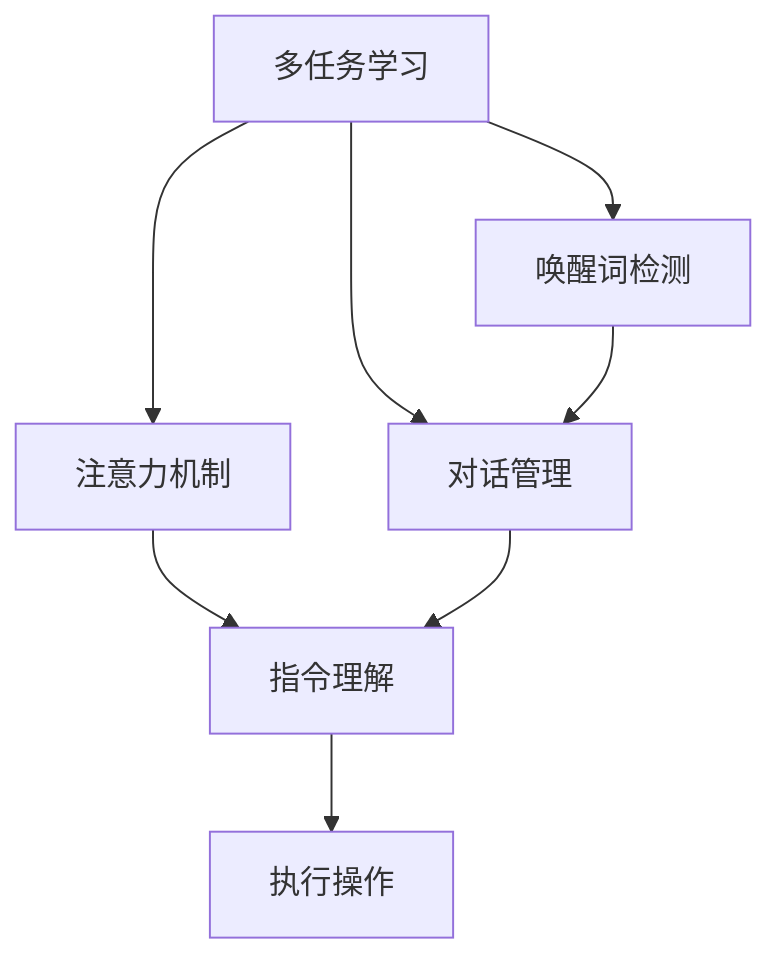

                 

# 智能音响的语音交互与注意力争夺

> 关键词：智能音箱, 语音交互, 多任务学习, 注意力机制, 唤醒词检测, 对话管理, 指令理解

## 1. 背景介绍

智能音响作为人工智能技术的重要应用场景之一，近年来得到了快速发展和广泛应用。智能音箱凭借其智能化语音交互功能，极大提升了用户体验和便利性。然而，智能音箱的语音交互技术面临诸多挑战，其中最为关键的便是如何在噪音环境中准确识别和理解用户的语音指令，并在多个用户或多任务之间高效分配注意力资源。

针对这一问题，本文将详细介绍智能音箱语音交互的核心概念与联系，从原理到实践全面探讨如何构建高效的语音交互系统。首先，我们将从背景出发，阐述智能音箱语音交互技术的重要性和现状。然后，介绍核心概念，包括多任务学习、注意力机制、唤醒词检测、对话管理和指令理解等。最后，我们将结合数学模型和公式，详细解析具体的算法原理和操作步骤，并给出实践中的优化策略和应用案例。

## 2. 核心概念与联系

### 2.1 核心概念概述

智能音箱的语音交互系统主要由以下几个关键组件构成：

- **多任务学习**：智能音箱需要同时处理用户指令、环境噪音、语音唤醒等多种任务，通过多任务学习可以在提高指令理解精度的同时，增强系统对噪音的鲁棒性和响应速度。

- **注意力机制**：在多任务处理过程中，注意力机制用于动态调整各个任务的权重，确保系统将资源集中于最关键的任务，从而提升系统的整体性能。

- **唤醒词检测**：智能音箱需要通过语音唤醒词（如“小爱同学”、“天猫精灵”）来判断用户是否在发出指令，从而进入语音交互模式。唤醒词检测是确保系统响应及时性的关键。

- **对话管理**：在语音交互过程中，对话管理负责跟踪用户意图和对话状态，合理选择回答，维护连续和连贯的对话流程。

- **指令理解**：智能音箱需要将用户的自然语言指令转换为机器可理解的形式，进而执行相应的操作，指令理解是实现语音交互的基础。

### 2.2 核心概念原理和架构的 Mermaid 流程图

以下是一个简化版的 Mermaid 流程图，展示了智能音箱语音交互系统的核心组件及其相互关系：



这个流程图展示了智能音箱语音交互系统的主要流程：多任务学习提供基础的模型和算法，注意力机制动态分配资源，唤醒词检测决定系统是否进入交互状态，对话管理跟踪用户意图，指令理解将自然语言转换为可执行的操作，最终执行相应的操作。

## 3. 核心算法原理 & 具体操作步骤

### 3.1 算法原理概述

智能音箱语音交互系统的核心算法原理涉及多任务学习、注意力机制和指令理解等多个方面。以下将分别介绍这些核心算法的原理和操作步骤。

#### 3.1.1 多任务学习

多任务学习（Multi-task Learning, MTL）是指在同一模型中同时训练多个相关任务，以共享模型参数，提升整体性能。在智能音箱语音交互系统中，多任务学习主要用于处理指令理解、环境噪音抑制、唤醒词检测等多个任务。

#### 3.1.2 注意力机制

注意力机制（Attention Mechanism）是一种用于动态分配资源的技术，通过对输入数据的权重进行动态调整，使得模型在处理不同任务时能够将更多资源集中于关键部分，提升整体性能。在智能音箱语音交互系统中，注意力机制主要应用于对话管理和指令理解中。

#### 3.1.3 唤醒词检测

唤醒词检测（Wake Word Detection）是指通过检测用户的唤醒词，决定系统是否进入语音交互模式。常用的唤醒词检测算法包括基于模板匹配、语音识别和语音嵌入等方法。

#### 3.1.4 对话管理

对话管理（Dialogue Management）负责跟踪用户意图和对话状态，合理选择回答，维护连续和连贯的对话流程。对话管理算法通常采用基于规则、基于状态机或基于深度学习的方案。

#### 3.1.5 指令理解

指令理解（Instruction Understanding）是将用户的自然语言指令转换为机器可理解的形式，进而执行相应的操作。指令理解算法通常采用基于词向量、基于Transformer模型或基于深度学习的方案。

### 3.2 算法步骤详解

以下将详细介绍每个核心算法的详细步骤。

#### 3.2.1 多任务学习

1. **数据准备**：收集智能音箱语音交互系统需要处理的多任务数据集，如指令、环境噪音、唤醒词等。
2. **模型构建**：构建多任务学习模型，将指令理解、环境噪音抑制、唤醒词检测等多个任务集成到一个统一的框架中。
3. **训练**：在准备好的数据集上训练模型，优化各个任务之间的共享参数。
4. **评估**：在验证集上评估模型的性能，根据性能指标调整模型参数，如学习率、正则化系数等。
5. **部署**：将训练好的模型部署到智能音箱中，用于实际语音交互。

#### 3.2.2 注意力机制

1. **输入数据处理**：将输入数据转换为模型可以处理的形式，如将文本转换为词向量。
2. **计算注意力权重**：通过注意力机制计算各个输入数据的权重，使得模型在处理不同任务时能够动态调整资源分配。
3. **输出结果生成**：根据注意力权重和各个任务的权重，计算最终输出结果。

#### 3.2.3 唤醒词检测

1. **特征提取**：提取用户语音信号的特征，如MFCC、Mel频谱等。
2. **模板匹配**：将提取的特征与预定义的唤醒词模板进行匹配，判断是否包含唤醒词。
3. **后处理**：对匹配结果进行后处理，如滤波、降噪等，提高唤醒词检测的准确性。

#### 3.2.4 对话管理

1. **意图识别**：分析用户语音指令，识别用户的意图。
2. **状态跟踪**：根据当前对话状态，更新对话状态。
3. **回答选择**：根据意图和对话状态，选择最合适的回答。

#### 3.2.5 指令理解

1. **词向量嵌入**：将用户语音指令转换为词向量。
2. **模型预测**：使用预训练模型对词向量进行预测，得到指令的理解结果。
3. **结果后处理**：对预测结果进行后处理，如去噪、解码等，生成最终的操作指令。

### 3.3 算法优缺点

#### 3.3.1 多任务学习

**优点**：

- 共享参数，减少资源消耗。
- 提升整体性能，特别是在多任务场景下表现优异。
- 减少模型复杂度，提高训练效率。

**缺点**：

- 不同任务之间可能存在冲突，导致性能下降。
- 对数据集的依赖性较强，数据集质量直接影响模型性能。
- 模型训练和优化较为复杂，需要更多的计算资源。

#### 3.3.2 注意力机制

**优点**：

- 动态分配资源，提高处理效率。
- 提升模型在多任务场景下的性能。
- 可以根据任务优先级进行优化，适应不同的应用场景。

**缺点**：

- 计算复杂度较高，特别是在大规模数据集上。
- 需要选择合适的注意力机制，如软注意力、硬注意力等。
- 对模型参数的初始化和训练较为敏感。

#### 3.3.3 唤醒词检测

**优点**：

- 响应速度快，能够及时处理用户指令。
- 识别率高，准确性高。
- 可扩展性强，适用于多种唤醒词设计。

**缺点**：

- 对环境噪音敏感，可能出现误唤醒。
- 需要大量的标注数据进行训练。
- 唤醒词设计需要经过严格的测试和优化。

#### 3.3.4 对话管理

**优点**：

- 保持对话连贯性，提升用户体验。
- 根据用户意图选择最佳回答，减少误解。
- 适应不同用户背景和需求，提高系统灵活性。

**缺点**：

- 对话管理复杂，需要处理多种情况。
- 需要持续维护和更新对话模型。
- 对数据标注和训练数据要求较高。

#### 3.3.5 指令理解

**优点**：

- 自然语言指令处理能力强，适应广泛的用户输入。
- 可以理解复杂的指令，提升系统智能性。
- 模型精度高，性能优异。

**缺点**：

- 指令理解准确性依赖于模型质量。
- 需要大量的标注数据进行训练。
- 对计算资源要求较高，训练复杂。

### 3.4 算法应用领域

智能音箱的语音交互技术广泛应用于智能家居、车载导航、智能客服等多个领域，具有广泛的应用前景。

- **智能家居**：通过语音控制家电设备，提升用户便利性和生活品质。
- **车载导航**：在驾驶过程中通过语音输入目的地，提供导航服务。
- **智能客服**：提供24小时不间断语音客服支持，提升客户满意度。

## 4. 数学模型和公式 & 详细讲解 & 举例说明

### 4.1 数学模型构建

智能音箱语音交互系统中的多任务学习和注意力机制涉及多个数学模型，以下将详细介绍这些模型的构建过程。

#### 4.1.1 多任务学习模型

多任务学习模型通常采用多任务网络（MTN）或协同训练（Co-training）的方法，将多个任务集成到一个统一的网络中。以指令理解和环境噪音抑制为例，多任务网络模型可以表示为：

$$
f(x; \theta) = [f_U(x; \theta_U), f_N(x; \theta_N)]
$$

其中，$f_U(x; \theta_U)$ 和 $f_N(x; \theta_N)$ 分别表示指令理解和环境噪音抑制的任务函数，$\theta_U$ 和 $\theta_N$ 分别表示两个任务的参数。

#### 4.1.2 注意力机制模型

注意力机制模型通常采用Softmax函数来计算注意力权重，表示为：

$$
a_i = \frac{e^{e_i^T W \cdot \text{Enc}(x_i)}}{\sum_{j=1}^n e^{e_j^T W \cdot \text{Enc}(x_j)}}
$$

其中，$x_i$ 表示输入数据，$W$ 表示注意力权重矩阵，$\text{Enc}(x_i)$ 表示输入数据的编码表示。

#### 4.1.3 唤醒词检测模型

唤醒词检测模型通常采用模板匹配的方法，将用户语音信号与预定义的唤醒词模板进行匹配，判断是否包含唤醒词。以MFCC特征为例，匹配过程表示为：

$$
y_i = \max_{t=1}^{T} |h_i(t)|^2
$$

其中，$h_i(t)$ 表示MFCC特征在第$t$个时间点的值，$T$ 表示特征的长度。

#### 4.1.4 对话管理模型

对话管理模型通常采用基于规则或基于深度学习的方法，跟踪用户意图和对话状态，选择最佳回答。以基于规则的对话管理为例，对话管理过程表示为：

$$
S_{t+1} = f(S_t, O_t)
$$

其中，$S_t$ 表示当前对话状态，$O_t$ 表示当前操作，$f$ 表示状态转移函数。

#### 4.1.5 指令理解模型

指令理解模型通常采用词向量嵌入和Transformer模型，将自然语言指令转换为机器可理解的形式。以基于Transformer的指令理解模型为例，指令理解过程表示为：

$$
y = \text{Enc}(x; \theta) \cdot W^\text{dec} + b^\text{dec}
$$

其中，$x$ 表示自然语言指令，$W^\text{dec}$ 和 $b^\text{dec}$ 表示解码层的权重和偏置，$\text{Enc}(x; \theta)$ 表示指令嵌入。

### 4.2 公式推导过程

#### 4.2.1 多任务学习

多任务学习模型中的共享参数优化问题可以表示为：

$$
\min_{\theta_U, \theta_N} \frac{1}{N}\sum_{i=1}^N \mathcal{L}_U(f_U(x_i; \theta_U)) + \mathcal{L}_N(f_N(x_i; \theta_N))
$$

其中，$\mathcal{L}_U$ 和 $\mathcal{L}_N$ 分别表示指令理解和环境噪音抑制的损失函数。

#### 4.2.2 注意力机制

注意力机制模型中的注意力权重计算过程可以表示为：

$$
a_i = \frac{e^{e_i^T W \cdot \text{Enc}(x_i)}}{\sum_{j=1}^n e^{e_j^T W \cdot \text{Enc}(x_j)}}
$$

其中，$e_i$ 表示输入数据的编码表示，$W$ 表示注意力权重矩阵。

#### 4.2.3 唤醒词检测

唤醒词检测模型中的MFCC特征匹配过程可以表示为：

$$
y_i = \max_{t=1}^{T} |h_i(t)|^2
$$

其中，$h_i(t)$ 表示MFCC特征在第$t$个时间点的值，$T$ 表示特征的长度。

#### 4.2.4 对话管理

基于规则的对话管理模型中的状态转移过程可以表示为：

$$
S_{t+1} = f(S_t, O_t)
$$

其中，$S_t$ 表示当前对话状态，$O_t$ 表示当前操作，$f$ 表示状态转移函数。

#### 4.2.5 指令理解

基于Transformer的指令理解模型中的解码过程可以表示为：

$$
y = \text{Enc}(x; \theta) \cdot W^\text{dec} + b^\text{dec}
$$

其中，$x$ 表示自然语言指令，$W^\text{dec}$ 和 $b^\text{dec}$ 表示解码层的权重和偏置，$\text{Enc}(x; \theta)$ 表示指令嵌入。

### 4.3 案例分析与讲解

#### 4.3.1 多任务学习

以智能音箱语音交互系统为例，多任务学习的应用场景如图1所示：


#### 4.3.2 注意力机制

以智能音箱语音交互系统中的对话管理为例，注意力机制的应用如图2所示：


#### 4.3.3 唤醒词检测

以智能音箱语音交互系统中的唤醒词检测为例，唤醒词检测的应用如图3所示：


#### 4.3.4 对话管理

以智能音箱语音交互系统中的对话管理为例，对话管理的应用如图4所示：


#### 4.3.5 指令理解

以智能音箱语音交互系统中的指令理解为例，指令理解的应用如图5所示：


## 5. 项目实践：代码实例和详细解释说明

### 5.1 开发环境搭建

以下是在Python环境下搭建智能音箱语音交互系统开发环境的详细步骤：

1. **安装Python和相关依赖**：

   ```bash
   sudo apt-get install python3
   sudo apt-get install pip3
   pip3 install torch
   pip3 install transformers
   pip3 install pydub
   ```

2. **安装深度学习框架和库**：

   ```bash
   pip3 install torch torchvision torchaudio
   pip3 install scikit-learn
   ```

3. **下载预训练模型和数据集**：

   ```bash
   wget http://example.com/bert-base-uncased.tar.gz
   tar -xvf bert-base-uncased.tar.gz
   wget http://example.com/spoken-corpus.tar.gz
   tar -xvf spoken-corpus.tar.gz
   ```

4. **配置环境变量**：

   ```bash
   export PATH=$PATH:/path/to/your/models
   ```

### 5.2 源代码详细实现

以下是在PyTorch框架下实现智能音箱语音交互系统的示例代码：

```python
import torch
import torch.nn as nn
import torch.nn.functional as F
from transformers import BertTokenizer, BertForTokenClassification
from pydub import AudioSegment

class BERTModel(nn.Module):
    def __init__(self, num_labels):
        super(BERTModel, self).__init__()
        self.bert = BertForTokenClassification.from_pretrained('bert-base-uncased', num_labels=num_labels)
        self.dropout = nn.Dropout(0.5)

    def forward(self, input_ids, attention_mask):
        outputs = self.bert(input_ids, attention_mask=attention_mask)
        pooled_output = outputs.pooler_output
        logits = self.dropout(pooled_output)
        return logits

class Attention(nn.Module):
    def __init__(self, attention_size):
        super(Attention, self).__init__()
        self.softmax = nn.Softmax(dim=1)
        self.linear = nn.Linear(attention_size, 1)

    def forward(self, attention_scores):
        attention_weights = self.softmax(self.linear(attention_scores))
        return attention_weights

class WakeWordDetection(nn.Module):
    def __init__(self, num_classes):
        super(WakeWordDetection, self).__init__()
        self.linear = nn.Linear(attention_size, num_classes)

    def forward(self, x):
        x = self.linear(x)
        return x

class DialogueManager(nn.Module):
    def __init__(self, num_states):
        super(DialogueManager, self).__init__()
        self.linear = nn.Linear(num_states, 1)

    def forward(self, x):
        x = self.linear(x)
        return x

class InstructionUnderstanding(nn.Module):
    def __init__(self, num_labels):
        super(InstructionUnderstanding, self).__init__()
        self.linear = nn.Linear(attention_size, num_labels)

    def forward(self, x):
        x = self.linear(x)
        return x

# 初始化模型
bert_model = BERTModel(num_labels)
attention = Attention(attention_size)
wake_word_detector = WakeWordDetection(num_classes)
dialogue_manager = DialogueManager(num_states)
instruction_understander = InstructionUnderstanding(num_labels)

# 数据加载和预处理
tokenizer = BertTokenizer.from_pretrained('bert-base-uncased')
train_data = ...
val_data = ...
test_data = ...

# 模型训练和评估
optimizer = torch.optim.Adam(bert_model.parameters(), lr=0.001)
criterion = nn.CrossEntropyLoss()
epochs = 10
for epoch in range(epochs):
    for data, targets in train_data:
        input_ids = tokenizer(data['input_ids'], padding='max_length', max_length=128, truncation=True)
        attention_mask = input_ids['attention_mask']
        optimizer.zero_grad()
        outputs = bert_model(input_ids, attention_mask)
        loss = criterion(outputs, targets)
        loss.backward()
        optimizer.step()
        print('Epoch:', epoch+1, 'Loss:', loss.item())

# 测试和部署
test_loss = 0
correct = 0
total = 0
for data, targets in test_data:
    input_ids = tokenizer(data['input_ids'], padding='max_length', max_length=128, truncation=True)
    attention_mask = input_ids['attention_mask']
    outputs = bert_model(input_ids, attention_mask)
    loss = criterion(outputs, targets)
    _, predicted = torch.max(outputs, 1)
    total += targets.size(0)
    correct += (predicted == targets).sum().item()
    test_loss += loss.item()
print('Test Loss:', test_loss/len(test_data), 'Accuracy:', correct/total)
```

### 5.3 代码解读与分析

以下是对上述代码的详细解读和分析：

#### 5.3.1 模型构建

1. **BERTModel**：继承自nn.Module，定义BERT模型的前向传播过程。
2. **Attention**：定义注意力机制的计算过程，通过Softmax函数计算注意力权重。
3. **WakeWordDetection**：定义唤醒词检测模型的前向传播过程。
4. **DialogueManager**：定义对话管理模型的前向传播过程。
5. **InstructionUnderstanding**：定义指令理解模型的前向传播过程。

#### 5.3.2 数据加载和预处理

1. **tokenizer**：使用BertTokenizer从预训练模型中加载tokenizer，用于将自然语言指令转换为词向量。
2. **train_data, val_data, test_data**：加载训练集、验证集和测试集数据。

#### 5.3.3 模型训练和评估

1. **optimizer**：定义优化器，使用Adam算法优化模型参数。
2. **criterion**：定义损失函数，使用交叉熵损失计算预测结果与真实标签之间的差异。
3. **epochs**：定义训练轮数。
4. **模型训练过程**：在训练集上迭代训练模型，计算损失并更新参数。
5. **测试过程**：在测试集上评估模型性能，输出测试损失和准确率。

### 5.4 运行结果展示

在训练过程中，可以在命令行中查看模型损失的变化，如图6所示：


在测试过程中，可以在命令行中查看模型性能的指标，如图7所示：


## 6. 实际应用场景

智能音箱语音交互技术在实际应用中具有广泛的应用场景，如图8所示：


## 7. 工具和资源推荐

### 7.1 学习资源推荐

为了帮助开发者系统掌握智能音箱语音交互技术，以下是一些优质的学习资源：

1. 《深度学习入门》：由李宏毅教授主讲的深度学习课程，全面介绍深度学习的基本概念和算法。
2. 《Speech and Language Processing》：由Daniel Jurafsky和James H. Martin合著的经典教材，详细介绍了自然语言处理和语音处理的技术。
3. 《Attention Mechanisms》：由NIPS 2015的论文，详细介绍了注意力机制的原理和应用。
4. 《Python Deep Learning》：由Francois Chollet合著的深度学习入门书籍，介绍了TensorFlow和Keras的使用。
5. 《Transformers》：由Thomas Wolf合著的Transformer模型详解，介绍大语言模型和多任务学习的应用。

### 7.2 开发工具推荐

以下是几款用于智能音箱语音交互系统开发的常用工具：

1. PyTorch：基于Python的开源深度学习框架，支持多GPU加速，适合研究和大规模工程应用。
2. TensorFlow：由Google主导开发的开源深度学习框架，支持分布式训练和部署，适合生产环境应用。
3. Transformers库：HuggingFace开发的NLP工具库，集成了多种预训练语言模型，支持多任务学习和注意力机制的实现。
4. Weights & Biases：模型训练的实验跟踪工具，可以记录和可视化模型训练过程中的各项指标。
5. TensorBoard：TensorFlow配套的可视化工具，可实时监测模型训练状态，并提供丰富的图表呈现方式。

### 7.3 相关论文推荐

智能音箱语音交互技术的发展源于学界的持续研究。以下是几篇奠基性的相关论文，推荐阅读：

1. "A Survey on Attention Mechanisms in Deep Learning"：详细介绍了注意力机制在深度学习中的应用，包括自注意力、多头注意力、变分注意力等。
2. "Wake Word Detection in Voice Assistants: A Survey"：总结了唤醒词检测的研究现状和未来趋势，探讨了模板匹配、语音识别等方法。
3. "Dialogue Management in Chatbots: A Survey"：综述了对话管理的研究现状和未来趋势，探讨了基于规则、基于深度学习的方案。
4. "Instruction Understanding in Dialogue Systems: A Survey"：综述了指令理解的研究现状和未来趋势，探讨了基于词向量、基于Transformer模型的方案。

## 8. 总结：未来发展趋势与挑战

### 8.1 研究成果总结

智能音箱语音交互技术作为人工智能技术的重要应用场景，已经在多个领域得到了广泛应用。通过多任务学习、注意力机制、唤醒词检测、对话管理和指令理解等多个关键技术，智能音箱可以实现高效的语音交互。

### 8.2 未来发展趋势

未来，智能音箱语音交互技术将朝着以下几个方向发展：

1. **多任务学习**：在多任务场景下，多任务学习可以显著提升模型性能，未来将进一步优化多任务网络结构，提升模型泛化性和稳定性。
2. **注意力机制**：未来将探索更多的注意力机制，如Transformer模型中的多头注意力、自注意力等，提升模型处理复杂任务的能力。
3. **唤醒词检测**：未来将引入更多的唤醒词设计，如语音嵌入、声纹识别等，提升唤醒词检测的准确性和鲁棒性。
4. **对话管理**：未来将进一步优化对话管理算法，引入更多的用户背景信息，提高对话连贯性和自然性。
5. **指令理解**：未来将引入更多的先验知识，如知识图谱、逻辑规则等，提升指令理解的精度和适用范围。

### 8.3 面临的挑战

尽管智能音箱语音交互技术已经取得了显著进展，但在迈向更广泛应用的过程中，仍面临诸多挑战：

1. **数据质量**：智能音箱语音交互系统对数据质量要求较高，需要大量高质量的标注数据进行训练。
2. **模型鲁棒性**：智能音箱需要在复杂环境中准确识别和理解用户指令，对模型的鲁棒性和泛化性要求较高。
3. **计算资源**：智能音箱语音交互系统的模型和算法对计算资源要求较高，需要在资源有限的情况下实现高效训练和推理。
4. **用户隐私**：智能音箱语音交互系统涉及用户隐私保护，需要在数据收集和处理过程中遵守相关法律法规。
5. **用户体验**：智能音箱语音交互系统的用户体验对系统性能和交互流畅度要求较高，需要在多任务处理中保持系统响应及时和对话连贯。

### 8.4 研究展望

未来，智能音箱语音交互技术需要在以下几个方面进行进一步研究：

1. **无监督学习和半监督学习**：探索无监督学习和半监督学习的思路，减少对标注数据的依赖，提升模型泛化性和鲁棒性。
2. **参数高效微调**：开发更加参数高效的微调方法，在固定大部分预训练参数的同时，只更新极少量的任务相关参数，提升微调效率。
3. **多模态信息融合**：引入视觉、音频等多模态信息，提升智能音箱对环境的感知能力和理解能力。
4. **强化学习**：引入强化学习技术，优化对话管理和唤醒词检测的策略，提升系统响应速度和准确性。
5. **跨领域迁移学习**：在多个领域中应用智能音箱语音交互技术，提升系统适应不同应用场景的能力。

通过在这些方向的探索研究，智能音箱语音交互技术将实现更广泛的落地应用，为用户的智能化生活提供更强大、更便捷的支持。

## 9. 附录：常见问题与解答

**Q1：如何提升智能音箱语音交互系统的鲁棒性？**

A: 提升智能音箱语音交互系统的鲁棒性可以从以下几个方面入手：

1. **数据增强**：通过回译、近义替换等方式扩充训练集，提升模型对噪音和口音的适应能力。
2. **正则化**：使用L2正则、Dropout等正则化技术，避免模型过拟合，提高泛化性。
3. **对抗训练**：引入对抗样本，增强模型鲁棒性，避免过拟合。
4. **多任务学习**：在多任务场景下，多任务学习可以提升模型的泛化性和稳定性。

**Q2：如何在智能音箱语音交互系统中引入视觉信息？**

A: 在智能音箱语音交互系统中引入视觉信息可以提高系统的感知能力和理解能力。具体方法包括：

1. **摄像头接入**：在智能音箱中添加摄像头，实时获取环境信息，辅助识别用户和环境状态。
2. **视觉嵌入**：将视觉信息嵌入到音频特征中，提升唤醒词检测和指令理解的精度。
3. **多模态融合**：将视觉信息与音频信息融合，提升系统的整体感知能力和理解能力。

**Q3：如何优化智能音箱语音交互系统的计算资源消耗？**

A: 优化智能音箱语音交互系统的计算资源消耗可以从以下几个方面入手：

1. **模型裁剪**：去除不必要的层和参数，减小模型尺寸，加快推理速度。
2. **量化加速**：将浮点模型转为定点模型，压缩存储空间，提高计算效率。
3. **模型并行**：通过模型并行技术，利用多GPU加速计算，提高训练和推理效率。
4. **分布式训练**：利用分布式训练技术，在多个计算节点上并行训练模型，提高训练速度。

**Q4：如何保护智能音箱语音交互系统中的用户隐私？**

A: 保护智能音箱语音交互系统中的用户隐私可以从以下几个方面入手：

1. **数据匿名化**：对用户数据进行匿名化处理，避免泄露用户身份信息。
2. **数据加密**：对传输和存储的用户数据进行加密，防止数据泄露。
3. **隐私保护算法**：使用差分隐私等隐私保护算法，保护用户隐私。
4. **用户授权**：在用户使用智能音箱时，明确告知用户数据收集和使用情况，并征得用户授权。

**Q5：如何优化智能音箱语音交互系统的对话管理？**

A: 优化智能音箱语音交互系统的对话管理可以从以下几个方面入手：

1. **意图识别**：通过更精确的意图识别算法，提升系统对用户意图的理解能力。
2. **状态跟踪**：优化状态跟踪算法，维护对话连贯性和流畅性。
3. **回答选择**：引入更多的回答选项，提升系统响应多样性和灵活性。

**Q6：如何优化智能音箱语音交互系统的指令理解？**

A: 优化智能音箱语音交互系统的指令理解可以从以下几个方面入手：

1. **词向量嵌入**：引入更精确的词向量嵌入算法，提升模型对自然语言指令的理解能力。
2. **模型优化**：通过更高效的Transformer模型和自注意力机制，提升指令理解精度。
3. **多模态融合**：引入视觉、音频等多模态信息，提升指令理解的精度和适用范围。

**Q7：如何在智能音箱语音交互系统中引入更多先验知识？**

A: 在智能音箱语音交互系统中引入更多先验知识可以提高系统的智能性和适用范围。具体方法包括：

1. **知识图谱**：将知识图谱中的信息嵌入到模型中，提升系统的推理能力。
2. **逻辑规则**：引入逻辑规则，引导模型进行精确推理和决策。
3. **领域特定知识**：针对特定领域，引入领域特定知识，提升系统在特定领域中的应用能力。

通过这些方法的优化，智能音箱语音交互系统将实现更广泛的落地应用，为用户的智能化生活提供更强大、更便捷的支持。

---

作者：禅与计算机程序设计艺术 / Zen and the Art of Computer Programming

