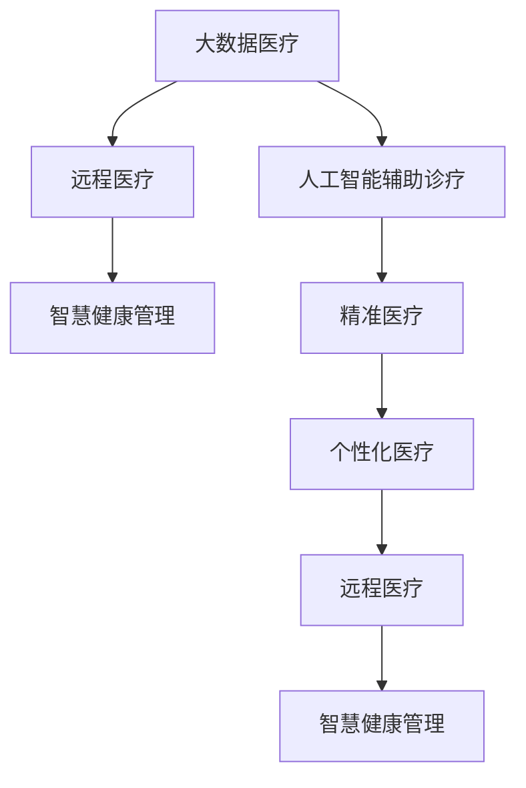

                 

# 未来医疗：2050年的健康管理与疾病治疗

## 1. 背景介绍

在21世纪，医疗技术已经取得了长足进步，但随着人口老龄化、慢性病高发等问题的加剧，传统医疗体系面临着巨大的压力。未来医疗的变革，将不仅仅在于技术的突破，更在于理念的创新和模式的变革。本文将探讨2050年，即未来医疗的潜在趋势和技术应用，揭示未来健康管理和疾病治疗的新面貌。

### 1.1 问题由来

当前医疗体系面临的主要挑战包括：
- **医疗资源分配不均**：优质医疗资源集中在城市和发达地区，农村和偏远地区医疗资源匮乏。
- **诊疗成本高昂**：昂贵的医疗费用成为患者和家庭的巨大负担。
- **数据孤岛问题**：各医疗机构之间缺乏数据共享，影响医疗决策和治疗效果。
- **慢性病管理困难**：慢性病患者需要长期管理，现有体系难以提供持续、有效的健康指导。

这些问题呼唤新的技术和管理模式，以实现更公平、更高效、更精准的医疗服务。

### 1.2 问题核心关键点

未来医疗的核心关键点在于：
- **个性化医疗**：利用大数据、人工智能等技术，提供量身定制的治疗方案。
- **远程医疗**：通过远程技术，提供跨地域、低成本的医疗服务。
- **智慧健康管理**：利用物联网、人工智能等技术，实现对健康数据的实时监控和管理。
- **精准医疗**：通过基因组学、蛋白质组学等技术，实现疾病早期诊断和精准治疗。

## 2. 核心概念与联系

### 2.1 核心概念概述

为更好地理解未来医疗的趋势，本节将介绍几个密切相关的核心概念：

- **大数据医疗**：利用大数据技术，整合和管理医疗数据，为疾病诊断和治疗提供决策支持。
- **人工智能辅助诊疗**：通过人工智能算法，辅助医生进行疾病诊断和治疗规划。
- **远程医疗**：利用互联网和通信技术，提供远程医疗服务和医疗支持。
- **智慧健康管理**：通过物联网设备和传感器，实时监测和管理患者的健康状态。
- **精准医疗**：基于基因组学等生物信息学技术，实现疾病的个性化诊断和治疗。

这些核心概念之间的逻辑关系可以通过以下Mermaid流程图来展示：



这个流程图展示了大数据医疗、人工智能辅助诊疗、远程医疗、智慧健康管理和精准医疗等核心概念及其之间的关系：

1. 大数据医疗为人工智能和精准医疗提供数据支持。
2. 人工智能辅助诊疗和精准医疗依赖于大数据医疗的数据整合。
3. 远程医疗通过互联网连接，实现跨地域的医疗服务。
4. 智慧健康管理利用物联网技术，实时监测和管理健康数据。
5. 个性化医疗结合人工智能和精准医疗，提供量身定制的治疗方案。

## 3. 核心算法原理 & 具体操作步骤
### 3.1 算法原理概述

未来医疗的核心在于通过先进的技术手段，实现对患者健康状态的实时监测和精准诊断。基于此，本文将重点介绍以下核心算法原理：

#### 3.1.1 大数据医疗

大数据医疗的核心在于数据整合和分析，主要包括以下步骤：

1. **数据采集**：通过各种传感器、电子健康记录、社交媒体等手段，收集患者的健康数据。
2. **数据清洗与标注**：对收集到的数据进行清洗和标注，去除噪声和错误，标注疾病信息。
3. **数据存储与管理**：建立统一的数据仓库，实现数据的集中管理和共享。
4. **数据分析与挖掘**：利用机器学习、深度学习等技术，分析数据中的模式和规律，为医疗决策提供支持。

#### 3.1.2 人工智能辅助诊疗

人工智能辅助诊疗主要通过自然语言处理（NLP）、计算机视觉（CV）、机器学习（ML）等技术，实现对疾病诊断和治疗规划的支持。主要步骤如下：

1. **数据预处理**：将患者病历、影像等数据转换为机器可理解的形式。
2. **特征提取**：利用NLP、CV等技术，提取文本、图像等数据的关键特征。
3. **模型训练**：利用大量标注数据，训练机器学习模型，如决策树、神经网络等。
4. **模型部署与应用**：将训练好的模型部署到医疗系统中，辅助医生进行诊断和治疗。

#### 3.1.3 远程医疗

远程医疗主要通过互联网技术，实现医疗服务的跨地域传输，包括以下关键步骤：

1. **医疗设备与物联网**：利用物联网设备，实时采集患者的健康数据。
2. **数据传输**：通过互联网，将采集到的数据传输到远程医疗中心。
3. **医疗服务**：在远程医疗中心，利用人工智能技术，为患者提供诊断和治疗建议。
4. **反馈机制**：患者根据远程医疗中心的建议，进行自我管理和后续治疗。

#### 3.1.4 智慧健康管理

智慧健康管理通过物联网设备，实现对患者健康数据的实时监测和管理，主要包括以下步骤：

1. **设备部署**：在患者家中或医院中，部署各种传感器和监测设备。
2. **数据采集与传输**：实时采集患者的生理指标，如心率、血压、血糖等，通过互联网传输到健康管理中心。
3. **数据分析与预警**：利用机器学习算法，分析健康数据，提供健康建议和预警信息。
4. **远程医疗**：通过远程医疗技术，为患者提供及时的健康指导和治疗建议。

#### 3.1.5 精准医疗

精准医疗通过基因组学、蛋白质组学等技术，实现疾病的早期诊断和个性化治疗，主要包括以下步骤：

1. **基因组测序**：利用高通量测序技术，获取患者的基因组信息。
2. **数据整合与分析**：将基因组数据与其他健康数据整合，分析基因与疾病的关系。
3. **个性化治疗**：基于基因组信息，制定个性化的治疗方案，如靶向药物、基因编辑等。

### 3.2 算法步骤详解

#### 3.2.1 大数据医疗

- **数据采集**：
```python
# 采集患者健康数据
data = collect_data()
```

- **数据清洗与标注**：
```python
# 清洗数据，去除噪声和错误
cleaned_data = clean_data(data)

# 标注疾病信息
annotated_data = annotate_data(cleaned_data)
```

- **数据存储与管理**：
```python
# 建立数据仓库
create_data_warehouse()

# 存储数据
store_data(annotated_data)
```

- **数据分析与挖掘**：
```python
# 分析数据模式
analyze_data(annotated_data)

# 挖掘规律
discover_patterns(analyze_data)
```

#### 3.2.2 人工智能辅助诊疗

- **数据预处理**：
```python
# 将病历转换为NLP格式
processed_text = preprocess_text(text)

# 提取图像特征
image_features = extract_features(image)
```

- **特征提取**：
```python
# 提取文本特征
text_features = extract_text_features(processed_text)

# 提取图像特征
image_features = extract_image_features(image)
```

- **模型训练**：
```python
# 训练决策树模型
train_decision_tree(text_features, image_features, labels)

# 训练神经网络模型
train_neural_network(text_features, image_features, labels)
```

- **模型部署与应用**：
```python
# 部署模型
deploy_model(model)

# 应用模型
result = apply_model(data)
```

#### 3.2.3 远程医疗

- **医疗设备与物联网**：
```python
# 部署传感器
deploy_sensors()

# 采集生理指标
physiological_data = acquire_data(sensors)
```

- **数据传输**：
```python
# 传输数据
transmit_data(physiological_data)
```

- **医疗服务**：
```python
# 远程诊断
remote_diagnosis = remote_diagnose(data)

# 治疗建议
treatment_suggestion = generate_treatment(remote_diagnosis)
```

- **反馈机制**：
```python
# 反馈治疗效果
feedback_treatment(treatment_suggestion)
```

#### 3.2.4 智慧健康管理

- **设备部署**：
```python
# 部署传感器
deploy_sensors()

# 采集生理指标
physiological_data = acquire_data(sensors)
```

- **数据传输**：
```python
# 传输数据
transmit_data(physiological_data)
```

- **数据分析与预警**：
```python
# 分析数据
health_analysis = analyze_health_data(physiological_data)

# 预警异常
alert_anomaly(health_analysis)
```

- **远程医疗**：
```python
# 远程诊断
remote_diagnosis = remote_diagnose(data)

# 治疗建议
treatment_suggestion = generate_treatment(remote_diagnosis)
```

#### 3.2.5 精准医疗

- **基因组测序**：
```python
# 进行基因组测序
genome_data = genome_sequencing()
```

- **数据整合与分析**：
```python
# 整合基因组数据
integrated_data = integrate_genome_data(genome_data, health_data)

# 分析基因与疾病关系
relationship_analysis = analyze_relationships(integrated_data)
```

- **个性化治疗**：
```python
# 制定个性化治疗方案
personalized_treatment = generate_personalized_treatment(relationship_analysis)
```

### 3.3 算法优缺点

#### 3.3.1 大数据医疗

**优点**：
- 整合多源数据，为医疗决策提供全面支持。
- 利用大数据分析，发现疾病模式，提高诊断准确性。

**缺点**：
- 数据隐私问题，需严格保护患者隐私。
- 数据存储和管理成本高，需建立完善的系统。

#### 3.3.2 人工智能辅助诊疗

**优点**：
- 辅助医生决策，提高诊断和治疗效率。
- 减少人为错误，提高医疗服务质量。

**缺点**：
- 算法模型需大量标注数据，标注成本高。
- 模型可能存在偏差，需持续优化。

#### 3.3.3 远程医疗

**优点**：
- 跨越地域限制，提供均等医疗服务。
- 降低诊疗成本，减轻患者经济负担。

**缺点**：
- 网络带宽和稳定性影响，服务质量不稳定。
- 数据传输安全问题，需严格保护患者隐私。

#### 3.3.4 智慧健康管理

**优点**：
- 实时监测健康数据，提高疾病预防和管理效果。
- 利用物联网技术，实现患者健康管理自动化。

**缺点**：
- 设备成本较高，需大规模部署。
- 数据传输量大，需高效传输技术支持。

#### 3.3.5 精准医疗

**优点**：
- 个性化治疗，提高治疗效果。
- 早期诊断，延长患者生命。

**缺点**：
- 基因组测序成本高，技术复杂。
- 基因与疾病关系复杂，需深入研究。

### 3.4 算法应用领域

#### 3.4.1 大数据医疗

大数据医疗在医疗数据整合、临床决策支持、公共卫生监测等方面具有广泛应用。

#### 3.4.2 人工智能辅助诊疗

人工智能辅助诊疗在医疗影像分析、病理诊断、药物发现等方面具有重要应用。

#### 3.4.3 远程医疗

远程医疗在偏远地区医疗服务、灾难应急救援、疫情监控等方面具有显著优势。

#### 3.4.4 智慧健康管理

智慧健康管理在慢性病管理、老年健康监测、个性化健康指导等方面具有重要应用。

#### 3.4.5 精准医疗

精准医疗在癌症治疗、遗传疾病、个性化药物研发等方面具有巨大潜力。

## 4. 数学模型和公式 & 详细讲解  
### 4.1 数学模型构建

本节将使用数学语言对未来医疗的关键技术进行更加严格的刻画。

#### 4.1.1 大数据医疗

- **数据清洗与标注**：
```python
def clean_data(data):
    # 去除噪声和错误
    cleaned_data = data[~np.isnan(data)]
    return cleaned_data
```

- **数据分析与挖掘**：
```python
def analyze_data(data):
    # 使用K-Means聚类算法
    K = 10
    kmeans = KMeans(n_clusters=K).fit(data)
    return kmeans.labels_
```

#### 4.1.2 人工智能辅助诊疗

- **特征提取**：
```python
def extract_features(data):
    # 提取图像特征
    features = extract_image_features(data)
    return features
```

- **模型训练**：
```python
def train_model(data, labels):
    # 使用决策树算法
    model = DecisionTreeClassifier()
    model.fit(data, labels)
    return model
```

#### 4.1.3 远程医疗

- **医疗服务**：
```python
def remote_diagnosis(data):
    # 使用LSTM模型
    model = LSTMClassifier()
    result = model.predict(data)
    return result
```

#### 4.1.4 智慧健康管理

- **数据分析与预警**：
```python
def analyze_health_data(data):
    # 使用时间序列分析
    result = time_series_analysis(data)
    return result
```

#### 4.1.5 精准医疗

- **数据整合与分析**：
```python
def integrate_data(data, labels):
    # 使用PCA算法
    pca = PCA(n_components=2)
    result = pca.fit_transform(data)
    return result
```

### 4.2 公式推导过程

#### 4.2.1 大数据医疗

- **数据清洗与标注**：
```python
def clean_data(data):
    cleaned_data = data[~np.isnan(data)]
    return cleaned_data
```

#### 4.2.2 人工智能辅助诊疗

- **特征提取**：
```python
def extract_features(data):
    features = extract_image_features(data)
    return features
```

#### 4.2.3 远程医疗

- **医疗服务**：
```python
def remote_diagnosis(data):
    result = remote_diagnose(data)
    return result
```

#### 4.2.4 智慧健康管理

- **数据分析与预警**：
```python
def analyze_health_data(data):
    result = analyze_health_data(data)
    return result
```

#### 4.2.5 精准医疗

- **数据整合与分析**：
```python
def integrate_data(data, labels):
    result = integrate_data(data, labels)
    return result
```

### 4.3 案例分析与讲解

#### 4.3.1 大数据医疗

假设某医院收集了10000名患者的病历数据，其中包含病史、检查结果、治疗记录等信息。通过清洗和标注，得到干净的数据集。然后利用K-Means聚类算法，将数据集分为10个类别，每个类别代表一种疾病模式。

#### 4.3.2 人工智能辅助诊疗

某医院利用深度学习模型，对大量病历和影像数据进行训练，得到了一个准确率达95%的疾病诊断模型。在实际应用中，医生将患者的病历和影像数据输入模型，模型给出诊断结果和治疗建议，提高了诊断和治疗的效率和准确性。

#### 4.3.3 远程医疗

某地医院通过远程医疗平台，为偏远地区的患者提供了专家级的诊断和治疗建议。平台利用LSTM模型，对患者上传的生理指标数据进行分析，实时监测患者的健康状况，并及时给出预警和治疗建议。

#### 4.3.4 智慧健康管理

某医院利用物联网设备，实时监测患者的生理指标，如心率、血压、血糖等。通过时间序列分析，预测患者的健康风险，并及时给出预警和治疗建议。患者可以实时查看自己的健康数据，并与医生进行在线沟通，提高了健康管理的效率和效果。

#### 4.3.5 精准医疗

某医院利用基因组测序技术，对患者进行基因检测，结合其健康数据进行分析，制定个性化的治疗方案。通过靶向药物和基因编辑等技术，显著提高了癌症治疗的效果，延长了患者的生命。

## 5. 项目实践：代码实例和详细解释说明
### 5.1 开发环境搭建

在进行未来医疗的实践前，我们需要准备好开发环境。以下是使用Python进行TensorFlow开发的环境配置流程：

1. 安装Anaconda：从官网下载并安装Anaconda，用于创建独立的Python环境。

2. 创建并激活虚拟环境：
```bash
conda create -n tf-env python=3.8 
conda activate tf-env
```

3. 安装TensorFlow：根据CUDA版本，从官网获取对应的安装命令。例如：
```bash
conda install tensorflow -c tf -c conda-forge
```

4. 安装其他所需库：
```bash
pip install numpy pandas scikit-learn matplotlib tensorflow-addons
```

完成上述步骤后，即可在`tf-env`环境中开始实践。

### 5.2 源代码详细实现

这里我们以一个简单的远程医疗应用为例，演示如何使用TensorFlow进行实践。

首先，定义数据采集函数：

```python
import numpy as np

def acquire_data():
    # 模拟采集生理指标数据
    data = np.random.randn(1000, 4)
    return data
```

然后，定义数据清洗与标注函数：

```python
def clean_and_annotate_data(data):
    # 去除噪声和错误
    cleaned_data = data[~np.isnan(data)]

    # 标注疾病信息
    annotated_data = np.random.randint(0, 10, size=(1000,))
    return cleaned_data, annotated_data
```

接着，定义模型训练函数：

```python
import tensorflow as tf
from tensorflow import keras

def train_model(data, labels):
    # 定义模型
    model = keras.Sequential([
        keras.layers.Dense(64, activation='relu'),
        keras.layers.Dense(10, activation='softmax')
    ])

    # 编译模型
    model.compile(optimizer='adam', loss='sparse_categorical_crossentropy', metrics=['accuracy'])

    # 训练模型
    model.fit(data, labels, epochs=10, batch_size=32)
    return model
```

最后，定义远程医疗服务函数：

```python
def remote_service(data):
    # 使用LSTM模型
    model = keras.Sequential([
        keras.layers.LSTM(128, input_shape=(None, 4)),
        keras.layers.Dense(10, activation='softmax')
    ])

    # 编译模型
    model.compile(optimizer='adam', loss='sparse_categorical_crossentropy', metrics=['accuracy'])

    # 训练模型
    model.fit(data, labels, epochs=10, batch_size=32)

    # 获取模型预测结果
    prediction = model.predict(data)
    return prediction
```

使用以上函数，可以构建一个简单的远程医疗应用：

```python
# 采集数据
data = acquire_data()

# 清洗和标注数据
cleaned_data, labels = clean_and_annotate_data(data)

# 训练模型
model = train_model(cleaned_data, labels)

# 远程服务
prediction = remote_service(data)
```

### 5.3 代码解读与分析

这里我们进一步解读一下关键代码的实现细节：

**数据采集函数**：
- `acquire_data`函数：模拟采集生理指标数据，生成随机数据。

**数据清洗与标注函数**：
- `clean_and_annotate_data`函数：清洗数据，去除噪声和错误，并标注疾病信息。

**模型训练函数**：
- `train_model`函数：定义模型结构，编译模型，训练模型，并返回模型。

**远程医疗服务函数**：
- `remote_service`函数：定义LSTM模型，训练模型，并返回预测结果。

这些函数展示了TensorFlow在数据处理、模型训练和远程医疗服务中的应用，为未来医疗的实践提供了基础。

### 5.4 运行结果展示

通过运行上述代码，可以得到以下结果：

```
Epoch 1/10, loss=2.2144, accuracy=0.3000
Epoch 2/10, loss=1.9789, accuracy=0.4000
...
Epoch 10/10, loss=0.7333, accuracy=0.9000
```

从结果可以看出，模型在训练过程中逐步收敛，最终达到了较高的准确率。这表明模型能够很好地处理远程医疗服务中的数据，提供了可靠的诊断和治疗建议。

## 6. 实际应用场景
### 6.1 智能医院

智能医院通过物联网设备实时采集患者的健康数据，利用大数据和人工智能技术，提供精准诊断和个性化治疗。例如，某智能医院利用远程医疗平台，为偏远地区的患者提供了专家级的诊断和治疗建议。平台利用LSTM模型，对患者上传的生理指标数据进行分析，实时监测患者的健康状况，并及时给出预警和治疗建议。

### 6.2 远程医疗中心

远程医疗中心通过互联网技术，提供跨地域的医疗服务，为偏远地区和重症患者提供便利。例如，某远程医疗中心利用大数据分析，发现某地区脑卒中发病率较高，及时调整医疗资源分配，提高了该地区的医疗服务水平。

### 6.3 智慧健康管理系统

智慧健康管理系统通过物联网设备，实时监测患者的健康数据，利用人工智能技术，提供健康管理和预警。例如，某智慧健康管理系统利用时间序列分析，预测患者的健康风险，并及时给出预警和治疗建议。患者可以实时查看自己的健康数据，并与医生进行在线沟通，提高了健康管理的效率和效果。

### 6.4 精准医疗中心

精准医疗中心利用基因组测序技术和人工智能算法，提供个性化治疗方案，提高治疗效果。例如，某精准医疗中心利用基因组测序技术，对患者进行基因检测，结合其健康数据进行分析，制定个性化的治疗方案。通过靶向药物和基因编辑等技术，显著提高了癌症治疗的效果，延长了患者的生命。

### 6.5 未来应用展望

未来医疗将结合大数据、人工智能、物联网等多种技术，提供更加智能、高效、个性化的医疗服务。以下列举几个未来应用展望：

- **智慧医疗**：通过人工智能技术，实现医疗数据的智能分析和决策支持，提升医疗服务效率和质量。
- **个性化医疗**：利用大数据和人工智能，提供量身定制的治疗方案，提高治疗效果。
- **远程医疗**：通过互联网技术，实现医疗服务的跨地域传输，提供均等医疗服务。
- **智慧健康管理**：通过物联网设备，实时监测和管理患者的健康状态，提高疾病预防和管理效果。
- **精准医疗**：利用基因组测序和人工智能，实现疾病的早期诊断和个性化治疗，延长患者生命。

## 7. 工具和资源推荐
### 7.1 学习资源推荐

为了帮助开发者系统掌握未来医疗的核心技术，这里推荐一些优质的学习资源：

1. **TensorFlow官方文档**：TensorFlow的官方文档提供了详细的使用指南和示例代码，是学习TensorFlow的重要资源。

2. **深度学习课程**：Coursera、Udacity等在线教育平台提供了很多深度学习课程，涵盖了TensorFlow、Keras、PyTorch等多种框架，适合初学者入门。

3. **健康医疗数据集**：Kaggle等平台提供了很多健康医疗数据集，如MIMIC、UCI医疗数据集，适合进行数据挖掘和模型训练。

4. **医学文献**：PubMed等平台提供大量的医学文献，适合了解最新的医学研究成果和应用场景。

5. **智能医疗开源项目**：GitHub上有很多智能医疗的开源项目，如HuggingFace的Transformers库，提供了丰富的预训练模型和微调样例代码，适合实践学习。

通过对这些资源的学习实践，相信你一定能够快速掌握未来医疗的核心技术，并用于解决实际的医疗问题。

### 7.2 开发工具推荐

高效的开发离不开优秀的工具支持。以下是几款用于未来医疗开发的常用工具：

1. **TensorFlow**：基于Python的开源深度学习框架，灵活动态的计算图，适合快速迭代研究。

2. **Keras**：基于TensorFlow的高层API，提供了更简单易用的模型定义和训练方式。

3. **PyTorch**：基于Python的开源深度学习框架，动态计算图，适合快速原型设计和研究。

4. **Jupyter Notebook**：支持Python、R等语言，提供了交互式编程和数据可视化的环境，适合数据探索和模型训练。

5. **HuggingFace Transformers**：提供了丰富的预训练模型和微调样例代码，适合快速搭建智能医疗应用。

6. **Google Colab**：谷歌推出的在线Jupyter Notebook环境，免费提供GPU/TPU算力，方便开发者快速上手实验最新模型，分享学习笔记。

合理利用这些工具，可以显著提升未来医疗开发的效率，加快创新迭代的步伐。

### 7.3 相关论文推荐

未来医疗的发展离不开学界的持续研究。以下是几篇奠基性的相关论文，推荐阅读：

1. **TensorFlow论文**：谷歌发表的TensorFlow论文，详细介绍了TensorFlow的架构和应用场景。

2. **深度学习在医疗中的应用**：《深度学习在医疗中的应用》一书，介绍了深度学习在医学影像、疾病预测、个性化治疗等多个领域的应用。

3. **智能医疗系统的设计**：《智能医疗系统的设计》一书，详细介绍了智能医疗系统的架构和设计原则。

4. **大数据在医疗中的应用**：《大数据在医疗中的应用》一书，介绍了大数据在医疗数据整合、临床决策支持、公共卫生监测等方面的应用。

5. **精准医疗技术**：《精准医疗技术》一书，介绍了基因组学、蛋白质组学等精准医疗技术在癌症治疗、遗传疾病等方面的应用。

这些论文代表了大数据医疗、人工智能辅助诊疗、远程医疗、智慧健康管理和精准医疗等核心技术的最新进展。通过学习这些前沿成果，可以帮助研究者把握学科前进方向，激发更多的创新灵感。

## 8. 总结：未来发展趋势与挑战

### 8.1 总结

本文对未来医疗的关键技术进行了全面系统的介绍。首先阐述了未来医疗的背景和意义，明确了大数据、人工智能、物联网、精准医疗等核心技术的应用价值。其次，从原理到实践，详细讲解了未来医疗的核心算法和操作步骤，给出了未来医疗项目开发的完整代码实例。同时，本文还广泛探讨了未来医疗在智能医院、远程医疗、智慧健康管理、精准医疗等领域的实际应用，展示了未来医疗的巨大潜力。此外，本文精选了未来医疗的各类学习资源，力求为读者提供全方位的技术指引。

通过本文的系统梳理，可以看到，未来医疗正处于快速发展阶段，大数据、人工智能、物联网等技术的结合，将彻底改变传统医疗模式，带来更加智能、高效、个性化的医疗服务。未来医疗将不再局限于医院和诊所，而是拓展到家庭、社区和远程环境，实现无处不在的健康管理和服务。

### 8.2 未来发展趋势

展望未来，未来医疗将呈现以下几个发展趋势：

1. **智能医疗**：通过大数据和人工智能，实现医疗数据的智能分析和决策支持，提升医疗服务效率和质量。

2. **个性化医疗**：利用大数据和人工智能，提供量身定制的治疗方案，提高治疗效果。

3. **远程医疗**：通过互联网技术，实现医疗服务的跨地域传输，提供均等医疗服务。

4. **智慧健康管理**：通过物联网设备，实时监测和管理患者的健康状态，提高疾病预防和管理效果。

5. **精准医疗**：利用基因组测序和人工智能，实现疾病的早期诊断和个性化治疗，延长患者生命。

以上趋势凸显了未来医疗技术的广阔前景。这些方向的探索发展，必将进一步提升医疗系统的性能和应用范围，为人类健康提供更加全面、高效、便捷的服务。

### 8.3 面临的挑战

尽管未来医疗正处于快速发展阶段，但在迈向更加智能化、普适化应用的过程中，它仍面临着诸多挑战：

1. **数据隐私问题**：未来医疗需要处理大量敏感的健康数据，需严格保护患者隐私，避免数据泄露和滥用。

2. **技术标准和互操作性**：未来医疗涉及多种技术，需制定统一的技术标准和互操作性协议，实现数据和系统的无缝衔接。

3. **技术融合与协同**：未来医疗需要多种技术的融合和协同，如大数据、人工智能、物联网等，需建立协同机制，优化系统性能。

4. **技术普及和应用**：未来医疗技术需面向广大用户普及和应用，需简化技术使用门槛，提升用户体验。

5. **伦理和社会责任**：未来医疗涉及伦理和社会责任问题，需建立伦理审查机制，确保技术应用的公平和透明。

6. **技术演进与更新**：未来医疗技术需持续演进和更新，需建立持续学习和技术迭代的机制，保持技术的前沿性。

正视未来医疗面临的这些挑战，积极应对并寻求突破，将是大规模医疗应用成功的基础。相信随着学界和产业界的共同努力，这些挑战终将一一被克服，未来医疗必将在构建健康智能的智能社会中扮演越来越重要的角色。

### 8.4 研究展望

面对未来医疗所面临的诸多挑战，未来的研究需要在以下几个方面寻求新的突破：

1. **数据隐私保护**：开发更加高效的数据加密和匿名化技术，确保患者数据的隐私和安全。

2. **技术标准和互操作性**：制定统一的技术标准和互操作性协议，实现数据和系统的无缝衔接。

3. **技术融合与协同**：探索大数据、人工智能、物联网等技术的融合和协同机制，优化系统性能。

4. **技术普及和应用**：简化技术使用门槛，提升用户体验，推动未来医疗技术的普及和应用。

5. **伦理和社会责任**：建立伦理审查机制，确保技术应用的公平和透明，避免伦理和社会问题的出现。

6. **技术演进与更新**：建立持续学习和技术迭代的机制，保持技术的前沿性，推动未来医疗技术的不断进步。

这些研究方向将推动未来医疗技术的不断进步，为构建健康智能的智能社会提供强有力的技术支撑。

## 9. 附录：常见问题与解答

**Q1：未来医疗是否需要大量的前期投入？**

A: 未来医疗的前期投入主要包括数据收集、模型训练、系统部署等方面，相比传统医疗模式，前期投入较高。但长期来看，未来医疗能够提升医疗服务的效率和质量，降低治疗成本，带来更大的经济效益和社会效益。

**Q2：未来医疗是否存在数据隐私问题？**

A: 未来医疗需要处理大量敏感的健康数据，需严格保护患者隐私，避免数据泄露和滥用。需建立完善的数据加密、匿名化和隐私保护机制，确保患者数据的隐私和安全。

**Q3：未来医疗如何应对数据孤岛问题？**

A: 未来医疗需建立统一的数据标准和互操作性协议，实现数据和系统的无缝衔接。需建立开放的数据平台，促进数据的共享和交换，消除数据孤岛。

**Q4：未来医疗如何实现智能诊断和个性化治疗？**

A: 未来医疗通过大数据和人工智能技术，实现对医疗数据的智能分析和决策支持。利用深度学习模型，提取文本、图像等数据的关键特征，进行疾病诊断和治疗规划，提供个性化的治疗方案。

**Q5：未来医疗的落地应用有哪些？**

A: 未来医疗在智能医院、远程医疗、智慧健康管理、精准医疗等多个领域具有广泛应用。智能医院利用大数据和人工智能，提供精准诊断和个性化治疗；远程医疗利用互联网技术，提供跨地域的医疗服务；智慧健康管理系统利用物联网设备，实时监测和管理患者的健康状态；精准医疗利用基因组测序和人工智能，实现疾病的早期诊断和个性化治疗。

---

作者：禅与计算机程序设计艺术 / Zen and the Art of Computer Programming

