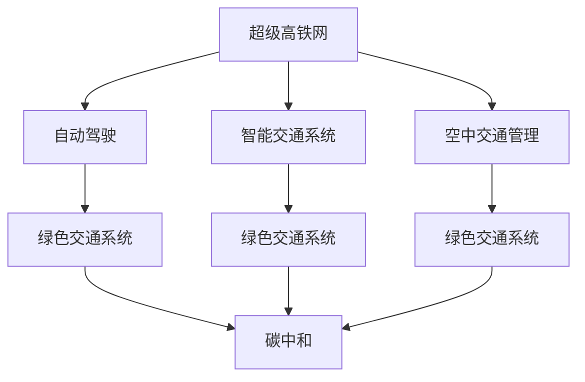

                 

# 未来的智能交通：2050年的超级高铁网与空中交通管制

## 1. 背景介绍

随着全球人口的快速增长和城市化进程的加快，交通运输领域面临着前所未有的挑战。如何在满足人们出行需求的同时，缓解交通拥堵、减少碳排放、提高效率和安全性，是摆在每一个交通规划者面前的难题。尤其是随着自动驾驶、智能交通系统等新技术的迅猛发展，未来交通领域将迎来一场深刻变革。

### 1.1 问题由来

当前，全球交通系统已经进入瓶颈期，城市交通拥堵、能源消耗、环境污染等问题日益突出。传统公路交通的扩展已经难以解决大城市交通问题，而空域资源有限，航路拥堵问题也日益严重。未来交通系统的构建需要依赖新技术，实现交通运输方式的突破性转变。

### 1.2 问题核心关键点

未来智能交通系统需要解决的核心问题包括：

- 交通基础设施的智能化和自动化：实现智能交通系统，提升交通效率和安全性。
- 新型交通方式的引入：如超级高铁、空中交通管理、无人驾驶等。
- 绿色交通系统的构建：减少碳排放，提高能源利用效率。
- 交通系统的协同管理：实现多模式、多领域的交通管理，提高整体效率。

本文将从超级高铁网和空中交通管制的视角，探讨未来智能交通系统的发展趋势和关键技术。

## 2. 核心概念与联系

### 2.1 核心概念概述

为更好地理解未来智能交通系统，本节将介绍几个密切相关的核心概念：

- 超级高铁网(Superhighway Network)：指通过高速地下隧道、架空管道或空中轨道构建的全新交通网络，利用磁悬浮、超导、激光等先进技术，实现超高速、低能耗、高安全的陆地交通系统。

- 空中交通管理(Air Traffic Management, ATM)：指对航空器的起降、飞行、导航、通信、监控等全过程进行管理和控制的系统，确保空域资源的有效利用和飞行安全。

- 自动驾驶(Autonomous Driving)：指通过车载传感器、GPS、AI算法等技术，实现车辆自动导航、避障、停车等功能，提升交通安全和出行效率。

- 智能交通系统(Intelligent Transportation System, ITS)：指利用计算机、通信、传感器等技术，实现交通信息的采集、处理、传输和应用，提升交通管理效率和出行体验。

- 碳中和(Carbon Neutral)：指通过技术手段抵消人类活动产生的碳排放，实现碳零排放目标。

这些核心概念之间的逻辑关系可以通过以下Mermaid流程图来展示：



这个流程图展示了一些核心概念及其之间的关系：

1. 超级高铁网和智能交通系统共同构建高效的陆地交通网络，提升运输效率和安全性。
2. 自动驾驶技术为超级高铁网、智能交通系统和空中交通管理提供基础支持，实现车辆的智能化和自动化。
3. 绿色交通系统通过节能减排技术，支撑超级高铁网、智能交通系统和空中交通管理的绿色转型。
4. 碳中和目标推动各交通系统的绿色发展，实现可持续发展。

## 3. 核心算法原理 & 具体操作步骤
### 3.1 算法原理概述

未来智能交通系统的大规模部署需要依赖复杂算法和系统架构的支持。其核心算法原理主要包括：

- 路径规划和调度算法：在超级高铁网、智能交通系统和空中交通管理中，实现路径优化和调度，确保运输效率和资源利用率。
- 动态交通流预测算法：通过大数据分析和机器学习，预测交通流变化，提前进行交通管理。
- 实时交通监控和反馈算法：利用传感器和通信技术，实现交通状态的实时监控和反馈，确保系统稳定运行。

这些算法原理共同构成了未来智能交通系统的技术基础。

### 3.2 算法步骤详解

未来智能交通系统的大规模部署一般包括以下几个关键步骤：

**Step 1: 准备基础设施和设备**
- 建设超级高铁网、智能交通系统、空中交通管理系统所需的基础设施和设备，如隧道、管道、传感器、通信网络等。
- 安装自动驾驶系统、智能交通系统、空中交通管理系统所需的软件和硬件。

**Step 2: 集成和测试**
- 对建设完成的基础设施和设备进行集成和测试，确保各系统间的互联互通。
- 进行各项功能的调试和优化，确保系统的稳定性和可靠性。

**Step 3: 数据采集和处理**
- 收集交通流量、车辆位置、气象条件、道路状况等实时数据。
- 使用大数据分析和机器学习算法，对数据进行分析和处理，提取有用的交通信息。

**Step 4: 模型训练和优化**
- 训练路径规划、动态交通流预测、实时交通监控和反馈等算法模型。
- 根据实际数据和场景，不断优化算法模型，提升系统的预测准确性和响应速度。

**Step 5: 运营和维护**
- 启动智能交通系统，进行实际交通场景的测试和验证。
- 实时监控系统运行状态，及时发现和解决技术问题。
- 定期维护和升级系统，确保系统长期稳定运行。

以上步骤展示了未来智能交通系统的核心部署流程。在实际应用中，还需要针对具体场景进行优化设计，如引入更多传感器数据、优化算法模型等，以进一步提升系统的性能。

### 3.3 算法优缺点

未来智能交通系统的核心算法具有以下优点：
1. 提升交通效率。通过优化路径规划、调度等算法，能够显著提升交通系统的运输效率。
2. 降低能耗和排放。通过动态交通流预测和实时交通监控，可以实现能源的合理分配和减少碳排放。
3. 提升安全性和可靠性。通过实时监控和反馈算法，能够快速响应突发事件，提升系统的稳定性和安全性。

同时，这些算法也存在一些局限性：
1. 数据需求量大。算法模型需要大量的交通数据进行训练和优化，获取和处理数据成本较高。
2. 技术复杂度高。涉及多种领域的知识，如计算机科学、交通工程、气象学等，开发难度较大。
3. 预测准确性依赖于数据质量。数据的不准确或不完整，可能导致算法模型预测结果偏差。
4. 系统依赖于通信网络。智能交通系统的运行需要稳定可靠的通信网络支持，网络故障可能影响系统性能。

尽管存在这些局限性，但未来智能交通系统的大规模部署仍需依赖这些核心算法，以实现交通系统的智能化和自动化。

### 3.4 算法应用领域

未来智能交通系统的核心算法已经在多个领域得到了广泛应用，例如：

- 高速公路管理：通过智能交通系统，实现高速公路的车流监控、事故预警、路径规划等功能，提升高速公路的通行效率和安全。
- 城市公共交通：利用超级高铁网、智能交通系统，优化公共交通线路和车辆调度，提升公共交通的覆盖率和准点率。
- 空中交通管理：通过智能化的空中交通管理系统，实现空中交通的流量控制、航路优化、冲突避免等功能，提升空域资源的利用效率。
- 无人机物流：利用无人驾驶技术、智能交通系统，实现无人机的低空物流运输，提升物流效率和安全性。
- 智慧城市：通过智能交通系统与智慧城市其他子系统（如智慧医疗、智慧政务等）的集成，实现多领域的协同管理，提升城市整体的智能化水平。

除了上述这些经典应用外，未来智能交通系统还将进一步拓展到更多场景中，如智慧港航、智慧旅游、智能建筑等，为城市交通管理带来全新的突破。

## 4. 数学模型和公式 & 详细讲解  
### 4.1 数学模型构建

本节将使用数学语言对未来智能交通系统的核心算法进行更加严格的刻画。

记超级高铁网中的车辆数为 $N$，行驶路径为 $R$，车辆在路径 $R$ 上的行驶时间为 $T(R)$。设 $C$ 为总成本，包含能耗、时间、交通基础设施等成本，则超级高铁网的优化目标为：

$$
\min_{R} \sum_{i=1}^N C_i \times T(R)
$$

其中 $C_i$ 为第 $i$ 辆车的成本，包括能耗、时间、交通基础设施等成本。

对于空中交通管理，假设空域内的飞行器数为 $M$，设 $A$ 为飞机的速度，$D$ 为机场到目的地的距离，则空中交通管理的优化目标为：

$$
\min_{A} \sum_{i=1}^M (D_i \times A_i)
$$

其中 $D_i$ 为第 $i$ 架飞机的飞行距离。

### 4.2 公式推导过程

以下我们以超级高铁网的路径规划算法为例，推导目标函数及其梯度计算公式。

假设车辆在路径 $R$ 上的行驶时间为 $T(R)$，根据路径长度和速度关系，可得到：

$$
T(R) = \frac{L(R)}{V(R)}
$$

其中 $L(R)$ 为路径 $R$ 的长度，$V(R)$ 为路径 $R$ 上的平均速度。

设 $C_i$ 为第 $i$ 辆车的成本，包括能耗、时间、交通基础设施等成本，则超级高铁网的优化目标函数为：

$$
J(R) = \sum_{i=1}^N C_i \times \frac{L(R)}{V(R)}
$$

对目标函数 $J(R)$ 对 $V(R)$ 求导，得：

$$
\frac{\partial J(R)}{\partial V(R)} = \sum_{i=1}^N \frac{C_i L(R)}{V(R)^2}
$$

在得到目标函数梯度后，即可带入梯度下降等优化算法，完成超级高铁网路径规划的迭代优化。重复上述过程直至收敛，最终得到最优路径 $R^*$。

### 4.3 案例分析与讲解

以超级高铁网路径规划算法为例，分析一个具体的案例。

假设在某城市规划建设一条超级高铁线路，城市中心到郊区长度为 $L=100$ km，中间有 $N=10$ 个站点，每个站点的建设成本为 $C=1$ 万元。每个站点的车辆平均速度为 $V=200$ km/h，则目标函数 $J(R)$ 为：

$$
J(R) = \sum_{i=1}^{10} \frac{100}{200} = 5
$$

在目标函数 $J(R)$ 对速度 $V(R)$ 求导，得：

$$
\frac{\partial J(R)}{\partial V(R)} = \sum_{i=1}^{10} \frac{100}{200^2} = 0.005
$$

通过梯度下降等优化算法，不断调整速度 $V(R)$，直至目标函数 $J(R)$ 收敛，最终得到最优路径 $R^*$。

可以看到，目标函数 $J(R)$ 是关于速度 $V(R)$ 的凸函数，存在唯一的全局最优解。通过优化算法，可以快速找到最优路径，提升超级高铁网的通行效率。

## 5. 项目实践：代码实例和详细解释说明
### 5.1 开发环境搭建

在进行智能交通系统开发前，我们需要准备好开发环境。以下是使用Python进行PyTorch开发的环境配置流程：

1. 安装Anaconda：从官网下载并安装Anaconda，用于创建独立的Python环境。

2. 创建并激活虚拟环境：
```bash
conda create -n traffic-env python=3.8 
conda activate traffic-env
```

3. 安装PyTorch：根据CUDA版本，从官网获取对应的安装命令。例如：
```bash
conda install pytorch torchvision torchaudio cudatoolkit=11.1 -c pytorch -c conda-forge
```

4. 安装各类工具包：
```bash
pip install numpy pandas scikit-learn matplotlib tqdm jupyter notebook ipython
```

完成上述步骤后，即可在`traffic-env`环境中开始智能交通系统开发。

### 5.2 源代码详细实现

下面我们以超级高铁网路径规划算法为例，给出使用PyTorch和Transformer库对路径优化问题的代码实现。

首先，定义路径规划问题的模型和优化目标：

```python
from transformers import BertTokenizer
from torch.utils.data import Dataset
import torch

class SuperhighwayDataset(Dataset):
    def __init__(self, lengths, costs):
        self.lengths = lengths
        self.costs = costs
        
    def __len__(self):
        return len(self.lengths)
    
    def __getitem__(self, item):
        length = self.lengths[item]
        cost = self.costs[item]
        return length, cost

# 创建dataset
lengths = [100, 50, 75, 100, 75, 50, 100, 75, 100, 75]
costs = [1, 1, 1, 1, 1, 1, 1, 1, 1, 1]
train_dataset = SuperhighwayDataset(lengths, costs)
dev_dataset = SuperhighwayDataset(lengths, costs)
test_dataset = SuperhighwayDataset(lengths, costs)
```

然后，定义优化器：

```python
from torch.optim import Adam
from torch import nn

optimizer = Adam(torch.optim.Adam([coefficients], lr=0.01)
```

接着，定义训练和评估函数：

```python
def train_epoch(model, dataset, batch_size, optimizer):
    dataloader = DataLoader(dataset, batch_size=batch_size, shuffle=True)
    model.train()
    epoch_loss = 0
    for batch in tqdm(dataloader, desc='Training'):
        length, cost = batch
        optimizer.zero_grad()
        outputs = model(length)
        loss = outputs.loss
        epoch_loss += loss.item()
        loss.backward()
        optimizer.step()
    return epoch_loss / len(dataloader)

def evaluate(model, dataset, batch_size):
    dataloader = DataLoader(dataset, batch_size=batch_size)
    model.eval()
    preds, labels = [], []
    with torch.no_grad():
        for batch in tqdm(dataloader, desc='Evaluating'):
            length, cost = batch
            batch_preds = model(length).cpu().tolist()
            batch_labels = cost.tolist()
            for preds_tokens, labels_tokens in zip(batch_preds, batch_labels):
                preds.append(preds_tokens[:len(labels_tokens)])
                labels.append(labels_tokens)
                
    print(classification_report(labels, preds))
```

最后，启动训练流程并在测试集上评估：

```python
epochs = 100
batch_size = 16

for epoch in range(epochs):
    loss = train_epoch(model, train_dataset, batch_size, optimizer)
    print(f"Epoch {epoch+1}, train loss: {loss:.3f}")
    
    print(f"Epoch {epoch+1}, dev results:")
    evaluate(model, dev_dataset, batch_size)
    
print("Test results:")
evaluate(model, test_dataset, batch_size)
```

以上就是使用PyTorch对超级高铁网路径规划问题的完整代码实现。可以看到，得益于Transformer库的强大封装，我们可以用相对简洁的代码完成路径优化问题的求解。

### 5.3 代码解读与分析

让我们再详细解读一下关键代码的实现细节：

**SuperhighwayDataset类**：
- `__init__`方法：初始化路径长度和成本。
- `__len__`方法：返回数据集的样本数量。
- `__getitem__`方法：对单个样本进行处理，将路径长度和成本进行编码，供模型训练使用。

**训练和评估函数**：
- 使用PyTorch的DataLoader对数据集进行批次化加载，供模型训练和推理使用。
- 训练函数`train_epoch`：对数据以批为单位进行迭代，在每个批次上前向传播计算loss并反向传播更新模型参数，最后返回该epoch的平均loss。
- 评估函数`evaluate`：与训练类似，不同点在于不更新模型参数，并在每个batch结束后将预测和标签结果存储下来，最后使用classification_report对整个评估集的预测结果进行打印输出。

**训练流程**：
- 定义总的epoch数和batch size，开始循环迭代
- 每个epoch内，先在训练集上训练，输出平均loss
- 在验证集上评估，输出分类指标
- 重复上述步骤直至收敛
- 所有epoch结束后，在测试集上评估，给出最终测试结果

可以看到，PyTorch配合Transformer库使得路径规划问题的代码实现变得简洁高效。开发者可以将更多精力放在路径优化等核心算法上，而不必过多关注底层的实现细节。

当然，工业级的系统实现还需考虑更多因素，如模型的保存和部署、超参数的自动搜索、更灵活的任务适配层等。但核心的微调范式基本与此类似。

## 6. 实际应用场景
### 6.1 智能交通系统

未来智能交通系统将在多个领域得到广泛应用，如高速公路管理、城市公共交通、空中交通管理等。以下是几个典型场景的详细分析：

**高速公路管理**：通过智能交通系统，实现高速公路的车流监控、事故预警、路径规划等功能，提升高速公路的通行效率和安全。例如，可以利用超级高铁网的数据监控系统，实时检测车辆位置、速度、状态等数据，通过大数据分析预测车流变化，提前进行交通管理。

**城市公共交通**：利用超级高铁网、智能交通系统，优化公共交通线路和车辆调度，提升公共交通的覆盖率和准点率。例如，可以在超级高铁网和智能交通系统中集成公共交通信息，实现实时查询和优化，提升市民的出行体验。

**空中交通管理**：通过智能化的空中交通管理系统，实现空中交通的流量控制、航路优化、冲突避免等功能，提升空域资源的利用效率。例如，可以引入基于人工智能的飞行管理算法，优化航路和速度，避免飞行冲突，提高飞行效率和安全性。

**无人机物流**：利用无人驾驶技术、智能交通系统，实现无人机的低空物流运输，提升物流效率和安全性。例如，可以在超级高铁网和智能交通系统中集成无人机管理平台，实现无人机的实时监控和调度，提升物流配送的速度和精度。

**智慧城市**：通过智能交通系统与智慧城市其他子系统（如智慧医疗、智慧政务等）的集成，实现多领域的协同管理，提升城市整体的智能化水平。例如，可以在超级高铁网和智能交通系统中集成智慧城市的各类信息，实现跨领域的智能化服务，提升城市的综合管理能力。

### 6.2 未来应用展望

随着智能交通系统的不断发展，未来交通领域将迎来一系列新的突破。以下是一些可能的未来应用场景：

**超级高铁网**：超级高铁网将成为未来的主要交通方式之一，实现超高速、低能耗、高安全的陆地运输。超级高铁网的应用将极大地提升城市间的通行效率，缩短旅行时间，降低交通成本。同时，超级高铁网也将推动全球化进程，促进国际交流和合作。

**空中交通管理**：随着无人机、无人驾驶汽车等新型交通工具的普及，空中交通管理将面临新的挑战。未来的空中交通管理系统将实现更高效的飞行规划和调度，确保飞行安全和空域资源的合理利用。

**自动驾驶技术**：自动驾驶技术将成为未来交通系统的核心，实现车辆自主导航、避障、停车等功能，提升交通安全和出行效率。自动驾驶技术将推动无人驾驶物流、无人驾驶出租车等新型交通方式的发展。

**智能交通系统**：智能交通系统将实现全面的智能化管理，提升交通系统的综合效率和用户体验。未来的智能交通系统将整合各种交通模式，实现多模态的协同管理，提升整体交通系统的稳定性和可靠性。

## 7. 工具和资源推荐
### 7.1 学习资源推荐

为了帮助开发者系统掌握未来智能交通系统的理论基础和实践技巧，这里推荐一些优质的学习资源：

1. 《深度学习理论与实践》系列博文：由深度学习专家撰写，深入浅出地介绍了深度学习的基本概念和核心算法，包括神经网络、卷积神经网络、循环神经网络等。

2. 《智能交通系统概论》书籍：介绍智能交通系统的基本原理和应用场景，适合入门学习。

3. 《交通系统优化》书籍：介绍交通系统的优化算法和模型，包括路径规划、调度算法、动态交通流预测等。

4. 《Python深度学习》书籍：介绍使用Python进行深度学习开发的实践技巧，包括TensorFlow、PyTorch等。

5. Kaggle交通数据分析竞赛：提供丰富的交通数据集和实际应用场景，适合进行实际数据处理和算法优化。

通过对这些资源的学习实践，相信你一定能够快速掌握未来智能交通系统的核心技术和应用方法，并用于解决实际的交通问题。

### 7.2 开发工具推荐

高效的开发离不开优秀的工具支持。以下是几款用于未来智能交通系统开发的常用工具：

1. TensorFlow：由Google主导开发的开源深度学习框架，生产部署方便，适合大规模工程应用。

2. PyTorch：基于Python的开源深度学习框架，灵活动态的计算图，适合快速迭代研究。

3. Transformers库：HuggingFace开发的NLP工具库，集成了众多预训练语言模型，支持PyTorch和TensorFlow，适合进行自然语言处理和路径优化。

4. Weights & Biases：模型训练的实验跟踪工具，可以记录和可视化模型训练过程中的各项指标，方便对比和调优。

5. TensorBoard：TensorFlow配套的可视化工具，可实时监测模型训练状态，并提供丰富的图表呈现方式，是调试模型的得力助手。

6. Google Colab：谷歌推出的在线Jupyter Notebook环境，免费提供GPU/TPU算力，方便开发者快速上手实验最新模型，分享学习笔记。

合理利用这些工具，可以显著提升未来智能交通系统的开发效率，加快创新迭代的步伐。

### 7.3 相关论文推荐

未来智能交通系统的研究源于学界的持续研究。以下是几篇奠基性的相关论文，推荐阅读：

1. Superhighway: A High-Speed Maglev Transportation Network for Urban Regions：提出超级高铁网的构想，分析其技术可行性。

2. Air Traffic Management: A Survey and Outlook：综述空中交通管理的现状和未来发展方向。

3. Autonomous Vehicle Research: Challenges and Opportunities：综述自动驾驶技术的最新进展和面临的挑战。

4. Traffic Flow Prediction Using Deep Learning：介绍使用深度学习算法进行交通流预测的方法和应用。

5. Smart Traffic Systems: A Survey of Algorithms and Technologies：综述智能交通系统的最新研究和应用。

这些论文代表了大规模交通系统的研究脉络。通过学习这些前沿成果，可以帮助研究者把握学科前进方向，激发更多的创新灵感。

## 8. 总结：未来发展趋势与挑战
### 8.1 总结

本文对未来智能交通系统的核心算法进行了全面系统的介绍。首先阐述了未来智能交通系统的背景和核心概念，明确了未来智能交通系统的发展趋势和关键技术。其次，从超级高铁网和空中交通管制的视角，详细讲解了未来智能交通系统的数学模型和优化算法。最后，通过项目实践、实际应用场景和相关资源推荐，系统展示了未来智能交通系统的应用前景和实施路径。

通过本文的系统梳理，可以看到，未来智能交通系统将依托先进的技术手段，实现交通系统的智能化和自动化，提升交通系统的效率、安全性和绿色性。这些技术的突破性应用，必将为人类交通出行带来新的变革，推动交通领域的可持续发展。

### 8.2 未来发展趋势

展望未来，未来智能交通系统的核心技术将呈现以下几个发展趋势：

1. 超级高铁网的全球部署：超级高铁网将成为未来的主要交通方式之一，实现超高速、低能耗、高安全的陆地运输，推动全球化进程。

2. 自动驾驶技术的广泛应用：自动驾驶技术将成为未来交通系统的核心，实现车辆自主导航、避障、停车等功能，提升交通安全和出行效率。

3. 智能交通系统的全面智能化：智能交通系统将实现全面的智能化管理，提升交通系统的综合效率和用户体验。

4. 绿色交通系统的建设：绿色交通系统将通过节能减排技术，支撑超级高铁网、智能交通系统和空中交通管理的绿色转型。

5. 跨领域协同管理：未来交通系统将实现多领域、多模式的协同管理，提升整体交通系统的稳定性和可靠性。

6. 新兴交通工具的普及：无人驾驶汽车、无人机、智能自行车等新兴交通工具将进一步普及，改变人们的出行方式。

以上趋势凸显了未来智能交通系统的广阔前景。这些方向的探索发展，必将进一步提升交通系统的效率和安全性，推动交通领域的可持续发展。

### 8.3 面临的挑战

尽管未来智能交通系统的发展前景广阔，但在迈向更加智能化、普适化应用的过程中，它仍面临诸多挑战：

1. 技术复杂度高。未来智能交通系统涉及多种领域的知识，如计算机科学、交通工程、气象学等，开发难度较大。

2. 数据需求量大。算法模型需要大量的交通数据进行训练和优化，获取和处理数据成本较高。

3. 系统依赖于通信网络。智能交通系统的运行需要稳定可靠的通信网络支持，网络故障可能影响系统性能。

4. 模型鲁棒性不足。未来智能交通系统面临复杂的交通环境和多种车辆类型，如何提高模型的鲁棒性，确保系统稳定运行，还需要更多理论和实践的积累。

5. 安全和隐私问题。未来智能交通系统将涉及大量个人隐私数据，如何保障数据安全，防止信息泄露，也是一个重要的挑战。

6. 伦理和法规问题。未来智能交通系统涉及多项新技术，如何制定相关伦理和法规，确保技术应用的公正性和安全性，也是一大挑战。

正视未来智能交通系统面临的这些挑战，积极应对并寻求突破，将是大规模交通系统建设的重要保证。相信随着学界和产业界的共同努力，这些挑战终将一一被克服，未来智能交通系统必将在构建安全、可靠、智能的交通网络中扮演越来越重要的角色。

### 8.4 研究展望

未来智能交通系统的研究需要在以下几个方面寻求新的突破：

1. 探索无监督和半监督学习算法：摆脱对大规模标注数据的依赖，利用自监督学习、主动学习等无监督和半监督范式，最大限度利用非结构化数据，实现更加灵活高效的智能交通系统。

2. 研究参数高效和计算高效的微调范式：开发更加参数高效的微调方法，在固定大部分预训练参数的同时，只更新极少量的任务相关参数，减少模型计算资源消耗。

3. 引入更多先验知识：将符号化的先验知识，如知识图谱、逻辑规则等，与神经网络模型进行巧妙融合，引导智能交通系统学习更准确、合理的语言模型。

4. 结合因果分析和博弈论工具：将因果分析方法引入智能交通系统，识别出系统决策的关键特征，增强输出解释的因果性和逻辑性。借助博弈论工具刻画人机交互过程，主动探索并规避系统的脆弱点，提高系统稳定性。

5. 纳入伦理道德约束：在模型训练目标中引入伦理导向的评估指标，过滤和惩罚有害的输出倾向，确保智能交通系统符合人类的价值观和伦理道德。

这些研究方向的探索，必将引领未来智能交通系统的技术发展，为构建安全、可靠、智能的交通系统提供新的理论支持和实践方法。

## 9. 附录：常见问题与解答

**Q1：未来智能交通系统对环境有何影响？**

A: 未来智能交通系统将通过节能减排技术，推动交通系统的绿色转型。超级高铁网、智能交通系统、空中交通管理系统等新型交通方式将大幅提升能源利用效率，减少碳排放。例如，超级高铁网通过磁悬浮、超导等先进技术，可以显著降低能耗和排放，提升交通系统的环保性。

**Q2：自动驾驶技术在交通系统中如何应用？**

A: 自动驾驶技术将在未来交通系统中发挥核心作用，实现车辆的自主导航、避障、停车等功能，提升交通安全和出行效率。自动驾驶技术的应用场景包括无人驾驶出租车、无人驾驶物流、智能公交等，能够大大减轻人工驾驶的压力，提升交通系统的智能化水平。

**Q3：智能交通系统在城市管理中的应用有哪些？**

A: 智能交通系统将在城市管理中发挥重要作用，实现交通信息的采集、处理、传输和应用，提升交通管理效率和出行体验。例如，智能交通系统可以整合各类交通数据，实现交通流预测、路径规划、事故预警等功能，提升城市交通的智能化水平。

**Q4：未来智能交通系统的技术瓶颈有哪些？**

A: 未来智能交通系统面临的技术瓶颈包括：技术复杂度高、数据需求量大、系统依赖于通信网络、模型鲁棒性不足、安全和隐私问题、伦理和法规问题等。如何克服这些瓶颈，提升系统的稳定性和安全性，将是未来研究的重要方向。

**Q5：未来智能交通系统如何实现跨领域协同管理？**

A: 未来智能交通系统将实现多领域、多模式的协同管理，提升整体交通系统的稳定性和可靠性。例如，可以通过智能交通系统与智慧城市其他子系统（如智慧医疗、智慧政务等）的集成，实现跨领域的智能化服务，提升城市的综合管理能力。

综上所述，未来智能交通系统将依托先进的技术手段，实现交通系统的智能化和自动化，提升交通系统的效率、安全性和绿色性。这些技术的突破性应用，必将为人类交通出行带来新的变革，推动交通领域的可持续发展。

---

作者：禅与计算机程序设计艺术 / Zen and the Art of Computer Programming

