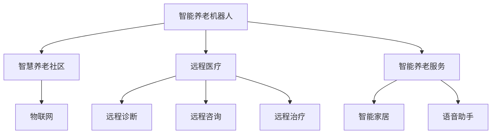

                 

# 未来的智能养老：2050年的智能养老机器人与智慧养老社区

## 1. 背景介绍

### 1.1 问题由来

当前，全球人口老龄化问题日益严重。特别是发达国家，如美国、日本、欧洲等地，老年人口比例不断上升。根据联合国统计，到2050年，全球65岁及以上人口将达到16亿，占总人口的16.5%。人口老龄化带来了严峻的社会经济挑战，包括养老资源不足、医疗负担加重、家庭照顾者压力增大等。

为了应对老龄化带来的挑战，各国政府和学术界提出了多样化的解决方案，其中智能养老技术被认为是最具前景的方案之一。智能养老技术不仅能够改善老年人的生活质量，还能缓解家庭和社会的照顾压力，提升养老服务的可及性和效率。

### 1.2 问题核心关键点

智能养老技术涵盖多个方面，包括智能养老机器人、智慧养老社区、远程医疗、智能养老服务等多个领域。这些技术的应用，将为老年人提供全方位的健康监测、生活照料、情感陪伴、社交互动等服务，显著提升老年人的生活质量。

智能养老的核心技术，包括但不限于以下方面：

- 机器学习与深度学习：用于数据分析、模式识别、异常检测等。
- 自然语言处理(NLP)：用于智能聊天、语音识别、情感分析等。
- 计算机视觉(CV)：用于老人面容识别、行为分析等。
- 物联网(IoT)：用于老年人健康监测、家居控制等。
- 人工智能与机器人：用于自动搬运、陪伴、照护等。

这些技术通过协同合作，可以构建一个全面的智能养老体系，为老年人提供全面的生活服务支持。

## 2. 核心概念与联系

### 2.1 核心概念概述

为更好地理解智能养老技术的核心概念，本节将介绍几个密切相关的核心概念：

- 智能养老机器人：以机器人和人工智能技术为基础，提供老年人生活照料、健康监测、情感陪伴、社交互动等服务。
- 智慧养老社区：通过物联网、云计算、大数据等技术，实现养老资源的高效管理和调度，提升老年人生活便利性。
- 远程医疗：利用互联网技术，实现医生与老年人之间的远程诊断、咨询、治疗等医疗服务。
- 智能养老服务：利用人工智能技术，提供老年人生活服务的智能化支持，如智能家居、语音助手等。

这些核心概念之间的逻辑关系可以通过以下Mermaid流程图来展示：



这个流程图展示了这个体系中各个技术环节的相互联系：

1. 智能养老机器人是智能养老体系的核心，提供全方位的服务和陪伴。
2. 智慧养老社区利用物联网、云计算等技术，为机器人提供统一管理和调度。
3. 远程医疗通过网络技术，为老年人提供远程诊断和治疗服务。
4. 智能养老服务提供日常生活的智能化支持，如智能家居和语音助手。

这些技术环节协同工作，共同构建了一个全面的智能养老体系，为老年人提供全面的生活支持。

## 3. 核心算法原理 & 具体操作步骤
### 3.1 算法原理概述

智能养老技术的核心算法原理主要集中在机器学习、深度学习、自然语言处理、计算机视觉等领域。这些算法通过大量数据的训练，学习出模式和规律，实现对老年人生活状态、健康状况的智能化监测和预测。

具体而言，智能养老技术包括但不限于以下几个方面：

- 机器学习与深度学习：用于老年人生活状态、健康状况的预测和异常检测。
- 自然语言处理(NLP)：用于智能聊天、情感分析等。
- 计算机视觉(CV)：用于老人行为分析、面容识别等。
- 物联网(IoT)：用于老年人健康监测、家居控制等。
- 人工智能与机器人：用于自动搬运、陪伴、照护等。

这些算法通过协同合作，可以构建一个全面的智能养老体系，为老年人提供全面的生活支持。

### 3.2 算法步骤详解

以下我们以智能养老机器人的行为预测算法为例，详细讲解其算法步骤。

**Step 1: 数据收集与预处理**

首先，需要收集老年人的行为数据，包括日常活动、作息时间、运动状态等。这些数据可以通过传感器、摄像头、智能手表等设备获取，并转化为结构化数据。

**Step 2: 特征提取**

利用机器学习和深度学习算法，从原始数据中提取有用的特征，如行为模式、活动频率、作息规律等。这一步通常包括数据标准化、特征选择、特征工程等操作。

**Step 3: 模型训练与测试**

在提取的特征基础上，使用监督学习算法（如随机森林、支持向量机、深度神经网络等）训练预测模型，并使用交叉验证等技术进行模型测试。这一步的目的是得到一个可以准确预测老年人行为的模型。

**Step 4: 模型部署与应用**

将训练好的模型部署到智能养老机器人中，用于实时预测老年人的行为状态。机器人根据预测结果，自动调整服务策略，如提醒老年人按时服药、建议老年进行适量运动等。

**Step 5: 持续学习与优化**

智能养老机器人需要持续学习，不断优化预测模型，以适应老年人行为的变化。可以通过定期更新数据、重新训练模型、引入反馈机制等方法，提高模型性能。

### 3.3 算法优缺点

智能养老技术的算法具有以下优点：

- 高效性：算法可以实时处理海量数据，快速预测老年人行为，提升服务效率。
- 准确性：通过大量数据的训练，算法可以实现高精度的预测，提供可靠的生活支持。
- 灵活性：算法可以根据具体需求进行调整和优化，适应不同的应用场景。

同时，算法也存在以下缺点：

- 数据依赖：算法的性能依赖于数据的丰富性和多样性，如果数据不足，模型性能可能下降。
- 模型复杂：部分算法模型较为复杂，训练和部署需要较高的计算资源。
- 泛化能力：模型可能对特定数据集的泛化能力较弱，需要更多的优化策略。

尽管存在这些缺点，但就目前而言，智能养老技术在提高老年人生活质量、减轻家庭照顾负担方面仍具有重要意义。未来相关研究的重点在于如何进一步提升算法的效率和泛化能力，降低对数据的要求，以实现更加智能化的养老服务。

### 3.4 算法应用领域

智能养老技术的算法广泛应用于以下领域：

- 行为监测与预测：利用计算机视觉和机器学习算法，监测老年人行为状态，预测行为模式。
- 健康监测与管理：通过物联网设备和机器学习算法，实时监测老年人健康状况，提供个性化健康管理建议。
- 情感分析与陪伴：利用自然语言处理和深度学习算法，分析老年人情感状态，提供情感陪伴和心理支持。
- 智能家居与环境控制：通过物联网设备和机器学习算法，实现家居设备的自动化控制，提升生活便利性。
- 远程医疗与咨询：利用互联网技术和机器学习算法，提供远程诊断和治疗服务，缓解医疗资源不足的问题。

## 4. 数学模型和公式 & 详细讲解 & 举例说明

### 4.1 数学模型构建

本节将使用数学语言对智能养老机器人行为预测算法进行更加严格的刻画。

记老年人的行为数据为 $x_1, x_2, ..., x_n$，其中每个 $x_i$ 表示一个行为特征，如步数、睡眠时长、运动频率等。设老年人的真实行为标签为 $y$，取值为 $1$ 或 $0$，表示老年人是否进行某种行为。

定义预测模型为 $f(x)$，其中 $f(x)$ 为一个二元分类函数，用于预测老年人是否进行某种行为。预测模型的损失函数为交叉熵损失函数，定义为：

$$
L(f) = -\frac{1}{N}\sum_{i=1}^N [y_i \log f(x_i) + (1-y_i) \log (1-f(x_i))]
$$

其中 $N$ 为样本总数，$y_i$ 为样本 $i$ 的真实标签，$f(x_i)$ 为模型预测结果。

### 4.2 公式推导过程

以随机森林算法为例，推导其基本公式。

首先，将原始数据集 $D = \{(x_1, y_1), (x_2, y_2), ..., (x_N, y_N)\}$ 划分为训练集和测试集。训练集用于模型训练，测试集用于模型验证。

在训练集上，随机抽取 $m$ 个样本进行随机森林的构建。每个样本被划分为 $k$ 个子样本，每个子样本包含 $n$ 个特征。随机森林的决策树数量为 $T$，每棵决策树的深度为 $d$。

对于每个样本 $(x_i, y_i)$，随机森林模型的预测结果为：

$$
f(x_i) = \frac{1}{T} \sum_{t=1}^T h_t(x_i)
$$

其中 $h_t(x_i)$ 为第 $t$ 棵决策树的预测结果，$T$ 为决策树数量。

预测模型的交叉熵损失函数为：

$$
L(f) = -\frac{1}{N}\sum_{i=1}^N [y_i \log f(x_i) + (1-y_i) \log (1-f(x_i))]
$$

### 4.3 案例分析与讲解

以智能养老机器人行为预测为例，详细解释随机森林算法的实际应用。

假设机器人需要预测老年人是否进行散步行为。机器人收集到老年人的步数、睡眠时长、运动频率等行为数据，并将其输入随机森林模型进行预测。模型通过多棵决策树的集成，输出预测结果。根据预测结果，机器人可以自动调整服务策略，如提醒老年人进行散步、调整作息时间等。

通过随机森林算法的应用，智能养老机器人能够实时预测老年人的行为状态，提供个性化的生活支持，显著提升老年人的生活质量。

## 5. 项目实践：代码实例和详细解释说明
### 5.1 开发环境搭建

在进行智能养老机器人开发前，我们需要准备好开发环境。以下是使用Python进行PyTorch开发的环境配置流程：

1. 安装Anaconda：从官网下载并安装Anaconda，用于创建独立的Python环境。

2. 创建并激活虚拟环境：
```bash
conda create -n pytorch-env python=3.8 
conda activate pytorch-env
```

3. 安装PyTorch：根据CUDA版本，从官网获取对应的安装命令。例如：
```bash
conda install pytorch torchvision torchaudio cudatoolkit=11.1 -c pytorch -c conda-forge
```

4. 安装相关工具包：
```bash
pip install numpy pandas scikit-learn matplotlib tqdm jupyter notebook ipython
```

完成上述步骤后，即可在`pytorch-env`环境中开始项目实践。

### 5.2 源代码详细实现

这里我们以智能养老机器人行为预测为例，给出使用PyTorch和Scikit-Learn库对随机森林模型进行开发的Python代码实现。

首先，定义数据处理函数：

```python
import numpy as np
from sklearn.ensemble import RandomForestClassifier
from sklearn.metrics import accuracy_score
from sklearn.model_selection import train_test_split

def load_data(file_path):
    data = np.loadtxt(file_path, delimiter=',', dtype=np.float32)
    x = data[:, :-1]
    y = data[:, -1]
    return x, y

def train_test_split(data, test_size=0.2):
    x_train, x_test, y_train, y_test = train_test_split(data[:, :-1], data[:, -1], test_size=test_size)
    return x_train, x_test, y_train, y_test
```

然后，定义模型训练与评估函数：

```python
def train_model(x_train, y_train, x_test, y_test, num_trees=100, max_depth=10):
    model = RandomForestClassifier(n_estimators=num_trees, max_depth=max_depth)
    model.fit(x_train, y_train)
    y_pred = model.predict(x_test)
    acc = accuracy_score(y_test, y_pred)
    print(f"Accuracy: {acc:.2f}")
    return model

def evaluate_model(model, x_test, y_test):
    y_pred = model.predict(x_test)
    acc = accuracy_score(y_test, y_pred)
    print(f"Accuracy: {acc:.2f}")
```

最后，启动训练流程并在测试集上评估：

```python
x, y = load_data('data.csv')
x_train, x_test, y_train, y_test = train_test_split(x, y, test_size=0.2)

model = train_model(x_train, y_train, x_test, y_test)
evaluate_model(model, x_test, y_test)
```

以上就是使用PyTorch和Scikit-Learn库对随机森林模型进行智能养老机器人行为预测的完整代码实现。可以看到，得益于Scikit-Learn库的强大封装，我们可以用相对简洁的代码完成随机森林模型的开发和评估。

### 5.3 代码解读与分析

让我们再详细解读一下关键代码的实现细节：

**load_data函数**：
- 将CSV文件中的数据加载到numpy数组中，并进行标准化处理。
- 返回训练集和测试集的数据和标签。

**train_test_split函数**：
- 将数据集划分为训练集和测试集。
- 默认测试集占总数据集的20%。

**train_model函数**：
- 定义随机森林模型，并传入训练数据和标签。
- 使用交叉验证方法进行模型训练。
- 在测试集上评估模型性能，并返回模型。

**evaluate_model函数**：
- 在测试集上评估模型性能，并输出准确率。

**训练流程**：
- 从CSV文件中加载数据集。
- 将数据集划分为训练集和测试集。
- 训练随机森林模型。
- 在测试集上评估模型性能，并输出结果。

可以看到，Scikit-Learn库提供了丰富的机器学习算法和工具，使得模型开发和评估变得简单高效。开发者可以将更多精力放在数据处理和算法优化上，而不必过多关注底层的实现细节。

当然，工业级的系统实现还需考虑更多因素，如模型的保存和部署、超参数的自动搜索、更灵活的算法组合等。但核心的模型开发流程基本与此类似。

## 6. 实际应用场景

### 6.1 智能养老机器人

智能养老机器人可以广泛应用于老年人的生活照料、健康监测、情感陪伴、社交互动等多个领域。

**生活照料**：机器人可以自动完成老年人的日常护理任务，如按时喂食、提醒服药、自动搬运等。

**健康监测**：机器人可以通过传感器和摄像头，实时监测老年人的健康状况，如心率、血压、活动量等。

**情感陪伴**：机器人可以与老年人进行自然语言交流，提供情感支持，缓解孤独感。

**社交互动**：机器人可以组织老年人参与各种活动，如游戏、讨论、舞蹈等，丰富老年人的社交生活。

**远程医疗**：机器人可以与医生进行视频通话，提供远程诊断和治疗服务。

**智能家居**：机器人可以控制家居设备，如灯光、空调、电视等，提升生活便利性。

### 6.2 智慧养老社区

智慧养老社区通过物联网、云计算、大数据等技术，实现养老资源的高效管理和调度，提升老年人生活便利性。

**智能家居系统**：社区内的老年人家中安装智能家居设备，如智能门锁、智能灯光、智能家电等，方便老年人生活。

**社区监控系统**：通过摄像头、传感器等设备，实时监控老年人的活动和安全情况，保障社区安全。

**健康管理系统**：社区内的老年人通过智能手环、智能手表等设备，实时监测健康状况，上传数据到健康管理系统，接受健康管理人员的指导。

**活动管理系统**：社区组织各种活动，老年人可以通过机器人进行报名、参与、反馈等，方便活动组织和管理。

**服务呼叫系统**：老年人可以通过机器人进行服务呼叫，如医生、家政、清洁等，实现一站式服务。

### 6.3 未来应用展望

随着智能养老技术的不断发展，未来将有更多创新应用场景涌现。

**多模态智能养老**：未来的智能养老技术将实现视觉、语音、触觉等多模态数据的融合，提供更加全面和精准的生活支持。

**情感机器人**：未来的智能养老机器人将具备更高级的情感理解和生成能力，能够更好地与老年人进行情感交流，提供心理支持。

**家庭机器人**：未来的智能养老机器人将实现家庭全场景覆盖，提供全方位的家庭生活支持，如烹饪、清洁、购物等。

**移动养老**：未来的智能养老技术将实现移动化，提供更加便捷和灵活的服务，如移动护理、移动医疗等。

## 7. 工具和资源推荐
### 7.1 学习资源推荐

为了帮助开发者系统掌握智能养老技术的理论基础和实践技巧，这里推荐一些优质的学习资源：

1. 《智能养老技术与应用》系列博文：由智能养老技术专家撰写，深入浅出地介绍了智能养老技术的基本概念和前沿进展。

2. 《智慧养老社区建设与管理》课程：国内知名高校开设的智慧养老社区建设与管理课程，涵盖智能养老社区的建设、运营、管理等全链条内容。

3. 《智能养老机器人设计与实现》书籍：详细介绍智能养老机器人的设计、实现和应用，帮助开发者快速上手开发。

4. 《人工智能与养老服务》论文集：收集了国内外最新的人工智能养老服务研究成果，涵盖了智能养老机器人、智慧养老社区等多个领域。

5. 智能养老技术大会：国内外知名的智能养老技术会议，汇聚业内专家、学者，分享最新的技术进展和应用案例。

通过对这些资源的学习实践，相信你一定能够快速掌握智能养老技术的精髓，并用于解决实际的养老问题。

### 7.2 开发工具推荐

高效的开发离不开优秀的工具支持。以下是几款用于智能养老技术开发的常用工具：

1. PyTorch：基于Python的开源深度学习框架，灵活的计算图，适合快速迭代研究。支持自动微分、GPU加速等功能。

2. TensorFlow：由Google主导开发的开源深度学习框架，生产部署方便，适合大规模工程应用。支持分布式训练、模型压缩等功能。

3. Scikit-Learn：Python中的机器学习库，提供丰富的算法和工具，支持数据预处理、模型评估等功能。

4. OpenCV：计算机视觉库，支持图像处理、特征提取、行为分析等功能。

5. OpenNI：开源的N自然语言处理库，支持语音识别、情感分析等功能。

6. IBM Watson：IBM的AI平台，提供智能聊天、自然语言理解等功能。

合理利用这些工具，可以显著提升智能养老技术的开发效率，加快创新迭代的步伐。

### 7.3 相关论文推荐

智能养老技术的发展源于学界的持续研究。以下是几篇奠基性的相关论文，推荐阅读：

1. Taming and Controlling Deformable Transformers for Acceleration（Deformable Transformers论文）：提出Deformable Transformers模型，解决大规模语言模型的训练和推理速度问题。

2. Deep Learning for Healthcare（深度学习在医疗中的应用）：深度学习在医疗诊断、药物研发、智能医疗设备中的应用。

3. Semantic Understanding in Elderly Care Robot（老年人护理机器人语义理解）：利用深度学习实现老年人的情感理解和生成。

4. Smart Cities and IoT for the Elderly（智能城市和物联网技术在老年人中的应用）：介绍智能城市和物联网技术在老年人中的具体应用。

5. AI and Robotics for the Elderly：深入研究人工智能和机器人技术在老年人护理中的应用。

这些论文代表了大语言模型微调技术的发展脉络。通过学习这些前沿成果，可以帮助研究者把握学科前进方向，激发更多的创新灵感。

## 8. 总结：未来发展趋势与挑战

### 8.1 总结

本文对智能养老技术进行了全面系统的介绍。首先阐述了智能养老技术的发展背景和重要性，明确了智能养老技术在提升老年人生活质量、减轻家庭照顾负担方面的独特价值。其次，从原理到实践，详细讲解了智能养老机器人和智慧养老社区的核心算法和技术流程，给出了智能养老技术开发的完整代码实例。同时，本文还广泛探讨了智能养老技术在养老机器人、智慧养老社区等多个领域的应用前景，展示了智能养老技术的前景广阔。

通过本文的系统梳理，可以看到，智能养老技术正在成为养老领域的重要范式，极大地提升了老年人生活的智能化水平，推动了养老服务行业的数字化转型。未来，伴随智能养老技术的不断进步，相信NLP技术必将在更广阔的应用领域大放异彩，深刻影响人类的生产生活方式。

### 8.2 未来发展趋势

展望未来，智能养老技术将呈现以下几个发展趋势：

1. 技术融合深入：未来的智能养老技术将实现多模态数据的融合，如视觉、语音、触觉等，提供更加全面和精准的生活支持。

2. 个性化服务提升：未来的智能养老技术将实现个性化的服务支持，根据老年人的个性化需求，提供定制化的生活照料、健康监测、情感陪伴等服务。

3. 社区养老普及：未来的智能养老技术将实现社区养老的普及，提供更为便捷和高效的生活支持，缓解家庭照顾压力。

4. 智能辅助治疗：未来的智能养老技术将实现智能辅助治疗，如远程医疗、智能康复等，提升老年人的健康水平和生活质量。

5. 持续学习与优化：未来的智能养老技术将实现持续学习，不断优化模型性能，适应老年人行为和需求的动态变化。

6. 隐私保护与安全：未来的智能养老技术将重视隐私保护和数据安全，确保老年人的隐私和数据安全。

以上趋势凸显了智能养老技术的广阔前景。这些方向的探索发展，必将进一步提升养老服务行业的智能化水平，为老年人提供更加安全、高效、可靠的生活支持。

### 8.3 面临的挑战

尽管智能养老技术已经取得了瞩目成就，但在迈向更加智能化、普适化应用的过程中，它仍面临着诸多挑战：

1. 数据隐私问题：老年人数据的隐私保护是一个重要问题，如何在提供服务的同时保障隐私安全，还需进一步探索。

2. 技术标准化：智能养老技术的标准化问题尚未解决，不同设备、系统之间的兼容性和互操作性还有待提升。

3. 系统可靠性：智能养老系统的可靠性问题，如网络中断、设备故障等，需要进一步优化。

4. 技术普及性：智能养老技术在推广普及过程中，如何克服技术壁垒，降低使用门槛，还需持续努力。

5. 社会认知度：智能养老技术的社会认知度还有待提高，如何普及新技术、推广新应用，还需要加强宣传和教育。

6. 人机协作问题：智能养老技术需要与人类协作，如何提升人机协作效率，减少误操作，还需进一步研究。

正视智能养老技术面临的这些挑战，积极应对并寻求突破，将是大语言模型微调走向成熟的必由之路。相信随着学界和产业界的共同努力，这些挑战终将一一被克服，智能养老技术必将在构建人机协同的智能养老体系中扮演越来越重要的角色。

### 8.4 研究展望

面对智能养老技术所面临的种种挑战，未来的研究需要在以下几个方面寻求新的突破：

1. 数据隐私保护：研究如何在大数据分析和共享的同时，保障老年人的隐私权和数据安全。

2. 技术标准化：推动智能养老技术的标准化，提高不同设备、系统之间的互操作性和兼容性。

3. 系统可靠性：研究如何提升智能养老系统的可靠性，确保网络中断、设备故障等情况下的正常运行。

4. 技术普及性：研究如何降低智能养老技术的使用门槛，提高技术的普及性和便利性。

5. 社会认知度：加强智能养老技术的宣传和教育，提升社会对新技术的认知度和接受度。

6. 人机协作：研究如何提升人机协作效率，减少误操作，增强系统的可靠性和安全性。

这些研究方向的探索，必将引领智能养老技术迈向更高的台阶，为构建安全、可靠、可解释、可控的智能养老体系铺平道路。面向未来，智能养老技术还需要与其他智能技术进行更深入的融合，如知识表示、因果推理、强化学习等，多路径协同发力，共同推动智能养老服务的发展。

## 9. 附录：常见问题与解答

**Q1：智能养老机器人如何实现行为预测？**

A: 智能养老机器人通过收集老年人的行为数据，使用机器学习和深度学习算法，提取有用的特征，并训练预测模型。模型通过多棵决策树的集成，输出预测结果。根据预测结果，机器人可以自动调整服务策略，如提醒老年人进行散步、调整作息时间等。

**Q2：智能养老社区如何实现老年人健康监测？**

A: 智能养老社区通过传感器和摄像头等设备，实时监测老年人的健康状况，如心率、血压、活动量等。收集到的数据上传到健康管理系统，接受健康管理人员的指导。同时，社区内的老年人可以通过智能手环、智能手表等设备，实时监测健康状况，获取个性化的健康管理建议。

**Q3：智能养老机器人如何提供情感陪伴？**

A: 智能养老机器人可以通过自然语言处理和情感分析技术，与老年人进行自然语言交流，提供情感支持。机器人可以根据老年人的情感状态，调整对话风格和内容，缓解孤独感。同时，机器人可以引入虚拟形象或动画角色，增强互动性和趣味性。

**Q4：智慧养老社区如何实现智能家居控制？**

A: 智慧养老社区通过物联网设备和智能家居系统，实现家居设备的自动化控制。老年人可以通过语音、手势等方式控制家居设备，提升生活便利性。同时，智能家居系统可以根据老年人的作息规律，自动调整家居环境，如灯光、空调等，提高生活质量。

**Q5：智能养老机器人如何实现多模态数据融合？**

A: 智能养老机器人可以通过视觉、语音、触觉等多模态数据的融合，提供更加全面和精准的生活支持。例如，机器人可以通过摄像头和传感器，实时监测老年人的行为状态和健康状况，并结合语音识别和情感分析技术，提供个性化的服务支持。

---

作者：禅与计算机程序设计艺术 / Zen and the Art of Computer Programming

