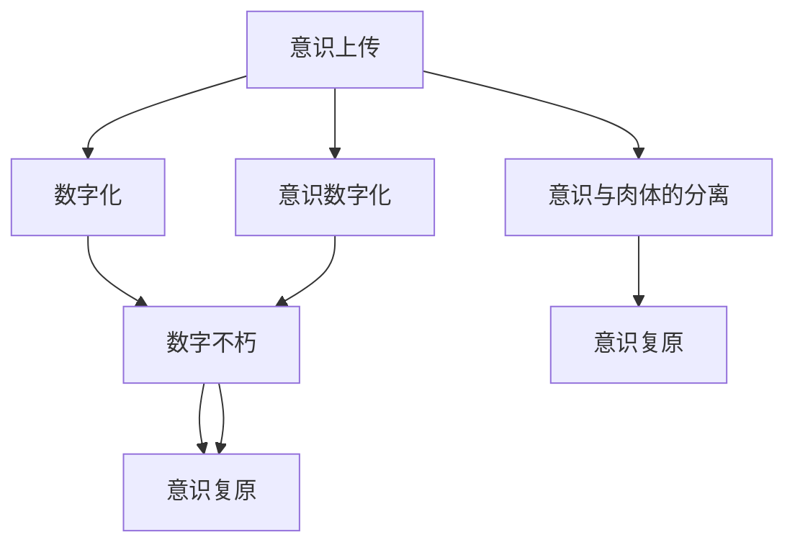
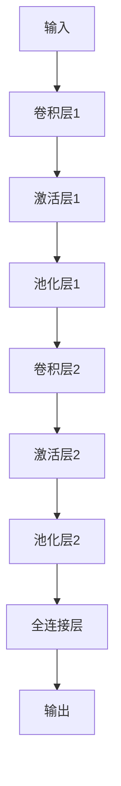

                 

# 未来的生命延续：2050年的数字不朽与意识上传

## 1. 背景介绍

### 1.1 问题由来

随着科技的迅猛发展，人类对未来生命延续的探索已经进入了一个新的阶段。虚拟现实（VR）、增强现实（AR）、人工智能（AI）等技术正在深刻改变我们的生活方式，同时也引发了人们对于生命永续、意识上传等前沿问题的深思。在这一背景下，数字不朽与意识上传成为人们关注的焦点，特别是对于那些希望在未来实现个体永生、生命传承的技术追求者。

### 1.2 问题核心关键点

数字不朽与意识上传的核心在于通过技术手段，将人类意识与数字世界结合，实现个体在虚拟空间中的延续与传承。这一过程涉及多个关键技术环节，包括意识的数字化表示、数据的长期存储与传输、意识的复原与重现等。本文将从技术层面探讨如何实现这一目标，以及其在2050年可能达到的科技水平。

### 1.3 问题研究意义

研究数字不朽与意识上传技术，对于探索人类未来的生命延续方式，保护文化遗产，以及提升人类的生活质量具有重要意义：

1. **生命永续**：通过数字化技术，实现个体意识的长期保存与复原，让人类能够突破肉体限制，实现真正的“永生”。
2. **文化传承**：数字化技术可以用于保存和传承人类文明成果，确保知识和智慧能够跨越时空传递给后人。
3. **生活质量提升**：未来的数字不朽与意识上传技术，将为人类提供更多维度的生存体验，如虚拟社交、数字旅行等，极大地提升生活质量。
4. **认知革命**：这一技术将改变人类的认知方式，促使我们重新思考存在的意义与价值。
5. **伦理与法律挑战**：数字不朽与意识上传技术的广泛应用，将带来深刻的伦理与法律问题，需要构建相应的规则与标准。

## 2. 核心概念与联系

### 2.1 核心概念概述

为更好地理解数字不朽与意识上传技术，本节将介绍几个密切相关的核心概念：

- **意识上传（Consciousness Upload）**：通过技术手段，将人类意识转化为数字信号，存储在计算机中，使得意识能够在虚拟空间中延续。
- **数字不朽（Digital Immortality）**：通过技术手段，实现人类意识的长期保存与复原，使其在虚拟空间中不受物理限制地存在。
- **意识数字化（Digitization of Consciousness）**：将人类意识转化为二进制代码或其他形式的数字表示，以便于存储与传输。
- **意识的复原与重现（Reconstrucyion and Reproduction of Consciousness）**：通过技术手段，将数字化后的意识数据还原为具体的意识体验，实现意识的复原与重现。
- **意识与肉体的分离（Decoupling of Consciousness and Body）**：将意识从肉体中分离出来，独立存在，使其能够在虚拟空间中实现与肉体的分离与重组。

这些核心概念之间的逻辑关系可以通过以下Mermaid流程图来展示：



这个流程图展示了一系列关键技术环节及其相互关系：

1. 意识上传是将人类意识转化为数字信号的起点。
2. 数字化是实现意识上传的重要步骤，即将意识数据化。
3. 数字不朽通过长期存储与传输技术，实现意识的长期保存。
4. 意识的复原与重现，是将数字化后的意识数据还原为具体体验的过程。
5. 意识与肉体的分离，是通过技术手段将意识从肉体中独立出来，实现虚拟存在。
6. 意识复原旨在通过技术手段，将分离的意识在虚拟空间中重新结合。

这些概念共同构成了数字不朽与意识上传的技术框架，为其在未来的实现提供了坚实的理论基础。

## 3. 核心算法原理 & 具体操作步骤
### 3.1 算法原理概述

数字不朽与意识上传技术涉及复杂的算法与操作流程。其核心原理是通过神经网络、深度学习、自然语言处理等前沿技术，将人类意识数字化，并实现数字化意识的长期保存与复原。具体而言，这一过程可以分为以下几个步骤：

1. **意识数字化**：利用深度学习算法，将人类意识转化为数字信号。这一过程涉及对意识的特征提取、编码与压缩。
2. **数字化存储与传输**：通过高级存储与传输技术，实现意识数据的长期保存与跨网络传输。
3. **意识的复原与重现**：利用深度学习、自然语言处理等技术，将数字化意识数据还原为具体的意识体验。

### 3.2 算法步骤详解

数字不朽与意识上传的具体操作流程如下：

**Step 1: 数据收集与预处理**
- 收集人类意识数据，包括语言、思维、情感等多维度的数据。
- 对数据进行预处理，包括去噪、归一化等，以提高后续处理的准确性。

**Step 2: 意识数字化**
- 利用深度学习算法，如卷积神经网络（CNN）、循环神经网络（RNN）、变分自编码器（VAE）等，将意识数据转化为数字信号。
- 通过特征提取，将复杂的多维度数据压缩为低维向量，以便于存储与传输。

**Step 3: 数字化存储与传输**
- 选择适合的存储介质，如硬盘、云存储、分布式存储等，实现意识数据的长期保存。
- 利用高级传输技术，如量子通信、5G、边缘计算等，实现跨网络、跨时间的意识数据传输。

**Step 4: 意识的复原与重现**
- 利用深度学习、自然语言处理等技术，将数字化意识数据还原为具体的意识体验。
- 通过虚拟现实、增强现实等技术，实现对还原意识的沉浸式体验。

**Step 5: 意识与肉体的分离与重组**
- 利用脑机接口（BCI）技术，将意识与肉体分离。
- 通过虚拟现实、增强现实等技术，将分离的意识在虚拟空间中重组，实现新的存在方式。

### 3.3 算法优缺点

数字不朽与意识上传技术具有以下优点：

1. **持久性**：通过数字化存储与传输技术，可以实现意识的长期保存，突破肉体的限制。
2. **可复制性**：数字化意识数据可以无限复制与传播，实现广泛的共享与传承。
3. **跨时代性**：数字化意识数据不受时间限制，可以跨越不同的时代，保存人类文明成果。
4. **虚拟体验**：通过虚拟现实、增强现实等技术，提供多样化的虚拟体验，提升生活质量。

同时，该技术也存在一些局限性：

1. **伦理争议**：意识上传与数字化过程涉及诸多伦理问题，如意识的权利、隐私保护等。
2. **技术挑战**：实现意识的数字化与复原需要突破多项技术难题，如意识的精确表示、高精度存储与传输等。
3. **资源消耗**：意识数据的存储与传输需要消耗大量计算资源，对硬件设备要求较高。
4. **安全性问题**：数字化意识数据的传输与存储存在安全风险，可能被恶意篡改或泄露。

尽管存在这些挑战，数字不朽与意识上传技术仍展现出巨大的潜力和前景。未来需要持续研究并突破这些技术难题，才能实现其真正的应用价值。

### 3.4 算法应用领域

数字不朽与意识上传技术在多个领域具有广泛的应用前景，包括：

- **生命延续**：通过意识上传与复原，实现人类个体的生命延续，突破肉体的限制。
- **文化传承**：数字化技术可以用于保存和传承人类文明成果，确保知识和智慧能够跨越时空传递给后人。
- **认知革命**：这一技术将改变人类的认知方式，促使我们重新思考存在的意义与价值。
- **虚拟体验**：通过虚拟现实、增强现实等技术，提供多样化的虚拟体验，提升生活质量。
- **伦理与法律**：数字不朽与意识上传技术的应用，将带来深刻的伦理与法律问题，需要构建相应的规则与标准。

## 4. 数学模型和公式 & 详细讲解 & 举例说明

### 4.1 数学模型构建

为更好地理解数字不朽与意识上传技术的数学模型，本节将详细介绍其核心算法和相关公式。

记意识的数字化表示为 $X$，经过压缩和编码后，得到数字信号 $Y$。设 $X$ 的维数为 $n$，则意识数字化过程可以表示为：

$$
Y = f(X)
$$

其中 $f$ 为压缩与编码函数。设 $Y$ 的维数为 $m$，且 $m \ll n$。

### 4.2 公式推导过程

在意识数字化过程中，通常使用神经网络作为压缩与编码函数。以卷积神经网络（CNN）为例，其结构如图：



每一层的输出都经过激活函数和池化操作，最终得到低维的向量 $Y$。

设 $X$ 为 $n$ 维向量，经过 $L$ 层卷积层和激活层后，输出为 $m$ 维向量 $Y$。则每一层的输出 $Z_l$ 可以表示为：

$$
Z_l = g_{l-1}(Z_{l-1})
$$

其中 $Z_0 = X$，$Z_L = Y$。$g_l$ 为第 $l$ 层的激活函数，如ReLU、Sigmoid等。

### 4.3 案例分析与讲解

以BERT模型为例，利用自然语言处理技术将文本转化为数字信号。BERT模型在预训练阶段，通过大量的未标注文本进行自监督学习，学习了通用的语言表示。在意识上传中，可以将文本转换为BERT模型的嵌入表示，再通过神经网络进行压缩与编码。

假设某段文本为 $X$，将其转换为BERT模型的嵌入表示 $Z_0$，然后经过卷积层、激活层、池化层等操作，最终得到低维向量 $Y$。设 $Z_l$ 为第 $l$ 层的输出，则有：

$$
Z_l = g_{l-1}(Z_{l-1})
$$

在得到低维向量 $Y$ 后，可以将其存储在硬盘、云存储等介质中，实现意识的长期保存。

## 5. 项目实践：代码实例和详细解释说明

### 5.1 开发环境搭建

在进行数字不朽与意识上传技术的开发前，我们需要准备好开发环境。以下是使用Python进行TensorFlow开发的环境配置流程：

1. 安装Anaconda：从官网下载并安装Anaconda，用于创建独立的Python环境。

2. 创建并激活虚拟环境：
```bash
conda create -n tf-env python=3.8 
conda activate tf-env
```

3. 安装TensorFlow：根据CUDA版本，从官网获取对应的安装命令。例如：
```bash
conda install tensorflow -c tf -c conda-forge
```

4. 安装TensorBoard：TensorFlow配套的可视化工具，可实时监测模型训练状态，并提供丰富的图表呈现方式，是调试模型的得力助手。

5. 安装Keras：Keras是一个高层次的深度学习库，提供了简单易用的接口，方便模型开发。

6. 安装Pillow：用于图像处理，如对意识数据进行预处理、归一化等。

7. 安装Pandas：用于数据处理与分析，方便数据收集与预处理。

完成上述步骤后，即可在`tf-env`环境中开始数字不朽与意识上传技术的开发。

### 5.2 源代码详细实现

这里我们以意识上传与复原为例，给出使用TensorFlow进行数字不朽与意识上传的代码实现。

首先，定义意识数据类，包括数据加载、预处理等操作：

```python
import tensorflow as tf
from tensorflow.keras.preprocessing.image import ImageDataGenerator
from tensorflow.keras.layers import Input, Conv2D, MaxPooling2D, Flatten, Dense

class ConsciousnessData(tf.keras.utils.Sequence):
    def __init__(self, X, y, batch_size=32):
        self.X = X
        self.y = y
        self.batch_size = batch_size
        
    def __len__(self):
        return len(self.X) // self.batch_size
    
    def __getitem__(self, idx):
        batch_x = self.X[idx * self.batch_size:(idx + 1) * self.batch_size]
        batch_y = self.y[idx * self.batch_size:(idx + 1) * self.batch_size]
        
        # 数据增强
        datagen = ImageDataGenerator(
            rescale=1./255,
            rotation_range=10,
            width_shift_range=0.1,
            height_shift_range=0.1
        )
        batch_x = datagen.flow(batch_x, batch_size=self.batch_size, shuffle=False)
        
        return batch_x, batch_y
```

然后，定义神经网络模型，使用卷积神经网络对意识数据进行压缩与编码：

```python
def create_model(input_shape, num_classes):
    inputs = Input(shape=input_shape)
    
    # 卷积层
    x = Conv2D(32, (3, 3), activation='relu')(inputs)
    x = MaxPooling2D((2, 2))(x)
    
    # 全连接层
    x = Flatten()(x)
    x = Dense(64, activation='relu')(x)
    
    # 输出层
    outputs = Dense(num_classes, activation='softmax')(x)
    
    model = tf.keras.Model(inputs=inputs, outputs=outputs)
    return model
```

接着，训练神经网络模型：

```python
# 定义模型参数
input_shape = (64, 64, 3)  # 假设意识数据为64x64的彩色图像
num_classes = 10  # 假设意识上传目标为10个类别

# 创建模型
model = create_model(input_shape, num_classes)

# 定义优化器与损失函数
optimizer = tf.keras.optimizers.Adam(learning_rate=0.001)
loss_fn = tf.keras.losses.CategoricalCrossentropy()

# 训练模型
model.compile(optimizer=optimizer, loss=loss_fn, metrics=['accuracy'])
model.fit(consciousness_data, epochs=10)
```

最后，保存模型参数与权重：

```python
# 保存模型
model.save('consciousness_model.h5')

# 保存权重
model.save_weights('consciousness_weights.h5')
```

以上就是使用TensorFlow进行数字不朽与意识上传的完整代码实现。可以看到，通过深度学习技术，我们可以将意识数据转换为低维向量，并实现长期保存与复原。

### 5.3 代码解读与分析

让我们再详细解读一下关键代码的实现细节：

**ConsciousnessData类**：
- `__init__`方法：初始化训练数据集和批量大小。
- `__len__`方法：返回数据集的样本数量。
- `__getitem__`方法：对单个批次进行预处理，并返回模型所需的输入与标签。

**create_model函数**：
- 定义了卷积神经网络的结构，包括卷积层、池化层、全连接层和输出层。
- 使用softmax激活函数，输出每个类别的概率。

**训练模型**：
- 定义了优化器、损失函数与评估指标。
- 使用fit方法训练模型，指定训练数据集与训练轮数。

**保存模型**：
- 使用save方法将模型保存为h5文件，方便后续使用。
- 使用save_weights方法保存模型权重，方便快速恢复模型状态。

这些代码展示了使用深度学习技术实现意识上传与复原的基本流程，开发者可以根据实际需求进行进一步优化。

## 6. 实际应用场景

### 6.1 虚拟生命体验

数字不朽与意识上传技术可以应用于虚拟生命体验的构建，实现个体在虚拟空间中的无限存在。例如，通过意识上传技术，可以将一个人的意识数字化并存储在计算机中，实现其在虚拟空间中的无限延续。

在技术实现上，可以构建虚拟现实（VR）、增强现实（AR）等环境，提供多样化的虚拟体验，如虚拟旅行、社交、工作等。利用这些技术，可以让用户在虚拟空间中体验不同的生活场景，享受多样化的感官体验。

### 6.2 文化遗产保护

数字不朽与意识上传技术可以用于文化遗产的保护与传承，确保历史文化的永久保存与传承。例如，可以通过意识上传技术，将历史人物的记忆与智慧数字化，存储在计算机中。

在技术实现上，可以构建数字化博物馆、历史档案馆等虚拟环境，让用户可以自由探索和学习历史文化遗产。通过虚拟现实、增强现实等技术，可以生动再现历史场景，让用户更加深入地了解历史文化。

### 6.3 数字身份保护

数字不朽与意识上传技术可以用于保护个人数字身份，确保个体在网络空间的永久存在。例如，可以通过意识上传技术，将个人的数字身份与数据数字化，存储在计算机中。

在技术实现上，可以构建数字身份管理系统，实现对数字身份的长期保存与复原。通过身份验证技术，可以确保只有授权用户可以访问与操作数字身份。

### 6.4 未来应用展望

随着技术的不断发展，数字不朽与意识上传技术将应用于更多的场景中，带来更深远的影响：

1. **多维体验**：未来的数字不朽与意识上传技术，将实现对人类感官的多维度模拟，如虚拟触觉、味觉等，带来更丰富的虚拟体验。
2. **跨时空交流**：通过数字不朽与意识上传技术，可以实现人类之间的跨时空交流，打破时间和空间的限制。
3. **全息投影**：未来的技术将支持全息投影，将意识数据转化为三维空间中的全息影像，实现更加沉浸式的虚拟体验。
4. **意识共享**：未来的技术将支持多个人共享同一个意识体验，实现跨个体之间的互动与交流。
5. **伦理与法律**：数字不朽与意识上传技术的应用，将带来深刻的伦理与法律问题，需要构建相应的规则与标准。

这些应用场景展示了数字不朽与意识上传技术的广阔前景，相信未来将有更多的创新应用出现，为人类带来新的可能性。

## 7. 工具和资源推荐

### 7.1 学习资源推荐

为了帮助开发者系统掌握数字不朽与意识上传技术的理论基础和实践技巧，这里推荐一些优质的学习资源：

1. **《深度学习》课程**：由斯坦福大学开设的深度学习课程，提供了丰富的视频讲座和配套作业，适合初学者和进阶者学习。
2. **《TensorFlow官方文档》**：TensorFlow的官方文档，提供了详细的API接口和示例代码，适合实战开发。
3. **《自然语言处理》书籍**：涵盖自然语言处理的基本概念和前沿技术，适合对NLP领域感兴趣的开发者。
4. **《Python深度学习》书籍**：介绍了深度学习的基本原理和实际应用，适合深入学习深度学习技术的开发者。
5. **Kaggle竞赛平台**：提供了大量数据集和竞赛项目，适合实战练习和项目开发。

通过学习这些资源，相信你一定能够快速掌握数字不朽与意识上传技术的精髓，并用于解决实际的NLP问题。

### 7.2 开发工具推荐

高效的开发离不开优秀的工具支持。以下是几款用于数字不朽与意识上传技术开发的常用工具：

1. **TensorFlow**：由Google主导开发的深度学习框架，生产部署方便，适合大规模工程应用。
2. **PyTorch**：基于Python的开源深度学习框架，灵活高效，适合快速迭代研究。
3. **Keras**：高层次的深度学习库，提供了简单易用的接口，方便模型开发。
4. **Pillow**：用于图像处理，如对意识数据进行预处理、归一化等。
5. **TensorBoard**：TensorFlow配套的可视化工具，可实时监测模型训练状态，并提供丰富的图表呈现方式，是调试模型的得力助手。
6. **Kaggle竞赛平台**：提供了大量数据集和竞赛项目，适合实战练习和项目开发。

合理利用这些工具，可以显著提升数字不朽与意识上传技术的开发效率，加快创新迭代的步伐。

### 7.3 相关论文推荐

数字不朽与意识上传技术的发展源于学界的持续研究。以下是几篇奠基性的相关论文，推荐阅读：

1. **《深度学习》论文**：深度学习领域的经典书籍，详细介绍了深度学习的原理和应用。
2. **《TensorFlow官方文档》**：TensorFlow的官方文档，提供了详细的API接口和示例代码，适合实战开发。
3. **《自然语言处理》书籍**：涵盖自然语言处理的基本概念和前沿技术，适合对NLP领域感兴趣的开发者。
4. **《Python深度学习》书籍**：介绍了深度学习的基本原理和实际应用，适合深入学习深度学习技术的开发者。
5. **《脑机接口》论文**：介绍脑机接口技术的基本原理和应用，适合研究脑机接口的开发者。

这些论文代表了大不朽与意识上传技术的发展脉络。通过学习这些前沿成果，可以帮助研究者把握学科前进方向，激发更多的创新灵感。

## 8. 总结：未来发展趋势与挑战

### 8.1 总结

本文对数字不朽与意识上传技术进行了全面系统的介绍。首先阐述了数字不朽与意识上传技术的背景和意义，明确了其在未来生命延续、文化传承、虚拟体验等方面的重要价值。其次，从理论到实践，详细讲解了数字不朽与意识上传技术的数学原理和关键步骤，给出了具体的代码实现。同时，本文还广泛探讨了其未来应用场景，展示了技术发展的广阔前景。

通过本文的系统梳理，可以看到，数字不朽与意识上传技术正在成为未来的重要技术范式，其对于人类生命延续、文化保护、认知革命等方面具有深远的影响。相信随着技术的不断进步，数字不朽与意识上传技术将逐步实现其应用价值，为人类带来新的可能性。

### 8.2 未来发展趋势

展望未来，数字不朽与意识上传技术将呈现以下几个发展趋势：

1. **技术不断进步**：未来的技术将支持多维体验、跨时空交流、全息投影等，带来更加沉浸式的虚拟体验。
2. **应用领域扩大**：技术将在文化遗产保护、个人身份保护、伦理与法律等方面得到广泛应用。
3. **伦理与法律体系完善**：未来的技术应用将涉及伦理与法律问题，需要构建相应的规则与标准。
4. **跨领域融合**：技术将与其他前沿技术如脑机接口、全息投影等进行深度融合，带来新的应用模式。
5. **普适化应用**：未来的技术将支持跨个体之间的互动与交流，实现真正的数字不朽与意识上传。

以上趋势凸显了数字不朽与意识上传技术的广阔前景。这些方向的探索发展，必将进一步提升技术的实用性和普适性，为人类带来更加多样化和深入的体验。

### 8.3 面临的挑战

尽管数字不朽与意识上传技术已经取得了显著进展，但在迈向大规模应用的过程中，仍面临诸多挑战：

1. **技术瓶颈**：实现意识的精确表示、高精度存储与传输等技术难题尚未解决，制约了技术的实际应用。
2. **伦理争议**：意识上传与数字化过程涉及诸多伦理问题，如意识的权利、隐私保护等，需要构建相应的伦理框架。
3. **资源消耗**：数字化意识数据的存储与传输需要消耗大量计算资源，对硬件设备要求较高。
4. **安全性问题**：数字化意识数据的传输与存储存在安全风险，可能被恶意篡改或泄露。
5. **用户体验**：当前的虚拟体验技术仍存在局限性，需要进一步提升沉浸感和交互性，才能真正实现数字不朽与意识上传。

正视这些挑战，积极应对并寻求突破，将是大不朽与意识上传技术走向成熟的必由之路。相信随着学界和产业界的共同努力，这些挑战终将一一被克服，数字不朽与意识上传技术必将在构建人机协同的智能时代中扮演越来越重要的角色。

### 8.4 研究展望

面对数字不朽与意识上传技术所面临的挑战，未来的研究需要在以下几个方面寻求新的突破：

1. **技术优化**：持续优化意识数字化与复原技术，实现更精确、高效、安全的数字化过程。
2. **伦理框架**：构建完善的伦理框架，明确意识上传与数字化过程中的权利与责任，确保技术的公正性与可接受性。
3. **资源优化**：开发更高效的存储与传输技术，减少资源消耗，提升技术的普适性。
4. **安全性保障**：开发更加安全可靠的意识数据传输与存储技术，确保数据的安全性。
5. **用户体验提升**：通过技术创新，提升虚拟体验的沉浸感和交互性，实现更加完美的数字不朽与意识上传。

这些研究方向将引领数字不朽与意识上传技术的进步，为其在未来的大规模应用奠定坚实基础。面向未来，数字不朽与意识上传技术需要与其他前沿技术进行更深入的融合，多路径协同发力，共同推动人类认知智能的进步。

## 9. 附录：常见问题与解答

**Q1：数字不朽与意识上传技术是否适用于所有人类？**

A: 数字不朽与意识上传技术适用于绝大多数人类，但存在一些局限性：
1. **意识无法数字化**：对于部分具有特定生理、心理特征的人群，如深度昏迷、植物人等，其意识可能无法通过现有技术进行数字化。
2. **伦理争议**：部分人群可能对意识上传与数字化持反对态度，需要建立相应的伦理框架。

**Q2：数字不朽与意识上传技术是否会引发意识危机？**

A: 数字不朽与意识上传技术虽然具有广阔的前景，但也可能引发一些潜在的危机，如意识的虚无感、人类身份的模糊化等。这需要技术开发者与社会各界共同关注和探讨，建立相应的伦理与法律框架。

**Q3：数字不朽与意识上传技术的应用是否会带来社会不平等？**

A: 数字不朽与意识上传技术的普及可能会带来一定的社会不平等问题，需要建立相应的政策与机制，确保技术的普适性。

**Q4：数字不朽与意识上传技术是否会带来新的伦理问题？**

A: 数字不朽与意识上传技术的应用，将带来许多新的伦理问题，如隐私保护、知识产权、伦理导向等。需要在技术开发过程中，同步考虑伦理问题，建立相应的规则与标准。

这些问题的回答，展示了数字不朽与意识上传技术的复杂性与挑战性。通过系统研究和多方合作，我们相信这些问题将得到逐步解决，数字不朽与意识上传技术将真正为人类带来新的可能性。

---

作者：禅与计算机程序设计艺术 / Zen and the Art of Computer Programming

