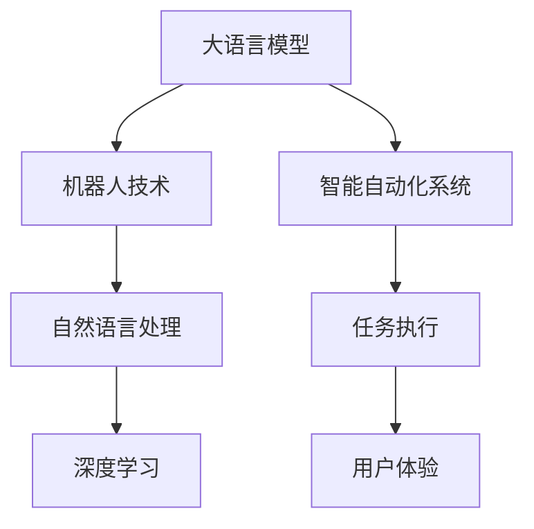
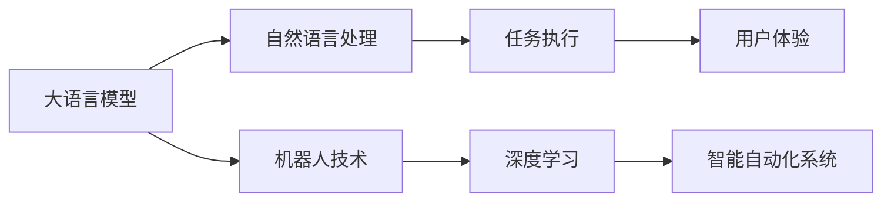

                 

# 机器人技术集成：LLM 打造智能自动化系统

> 关键词：机器人技术,LLM,自然语言处理(NLP),深度学习,人工智能,智能自动化系统,工业应用,自动化流程

## 1. 背景介绍

### 1.1 问题由来
随着人工智能技术的飞速发展，机器人技术正在逐步从传统的自动化控制转向具备智能感知和决策能力的智能机器人。这些智能机器人能够通过自然语言理解和生成，执行复杂的人类指令和任务。然而，构建这些智能机器人需要大量的人类专家知识和领域数据，而现有的机器人系统往往难以整合这些复杂知识。

大语言模型(LLM)的出现为解决这一问题提供了新的突破口。LLM通过在大规模无标签文本数据上进行预训练，学习到丰富的语言知识和常识，可以与机器人技术深度融合，构建智能自动化系统，大幅提升机器人的智能水平和任务执行能力。

### 1.2 问题核心关键点
本文聚焦于利用大语言模型构建智能自动化系统，涵盖以下几个关键点：

- **大语言模型(LLM)**：以自回归(如GPT)或自编码(如BERT)模型为代表，通过在大规模无标签文本语料上进行预训练，学习通用的语言表示。
- **机器人技术**：包括机械臂、移动机器人、服务机器人等，通过感知、决策、执行等环节，实现自动化的物理操作。
- **自然语言处理(NLP)**：研究如何让机器人通过自然语言与人类进行交互，理解人类指令并执行相应的任务。
- **深度学习**：利用神经网络模型对机器人进行任务训练，使机器人具备学习和适应新任务的能力。
- **智能自动化系统**：通过将LLM与机器人技术深度结合，实现具有智能感知和决策能力的自动化系统。

这些核心概念之间的逻辑关系可以通过以下Mermaid流程图来展示：



这个流程图展示了大语言模型与机器人技术深度融合，构建智能自动化系统的核心概念和流程。

## 2. 核心概念与联系

### 2.1 核心概念概述

为更好地理解大语言模型在智能自动化系统中的应用，本节将介绍几个密切相关的核心概念：

- **大语言模型(LLM)**：以自回归(如GPT)或自编码(如BERT)模型为代表的大规模预训练语言模型。通过在大规模无标签文本语料上进行预训练，学习通用的语言表示。

- **机器人技术**：包括机械臂、移动机器人、服务机器人等，通过感知、决策、执行等环节，实现自动化的物理操作。

- **自然语言处理(NLP)**：研究如何让机器人通过自然语言与人类进行交互，理解人类指令并执行相应的任务。

- **深度学习**：利用神经网络模型对机器人进行任务训练，使机器人具备学习和适应新任务的能力。

- **智能自动化系统**：通过将LLM与机器人技术深度结合，实现具有智能感知和决策能力的自动化系统。

这些核心概念之间的联系和作用机制可以通过以下图表来展示：



这个图表展示了大语言模型通过自然语言处理模块与机器人技术深度融合，形成智能自动化系统的全流程。

## 3. 核心算法原理 & 具体操作步骤
### 3.1 算法原理概述

大语言模型在智能自动化系统中的核心作用是自然语言处理(NLP)，即让机器人通过自然语言与人类进行交互，理解人类指令并执行相应的任务。这一过程包括自然语言理解(NLU)和自然语言生成(NLG)两个主要部分。

自然语言理解(NLU)涉及对输入的自然语言文本进行分析，提取关键信息，并将其转换为机器人可以执行的指令。自然语言生成(NLG)则是根据机器人的执行结果，生成自然语言文本作为输出，供人类读取。

### 3.2 算法步骤详解

基于大语言模型构建智能自动化系统的核心算法步骤如下：

**Step 1: 准备预训练模型和数据集**
- 选择合适的预训练语言模型 $M_{\theta}$ 作为初始化参数，如 BERT、GPT等。
- 准备机器人执行的各类任务对应的标注数据集 $D=\{(x_i, y_i)\}_{i=1}^N$，其中 $x_i$ 为自然语言文本，$y_i$ 为执行任务的机器人的输出。

**Step 2: 设计任务适配层**
- 根据机器人需要执行的任务类型，设计合适的输出层和损失函数。
- 对于分类任务，通常在顶层添加线性分类器和交叉熵损失函数。
- 对于生成任务，通常使用语言模型的解码器输出概率分布，并以负对数似然为损失函数。

**Step 3: 训练模型**
- 将训练集数据分批次输入模型，前向传播计算损失函数。
- 反向传播计算参数梯度，根据设定的优化算法和学习率更新模型参数。
- 周期性在验证集上评估模型性能，根据性能指标决定是否触发 Early Stopping。
- 重复上述步骤直到满足预设的迭代轮数或 Early Stopping 条件。

**Step 4: 部署模型**
- 使用训练好的模型对机器人执行的各类任务进行微调。
- 在机器人执行任务时，将自然语言输入传递给模型进行理解和生成，生成机器人的执行指令。
- 根据机器人的执行结果，生成自然语言输出，供人类读取。

### 3.3 算法优缺点

基于大语言模型的智能自动化系统具有以下优点：

- **高效性**：利用预训练模型和微调技术，可以大大缩短机器人任务执行的开发周期，减少人工干预和调试工作。
- **灵活性**：LLM能够理解并执行多种自然语言指令，可以灵活应对各种复杂的任务场景。
- **扩展性**：LLM可以通过不断地添加新数据进行微调，适应新的任务需求。

然而，这种系统也存在一些局限性：

- **依赖标注数据**：系统的性能很大程度上取决于标注数据的质量和数量，获取高质量标注数据的成本较高。
- **泛化能力有限**：当目标任务与预训练数据的分布差异较大时，微调的性能提升有限。
- **安全性问题**：LLM可能学习到有害信息，这些信息通过微调传递到机器人任务中，可能造成潜在的安全风险。

尽管存在这些局限性，但就目前而言，基于大语言模型的智能自动化系统仍然是最主流和有效的技术手段。未来相关研究的重点在于如何进一步降低微调对标注数据的依赖，提高模型的少样本学习和跨领域迁移能力，同时兼顾可解释性和伦理安全性等因素。

### 3.4 算法应用领域

基于大语言模型构建的智能自动化系统，已经在诸多行业领域得到广泛应用，例如：

- **制造业**：在工厂自动化生产线上，通过自然语言理解(NLU)，让机器人根据任务指令执行相应的操作。
- **农业**：在农田管理中，利用自然语言生成(NLG)，向农民提供种植建议、病虫害预测等信息。
- **零售业**：在电商客服中，通过自然语言处理(NLP)，让机器人回答客户的咨询，生成订单等。
- **医疗**：在医院中，利用自然语言理解(NLU)，让机器人辅助医生进行诊断、病历记录等工作。
- **物流**：在仓库管理中，通过自然语言生成(NLG)，向工人提供任务分配、货物搬运等信息。

除了上述这些行业应用外，智能自动化系统还在金融、教育、交通等多个领域得到了广泛的应用。

## 4. 数学模型和公式 & 详细讲解 & 举例说明

### 4.1 数学模型构建

在本节中，我们将使用数学语言对大语言模型在智能自动化系统中的作用进行更加严格的刻画。

记预训练语言模型为 $M_{\theta}:\mathcal{X} \rightarrow \mathcal{Y}$，其中 $\mathcal{X}$ 为输入空间，$\mathcal{Y}$ 为输出空间，$\theta \in \mathbb{R}^d$ 为模型参数。假设机器人执行的各类任务对应的训练集为 $D=\{(x_i,y_i)\}_{i=1}^N, x_i \in \mathcal{X}, y_i \in \mathcal{Y}$。

定义模型 $M_{\theta}$ 在数据样本 $(x,y)$ 上的损失函数为 $\ell(M_{\theta}(x),y)$，则在数据集 $D$ 上的经验风险为：

$$
\mathcal{L}(\theta) = \frac{1}{N} \sum_{i=1}^N \ell(M_{\theta}(x_i),y_i)
$$

微调的优化目标是最小化经验风险，即找到最优参数：

$$
\theta^* = \mathop{\arg\min}_{\theta} \mathcal{L}(\theta)
$$

在实践中，我们通常使用基于梯度的优化算法（如SGD、Adam等）来近似求解上述最优化问题。设 $\eta$ 为学习率，$\lambda$ 为正则化系数，则参数的更新公式为：

$$
\theta \leftarrow \theta - \eta \nabla_{\theta}\mathcal{L}(\theta) - \eta\lambda\theta
$$

其中 $\nabla_{\theta}\mathcal{L}(\theta)$ 为损失函数对参数 $\theta$ 的梯度，可通过反向传播算法高效计算。

### 4.2 公式推导过程

以下我们以分类任务为例，推导交叉熵损失函数及其梯度的计算公式。

假设模型 $M_{\theta}$ 在输入 $x$ 上的输出为 $\hat{y}=M_{\theta}(x) \in [0,1]$，表示样本属于正类的概率。真实标签 $y \in \{0,1\}$。则二分类交叉熵损失函数定义为：

$$
\ell(M_{\theta}(x),y) = -[y\log \hat{y} + (1-y)\log (1-\hat{y})]
$$

将其代入经验风险公式，得：

$$
\mathcal{L}(\theta) = -\frac{1}{N}\sum_{i=1}^N [y_i\log M_{\theta}(x_i)+(1-y_i)\log(1-M_{\theta}(x_i))]
$$

根据链式法则，损失函数对参数 $\theta_k$ 的梯度为：

$$
\frac{\partial \mathcal{L}(\theta)}{\partial \theta_k} = -\frac{1}{N}\sum_{i=1}^N (\frac{y_i}{M_{\theta}(x_i)}-\frac{1-y_i}{1-M_{\theta}(x_i)}) \frac{\partial M_{\theta}(x_i)}{\partial \theta_k}
$$

其中 $\frac{\partial M_{\theta}(x_i)}{\partial \theta_k}$ 可进一步递归展开，利用自动微分技术完成计算。

### 4.3 案例分析与讲解

以工厂自动化生产线上机器人执行任务为例，说明如何使用大语言模型进行自然语言理解和生成。

假设机器人需要根据任务指令执行相应的操作，如移动机械臂、执行装配等。任务指令以自然语言形式输入，如 "将零件B移动到位置C"。

首先，使用BERT等预训练模型将任务指令编码为向量形式，即：

$$
\text{input\_seq} = [CLS] \, x_1 \, x_2 \, ... \, x_n \, [SEP]
$$

其中 $x_1, x_2, ..., x_n$ 为任务指令中的单词或词向量，$[CLS]$ 和 $[SEP]$ 为BERT的嵌入符号。

通过BERT等模型，得到任务指令的向量表示 $M_{\theta}(\text{input\_seq})$。将这个向量作为机器人执行任务的输入，由机器人理解和执行。

任务执行完成后，机器人将结果以自然语言形式输出，如 "零件B已经移动到位置C"。将这个输出作为自然语言生成(NLG)的任务，使用GPT等模型进行预测和生成。

通过自然语言处理(NLP)，机器人能够理解人类指令并执行相应的任务，从而实现了智能自动化系统。

## 5. 项目实践：代码实例和详细解释说明

### 5.1 开发环境搭建

在进行智能自动化系统开发前，我们需要准备好开发环境。以下是使用Python进行PyTorch开发的环境配置流程：

1. 安装Anaconda：从官网下载并安装Anaconda，用于创建独立的Python环境。

2. 创建并激活虚拟环境：
```bash
conda create -n pytorch-env python=3.8 
conda activate pytorch-env
```

3. 安装PyTorch：根据CUDA版本，从官网获取对应的安装命令。例如：
```bash
conda install pytorch torchvision torchaudio cudatoolkit=11.1 -c pytorch -c conda-forge
```

4. 安装Transformer库：
```bash
pip install transformers
```

5. 安装各类工具包：
```bash
pip install numpy pandas scikit-learn matplotlib tqdm jupyter notebook ipython
```

完成上述步骤后，即可在`pytorch-env`环境中开始智能自动化系统的开发。

### 5.2 源代码详细实现

下面我们以工厂自动化生产线机器人执行任务为例，给出使用Transformers库对BERT模型进行自然语言处理(NLP)的PyTorch代码实现。

首先，定义任务指令的数据处理函数：

```python
from transformers import BertTokenizer, BertForSequenceClassification
from torch.utils.data import Dataset, DataLoader
import torch

class TaskInstructionDataset(Dataset):
    def __init__(self, texts, labels):
        self.texts = texts
        self.labels = labels
        self.tokenizer = BertTokenizer.from_pretrained('bert-base-cased')
        self.max_len = 128
        
    def __len__(self):
        return len(self.texts)
    
    def __getitem__(self, item):
        text = self.texts[item]
        label = self.labels[item]
        
        encoding = self.tokenizer(text, return_tensors='pt', max_length=self.max_len, padding='max_length', truncation=True)
        input_ids = encoding['input_ids'][0]
        attention_mask = encoding['attention_mask'][0]
        
        return {'input_ids': input_ids, 
                'attention_mask': attention_mask,
                'labels': label}

# 创建数据集
tokenizer = BertTokenizer.from_pretrained('bert-base-cased')
train_dataset = TaskInstructionDataset(train_texts, train_labels)
dev_dataset = TaskInstructionDataset(dev_texts, dev_labels)
test_dataset = TaskInstructionDataset(test_texts, test_labels)
```

然后，定义模型和优化器：

```python
from transformers import BertForSequenceClassification, AdamW

model = BertForSequenceClassification.from_pretrained('bert-base-cased', num_labels=2)
optimizer = AdamW(model.parameters(), lr=2e-5)
```

接着，定义训练和评估函数：

```python
from tqdm import tqdm
from sklearn.metrics import accuracy_score

device = torch.device('cuda') if torch.cuda.is_available() else torch.device('cpu')
model.to(device)

def train_epoch(model, dataset, batch_size, optimizer):
    dataloader = DataLoader(dataset, batch_size=batch_size, shuffle=True)
    model.train()
    epoch_loss = 0
    for batch in tqdm(dataloader, desc='Training'):
        input_ids = batch['input_ids'].to(device)
        attention_mask = batch['attention_mask'].to(device)
        labels = batch['labels'].to(device)
        model.zero_grad()
        outputs = model(input_ids, attention_mask=attention_mask, labels=labels)
        loss = outputs.loss
        epoch_loss += loss.item()
        loss.backward()
        optimizer.step()
    return epoch_loss / len(dataloader)

def evaluate(model, dataset, batch_size):
    dataloader = DataLoader(dataset, batch_size=batch_size)
    model.eval()
    preds, labels = [], []
    with torch.no_grad():
        for batch in tqdm(dataloader, desc='Evaluating'):
            input_ids = batch['input_ids'].to(device)
            attention_mask = batch['attention_mask'].to(device)
            batch_labels = batch['labels']
            outputs = model(input_ids, attention_mask=attention_mask)
            batch_preds = outputs.logits.argmax(dim=2).to('cpu').tolist()
            batch_labels = batch_labels.to('cpu').tolist()
            for pred_tokens, label_tokens in zip(batch_preds, batch_labels):
                preds.append(pred_tokens[0])
                labels.append(label_tokens[0])
                
    print(f'Accuracy: {accuracy_score(labels, preds)}')
```

最后，启动训练流程并在测试集上评估：

```python
epochs = 5
batch_size = 16

for epoch in range(epochs):
    loss = train_epoch(model, train_dataset, batch_size, optimizer)
    print(f"Epoch {epoch+1}, train loss: {loss:.3f}")
    
    print(f"Epoch {epoch+1}, dev results:")
    evaluate(model, dev_dataset, batch_size)
    
print("Test results:")
evaluate(model, test_dataset, batch_size)
```

以上就是使用PyTorch对BERT进行工厂自动化生产线任务自然语言处理(NLP)的完整代码实现。可以看到，得益于Transformers库的强大封装，我们可以用相对简洁的代码完成BERT模型的加载和NLP任务的微调。

### 5.3 代码解读与分析

让我们再详细解读一下关键代码的实现细节：

**TaskInstructionDataset类**：
- `__init__`方法：初始化文本、标签、分词器等关键组件。
- `__len__`方法：返回数据集的样本数量。
- `__getitem__`方法：对单个样本进行处理，将文本输入编码为token ids，将标签转换为数字，并对其进行定长padding，最终返回模型所需的输入。

**数据集准备**：
- 使用BertTokenizer从预训练模型中加载分词器。
- 定义训练集、验证集和测试集，并将自然语言任务指令和对应的标签放入这些数据集中。

**模型定义**：
- 使用BertForSequenceClassification从预训练模型中加载分类器。
- 设置AdamW优化器，并设置学习率为2e-5。

**训练和评估函数**：
- 使用DataLoader对数据集进行批次化加载，供模型训练和推理使用。
- 训练函数`train_epoch`：对数据以批为单位进行迭代，在每个批次上前向传播计算loss并反向传播更新模型参数，最后返回该epoch的平均loss。
- 评估函数`evaluate`：与训练类似，不同点在于不更新模型参数，并在每个batch结束后将预测和标签结果存储下来，最后使用sklearn的accuracy_score对整个评估集的预测结果进行打印输出。

**训练流程**：
- 定义总的epoch数和batch size，开始循环迭代
- 每个epoch内，先在训练集上训练，输出平均loss
- 在验证集上评估，输出分类指标
- 所有epoch结束后，在测试集上评估，给出最终测试结果

可以看到，PyTorch配合Transformers库使得BERT微调的代码实现变得简洁高效。开发者可以将更多精力放在数据处理、模型改进等高层逻辑上，而不必过多关注底层的实现细节。

当然，工业级的系统实现还需考虑更多因素，如模型的保存和部署、超参数的自动搜索、更灵活的任务适配层等。但核心的微调范式基本与此类似。

## 6. 实际应用场景
### 6.1 工厂自动化生产线

基于大语言模型构建的智能自动化系统，可以在工厂自动化生产线上发挥重要作用。传统的自动化生产线通常需要大量的人工干预和调试，而使用智能机器人结合自然语言处理(NLP)技术，可以显著提升生产效率和质量。

在实践中，可以将机器人执行的任务指令作为自然语言文本输入，通过BERT等模型进行处理。模型输出表示机器人需要执行的指令，机器人根据这些指令执行相应的操作。通过自然语言生成(NLG)技术，机器人还可以输出执行结果，供操作人员读取和反馈。

### 6.2 农业智能化管理

智能机器人结合自然语言处理(NLP)技术，可以在农业智能化管理中发挥重要作用。农民可以通过自然语言向机器人下达各种指令，如喷洒农药、灌溉、施肥等。机器人根据自然语言指令执行相应的操作，并通过自然语言生成(NLG)技术输出执行结果，供农民读取和反馈。

在实践中，可以收集各种农业任务和操作的自然语言描述，训练模型使其能够理解和执行这些任务。通过自然语言处理(NLP)技术，机器人可以理解农民的自然语言指令，执行相应的操作，并生成反馈信息，提高农业生产效率和管理水平。

### 6.3 电商客服

智能机器人结合自然语言处理(NLP)技术，可以在电商客服中发挥重要作用。机器人可以回答客户的咨询，生成订单等。客户可以通过自然语言向机器人提出各种问题，机器人根据自然语言指令执行相应的操作，并通过自然语言生成(NLG)技术生成回答，供客户阅读。

在实践中，可以收集各种电商客服场景的自然语言描述和对应的任务，训练模型使其能够理解和执行这些任务。通过自然语言处理(NLP)技术，机器人可以理解客户的自然语言咨询，执行相应的操作，并生成回答，提高电商客服的效率和满意度。

### 6.4 医疗辅助诊断

智能机器人结合自然语言处理(NLP)技术，可以在医疗辅助诊断中发挥重要作用。医生可以通过自然语言向机器人下达各种指令，如查询病历、推荐治疗方案等。机器人根据自然语言指令执行相应的操作，并通过自然语言生成(NLG)技术生成反馈信息，供医生阅读。

在实践中，可以收集各种医疗任务和操作的自然语言描述，训练模型使其能够理解和执行这些任务。通过自然语言处理(NLP)技术，机器人可以理解医生的自然语言指令，执行相应的操作，并生成反馈信息，提高医疗诊断和治疗的效率和准确性。

### 6.5 交通管理

智能机器人结合自然语言处理(NLP)技术，可以在交通管理中发挥重要作用。交通管理人员可以通过自然语言向机器人下达各种指令，如调整交通信号灯、疏导交通等。机器人根据自然语言指令执行相应的操作，并通过自然语言生成(NLG)技术生成反馈信息，供交通管理人员阅读。

在实践中，可以收集各种交通管理任务和操作的自然语言描述，训练模型使其能够理解和执行这些任务。通过自然语言处理(NLP)技术，机器人可以理解交通管理人员的自然语言指令，执行相应的操作，并生成反馈信息，提高交通管理的效率和安全性。

## 7. 工具和资源推荐
### 7.1 学习资源推荐

为了帮助开发者系统掌握大语言模型在智能自动化系统中的应用，这里推荐一些优质的学习资源：

1. 《Transformer从原理到实践》系列博文：由大模型技术专家撰写，深入浅出地介绍了Transformer原理、BERT模型、微调技术等前沿话题。

2. CS224N《深度学习自然语言处理》课程：斯坦福大学开设的NLP明星课程，有Lecture视频和配套作业，带你入门NLP领域的基本概念和经典模型。

3. 《Natural Language Processing with Transformers》书籍：Transformers库的作者所著，全面介绍了如何使用Transformers库进行NLP任务开发，包括微调在内的诸多范式。

4. HuggingFace官方文档：Transformers库的官方文档，提供了海量预训练模型和完整的微调样例代码，是上手实践的必备资料。

5. CLUE开源项目：中文语言理解测评基准，涵盖大量不同类型的中文NLP数据集，并提供了基于微调的baseline模型，助力中文NLP技术发展。

通过对这些资源的学习实践，相信你一定能够快速掌握大语言模型在智能自动化系统中的应用，并用于解决实际的NLP问题。

### 7.2 开发工具推荐

高效的开发离不开优秀的工具支持。以下是几款用于大语言模型在智能自动化系统开发的常用工具：

1. PyTorch：基于Python的开源深度学习框架，灵活动态的计算图，适合快速迭代研究。大部分预训练语言模型都有PyTorch版本的实现。

2. TensorFlow：由Google主导开发的开源深度学习框架，生产部署方便，适合大规模工程应用。同样有丰富的预训练语言模型资源。

3. Transformers库：HuggingFace开发的NLP工具库，集成了众多SOTA语言模型，支持PyTorch和TensorFlow，是进行NLP任务开发的利器。

4. Weights & Biases：模型训练的实验跟踪工具，可以记录和可视化模型训练过程中的各项指标，方便对比和调优。与主流深度学习框架无缝集成。

5. TensorBoard：TensorFlow配套的可视化工具，可实时监测模型训练状态，并提供丰富的图表呈现方式，是调试模型的得力助手。

6. Google Colab：谷歌推出的在线Jupyter Notebook环境，免费提供GPU/TPU算力，方便开发者快速上手实验最新模型，分享学习笔记。

合理利用这些工具，可以显著提升智能自动化系统开发的效率，加快创新迭代的步伐。

### 7.3 相关论文推荐

大语言模型在智能自动化系统中的应用源于学界的持续研究。以下是几篇奠基性的相关论文，推荐阅读：

1. Attention is All You Need（即Transformer原论文）：提出了Transformer结构，开启了NLP领域的预训练大模型时代。

2. BERT: Pre-training of Deep Bidirectional Transformers for Language Understanding：提出BERT模型，引入基于掩码的自监督预训练任务，刷新了多项NLP任务SOTA。

3. Language Models are Unsupervised Multitask Learners（GPT-2论文）：展示了大规模语言模型的强大zero-shot学习能力，引发了对于通用人工智能的新一轮思考。

4. Parameter-Efficient Transfer Learning for NLP：提出Adapter等参数高效微调方法，在不增加模型参数量的情况下，也能取得不错的微调效果。

5. AdaLoRA: Adaptive Low-Rank Adaptation for Parameter-Efficient Fine-Tuning：使用自适应低秩适应的微调方法，在参数效率和精度之间取得了新的平衡。

这些论文代表了大语言模型在智能自动化系统中的应用的发展脉络。通过学习这些前沿成果，可以帮助研究者把握学科前进方向，激发更多的创新灵感。

## 8. 总结：未来发展趋势与挑战

### 8.1 总结

本文对基于大语言模型构建智能自动化系统的原理和实践进行了全面系统的介绍。首先阐述了智能自动化系统的背景和核心概念，明确了大语言模型在自然语言处理(NLP)中的重要作用。其次，从原理到实践，详细讲解了大语言模型在智能自动化系统中的应用，给出了微调任务开发的完整代码实例。同时，本文还广泛探讨了智能自动化系统在多个行业领域的应用前景，展示了大语言模型在智能自动化系统中的巨大潜力。此外，本文精选了智能自动化系统的各类学习资源，力求为读者提供全方位的技术指引。

通过本文的系统梳理，可以看到，基于大语言模型的智能自动化系统正在成为NLP领域的重要范式，极大地拓展了机器人技术的智能化水平和应用范围。受益于大规模语料的预训练，智能自动化系统在执行复杂任务方面取得了显著的进步，为人类社会的智能化转型提供了新的可能性。未来，伴随预训练语言模型和智能自动化技术的不断演进，相信智能自动化系统将在更多领域得到广泛应用，深刻影响人类的生产生活方式。

### 8.2 未来发展趋势

展望未来，智能自动化系统的应用将呈现以下几个发展趋势：

1. **智能化水平提升**：随着深度学习技术的发展，智能自动化系统的智能化水平将进一步提升。未来的大语言模型将具备更强的自然语言理解能力和自然语言生成能力，能够更好地与人类进行交互。

2. **多模态融合**：当前的智能自动化系统主要以视觉和听觉信息为主，未来将更多地融合文本、声音、图像等多种模态信息，构建更全面、更丰富的智能自动化系统。

3. **自主学习与决策**：未来的智能自动化系统将具备更强的自主学习和决策能力，能够根据用户需求和环境变化，动态调整任务执行策略，提供更加个性化的服务。

4. **泛化能力增强**：智能自动化系统将具备更强的泛化能力，能够适应更多样化的任务场景和数据分布。未来的大语言模型将通过更多的数据和任务进行微调，提高其在不同领域和任务中的表现。

5. **人机协同**：未来的智能自动化系统将更加注重人机协同，通过自然语言处理(NLP)技术，构建更加友好、智能的交互界面，提升用户的体验和满意度。

6. **应用领域拓展**：智能自动化系统的应用将进一步拓展到更多领域，如医疗、农业、交通、教育等，为各个行业带来新的变革和机遇。

以上趋势凸显了智能自动化系统在未来的广阔前景。这些方向的探索发展，必将进一步提升智能自动化系统的性能和应用范围，为人类认知智能的进化带来深远影响。

### 8.3 面临的挑战

尽管智能自动化系统已经取得了瞩目成就，但在迈向更加智能化、普适化应用的过程中，它仍面临着诸多挑战：

1. **数据质量问题**：智能自动化系统的性能很大程度上取决于输入数据的质量，如文本数据的噪声、歧义等，可能会影响模型的决策。

2. **安全与隐私**：智能自动化系统涉及大量的个人数据和隐私信息，如何保护用户隐私和数据安全是一个重要问题。

3. **跨领域泛化**：当前智能自动化系统在特定领域上的表现较好，但在不同领域间的泛化能力仍然有限。未来需要进一步探索跨领域的知识迁移和融合技术。

4. **计算资源限制**：智能自动化系统的复杂性带来了巨大的计算需求，如何在有限的计算资源下实现高性能的模型训练和推理是一个挑战。

5. **人机交互障碍**：智能自动化系统与人类交互仍然存在一定障碍，如何提升系统的理解和表达能力，增强用户满意度，是一个重要的研究方向。

6. **伦理与法律**：智能自动化系统在应用中涉及伦理和法律问题，如决策透明性、算法偏见等，需要制定相应的规范和标准。

正视智能自动化系统面临的这些挑战，积极应对并寻求突破，将是其走向成熟的必由之路。相信随着学界和产业界的共同努力，这些挑战终将一一被克服，智能自动化系统必将在构建人机协同的智能时代中扮演越来越重要的角色。

### 8.4 研究展望

未来的研究需要在以下几个方面寻求新的突破：

1. **多模态融合与跨领域知识迁移**：将符号化的先验知识，如知识图谱、逻辑规则等，与神经网络模型进行巧妙融合，引导微调过程学习更准确、合理的语言模型。同时加强不同模态数据的整合，实现视觉、语音等多模态信息与文本信息的协同建模。

2. **自主学习与决策**：开发更加自主学习和决策的智能自动化系统，使其能够根据用户需求和环境变化，动态调整任务执行策略，提供更加个性化的服务。

3. **人机协同**：通过自然语言处理(NLP)技术，构建更加友好、智能的交互界面，提升用户的体验和满意度。

4. **计算资源优化**：优化智能自动化系统的计算资源使用，提高模型的训练和推理效率，实现轻量级、实时性的部署。

5. **伦理与法律**：制定智能自动化系统的伦理和法律规范，确保其决策透明性、算法公平性和数据隐私性。

这些研究方向的研究突破，将进一步提升智能自动化系统的性能和应用范围，为人类认知智能的进化带来深远影响。面向未来，智能自动化系统需要在多个方面进行持续创新，才能真正实现智能化、普适化的应用目标。

## 9. 附录：常见问题与解答

**Q1：智能自动化系统的数据质量对性能的影响有多大？**

A: 数据质量对智能自动化系统的性能影响非常大。高质量的数据能够帮助模型更好地学习和理解任务，提高模型的泛化能力和鲁棒性。低质量的数据可能会导致模型学习到噪声和歧义，降低模型的性能。因此，在智能自动化系统开发中，数据质量的控制和清洗非常重要。

**Q2：智能自动化系统的安全与隐私问题如何保障？**

A: 智能自动化系统的安全与隐私问题需要从多个方面进行保障。首先，需要在数据采集和处理过程中，对个人隐私进行保护，确保数据匿名化和去标识化。其次，系统应该具备一定的鲁棒性，能够识别和抵御恶意攻击和数据篡改。最后，需要制定相应的法律法规和标准，规范智能自动化系统的应用和使用，确保数据和系统的安全。

**Q3：智能自动化系统在跨领域泛化方面存在哪些问题？**

A: 智能自动化系统在跨领域泛化方面存在以下问题：

1. **领域差异**：不同领域的数据分布、任务目标和语义差异较大，难以实现跨领域泛化。

2. **知识迁移**：跨领域知识迁移存在一定的难度，如何将某一领域的经验迁移到另一个领域，是一个挑战。

3. **数据量不足**：某些领域的数据量较小，难以训练出高质量的模型，从而影响系统的泛化能力。

4. **模型复杂性**：不同领域的任务复杂性不同，难以设计通用的模型架构，需要针对不同领域进行定制化开发。

解决这些问题的方法包括：

1. **多模态融合**：通过融合多种模态信息，提高系统的理解和表达能力，增强跨领域泛化能力。

2. **知识迁移**：通过知识图谱、逻辑规则等先验知识，引导模型学习跨领域的语言表征，提高泛化能力。

3. **跨领域数据增强**：通过数据增强技术，扩大训练数据量，提高模型的泛化能力。

4. **模型适配**：针对不同领域设计定制化的模型架构，提高系统的适应性和泛化能力。

**Q4：智能自动化系统在计算资源方面面临哪些挑战？**

A: 智能自动化系统在计算资源方面面临以下挑战：

1. **模型复杂性**：随着模型规模的增大，计算资源的需求也随之增加，需要高性能的计算设备支持。

2. **数据处理**：大规模数据的处理和存储需要大量的计算资源，对系统的性能和可扩展性提出了更高的要求。

3. **实时性**：智能自动化系统需要具备实时性，及时响应和处理用户请求，这对计算资源的使用效率提出了更高的要求。

4. **优化策略**：如何在有限的计算资源下，优化模型的训练和推理过程，是一个重要的研究方向。

解决这些问题的方法包括：

1. **模型压缩与优化**：通过模型压缩和优化，减少模型的计算量和存储空间，提高系统的效率。

2. **分布式计算**：采用分布式计算技术，将计算任务分散到多个计算节点上，提高系统的可扩展性和计算效率。

3. **硬件加速**：利用GPU、TPU等硬件加速设备，提高模型的训练和推理速度。

4. **计算资源管理**：优化计算资源的使用，提高系统的运行效率，降低成本。

通过以上优化策略，可以在有限的计算资源下，实现高性能的智能自动化系统，提高系统的实时性和可扩展性。

**Q5：智能自动化系统如何提升人机交互的体验和满意度？**

A: 智能自动化系统通过自然语言处理(NLP)技术，提升人机交互的体验和满意度，具体方法包括：

1. **自然语言理解**：通过自然语言理解技术，系统能够更好地理解用户的意图和需求，提供更准确的回复和建议。

2. **自然语言生成**：通过自然语言生成技术，系统能够生成更加友好和自然的回复，提高用户的满意度。

3. **多轮对话**：通过多轮对话技术，系统能够更好地理解用户的上下文信息，提供更加个性化的服务。

4. **情感识别**：通过情感识别技术，系统能够识别用户的情感状态，提供更加贴心的服务。

5. **交互界面优化**：通过优化交互界面，提高系统的易用性和友好性，增强用户的体验。

6. **用户反馈机制**：通过用户反馈机制，系统能够不断优化和改进，提高系统的性能和用户体验。

通过以上技术手段，智能自动化系统可以更好地理解用户的意图和需求，提供更加个性化和贴心的服务，提升用户满意度。

