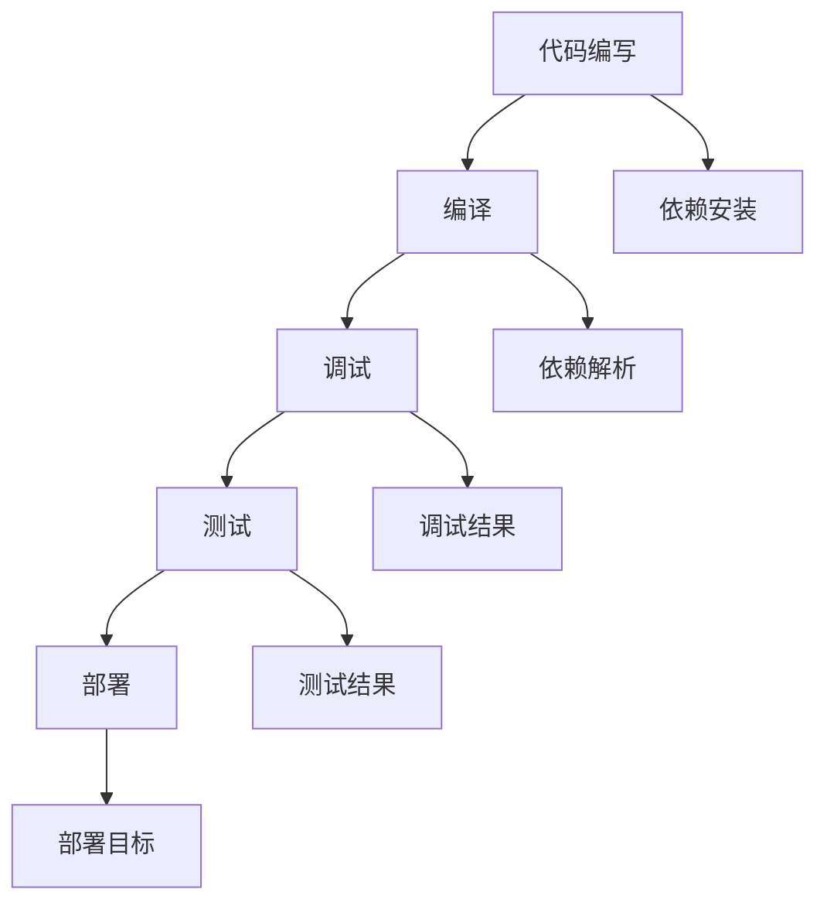

                 

# 树莓派开发：从入门到精通

## 1. 背景介绍

### 1.1 问题由来
近年来，随着嵌入式系统的普及和物联网技术的快速发展，树莓派(Raspberry Pi)以其低成本、易用性、强大性能等特点，迅速成为嵌入式开发和物联网应用的首选平台之一。树莓派以其卓越的性价比和丰富的资源，被广泛应用于教育、科研、智能家居、媒体制作等多个领域，成为全球开发者最喜爱的嵌入式硬件平台。

### 1.2 问题核心关键点
本文旨在系统性地介绍树莓派开发的基本原理和实践技能，从入门到精通，帮助读者掌握树莓派硬件和软件的开发方法，构建智能应用。对于刚入门树莓派开发的读者，本文将从硬件安装和配置、操作系统安装、基本软件开发流程、进阶应用开发等多个层面进行深入讲解。对于有一定经验的读者，本文将重点讨论树莓派的高级应用开发、硬件驱动开发、系统优化和调试技巧等高级主题。

### 1.3 问题研究意义
掌握树莓派开发技能，对开发者具有重要意义：

1. **低成本进入嵌入式开发**：树莓派以其低廉的价格，让更多的开发者可以轻松地进入嵌入式开发领域。
2. **丰富的资源和社区支持**：树莓派拥有强大的社区支持和丰富的开源资源，可以快速上手开发。
3. **广泛的应用场景**：树莓派在智能家居、物联网、教育、科研等多个领域有广泛应用，开发前景广阔。
4. **系统学习和实践**：通过树莓派平台，可以系统地学习嵌入式系统开发、操作系统原理、硬件驱动开发等多方面的知识，提升综合开发能力。
5. **开源和跨平台特性**：树莓派基于Linux操作系统，具有良好的开源和跨平台特性，方便开发者进行二次开发和移植。

## 2. 核心概念与联系

### 2.1 核心概念概述

为了更好地理解树莓派开发，本节将介绍几个关键的核心概念：

- **树莓派(Raspberry Pi)**：一款基于ARM架构的微控制器，具有强大的计算能力和丰富的I/O接口，被广泛应用于嵌入式开发和物联网应用。
- **Linux操作系统**：树莓派默认使用Linux操作系统，提供了丰富的开发工具和资源支持。
- **Python编程语言**：树莓派开发常用的编程语言，具有简单易学、易用性强的特点，广泛应用于树莓派开发。
- **树莓派开发板**：包括树莓派3B+、4B+、Zero等不同型号，提供不同的性能和资源。
- **树莓派图像系统(的形象)**：为了方便用户安装和使用，树莓派提供了多种操作系统镜像，可以通过烧录到SD卡或MicroSD卡中直接启动。
- **树莓派开发工具链**：包括编译器、调试器、IDE等工具，支持C/C++、Python等编程语言。

这些核心概念之间的逻辑关系可以通过以下Mermaid流程图来展示：

```mermaid
graph TB
    A[树莓派(Raspberry Pi)] --> B[Linux操作系统]
    A --> C[Python编程语言]
    A --> D[树莓派开发板]
    A --> E[树莓派图像系统(形象)]
    A --> F[树莓派开发工具链]
```

这个流程图展示了一些关键概念及其之间的联系：

1. 树莓派硬件平台通过Linux操作系统、Python语言和开发工具链支持软件的运行和开发。
2. 树莓派开发板提供不同型号的硬件资源，方便开发者根据需求选择合适的硬件配置。
3. 树莓派图像系统作为预装操作系统的镜像，方便用户快速启动和部署。
4. 树莓派开发工具链提供完整的开发环境和工具支持，包括编译器、调试器、IDE等。

## 3. 核心算法原理 & 具体操作步骤

### 3.1 算法原理概述
树莓派开发的核心算法原理可以简单概括为：通过树莓派硬件平台和Linux操作系统，利用Python等编程语言，在开发工具链的支持下，实现对树莓派硬件的编程和应用开发。

树莓派开发的主要步骤包括：

1. **硬件安装和配置**：安装树莓派开发板，配置网络、电源、接口等硬件。
2. **操作系统安装**：选择适合的操作系统镜像，通过烧录或安装程序安装到SD卡或MicroSD卡中。
3. **软件开发流程**：包括编写、编译、调试、测试和部署等步骤。
4. **高级应用开发**：包括网络编程、图形界面开发、嵌入式系统编程、硬件驱动开发等。

### 3.2 算法步骤详解

**Step 1: 硬件安装和配置**

1. 选择适合的树莓派开发板，如树莓派3B+、4B+、Zero等。
2. 准备SD卡或MicroSD卡，并确保有足够的容量用于安装操作系统。
3. 安装树莓派操作系统镜像到SD卡或MicroSD卡中。

树莓派开发板硬件安装和配置示例代码如下：

```bash
# 连接到树莓派开发板
ssh pi@<开发板IP地址>

# 更新系统软件包
sudo apt update

# 安装基本软件包
sudo apt install -y vim git curl wget python3-pip

# 配置wifi
sudo raspi-config
# 选择wifi选项，输入wifi密码

# 配置静态IP地址
sudo nano /etc/dhcpcd.conf

# 添加静态IP配置
sudo reboot
```

**Step 2: 操作系统安装**

1. 将SD卡或MicroSD卡插入树莓派开发板。
2. 启动树莓派开发板，通过网络连接到开发板。
3. 根据操作系统镜像的官方指南，完成系统安装和配置。

树莓派3B+操作系统安装示例代码如下：

```bash
# 插入SD卡
sudo fdisk /dev/sdX

# 选择main分区，设置大小为整个SD卡
n
# 设置分区类型为Linux

# 设置文件系统为ext4
t
# 设置主分区

# 保存并退出
w

# 挂载SD卡
sudo mount /dev/sdX1 /mnt

# 同步文件系统
sudo mount -o commit /mnt /dev/sdX1

# 安装操作系统镜像
sudo unzip rpios-<version>.zip -d rpios

# 执行安装程序
sudo ./rpios-<version>/rpi-<version>-image -b <boot partition> -c /mnt

# 重启树莓派
sudo reboot
```

**Step 3: 软件开发流程**

1. 编写代码，使用文本编辑器（如vim）编写Python脚本。
2. 编译和安装代码，使用pip安装依赖库。
3. 调试和测试代码，使用IDE（如PyCharm）进行调试。
4. 部署和发布代码，使用rsync或其他工具将代码部署到树莓派开发板。

树莓派Python脚本示例代码如下：

```python
import time

while True:
    print("Hello, Raspberry Pi!")
    time.sleep(5)
```

**Step 4: 高级应用开发**

1. 网络编程：使用Python的socket模块进行TCP/UDP通信。
2. 图形界面开发：使用PyQt或PyGTK等工具创建图形用户界面(GUI)。
3. 嵌入式系统编程：使用C/C++进行底层系统编程，如驱动程序开发。
4. 硬件驱动开发：使用树莓派提供的外围设备API，如GPIO、I²C、SPI等，进行硬件驱动开发。

树莓派网络编程示例代码如下：

```python
import socket

# 创建TCP客户端
client_socket = socket.socket(socket.AF_INET, socket.SOCK_STREAM)
server_address = ("127.0.0.1", 8888)
client_socket.connect(server_address)

# 发送消息
client_socket.send("Hello, server!".encode())

# 接收消息
response = client_socket.recv(1024).decode()
print("Server response:", response)

# 关闭连接
client_socket.close()
```

### 3.3 算法优缺点

树莓派开发的主要优点包括：

1. **易用性**：树莓派硬件和Linux系统都具有较高的易用性，上手快，调试方便。
2. **灵活性**：树莓派支持多种编程语言和开发工具，适合不同需求和水平的开发者。
3. **资源丰富**：树莓派社区提供了丰富的资源和工具，包括开源项目、教程、硬件驱动等。
4. **应用广泛**：树莓派在智能家居、物联网、教育、科研等多个领域有广泛应用，开发前景广阔。

同时，树莓派开发也存在一些缺点：

1. **性能限制**：树莓派硬件性能有限，不适合高计算量和高实时性的应用。
2. **硬件兼容**：不同型号的树莓派开发板硬件资源差异较大，需要根据需求选择合适的硬件配置。
3. **安装复杂**：安装操作系统和配置硬件需要一定的技术背景，初学者可能面临挑战。
4. **硬件驱动开发复杂**：树莓派硬件驱动开发相对复杂，需要具备一定的硬件和操作系统编程知识。

尽管存在这些缺点，但树莓派开发以其易用性、灵活性和广泛的应用场景，仍然受到开发者和用户的青睐。

### 3.4 算法应用领域

树莓派开发在多个领域得到了广泛应用，包括但不限于：

- **智能家居**：树莓派可以作为智能家居控制中心的中心节点，实现语音控制、智能照明、智能安防等功能。
- **物联网**：树莓派可以通过Wi-Fi、蓝牙、NFC等接口，连接各种传感器和设备，实现数据采集和远程控制。
- **教育**：树莓派可以用于机器人制作、编程教学、科学实验等多个教育场景，提升学生动手能力和学习兴趣。
- **媒体制作**：树莓派可以通过HDMI接口连接显示器，运行视频编辑、音频处理、3D渲染等应用，成为轻量级媒体制作平台。
- **科研**：树莓派可以用于数据采集、图像处理、信号分析等多个科研领域，提升科研效率和数据处理能力。

以上树莓派开发的应用场景，展示了其在嵌入式系统、物联网、教育、科研等多个领域的重要价值。

## 4. 数学模型和公式 & 详细讲解 & 举例说明

### 4.1 数学模型构建

树莓派开发主要涉及嵌入式系统编程和操作系统原理，因此可以构建一些基本的数学模型来描述其开发过程。

**嵌入式系统模型**：
树莓派开发板可以视为一个嵌入式系统，包括处理器、存储器、I/O接口等组件。其中处理器通常采用ARM架构，具有较高的计算能力和性能。存储器包括RAM和ROM，用于存储代码和数据。I/O接口包括GPIO、I²C、SPI等，用于连接各种传感器和设备。

**操作系统模型**：
树莓派开发板通常运行Linux操作系统，可以抽象为一个多任务、多进程的操作系统。Linux操作系统提供了丰富的系统调用和API，方便开发者进行编程和开发。

**开发流程模型**：
树莓派开发流程可以抽象为一个数据流模型，包括代码编写、编译、调试、测试和部署等步骤。每个步骤都有明确的输入和输出，数据流图如下：



这个数据流图展示了树莓派开发的整个流程，从代码编写到最终部署，每个步骤都有明确的输入和输出，方便开发者进行开发和调试。

### 4.2 公式推导过程

树莓派开发中的数学模型和公式相对较少，主要涉及一些算法和计算方法。例如，树莓派网络编程中常用的TCP/UDP协议，可以通过以下公式来描述：

- TCP协议：
  \[ TCP = \{(data, seq, ack, flag)\} \]
  其中，data表示传输的数据，seq表示发送数据的序列号，ack表示接收确认号，flag表示控制标志。

- UDP协议：
  \[ UDP = \{(data, seq, ack)\} \]
  其中，data表示传输的数据，seq表示发送数据的序列号，ack表示接收确认号。

这些公式描述了TCP和UDP协议的基本结构，方便开发者进行网络编程和通信。

### 4.3 案例分析与讲解

以树莓派网络编程为例，分析其核心算法和计算过程。树莓派网络编程主要涉及TCP和UDP协议，其核心算法和计算过程如下：

**TCP协议**：
TCP协议是一种可靠的传输协议，支持数据流传输和可靠传输。其核心算法包括：

1. 三次握手：客户端向服务器发送连接请求，服务器响应确认，客户端再确认连接成功。
2. 数据传输：数据通过TCP连接进行传输，传输过程中进行错误检测和重传。
3. 四次挥手：连接关闭时，客户端和服务器分别发送连接关闭请求和确认，完成关闭。

**UDP协议**：
UDP协议是一种无连接的传输协议，支持数据报传输和不可靠传输。其核心算法包括：

1. 数据传输：数据通过UDP连接进行传输，无错误检测和重传。
2. 接收确认：接收端通过发送确认消息，告诉发送端已经接收到数据。

树莓派网络编程示例代码如下：

```python
import socket

# 创建TCP客户端
client_socket = socket.socket(socket.AF_INET, socket.SOCK_STREAM)
server_address = ("127.0.0.1", 8888)
client_socket.connect(server_address)

# 发送消息
client_socket.send("Hello, server!".encode())

# 接收消息
response = client_socket.recv(1024).decode()
print("Server response:", response)

# 关闭连接
client_socket.close()
```

## 5. 项目实践：代码实例和详细解释说明

### 5.1 开发环境搭建

在进行树莓派开发前，我们需要准备好开发环境。以下是使用Python进行树莓派开发的环境配置流程：

1. 安装Anaconda：从官网下载并安装Anaconda，用于创建独立的Python环境。

2. 创建并激活虚拟环境：
```bash
conda create -n rpi-env python=3.8 
conda activate rpi-env
```

3. 安装树莓派开发所需的Python库：
```bash
pip install pipenv
pipenv install rpi-api pyserial
```

4. 安装树莓派开发所需的依赖库：
```bash
sudo apt update
sudo apt install -y python3-pip python3-dev
sudo apt install -y libgpiod-dev libudev-dev libfreetype6-dev libgl1-mesa-glx libx11-dev libxt-dev
```

完成上述步骤后，即可在`rpi-env`环境中开始树莓派开发实践。

### 5.2 源代码详细实现

下面我们以树莓派网络编程为例，给出使用Python编写的树莓派网络编程代码实现。

首先，编写TCP客户端代码：

```python
import socket

# 创建TCP客户端
client_socket = socket.socket(socket.AF_INET, socket.SOCK_STREAM)
server_address = ("127.0.0.1", 8888)
client_socket.connect(server_address)

# 发送消息
client_socket.send("Hello, server!".encode())

# 接收消息
response = client_socket.recv(1024).decode()
print("Server response:", response)

# 关闭连接
client_socket.close()
```

然后，编写UDP服务器代码：

```python
import socket

# 创建UDP服务器
server_socket = socket.socket(socket.AF_INET, socket.SOCK_DGRAM)
server_address = ("127.0.0.1", 8888)
server_socket.bind(server_address)

while True:
    # 接收消息
    data, address = server_socket.recvfrom(1024)
    print("Received message:", data.decode())

    # 发送确认消息
    client_socket.send("Message received.".encode())
```

接下来，编写网络调试代码：

```python
import socket

# 创建TCP客户端
client_socket = socket.socket(socket.AF_INET, socket.SOCK_STREAM)
server_address = ("127.0.0.1", 8888)
client_socket.connect(server_address)

# 发送消息
client_socket.send("Hello, server!".encode())

# 接收消息
response = client_socket.recv(1024).decode()
print("Server response:", response)

# 关闭连接
client_socket.close()
```

### 5.3 代码解读与分析

让我们再详细解读一下关键代码的实现细节：

**TCP客户端代码**：
- 使用socket库创建TCP客户端，并指定服务器地址和端口。
- 通过connect方法建立TCP连接。
- 使用send方法发送数据。
- 使用recv方法接收数据，并解码为字符串。
- 关闭连接。

**UDP服务器代码**：
- 使用socket库创建UDP服务器，并绑定到指定地址和端口。
- 进入无限循环，接收数据和地址。
- 打印接收到的数据。
- 发送确认消息。

**网络调试代码**：
- 使用socket库创建TCP客户端，并指定服务器地址和端口。
- 通过connect方法建立TCP连接。
- 使用send方法发送数据。
- 使用recv方法接收数据，并解码为字符串。
- 关闭连接。

以上代码展示了树莓派网络编程的基本流程和实现方法，通过不断调试和优化，可以实现各种网络应用。

### 5.4 运行结果展示

运行树莓派网络编程代码后，可以在树莓派开发板上查看网络调试结果和服务器输出。如果一切正常，应该看到服务器的输出消息，以及客户端的接收确认信息。

## 6. 实际应用场景

### 6.1 智能家居

树莓派开发在智能家居领域有广泛应用。树莓派可以作为智能家居控制中心，通过Wi-Fi和蓝牙连接各种传感器和设备，实现智能照明、智能安防、智能温控等功能。例如，可以通过树莓派开发板，连接门窗传感器、温湿度传感器、智能门锁等设备，实现智能家居自动化控制。

### 6.2 物联网

树莓派开发在物联网领域也有广泛应用。树莓派可以通过Wi-Fi、蓝牙、NFC等接口，连接各种传感器和设备，实现数据采集和远程控制。例如，可以通过树莓派开发板，连接GPS模块、温度传感器、湿度传感器等设备，实现实时位置追踪和环境监测。

### 6.3 教育

树莓派开发在教育领域也有广泛应用。树莓派可以作为编程教学工具，提升学生动手能力和编程水平。例如，可以通过树莓派开发板，进行机器人制作、科学实验、编程教学等活动，激发学生的学习兴趣和创新能力。

### 6.4 媒体制作

树莓派开发在媒体制作领域也有广泛应用。树莓派可以通过HDMI接口连接显示器，运行视频编辑、音频处理、3D渲染等应用，成为轻量级媒体制作平台。例如，可以通过树莓派开发板，进行视频剪辑、音频制作、动画渲染等操作，制作高质量的媒体作品。

## 7. 工具和资源推荐

### 7.1 学习资源推荐

为了帮助开发者系统掌握树莓派开发的基本原理和实践技能，这里推荐一些优质的学习资源：

1. 《树莓派编程实践》系列书籍：涵盖树莓派硬件安装、操作系统安装、Python编程、网络编程等多个主题，适合入门和进阶读者。
2. 《树莓派项目实战》系列书籍：涵盖树莓派硬件驱动开发、嵌入式系统编程、图形界面开发等多个主题，适合有一定编程基础的读者。
3. 树莓派社区论坛：树莓派社区拥有活跃的开发者和用户群体，提供丰富的教程、案例和资源，适合查找和解决技术问题。
4. 树莓派文档：树莓派官方文档详细介绍了树莓派硬件和软件的使用方法，适合初学者和开发者参考。
5. 树莓派教程：树莓派官方网站提供了丰富的教程和指南，适合初学者和进阶开发者。

通过对这些资源的学习实践，相信你一定能够系统掌握树莓派开发的技能，并应用于实际项目中。

### 7.2 开发工具推荐

高效的开发离不开优秀的工具支持。以下是几款用于树莓派开发的常用工具：

1. PyCharm：功能强大的Python IDE，支持代码调试、版本控制、代码重构等高级功能。
2. PyGObject：基于GObject的Python绑定库，支持图形界面开发，方便开发者进行GUI开发。
3. PySerial：Python串口通信库，支持树莓派硬件的串口通信，方便开发者进行硬件驱动开发。
4. PyUSB：Python USB通信库，支持树莓派的USB通信，方便开发者进行USB设备驱动开发。
5. Git：版本控制系统，方便开发者进行代码版本控制和团队协作。

合理利用这些工具，可以显著提升树莓派开发的效率，加快创新迭代的步伐。

### 7.3 相关论文推荐

树莓派开发领域的研究论文数量众多，以下是几篇经典论文，推荐阅读：

1. "A Survey of Raspberry Pi Applications"：综述了树莓派开发在智能家居、物联网、教育、科研等多个领域的应用。
2. "Raspberry Pi System Design and Architecture"：介绍了树莓派的硬件和软件架构，以及开发工具链的使用方法。
3. "Raspberry Pi Linux Kernel Development"：介绍了树莓派Linux内核的开发方法和实践技巧，适合有一定编程基础的读者。
4. "Raspberry Pi Hardware Drivers"：介绍了树莓派硬件驱动的开发方法和实践技巧，适合硬件开发人员。
5. "Raspberry Pi Neural Network Development"：介绍了树莓派神经网络的开发方法和实践技巧，适合神经网络开发人员。

这些论文代表了大语言模型微调技术的发展脉络。通过学习这些前沿成果，可以帮助研究者把握学科前进方向，激发更多的创新灵感。

## 8. 总结：未来发展趋势与挑战

### 8.1 总结

本文对树莓派开发的基本原理和实践技能进行了全面系统的介绍。从硬件安装和配置、操作系统安装、软件开发流程、高级应用开发等多个层面进行了深入讲解。通过本文的学习，读者可以系统掌握树莓派开发的技能，应用到实际项目中。

### 8.2 未来发展趋势

展望未来，树莓派开发将呈现以下几个发展趋势：

1. **硬件性能提升**：随着硬件技术的发展，树莓派的性能将不断提升，支持更高计算量的应用。
2. **操作系统优化**：树莓派操作系统将不断优化，提供更稳定、高效的系统环境。
3. **开发工具丰富**：树莓派开发工具将不断丰富，提供更多功能和支持。
4. **应用场景拓展**：树莓派将在更多领域得到应用，如智能制造、医疗、金融等。
5. **开源社区壮大**：树莓派社区将不断壮大，提供更多资源和支持。

### 8.3 面临的挑战

尽管树莓派开发前景广阔，但仍面临以下挑战：

1. **硬件兼容性**：不同型号的树莓派开发板硬件资源差异较大，需要根据需求选择合适的硬件配置。
2. **系统稳定性**：树莓派硬件和操作系统相对不稳定，需要开发者具备较高的技术水平。
3. **开发成本**：树莓派硬件和开发工具需要一定的成本投入，对于初学者可能存在经济负担。
4. **资源限制**：树莓派硬件资源有限，不适合高计算量和实时性要求高的应用。
5. **硬件驱动开发复杂**：树莓派硬件驱动开发相对复杂，需要开发者具备较高的硬件和操作系统编程知识。

尽管存在这些挑战，但树莓派开发凭借其易用性、灵活性和广泛的应用场景，仍然受到开发者和用户的青睐。未来，随着硬件性能和操作系统的不断优化，树莓派将得到更广泛的应用和发展。

### 8.4 研究展望

未来，树莓派开发需要在以下几个方面进行探索：

1. **硬件性能优化**：提升树莓派硬件性能，支持更高计算量的应用。
2. **操作系统优化**：优化树莓派操作系统，提供更稳定、高效的系统环境。
3. **开发工具丰富**：提供更多功能和支持的开发工具，方便开发者进行开发。
4. **应用场景拓展**：在更多领域进行应用，提升树莓派的市场影响力。
5. **开源社区壮大**：壮大树莓派社区，提供更多资源和支持。

这些研究方向将推动树莓派开发技术的发展，使其在更多领域得到应用和推广。

## 9. 附录：常见问题与解答

**Q1：如何安装树莓派操作系统？**

A: 树莓派操作系统可以通过烧录到SD卡或MicroSD卡中，直接启动。具体步骤如下：

1. 下载操作系统镜像。
2. 将镜像文件写入SD卡或MicroSD卡。
3. 将SD卡或MicroSD卡插入树莓派开发板，启动树莓派。

**Q2：如何使用树莓派进行网络编程？**

A: 树莓派网络编程主要涉及TCP和UDP协议，具体步骤如下：

1. 安装Python和socket库。
2. 编写网络程序代码，使用socket库创建客户端或服务器。
3. 运行程序，测试网络连接和数据传输。

**Q3：树莓派硬件兼容性如何？**

A: 树莓派硬件资源丰富，支持多种传感器和设备的连接。不同型号的树莓派开发板硬件资源差异较大，需要根据需求选择合适的硬件配置。

**Q4：树莓派硬件驱动开发复杂吗？**

A: 树莓派硬件驱动开发相对复杂，需要开发者具备一定的硬件和操作系统编程知识。可以参考官方文档和社区资源，逐步学习和掌握硬件驱动开发技能。

**Q5：树莓派开发前景如何？**

A: 树莓派开发前景广阔，在智能家居、物联网、教育、科研等多个领域有广泛应用。未来，随着硬件性能和操作系统的不断优化，树莓派将得到更广泛的应用和发展。

通过本文的系统梳理，可以看到，树莓派开发以其易用性、灵活性和广泛的应用场景，具有广阔的发展前景。未来，树莓派开发将不断扩展应用边界，推动嵌入式系统、物联网、教育、科研等多个领域的创新发展。

---
作者：禅与计算机程序设计艺术 / Zen and the Art of Computer Programming

