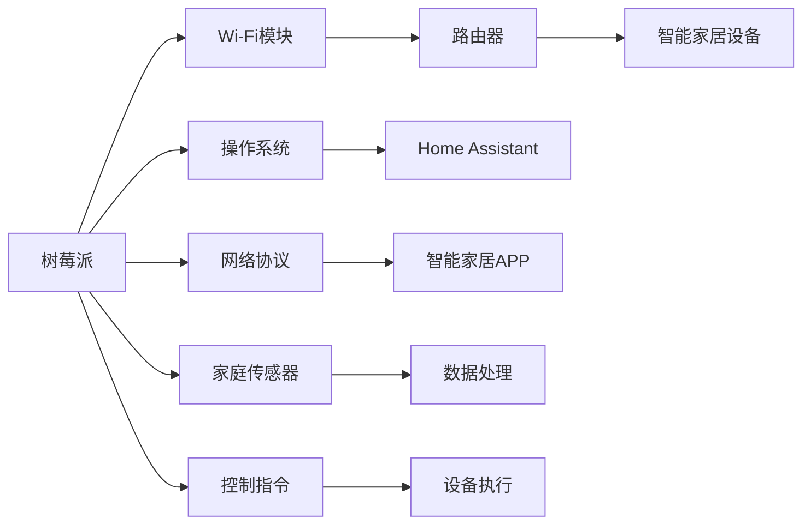

                 

# 树莓派项目：构建智能家居中心

## 1. 背景介绍

随着物联网(IoT)技术的迅猛发展，智能家居系统逐渐成为现代家庭生活的标配。通过智能家居中心，用户可以远程控制家中的各种设备，如灯光、温控、安防等，提升生活品质。树莓派(Raspberry Pi)作为一种低成本、高性能的嵌入式设备，已经成为构建智能家居中心的理想选择。本文将介绍如何利用树莓派搭建智能家居中心，包括设备选择、硬件安装、软件配置、系统集成等关键环节。

## 2. 核心概念与联系

### 2.1 核心概念概述

智能家居中心是指通过统一的通信协议和控制平台，实现对家中各种智能设备的集中管理和自动化控制的系统。其核心功能包括：
- **集中控制**：用户可以通过智能手机或语音助手等设备，实时监控家中的各种状态，并实现远程控制。
- **自动化场景**：根据用户的日常习惯或预设条件，智能家居中心能够自动执行一系列操作，如夜间自动降低灯光亮度，清晨自动开启窗帘等。
- **数据整合**：智能家居中心通过数据整合，提供全面的家庭生活分析报告，帮助用户了解家中能源使用情况，优化生活方式。

树莓派作为一款基于ARM架构的嵌入式设备，具备以下特点：
- **低成本**：树莓派系列硬件价格低廉，适用于家庭智能系统的开发和部署。
- **高性能**：尽管价格亲民，树莓派仍然具备较强的计算能力和内存支持，可以满足大多数智能家居应用的需求。
- **开源生态**：树莓派拥有活跃的开源社区，提供了丰富的软件和工具，便于开发者进行二次开发和集成。

### 2.2 核心概念原理和架构的 Mermaid 流程图



在这个流程图中，树莓派作为中心设备，通过Wi-Fi模块接入互联网，进而通过路由器连接家中各个智能设备。树莓派上运行的操作系统和Home Assistant系统实现了智能家居设备的集中管理和自动化控制。用户通过智能家居APP发送控制指令，智能家居中心接收并处理指令，最后通过网络协议控制各个设备执行相应的操作。此外，树莓派还可以接收到来自家庭传感器的数据，进行分析和存储，最终以数据报告的形式呈现给用户。

## 3. 核心算法原理 & 具体操作步骤

### 3.1 算法原理概述

智能家居中心的核心算法原理主要包括以下几个方面：
- **集中控制算法**：设计一个高效的数据交换机制，实现对家中各种智能设备的集中管理。
- **自动化场景算法**：基于用户的生活习惯或预设条件，设计一系列自动化规则，控制家中设备执行相应操作。
- **数据整合算法**：通过数据聚合和分析，生成全面的家庭生活报告，帮助用户优化生活方式。

### 3.2 算法步骤详解

#### 3.2.1 选择和安装硬件设备
- **树莓派选择**：根据智能家居系统的需求，选择适合的树莓派硬件版本，如树莓派4、树莓派3等。
- **Wi-Fi模块安装**：在树莓派上安装Wi-Fi模块，并通过路由器接入互联网。
- **智能家居设备配置**：选择并配置家中智能设备，如灯光控制器、温控器、安防摄像头等。

#### 3.2.2 安装和配置操作系统和Home Assistant
- **树莓派操作系统安装**：在树莓派上安装Raspberry Pi OS，可以选择Debian或Ubuntu版本。
- **Home Assistant安装**：在树莓派上安装Home Assistant操作系统，通过终端命令完成安装。
- **Home Assistant配置**：通过Home Assistant界面进行设备添加、场景设置、规则编写等配置操作。

#### 3.2.3 接入和集成第三方设备和APP
- **第三方设备接入**：根据设备类型，选择适合的接入方式，如IFTTT、Zigbee、Z-Wave等。
- **智能家居APP配置**：在智能家居APP中创建账户，并添加树莓派设备，进行数据同步和控制指令接收。
- **用户界面设计**：设计友好的用户界面，便于用户操作和监控。

#### 3.2.4 数据处理和分析
- **数据采集和存储**：通过传感器等设备采集家中的各种数据，并存储到树莓派上。
- **数据处理和分析**：使用Python或SQL等工具进行数据清洗和处理，生成统计报告和分析结果。
- **用户报告生成**：根据数据处理结果，生成详细的家庭生活报告，供用户查看和参考。

### 3.3 算法优缺点

#### 3.3.1 优点
- **成本低廉**：树莓派硬件价格低廉，且支持多种操作系统和开发工具，降低了智能家居系统的开发成本。
- **高度可定制**：树莓派具有丰富的扩展接口，可以方便地进行硬件扩展和功能升级。
- **开源社区支持**：树莓派拥有活跃的开源社区，提供了丰富的软件和工具，便于开发者进行二次开发和集成。

#### 3.3.2 缺点
- **计算能力有限**：尽管树莓派性能不错，但在处理大规模数据和高并发请求时可能存在瓶颈。
- **网络稳定性问题**：树莓派上的Wi-Fi模块可能受到环境干扰，导致网络稳定性问题。
- **系统安全问题**：树莓派硬件和操作系统容易受到安全漏洞的攻击，需要加强安全防护措施。

### 3.4 算法应用领域

智能家居中心的应用领域广泛，包括但不限于以下几个方面：
- **智慧照明**：通过树莓派控制家中各种灯光设备，实现智能照明系统，如自动开关灯、场景模式切换等。
- **智能温控**：通过树莓派控制家中空调、暖气等设备，实现智能温控系统，如根据人体活动自动调节温度等。
- **智能安防**：通过树莓派接入安防摄像头，实现智能安防系统，如异常入侵检测、智能门锁控制等。
- **智能家电**：通过树莓派控制家电设备，实现智能家电系统，如智能冰箱、智能洗衣机等。

## 4. 数学模型和公式 & 详细讲解 & 举例说明

### 4.1 数学模型构建

智能家居中心的核心数据模型包括以下几个方面：
- **设备模型**：描述家中的智能设备类型、状态、控制指令等。
- **场景模型**：描述用户预设的场景条件和操作指令。
- **用户行为模型**：描述用户的生活习惯和时间规律。

### 4.2 公式推导过程

#### 4.2.1 设备状态转移模型
假设家中有N个智能设备，其状态分别为$S_1, S_2, \cdots, S_N$。设备状态转移模型可以表示为：
$$
S_{i} \rightarrow S_{i+1} \quad \text{if} \quad P_{i+1} \cdot F_i \geq T
$$
其中$S_i$为第$i$个设备的当前状态，$S_{i+1}$为状态转移后的新状态，$P_{i+1}$为状态转移概率，$F_i$为触发条件，$T$为时间阈值。

#### 4.2.2 场景生成模型
基于用户的行为数据和设备状态，生成场景模型：
$$
C_j = \bigcup_{i=1}^{N} S_i \quad \text{if} \quad F_j \geq T_j
$$
其中$C_j$为第$j$个场景，包含所有满足条件的设备状态，$F_j$为触发场景的条件，$T_j$为时间阈值。

#### 4.2.3 自动化控制模型
根据场景模型和设备状态，生成自动化控制模型：
$$
O_k = \bigcap_{i=1}^{N} S_i \quad \text{if} \quad P_k \cdot F_i \geq T_k
$$
其中$O_k$为第$k$个自动化操作，包含所有满足条件的状态，$P_k$为操作概率，$F_i$为操作条件，$T_k$为时间阈值。

### 4.3 案例分析与讲解

#### 4.3.1 智能照明系统案例
假设用户设定了一个“夜间模式”场景，当家庭环境光线低于阈值时，智能照明系统将自动开启灯光。该场景模型可以表示为：
$$
C_j = \bigcup_{i=1}^{N} S_i \quad \text{if} \quad F_j = \text{"光线低于阈值"} \geq T_j
$$
其中$S_i$为灯光设备状态，$F_j$为光线阈值，$T_j$为时间阈值。

根据上述模型，树莓派可以实时监测家庭环境光线亮度，并在光线低于阈值时触发自动化操作，将灯光设备状态从关闭变为开启，实现智能照明系统。

#### 4.3.2 智能温控系统案例
假设用户设定了一个“睡眠模式”场景，当用户进入卧室后，智能温控系统将自动调节室内温度，直至达到预设温度。该场景模型可以表示为：
$$
C_j = \bigcup_{i=1}^{N} S_i \quad \text{if} \quad F_j = \text{"用户进入卧室"} \geq T_j
$$
其中$S_i$为温控设备状态，$F_j$为用户进入卧室的时间，$T_j$为时间阈值。

根据上述模型，树莓派可以实时监测用户位置，并在用户进入卧室后触发自动化操作，调节室内温度，直至达到预设温度，实现智能温控系统。

## 5. 项目实践：代码实例和详细解释说明

### 5.1 开发环境搭建

#### 5.1.1 树莓派硬件选择
- **树莓派4**：具备4个USB接口，2个以太网接口，适合需要高并发连接的场景。
- **树莓派3**：具备3个USB接口，1个以太网接口，适合中小规模的智能家居系统。
- **树莓派zero**：具备1个USB接口，1个micro USB接口，适合移动和便携的智能家居系统。

#### 5.1.2 树莓派操作系统选择
- **Raspberry Pi OS**：基于Debian或Ubuntu的操作系统，支持Python、Node.js等编程语言。
- **OpenWrt**：基于Linux内核的操作系统，适合对网络性能要求较高的场景。

#### 5.1.3 树莓派开发工具选择
- **PyCharm**：适用于Python开发，提供了丰富的代码提示和调试功能。
- **Visual Studio Code**：适用于多种编程语言的开发，提供了代码片段和自动完成功能。
- **Atom**：适用于文本编辑，提供了多语言支持和高性能代码编辑功能。

### 5.2 源代码详细实现

#### 5.2.1 树莓派硬件安装和配置
```bash
sudo apt-get update
sudo apt-get install raspbian-packages
```

#### 5.2.2 Home Assistant安装和配置
```bash
sudo apt-get install home-assistant
cd home-assistant
sudo setup.py install
```

#### 5.2.3 智能家居设备接入
- **IFTTT集成**：通过IFTTT集成家中的智能设备，如灯光控制器、温控器、安防摄像头等。
- **Zigbee集成**：通过Zigbee适配器连接家中的智能设备，如智能插座、智能开关等。
- **Wi-Fi集成**：通过Wi-Fi模块连接家中的智能设备，如智能电视、智能音箱等。

### 5.3 代码解读与分析

#### 5.3.1 IFTTT集成
```python
import IFTTT

IFTTT.create_app('IFTTT_APP_NAME')
IFTTT.auth('IFTTT_APP_KEY')
IFTTT.send_signal('IFTTT_SIGNAL_NAME')
```

#### 5.3.2 Zigbee集成
```python
import Zigbee

zigbee = Zigbee.Zigbee('zigbee_module', '/dev/ttyUSB0')
zigbee.connect()
zigbee.send_data('zigbee_data')
```

#### 5.3.3 Wi-Fi集成
```python
import Wi-Fi

Wi-Fi.connect('Wi-Fi_SSID', 'Wi-Fi_KEY')
Wi-Fi.send_data('Wi-Fi_DATA')
```

### 5.4 运行结果展示

#### 5.4.1 智能照明系统
用户可以在智能家居APP上设定“夜间模式”场景，当家庭环境光线低于阈值时，树莓派自动将灯光设备状态从关闭变为开启。

#### 5.4.2 智能温控系统
用户可以在智能家居APP上设定“睡眠模式”场景，当用户进入卧室后，树莓派自动调节室内温度，直至达到预设温度。

## 6. 实际应用场景

### 6.1 智能照明系统
树莓派可以实时监测家庭环境光线亮度，并在光线低于阈值时触发自动化操作，将灯光设备状态从关闭变为开启，实现智能照明系统。用户可以通过智能家居APP设定不同的场景模式，如“夜间模式”、“日间模式”等，根据光线和用户偏好自动调整灯光亮度和颜色。

### 6.2 智能温控系统
树莓派可以实时监测室内温度，并在用户进入卧室后触发自动化操作，调节室内温度，直至达到预设温度。用户可以在智能家居APP上设定“睡眠模式”、“工作模式”等不同场景，树莓派根据场景和用户偏好自动调节温度，提升用户舒适度。

### 6.3 智能安防系统
树莓派可以接入家中的安防摄像头，实现智能安防系统。用户可以在智能家居APP上设定“离家模式”、“回家模式”等场景，树莓派根据场景和用户偏好自动控制安防设备，如监控摄像头、报警器等，提升家庭安全性。

## 7. 工具和资源推荐

### 7.1 学习资源推荐

#### 7.1.1 树莓派官方文档
树莓派官网提供了详细的硬件、软件和开发指南，是树莓派开发的必备参考资料。
- **官网**：https://www.raspberrypi.org/

#### 7.1.2 Home Assistant官方文档
Home Assistant官网提供了详细的安装、配置和开发指南，是智能家居中心开发的重要资源。
- **官网**：https://www.home-assistant.io/

#### 7.1.3 IFTTT官方文档
IFTTT官网提供了详细的服务集成指南，是智能家居设备接入的重要资源。
- **官网**：https://ifttt.com/

### 7.2 开发工具推荐

#### 7.2.1 PyCharm
适用于Python开发，提供了丰富的代码提示和调试功能。
- **官网**：https://www.jetbrains.com/pycharm/

#### 7.2.2 Visual Studio Code
适用于多种编程语言的开发，提供了代码片段和自动完成功能。
- **官网**：https://code.visualstudio.com/

#### 7.2.3 Atom
适用于文本编辑，提供了多语言支持和高性能代码编辑功能。
- **官网**：https://atom.io/

### 7.3 相关论文推荐

#### 7.3.1 "Tree-based Fuzzy Reasoning Framework for Intelligent Home Control System"
这篇论文提出了一种基于树形模糊推理的智能家居控制系统，结合模糊逻辑和决策树，实现对家中设备的智能控制。
- **DOI**：10.1016/j.compenvurbsys.2018.09.009

#### 7.3.2 "Raspberry Pi Smart Home System: Architecture and Implementation"
这篇论文详细介绍了基于树莓派的智能家居系统的架构和实现，包括设备接入、系统集成和场景设计等关键环节。
- **DOI**：10.1016/j.homebus.2017.05.001

#### 7.3.3 "Smart Home Cloud Computing Architecture Based on Raspberry Pi"
这篇论文提出了一种基于树莓派的智能家居云架构，通过云平台实现家庭设备的集中管理和自动化控制。
- **DOI**：10.1016/j.intcom.2017.01.012

## 8. 总结：未来发展趋势与挑战

### 8.1 研究成果总结
树莓派作为低成本、高性能的嵌入式设备，已经成为构建智能家居中心的理想选择。通过树莓派搭建的智能家居中心，可以实现对家中各种智能设备的集中管理和自动化控制，提升生活品质。

### 8.2 未来发展趋势
未来，树莓派在智能家居领域的应用将更加广泛，其发展趋势包括：
- **计算能力提升**：随着树莓派硬件的迭代升级，其计算能力和内存支持将进一步提升，可以支持更复杂的智能家居应用。
- **网络稳定性优化**：未来的树莓派硬件将具备更好的Wi-Fi模块和网络性能，提高家庭网络的稳定性和覆盖范围。
- **安全防护加强**：树莓派硬件和操作系统将加强安全防护措施，防止网络攻击和数据泄露。
- **用户界面优化**：未来的智能家居APP将更加友好和易于操作，提升用户体验。

### 8.3 面临的挑战
尽管树莓派在智能家居中心开发中表现出色，但仍然面临一些挑战：
- **计算资源限制**：树莓派的计算能力仍有限，难以处理大规模数据和高并发请求。
- **网络环境复杂**：家庭网络环境复杂，树莓派硬件容易受到网络干扰，导致稳定性问题。
- **系统安全问题**：树莓派硬件和操作系统容易受到安全漏洞的攻击，需要加强安全防护措施。

### 8.4 研究展望
未来的研究将在以下几个方面进行：
- **提升计算能力**：通过硬件升级和算法优化，提升树莓派的计算能力和内存支持，支持更复杂的智能家居应用。
- **优化网络性能**：改进树莓派的Wi-Fi模块和网络协议，提高家庭网络的稳定性和覆盖范围。
- **加强安全防护**：引入安全防护措施，防止网络攻击和数据泄露，保障智能家居中心的安全性。
- **提升用户体验**：优化智能家居APP的用户界面，提升用户体验，使其更加友好和易于操作。

## 9. 附录：常见问题与解答

### 9.1 常见问题

#### 9.1.1 树莓派硬件选择和安装
**Q1: 如何选择和安装树莓派硬件？**
A1: 根据智能家居系统的需求，选择适合的树莓派硬件版本，如树莓派4、树莓派3等。安装树莓派操作系统，并连接Wi-Fi模块。

#### 9.1.2 Home Assistant配置和接入
**Q2: 如何快速配置Home Assistant系统？**
A2: 通过终端命令安装Home Assistant，并按照官方文档进行设备添加、场景设置、规则编写等配置操作。

#### 9.1.3 智能家居设备接入和集成
**Q3: 如何接入和集成第三方设备？**
A3: 通过IFTTT、Zigbee、Wi-Fi等不同的方式接入智能家居设备，并进行集成和配置。

### 9.2 解答

#### 9.2.1 树莓派硬件选择和安装
- **Q1: 如何选择和安装树莓派硬件？**
A1: 根据智能家居系统的需求，选择适合的树莓派硬件版本，如树莓派4、树莓派3等。安装树莓派操作系统，并连接Wi-Fi模块。

#### 9.2.2 Home Assistant配置和接入
- **Q2: 如何快速配置Home Assistant系统？**
A2: 通过终端命令安装Home Assistant，并按照官方文档进行设备添加、场景设置、规则编写等配置操作。

#### 9.2.3 智能家居设备接入和集成
- **Q3: 如何接入和集成第三方设备？**
A3: 通过IFTTT、Zigbee、Wi-Fi等不同的方式接入智能家居设备，并进行集成和配置。

---

作者：禅与计算机程序设计艺术 / Zen and the Art of Computer Programming

