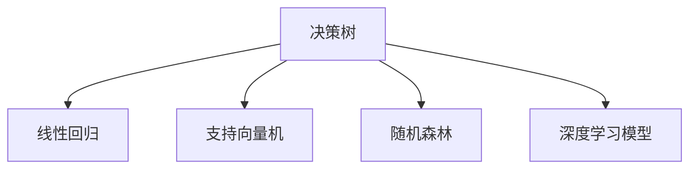

                 

# 模型思维在决策中的应用

## 1. 背景介绍

### 1.1 问题由来
决策一直是人类社会和自然界中最重要的活动之一。在工业生产、商业投资、科学研究、社会管理等众多领域，合理有效的决策可以极大地提高效率和效益。然而，传统决策过程往往依赖于经验、直觉和统计方法，存在一定的主观性和局限性。近年来，随着数据科学的兴起和人工智能技术的不断发展，模型思维（Model Thinking）在决策过程中得到了越来越广泛的应用。

### 1.2 问题核心关键点
模型思维指的是使用数学模型和统计模型进行决策分析的方法，通过构建和优化模型，辅助决策者理解复杂问题，优化决策过程。模型思维在决策中的关键点包括：

1. **数据驱动**：决策的依据不再是单一的经验和直觉，而是大量数据和科学模型。
2. **模型优化**：通过数学优化技术，寻找最优决策方案。
3. **跨领域应用**：模型思维可以应用于工业生产、金融投资、科学研究等多个领域。

### 1.3 问题研究意义
模型思维在决策中的应用，具有以下重要意义：

1. **提高决策质量**：模型思维能够提供客观的决策依据，减少人为因素的干扰，提高决策的科学性和合理性。
2. **优化资源配置**：通过模型分析，可以优化资源配置，提高经济效益和社会效益。
3. **促进创新**：模型思维的广泛应用，推动了科学技术的进步，加速了新知识和新技术的产生。
4. **增强风险控制**：模型可以帮助评估决策风险，规避风险，确保决策过程的稳健性。
5. **提升决策效率**：模型思维可以快速处理大量数据，提供高效准确的决策支持。

## 2. 核心概念与联系

### 2.1 核心概念概述

为更好地理解模型思维在决策中的应用，本节将介绍几个密切相关的核心概念：

- **决策树（Decision Tree）**：一种基于树形结构的分类模型，通过对数据进行递归分割，构建决策路径，辅助决策过程。
- **线性回归（Linear Regression）**：一种基于线性方程的回归模型，通过拟合数据，预测目标变量的取值。
- **支持向量机（Support Vector Machine, SVM）**：一种基于边界分类的模型，通过寻找最优超平面，实现对数据的高效分类。
- **随机森林（Random Forest）**：一种集成学习方法，通过构建多个决策树，提升模型的稳定性和预测能力。
- **深度学习模型（Deep Learning Model）**：一种基于多层神经网络的模型，通过学习数据的高阶特征，实现复杂决策问题的求解。

这些核心概念之间的逻辑关系可以通过以下Mermaid流程图来展示：



这个流程图展示了几类经典的决策模型及其相互关系：

1. 决策树通过对数据进行递归分割，构建决策路径，适用于特征数量较少、数据规模不大的场景。
2. 线性回归通过拟合数据，预测目标变量的取值，适用于线性关系明显的决策问题。
3. 支持向量机通过寻找最优超平面，实现对数据的高效分类，适用于复杂分类问题的求解。
4. 随机森林通过集成多个决策树，提升模型的稳定性和预测能力，适用于大数据和高维度特征的场景。
5. 深度学习模型通过学习数据的高阶特征，实现复杂决策问题的求解，适用于需要处理大规模数据和复杂结构特征的问题。

## 3. 核心算法原理 & 具体操作步骤
### 3.1 算法原理概述

模型思维在决策中的应用，本质上是通过构建和优化数学模型，辅助决策者理解复杂问题，优化决策过程。其核心思想是：将决策问题转化为数学问题，通过模型训练和优化，寻找最优决策方案。

形式化地，假设决策问题为 $P$，数据集为 $D=\{(x_i,y_i)\}_{i=1}^N$，其中 $x_i$ 为输入特征，$y_i$ 为目标变量。决策模型的目标是最小化损失函数 $\mathcal{L}$，使得模型输出与真实标签之间的差异最小。常见的损失函数包括均方误差、交叉熵等。

通过梯度下降等优化算法，模型不断更新参数 $\theta$，最小化损失函数 $\mathcal{L}$，得到最优决策模型 $M_{\theta}$。最终，根据模型 $M_{\theta}$ 的输出，选择最优决策方案。

### 3.2 算法步骤详解

模型思维在决策中的应用，一般包括以下几个关键步骤：

**Step 1: 数据预处理**
- 收集决策相关的数据，包括历史数据和实时数据。
- 对数据进行清洗、归一化、缺失值处理等预处理操作，确保数据的质量和一致性。

**Step 2: 构建模型**
- 选择合适的模型，如决策树、线性回归、支持向量机等。
- 设计模型的超参数，如决策树的深度、线性回归的拟合度、支持向量机的核函数等。
- 使用训练集数据对模型进行训练，得到初步的决策模型。

**Step 3: 模型优化**
- 使用验证集数据对模型进行交叉验证，评估模型性能。
- 根据模型性能，调整模型参数和超参数，优化模型性能。
- 使用测试集数据对优化后的模型进行最终评估，确保模型的泛化能力。

**Step 4: 决策制定**
- 根据优化后的模型，对输入数据进行预测，得到决策方案。
- 结合领域知识和专家经验，综合考虑预测结果和实际需求，制定最终决策方案。
- 在实际应用中，可以结合模型输出和专家判断，构建多模型集成系统，提升决策的稳健性。

**Step 5: 反馈与迭代**
- 在决策过程中，实时收集决策结果和反馈信息。
- 根据反馈信息，进一步优化模型和决策方法，迭代提升决策质量。

### 3.3 算法优缺点

模型思维在决策中的应用，具有以下优点：

1. 科学客观：模型思维通过数据驱动，减少了主观性和人为干扰，提高了决策的科学性和合理性。
2. 灵活性高：不同类型的模型适用于不同的决策场景，可以根据问题特点选择合适的模型。
3. 预测能力强：模型通过学习历史数据，具备较强的预测能力，能够提供可靠的决策支持。
4. 系统性强：模型思维可以构建多模型集成系统，提升决策的稳健性和可解释性。

同时，该方法也存在一定的局限性：

1. 数据质量要求高：模型性能依赖于数据质量，需要大量高质量的数据支持。
2. 模型复杂度高：复杂模型如深度学习模型，需要较大的计算资源和训练时间。
3. 黑箱问题：部分模型如深度学习模型，难以解释其决策过程，增加了决策的不确定性。
4. 模型泛化能力有限：模型性能依赖于数据分布，在新的数据分布下可能表现不佳。
5. 领域依赖性强：不同领域的模型需要结合领域知识进行优化，增加了模型应用难度。

尽管存在这些局限性，但就目前而言，模型思维在决策中的应用已经非常广泛，成为决策支持系统的重要手段。未来相关研究的重点在于如何进一步降低模型对数据和计算资源的依赖，提高模型的可解释性和泛化能力，同时兼顾决策的稳健性和可解释性等因素。

### 3.4 算法应用领域

模型思维在决策中的应用，已经广泛渗透到各个领域，包括但不限于：

1. 金融投资：通过构建金融模型，辅助投资决策，优化资产配置，规避投资风险。
2. 企业运营：通过构建供应链、生产、销售等模型，优化企业运营决策，提高经济效益。
3. 科学研究：通过构建模拟模型和仿真模型，辅助科研决策，探索未知领域，发现新规律。
4. 社会管理：通过构建人口、交通、公共安全等模型，辅助政策制定，提升社会治理水平。
5. 医疗健康：通过构建医疗模型和预测模型，辅助临床决策，提升诊断和治疗效果。

除了上述这些经典领域外，模型思维还被创新性地应用到更多场景中，如智能制造、智能交通、智慧城市等，为决策科学提供了新的工具和方法。随着模型技术的不断进步，相信模型思维将在更广阔的应用领域发挥更大的作用。

## 4. 数学模型和公式 & 详细讲解 & 举例说明
### 4.1 数学模型构建

本节将使用数学语言对模型思维在决策中的应用过程进行更加严格的刻画。

假设决策问题 $P$ 的特征空间为 $\mathcal{X}$，目标空间为 $\mathcal{Y}$，数据集为 $D=\{(x_i,y_i)\}_{i=1}^N$。决策模型的目标是最小化经验风险，即：

$$
\hat{\theta} = \mathop{\arg\min}_{\theta} \frac{1}{N} \sum_{i=1}^N \ell(y_i, f_{\theta}(x_i))
$$

其中 $f_{\theta}(x_i)$ 为决策模型在输入 $x_i$ 下的预测输出，$\ell$ 为损失函数。常见的损失函数包括均方误差、交叉熵等。

### 4.2 公式推导过程

以下我们以线性回归模型为例，推导损失函数及其梯度的计算公式。

假设线性回归模型为 $f_{\theta}(x_i) = \theta_0 + \theta_1x_{i,1} + \cdots + \theta_nx_{i,n}$，其中 $\theta_0, \theta_1, \cdots, \theta_n$ 为模型参数。假设目标变量 $y_i$ 的均值为 $\bar{y}$，方差为 $\sigma^2$。则均方误差损失函数为：

$$
\ell(y_i, f_{\theta}(x_i)) = \frac{1}{2}(y_i - f_{\theta}(x_i))^2
$$

将其代入经验风险公式，得：

$$
\mathcal{L}(\theta) = \frac{1}{2N} \sum_{i=1}^N (y_i - f_{\theta}(x_i))^2
$$

根据梯度下降算法，模型参数的更新公式为：

$$
\theta_k \leftarrow \theta_k - \eta \nabla_{\theta_k} \mathcal{L}(\theta)
$$

其中 $\eta$ 为学习率，$\nabla_{\theta_k} \mathcal{L}(\theta)$ 为损失函数对参数 $\theta_k$ 的梯度，可通过反向传播算法高效计算。

在得到损失函数的梯度后，即可带入参数更新公式，完成模型的迭代优化。重复上述过程直至收敛，最终得到适应决策问题的最优模型参数 $\theta^*$。

## 5. 项目实践：代码实例和详细解释说明
### 5.1 开发环境搭建

在进行决策模型实践前，我们需要准备好开发环境。以下是使用Python进行Scikit-learn开发的环境配置流程：

1. 安装Anaconda：从官网下载并安装Anaconda，用于创建独立的Python环境。

2. 创建并激活虚拟环境：
```bash
conda create -n scikit-learn-env python=3.8 
conda activate scikit-learn-env
```

3. 安装Scikit-learn：
```bash
pip install scikit-learn
```

4. 安装各类工具包：
```bash
pip install numpy pandas scikit-learn matplotlib tqdm jupyter notebook ipython
```

完成上述步骤后，即可在`scikit-learn-env`环境中开始决策模型开发。

### 5.2 源代码详细实现

下面我们以线性回归模型在金融投资中的应用为例，给出使用Scikit-learn进行线性回归建模的Python代码实现。

首先，定义数据处理函数：

```python
import pandas as pd
from sklearn.model_selection import train_test_split

def load_data(path):
    df = pd.read_csv(path)
    X = df.drop(['y'], axis=1)
    y = df['y']
    return X, y

def train_test_split_data(X, y, test_size=0.2, random_state=42):
    X_train, X_test, y_train, y_test = train_test_split(X, y, test_size=test_size, random_state=random_state)
    return X_train, X_test, y_train, y_test

# 加载数据
X, y = load_data('finance.csv')

# 数据切分
X_train, X_test, y_train, y_test = train_test_split_data(X, y)
```

然后，定义模型和优化器：

```python
from sklearn.linear_model import LinearRegression
from sklearn.metrics import mean_squared_error
from sklearn.model_selection import cross_val_score

# 训练模型
model = LinearRegression()
model.fit(X_train, y_train)

# 预测并评估
y_pred = model.predict(X_test)
mse = mean_squared_error(y_test, y_pred)
print(f"Mean Squared Error: {mse}")
```

接着，定义模型训练和评估函数：

```python
def train_model(model, X, y, test_size=0.2, cv=5):
    # 数据切分
    X_train, X_test, y_train, y_test = train_test_split_data(X, y, test_size=test_size)
    
    # 交叉验证
    scores = cross_val_score(model, X_train, y_train, cv=cv, scoring='neg_mean_squared_error')
    rmse = (-scores).mean()
    print(f"Root Mean Squared Error: {rmse:.3f}")
    return model

def evaluate_model(model, X_test, y_test):
    y_pred = model.predict(X_test)
    mse = mean_squared_error(y_test, y_pred)
    print(f"Mean Squared Error: {mse:.3f}")
```

最后，启动训练流程并在测试集上评估：

```python
# 模型训练
model = train_model(LinearRegression(), X_train, y_train)

# 模型评估
evaluate_model(model, X_test, y_test)
```

以上就是使用Scikit-learn对线性回归模型进行金融投资决策训练的完整代码实现。可以看到，Scikit-learn提供了丰富的模型选择和优化工具，使得模型开发变得更加高效便捷。

### 5.3 代码解读与分析

让我们再详细解读一下关键代码的实现细节：

**load_data函数**：
- 从文件中加载数据，将其转换为Pandas DataFrame对象。
- 分割特征和目标变量，并进行归一化处理。

**train_test_split_data函数**：
- 使用train_test_split方法，将数据集切分为训练集和测试集。
- 默认划分比例为80%训练集和20%测试集，可以通过参数调整。

**train_model函数**：
- 定义交叉验证策略，使用neg_mean_squared_error作为评分标准。
- 在训练集上使用交叉验证策略评估模型性能，并输出RMSE值。

**evaluate_model函数**：
- 在测试集上评估模型的预测误差，并输出均方误差。

**训练流程**：
- 先进行数据切分和模型训练，得到初步模型。
- 在测试集上评估模型性能，输出均方误差。

可以看到，Scikit-learn提供了丰富的工具和接口，使得模型开发变得更加容易。开发者可以将更多精力放在数据处理和模型改进上，而不必过多关注底层实现细节。

当然，工业级的系统实现还需考虑更多因素，如模型的保存和部署、超参数的自动搜索、更灵活的评估指标等。但核心的模型思维方法基本与此类似。

## 6. 实际应用场景
### 6.1 智能制造

在智能制造领域，模型思维可以应用于生产计划优化、质量控制、设备维护等环节。通过构建生产模型和预测模型，辅助决策者制定生产计划，优化资源配置，提升生产效率。

具体而言，可以收集历史生产数据、设备状态数据、工艺参数等，构建生产模型，优化生产计划。使用预测模型预测设备故障和质量问题，提前进行维护和控制，减少生产停机时间和次品率。

### 6.2 智能交通

在智能交通领域，模型思维可以应用于交通流量预测、路径优化、安全监控等环节。通过构建交通模型和预测模型，辅助决策者优化交通流量，减少拥堵，提高交通效率。

具体而言，可以收集历史交通数据、天气数据、节假日数据等，构建交通流量模型，预测未来交通流量。使用预测模型优化交通路径，减少交通拥堵，提高通行效率。同时，使用安全监控模型识别交通事故和异常行为，及时进行干预。

### 6.3 智慧城市

在智慧城市领域，模型思维可以应用于能源管理、环境保护、应急响应等环节。通过构建智慧城市模型和预测模型，辅助决策者优化资源配置，提高城市管理效率。

具体而言，可以收集能源消耗数据、环境监测数据、城市运行数据等，构建智慧城市模型，优化资源配置。使用预测模型预测环境污染和自然灾害，提前进行应对，减少环境污染和灾害影响。

### 6.4 未来应用展望

随着模型技术的不断进步，模型思维在决策中的应用也将不断拓展，为各行各业带来更大的价值。

在智慧医疗领域，模型思维可以应用于疾病预测、诊疗辅助、药物研发等环节。通过构建医疗模型和预测模型，辅助决策者优化诊疗方案，提高诊疗效果。

在智能教育领域，模型思维可以应用于学习路径规划、智能推荐、作业批改等环节。通过构建学习模型和预测模型，辅助决策者优化学习路径，提高学习效果。

在智能金融领域，模型思维可以应用于投资决策、风险评估、客户服务等环节。通过构建金融模型和预测模型，辅助决策者优化投资方案，降低投资风险。

此外，在物联网、智慧农业、智能物流等领域，模型思维也有广泛的应用前景。相信随着模型技术的不断创新和应用，模型思维将在更广阔的领域发挥更大的作用，推动社会的数字化转型升级。

## 7. 工具和资源推荐
### 7.1 学习资源推荐

为了帮助开发者系统掌握模型思维的理论基础和实践技巧，这里推荐一些优质的学习资源：

1. 《模型思维：模型在决策中的应用》系列博文：由模型思维专家撰写，深入浅出地介绍了模型思维的基本概念、算法原理和应用案例。

2. 《数据科学与机器学习》课程：由斯坦福大学开设的课程，涵盖数据科学和机器学习的核心内容，适合初学者入门。

3. 《深度学习》书籍：深度学习领域的经典教材，由Ian Goodfellow等人合著，详细介绍了深度学习的基本概念和算法。

4. Scikit-learn官方文档：Scikit-learn的官方文档，提供了丰富的模型选择和优化工具，是进行模型开发的必备资料。

5. Kaggle竞赛平台：数据科学和机器学习的实战平台，提供大量的数据集和竞赛任务，适合实践学习。

通过对这些资源的学习实践，相信你一定能够快速掌握模型思维的理论基础和实践技巧，并用于解决实际的决策问题。

### 7.2 开发工具推荐

高效的开发离不开优秀的工具支持。以下是几款用于模型思维开发的常用工具：

1. Python：开源的高级编程语言，拥有丰富的第三方库和工具，适合数据科学和机器学习开发。

2. Jupyter Notebook：基于Web的交互式开发环境，适合快速迭代和共享学习笔记。

3. TensorBoard：TensorFlow配套的可视化工具，可实时监测模型训练状态，提供丰富的图表呈现方式。

4. Weights & Biases：模型训练的实验跟踪工具，可以记录和可视化模型训练过程中的各项指标，方便对比和调优。

5. Scikit-learn：Python的数据科学和机器学习库，提供丰富的模型选择和优化工具。

6. PyTorch：开源的深度学习框架，适合进行复杂模型的训练和推理。

合理利用这些工具，可以显著提升模型思维的开发效率，加快创新迭代的步伐。

### 7.3 相关论文推荐

模型思维的研究源于学界的持续探索。以下是几篇奠基性的相关论文，推荐阅读：

1. 《决策树》（J. Ross Quinlan）：经典决策树算法的介绍，奠定了决策树模型的基础。

2. 《线性回归》（Arthur Goldberger）：线性回归模型的介绍，详细讲解了线性回归的算法原理和应用场景。

3. 《支持向量机》（Cortes和Vapnik）：支持向量机的介绍，详细讲解了SVM的算法原理和应用场景。

4. 《随机森林》（T. Ho）：随机森林算法的介绍，详细讲解了随机森林的算法原理和应用场景。

5. 《深度学习》（Ian Goodfellow, Yoshua Bengio和Aaron Courville）：深度学习领域的经典教材，详细介绍了深度学习的算法原理和应用场景。

这些论文代表了大模型思维的发展脉络。通过学习这些前沿成果，可以帮助研究者把握学科前进方向，激发更多的创新灵感。

## 8. 总结：未来发展趋势与挑战
### 8.1 总结

本文对模型思维在决策中的应用进行了全面系统的介绍。首先阐述了模型思维的研究背景和意义，明确了模型思维在决策中的核心思想和关键点。其次，从原理到实践，详细讲解了模型思维的基本概念和应用步骤，给出了模型思维任务开发的完整代码实例。同时，本文还广泛探讨了模型思维在多个领域的应用前景，展示了模型思维的巨大潜力。此外，本文精选了模型思维技术的各类学习资源，力求为读者提供全方位的技术指引。

通过本文的系统梳理，可以看到，模型思维在决策中的应用已经成为决策支持系统的重要手段。模型思维通过数据驱动和数学优化，提供了科学客观的决策依据，提升了决策的科学性和合理性。未来，伴随模型技术的不断进步，模型思维必将在更广阔的应用领域发挥更大的作用。

### 8.2 未来发展趋势

展望未来，模型思维在决策中的应用将呈现以下几个发展趋势：

1. 自动化和智能化：随着AI技术的不断进步，模型思维的自动化和智能化水平将不断提升，能够快速处理海量数据，提供高效准确的决策支持。

2. 跨领域融合：模型思维将与其他AI技术如自然语言处理、计算机视觉等进行更深入的融合，实现多模态数据协同建模，提升决策的全面性和准确性。

3. 实时化处理：模型思维将结合实时数据流处理技术，实现动态决策支持，满足实时性要求。

4. 伦理和安全：模型思维的应用将更加注重伦理和安全问题，引入伦理约束，确保决策的公正性和安全性。

5. 模型集成：多模型集成技术将得到广泛应用，通过组合不同模型的优点，提升决策的稳健性和可解释性。

以上趋势凸显了模型思维的广阔前景。这些方向的探索发展，必将进一步提升模型思维在决策中的作用，为社会带来更大的价值。

### 8.3 面临的挑战

尽管模型思维在决策中的应用已经取得显著成效，但在迈向更加智能化、普适化应用的过程中，它仍面临着诸多挑战：

1. 数据质量问题：模型性能依赖于数据质量，需要大量高质量的数据支持，数据收集和预处理成本较高。

2. 模型复杂性：复杂模型如深度学习模型，需要较大的计算资源和训练时间，不适合实时应用。

3. 模型解释性：部分模型如深度学习模型，难以解释其决策过程，增加了决策的不确定性。

4. 领域依赖性：不同领域的模型需要结合领域知识进行优化，增加了模型应用难度。

5. 伦理和安全：模型思维的应用需要注重伦理和安全问题，确保决策的公正性和安全性。

尽管存在这些挑战，但模型思维的广阔前景不容忽视。未来，伴随模型技术的不断创新和应用，模型思维必将在更多领域得到广泛应用，推动社会的数字化转型升级。

### 8.4 研究展望

面对模型思维在决策中面临的种种挑战，未来的研究需要在以下几个方面寻求新的突破：

1. 无监督和半监督学习：摆脱对大规模标注数据的依赖，利用无监督和半监督学习技术，提升模型泛化能力和稳健性。

2. 模型可解释性：开发更具可解释性的模型，提升模型的透明性和可靠性，降低决策的不确定性。

3. 跨领域知识融合：将符号化的先验知识与神经网络模型结合，提升模型的全面性和准确性。

4. 多模态数据建模：融合视觉、语音、文本等多种模态的数据，实现多模态信息的协同建模，提升决策的全面性。

5. 实时数据处理：结合实时数据流处理技术，实现动态决策支持，满足实时性要求。

这些研究方向的探索，必将引领模型思维技术迈向更高的台阶，为构建高效、智能、可解释的决策系统提供新的工具和方法。面向未来，模型思维还需要与其他AI技术进行更深入的融合，共同推动自然语言理解和智能交互系统的进步。只有勇于创新、敢于突破，才能不断拓展模型思维的边界，让智能技术更好地造福人类社会。

## 9. 附录：常见问题与解答

**Q1：模型思维在决策中的数据质量要求有哪些？**

A: 模型思维在决策中的应用，对数据质量有较高的要求，主要体现在以下几个方面：

1. **完整性**：数据需要包含决策问题相关的所有特征，不缺失任何关键信息。

2. **准确性**：数据中的错误、异常值和噪声需要被清洗和校正，确保数据的准确性和一致性。

3. **一致性**：数据在不同时间、不同来源之间需要保持一致，避免数据间的不兼容和冲突。

4. **时效性**：数据需要及时更新，反映当前的决策环境和问题。

5. **多样性**：数据需要包含多种类型、多种来源的信息，确保数据的全面性和多样性。

在数据处理过程中，需要综合考虑这些要求，采用数据清洗、归一化、缺失值处理等技术，确保数据质量。

**Q2：模型思维在决策中常用的模型有哪些？**

A: 模型思维在决策中的应用，常用的模型包括但不限于以下几类：

1. **回归模型**：如线性回归、多项式回归等，用于预测连续型变量。

2. **分类模型**：如逻辑回归、决策树、支持向量机等，用于分类任务。

3. **聚类模型**：如K-means、层次聚类等，用于发现数据中的自然分组。

4. **关联规则模型**：如Apriori算法，用于挖掘数据中的关联关系。

5. **序列模型**：如ARIMA、LSTM等，用于处理时间序列数据。

6. **集成模型**：如随机森林、梯度提升树等，用于提升模型的稳健性和预测能力。

7. **深度学习模型**：如神经网络、卷积神经网络等，用于处理复杂结构特征和大量数据。

这些模型在决策中具有不同的应用场景和特点，需要根据具体问题选择合适的模型。

**Q3：如何提高模型思维在决策中的可解释性？**

A: 提高模型思维在决策中的可解释性，需要从以下几个方面入手：

1. **简化模型结构**：选择简单直观的模型，避免过于复杂的结构。

2. **特征解释**：对模型输入和输出特征进行解释，理解模型决策的关键因素。

3. **模型可视化**：使用可视化工具展示模型结构和参数，帮助理解模型行为。

4. **透明算法**：使用透明、可解释的算法，如决策树、逻辑回归等，避免使用过于复杂的技术。

5. **模型调试**：在模型开发过程中，进行调试和分析，发现模型的关键瓶颈。

6. **模型监控**：在模型应用过程中，进行监控和分析，及时发现和解决问题。

通过这些方法，可以提高模型思维的可解释性，增强决策的透明度和可靠性。

**Q4：模型思维在决策中的计算资源要求有哪些？**

A: 模型思维在决策中的应用，对计算资源有较高的要求，主要体现在以下几个方面：

1. **数据存储**：模型思维需要处理大量数据，需要足够的存储空间。

2. **模型训练**：复杂的模型如深度学习模型，需要较大的计算资源和时间，进行高效的模型训练。

3. **模型推理**：模型推理需要高效的计算引擎，确保推理速度和准确性。

4. **实时计算**：在需要实时决策的场景中，需要高效的计算资源支持，确保实时处理能力。

为了提升模型思维的计算资源效率，可以采用以下方法：

1. **数据压缩**：采用数据压缩技术，减少数据存储和传输的资源消耗。

2. **模型剪枝**：对模型进行剪枝和优化，减少模型参数和计算资源消耗。

3. **模型加速**：采用模型加速技术，如量化加速、并行计算等，提高模型计算效率。

4. **分布式计算**：采用分布式计算技术，实现大规模数据和高维模型的并行处理。

通过这些方法，可以提升模型思维的计算资源效率，确保其在大规模、高复杂度场景中的应用。

**Q5：模型思维在决策中的数据分布假设有哪些？**

A: 模型思维在决策中的应用，通常需要满足一定的数据分布假设，主要包括以下几个方面：

1. **独立同分布假设**：假设模型训练数据和测试数据具有相同的分布，即模型在训练集上学习到的规律可以推广到测试集上。

2. **高斯分布假设**：假设模型训练数据和目标变量之间具有高斯分布关系，即模型可以线性拟合数据。

3. **稀疏性假设**：假设数据中只有少部分特征是重要的，即模型可以忽略无关特征。

4. **样本多样性假设**：假设模型训练数据包含多种类型和多个来源的信息，即模型可以综合多种信息进行决策。

5. **噪声假设**：假设模型训练数据中存在一定的噪声，即模型需要具备一定的鲁棒性。

在数据处理和模型开发过程中，需要考虑这些假设，选择合适的数据处理和模型优化方法，确保模型的泛化能力和稳健性。

---

作者：禅与计算机程序设计艺术 / Zen and the Art of Computer Programming

