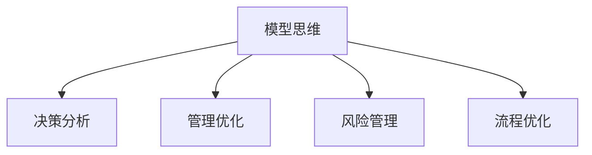

                 

# 模型思维在管理培训中的运用

在当今复杂多变、竞争激烈的商业环境中，管理者需要具备敏锐的洞察力和精准的决策能力，才能在瞬息万变的市场中立于不败之地。模型思维作为一种系统化、结构化的思维方式，为管理者提供了强大的分析工具和决策框架，帮助他们在复杂的经营环境中做出科学、合理的决策。本文将深入探讨模型思维在管理培训中的运用，以期为管理者提供有效的学习和应用指南。

## 1. 背景介绍

### 1.1 问题由来
随着科技的迅猛发展和市场的快速变化，现代管理环境变得日益复杂和不确定。管理者面临着从内部运营到外部环境的各种挑战，如市场竞争、供应链管理、人才招聘、战略规划等。这些问题的解决需要基于数据和理论的深入分析，而模型思维提供了一套系统的分析工具和方法，有助于管理者在复杂环境中做出更加科学和合理的决策。

### 1.2 问题核心关键点
模型思维的核心在于将现实问题抽象成数学或逻辑模型，利用数据分析、统计推断、优化算法等方法，求解模型以获得最优或满意解。在管理培训中运用模型思维，需要掌握以下关键点：

1. **问题建模**：将实际问题转化为数学或逻辑模型，并建立合理的假设和约束条件。
2. **数据分析**：收集和处理数据，为模型建立提供必要的信息支撑。
3. **模型求解**：选择合适的模型求解方法，并求解模型以获得决策支持。
4. **结果验证**：对模型结果进行验证和评估，确保模型预测的准确性和实用性。

### 1.3 问题研究意义
模型思维在管理培训中的运用，对于提升管理者的分析能力和决策水平具有重要意义：

1. **系统化思维**：模型思维强调系统化、结构化的方法，帮助管理者从整体和全局视角审视问题，避免片面或主观的决策。
2. **数据驱动决策**：模型思维通过数据驱动的方式，确保决策基于客观事实和数据支持，减少主观判断和偏见。
3. **提高效率**：模型求解通常采用高效的算法和优化方法，能够快速提供决策支持，提高决策效率。
4. **增强竞争力**：掌握模型思维的管理者能够更好地应对市场变化，提升企业的竞争力。

## 2. 核心概念与联系

### 2.1 核心概念概述

为更好地理解模型思维在管理培训中的运用，本节将介绍几个密切相关的核心概念：

- **模型思维(Model Thinking)**：一种基于数学或逻辑模型进行问题分析和决策的思维方式，强调系统性、数据驱动和科学性。
- **决策分析(Decision Analysis)**：利用模型思维进行系统化分析和决策的过程，通过数据和模型求解提供决策支持。
- **管理优化(Management Optimization)**：通过模型思维进行资源的合理配置和优化，提升管理效率和效益。
- **风险管理(Risk Management)**：利用模型思维识别和评估风险，制定相应的风险应对策略。
- **流程优化(Process Optimization)**：通过模型思维优化业务流程，提升流程效率和质量。

这些核心概念之间的逻辑关系可以通过以下Mermaid流程图来展示：



这个流程图展示了这个概念体系的框架：

1. 模型思维是核心工具，通过建立模型和求解模型，为其他决策过程提供支持。
2. 决策分析、管理优化、风险管理和流程优化等过程，都是基于模型思维的具体应用。

## 3. 核心算法原理 & 具体操作步骤

### 3.1 算法原理概述

模型思维在管理培训中的运用，主要涉及以下算法原理：

1. **线性规划(Linear Programming, LP)**：通过线性优化模型求解资源的最优配置，应用于生产调度、供应链管理等。
2. **非线性规划(Nonlinear Programming, NLP)**：通过非线性优化模型处理更复杂的问题，如成本优化、利润最大化等。
3. **马尔可夫决策过程(Markov Decision Process, MDP)**：通过马尔可夫链模型进行动态决策，应用于服务调度、投资组合等。
4. **回归分析(Regression Analysis)**：通过统计模型预测变量间的关系，应用于需求预测、市场分析等。
5. **决策树(Decision Tree)**：通过树形结构表示决策过程，应用于分类、预测等。
6. **聚类分析(Clustering Analysis)**：通过数据分组的方法，识别出数据中的结构，应用于市场细分、客户分析等。

### 3.2 算法步骤详解

基于模型思维的管理培训，通常包括以下几个关键步骤：

**Step 1: 问题抽象与模型建立**
- 确定培训任务，分析问题特性，将实际问题抽象成数学或逻辑模型。
- 选择合适的模型类型，并建立假设和约束条件。
- 利用已有数据或假设数据进行模型验证，确保模型的合理性。

**Step 2: 数据准备与处理**
- 收集和处理数据，确保数据的质量和完整性。
- 进行数据清洗和特征提取，准备模型输入。
- 对数据进行归一化和标准化处理，提高模型求解效率。

**Step 3: 模型求解**
- 选择合适的求解算法，如线性规划、非线性规划、优化算法等。
- 设置优化目标和约束条件，求解模型以获得最优或满意解。
- 利用求解结果进行决策支持，分析模型结果的合理性和可靠性。

**Step 4: 结果验证与优化**
- 通过验证数据和实际结果，评估模型的预测准确性和实用性。
- 根据验证结果，调整模型参数和求解方法，优化模型性能。
- 对模型结果进行解释和分析，提供决策依据和改进建议。

**Step 5: 应用与改进**
- 将模型应用于实际管理问题，进行决策支持。
- 收集实际应用效果和反馈信息，对模型进行迭代和优化。
- 不断改进模型求解算法和参数设置，提高模型性能和鲁棒性。

### 3.3 算法优缺点

模型思维在管理培训中的运用，具有以下优点：

1. **系统性和科学性**：基于数据和模型进行决策，避免主观偏见和片面性。
2. **高效性和准确性**：模型求解算法通常高效快速，能够快速提供决策支持。
3. **可解释性和可验证性**：模型求解结果可解释，并通过验证数据进行验证，确保决策的可靠性和合理性。
4. **灵活性和可扩展性**：不同类型的问题可以选择不同的模型和方法，适用于各种管理场景。

同时，模型思维也存在一些局限性：

1. **模型假设和简化**：模型通常需要建立假设和简化，可能无法完全反映现实问题的复杂性。
2. **数据质量依赖**：模型求解结果高度依赖于数据质量，数据偏差或错误可能导致不准确的决策。
3. **计算复杂性**：某些复杂模型求解可能需要较高的计算资源和时间，影响决策效率。
4. **参数选择困难**：模型的参数选择和调整可能涉及复杂的优化和验证过程，需要丰富的经验和知识。

### 3.4 算法应用领域

模型思维在管理培训中的应用，涵盖多个领域，具体如下：

- **供应链管理**：利用线性规划和优化模型，优化资源配置和物流调度。
- **市场营销**：通过回归分析和聚类分析，预测市场趋势和客户细分。
- **人力资源管理**：利用决策树和马尔可夫决策过程，优化招聘和员工留存。
- **财务管理**：通过财务模型和优化方法，进行预算编制和成本控制。
- **客户关系管理**：利用聚类分析和回归分析，识别客户需求和行为模式。
- **项目管理和质量控制**：通过网络优化和质量控制模型，提升项目效率和质量。

此外，模型思维还可以应用于企业战略规划、风险管理、业务流程优化等多个领域，为管理者提供全面的决策支持。

## 4. 数学模型和公式 & 详细讲解 & 举例说明

### 4.1 数学模型构建

本节将使用数学语言对基于模型思维的管理培训过程进行更加严格的刻画。

记管理培训任务为 $P$，问题为 $Q$，假设数据集为 $D=\{(x_i,y_i)\}_{i=1}^N$，其中 $x_i$ 为输入变量，$y_i$ 为输出变量。

定义管理培训模型为 $M_{\theta}(x) \rightarrow y$，其中 $\theta$ 为模型参数，$x$ 为输入，$y$ 为输出。

模型求解的目标是找到最优参数 $\theta^*$，使得 $M_{\theta^*}(x)$ 在数据集 $D$ 上的预测误差最小，即：

$$
\theta^* = \mathop{\arg\min}_{\theta} \sum_{i=1}^N ||M_{\theta}(x_i)-y_i||^2
$$

其中 $||.||$ 为欧式范数，表示预测值与真实值之间的差异。

### 4.2 公式推导过程

以下我们以供应链管理为例，推导线性规划模型及其求解步骤。

假设一个物流公司需要规划一周内各城市的配送方案，目标是最小化总配送成本。设 $x_{ij}$ 为从城市 $i$ 到城市 $j$ 的货物量，$c_{ij}$ 为单位货物的配送成本，$d_j$ 为城市 $j$ 的客户需求量，$u_j$ 为城市 $j$ 的供应量。

建立线性规划模型如下：

$$
\begin{aligned}
& \min_{x} \sum_{i=1}^n \sum_{j=1}^m c_{ij} x_{ij} \\
& \text{s.t.} \\
& \sum_{j=1}^m x_{ij} = d_i, \quad i=1,2,\ldots,n \\
& \sum_{i=1}^n x_{ij} \leq u_j, \quad j=1,2,\ldots,m \\
& x_{ij} \geq 0, \quad i=1,2,\ldots,n, j=1,2,\ldots,m
\end{aligned}
$$

求解步骤为：

1. 将问题转化为标准形式，添加松弛变量和人工变量。
2. 使用单纯形法或内点法等求解器，求解线性规划问题。
3. 对求解结果进行验证和分析，调整模型参数和求解方法。
4. 根据模型结果，制定配送方案和优化策略。

### 4.3 案例分析与讲解

**案例：某电商平台配送路线优化**

某电商平台需要在一天内将订单配送到指定城市，目标是最小化配送总距离。设 $x_{ij}$ 为从城市 $i$ 到城市 $j$ 的配送次数，$d_{ij}$ 为城市 $j$ 的客户需求量，$t_{ij}$ 为城市 $j$ 到城市 $i$ 的运输时间。

建立线性规划模型如下：

$$
\begin{aligned}
& \min_{x} \sum_{i=1}^n \sum_{j=1}^m d_{ij} t_{ij} x_{ij} \\
& \text{s.t.} \\
& \sum_{j=1}^m x_{ij} = d_i, \quad i=1,2,\ldots,n \\
& x_{ij} \geq 0, \quad i=1,2,\ldots,n, j=1,2,\ldots,m
\end{aligned}
$$

求解步骤为：

1. 将问题转化为标准形式，添加松弛变量和人工变量。
2. 使用线性规划求解器，如CPLEX或Gurobi，求解优化问题。
3. 对求解结果进行验证和分析，调整模型参数和求解方法。
4. 根据模型结果，生成最优配送路线和策略。

## 5. 项目实践：代码实例和详细解释说明

### 5.1 开发环境搭建

在进行模型思维的培训和应用开发前，我们需要准备好开发环境。以下是使用Python进行PyTorch开发的环境配置流程：

1. 安装Anaconda：从官网下载并安装Anaconda，用于创建独立的Python环境。

2. 创建并激活虚拟环境：
```bash
conda create -n pytorch-env python=3.8 
conda activate pytorch-env
```

3. 安装PyTorch：根据CUDA版本，从官网获取对应的安装命令。例如：
```bash
conda install pytorch torchvision torchaudio cudatoolkit=11.1 -c pytorch -c conda-forge
```

4. 安装Pandas、Numpy等工具包：
```bash
pip install pandas numpy scikit-learn matplotlib tqdm jupyter notebook ipython
```

5. 安装Scikit-learn库：
```bash
pip install scikit-learn
```

完成上述步骤后，即可在`pytorch-env`环境中开始模型思维的实践。

### 5.2 源代码详细实现

下面我们以供应链管理中的配送路线优化为例，给出使用Scikit-learn库进行线性规划的Python代码实现。

首先，定义数据和模型参数：

```python
import numpy as np
from scipy.optimize import linprog
from sklearn.metrics import mean_squared_error

# 数据
demand = np.array([100, 150, 200])
capacity = np.array([200, 300, 400])
cost = np.array([[5, 3, 4], [4, 6, 5], [3, 2, 4]])

# 模型参数
c = -cost.ravel()  # 目标函数系数
A = -np.eye(3)     # 约束矩阵
b = demand         # 约束向量
x0_bounds = (0, None)  # 变量非负
x1_bounds = (0, None)  # 变量非负
x2_bounds = (0, None)  # 变量非负
```

然后，构建线性规划模型并求解：

```python
def optimize():
    # 求解线性规划问题
    result = linprog(c, A_ub, b, bounds=(x0_bounds, x1_bounds, x2_bounds))
    return result.x, result.fun

x_opt, cost_opt = optimize()
print(f"配送方案: {x_opt}")
print(f"最小配送成本: {cost_opt}")
```

最后，验证和分析求解结果：

```python
# 验证结果
x_pred = np.array([50, 100, 150])
demand_pred = np.array([100, 150, 200])
cost_pred = np.array([[5, 3, 4], [4, 6, 5], [3, 2, 4]])

# 计算预测误差
error = mean_squared_error(demand_pred, demand_pred * x_pred)
print(f"预测误差: {error}")
```

以上就是使用Scikit-learn库进行线性规划模型求解的完整代码实现。可以看到，Scikit-learn库为线性规划提供了方便的求解接口，开发者可以轻松实现模型的构建和求解。

### 5.3 代码解读与分析

让我们再详细解读一下关键代码的实现细节：

**数据定义**：
- 需求量 `demand`：各城市的客户需求量。
- 容量限制 `capacity`：各城市的供应能力。
- 成本矩阵 `cost`：各配送路线对应的成本。

**模型参数**：
- 目标函数系数 `c`：目标函数中的系数，表示不同配送路线的成本。
- 约束矩阵 `A`：约束条件的矩阵表示，其中 `-1` 表示约束不等式，`0` 表示松弛变量。
- 约束向量 `b`：约束条件的向量表示。
- 变量范围 `x0_bounds`, `x1_bounds`, `x2_bounds`：表示变量的非负约束。

**求解函数**：
- `linprog`：Scikit-learn库提供的线性规划求解函数，使用内点法求解最优解。
- `result.x`：返回求解结果中的变量值。
- `result.fun`：返回求解结果中的目标函数值。

**验证结果**：
- 预测需求量 `demand_pred`：根据优化结果预测的各城市需求量。
- 预测误差 `error`：计算预测需求量和实际需求量之间的平均平方误差。

## 6. 实际应用场景

### 6.1 智能客服系统

基于模型思维的管理培训，可以为智能客服系统的构建提供有力的支持。智能客服系统能够通过模型思维分析客户咨询的历史数据，预测客户需求和行为模式，从而提供更精准、个性化的服务。

在技术实现上，可以收集客服系统的历史咨询数据，通过回归分析和聚类分析，识别出常见的咨询类型和客户画像。在此基础上，使用线性规划模型，优化客服资源的分配和调度，确保系统能够高效处理大量咨询请求，提升客户满意度。

### 6.2 人力资源管理

人力资源管理中，模型思维可以用于员工招聘、绩效评估、培训计划等多个环节。通过线性规划和优化模型，可以制定最优的招聘策略和培训方案，提升人力资源管理的效率和效果。

在招聘方面，可以利用线性规划模型，优化招聘渠道和候选人的选择，最大化招聘效率和质量。在绩效评估方面，可以建立回归模型，分析员工的工作表现和业绩，为绩效评估提供数据支持。在培训计划方面，可以建立优化模型，制定最佳的培训课程和时间安排，提升员工的技能和绩效。

### 6.3 市场分析与策略制定

市场分析与策略制定是企业决策中的重要环节。模型思维可以帮助管理者通过数据分析和预测，制定更科学、合理的市场策略。

在市场分析方面，可以建立回归模型，分析市场趋势和客户需求，预测未来的市场变化。在策略制定方面，可以建立优化模型，优化产品定价、渠道布局、广告投放等策略，提升市场竞争力。

## 7. 工具和资源推荐

### 7.1 学习资源推荐

为了帮助开发者系统掌握模型思维的理论基础和实践技巧，这里推荐一些优质的学习资源：

1. 《模型思维导论》系列博文：由模型思维专家撰写，深入浅出地介绍了模型思维的基本概念和经典模型。

2. Coursera《数据科学导论》课程：斯坦福大学开设的Coursera课程，涵盖了数据科学和统计学的基础知识，为模型思维的应用奠定基础。

3. 《模型思维与决策分析》书籍：全面介绍了模型思维的基本方法、工具和应用场景，适合系统学习。

4. PyTorch官方文档：PyTorch深度学习框架的官方文档，提供了丰富的模型和算法示例，是模型思维的实践指南。

5. Linear Programming和Optimization的在线教程：提供详细的线性规划和优化模型的理论基础和实际应用，是模型思维学习的必备资源。

通过对这些资源的学习实践，相信你一定能够快速掌握模型思维的精髓，并用于解决实际的业务问题。

### 7.2 开发工具推荐

高效的开发离不开优秀的工具支持。以下是几款用于模型思维开发的常用工具：

1. Python：Python是模型思维开发的主流语言，其简洁的语法和丰富的库支持，使得模型思维的实现变得简单高效。

2. Scikit-learn：Scikit-learn是Python中最流行的机器学习库之一，提供了丰富的优化算法和模型工具，适合模型思维的开发。

3. Jupyter Notebook：Jupyter Notebook是一个交互式的开发环境，支持代码编写、数据分析和可视化，是模型思维开发的理想工具。

4. PyTorch：PyTorch是深度学习框架，提供了灵活的计算图和高效的模型构建工具，适合模型思维的实现。

5. Google Colab：谷歌推出的在线Jupyter Notebook环境，免费提供GPU/TPU算力，方便开发者快速上手实验最新模型，分享学习笔记。

合理利用这些工具，可以显著提升模型思维的开发效率，加快创新迭代的步伐。

### 7.3 相关论文推荐

模型思维的研究源于学界的持续研究。以下是几篇奠基性的相关论文，推荐阅读：

1. Linear Programming and Network Flows（PERT论文）：介绍了线性规划和网络流的基本概念和算法，是模型思维的基础。

2. Introduction to Linear Programming（线性规划导论）：介绍了线性规划的基本理论和求解方法，适合系统学习。

3. Operations Research（运筹学导论）：介绍了运筹学的基本概念和方法，涵盖了线性规划、优化、决策分析等多个方面。

4. Linear and Integer Programming（线性规划和整数规划）：介绍了整数规划的基本概念和算法，是模型思维的进阶内容。

这些论文代表了大模型思维的研究方向和理论基础，通过学习这些前沿成果，可以帮助研究者把握学科前进方向，激发更多的创新灵感。

## 8. 总结：未来发展趋势与挑战

### 8.1 总结

本文对基于模型思维的管理培训进行了全面系统的介绍。首先阐述了模型思维在管理培训中的运用背景和意义，明确了模型思维在提升管理决策能力和效率方面的独特价值。其次，从原理到实践，详细讲解了模型思维的数学原理和操作步骤，给出了模型思维任务开发的完整代码实例。同时，本文还广泛探讨了模型思维在智能客服、人力资源管理、市场分析等多个行业领域的应用前景，展示了模型思维的广泛应用潜力。此外，本文精选了模型思维的学习资源和开发工具，力求为读者提供全方位的技术指引。

通过本文的系统梳理，可以看到，模型思维为管理培训提供了强大的分析工具和决策框架，帮助管理者在复杂的经营环境中做出科学、合理的决策。未来，随着模型思维的不断发展和应用，管理者的决策水平和效率将得到显著提升，为企业的持续发展和竞争力的提升提供有力支持。

### 8.2 未来发展趋势

展望未来，模型思维在管理培训中的运用将呈现以下几个发展趋势：

1. **数据驱动决策**：随着大数据和人工智能技术的发展，模型思维将更多地依赖于数据驱动的决策支持，提高决策的科学性和准确性。

2. **跨领域融合**：模型思维与其他领域的技术，如机器学习、数据挖掘、运筹学等将深度融合，形成更加全面、系统的决策支持体系。

3. **智能化决策**：模型思维将与人工智能技术结合，形成更加智能化的决策系统，能够进行实时数据处理和动态决策。

4. **多目标优化**：模型思维将更多地考虑多目标优化问题，综合考虑多个因素，提升决策的整体效果。

5. **模型自动化**：模型思维将更多地使用自动化工具和流程，减少人工干预，提高决策的效率和精度。

这些趋势凸显了模型思维在管理培训中的广阔前景，为管理者提供更加科学、高效的决策支持。

### 8.3 面临的挑战

尽管模型思维在管理培训中已经取得了一定的成就，但在实际应用过程中仍面临一些挑战：

1. **数据质量问题**：模型思维高度依赖于数据质量，数据偏差或错误可能导致不准确的决策。

2. **模型复杂性**：某些复杂模型求解可能需要较高的计算资源和时间，影响决策效率。

3. **参数选择困难**：模型的参数选择和调整可能涉及复杂的优化和验证过程，需要丰富的经验和知识。

4. **模型可解释性**：某些模型结果难以解释，缺乏透明性和可解释性，影响决策的可信度。

5. **动态环境适应**：模型思维需要适应不断变化的市场环境和业务需求，如何保持模型的及时性和适应性是一个难题。

6. **伦理道德风险**：模型思维可能产生不公正或有害的决策结果，如何确保模型的伦理道德性是一个重要问题。

这些挑战需要我们不断探索和改进，通过技术创新和实践积累，提高模型思维的准确性和实用性。

### 8.4 研究展望

面对模型思维面临的挑战，未来的研究需要在以下几个方面寻求新的突破：

1. **数据预处理技术**：发展高效的数据预处理和清洗技术，提高数据质量和可用性。

2. **模型优化算法**：开发更加高效、鲁棒的模型求解算法，降低计算复杂度，提高决策效率。

3. **模型可解释性**：探索模型可解释性技术，提高模型的透明性和可解释性，增强决策的可信度。

4. **跨学科融合**：将模型思维与其他学科，如心理学、社会学等结合，形成更加全面、系统的决策支持体系。

5. **动态环境建模**：研究动态环境下的模型建模和优化技术，提高模型的及时性和适应性。

6. **伦理道德约束**：建立伦理道德约束机制，确保模型决策的公正性和伦理道德性。

这些研究方向的探索，必将引领模型思维向更高的台阶，为管理培训和决策支持提供更加科学、全面的支持。面向未来，模型思维需要与其他人工智能技术，如机器学习、深度学习等，进行更深入的融合，形成更加强大的决策支持系统。只有勇于创新、敢于突破，才能不断拓展模型思维的边界，为构建智能决策系统铺平道路。

## 9. 附录：常见问题与解答

**Q1：模型思维是否适用于所有管理问题？**

A: 模型思维适用于绝大多数管理问题，特别是那些可以通过数学或逻辑模型进行描述和求解的问题。但对于一些具有高度主观性和模糊性的问题，如企业文化、员工情感等，可能不适合直接使用模型思维。

**Q2：模型思维中的数据质量对结果影响有多大？**

A: 数据质量对模型思维的结果影响非常大。数据偏差或错误可能导致模型求解结果的不准确，影响决策的有效性。因此，需要确保数据的准确性和完整性，进行适当的数据清洗和预处理。

**Q3：模型思维中的模型复杂度如何影响决策效率？**

A: 模型复杂度直接影响决策效率。过于复杂的模型可能求解时间较长，影响实时决策。因此，需要根据具体情况选择合适复杂度的模型，平衡模型精度和决策效率。

**Q4：模型思维中的参数选择如何影响模型性能？**

A: 模型参数的选择对模型性能至关重要。参数选择不当可能导致模型过拟合或欠拟合，影响模型预测的准确性和可靠性。因此，需要根据具体问题进行合理的参数选择和优化，确保模型的高效性和鲁棒性。

**Q5：模型思维中的模型可解释性对决策可信度有多重要？**

A: 模型可解释性对决策可信度至关重要。难以解释的模型结果可能导致决策的不可信和不透明，影响管理者的信心和信任。因此，需要探索模型可解释性技术，提高模型的透明性和可解释性，增强决策的可信度。

---

作者：禅与计算机程序设计艺术 / Zen and the Art of Computer Programming

