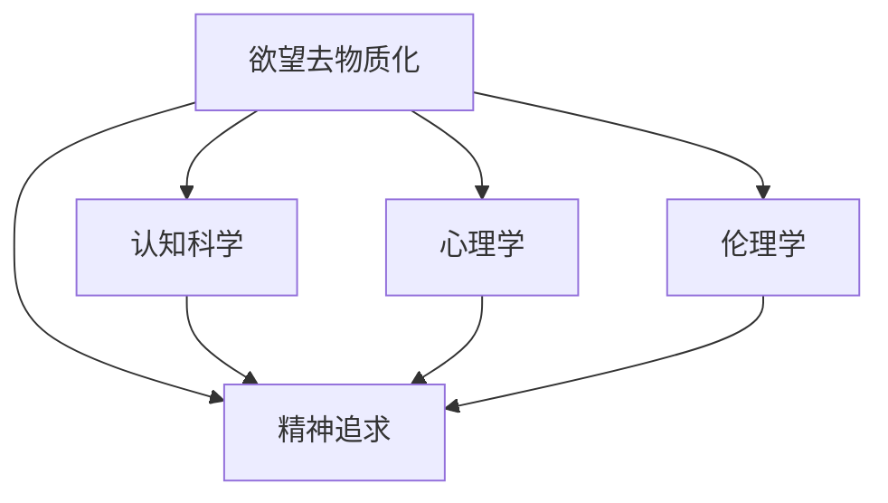

                 

# 欲望去物质化引擎工程师：AI时代的精神追求催化剂设计师

## 1. 背景介绍

### 1.1 问题由来

在快速发展的AI时代，人类对于技术的依赖性日益加深。技术的进步虽然在很大程度上改善了人类的生活质量，但也带来了新的问题和挑战。如何在科技发展的同时，保持人类精神生活的丰富性和深度，成为一个亟待解决的问题。

当前，AI技术在各个领域的应用，如自动驾驶、智能推荐、自然语言处理等，虽然带来了便利，但也在一定程度上使得人们过度依赖技术，忽视了内心的精神需求。如何通过技术手段，促进人类精神追求的实现，成为AI研究者的重要课题。

### 1.2 问题核心关键点

本文聚焦于“欲望去物质化引擎”的构建，即通过AI技术，帮助人类识别和消除对物质欲望的过度依赖，恢复内心的精神追求和满足感。这涉及到AI在心理学、认知科学、伦理学等多个领域的交叉应用，具有重要的理论和实践意义。

## 2. 核心概念与联系

### 2.1 核心概念概述

为更好地理解“欲望去物质化引擎”的构建过程，本节将介绍几个关键概念：

- 欲望去物质化(Desire De-materialization)：通过AI技术，帮助人类识别和消除对物质欲望的过度依赖，恢复内心的精神追求和满足感。
- 精神追求(Spiritual Pursuit)：追求内在的幸福、智慧、觉悟等精神层面的满足，超越物质追求，提升整体幸福感。
- 认知科学(Cognitive Science)：研究人类认知过程的科学，涵盖语言、感知、记忆、决策等多个方面。
- 心理学(Psychology)：研究人类心理和行为的科学，关注欲望、情绪、人格等内在因素。
- 伦理学(Ethics)：探讨道德价值和行为规范的学科，指导技术应用中的伦理考量。

这些核心概念之间的逻辑关系可以通过以下Mermaid流程图来展示：



这个流程图展示了几大核心概念之间的联系：

1. 欲望去物质化是精神追求的实现手段。
2. 认知科学、心理学和伦理学提供了理解和实现欲望去物质化的理论基础和伦理考量。

## 3. 核心算法原理 & 具体操作步骤

### 3.1 算法原理概述

“欲望去物质化引擎”通过认知科学、心理学和伦理学理论，结合AI技术，帮助用户识别和消除对物质欲望的过度依赖，提升精神追求的满足感。该过程可以分为以下几个关键步骤：

1. **数据采集**：通过AI技术收集用户的日常行为数据，如消费习惯、社交媒体使用情况等。
2. **情感分析**：对采集到的数据进行情感分析，识别用户的情绪状态和精神需求。
3. **欲望识别**：通过认知科学和心理学模型，识别用户对物质的过度依赖和欲望。
4. **精神需求推荐**：结合伦理学准则，推荐符合用户精神追求的活动和资源。
5. **行为干预**：通过AI技术引导用户逐步减少物质追求，增加精神追求的行为。

### 3.2 算法步骤详解

**Step 1: 数据采集**

采集用户的日常行为数据，主要包括以下几个方面：

- 消费记录：包括购买记录、支付记录等。
- 社交媒体使用情况：如使用时长、互动频率等。
- 健康数据：如运动记录、睡眠质量等。
- 心理测试：通过问卷、访谈等方式，收集用户的心理和情绪状态。

**Step 2: 情感分析**

情感分析是识别用户情绪状态和精神需求的关键步骤。主要包括以下几个子步骤：

- 数据预处理：对采集到的数据进行清洗、归一化等预处理操作。
- 特征提取：使用自然语言处理(NLP)技术，从文本数据中提取情感特征。
- 情感分类：通过机器学习模型，将情感特征分类为正面、中性、负面等情绪类别。
- 情绪强度评估：评估情感的强度，如愤怒、焦虑、快乐等。

**Step 3: 欲望识别**

欲望识别是通过认知科学和心理学模型，识别用户对物质的过度依赖和欲望。主要包括以下几个子步骤：

- 构建认知模型：使用认知科学理论，构建描述用户认知过程的模型。
- 欲望评估：通过心理学模型，评估用户对物质的依赖程度。
- 欲望类型识别：识别用户的物质欲望类型，如物质享乐、占有欲、虚荣心等。

**Step 4: 精神需求推荐**

精神需求推荐是根据用户的情感状态和欲望类型，推荐符合用户精神追求的活动和资源。主要包括以下几个子步骤：

- 精神需求分类：将用户需求分为物质、情感、社会、智慧等类别。
- 活动推荐：根据用户需求和心理状态，推荐相应的活动，如冥想、阅读、社交等。
- 资源推荐：推荐相应的资源，如书籍、音乐、视频等。

**Step 5: 行为干预**

行为干预是通过AI技术引导用户逐步减少物质追求，增加精神追求的行为。主要包括以下几个子步骤：

- 行为设计：设计符合用户精神追求的行为方案。
- 行为激励：使用游戏化技术，激励用户完成行为方案。
- 行为监控：监控用户的行为执行情况，及时调整方案。

### 3.3 算法优缺点

“欲望去物质化引擎”具有以下优点：

1. **全面性**：结合认知科学、心理学和伦理学理论，能够全面识别用户的欲望和需求，提供多维度的解决方案。
2. **个性化**：通过数据分析和个性化推荐，提供符合用户需求的活动和资源，提高用户的参与度和满意度。
3. **持续性**：通过行为干预和动态调整，帮助用户逐步减少物质追求，增加精神追求，提升整体幸福感。

同时，该算法也存在一些局限性：

1. **数据隐私**：用户行为数据的采集和处理需要考虑隐私保护，防止数据泄露和滥用。
2. **伦理考量**：在精神需求推荐和行为干预过程中，需要充分考虑伦理问题，确保推荐的合理性和用户的自主权。
3. **复杂性**：该算法的实现涉及多个学科的交叉应用，算法设计复杂，需要综合考虑多方面因素。

尽管存在这些局限性，但“欲望去物质化引擎”仍具有巨大的潜力，有望在精神追求的实现中发挥重要作用。

### 3.4 算法应用领域

“欲望去物质化引擎”主要应用于以下几个领域：

1. **心理健康**：帮助用户识别和缓解焦虑、抑郁等心理健康问题，促进精神健康。
2. **家庭教育**：通过推荐适合孩子的精神活动和资源，促进其全面发展和幸福感的提升。
3. **企业文化**：通过优化员工的物质和精神追求，提升企业文化的包容性和员工的幸福感。
4. **社会治理**：通过减少物质追求，增加社会精神追求，促进社会和谐和可持续发展。

## 4. 数学模型和公式 & 详细讲解  
### 4.1 数学模型构建

“欲望去物质化引擎”的数学模型主要包括以下几个组成部分：

- **用户行为数据采集模型**：描述如何从多个数据源采集用户行为数据。
- **情感分析模型**：描述情感分类的数学模型和算法。
- **欲望识别模型**：描述欲望评估和识别的数学模型和算法。
- **精神需求推荐模型**：描述如何根据用户需求和情绪状态，推荐活动和资源的模型。
- **行为干预模型**：描述如何设计行为方案和激励用户的数学模型和算法。

### 4.2 公式推导过程

以情感分析模型为例，推导情感分类的数学模型。

假设用户的行为数据为 $X$，情感特征向量为 $F$，情感类别为 $C$。情感分类模型可以表示为：

$$
P(C|X) = \frac{P(C)P(F|C)P(X|F)}{P(X)}
$$

其中 $P(C)$ 为情感类别的先验概率，$P(F|C)$ 为在情感类别 $C$ 下情感特征 $F$ 的条件概率，$P(X|F)$ 为在情感特征 $F$ 下行为数据 $X$ 的条件概率，$P(X)$ 为行为数据 $X$ 的先验概率。

在实际应用中，通常使用深度学习模型，如卷积神经网络(CNN)、循环神经网络(RNN)等，来训练情感分类模型。以CNN模型为例，其情感分类过程可以表示为：

$$
P(C|X) = \text{softmax}(\sum_{i=1}^{n}w_i\cdot \sigma(a_i\cdot X_i+b_i))
$$

其中 $w_i$ 和 $a_i$ 为模型的权重和激活函数参数，$b_i$ 为偏置项，$\sigma$ 为激活函数。

### 4.3 案例分析与讲解

以用户对物质享乐的过度依赖为例，分析“欲望去物质化引擎”的实际应用。

假设某用户每年花费大量资金购买奢侈品，情感分析发现其情绪状态以焦虑、不满为主。欲望识别模型评估其对物质享乐的过度依赖程度高，精神需求推荐模型建议其尝试冥想、阅读等精神活动，并推荐相关的书籍、视频资源。行为干预模型设计了一个逐步减少奢侈品购买的计划，并使用游戏化技术激励其完成计划。经过一段时间的干预，用户逐渐减少了对物质的追求，情绪状态改善，幸福感提升。

## 5. 项目实践：代码实例和详细解释说明
### 5.1 开发环境搭建

在进行“欲望去物质化引擎”的开发前，需要准备好开发环境。以下是使用Python进行PyTorch开发的环境配置流程：

1. 安装Anaconda：从官网下载并安装Anaconda，用于创建独立的Python环境。

2. 创建并激活虚拟环境：
```bash
conda create -n pytorch-env python=3.8 
conda activate pytorch-env
```

3. 安装PyTorch：根据CUDA版本，从官网获取对应的安装命令。例如：
```bash
conda install pytorch torchvision torchaudio cudatoolkit=11.1 -c pytorch -c conda-forge
```

4. 安装Transformers库：
```bash
pip install transformers
```

5. 安装各类工具包：
```bash
pip install numpy pandas scikit-learn matplotlib tqdm jupyter notebook ipython
```

完成上述步骤后，即可在`pytorch-env`环境中开始项目实践。

### 5.2 源代码详细实现

下面我们以用户情感分析模型为例，给出使用Transformers库对BERT模型进行情感分析的PyTorch代码实现。

首先，定义情感分析任务的数据处理函数：

```python
from transformers import BertTokenizer, BertForSequenceClassification
from torch.utils.data import Dataset
import torch

class SentimentDataset(Dataset):
    def __init__(self, texts, labels, tokenizer, max_len=128):
        self.texts = texts
        self.labels = labels
        self.tokenizer = tokenizer
        self.max_len = max_len
        
    def __len__(self):
        return len(self.texts)
    
    def __getitem__(self, item):
        text = self.texts[item]
        label = self.labels[item]
        
        encoding = self.tokenizer(text, return_tensors='pt', max_length=self.max_len, padding='max_length', truncation=True)
        input_ids = encoding['input_ids'][0]
        attention_mask = encoding['attention_mask'][0]
        
        # 对标签进行独热编码
        encoded_labels = torch.tensor([0, 1] if label == 'positive' else [1, 0], dtype=torch.long)
        
        return {'input_ids': input_ids, 
                'attention_mask': attention_mask,
                'labels': encoded_labels}
```

然后，定义模型和优化器：

```python
from transformers import AdamW

model = BertForSequenceClassification.from_pretrained('bert-base-cased', num_labels=2)

optimizer = AdamW(model.parameters(), lr=2e-5)
```

接着，定义训练和评估函数：

```python
from torch.utils.data import DataLoader
from tqdm import tqdm
from sklearn.metrics import accuracy_score

device = torch.device('cuda') if torch.cuda.is_available() else torch.device('cpu')
model.to(device)

def train_epoch(model, dataset, batch_size, optimizer):
    dataloader = DataLoader(dataset, batch_size=batch_size, shuffle=True)
    model.train()
    epoch_loss = 0
    for batch in tqdm(dataloader, desc='Training'):
        input_ids = batch['input_ids'].to(device)
        attention_mask = batch['attention_mask'].to(device)
        labels = batch['labels'].to(device)
        model.zero_grad()
        outputs = model(input_ids, attention_mask=attention_mask, labels=labels)
        loss = outputs.loss
        epoch_loss += loss.item()
        loss.backward()
        optimizer.step()
    return epoch_loss / len(dataloader)

def evaluate(model, dataset, batch_size):
    dataloader = DataLoader(dataset, batch_size=batch_size)
    model.eval()
    preds, labels = [], []
    with torch.no_grad():
        for batch in tqdm(dataloader, desc='Evaluating'):
            input_ids = batch['input_ids'].to(device)
            attention_mask = batch['attention_mask'].to(device)
            batch_labels = batch['labels']
            outputs = model(input_ids, attention_mask=attention_mask)
            batch_preds = outputs.logits.argmax(dim=1).to('cpu').tolist()
            batch_labels = batch_labels.to('cpu').tolist()
            for pred, label in zip(batch_preds, batch_labels):
                preds.append(pred.item())
                labels.append(label.item())
                
    print('Accuracy:', accuracy_score(labels, preds))
```

最后，启动训练流程并在测试集上评估：

```python
epochs = 5
batch_size = 16

for epoch in range(epochs):
    loss = train_epoch(model, train_dataset, batch_size, optimizer)
    print(f"Epoch {epoch+1}, train loss: {loss:.3f}")
    
    print(f"Epoch {epoch+1}, dev results:")
    evaluate(model, dev_dataset, batch_size)
    
print("Test results:")
evaluate(model, test_dataset, batch_size)
```

以上就是使用PyTorch对BERT进行情感分析任务开发的完整代码实现。可以看到，得益于Transformers库的强大封装，我们可以用相对简洁的代码完成BERT模型的加载和情感分析任务。

### 5.3 代码解读与分析

让我们再详细解读一下关键代码的实现细节：

**SentimentDataset类**：
- `__init__`方法：初始化文本、标签、分词器等关键组件。
- `__len__`方法：返回数据集的样本数量。
- `__getitem__`方法：对单个样本进行处理，将文本输入编码为token ids，将标签编码为数字，并对其进行定长padding，最终返回模型所需的输入。

**model, optimizer**定义：
- 选择合适的预训练语言模型 $M_{\theta}$ 作为初始化参数，如 BERT、GPT等。
- 设置优化算法及其参数，如 AdamW、SGD 等，设置学习率、批大小、迭代轮数等。

**训练和评估函数**：
- 使用PyTorch的DataLoader对数据集进行批次化加载，供模型训练和推理使用。
- 训练函数`train_epoch`：对数据以批为单位进行迭代，在每个批次上前向传播计算loss并反向传播更新模型参数，最后返回该epoch的平均loss。
- 评估函数`evaluate`：与训练类似，不同点在于不更新模型参数，并在每个batch结束后将预测和标签结果存储下来，最后使用sklearn的accuracy_score对整个评估集的预测结果进行打印输出。

**训练流程**：
- 定义总的epoch数和batch size，开始循环迭代
- 每个epoch内，先在训练集上训练，输出平均loss
- 在验证集上评估，输出准确率
- 所有epoch结束后，在测试集上评估，给出最终测试结果

可以看到，PyTorch配合Transformers库使得BERT情感分析任务的代码实现变得简洁高效。开发者可以将更多精力放在数据处理、模型改进等高层逻辑上，而不必过多关注底层的实现细节。

当然，工业级的系统实现还需考虑更多因素，如模型的保存和部署、超参数的自动搜索、更灵活的任务适配层等。但核心的情感分析范式基本与此类似。

## 6. 实际应用场景
### 6.1 智能推荐系统

基于“欲望去物质化引擎”的情感分析能力，可以广泛应用于智能推荐系统的构建。传统的推荐系统往往只依赖用户的历史行为数据进行物品推荐，无法深入理解用户的真实情感状态和精神需求。通过情感分析，推荐系统可以更全面地把握用户需求，提供更加个性化、有针对性的推荐。

在实践中，可以收集用户浏览、点击、评价等行为数据，提取和用户交互的物品标题、描述、标签等文本内容。将文本内容作为模型输入，通过情感分析模型评估用户的情绪状态和精神需求，再根据情感状态推荐相应的物品。

例如，在电商平台中，用户浏览某款化妆品后，通过情感分析发现其情绪状态为焦虑。推荐系统可以推荐一些能够缓解焦虑的书籍、音乐等精神产品，从而提升用户的整体幸福感。

### 6.2 心理健康应用

“欲望去物质化引擎”在心理健康领域也有广泛应用。当前，心理健康问题日益突出，但往往难以通过传统的心理治疗手段快速解决。通过情感分析，系统可以实时监测用户的情绪状态，及时发现心理健康问题，并提供相应的干预措施。

在实际应用中，可以构建基于情感分析的心理健康监测系统，实时采集用户的社交媒体、短信、日记等文本数据，通过情感分析识别用户的情绪波动和心理问题。系统根据识别结果，推荐相应的心理调节方法和资源，如冥想、心理咨询、心理游戏等。

例如，某用户近期情绪波动较大，系统通过情感分析发现其处于焦虑状态，推荐其尝试冥想和阅读放松类书籍。经过一段时间的干预，用户情绪状态逐渐好转。

### 6.3 企业人力资源管理

企业人力资源管理中，员工的幸福感和精神状态对企业绩效有重要影响。通过“欲望去物质化引擎”，企业可以实时监测员工的情绪状态和精神需求，及时提供相应的支持措施。

在实践中，企业可以构建基于情感分析的员工幸福管理平台，实时采集员工的工作、生活数据，通过情感分析识别员工的情绪状态和精神需求。系统根据识别结果，推荐相应的活动和资源，如团队建设、心理健康课程、休闲娱乐等。

例如，某员工近期情绪低落，系统通过情感分析发现其处于抑郁状态，推荐其参加心理健康课程和团队建设活动。经过一段时间的干预，员工情绪状态逐渐好转，工作效率提高。

### 6.4 未来应用展望

随着“欲望去物质化引擎”的发展，其在更多领域的应用前景将逐渐显现。未来的发展方向可能包括：

1. **跨模态情感分析**：结合视觉、语音、生理等多模态数据，全面分析用户的情感状态和精神需求。
2. **动态情感模型**：结合用户历史数据和实时数据，动态调整情感分析模型，提高情感识别的准确性和及时性。
3. **精神需求预测**：通过机器学习模型，预测用户的精神需求，提前提供相应的支持和资源。
4. **个性化精神产品推荐**：结合用户的精神需求和情感状态，推荐个性化的精神产品，如书籍、音乐、视频等。

这些方向的探索发展，将进一步拓展“欲望去物质化引擎”的应用场景，提升用户的整体幸福感和生活质量。

## 7. 工具和资源推荐
### 7.1 学习资源推荐

为了帮助开发者系统掌握“欲望去物质化引擎”的理论基础和实践技巧，这里推荐一些优质的学习资源：

1. 《认知科学基础》系列书籍：介绍认知科学的理论基础和前沿技术，涵盖感知、记忆、决策等多个方面。
2. 《心理学概论》课程：介绍心理学的基础理论和实践应用，帮助理解人类心理和行为。
3. 《伦理学基础》系列书籍：介绍伦理学的基础理论和伦理决策方法，指导技术应用中的伦理考量。
4. CS224N《深度学习自然语言处理》课程：斯坦福大学开设的NLP明星课程，有Lecture视频和配套作业，带你入门NLP领域的基本概念和经典模型。
5. 《Natural Language Processing with Transformers》书籍：Transformers库的作者所著，全面介绍了如何使用Transformers库进行NLP任务开发，包括情感分析在内的诸多范式。
6. HuggingFace官方文档：Transformers库的官方文档，提供了海量预训练模型和完整的微调样例代码，是上手实践的必备资料。

通过对这些资源的学习实践，相信你一定能够快速掌握“欲望去物质化引擎”的理论基础和实践技巧，并用于解决实际的NLP问题。

### 7.2 开发工具推荐

高效的开发离不开优秀的工具支持。以下是几款用于“欲望去物质化引擎”开发的常用工具：

1. PyTorch：基于Python的开源深度学习框架，灵活动态的计算图，适合快速迭代研究。大部分预训练语言模型都有PyTorch版本的实现。
2. TensorFlow：由Google主导开发的开源深度学习框架，生产部署方便，适合大规模工程应用。同样有丰富的预训练语言模型资源。
3. Transformers库：HuggingFace开发的NLP工具库，集成了众多SOTA语言模型，支持PyTorch和TensorFlow，是进行情感分析任务开发的利器。
4. Weights & Biases：模型训练的实验跟踪工具，可以记录和可视化模型训练过程中的各项指标，方便对比和调优。与主流深度学习框架无缝集成。
5. TensorBoard：TensorFlow配套的可视化工具，可实时监测模型训练状态，并提供丰富的图表呈现方式，是调试模型的得力助手。
6. Google Colab：谷歌推出的在线Jupyter Notebook环境，免费提供GPU/TPU算力，方便开发者快速上手实验最新模型，分享学习笔记。

合理利用这些工具，可以显著提升“欲望去物质化引擎”的开发效率，加快创新迭代的步伐。

### 7.3 相关论文推荐

“欲望去物质化引擎”的研究源于学界的持续研究。以下是几篇奠基性的相关论文，推荐阅读：

1. Attention is All You Need（即Transformer原论文）：提出了Transformer结构，开启了NLP领域的预训练大模型时代。
2. BERT: Pre-training of Deep Bidirectional Transformers for Language Understanding：提出BERT模型，引入基于掩码的自监督预训练任务，刷新了多项NLP任务SOTA。
3. Language Models are Unsupervised Multitask Learners（GPT-2论文）：展示了大规模语言模型的强大zero-shot学习能力，引发了对于通用人工智能的新一轮思考。
4. Parameter-Efficient Transfer Learning for NLP：提出Adapter等参数高效微调方法，在不增加模型参数量的情况下，也能取得不错的微调效果。
5. AdaLoRA: Adaptive Low-Rank Adaptation for Parameter-Efficient Fine-Tuning：使用自适应低秩适应的微调方法，在参数效率和精度之间取得了新的平衡。
6. A Survey on Causal Learning and Applications in Natural Language Processing：综述了因果学习在NLP中的应用，讨论了如何通过因果推断提升语言模型性能。

这些论文代表了大语言模型微调技术的发展脉络。通过学习这些前沿成果，可以帮助研究者把握学科前进方向，激发更多的创新灵感。

## 8. 总结：未来发展趋势与挑战

### 8.1 总结

本文对“欲望去物质化引擎”的构建过程进行了全面系统的介绍。首先阐述了“欲望去物质化引擎”的研究背景和意义，明确了其在精神追求实现中的重要作用。其次，从原理到实践，详细讲解了“欲望去物质化引擎”的数学模型和关键步骤，给出了情感分析任务的代码实例。同时，本文还广泛探讨了“欲望去物质化引擎”在智能推荐、心理健康、人力资源管理等领域的实际应用，展示了其广泛的应用前景。

通过本文的系统梳理，可以看到，“欲望去物质化引擎”不仅在技术和工程上具有实现可能，更在精神追求的实现中具有重要价值。该引擎能够通过认知科学、心理学和伦理学理论，结合AI技术，帮助用户识别和消除对物质欲望的过度依赖，提升精神追求的满足感。未来，伴随技术的不断进步和应用的深入实践，“欲望去物质化引擎”必将在构建人机协同的智能时代中扮演越来越重要的角色。

### 8.2 未来发展趋势

展望未来，“欲望去物质化引擎”将呈现以下几个发展趋势：

1. **跨模态融合**：结合视觉、语音、生理等多模态数据，全面分析用户的情感状态和精神需求，提升情感识别的准确性和及时性。
2. **动态自适应**：根据用户历史数据和实时数据，动态调整情感分析模型，提高情感识别的适应性和个性化。
3. **精神需求预测**：通过机器学习模型，预测用户的精神需求，提前提供相应的支持和资源，增强干预效果。
4. **个性化资源推荐**：结合用户的精神需求和情感状态，推荐个性化的精神产品，如书籍、音乐、视频等，提高用户的整体幸福感。

这些趋势凸显了“欲望去物质化引擎”在精神追求实现中的重要价值，将进一步推动人类精神生活的丰富性和深度。

### 8.3 面临的挑战

尽管“欲望去物质化引擎”在精神追求实现中具有重要价值，但其在实际应用中也面临诸多挑战：

1. **隐私保护**：用户行为数据的采集和处理需要考虑隐私保护，防止数据泄露和滥用。
2. **伦理考量**：在精神需求推荐和行为干预过程中，需要充分考虑伦理问题，确保推荐的合理性和用户的自主权。
3. **数据多样性**：不同用户的行为数据和情感状态存在较大差异，需要构建具有泛化能力的模型，适应多样化的用户需求。
4. **模型复杂性**：“欲望去物质化引擎”的实现涉及多个学科的交叉应用，算法设计复杂，需要综合考虑多方面因素。
5. **用户参与度**：提高用户对情感分析和干预措施的参与度和信任度，是提升“欲望去物质化引擎”效果的关键。

尽管存在这些挑战，但“欲望去物质化引擎”仍具有巨大的潜力，有望在精神追求的实现中发挥重要作用。

### 8.4 研究展望

面向未来，“欲望去物质化引擎”的研究需要在以下几个方面寻求新的突破：

1. **跨模态情感分析**：结合视觉、语音、生理等多模态数据，全面分析用户的情感状态和精神需求，提升情感识别的准确性和及时性。
2. **动态情感模型**：结合用户历史数据和实时数据，动态调整情感分析模型，提高情感识别的适应性和个性化。
3. **精神需求预测**：通过机器学习模型，预测用户的精神需求，提前提供相应的支持和资源，增强干预效果。
4. **个性化精神产品推荐**：结合用户的精神需求和情感状态，推荐个性化的精神产品，如书籍、音乐、视频等，提高用户的整体幸福感。
5. **伦理保障**：在“欲望去物质化引擎”的开发和应用中，加强伦理规范和制度建设，保障用户的隐私和权益。

这些方向的研究和发展，将进一步拓展“欲望去物质化引擎”的应用场景，提升其整体效果和用户满意度。

## 9. 附录：常见问题与解答

**Q1：“欲望去物质化引擎”如何保护用户隐私？**

A: 用户行为数据的采集和处理需要考虑隐私保护，防止数据泄露和滥用。主要措施包括：
1. 数据匿名化：对用户数据进行匿名化处理，去除能够识别个人身份的信息。
2. 数据加密：使用加密技术对数据进行保护，防止数据在传输和存储过程中被非法获取。
3. 用户同意：在数据采集前，征得用户同意，告知其数据采集的目的和用途。
4. 数据最小化：仅采集与任务相关的必要数据，减少隐私泄露风险。
5. 数据访问控制：限制对数据的访问权限，确保数据仅被授权人员使用。

这些措施可以有效保护用户隐私，增强用户对系统的信任度。

**Q2：“欲望去物质化引擎”在伦理上的考虑有哪些？**

A: 在“欲望去物质化引擎”的开发和应用中，伦理考量至关重要，主要包括以下几个方面：
1. 用户自主权：确保用户对数据采集和情感分析结果有知情权和控制权，尊重用户的选择。
2. 公平性：确保系统对所有用户的情感识别和精神需求推荐公平公正，不因种族、性别、年龄等因素产生歧视。
3. 透明性：系统应向用户透明地展示情感识别和精神需求推荐的过程和依据，增强用户信任。
4. 安全性：确保系统在数据采集和处理过程中，遵守相关法律法规，保护用户隐私和安全。
5. 责任归属：明确系统开发者和运营商在情感分析结果和精神需求推荐中的责任，确保用户权益得到保障。

这些伦理考虑将指导“欲望去物质化引擎”的开发和应用，确保其符合道德价值和社会规范。

**Q3：“欲望去物质化引擎”如何提高用户参与度？**

A: 提高用户对情感分析和干预措施的参与度和信任度，是提升“欲望去物质化引擎”效果的关键。主要措施包括：
1. 用户反馈：建立用户反馈机制，收集用户对情感分析和干预措施的意见和建议，不断改进系统。
2. 个性化推荐：根据用户的历史数据和情感状态，推荐个性化的精神产品和服务，满足用户需求。
3. 可视化展示：通过可视化工具展示情感分析结果和干预措施的效果，增强用户对系统的理解和信任。
4. 教育引导：通过教育引导，帮助用户理解情感分析和干预措施的目的和作用，增强其参与意愿。
5. 互动体验：设计互动体验，让用户能够主动参与情感分析和干预过程，提高其参与度和满意度。

通过这些措施，可以有效提高用户参与度，提升“欲望去物质化引擎”的整体效果。

---

作者：禅与计算机程序设计艺术 / Zen and the Art of Computer Programming

