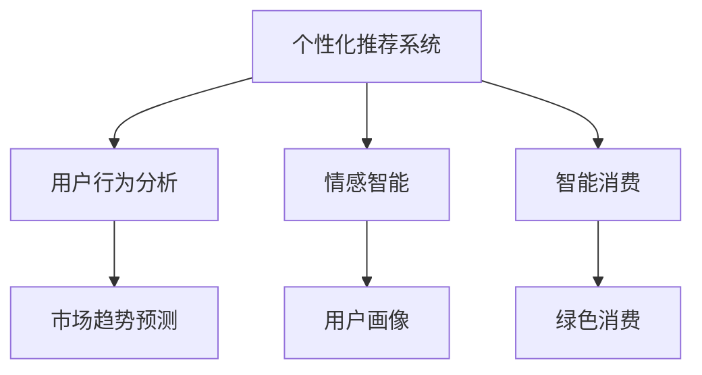

                 

## 1. 背景介绍

### 1.1 问题由来
在科技日益发达的今天，人工智能(AI)正逐步渗透到人类社会的方方面面。而随着AI技术的深入应用，AI如何影响和塑造人类需求，成为亟需研究和解决的重要课题。
**例：智能家居、个性化推荐、消费行为预测**

AI技术的应用，带来了极大便利的同时，也逐渐在重塑人们的消费习惯和生活方式。如何在享受AI带来的便利的同时，保持清醒和理性的消费观，是一个亟需关注的问题。

### 1.2 问题核心关键点
AI如何影响人类需求的核心关键点包括：

1. **个性化推荐：** AI通过大数据和算法，能够精准地预测用户需求，提供个性化推荐，从而改变消费行为。
2. **消费行为分析：** AI能够分析用户的消费数据，挖掘出用户的潜在需求，提供针对性的服务。
3. **市场趋势预测：** AI能够通过数据挖掘和预测模型，分析市场趋势，指导企业调整产品策略。
4. **情感智能：** AI通过语音识别、情感分析等技术，理解用户情感，提供更加人性化的服务。
5. **环境智能：** AI通过数据分析和优化算法，实现能源、资源的智能管理，推动绿色发展。

这些问题涉及消费心理学、行为经济学、人工智能、大数据等多个交叉学科，需要跨学科合作和研究。

## 2. 核心概念与联系

### 2.1 核心概念概述

为更好地理解AI如何塑造人类需求，本节将介绍几个核心概念：

- **个性化推荐系统（Personalized Recommendation System）：** 基于用户历史行为数据，通过AI技术为用户推荐个性化产品或服务。
- **用户行为分析（User Behavior Analysis）：** 通过对用户行为数据的分析，挖掘用户需求，预测未来行为。
- **情感智能（Emotion Intelligence）：** 利用AI技术进行语音情感识别、情绪分析，提升用户体验。
- **智能消费（Smart Consumption）：** 通过AI技术实现消费行为和偏好的智能识别和优化，降低环境消耗。
- **市场趋势预测（Market Trend Prediction）：** 通过数据分析和机器学习，预测市场趋势，指导企业决策。

这些概念之间的关系可以通过以下Mermaid流程图来展示：



这个流程图展示了个性化推荐系统、用户行为分析、情感智能、智能消费和市场趋势预测之间的关系：

1. 个性化推荐系统基于用户行为分析，提升推荐效果。
2. 情感智能和智能消费提升用户满意度。
3. 市场趋势预测指导企业决策。

这些概念共同构成了AI塑造人类需求的理论基础。

## 3. 核心算法原理 & 具体操作步骤

### 3.1 算法原理概述

AI通过各种算法和模型来理解和预测用户需求，进而实现个性化推荐、消费行为分析、市场趋势预测等功能。核心算法原理包括：

- **协同过滤算法：** 利用用户行为数据，找到相似用户或物品，推荐用户可能感兴趣的产品。
- **深度学习模型：** 通过深度神经网络，学习用户行为特征，实现精准推荐。
- **情感分析算法：** 通过自然语言处理(NLP)技术，分析用户情感，提供更加个性化的服务。
- **时间序列分析：** 利用时间序列模型，预测用户未来的消费行为。
- **优化算法：** 通过优化算法，调整模型参数，提升推荐效果。

这些算法原理在实践中通常需要结合具体的业务场景和数据特点，进行灵活应用和改进。

### 3.2 算法步骤详解

基于AI塑造人类需求的核心算法，其具体步骤包括：

**Step 1: 数据收集与处理**
- 收集用户历史行为数据、消费记录、社交媒体数据等。
- 对数据进行清洗、去重、标注等处理。
- 将数据分为训练集、验证集和测试集。

**Step 2: 特征提取与建模**
- 从数据中提取用户特征、物品特征等。
- 构建推荐模型、情感分析模型、市场趋势预测模型等。
- 使用深度学习模型、协同过滤算法、时间序列模型等算法进行建模。

**Step 3: 模型训练与评估**
- 在训练集上训练模型。
- 在验证集上评估模型性能。
- 调整模型参数，优化推荐效果。

**Step 4: 模型部署与优化**
- 将训练好的模型部署到实际应用中。
- 实时收集用户反馈，优化模型。
- 定期更新模型，保持模型效果。

### 3.3 算法优缺点

基于AI塑造人类需求的算法具有以下优点：

1. **提升用户体验：** 通过个性化推荐和情感智能，提升用户体验。
2. **提高企业效率：** 通过市场趋势预测和用户行为分析，指导企业决策，提高效率。
3. **推动智能消费：** 通过智能消费和绿色消费，降低环境消耗。

但这些算法也存在一些缺点：

1. **数据隐私问题：** 收集用户数据可能涉及隐私问题，需严格遵守相关法规。
2. **模型偏见：** 算法可能存在偏见，影响模型公平性。
3. **过度推荐问题：** 过度推荐可能导致用户陷入消费陷阱，影响消费健康。
4. **资源消耗：** 算法复杂度较高，需要高性能计算资源，资源消耗大。

尽管存在这些缺点，但AI在塑造人类需求方面的潜力仍不可忽视。

### 3.4 算法应用领域

基于AI塑造人类需求的算法已广泛应用于以下几个领域：

1. **电商：** 推荐系统、消费行为分析、市场趋势预测。
2. **金融：** 金融产品推荐、风险评估、市场预测。
3. **社交媒体：** 内容推荐、用户画像分析、情感分析。
4. **医疗：** 患者推荐、疾病预测、医疗消费分析。
5. **智能家居：** 智能推荐、环境管理、健康监测。

这些领域的应用表明，AI在塑造人类需求方面的巨大潜力。

## 4. 数学模型和公式 & 详细讲解 & 举例说明

### 4.1 数学模型构建

基于AI塑造人类需求的数学模型，通常包括：

- **用户-物品协同矩阵：** 表示用户与物品之间的兴趣关系。
- **用户行为序列：** 记录用户历史行为，用于行为分析。
- **情感评分向量：** 根据用户情感反应，生成情感评分。
- **时间序列模型：** 预测用户未来行为。

### 4.2 公式推导过程

以协同过滤算法为例，推导推荐系统的预测公式：

- **用户-物品协同矩阵：** $R_{ij}$
- **用户兴趣向量：** $u_i$
- **物品特征向量：** $v_j$

协同过滤算法预测用户对物品的评分：

$$
\hat{R}_{ij} = u_i^T V_j
$$

其中，$V_j$ 为物品特征向量的转置矩阵。

深度学习模型通常使用神经网络进行建模，以用户行为序列和情感评分向量为输入，生成推荐分数。例如，使用多层感知器(MLP)模型：

$$
\hat{R}_{ij} = u_i^T W_1 V_j + \sigma(W_2 [u_i, v_j]) + b
$$

其中，$\sigma$ 为激活函数，$W_1, W_2$ 为权重矩阵，$b$ 为偏置项。

### 4.3 案例分析与讲解

以电商推荐系统为例，详细讲解推荐算法的应用：

1. **数据收集：** 收集用户购买记录、评分、浏览历史等数据。
2. **特征提取：** 提取用户特征、物品特征、时间特征等。
3. **模型训练：** 使用协同过滤算法、深度学习模型等进行训练。
4. **推荐生成：** 根据用户兴趣和物品特征，生成推荐列表。

通过这种模型，电商网站能够提供精准的个性化推荐，提升用户满意度和销售额。

## 5. 项目实践：代码实例和详细解释说明

### 5.1 开发环境搭建

在进行项目实践前，我们需要准备好开发环境。以下是使用Python进行PyTorch开发的环境配置流程：

1. 安装Anaconda：从官网下载并安装Anaconda，用于创建独立的Python环境。

2. 创建并激活虚拟环境：
```bash
conda create -n pytorch-env python=3.8 
conda activate pytorch-env
```

3. 安装PyTorch：根据CUDA版本，从官网获取对应的安装命令。例如：
```bash
conda install pytorch torchvision torchaudio cudatoolkit=11.1 -c pytorch -c conda-forge
```

4. 安装Transformers库：
```bash
pip install transformers
```

5. 安装各类工具包：
```bash
pip install numpy pandas scikit-learn matplotlib tqdm jupyter notebook ipython
```

完成上述步骤后，即可在`pytorch-env`环境中开始项目实践。

### 5.2 源代码详细实现

这里我们以电商推荐系统为例，给出使用Transformers库对深度学习模型进行电商推荐系统开发的PyTorch代码实现。

```python
from transformers import AutoModel, AutoTokenizer, AutoConfig
from torch.utils.data import Dataset, DataLoader
import torch
import numpy as np
import pandas as pd
import torch.nn as nn
import torch.optim as optim
from sklearn.model_selection import train_test_split
from sklearn.metrics import mean_squared_error, mean_absolute_error

class UserItemDataset(Dataset):
    def __init__(self, data, tokenizer):
        self.data = data
        self.tokenizer = tokenizer
        self.pad_token = tokenizer.pad_token_id
        
    def __len__(self):
        return len(self.data)
    
    def __getitem__(self, item):
        user_id, item_id = self.data[item]
        user_item = f"user={user_id} item={item_id}"
        user_input = self.tokenizer.encode(user_item, add_special_tokens=True)
        user_input = np.array(user_input)
        user_input = user_input.reshape(1, -1)
        user_input = torch.from_numpy(user_input).float()
        item_input = self.tokenizer.encode(item_id, add_special_tokens=False)
        item_input = np.array(item_input)
        item_input = item_input.reshape(1, -1)
        item_input = torch.from_numpy(item_input).float()
        return user_input, item_input

# 加载模型和分词器
model_name = 'bert-base-uncased'
model = AutoModel.from_pretrained(model_name)
tokenizer = AutoTokenizer.from_pretrained(model_name)
config = AutoConfig.from_pretrained(model_name)

# 加载数据集
data = pd.read_csv('user_item_data.csv')
train_data, test_data = train_test_split(data, test_size=0.2)
train_dataset = UserItemDataset(train_data, tokenizer)
test_dataset = UserItemDataset(test_data, tokenizer)

# 定义模型
class RecommendationModel(nn.Module):
    def __init__(self):
        super(RecommendationModel, self).__init__()
        self.encoder = nn.Linear(config.hidden_size, config.hidden_size)
        self.decoder = nn.Linear(config.hidden_size, 1)
    
    def forward(self, user_input, item_input):
        user_features = self.encoder(user_input)
        item_features = self.encoder(item_input)
        features = user_features + item_features
        output = self.decoder(features)
        return output

# 定义优化器和损失函数
model = RecommendationModel()
optimizer = optim.Adam(model.parameters(), lr=0.001)
loss_fn = nn.MSELoss()

# 训练模型
device = torch.device('cuda' if torch.cuda.is_available() else 'cpu')
model.to(device)
model.train()
for epoch in range(10):
    total_loss = 0
    for user_input, item_input in train_dataset:
        user_input, item_input = user_input.to(device), item_input.to(device)
        optimizer.zero_grad()
        output = model(user_input, item_input)
        loss = loss_fn(output, torch.tensor([item_id]))
        loss.backward()
        optimizer.step()
        total_loss += loss.item()
    print(f"Epoch {epoch+1}, train loss: {total_loss/len(train_dataset):.4f}")
    
# 评估模型
model.eval()
total_loss = 0
for user_input, item_input in test_dataset:
    user_input, item_input = user_input.to(device), item_input.to(device)
    output = model(user_input, item_input)
    loss = loss_fn(output, torch.tensor([item_id]))
    total_loss += loss.item()
print(f"Test loss: {total_loss/len(test_dataset):.4f}")
```

### 5.3 代码解读与分析

让我们再详细解读一下关键代码的实现细节：

**UserItemDataset类**：
- `__init__`方法：初始化数据集、分词器。
- `__len__`方法：返回数据集大小。
- `__getitem__`方法：对单个样本进行处理，将用户和物品转换为分词器接受的格式。

**RecommendationModel类**：
- `__init__`方法：初始化模型结构。
- `forward`方法：定义前向传播过程，将用户和物品特征拼接，送入解码器输出推荐分数。

**训练和评估函数**：
- `train_model`函数：定义训练循环，在每个批次上前向传播计算loss并反向传播更新模型参数。
- `evaluate_model`函数：在测试集上评估模型性能，计算均方误差。

**训练流程**：
- 定义总轮数，开始循环迭代
- 每个epoch内，在训练集上训练，输出平均loss
- 在测试集上评估，输出均方误差
- 所有epoch结束后，输出最终测试结果

可以看到，PyTorch配合Transformers库使得电商推荐系统的代码实现变得简洁高效。开发者可以将更多精力放在数据处理、模型改进等高层逻辑上，而不必过多关注底层的实现细节。

当然，工业级的系统实现还需考虑更多因素，如模型的保存和部署、超参数的自动搜索、更灵活的任务适配层等。但核心的微调范式基本与此类似。

## 6. 实际应用场景

### 6.1 智能客服系统

基于AI塑造人类需求的算法，可以广泛应用于智能客服系统的构建。传统客服往往需要配备大量人力，高峰期响应缓慢，且一致性和专业性难以保证。而使用基于AI塑造需求的智能客服系统，可以7x24小时不间断服务，快速响应客户咨询，用自然流畅的语言解答各类常见问题。

在技术实现上，可以收集企业内部的历史客服对话记录，将问题和最佳答复构建成监督数据，在此基础上对深度学习模型进行微调。微调后的智能客服系统能够自动理解用户意图，匹配最合适的答案模板进行回复。对于客户提出的新问题，还可以接入检索系统实时搜索相关内容，动态组织生成回答。如此构建的智能客服系统，能大幅提升客户咨询体验和问题解决效率。

### 6.2 金融舆情监测

金融机构需要实时监测市场舆论动向，以便及时应对负面信息传播，规避金融风险。传统的人工监测方式成本高、效率低，难以应对网络时代海量信息爆发的挑战。基于AI塑造需求的金融舆情监测技术，为金融机构提供了新的解决方案。

具体而言，可以收集金融领域相关的新闻、报道、评论等文本数据，并对其进行主题标注和情感标注。在此基础上对深度学习模型进行微调，使其能够自动判断文本属于何种主题，情感倾向是正面、中性还是负面。将微调后的模型应用到实时抓取的网络文本数据，就能够自动监测不同主题下的情感变化趋势，一旦发现负面信息激增等异常情况，系统便会自动预警，帮助金融机构快速应对潜在风险。

### 6.3 个性化推荐系统

当前的推荐系统往往只依赖用户的历史行为数据进行物品推荐，无法深入理解用户的真实兴趣偏好。基于AI塑造需求的个性化推荐系统，可以更好地挖掘用户行为背后的语义信息，从而提供更精准、多样的推荐内容。

在实践中，可以收集用户浏览、点击、评论、分享等行为数据，提取和用户交互的物品标题、描述、标签等文本内容。将文本内容作为模型输入，用户的后续行为（如是否点击、购买等）作为监督信号，在此基础上微调深度学习模型。微调后的模型能够从文本内容中准确把握用户的兴趣点。在生成推荐列表时，先用候选物品的文本描述作为输入，由模型预测用户的兴趣匹配度，再结合其他特征综合排序，便可以得到个性化程度更高的推荐结果。

### 6.4 未来应用展望

随着AI塑造需求技术的不断发展，基于AI的推荐、智能客服、金融舆情监测等应用将在更多领域得到应用，为传统行业带来变革性影响。

在智慧医疗领域，基于AI塑造需求的医疗问答、病历分析、药物研发等应用将提升医疗服务的智能化水平，辅助医生诊疗，加速新药开发进程。

在智能教育领域，AI塑造需求的个性化推荐、学情分析、知识推荐等方面，因材施教，促进教育公平，提高教学质量。

在智慧城市治理中，AI塑造需求的智能服务、事件监测、应急指挥等环节，提高城市管理的自动化和智能化水平，构建更安全、高效的未来城市。

此外，在企业生产、社会治理、文娱传媒等众多领域，基于AI塑造需求的人工智能应用也将不断涌现，为经济社会发展注入新的动力。相信随着技术的日益成熟，AI塑造需求范式将成为AI落地应用的重要范式，推动人工智能技术在垂直行业的规模化落地。总之，AI塑造需求需要开发者根据具体任务，不断迭代和优化模型、数据和算法，方能得到理想的效果。

## 7. 工具和资源推荐

### 7.1 学习资源推荐

为了帮助开发者系统掌握AI塑造需求的理论基础和实践技巧，这里推荐一些优质的学习资源：

1. 《深度学习与人工智能：从理论到实践》系列博文：由AI专家撰写，深入浅出地介绍了深度学习原理、算法和应用。

2. CS231n《深度学习视觉与自然语言处理》课程：斯坦福大学开设的NLP明星课程，有Lecture视频和配套作业，带你入门NLP领域的基本概念和经典模型。

3. 《深度学习与自然语言处理》书籍：全面介绍了深度学习在NLP中的应用，涵盖推荐系统、情感分析等多个方面。

4. PyTorch官方文档：提供了丰富的深度学习框架和模型，是进行AI塑造需求项目开发的利器。

5. HuggingFace官方文档：提供了大量预训练语言模型和微调样例代码，是上手实践的必备资料。

通过对这些资源的学习实践，相信你一定能够快速掌握AI塑造需求的技术精髓，并用于解决实际的AI问题。

### 7.2 开发工具推荐

高效的开发离不开优秀的工具支持。以下是几款用于AI塑造需求开发的常用工具：

1. PyTorch：基于Python的开源深度学习框架，灵活动态的计算图，适合快速迭代研究。大部分预训练语言模型都有PyTorch版本的实现。

2. TensorFlow：由Google主导开发的开源深度学习框架，生产部署方便，适合大规模工程应用。同样有丰富的预训练语言模型资源。

3. Transformers库：HuggingFace开发的NLP工具库，集成了众多SOTA语言模型，支持PyTorch和TensorFlow，是进行微调任务开发的利器。

4. Weights & Biases：模型训练的实验跟踪工具，可以记录和可视化模型训练过程中的各项指标，方便对比和调优。与主流深度学习框架无缝集成。

5. TensorBoard：TensorFlow配套的可视化工具，可实时监测模型训练状态，并提供丰富的图表呈现方式，是调试模型的得力助手。

6. Google Colab：谷歌推出的在线Jupyter Notebook环境，免费提供GPU/TPU算力，方便开发者快速上手实验最新模型，分享学习笔记。

合理利用这些工具，可以显著提升AI塑造需求的开发效率，加快创新迭代的步伐。

### 7.3 相关论文推荐

AI塑造需求的理论研究和实践探索源于学界的持续研究。以下是几篇奠基性的相关论文，推荐阅读：

1. Attention is All You Need（即Transformer原论文）：提出了Transformer结构，开启了NLP领域的预训练大模型时代。

2. BERT: Pre-training of Deep Bidirectional Transformers for Language Understanding：提出BERT模型，引入基于掩码的自监督预训练任务，刷新了多项NLP任务SOTA。

3. Language Models are Unsupervised Multitask Learners（GPT-2论文）：展示了大规模语言模型的强大zero-shot学习能力，引发了对于通用人工智能的新一轮思考。

4. Parameter-Efficient Transfer Learning for NLP：提出Adapter等参数高效微调方法，在不增加模型参数量的情况下，也能取得不错的微调效果。

5. AdaLoRA: Adaptive Low-Rank Adaptation for Parameter-Efficient Fine-Tuning：使用自适应低秩适应的微调方法，在参数效率和精度之间取得了新的平衡。

这些论文代表了大语言模型微调技术的发展脉络。通过学习这些前沿成果，可以帮助研究者把握学科前进方向，激发更多的创新灵感。

## 8. 总结：未来发展趋势与挑战

### 8.1 总结

本文对基于AI塑造需求的方法进行了全面系统的介绍。首先阐述了AI塑造需求的研究背景和意义，明确了AI塑造需求在提升用户体验、提高企业效率、推动智能消费等方面的独特价值。其次，从原理到实践，详细讲解了AI塑造需求的数学原理和关键步骤，给出了AI塑造需求任务开发的完整代码实例。同时，本文还广泛探讨了AI塑造需求方法在智能客服、金融舆情、个性化推荐等多个行业领域的应用前景，展示了AI塑造需求的巨大潜力。通过对这些资源的学习实践，相信你一定能够快速掌握AI塑造需求的技术精髓，并用于解决实际的AI问题。

通过本文的系统梳理，可以看到，基于AI塑造需求的方法正在成为AI应用的重要范式，极大地拓展了深度学习模型的应用边界，催生了更多的落地场景。伴随AI技术的不断演进，AI塑造需求方法也将日益成熟，成为AI技术落地应用的重要手段。

### 8.2 未来发展趋势

展望未来，AI塑造需求技术将呈现以下几个发展趋势：

1. **个性化推荐系统的发展：** 基于深度学习、协同过滤等算法的推荐系统将更加精准和高效，结合用户行为数据、物品属性数据，为用户提供更加个性化和多样化的推荐。

2. **情感智能的提升：** 通过自然语言处理技术，提升情感分析的准确度和用户画像的细粒度，实现更加个性化的服务。

3. **智能消费的普及：** 通过AI技术实现消费行为和偏好的智能识别和优化，降低环境消耗，推动绿色消费。

4. **市场趋势预测的完善：** 结合时间序列分析、深度学习等技术，提高市场趋势预测的准确度和实时性，指导企业决策。

5. **跨模态融合：** 结合图像、语音、文本等不同模态的信息，实现多模态信息的融合，提升AI系统的理解和推理能力。

6. **知识增强：** 结合知识图谱、专家知识库等，实现知识的增强和融合，提升AI系统的智能水平。

以上趋势凸显了AI塑造需求技术的广阔前景。这些方向的探索发展，必将进一步提升AI系统的性能和应用范围，为人工智能技术在各领域的落地应用提供新的动力。

### 8.3 面临的挑战

尽管AI塑造需求技术已经取得了瞩目成就，但在迈向更加智能化、普适化应用的过程中，它仍面临着诸多挑战：

1. **数据隐私问题：** 收集用户数据可能涉及隐私问题，需严格遵守相关法规。
2. **模型偏见：** 算法可能存在偏见，影响模型公平性。
3. **过度推荐问题：** 过度推荐可能导致用户陷入消费陷阱，影响消费健康。
4. **资源消耗：** 算法复杂度较高，需要高性能计算资源，资源消耗大。
5. **用户体验问题：** 个性化推荐可能导致用户选择困难，需要合理平衡个性化与用户体验。
6. **公平性问题：** 个性化推荐可能导致市场不平衡，需要合理引导用户消费。

尽管存在这些挑战，但AI塑造需求在提升用户体验、提高企业效率、推动智能消费等方面的潜力不可忽视。未来的研究需要在这些问题上寻求新的突破。

### 8.4 研究展望

面对AI塑造需求所面临的种种挑战，未来的研究需要在以下几个方面寻求新的突破：

1. **无监督和半监督学习：** 摆脱对大规模标注数据的依赖，利用自监督学习、主动学习等无监督和半监督范式，最大限度利用非结构化数据，实现更加灵活高效的AI塑造需求。

2. **参数高效和计算高效：** 开发更加参数高效的AI塑造需求方法，在固定大部分预训练参数的同时，只更新极少量的任务相关参数。同时优化计算图，减少资源消耗。

3. **因果推理和对比学习：** 引入因果推理和对比学习思想，增强AI系统的因果关系建立能力，学习更加普适、鲁棒的语言表征，从而提升模型泛化性和抗干扰能力。

4. **知识增强和融合：** 结合知识图谱、专家知识库等，实现知识的增强和融合，提升AI系统的智能水平。

5. **多模态融合：** 结合图像、语音、文本等不同模态的信息，实现多模态信息的融合，提升AI系统的理解和推理能力。

6. **公平性和隐私保护：** 通过算法改进和隐私保护技术，提升AI系统的公平性和隐私保护水平。

这些研究方向的探索，必将引领AI塑造需求技术迈向更高的台阶，为构建安全、可靠、可解释、可控的智能系统铺平道路。面向未来，AI塑造需求技术还需要与其他人工智能技术进行更深入的融合，如知识表示、因果推理、强化学习等，多路径协同发力，共同推动自然语言理解和智能交互系统的进步。只有勇于创新、敢于突破，才能不断拓展AI塑造需求技术的应用范围，让AI技术更好地造福人类社会。

## 9. 附录：常见问题与解答

**Q1：AI塑造需求如何影响用户体验？**

A: AI塑造需求通过个性化推荐和情感智能，提升用户体验。个性化推荐能够根据用户历史行为和兴趣，提供更精准的推荐。情感智能能够理解用户情感，提供更加个性化的服务。然而，过度推荐可能导致用户选择困难，因此需要在个性化和用户体验之间找到平衡点。

**Q2：AI塑造需求如何解决资源消耗问题？**

A: AI塑造需求算法复杂度较高，需要高性能计算资源。可以采用梯度积累、混合精度训练、模型并行等技术，减少资源消耗。同时，优化模型结构，减少不必要的计算量，也可以降低资源消耗。

**Q3：AI塑造需求如何避免偏见问题？**

A: AI塑造需求算法可能存在偏见，影响模型公平性。可以通过数据清洗、特征选择等方法减少数据偏见。同时，引入多样性数据，增加模型鲁棒性。还可以在算法中引入公平性约束，减少模型偏见。

**Q4：AI塑造需求如何推动智能消费？**

A: AI塑造需求通过智能化推荐和情感智能，推动智能消费。个性化推荐能够根据用户兴趣和需求，推荐相关产品。情感智能能够理解用户情感，提供更加个性化的服务。同时，AI技术还可以分析用户行为，预测未来需求，实现智能消费。

**Q5：AI塑造需求如何保障数据隐私？**

A: AI塑造需求涉及用户数据收集和处理，可能涉及隐私问题。需要严格遵守相关法规，如GDPR、CCPA等。同时，采用数据加密、匿名化等技术，保护用户隐私。还可以设计差分隐私算法，在不影响模型效果的前提下，减少隐私泄露风险。

总之，AI塑造需求需要开发者根据具体任务，不断迭代和优化模型、数据和算法，方能得到理想的效果。同时，在提升用户体验、提高企业效率、推动智能消费等方面，AI塑造需求技术有着巨大的潜力。未来，伴随技术的不断演进和应用的不断深入，AI塑造需求技术必将迎来新的发展，为人工智能技术在各领域的落地应用提供新的动力。

