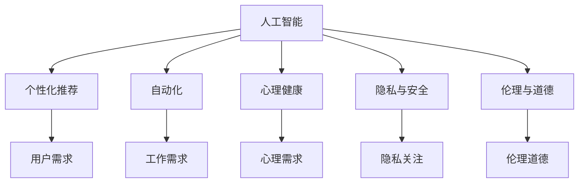

                 

## 1. 背景介绍

### 1.1 问题由来
在当今这个信息爆炸的时代，人工智能（AI）已经深入到我们生活的方方面面，从智能推荐到自动驾驶，从语音助手到健康医疗，AI技术正以前所未有的速度和规模改变着我们的生活方式。然而，人工智能并非孤立存在，它与人类社会的互动并非仅仅是技术上的单向应用，而是涉及到更深层次的伦理、心理和社会需求。本文旨在探讨人工智能如何影响人类的欲望和需求，并从技术、社会和心理层面提出相应的解决方案。

### 1.2 问题核心关键点
人工智能对人类欲望和需求的影响是一个多维度的复杂问题。核心关键点包括以下几个方面：
1. **个性化推荐**：AI如何通过数据分析和算法优化，影响我们的消费决策和需求。
2. **工作自动化**：AI在自动化领域的应用如何改变我们对劳动和职业的需求。
3. **心理健康**：AI如何通过提供情感支持或增强社交互动，影响我们的心理健康需求。
4. **隐私与安全**：AI在数据收集和处理中的应用如何影响我们对隐私和安全的关注。
5. **伦理与道德**：AI技术的进步如何挑战我们的伦理观念和道德底线。

## 2. 核心概念与联系

### 2.1 核心概念概述

为更好地理解AI如何影响人类的欲望和需求，本文将介绍几个关键概念：

- **人工智能（AI）**：通过计算机算法和数据处理实现智能决策和任务执行的技术。
- **个性化推荐系统**：基于用户历史数据和行为分析，提供定制化信息和服务的技术。
- **自动化**：利用AI技术自动执行重复性、规则性工作，提升效率和降低成本。
- **心理健康**：通过AI技术提供情感支持、心理辅导等，改善心理健康状况。
- **隐私与安全**：在数据收集和使用过程中，确保用户隐私和数据安全。
- **伦理与道德**：在AI技术设计和应用中，遵循社会伦理和道德标准。

这些概念之间的逻辑关系可以通过以下Mermaid流程图来展示：



这个流程图展示出AI技术如何通过个性化推荐、自动化、心理健康支持、隐私与安全保障、伦理与道德约束，影响和满足人类的各种需求。

## 3. 核心算法原理 & 具体操作步骤
### 3.1 算法原理概述

AI技术对人类欲望和需求的影响主要体现在以下几个方面：

- **个性化推荐算法**：通过分析用户历史行为和兴趣，预测并推荐符合其需求的内容和产品，从而影响用户的消费决策。
- **自动化流程**：通过机器学习和深度学习技术，自动化执行工作流程，提高效率，减少重复劳动，改变劳动市场对技能的需求。
- **心理健康干预**：利用AI技术，如聊天机器人、情感识别系统等，提供情感支持和心理辅导，缓解压力，改善心理健康。
- **隐私保护算法**：通过数据匿名化、加密存储等技术，保护用户隐私，避免数据泄露和滥用。
- **伦理决策框架**：通过公平性、透明性等原则，设计AI系统的决策逻辑，确保其符合社会伦理和道德标准。

### 3.2 算法步骤详解

以下是详细的操作步骤：

#### 个性化推荐算法
1. **数据收集**：收集用户的历史行为数据，如浏览记录、购买记录、社交媒体互动等。
2. **特征提取**：从收集的数据中提取有用的特征，如浏览时长、点击频率、购买金额等。
3. **模型训练**：使用机器学习算法（如协同过滤、神经网络）训练推荐模型。
4. **个性化推荐**：根据用户的当前行为和特征，实时生成个性化的推荐结果。
5. **用户反馈**：收集用户的反馈信息，进一步优化推荐算法。

#### 自动化流程
1. **任务自动化**：识别可以自动化的任务，如数据录入、报告生成等。
2. **算法选择**：选择适合的自动化算法，如规则引擎、机器学习、深度学习等。
3. **流程优化**：对自动化流程进行优化，提高效率和准确性。
4. **员工培训**：对相关员工进行培训，确保其能够与自动化系统协同工作。
5. **持续改进**：根据反馈和数据，持续改进自动化系统。

#### 心理健康干预
1. **情感识别**：利用情感识别技术，分析用户的情感状态。
2. **智能辅导**：使用聊天机器人、虚拟助手等提供情感支持和心理辅导。
3. **数据反馈**：收集用户对情感支持的反馈，不断优化系统。
4. **隐私保护**：确保心理健康干预过程的数据安全和隐私保护。

#### 隐私保护算法
1. **数据匿名化**：对用户数据进行匿名化处理，保护用户隐私。
2. **加密存储**：使用加密技术，确保数据在传输和存储过程中的安全性。
3. **访问控制**：设置严格的访问权限，防止未授权访问。
4. **合规检查**：确保数据处理过程符合相关法律法规。

#### 伦理决策框架
1. **伦理评估**：在AI系统的设计和应用中，进行伦理评估，识别潜在的伦理问题。
2. **透明性**：确保AI系统的决策过程透明，用户可以理解其决策依据。
3. **公平性**：确保AI系统对所有用户公平，避免偏见和歧视。
4. **责任归属**：明确AI系统在决策过程中的责任归属，确保责任可追溯。

### 3.3 算法优缺点

个性化推荐算法、自动化流程、心理健康干预、隐私保护算法和伦理决策框架各有其优缺点：

#### 个性化推荐算法
**优点**：
- 提高用户满意度和转化率
- 精准匹配用户需求
- 节省用户搜索时间

**缺点**：
- 可能造成信息茧房
- 加剧用户的信息不对称
- 可能侵犯用户隐私

#### 自动化流程
**优点**：
- 提高工作效率
- 减少人为错误
- 释放人力进行更有价值的工作

**缺点**：
- 可能造成就业岗位减少
- 可能引发技能鸿沟
- 需要高昂的初始投资

#### 心理健康干预
**优点**：
- 提供即时情感支持
- 缓解用户压力
- 改善心理健康状况

**缺点**：
- 可能无法完全替代人类心理专家
- 可能加剧数字依赖
- 数据安全和隐私问题

#### 隐私保护算法
**优点**：
- 保护用户隐私
- 避免数据泄露
- 增强用户信任

**缺点**：
- 可能增加系统复杂性
- 可能影响数据可用性
- 需要不断更新技术

#### 伦理决策框架
**优点**：
- 确保AI系统的公平性和透明性
- 避免伦理问题
- 增强用户信任

**缺点**：
- 可能增加系统设计和实现难度
- 需要不断更新伦理规范
- 可能引发合规性问题

### 3.4 算法应用领域

个性化推荐算法、自动化流程、心理健康干预、隐私保护算法和伦理决策框架在多个领域中得到广泛应用：

1. **电商行业**：通过个性化推荐系统提升用户体验和销售额。
2. **金融行业**：使用自动化流程处理大量交易和风险评估。
3. **医疗行业**：利用心理健康干预技术提供心理支持和治疗。
4. **公共安全**：通过隐私保护算法保护个人信息，避免滥用。
5. **政府治理**：建立伦理决策框架，确保AI系统公正透明。

## 4. 数学模型和公式 & 详细讲解 & 举例说明

### 4.1 数学模型构建

以下是一个简单的推荐系统数学模型：

设用户集合为 $U$，商品集合为 $I$，用户对商品 $i$ 的评分矩阵为 $R \in \mathbb{R}^{n \times m}$，其中 $n$ 为商品数量，$m$ 为用户数量。目标是为用户 $u$ 推荐商品 $i$，构建推荐模型 $f: U \times I \rightarrow \mathbb{R}$。推荐模型的目标是最大化用户对推荐商品的概率 $P$。

推荐模型可以表示为：

$$
P = \frac{e^{f(u,i)}}{\sum_{i'=1}^{m} e^{f(u,i')}}
$$

### 4.2 公式推导过程

推荐模型的目标函数为：

$$
\min_{\theta} \sum_{u=1}^{n} \sum_{i=1}^{m} R_{ui} \log P_{ui} + (1 - R_{ui}) \log (1 - P_{ui})
$$

使用梯度下降法求解目标函数，得到推荐模型的参数 $\theta$。

### 4.3 案例分析与讲解

例如，对于用户 $u=1$ 和商品 $i=1$，推荐模型可以表示为：

$$
f(1,1) = \theta^T \phi(1,1)
$$

其中 $\phi(1,1)$ 为特征向量，$\theta$ 为模型参数。目标函数可以进一步简化为：

$$
\min_{\theta} \sum_{i=1}^{m} R_{1i} \log \frac{e^{\theta^T \phi(1,i)}}{\sum_{i'=1}^{m} e^{\theta^T \phi(1,i')}}
$$

求解上述目标函数，得到最优参数 $\theta$，即可得到用户 $u=1$ 对商品 $i=1$ 的推荐概率。

## 5. 项目实践：代码实例和详细解释说明

### 5.1 开发环境搭建

在进行项目实践前，我们需要准备好开发环境。以下是使用Python进行TensorFlow开发的环境配置流程：

1. 安装Anaconda：从官网下载并安装Anaconda，用于创建独立的Python环境。

2. 创建并激活虚拟环境：
```bash
conda create -n tf-env python=3.8 
conda activate tf-env
```

3. 安装TensorFlow：从官网获取对应的安装命令。例如：
```bash
conda install tensorflow
```

4. 安装各类工具包：
```bash
pip install numpy pandas scikit-learn matplotlib tqdm jupyter notebook ipython
```

完成上述步骤后，即可在`tf-env`环境中开始项目实践。

### 5.2 源代码详细实现

下面我们以个性化推荐系统为例，给出使用TensorFlow实现推荐模型的代码。

首先，定义数据处理函数：

```python
import tensorflow as tf
import numpy as np

def data_preprocessing(train_data, test_data):
    # 数据预处理，如特征选择、归一化等
    # ...
    return train_data, test_data
```

然后，定义模型和优化器：

```python
from tensorflow.keras.layers import Dense, Input
from tensorflow.keras.models import Model

input_layer = Input(shape=(D, ), name='input')
hidden_layer = Dense(128, activation='relu')(input_layer)
output_layer = Dense(1, activation='sigmoid')(hidden_layer)

model = Model(inputs=input_layer, outputs=output_layer)
model.compile(optimizer=tf.keras.optimizers.Adam(lr=0.001), loss='binary_crossentropy', metrics=['accuracy'])
```

接着，定义训练和评估函数：

```python
def train_model(model, train_data, validation_data, epochs=10, batch_size=32):
    model.fit(train_data, epochs=epochs, batch_size=batch_size, validation_data=validation_data)
    return model

def evaluate_model(model, test_data, batch_size=32):
    test_loss, test_acc = model.evaluate(test_data, batch_size=batch_size)
    return test_loss, test_acc
```

最后，启动训练流程并在测试集上评估：

```python
train_data, test_data = data_preprocessing(train_data, test_data)
train_model(model, train_data, validation_data)
test_loss, test_acc = evaluate_model(model, test_data)
print(f'Test Loss: {test_loss}, Test Accuracy: {test_acc}')
```

以上就是使用TensorFlow实现个性化推荐系统的完整代码实现。可以看到，TensorFlow提供的高级API使得模型构建和训练过程变得简洁高效。

### 5.3 代码解读与分析

让我们再详细解读一下关键代码的实现细节：

**data_preprocessing函数**：
- `train_data, test_data`：输入训练集和测试集数据。
- `return train_data, test_data`：返回预处理后的训练集和测试集数据。

**模型定义**：
- `input_layer`：定义输入层，形状为 $(D,)$，其中 $D$ 为输入特征维度。
- `hidden_layer`：定义一个隐藏层，激活函数为ReLU。
- `output_layer`：定义输出层，激活函数为sigmoid，用于二分类问题。
- `model.compile`：编译模型，指定优化器、损失函数和评估指标。

**训练和评估函数**：
- `train_model`：使用训练集数据训练模型，返回训练后的模型。
- `evaluate_model`：使用测试集数据评估模型，返回损失和精度。

**训练流程**：
- `train_data, test_data`：预处理训练集和测试集数据。
- `train_model`：使用训练集数据训练模型。
- `evaluate_model`：使用测试集数据评估模型。
- `print`：输出测试结果。

可以看到，TensorFlow提供的API使得模型构建和训练过程变得非常简单，开发者可以更多地关注算法和业务逻辑的实现。

当然，工业级的系统实现还需考虑更多因素，如模型保存和部署、超参数调优、模型压缩等。但核心的个性化推荐算法基本与此类似。

## 6. 实际应用场景

### 6.1 电商行业

个性化推荐系统在电商行业得到了广泛应用，各大电商平台通过收集用户历史行为和偏好，为用户推荐相关商品，提升用户满意度和销售额。例如，亚马逊的推荐系统通过分析用户的浏览记录和购买历史，为用户推荐相关商品，显著提高了销售额和用户粘性。

### 6.2 金融行业

金融行业也广泛应用个性化推荐系统，通过分析用户的历史交易记录和风险偏好，为用户推荐合适的金融产品，提升用户体验和金融服务质量。例如，支付宝的金融推荐系统通过分析用户的消费习惯和风险偏好，为用户推荐贷款、理财等金融产品，提升了用户满意度和金融服务质量。

### 6.3 医疗行业

个性化推荐系统在医疗行业也有着广泛的应用，通过分析用户的历史诊疗记录和健康数据，为用户推荐合适的治疗方案和健康建议，提升医疗服务质量和患者体验。例如，丁香园的推荐系统通过分析用户的健康数据和诊疗记录，为用户推荐合适的诊疗方案和健康建议，提升了医疗服务质量和患者体验。

### 6.4 未来应用展望

随着个性化推荐技术的发展，未来将有更多的应用场景出现。例如：

- **智能家居**：通过分析用户的行为数据，为用户推荐合适的家居方案和生活建议，提升用户生活质量。
- **教育行业**：通过分析学生的学习数据和行为，为学生推荐合适的学习资源和辅导方案，提升学习效果和体验。
- **娱乐行业**：通过分析用户的娱乐行为数据，为用户推荐合适的娱乐内容，提升用户体验和满意度。

## 7. 工具和资源推荐

### 7.1 学习资源推荐

为了帮助开发者系统掌握个性化推荐技术的理论基础和实践技巧，这里推荐一些优质的学习资源：

1. 《推荐系统实践》系列博文：由推荐系统专家撰写，深入浅出地介绍了推荐系统的原理、算法和实践。
2. 《深度学习推荐系统》课程：斯坦福大学开设的推荐系统课程，有Lecture视频和配套作业，带你入门推荐系统领域的基本概念和经典算法。
3. 《推荐系统》书籍：深度学习推荐系统领域的经典教材，全面介绍了推荐系统的理论和实践。
4. Weights & Biases：推荐系统的实验跟踪工具，可以记录和可视化模型训练过程中的各项指标，方便对比和调优。
5. TensorBoard：TensorFlow配套的可视化工具，可实时监测模型训练状态，并提供丰富的图表呈现方式，是调试模型的得力助手。

通过对这些资源的学习实践，相信你一定能够快速掌握个性化推荐技术的精髓，并用于解决实际的推荐问题。

### 7.2 开发工具推荐

高效的开发离不开优秀的工具支持。以下是几款用于个性化推荐系统开发的常用工具：

1. TensorFlow：基于Python的开源深度学习框架，灵活动态的计算图，适合快速迭代研究。
2. PyTorch：基于Python的开源深度学习框架，动态计算图，适合灵活的模型设计和调试。
3. Weights & Biases：推荐系统的实验跟踪工具，可以记录和可视化模型训练过程中的各项指标，方便对比和调优。
4. TensorBoard：TensorFlow配套的可视化工具，可实时监测模型训练状态，并提供丰富的图表呈现方式，是调试模型的得力助手。

合理利用这些工具，可以显著提升个性化推荐系统的开发效率，加快创新迭代的步伐。

### 7.3 相关论文推荐

个性化推荐技术的发展源于学界的持续研究。以下是几篇奠基性的相关论文，推荐阅读：

1. 《推荐系统理论》：揭示了推荐系统背后的数学原理和算法设计。
2. 《协同过滤算法》：介绍了协同过滤算法的原理和实现细节。
3. 《深度学习在推荐系统中的应用》：展示了深度学习在推荐系统中的应用和效果。
4. 《网络协同过滤算法》：提出了基于网络的协同过滤算法，提升了推荐系统的多样性和公平性。
5. 《序列推荐算法》：介绍了序列推荐算法的原理和实现细节。

这些论文代表了个性化推荐技术的发展脉络。通过学习这些前沿成果，可以帮助研究者把握学科前进方向，激发更多的创新灵感。

## 8. 总结：未来发展趋势与挑战

### 8.1 总结

本文对基于个性化推荐系统的AI如何影响人类的欲望和需求进行了全面系统的介绍。首先阐述了个性化推荐系统在电商、金融、医疗等多个领域的应用，明确了AI技术在满足人类需求方面的独特价值。其次，从技术、社会和心理层面，详细讲解了个性化推荐系统的原理和操作步骤，给出了推荐系统开发的完整代码实例。同时，本文还探讨了AI技术在满足人类需求方面可能面临的伦理、隐私等问题，提出了相应的解决方案。

通过本文的系统梳理，可以看到，个性化推荐技术在提升用户体验和满意度方面具有巨大的潜力，但也面临着数据隐私、算法公平性等挑战。未来，研究者需要在数据保护、算法透明性等方面进行深入探索，以实现AI技术在满足人类需求方面的良性发展。

### 8.2 未来发展趋势

展望未来，个性化推荐技术的发展趋势如下：

1. **算法多样化**：随着数据量的增加和算法的进步，推荐系统将越来越多样化，涌现出更多的推荐算法，如序列推荐、协同过滤、知识图谱推荐等。
2. **数据融合**：推荐系统将更多地融合多模态数据，如文本、图像、语音等，提升推荐效果。
3. **实时化**：推荐系统将更加注重实时性，实时分析用户行为，提供个性化推荐。
4. **跨领域应用**：推荐系统将在更多领域得到应用，如智能家居、教育、娱乐等，提升用户体验和生活质量。
5. **隐私保护**：随着用户隐私意识的提高，推荐系统将更加注重数据隐私保护，采用差分隐私、联邦学习等技术，保护用户隐私。

以上趋势凸显了个性化推荐技术的广阔前景。这些方向的探索发展，必将进一步提升推荐系统的性能和应用范围，为人类提供更丰富、个性化的服务。

### 8.3 面临的挑战

尽管个性化推荐技术已经取得了瞩目成就，但在迈向更加智能化、普适化应用的过程中，它仍面临着诸多挑战：

1. **数据质量问题**：推荐系统的性能高度依赖于数据质量，低质量的数据可能导致推荐效果不佳。如何获取高质量的数据，是推荐系统面临的重要挑战。
2. **算法复杂性**：推荐算法的复杂性越来越高，如何设计简单、高效、可解释的算法，是推荐系统面临的难题。
3. **用户隐私保护**：推荐系统需要收集和处理大量用户数据，如何保护用户隐私，避免数据滥用，是推荐系统面临的重要问题。
4. **多样性和公平性**：推荐系统可能引发信息茧房和数据偏见，如何提升推荐内容的多样性和公平性，是推荐系统面临的挑战。
5. **实时性要求**：推荐系统需要实时处理和分析用户行为，对计算资源和时间效率的要求较高。

这些挑战需要研究者在算法设计、数据处理、隐私保护等方面进行深入探索，以实现个性化推荐技术的良性发展。

### 8.4 研究展望

面对个性化推荐技术面临的挑战，未来的研究需要在以下几个方面寻求新的突破：

1. **数据质量提升**：研究高效的数据收集和处理技术，提升数据质量和丰富性。
2. **算法优化**：研究简单、高效、可解释的推荐算法，提升推荐系统的性能和可解释性。
3. **隐私保护技术**：研究差分隐私、联邦学习等隐私保护技术，保护用户隐私。
4. **公平性和多样性**：研究公平性和多样性增强算法，提升推荐内容的多样性和公平性。
5. **实时性优化**：研究高效的计算和存储技术，提升推荐系统的实时性和效率。

这些研究方向的探索，必将引领个性化推荐技术迈向更高的台阶，为人类提供更丰富、个性化、安全的推荐服务。面向未来，个性化推荐技术还需要与其他人工智能技术进行更深入的融合，如知识表示、因果推理、强化学习等，多路径协同发力，共同推动推荐系统的进步。只有勇于创新、敢于突破，才能不断拓展推荐系统的边界，让AI技术更好地服务于人类社会。

## 9. 附录：常见问题与解答

**Q1：什么是个性化推荐系统？**

A: 个性化推荐系统是一种通过分析用户历史行为和兴趣，为用户提供定制化推荐内容的技术。它可以应用于电商、金融、医疗等多个领域，提升用户体验和满意度。

**Q2：个性化推荐系统是如何工作的？**

A: 个性化推荐系统通常包括以下步骤：数据收集、特征提取、模型训练、个性化推荐、用户反馈。具体流程包括：
1. 收集用户的历史行为数据，如浏览记录、购买记录等。
2. 从数据中提取有用的特征，如浏览时长、点击频率、购买金额等。
3. 使用机器学习算法训练推荐模型，如协同过滤、神经网络等。
4. 根据用户当前行为和特征，生成个性化推荐内容。
5. 收集用户对推荐结果的反馈，进一步优化推荐算法。

**Q3：个性化推荐系统有哪些优点和缺点？**

A: 个性化推荐系统的优点包括：
1. 提升用户体验和满意度。
2. 提高转化率和销售额。
3. 减少用户搜索时间。

缺点包括：
1. 可能引发信息茧房。
2. 加剧信息不对称。
3. 可能侵犯用户隐私。

**Q4：个性化推荐系统在实际应用中需要注意哪些问题？**

A: 个性化推荐系统在实际应用中需要注意以下问题：
1. 数据质量问题，如何获取高质量的数据。
2. 算法复杂性，如何设计简单、高效、可解释的算法。
3. 用户隐私保护，如何保护用户隐私，避免数据滥用。
4. 多样性和公平性，如何提升推荐内容的多样性和公平性。
5. 实时性要求，如何提高推荐系统的实时性和效率。

这些问题的解决需要研究者在算法设计、数据处理、隐私保护等方面进行深入探索，以实现个性化推荐技术的良性发展。

**Q5：未来个性化推荐系统的发展方向是什么？**

A: 未来个性化推荐系统的发展方向包括：
1. 算法多样化，涌现出更多的推荐算法。
2. 数据融合，融合多模态数据提升推荐效果。
3. 实时化，实时分析用户行为，提供个性化推荐。
4. 跨领域应用，在更多领域得到应用，提升用户体验和生活质量。
5. 隐私保护，采用差分隐私、联邦学习等技术，保护用户隐私。

这些方向的研究和探索，必将推动个性化推荐技术迈向更高的台阶，为人类提供更丰富、个性化、安全的推荐服务。

---

作者：禅与计算机程序设计艺术 / Zen and the Art of Computer Programming

