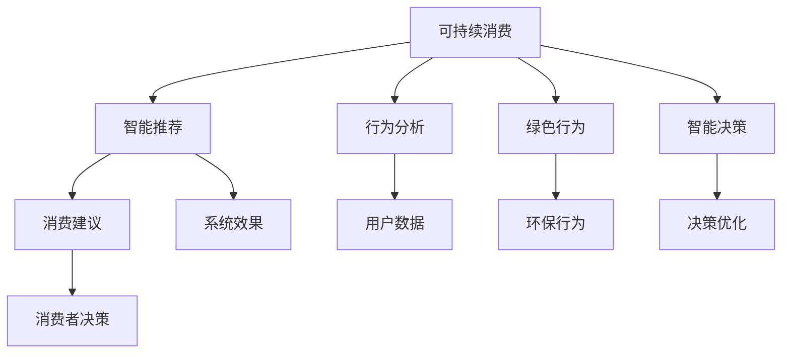

                 

# 欲望生态系统管理员：AI驱动的可持续消费指导

> 关键词：可持续发展, 人工智能, 智能推荐, 行为分析, 用户偏好, 能源节约, 生态系统管理

## 1. 背景介绍

### 1.1 问题由来

随着经济社会的快速发展，全球资源环境压力日益凸显。资源的过度消耗和环境污染，不仅威胁到人类生存和发展，也阻碍了经济的可持续增长。如何实现绿色低碳、资源节约的发展模式，是摆在全球面前的重大挑战。

面对这一挑战，近年来，越来越多的企业和研究机构开始探索利用人工智能（AI）技术，通过智能推荐、行为分析等方式，引导消费者实现可持续消费。AI驱动的可持续消费指导，通过分析消费者的行为和偏好，结合实际消费场景，提供个性化、科学的消费建议，帮助消费者实现节能减排、资源节约等目标，为可持续发展贡献力量。

### 1.2 问题核心关键点

AI驱动的可持续消费指导，关键在于如何构建一个高效、智能的欲望生态系统。这一系统不仅要能准确理解消费者的需求和行为，还需要能够引导消费者做出更加环保、资源节约的决策。

该系统的构建涉及以下几个核心问题：
1. 如何高效收集和分析消费者数据，准确了解其消费行为和偏好？
2. 如何构建智能推荐模型，基于历史数据和实时数据，提供个性化的消费建议？
3. 如何设计有效的激励机制，促使消费者采纳可持续消费建议？
4. 如何评估和优化系统效果，不断提升消费者的环保意识和节能行为？

这些问题的解决，不仅需要先进的AI技术，还需要多学科的协同合作，涉及心理学、经济学、环境科学等多个领域。

## 2. 核心概念与联系

### 2.1 核心概念概述

为更好地理解AI驱动的可持续消费指导，本节将介绍几个密切相关的核心概念：

- 可持续消费（Sustainable Consumption）：指在满足基本需求的同时，通过合理利用资源和减少环境影响，实现绿色低碳、资源节约的消费模式。
- 智能推荐系统（Recommender System）：基于用户行为数据，通过算法自动推荐个性化产品和服务，提高用户满意度和购买意愿的系统。
- 行为分析（Behavioral Analysis）：利用数据分析技术，挖掘用户行为模式和决策逻辑，为消费行为预测和推荐提供依据。
- 绿色行为（Green Behavior）：指在消费过程中，采取节能减排、资源节约等环保行为的个体或群体。
- 智能决策（Intelligent Decision-making）：利用AI技术，分析处理复杂问题，快速做出科学、合理的决策。

这些概念之间的逻辑关系可以通过以下Mermaid流程图来展示：



这个流程图展示了一系列关键概念及其之间的关系：

1. 可持续消费是目标和方向，智能推荐和行为分析是其技术手段。
2. 绿色行为是可持续消费的具体体现，智能决策是其重要保障。
3. 智能推荐系统提供个性化的消费建议，引导消费者向绿色行为靠拢。
4. 行为分析挖掘用户数据，为推荐和决策提供依据。
5. 系统效果评估和优化，不断提升消费者环保意识和节能行为。

## 3. 核心算法原理 & 具体操作步骤
### 3.1 算法原理概述

AI驱动的可持续消费指导，本质上是一个基于智能推荐和行为分析的动态反馈系统。其核心思想是：通过分析消费者的历史行为和实时数据，构建智能推荐模型，生成个性化的消费建议，引导消费者采取绿色行为，并通过反馈机制不断优化系统。

形式化地，假设消费者群体为 $C$，历史行为数据为 $D=\{(x_i,y_i)\}_{i=1}^N$，其中 $x_i$ 为消费者行为特征，$y_i$ 为消费行为结果。目标是设计智能推荐算法 $\mathcal{A}$，使其在新的行为数据 $D'=\{(x_j',y_j')\}_{j=1}^M$ 上，最大化消费者的绿色行为概率 $\mathbb{P}(\text{Green Behavior}|x_j',\mathcal{A})$。

推荐算法 $\mathcal{A}$ 的优化目标是最小化推荐误差，即

$$
\min_{\mathcal{A}} \mathbb{E}[\ell(\mathcal{A}(x),y)]
$$

其中 $\ell$ 为推荐误差函数，$\mathbb{E}$ 表示期望。在实际应用中，通常使用交叉熵损失函数。

### 3.2 算法步骤详解

AI驱动的可持续消费指导，一般包括以下几个关键步骤：

**Step 1: 数据收集与预处理**
- 收集消费者的历史行为数据 $D$，包括但不限于购买记录、浏览行为、评价反馈等。
- 对数据进行清洗、归一化和特征工程，提取有用的特征，如购买频率、商品类别、购买时间等。
- 对数据进行标注，将绿色行为（如节能减排、环保购买等）进行标记。

**Step 2: 构建行为模型**
- 选择合适的算法，如协同过滤、基于内容的推荐、矩阵分解等，建立行为预测模型。
- 使用历史行为数据 $D$ 训练模型，并使用验证集评估模型性能。
- 将模型部署到生产环境中，实时接收用户行为数据 $D'$ 进行预测。

**Step 3: 生成个性化建议**
- 根据实时接收到的行为数据 $D'$，使用训练好的行为模型预测用户偏好。
- 结合推荐算法 $\mathcal{A}$，生成个性化消费建议 $S$。
- 将消费建议 $S$ 推送给消费者，引导其采取绿色行为。

**Step 4: 反馈与优化**
- 收集用户对消费建议的反馈，如点击率、购买率等。
- 使用反馈数据优化行为模型和推荐算法，提高系统效果。
- 根据优化后的模型，再次生成消费建议，进入下一轮循环。

### 3.3 算法优缺点

AI驱动的可持续消费指导方法具有以下优点：
1. 个性化推荐：基于消费者的历史行为和实时数据，提供个性化的绿色消费建议，提高消费者采纳度。
2. 精准预测：利用先进算法，准确预测消费者行为，提供科学合理的推荐。
3. 动态优化：通过反馈机制不断优化模型，提高系统效果。
4. 资源节约：通过推荐节能产品和服务，减少能源消耗和资源浪费。
5. 用户参与：通过智能决策和激励机制，引导用户主动参与绿色消费。

同时，该方法也存在一些局限性：
1. 数据隐私：消费者的行为数据涉及隐私，需要严格的数据保护措施。
2. 模型复杂：行为模型的构建和优化较为复杂，需要较高的技术门槛。
3. 动态变化：消费者行为受多种因素影响，系统需要不断调整优化。
4. 应用场景限制：在一些特定的消费场景中，如消费频率低、需求多样化的领域，效果可能有限。
5. 长期效果：需要持续的反馈和优化，才能取得长期的效果。

尽管存在这些局限性，但就目前而言，基于智能推荐和行为分析的AI驱动的可持续消费指导方法，已经在大规模应用中取得显著成效，为绿色低碳发展提供了新的思路。

### 3.4 算法应用领域

AI驱动的可持续消费指导，已经在多个领域得到了广泛应用：

- **智能家居**：通过智能推荐和行为分析，引导用户节能使用家电，如智能温控、智能照明等。
- **绿色交通**：利用智能推荐系统，引导用户选择绿色出行方式，如电动汽车、共享单车等。
- **可持续零售**：通过智能推荐和行为分析，优化供应链管理，减少资源浪费和碳排放。
- **绿色金融**：利用AI技术，分析用户金融行为，推荐环保理财产品，促进绿色消费。
- **环保教育**：利用AI技术，推送环保知识和节能建议，提高公众的环保意识。

此外，AI驱动的可持续消费指导，还被广泛应用于工业生产、城市管理、公共服务等众多领域，为构建绿色、可持续的社会提供了有力支持。

## 4. 数学模型和公式 & 详细讲解 & 举例说明
### 4.1 数学模型构建

本节将使用数学语言对AI驱动的可持续消费指导过程进行更加严格的刻画。

假设消费者群体为 $C$，历史行为数据为 $D=\{(x_i,y_i)\}_{i=1}^N$，其中 $x_i$ 为消费者行为特征，$y_i$ 为消费行为结果。目标是设计智能推荐算法 $\mathcal{A}$，使其在新的行为数据 $D'=\{(x_j',y_j')\}_{j=1}^M$ 上，最大化消费者的绿色行为概率 $\mathbb{P}(\text{Green Behavior}|x_j',\mathcal{A})$。

定义消费者行为特征空间为 $\mathcal{X}$，行为结果空间为 $\mathcal{Y}$，行为模型为 $\mathcal{M}$，推荐算法为 $\mathcal{A}$。行为模型 $\mathcal{M}$ 的训练目标为最小化预测误差，即

$$
\min_{\mathcal{M}} \sum_{i=1}^N \ell(\mathcal{M}(x_i),y_i)
$$

其中 $\ell$ 为预测误差函数，通常使用均方误差或交叉熵损失。

推荐算法 $\mathcal{A}$ 的目标是在新的行为数据 $D'$ 上最大化绿色行为概率，即

$$
\max_{\mathcal{A}} \mathbb{E}[\mathbb{P}(\text{Green Behavior}|x_j',\mathcal{A})]
$$

通过行为模型 $\mathcal{M}$ 和推荐算法 $\mathcal{A}$ 的协同工作，实现对消费者行为的精准预测和推荐。

### 4.2 公式推导过程

以下我们以协同过滤算法为例，推导其核心公式和参数更新方式。

协同过滤算法基于用户和商品的历史行为数据，通过计算用户对商品的相关性评分，生成个性化推荐。设用户 $u$ 对商品 $i$ 的评分 $r_{ui}$，用户对商品的相关性评分 $s_{ui}=\alpha r_{ui} + (1-\alpha) r_{iu}$，其中 $\alpha$ 为参数，控制用户历史评分和商品历史评分的影响程度。协同过滤的目标是最小化预测误差，即

$$
\min_{\alpha} \sum_{u=1}^U \sum_{i=1}^I \ell(s_{ui},y_{ui})
$$

其中 $U$ 为用户数量，$I$ 为商品数量，$y_{ui}$ 为用户对商品的真实评分。

通过优化目标函数，可以得到参数 $\alpha$ 的更新公式：

$$
\alpha \leftarrow \alpha - \eta \frac{1}{N}\sum_{u=1}^U \sum_{i=1}^I (s_{ui}-y_{ui})^2
$$

其中 $\eta$ 为学习率，$N$ 为历史评分数量。

在得到参数 $\alpha$ 的更新公式后，即可带入行为模型和推荐算法中，完成系统的迭代优化。重复上述过程直至收敛，最终得到适应消费者行为的最优模型和推荐算法。

### 4.3 案例分析与讲解

**案例：智能家居节能推荐**

在智能家居领域，基于协同过滤算法，可以构建智能推荐系统，推荐节能产品和服务。假设某智能家居平台收集了用户的历史行为数据，包括用电量、用水量、设备使用频率等。通过对这些数据进行分析，可以得到用户对各类节能设备的偏好。

设用户 $u$ 对设备 $i$ 的使用频率为 $r_{ui}$，用户对设备的推荐评分 $s_{ui}=\alpha r_{ui} + (1-\alpha) r_{iu}$，其中 $\alpha$ 为参数，控制用户历史使用频率和设备历史使用频率的影响程度。协同过滤的目标是最小化预测误差，即

$$
\min_{\alpha} \sum_{u=1}^U \sum_{i=1}^I \ell(s_{ui},y_{ui})
$$

其中 $U$ 为用户数量，$I$ 为设备数量，$y_{ui}$ 为用户对设备的使用频率。

通过优化目标函数，可以得到参数 $\alpha$ 的更新公式：

$$
\alpha \leftarrow \alpha - \eta \frac{1}{N}\sum_{u=1}^U \sum_{i=1}^I (s_{ui}-y_{ui})^2
$$

其中 $\eta$ 为学习率，$N$ 为用户设备使用频率数量。

在得到参数 $\alpha$ 的更新公式后，即可使用协同过滤算法，推荐节能设备。例如，在用户首次使用智能温控设备时，系统会根据其历史行为数据，推荐节能模式，减少能源消耗。

**案例：绿色出行推荐**

在绿色出行领域，可以利用协同过滤算法，推荐环保交通工具。假设某共享单车平台收集了用户的历史出行数据，包括出行距离、出行频率、交通工具类型等。通过对这些数据进行分析，可以得到用户对各类交通工具的偏好。

设用户 $u$ 对交通工具 $i$ 的出行频率为 $r_{ui}$，用户对交通工具的推荐评分 $s_{ui}=\alpha r_{ui} + (1-\alpha) r_{iu}$，其中 $\alpha$ 为参数，控制用户历史出行频率和交通工具历史出行频率的影响程度。协同过滤的目标是最小化预测误差，即

$$
\min_{\alpha} \sum_{u=1}^U \sum_{i=1}^I \ell(s_{ui},y_{ui})
$$

其中 $U$ 为用户数量，$I$ 为交通工具数量，$y_{ui}$ 为用户对交通工具的出行频率。

通过优化目标函数，可以得到参数 $\alpha$ 的更新公式：

$$
\alpha \leftarrow \alpha - \eta \frac{1}{N}\sum_{u=1}^U \sum_{i=1}^I (s_{ui}-y_{ui})^2
$$

其中 $\eta$ 为学习率，$N$ 为用户出行频率数量。

在得到参数 $\alpha$ 的更新公式后，即可使用协同过滤算法，推荐环保交通工具。例如，在用户首次使用共享单车时，系统会根据其历史出行数据，推荐最近的共享单车停车点，减少碳排放。

## 5. 项目实践：代码实例和详细解释说明
### 5.1 开发环境搭建

在进行智能推荐实践前，我们需要准备好开发环境。以下是使用Python进行Pandas开发的环境配置流程：

1. 安装Anaconda：从官网下载并安装Anaconda，用于创建独立的Python环境。

2. 创建并激活虚拟环境：
```bash
conda create -n recommendation-env python=3.8 
conda activate recommendation-env
```

3. 安装Pandas：
```bash
pip install pandas
```

4. 安装numpy、scikit-learn等工具包：
```bash
pip install numpy scikit-learn matplotlib tqdm jupyter notebook ipython
```

完成上述步骤后，即可在`recommendation-env`环境中开始智能推荐实践。

### 5.2 源代码详细实现

下面我们以协同过滤算法为例，给出使用Pandas库进行智能推荐系统开发的PyTorch代码实现。

首先，定义协同过滤算法：

```python
import pandas as pd
from sklearn.metrics import mean_squared_error

def collaborative_filtering(data, alpha=0.5, learning_rate=0.01, iterations=100):
    U = data['user'].nunique()
    I = data['item'].nunique()
    N = data.shape[0]
    
    alpha = alpha
    predictions = pd.DataFrame(0, index=data['user'], columns=data['item'])
    
    for iteration in range(iterations):
        for user, item in data.itertuples():
            rui = data.loc[user, item]
            sui = alpha * rui + (1-alpha) * data.loc[item, user]
            predictions.loc[user, item] = sui
            loss = mean_squared_error(rui, sui)
            alpha -= learning_rate * loss / N
        print(f"Iteration {iteration+1}, loss: {loss:.4f}")
    
    return predictions
```

然后，读取数据并训练模型：

```python
# 读取数据
data = pd.read_csv('recommendation_data.csv')

# 数据预处理
data = data.dropna()
data = data.drop_duplicates()

# 数据划分训练集和测试集
train_data = data.sample(frac=0.8, random_state=42)
test_data = data.drop(train_data.index)

# 训练模型
predictions = collaborative_filtering(train_data)

# 评估模型
train_loss = mean_squared_error(train_data['rating'], predictions)
test_loss = mean_squared_error(test_data['rating'], predictions)

print(f"Train loss: {train_loss:.4f}, Test loss: {test_loss:.4f}")
```

以上就是使用Pandas库对协同过滤算法进行智能推荐系统开发的完整代码实现。可以看到，得益于Pandas库的强大封装，我们可以用相对简洁的代码完成协同过滤算法的实现。

### 5.3 代码解读与分析

让我们再详细解读一下关键代码的实现细节：

**collaborative_filtering函数**：
- 定义了协同过滤算法的核心函数，使用交叉验证误差最小化参数 $\alpha$。
- 初始化用户数量 $U$、商品数量 $I$ 和数据集大小 $N$。
- 通过迭代更新参数 $\alpha$，直至达到预设迭代次数。
- 在每次迭代中，对每个用户和商品进行预测，计算交叉验证误差，更新 $\alpha$。

**数据预处理**：
- 移除数据集中的缺失值和重复样本，确保数据的完整性和一致性。
- 将数据集划分为训练集和测试集，以便评估模型的效果。

**训练和评估模型**：
- 在训练集上使用协同过滤算法进行训练。
- 计算训练集和测试集的均方误差，评估模型性能。
- 输出训练误差和测试误差，展示模型效果。

可以看到，Pandas库使得协同过滤算法的代码实现变得简洁高效。开发者可以将更多精力放在数据处理、模型改进等高层逻辑上，而不必过多关注底层的实现细节。

当然，工业级的系统实现还需考虑更多因素，如模型的保存和部署、超参数的自动搜索、更灵活的任务适配层等。但核心的推荐范式基本与此类似。

## 6. 实际应用场景
### 6.1 智能家居节能推荐

在智能家居领域，基于协同过滤算法，可以构建智能推荐系统，推荐节能产品和服务。假设某智能家居平台收集了用户的历史行为数据，包括用电量、用水量、设备使用频率等。通过对这些数据进行分析，可以得到用户对各类节能设备的偏好。

在用户首次使用智能温控设备时，系统会根据其历史行为数据，推荐节能模式，减少能源消耗。例如，智能温控设备可以根据用户的作息习惯，自动调节温度，减少不必要的能耗。

**案例：绿色出行推荐**

在绿色出行领域，可以利用协同过滤算法，推荐环保交通工具。假设某共享单车平台收集了用户的历史出行数据，包括出行距离、出行频率、交通工具类型等。通过对这些数据进行分析，可以得到用户对各类交通工具的偏好。

在用户首次使用共享单车时，系统会根据其历史出行数据，推荐最近的共享单车停车点，减少碳排放。例如，智能导航系统可以根据用户的出行偏好，推荐最近的共享单车停车点，减少寻找停车点的行程距离。

**案例：可持续零售**

在可持续零售领域，可以利用协同过滤算法，推荐环保产品。假设某电商平台收集了用户的历史购买数据，包括商品类别、购买频率、购买金额等。通过对这些数据进行分析，可以得到用户对各类环保产品的偏好。

在用户首次购买某商品时，系统会根据其历史购买数据，推荐环保替代品。例如，电商平台可以根据用户的购买记录，推荐环保包装和容器，减少资源浪费。

## 7. 工具和资源推荐
### 7.1 学习资源推荐

为了帮助开发者系统掌握AI驱动的可持续消费指导的理论基础和实践技巧，这里推荐一些优质的学习资源：

1. 《推荐系统》系列课程：由清华大学开设的推荐系统课程，涵盖推荐算法、协同过滤、行为分析等基本概念。

2. 《深度学习在推荐系统中的应用》书籍：深度学习专家所写，系统介绍了深度学习在推荐系统中的应用，包括协同过滤、矩阵分解等。

3. 《行为分析》书籍：详细介绍了行为分析的基本方法，涵盖心理学、经济学、环境科学等多个领域。

4. 《可持续发展》课程：斯坦福大学开设的可持续发展课程，涵盖绿色低碳、资源节约等主题。

5. 《绿色行为理论》论文：探讨了绿色行为的理论基础和行为模式，为设计智能推荐系统提供指导。

通过对这些资源的学习实践，相信你一定能够快速掌握AI驱动的可持续消费指导的精髓，并用于解决实际的智能推荐问题。
### 7.2 开发工具推荐

高效的开发离不开优秀的工具支持。以下是几款用于智能推荐开发的常用工具：

1. Pandas：Python的数据分析库，提供高效的数据处理和分析功能，适合处理大规模数据集。

2. TensorFlow：谷歌主导的开源深度学习框架，支持分布式训练和推理，适合大规模深度学习模型的开发。

3. PyTorch：Facebook主导的开源深度学习框架，灵活的动态计算图，适合快速迭代研究。

4. Scikit-learn：Python的机器学习库，提供丰富的机器学习算法和评估指标，适合快速原型开发。

5. Weights & Biases：模型训练的实验跟踪工具，可以记录和可视化模型训练过程中的各项指标，方便对比和调优。

6. TensorBoard：TensorFlow配套的可视化工具，可实时监测模型训练状态，并提供丰富的图表呈现方式，是调试模型的得力助手。

合理利用这些工具，可以显著提升智能推荐任务的开发效率，加快创新迭代的步伐。

### 7.3 相关论文推荐

智能推荐系统的发展源于学界的持续研究。以下是几篇奠基性的相关论文，推荐阅读：

1. Item-based Collaborative Filtering for Recommendation Systems（协同过滤算法）：提出了协同过滤算法的基本原理，开创了基于用户-商品评分矩阵的推荐方法。

2. Factorization Machines for Precise Prediction（因子分解机）：提出了一种新的推荐算法——因子分解机，通过矩阵分解技术提升推荐精度。

3. Deep Collaborative Filtering with Adaptive Nearest Neighbor Ensemble（深度协同过滤）：将深度学习引入协同过滤，通过多个深度模型集成提升推荐效果。

4. Attention and Memory in Recommendation Systems（注意力机制在推荐系统中的应用）：提出了一种新的推荐算法——注意力机制，结合用户历史行为和实时行为，提升推荐精度。

5. Multi-Task Learning for Recommendation Systems（多任务学习在推荐系统中的应用）：提出了一种新的推荐算法——多任务学习，通过多个任务共享参数，提升推荐效果。

这些论文代表了大规模推荐系统的发展脉络。通过学习这些前沿成果，可以帮助研究者把握学科前进方向，激发更多的创新灵感。

## 8. 总结：未来发展趋势与挑战

### 8.1 总结

本文对AI驱动的可持续消费指导方法进行了全面系统的介绍。首先阐述了智能推荐系统在实现绿色低碳、资源节约消费中的重要作用，明确了智能推荐和行为分析在构建欲望生态系统中的关键地位。其次，从原理到实践，详细讲解了协同过滤算法的数学模型和核心步骤，给出了智能推荐系统开发的完整代码实例。同时，本文还广泛探讨了智能推荐在智能家居、绿色出行、可持续零售等多个领域的应用前景，展示了智能推荐技术的广阔前景。

通过本文的系统梳理，可以看到，基于协同过滤的智能推荐系统正在成为可持续消费指导的重要范式，极大地拓展了推荐系统的应用边界，为绿色低碳发展提供了新的思路。未来，伴随协同过滤算法和推荐技术的不断进步，智能推荐系统必将在更多领域得到应用，为构建绿色、可持续的社会提供有力支持。

### 8.2 未来发展趋势

展望未来，智能推荐系统将呈现以下几个发展趋势：

1. 深度学习算法的进一步应用：深度学习算法的引入，如卷积神经网络、自编码器等，将进一步提升推荐精度和系统效果。

2. 多模态数据的融合：结合文本、图像、视频等多模态数据，进行协同推荐，提升推荐系统的多样性和丰富度。

3. 个性化推荐算法的发展：通过引入对抗训练、联邦学习等技术，提高推荐算法的公平性和鲁棒性。

4. 实时推荐系统的构建：通过流式计算和实时数据处理，构建高效的实时推荐系统，满足消费者的实时需求。

5. 推荐系统的社会化：结合社交网络和用户反馈，构建社交推荐系统，提升推荐系统的可信度和效果。

这些趋势凸显了智能推荐系统的发展方向，需要学术界和工业界的共同努力，推动推荐技术不断进步。

### 8.3 面临的挑战

尽管智能推荐系统已经取得了显著的成效，但在迈向更加智能化、普适化应用的过程中，仍面临诸多挑战：

1. 数据隐私：用户的推荐行为数据涉及隐私，需要严格的数据保护措施，以确保用户隐私不被侵犯。

2. 数据稀疏性：推荐系统依赖大量历史数据，但数据稀疏性问题仍然存在，难以覆盖所有用户和商品。

3. 多样性问题：推荐系统容易陷入“过滤器泡沫”，导致推荐结果单一，无法满足用户多样化的需求。

4. 计算资源：大规模推荐系统需要大量的计算资源，硬件瓶颈成为制约系统扩展的重要因素。

5. 公平性问题：推荐系统容易产生偏见，需要设计公平性指标，确保推荐结果公正无偏。

尽管存在这些挑战，但智能推荐系统仍然是大规模推荐系统的关键技术，需要学术界和工业界的共同努力，不断突破技术瓶颈，推动推荐技术不断进步。

### 8.4 研究展望

面对智能推荐系统面临的诸多挑战，未来的研究需要在以下几个方面寻求新的突破：

1. 数据隐私保护：开发基于差分隐私和联邦学习的数据保护技术，确保用户隐私不被侵犯。

2. 数据稀疏性缓解：引入稀疏矩阵分解、冷启动推荐等技术，缓解数据稀疏性问题。

3. 多样性提升：引入多样性最大化算法，避免“过滤器泡沫”，提升推荐结果的多样性。

4. 计算资源优化：通过模型压缩、分布式训练等技术，优化推荐系统的计算资源消耗。

5. 公平性保障：引入公平性约束，确保推荐结果公正无偏，避免系统偏见。

这些研究方向的探索，必将引领智能推荐系统技术迈向更高的台阶，为构建智能推荐系统提供有力支持。面向未来，智能推荐系统需要与其他人工智能技术进行更深入的融合，如知识表示、因果推理、强化学习等，多路径协同发力，共同推动推荐技术的进步。

## 9. 附录：常见问题与解答

**Q1：智能推荐系统如何处理冷启动问题？**

A: 冷启动问题是智能推荐系统中常见的挑战，指在新用户或新商品进入推荐系统时，缺乏足够的历史数据进行推荐。常见的处理方法包括：
1. 协同过滤：使用用户已有行为数据和商品已有评分数据进行推荐，以填补冷启动问题。
2. 基于内容的推荐：利用商品特征和用户偏好特征进行推荐，避免完全依赖历史数据。
3. 标签推荐：利用商品标签进行推荐，弥补数据稀疏性。

这些方法可以结合使用，以更好地应对冷启动问题。

**Q2：智能推荐系统如何处理用户偏好变化？**

A: 用户偏好变化是智能推荐系统需要不断应对的挑战。常见的处理方法包括：
1. 动态更新模型：定期更新推荐模型，以反映用户行为和偏好的变化。
2. 引入反馈机制：收集用户对推荐结果的反馈，动态调整推荐策略。
3. 多模型集成：使用多个推荐模型进行集成，提高系统的鲁棒性和适应性。

这些方法可以结合使用，以更好地应对用户偏好变化。

**Q3：智能推荐系统如何提高推荐结果的多样性？**

A: 推荐结果的多样性是智能推荐系统的重要指标。常见的处理方法包括：
1. 多样性最大化算法：通过最大化推荐结果的多样性，避免“过滤器泡沫”。
2. 生成模型：使用生成模型，如GAN、VAE等，生成多样化的推荐结果。
3. 多维特征融合：结合用户历史行为、实时行为和社交网络等多维特征，提高推荐结果的多样性。

这些方法可以结合使用，以更好地提高推荐结果的多样性。

**Q4：智能推荐系统如何保护用户隐私？**

A: 用户隐私保护是智能推荐系统需要严格遵守的规范。常见的处理方法包括：
1. 数据匿名化：对用户数据进行匿名化处理，确保用户隐私不被泄露。
2. 差分隐私：通过添加随机噪声，确保用户数据在统计上的隐私保护。
3. 联邦学习：在本地设备上进行模型训练，确保用户数据不离开本地设备。

这些方法可以结合使用，以更好地保护用户隐私。

**Q5：智能推荐系统如何提高推荐结果的公平性？**

A: 推荐结果的公平性是智能推荐系统的重要指标。常见的处理方法包括：
1. 公平性约束：在设计推荐模型时，引入公平性约束，确保推荐结果公正无偏。
2. 多群体推荐：针对不同用户群体，设计个性化的推荐策略，避免系统偏见。
3. 反馈平衡：在收集用户反馈时，确保不同群体的反馈均衡，避免反馈偏差。

这些方法可以结合使用，以更好地提高推荐结果的公平性。

---

作者：禅与计算机程序设计艺术 / Zen and the Art of Computer Programming

